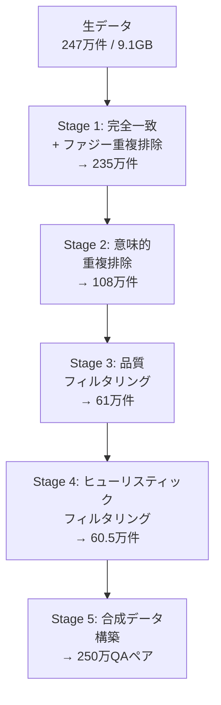

本記事は [NVIDIA Technical Blog: Boost Embedding Model Accuracy for Custom Information Retrieval](https://developer.nvidia.com/blog/boost-embedding-model-accuracy-for-custom-information-retrieval/)（2025年6月25日公開）の解説記事です。

## ブログ概要（Summary）

NVIDIAのTechnical Blogで公開された本記事は、会話型AIアナリティクスプラットフォーム「Coxwave Align」が、NVIDIA NeMo Curatorを活用してデータキュレーション主導のアプローチで埋め込みモデルの精度を改善した事例を紹介している。ブログによると、約240万件の会話サンプルから5段階のフィルタリングで60.5万件に絞り込み、Fine-tuning済みモデルがNDCG@10で15-16%の精度向上と6倍の訓練時間短縮を達成したとされている。

この記事は [Zenn記事: Embedding Fine-tuning実践：合成データと評価ループでRAG検索精度を改善する](https://zenn.dev/0h_n0/articles/3a80f7fd58cc8e) の深掘りです。

## 情報源

- **種別**: 企業テックブログ（NVIDIA公式）
- **URL**: [https://developer.nvidia.com/blog/boost-embedding-model-accuracy-for-custom-information-retrieval/](https://developer.nvidia.com/blog/boost-embedding-model-accuracy-for-custom-information-retrieval/)
- **組織**: NVIDIA / Coxwave
- **著者**: Nirmal Kumar Juluru, Chanran Kim
- **発表日**: 2025年6月25日

## 技術的背景（Technical Background）

埋め込みモデルのFine-tuningにおいて、**訓練データの質が訓練データの量よりも重要**であることは経験的に知られているが、体系的なデータキュレーションの方法論は十分に確立されていない。

NVIDIAブログで紹介されるCoxwaveの事例は、この「質 vs 量」の問題に対するエンジニアリング的な回答を提供している。汎用の埋め込みモデルは静的なドキュメント検索には適しているが、マルチターン会話履歴の検索には適さない。会話データは以下の特性を持つ。

1. **ターンベースの構造**: 発言が交互に続き、文脈が変化する
2. **意図の暗黙性**: 明示的なキーワードがなく、文脈依存の意図が多い
3. **冗長性**: 同一トピックの繰り返しや重複が多い

これらの特性は、Zenn記事で紹介されている「ドメイン語彙の乖離」「クエリ特性の違い」の具体例であり、Fine-tuningが有効なケースに該当する。

## 実装アーキテクチャ（Architecture）

### 5段階データキュレーションパイプライン

Coxwaveが実装したパイプラインは、約240万件の会話サンプル（9.1GB）を5段階で60.5万件（76%削減）に絞り込む。



### Stage 1: 完全一致 + ファジー重複排除

ハッシュベースの完全一致排除と、MinHashシグネチャ + Locality Sensitive Hashing（LSH）によるファジー重複排除を実施。ブログによると、この段階でデータの約5%（247万→235万件）が削減された。

### Stage 2: 意味的重複排除

埋め込みベースのクラスタリングにより、意味的に類似したドキュメントを検出・排除する。NVIDIAのRAPIDSライブラリによるGPU加速処理が活用されている。ブログによると、この段階が最も効果的であり、フィルタ後のデータの約57%（235万→108万件）が削減されたとされている。

### Stage 3: 品質フィルタリング

NVIDIAの品質分類器モデル（quality-classifier-deberta）を使用し、テキストを「高」「中」「低」品質に分類する。ブログによると、108万件→61万件に削減されたとされている。

### Stage 4: ヒューリスティックフィルタリング

過剰な句読点、URL、繰り返しパターンを含む会話をカスタムルールで除去。ブログによると、5,000件が追加で除去され、60.5万件の最終サンプルが得られたとされている。

### Stage 5: 合成データ構築

各会話に対して5つの合成クエリ（ポジティブ2件、ハードネガティブ3件）を生成し、約300万件の初期QAペアを作成。品質検証により250万件の高品質ペアに絞り込む。

```python
from dataclasses import dataclass


@dataclass
class SyntheticQueryPair:
    """合成クエリとドキュメントのペア"""
    query: str
    positive_doc: str
    hard_negatives: list[str]
    quality_score: float


def generate_synthetic_pairs(
    conversations: list[str],
    num_positive: int = 2,
    num_hard_negative: int = 3,
) -> list[SyntheticQueryPair]:
    """会話データから合成QAペアを生成する

    Args:
        conversations: 会話テキストのリスト
        num_positive: ポジティブクエリ数
        num_hard_negative: ハードネガティブ数

    Returns:
        合成QAペアのリスト
    """
    pairs = []
    for conv in conversations:
        # LLMでポジティブクエリを生成
        positive_queries = generate_positive_queries(conv, num_positive)

        # ハードネガティブを生成（意味的に近いが正解でないクエリ）
        hard_negs = generate_hard_negatives(conv, num_hard_negative)

        for query in positive_queries:
            pairs.append(SyntheticQueryPair(
                query=query,
                positive_doc=conv,
                hard_negatives=hard_negs,
                quality_score=0.0,  # 後で品質評価
            ))

    return pairs
```

## Production Deployment Guide

### AWS実装パターン（コスト最適化重視）

データキュレーション + Fine-tuningパイプラインをAWS上に構築する場合の推奨構成を示す。

| 規模 | 月間リクエスト | 推奨構成 | 月額コスト | 主要サービス |
|------|--------------|---------|-----------|------------|
| **Small** | ~3,000 (100/日) | Serverless | $50-150 | Lambda + SageMaker Serverless |
| **Medium** | ~30,000 (1,000/日) | Hybrid | $400-900 | SageMaker Real-time + ElastiCache |
| **Large** | 300,000+ (10,000/日) | Container | $2,000-5,000 | EKS + Karpenter + Spot GPU |

**データキュレーションパイプラインのコスト**:
- SageMaker Processing Job（GPU）: $10-50/回（データ量に依存）
- S3ストレージ（生データ + キュレーション済み）: $5-20/月
- Step Functions（パイプラインオーケストレーション）: $1/月

**コスト削減テクニック**:
- SageMaker Spot Training: Fine-tuningジョブで最大90%削減
- NeMo Curator: GPU加速処理で処理時間（≒コスト）を大幅削減
- データキュレーションにより訓練データを76%削減 → 訓練時間6倍短縮

**コスト試算の注意事項**: 上記は2026年3月時点のAWS ap-northeast-1リージョン料金に基づく概算値である。データキュレーションのGPU処理時間はデータ量に比例するため、最新料金は[AWS料金計算ツール](https://calculator.aws/)で確認されたい。

### Terraformインフラコード

**データキュレーションパイプライン構成**:

```hcl
resource "aws_sagemaker_processing_job" "data_curation" {
  processing_job_name = "embedding-data-curation"
  role_arn            = aws_iam_role.sagemaker_execution.arn

  processing_resources {
    cluster_config {
      instance_count = 1
      instance_type  = "ml.g5.xlarge"
      volume_size_in_gb = 100
    }
  }

  app_specification {
    image_uri = "nvcr.io/nvidia/nemo:24.07"
    container_entrypoint = ["python3"]
    container_arguments  = ["curation_pipeline.py"]
  }

  processing_inputs {
    input_name = "raw-data"
    s3_input {
      s3_uri        = "s3://${aws_s3_bucket.data.bucket}/raw/"
      s3_data_type  = "S3Prefix"
      local_path    = "/opt/ml/processing/input"
    }
  }

  processing_outputs {
    output_name = "curated-data"
    s3_output {
      s3_uri     = "s3://${aws_s3_bucket.data.bucket}/curated/"
      local_path = "/opt/ml/processing/output"
      s3_upload_mode = "EndOfJob"
    }
  }
}
```

### コスト最適化チェックリスト

- [ ] データキュレーション: SageMaker Processing Job（GPU）で一括処理
- [ ] Spot Training: Fine-tuningジョブで最大90%削減
- [ ] データ削減効果: キュレーションで76%データ削減 → 訓練時間6倍短縮
- [ ] S3ライフサイクル: 生データは30日後にGlacierへ移行
- [ ] SageMaker Savings Plans: 1年コミットで最大64%削減
- [ ] 埋め込みキャッシュ: ElastiCacheで重複計算排除
- [ ] 品質分類器: NeMo Curator品質モデルでデータ品質を自動判定
- [ ] AWS Budgets設定（80%警告、100%アラート）
- [ ] CloudWatch 監視（Processing Job実行時間、Training Job損失推移）
- [ ] Cost Anomaly Detection有効化

## パフォーマンス最適化（Performance）

### 定量的な成果

Coxwaveがブログで報告している成果は以下のとおりである。

| 指標 | 改善前 | 改善後 | 改善率 |
|------|--------|--------|--------|
| NDCG@10 | ベースライン | +15-16% | — |
| Recall@10 | ベースライン | 大幅改善 | — |
| 訓練時間 | 32時間 | 5時間 | **6倍短縮** |
| 計算コスト | ベースライン | ベースラインの20% | **80%削減** |
| 訓練データ量 | 247万件 | 60.5万件 | 76%削減 |

評価は1,500クエリ × 9,100会話で実施されたとブログで報告されている。

### キュレーションの効果分析

ブログによると、データキュレーションが訓練時間の6倍短縮をもたらした主因は以下のとおりである。

1. **冗長データの排除**: 意味的重複排除で57%のデータが削減され、モデルが重複パターンの学習に費やす無駄な計算を排除
2. **低品質データの除去**: 品質フィルタリングで「低品質」データを除去し、学習の安定性が向上（損失の振動が減少）
3. **収束の高速化**: キュレーション済みデータでの訓練は、損失の振動が少なく、より速く収束する

Coxwave AIリサーチチームリードのSangyeop Kim氏は、「訓練データサイズの削減が訓練時間を6倍短縮し、モデルの収束速度を大幅に改善し、計算コストを80%節約した」と述べている。

## 運用での学び（Production Lessons）

**データ量より品質**: ブログで最も強調されているメッセージは、「データキュレーションはデータ量の増加よりも効果的」という点である。これはZenn記事で「最低500ペア以上を推奨」と述べている一方で、データ品質の重要性を補完する知見である。

**GPU加速キュレーション**: NVIDIA NeMo CuratorのGPU加速処理（RAPIDSライブラリ）により、240万件のデータに対する意味的重複排除が実用的な時間で完了する。CPU処理では数日かかる処理がGPUでは数時間に短縮される。

**ハードネガティブの品質**: 合成データ構築段階でハードネガティブの品質を厳密に検証することが、モデルの判別能力向上に直結している。Zenn記事で紹介されている「Hard Negativeマイニング」のアプローチと共通する知見である。

## 学術研究との関連（Academic Connection）

NVIDIAブログのアプローチは、以下の学術研究との関連が深い。

- **データキュレーションの重要性**: Penedo et al.（2024）のFineWebや、Soldaini et al.（2024）のDolmaなど、大規模データセットのキュレーション研究が近年活発化しており、「データ品質が量より重要」という知見は言語モデル全般で確認されている
- **意味的重複排除**: Abbas et al.（2023）のSemDeDupは、埋め込みベースの意味的重複排除を体系化した研究であり、NeMo Curatorのセマンティック重複排除はこのアプローチを実装している
- **合成データ生成**: Wang et al.（2024, arXiv:2401.00368）のE5-mistral論文と共通するアプローチであり、LLMによる合成データがドメイン特化Fine-tuningに有効であることを裏付けている

## まとめと実践への示唆

NVIDIAブログで紹介されたCoxwaveの事例は、埋め込みモデルのFine-tuningにおいてデータキュレーションが最も重要なステップであることを示している。76%のデータ削減が6倍の訓練時間短縮と15-16%の精度向上を同時に実現したという結果は、「より多くのデータ」ではなく「より良いデータ」を目指すべきことを示唆している。

Zenn記事で紹介されている合成データ生成パイプラインと組み合わせる場合、生成された合成データに対しても品質フィルタリングと重複排除を適用することで、Fine-tuningの効果をさらに高められる可能性がある。

## 参考文献

- **Blog URL**: [https://developer.nvidia.com/blog/boost-embedding-model-accuracy-for-custom-information-retrieval/](https://developer.nvidia.com/blog/boost-embedding-model-accuracy-for-custom-information-retrieval/)
- **NVIDIA NeMo Curator**: [https://docs.nvidia.com/nemo-framework/user-guide/latest/datacuration/index.html](https://docs.nvidia.com/nemo-framework/user-guide/latest/datacuration/index.html)
- **Related**: [NVIDIA Text Embedding Model Tops MTEB Leaderboard](https://developer.nvidia.com/blog/nvidia-text-embedding-model-tops-mteb-leaderboard/)
- **Related Zenn article**: [https://zenn.dev/0h_n0/articles/3a80f7fd58cc8e](https://zenn.dev/0h_n0/articles/3a80f7fd58cc8e)

---

:::message
この記事はAI（Claude Code）により自動生成されました。内容の正確性についてはNVIDIA公式ブログの原文で検証していますが、実際の利用時は公式ドキュメントもご確認ください。
:::
