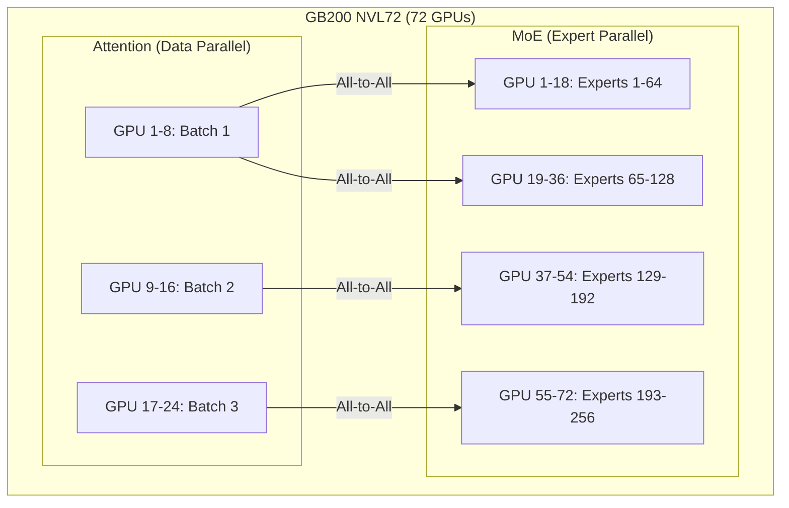

本記事は [Delivering Massive Performance Leaps for Mixture of Experts Inference on NVIDIA Blackwell (NVIDIA Developer Blog, 2026-01-08)](https://developer.nvidia.com/blog/delivering-massive-performance-leaps-for-mixture-of-experts-inference-on-nvidia-blackwell) の解説記事です。

## ブログ概要（Summary）

NVIDIAが2026年1月に公開したこのテックブログは、Blackwellアーキテクチャ上でのMoEモデル推論最適化について報告している。DeepSeek-R1（671Bパラメータ、37Bアクティブ）を主要なベンチマーク対象とし、GB200 NVL72およびHGX B200プラットフォームでの性能改善を実証している。3ヶ月間のソフトウェア最適化により、GB200 NVL72上でBlackwell GPUあたり最大2.8倍のスループット向上を達成したと報告されている。

この記事は [Zenn記事: LLM MoEアーキテクチャの発展とスケーリング戦略を体系的に理解する](https://zenn.dev/0h_n0/articles/5713e817b39187) の深掘りです。

## 情報源

- **種別**: 企業テックブログ
- **URL**: [https://developer.nvidia.com/blog/delivering-massive-performance-leaps-for-mixture-of-experts-inference-on-nvidia-blackwell](https://developer.nvidia.com/blog/delivering-massive-performance-leaps-for-mixture-of-experts-inference-on-nvidia-blackwell)
- **組織**: NVIDIA（著者: Ashraf Eassa, Senior Product Marketing Manager）
- **発表日**: 2026年1月8日

## 技術的背景（Technical Background）

MoEモデルの推論は、密なモデルの推論とは根本的に異なるハードウェア要件を持つ。DeepSeek-V3/R1のようなMoEモデルでは：

- **メモリ要件**: 671Bの全パラメータをGPUメモリに保持する必要がある（FP8で約670GB）
- **通信要件**: 各トークンのルーティング決定に基づき、エキスパートが配置されたGPU間でデータを転送する必要がある（all-to-all通信）
- **計算特性**: アクティブパラメータ（37B）のみが計算に使用されるため、GPU演算器の利用率が密なモデルより低くなりやすい

これらの課題に対して、NVIDIAはBlackwellアーキテクチャとTensorRT-LLMソフトウェアスタックの両面から最適化を行っている。

## 実装アーキテクチャ（Architecture）

### GB200 NVL72プラットフォーム

GB200 NVL72は、72基のBlackwell GPUをNVLinkで接続した大規模推論プラットフォームである。

**主要スペック**:
- **GPU数**: 72基のBlackwell GPU
- **GPU間帯域幅**: 1,800 GB/s（第5世代NVLink、双方向）
- **接続トポロジ**: NVLink Switchチップによる全GPU間の高帯域接続

このプラットフォームは、MoEモデルのExpert Parallelismに最適化されている。256個のエキスパートを72基のGPUに分散配置し、各トークンのルーティング決定に基づいてall-to-all通信を行う際、NVLinkの高帯域幅が通信ボトルネックを解消する。

### HGX B200プラットフォーム

HGX B200は、8基のBlackwell GPUをNVLink Switchで接続した空冷デプロイ向けプラットフォームである。GB200 NVL72と比較して小規模だが、空冷環境でのデプロイが可能であり、より広いデータセンターで利用できる。

### Expert ParallelismとData Parallelism

ブログによれば、DeepSeek-R1の推論では以下の並列化戦略が採用されている：

- **Expert Parallelism**: MoE層のエキスパートをGPU間で分散。各GPUは全エキスパートのサブセットを担当
- **Data Parallelism**: Attention機構に対してデータ並列を適用。各GPUが異なるリクエストのバッチを処理



この設計により、Attention部分のバッチスループットとMoE部分のエキスパート利用率を同時に最大化している。

## 主要な最適化技術

### NVFP4（4ビット浮動小数点）

BlackwellアーキテクチャにはNVFP4フォーマットのハードウェアアクセラレーションが組み込まれている。NVFP4は、NVIDIAが設計した4ビット浮動小数点フォーマットであり、代替のFP4フォーマットと比較してより精度を維持できると報告されている。

**精度 vs スループットのトレードオフ**:

| 精度 | ビット幅 | 理論スループット比 | 精度低下 |
|------|---------|----------------|---------|
| BF16 | 16-bit | 1.0x（基準） | なし |
| FP8 (E4M3) | 8-bit | ~2.0x | わずか |
| NVFP4 | 4-bit | ~4.0x | 中程度 |

ブログの報告によれば、HGX B200上でFP8からNVFP4に切り替えることで、MTP（Multi-Token Prediction）と組み合わせた際に大幅なスループット向上が得られている。

### Disaggregated Serving（分離型サービング）

Prefill（プロンプト処理）とDecode（トークン生成）を異なるGPUセットで実行する手法。

**Prefill**: 入力プロンプト全体を並列処理。計算集約的（GPU演算器ボトルネック）
**Decode**: トークンを逐次生成。メモリ帯域ボトルネック（KVキャッシュの読み出し）

これらの特性が異なるため、同一GPUで両方を処理すると効率が低下する。Disaggregated Servingでは：

- Prefill専用GPU群: 高い計算利用率で入力を処理
- Decode専用GPU群: KVキャッシュの効率的な読み出しに最適化

NVLink Switchの高帯域幅により、Prefill結果（KVキャッシュ）をDecode GPUに転送するオーバーヘッドが最小化される。

### TensorRT-LLM最適化

ブログが報告するTensorRT-LLMの主要な最適化：

1. **Programmatic Dependent Launch (PDL)の拡張**: カーネル起動レイテンシの削減。複数のカーネルを連鎖的に起動することで、CPU-GPU間の同期オーバーヘッドを削減
2. **低レベルカーネル最適化**: Blackwell Tensor Coreの利用率を最大化するカーネルの最適化
3. **All-to-All通信の最適化**: MoEのエキスパート間通信で使用されるall-to-allプリミティブの最適化。中間バッファの排除によりメモリ使用量とレイテンシを削減

### Multi-Token Prediction (MTP)

DeepSeek-V3/R1のMTP機能を推論時に活用し、1回の推論パスで複数トークンを予測する。ブログによれば、FP8およびNVFP4の両精度レベルで、MTP有効化により大幅なスループット向上が得られている。

## パフォーマンス最適化（Performance）

### 性能改善の推移

ブログが報告するGB200 NVL72上でのDeepSeek-R1推論性能の改善：

- **2025年10月 → 2026年1月**: 3ヶ月間のソフトウェア最適化で、Blackwell GPUあたり最大**2.8倍**のスループット向上
- **Hopper（H100）との比較**: Blackwell GPUあたり約**5倍**のスループット向上（Hopperベースシステム比）

### 精度と最適化の段階的効果（HGX B200）

ブログの報告によれば、以下の段階的な最適化により性能が向上：

1. FP8（ベースライン）
2. FP8 + MTP有効化 → 大幅なスループット向上
3. NVFP4 + MTP → さらなるスループット向上

各段階で、スループット対インタラクティビティ曲線が右方にシフトし、同一インタラクティビティレベルでより高いスループットを実現、または同一スループットでより高いインタラクティビティを実現している。

## 運用での学び（Production Lessons）

### MoE推論の固有課題

1. **All-to-All通信のオーバーヘッド**: MoEモデルでは、各トークンのルーティング決定に基づいてGPU間でデータを転送する必要がある。通信帯域がボトルネックになりやすく、NVLinkの1,800 GB/sの帯域幅が重要な差別化要因
2. **エキスパートの負荷不均衡**: 学習時の負荷分散が不完全な場合、特定のGPUに負荷が集中する可能性がある。推論時にはエキスパートの配置を負荷パターンに基づいて最適化する必要がある
3. **KVキャッシュのメモリ管理**: MoEモデルの総パラメータがメモリの大部分を占めるため、KVキャッシュに割り当てられるメモリが密なモデルより少なくなる。これは最大コンテキスト長やバッチサイズに制約を与える

### スケーリング戦略

ブログから読み取れるNVIDIAの推奨アプローチ：

- **小規模デプロイ**: HGX B200（8 GPU）で量子化（FP8/NVFP4）を活用
- **中規模デプロイ**: 複数のHGX B200ノードをInfiniBandで接続
- **大規模デプロイ**: GB200 NVL72で72 GPUをNVLink接続、Disaggregated Serving

## 学術研究との関連（Academic Connection）

このブログで報告されている最適化は、以下の学術研究と密接に関連している：

- **DeepSeek-V3 (arXiv: 2412.19437)**: ブログのベンチマーク対象。FP8学習の知見がNVFP4推論への展開に活かされている
- **Expert Parallelism (GShard, 2021)**: GPU間でのエキスパート分散の基盤技術。NVIDIAはこれをNVLink最適化で実用レベルに昇華
- **Speculative Decoding**: MTPはSpeculative Decodingの一形態であり、推論時のスループット向上に寄与

NVIDIAのブログは、学術研究で提案された手法を実際のハードウェアに最適化して実装するプロセスを示しており、「理論から実装への橋渡し」としての価値がある。

## Production Deployment Guide

### AWS実装パターン（コスト最適化重視）

NVIDIA Blackwellベースのインスタンスを使用したMoE推論のAWSデプロイ構成。

| 規模 | 月間リクエスト | 推奨構成 | 月額コスト | 主要サービス |
|------|--------------|---------|-----------|------------|
| **Small** | ~3,000 (100/日) | API経由 | $100-300 | Bedrock / SageMaker Endpoint |
| **Medium** | ~30,000 (1,000/日) | Single Node | $5,000-10,000 | p5.48xlarge (H100 × 8) |
| **Large** | 300,000+ (10,000/日) | Multi-Node | $20,000-50,000 | p5.48xlarge × 4 + EKS |

**注意**: 2026年3月時点でAWSにBlackwell (B200) インスタンスは一般提供されていない。H100ベースのp5インスタンスが最新の選択肢。Blackwell提供開始時にはp6インスタンスタイプが予想される。

**コスト試算の注意事項**:
- 2026年3月時点のAWS ap-northeast-1料金に基づく概算値
- GPU インスタンスはオンデマンド料金。Spot/Reserved で大幅削減可能
- 最新料金は [AWS料金計算ツール](https://calculator.aws/) で確認推奨

### Terraformインフラコード

```hcl
# --- GPU推論クラスタ ---
module "vpc" {
  source  = "terraform-aws-modules/vpc/aws"
  version = "~> 5.0"

  name = "moe-gpu-inference"
  cidr = "10.0.0.0/16"
  azs  = ["ap-northeast-1a"]
  private_subnets = ["10.0.1.0/24"]
  public_subnets  = ["10.0.101.0/24"]

  enable_nat_gateway = true
  single_nat_gateway = true
}

# EKSクラスタ（GPU推論用）
module "eks" {
  source  = "terraform-aws-modules/eks/aws"
  version = "~> 20.0"

  cluster_name    = "moe-inference"
  cluster_version = "1.31"

  vpc_id     = module.vpc.vpc_id
  subnet_ids = module.vpc.private_subnets

  cluster_endpoint_public_access = true
  enable_cluster_creator_admin_permissions = true
}

# Karpenter Provisioner（GPU Spot優先）
resource "kubectl_manifest" "gpu_provisioner" {
  yaml_body = <<-YAML
    apiVersion: karpenter.sh/v1
    kind: NodePool
    metadata:
      name: gpu-moe-inference
    spec:
      template:
        spec:
          requirements:
            - key: karpenter.sh/capacity-type
              operator: In
              values: ["spot", "on-demand"]
            - key: node.kubernetes.io/instance-type
              operator: In
              values: ["p5.48xlarge"]
          nodeClassRef:
            group: karpenter.k8s.aws
            kind: EC2NodeClass
            name: default
      limits:
        cpu: "192"
      disruption:
        consolidationPolicy: WhenEmpty
        consolidateAfter: 60s
  YAML
}

# コスト管理
resource "aws_budgets_budget" "gpu_monthly" {
  name         = "gpu-moe-monthly"
  budget_type  = "COST"
  limit_amount = "50000"
  limit_unit   = "USD"
  time_unit    = "MONTHLY"

  notification {
    comparison_operator        = "GREATER_THAN"
    threshold                  = 80
    threshold_type             = "PERCENTAGE"
    notification_type          = "ACTUAL"
    subscriber_email_addresses = ["ops@example.com"]
  }
}
```

### 運用・監視設定

```python
import boto3

cloudwatch = boto3.client('cloudwatch')

# GPU利用率モニタリング
cloudwatch.put_metric_alarm(
    AlarmName='moe-gpu-utilization-low',
    ComparisonOperator='LessThanThreshold',
    EvaluationPeriods=3,
    MetricName='GPUUtilization',
    Namespace='Custom/MoEInference',
    Period=300,
    Statistic='Average',
    Threshold=20,
    AlarmDescription='GPU利用率20%未満 - スケールダウン検討'
)

# All-to-All通信レイテンシ
cloudwatch.put_metric_alarm(
    AlarmName='moe-alltoall-latency',
    ComparisonOperator='GreaterThanThreshold',
    EvaluationPeriods=2,
    MetricName='AllToAllLatencyMs',
    Namespace='Custom/MoEInference',
    Period=60,
    Statistic='p99',
    Threshold=50,
    AlarmDescription='Expert通信レイテンシ異常'
)
```

### コスト最適化チェックリスト

- [ ] GPU推論: FP8量子化で2倍のスループット
- [ ] NVFP4: Blackwell提供時にさらに2倍のスループット
- [ ] MTP有効化: Speculative Decodingでレイテンシ削減
- [ ] Disaggregated Serving: Prefill/Decode分離でGPU効率向上
- [ ] Spot Instances: p5.48xlargeのSpot活用（可用性に注意）
- [ ] Reserved Instances: 1年コミットで最大72%削減
- [ ] Karpenter: アイドル時自動スケールダウン
- [ ] バッチ処理: 非リアルタイムはバッチ化でスループット最大化
- [ ] AWS Budgets: GPU コスト月額予算設定
- [ ] CloudWatch: GPU利用率・通信レイテンシ監視

## まとめと実践への示唆

NVIDIAのBlackwellアーキテクチャは、MoEモデルの推論最適化において、ハードウェア（NVFP4 Tensor Core、NVLink 1,800 GB/s）とソフトウェア（TensorRT-LLM、PDL、All-to-All最適化）の両面から大幅な性能向上を実現している。3ヶ月間のソフトウェア改善でGPUあたり2.8倍のスループット向上を達成したという報告は、MoE推論の最適化余地がまだ大きいことを示唆している。

実務への示唆として、MoEモデルのデプロイにおいてはGPU間通信の帯域幅が性能のボトルネックになりやすく、NVLinkのような高帯域インターコネクトが重要な差別化要因となる。クラウド環境でのデプロイでは、GPUインスタンス間のネットワーク帯域にも注意が必要である。

## 参考文献

- **Blog URL**: [https://developer.nvidia.com/blog/delivering-massive-performance-leaps-for-mixture-of-experts-inference-on-nvidia-blackwell](https://developer.nvidia.com/blog/delivering-massive-performance-leaps-for-mixture-of-experts-inference-on-nvidia-blackwell)
- **Related Papers**: [https://arxiv.org/abs/2412.19437](https://arxiv.org/abs/2412.19437) (DeepSeek-V3)
- **Related Zenn article**: [https://zenn.dev/0h_n0/articles/5713e817b39187](https://zenn.dev/0h_n0/articles/5713e817b39187)
- **TensorRT-LLM**: [https://github.com/NVIDIA/TensorRT-LLM](https://github.com/NVIDIA/TensorRT-LLM)

---

:::message
この記事はAI（Claude Code）により自動生成されました。ブログの内容を正確に伝えることを目指していますが、最新情報については原典もご確認ください。
:::
