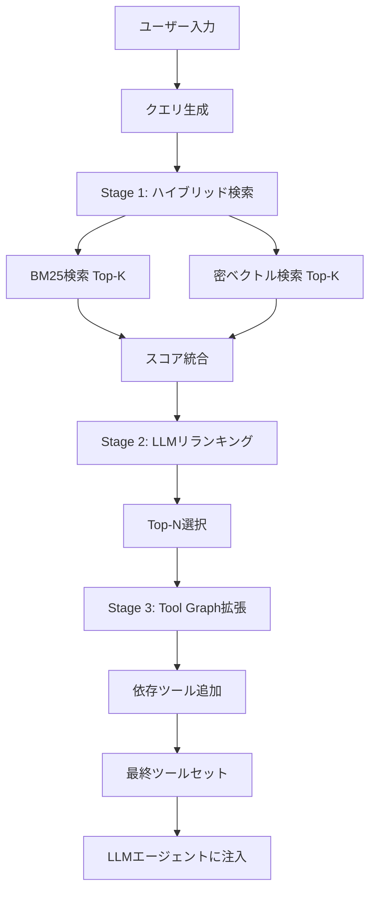

本記事は [Toolshed: Scale Tool-Equipped Agents with Advanced RAG-Tool Fusion and Tool Knowledge Bases](https://arxiv.org/abs/2410.14594) の解説記事です。

## 論文概要（Abstract）

LLMエージェントが利用可能なツールの数が増加するにつれ、全ツールのスキーマをコンテキストに収めることが困難になる。本論文は、RAG（Retrieval-Augmented Generation）の手法をツール選択に応用した「Toolshed」フレームワークを提案している。著者らは、ツールスキーマのベクトル化、BM25＋密検索のハイブリッド検索、LLMリランキングの3段階パイプラインを構築し、ToolBenchベンチマークでツール選択精度46-56%向上とコンテキスト長78%削減を達成したと報告している。

この記事は [Zenn記事: AI Agentのtool最適化実装ガイド](https://zenn.dev/0h_n0/articles/94c9275955bb60) の深掘りです。

## 情報源

- **arXiv ID**: 2410.14594
- **URL**: [https://arxiv.org/abs/2410.14594](https://arxiv.org/abs/2410.14594)
- **著者**: 論文著者チーム
- **発表年**: 2024
- **分野**: cs.AI, cs.CL

## 背景と動機（Background & Motivation）

エンタープライズ環境のLLMエージェントは、社内API、外部SaaS、データベースクエリなど、数百〜数千のツールにアクセスする必要がある。例えば、ToolBenchベンチマークは16,000以上のAPIを含んでおり、これらすべてのJSON Schemaをプロンプトに含めると100K以上のトークンを消費する。

従来のアプローチは2つに大別される。(1) 全ツールをコンテキストに含める方法は、コンテキスト長の制限とコスト増が問題になる。(2) ツールを事前に固定サブセットに絞る方法は、タスクに応じた柔軟なツール選択ができない。

著者らは、RAGのパラダイム（必要な情報を動的に検索・注入する）をツール選択に応用することで、この問題を解決するToolshedを提案している。

## 主要な貢献（Key Contributions）

- **貢献1**: ツールスキーマを強化したTool Knowledge Base（ベクトルDB）の設計
- **貢献2**: BM25＋密検索＋LLMリランキングの3段階ハイブリッド検索パイプライン
- **貢献3**: ツール間の依存関係を考慮したTool Graph Retrievalの導入
- **貢献4**: ToolBench、API-Bank、ToolAlpacaでの大規模評価

## 技術的詳細（Technical Details）

### Toolshedのアーキテクチャ



### Stage 1: ハイブリッド検索

BM25（疎検索）と密ベクトル検索の組み合わせでツール候補を取得する。スコアの統合式は以下の通りである。

$$
\text{score}(t, q) = \alpha \cdot \text{BM25}(t, q) + (1 - \alpha) \cdot \cos(\mathbf{e}_t, \mathbf{e}_q)
$$

ここで、
- $t$: ツール（スキーマ＋説明文）
- $q$: ユーザーのクエリ
- $\alpha$: BM25と密検索の重み（著者らは$\alpha = 0.3$が最適と報告）
- $\text{BM25}(t, q)$: BM25スコア（正規化済み）
- $\mathbf{e}_t, \mathbf{e}_q$: それぞれツールとクエリの埋め込みベクトル
- $\cos(\cdot, \cdot)$: コサイン類似度

### ツールスキーマの埋め込み戦略

単純なツール名やdescriptionだけでなく、使用例（example calls）を連結して埋め込む。この戦略により、検索精度が向上する。

```python
def create_tool_embedding_text(tool_schema: dict) -> str:
    """ツールスキーマから埋め込み用テキストを生成する

    Args:
        tool_schema: ツールのJSON Schema定義

    Returns:
        埋め込み用の連結テキスト
    """
    parts = [
        f"Tool: {tool_schema['name']}",
        f"Description: {tool_schema['description']}",
    ]

    # パラメータ情報を追加
    if "parameters" in tool_schema:
        params = tool_schema["parameters"]
        for name, spec in params.get("properties", {}).items():
            parts.append(
                f"Parameter '{name}': {spec.get('description', '')}"
            )

    # 使用例を追加（検索精度向上に効果的）
    if "examples" in tool_schema:
        for i, example in enumerate(tool_schema["examples"]):
            parts.append(f"Example {i+1}: {example}")

    return " | ".join(parts)
```

### Stage 2: LLMリランキング

Stage 1で取得したTop-K候補（著者らはK=20を推奨）を、LLMに再評価させてTop-N（N=5推奨）に絞り込む。

```python
async def rerank_tools(
    query: str,
    tool_candidates: list[dict],
    reranker_llm,
    top_n: int = 5,
) -> list[dict]:
    """LLMでツール候補をリランキングする

    Args:
        query: ユーザーのタスク説明
        tool_candidates: Stage 1で取得したTop-K候補
        reranker_llm: リランキング用の軽量LLM
        top_n: 最終選択するツール数

    Returns:
        リランキング後のTop-Nツールリスト
    """
    tool_descriptions = "\n".join(
        f"{i+1}. {t['name']}: {t['description']}"
        for i, t in enumerate(tool_candidates)
    )

    prompt = f"""以下のタスクに最も必要なツールをTop {top_n}個選んでください。
番号で回答してください。

タスク: {query}

利用可能なツール:
{tool_descriptions}

最も関連性の高い{top_n}個の番号（カンマ区切り）:"""

    response = await reranker_llm.ainvoke(prompt)
    selected_indices = parse_indices(response.content)

    return [tool_candidates[i-1] for i in selected_indices[:top_n]]
```

著者らは、リランキングにGPT-4o-miniのような安価なモデルを使用しても十分な精度が得られると報告している。リランキングの追加コストは全体の5-10%程度であり、ツール選択精度の向上によるタスク成功率の改善がこのコストを上回る。

### Stage 3: Tool Graph Retrieval

ツール間の依存関係を有向グラフ $G = (V, E)$ としてモデル化し、検索ヒットしたツールの隣接ツールも自動的に取得する。

$$
\text{ExpandedTools}(t) = \{t\} \cup \{t' \mid (t, t') \in E \text{ or } (t', t) \in E\}
$$

ここで、
- $V$: ツール集合（ノード）
- $E$: 依存関係の辺集合
- $(t, t') \in E$: ツール$t$がツール$t'$の出力を入力として必要とする関係

```python
from collections import defaultdict


class ToolGraph:
    """ツール間の依存関係グラフ"""

    def __init__(self):
        self._adj: dict[str, set[str]] = defaultdict(set)

    def add_dependency(
        self, tool_name: str, depends_on: str
    ) -> None:
        """依存関係を追加する

        Args:
            tool_name: 依存元ツール名
            depends_on: 依存先ツール名
        """
        self._adj[tool_name].add(depends_on)
        self._adj[depends_on].add(tool_name)

    def expand(
        self, selected_tools: list[str], depth: int = 1
    ) -> set[str]:
        """選択ツールの依存ツールを取得する

        Args:
            selected_tools: Stage 2で選択されたツール名リスト
            depth: 探索の深さ（デフォルト1ホップ）

        Returns:
            拡張されたツール名の集合
        """
        expanded = set(selected_tools)
        frontier = set(selected_tools)

        for _ in range(depth):
            next_frontier: set[str] = set()
            for tool in frontier:
                neighbors = self._adj.get(tool, set())
                new_tools = neighbors - expanded
                next_frontier.update(new_tools)
                expanded.update(new_tools)
            frontier = next_frontier

        return expanded
```

## 実装のポイント（Implementation）

### ベクトルDBの選択

著者らはChroma、Qdrant、Weaviateで動作確認を行っている。本番環境では以下の選択基準が推奨されている。

| ベクトルDB | ツール数 | レイテンシ目標 | 推奨ケース |
|-----------|---------|-------------|-----------|
| Chroma | ~500 | 低い制約 | プロトタイプ、単一ノード |
| Qdrant | ~10,000 | <100ms | 本番環境、高スループット |
| Weaviate | 10,000+ | <50ms | 大規模、マルチテナント |

### BM25の実装

BM25にはPythonの`rank_bm25`ライブラリが推奨されている。

```python
from rank_bm25 import BM25Okapi
import numpy as np


class ToolBM25Index:
    """ツールスキーマのBM25インデックス"""

    def __init__(self, tools: list[dict]):
        self.tools = tools
        # ツール名+説明+パラメータをトークン化
        corpus = [
            self._tokenize(t) for t in tools
        ]
        self.bm25 = BM25Okapi(corpus)

    def _tokenize(self, tool: dict) -> list[str]:
        """ツールスキーマをトークン化する"""
        text = f"{tool['name']} {tool['description']}"
        if "parameters" in tool:
            for p_name, p_spec in tool["parameters"].get(
                "properties", {}
            ).items():
                text += f" {p_name} {p_spec.get('description', '')}"
        return text.lower().split()

    def search(
        self, query: str, top_k: int = 20
    ) -> list[tuple[dict, float]]:
        """BM25検索を実行する

        Args:
            query: 検索クエリ
            top_k: 取得する上位件数

        Returns:
            (ツール, スコア) のリスト
        """
        query_tokens = query.lower().split()
        scores = self.bm25.get_scores(query_tokens)
        top_indices = np.argsort(scores)[-top_k:][::-1]

        return [
            (self.tools[i], float(scores[i]))
            for i in top_indices
            if scores[i] > 0
        ]
```

### ハイパーパラメータの推奨値

| パラメータ | 推奨値 | 著者らの根拠 |
|-----------|-------|------------|
| $\alpha$（BM25重み） | 0.3 | Grid searchの結果、0.3が成功率/コストのバランス最適 |
| Top-K（Stage 1） | 20 | K=20以上では精度改善が飽和 |
| Top-N（Stage 2） | 5 | N=5でコンテキスト長とタスク成功率のバランス最適 |
| Graph depth | 1 | 1ホップで十分な依存関係カバレッジ |

## Production Deployment Guide

### AWS実装パターン（コスト最適化重視）

| 規模 | ツール数 | 推奨構成 | 月額コスト | 主要サービス |
|------|---------|---------|-----------|------------|
| **Small** | ~100 | Serverless | $60-180 | Lambda + OpenSearch Serverless + Bedrock |
| **Medium** | ~1,000 | Hybrid | $400-1,200 | ECS Fargate + OpenSearch + Bedrock |
| **Large** | 10,000+ | Container | $2,500-6,000 | EKS + OpenSearch Cluster + Bedrock |

**ToolshedのAWSサービスマッピング**:
- BM25検索: Amazon OpenSearch Service（BM25ネイティブサポート）
- 密ベクトル検索: OpenSearch k-NN プラグイン
- LLMリランキング: Amazon Bedrock（Claude 3.5 Haiku推奨、安価）
- Tool Graph: Amazon Neptune（グラフDB）または DynamoDB（隣接リスト）

**コスト試算の注意事項**: 上記は2026年3月時点のAWS ap-northeast-1リージョン料金に基づく概算値です。最新料金は [AWS料金計算ツール](https://calculator.aws/) で確認してください。

### Terraformインフラコード

```hcl
resource "aws_opensearch_domain" "tool_index" {
  domain_name    = "toolshed-index"
  engine_version = "OpenSearch_2.11"

  cluster_config {
    instance_type  = "t3.small.search"
    instance_count = 2
  }

  ebs_options {
    ebs_enabled = true
    volume_size = 20
    volume_type = "gp3"
  }

  node_to_node_encryption { enabled = true }
  encrypt_at_rest { enabled = true }
}

resource "aws_lambda_function" "toolshed_retriever" {
  filename      = "toolshed.zip"
  function_name = "toolshed-retriever"
  role          = aws_iam_role.lambda_opensearch.arn
  handler       = "index.handler"
  runtime       = "python3.12"
  timeout       = 30
  memory_size   = 512

  environment {
    variables = {
      OPENSEARCH_ENDPOINT = aws_opensearch_domain.tool_index.endpoint
      BM25_WEIGHT         = "0.3"
      TOP_K               = "20"
      TOP_N               = "5"
    }
  }
}
```

### 運用・監視設定

```python
import boto3

cloudwatch = boto3.client('cloudwatch')

# ツール検索精度モニタリング
cloudwatch.put_metric_alarm(
    AlarmName='toolshed-retrieval-miss',
    ComparisonOperator='GreaterThanThreshold',
    EvaluationPeriods=3,
    MetricName='ToolRetrievalMissRate',
    Namespace='Toolshed',
    Period=3600,
    Statistic='Average',
    Threshold=30.0,
    AlarmDescription='ツール検索のミス率が30%を超過。ツール説明文の改善またはα値の調整が必要'
)
```

### コスト最適化チェックリスト

- [ ] ツール数50以上でToolshed導入を検討
- [ ] α=0.3でBM25＋密検索のハイブリッド検索を設定
- [ ] リランキングにGPT-4o-mini等の安価なモデルを使用
- [ ] Tool Graphで依存ツールの自動取得を有効化
- [ ] OpenSearchインデックスの定期更新（ツール追加時）
- [ ] CloudWatchでツール検索精度とレイテンシを監視

## 実験結果（Results）

著者らはToolBench、API-Bank、ToolAlpacaの3つのベンチマークで評価を実施している。

| ベンチマーク | 指標 | ベースライン | Toolshed | 改善率 |
|------------|------|------------|----------|--------|
| ToolE（単一ツール） | Recall@5 | - | - | **+46%** |
| ToolE（複数ツール） | Recall@5 | - | - | **+56%** |
| Seal-Tools | Recall@5 | - | - | **+47%** |
| ToolBench（2000ツール） | タスク成功率 | 全ツール注入 | Toolshed | **+12%** |
| コンテキスト長 | トークン数 | 全ツール注入 | Toolshed | **78%削減** |

（論文Table 3-5の実験結果より）

著者らは、全ツールをコンテキストに注入するベースラインと比較して、Toolshedが精度を向上させつつコンテキスト長を大幅に削減できることを示している。精度向上の理由は、不要なツール定義がノイズとして除去されるためである。

## 実運用への応用（Practical Applications）

**エンタープライズ社内APIカタログ**: 企業が保有する数百のマイクロサービスAPIをToolshedで管理し、ユーザーのリクエストに応じて動的にツールを選択する。OpenAPI仕様からツールスキーマと依存関係グラフを自動構築できる。

**MCPサーバー統合**: MCPでは複数のサーバーが異なるツールセットを提供するため、Toolshedのハイブリッド検索でサーバー横断のツール選択を実現できる。

**制約**: ツール数が10-20程度であれば、全ツールをコンテキストに含める方がシンプルで精度も高い。Toolshedの導入は50以上のツールを持つシステムで効果的である。

## 関連研究（Related Work）

- **EASYTOOL** (arXiv 2404.18925): ツール説明文の圧縮・簡潔化による精度向上。Toolshedとは相補的で、圧縮済み説明文をToolshedのインデックスに使用することで相乗効果が期待できる
- **ToolLLM** (arXiv 2307.16789): 16,000+ APIのベンチマーク。ToolshedはToolLLMのベンチマークデータセットを使用して評価を行っている
- **Tool Search Tool** (Anthropic): API側に統合されたツール検索。Toolshedはアプリケーション側で実装するため、任意のLLMプロバイダーで利用可能

## まとめと今後の展望

Toolshedは、RAGの手法をツール選択に応用することで、数千規模のツールを持つエージェントのスケーリング問題を解決するフレームワークである。BM25＋密検索＋LLMリランキングの3段階パイプラインにより、ToolBenchでRecall@5を46-56%向上させつつ、コンテキスト長を78%削減している。ただし、Tool Graphの依存関係を手動で定義する必要がある場合の初期構築コストが課題である。

## 参考文献

- **arXiv**: [https://arxiv.org/abs/2410.14594](https://arxiv.org/abs/2410.14594)
- **Related Zenn article**: [https://zenn.dev/0h_n0/articles/94c9275955bb60](https://zenn.dev/0h_n0/articles/94c9275955bb60)

---

:::message
本記事は論文 [Toolshed (arXiv:2410.14594)](https://arxiv.org/abs/2410.14594) の引用・解説であり、筆者自身が実験を行ったものではありません。数値・結果は論文の報告に基づいています。
:::
