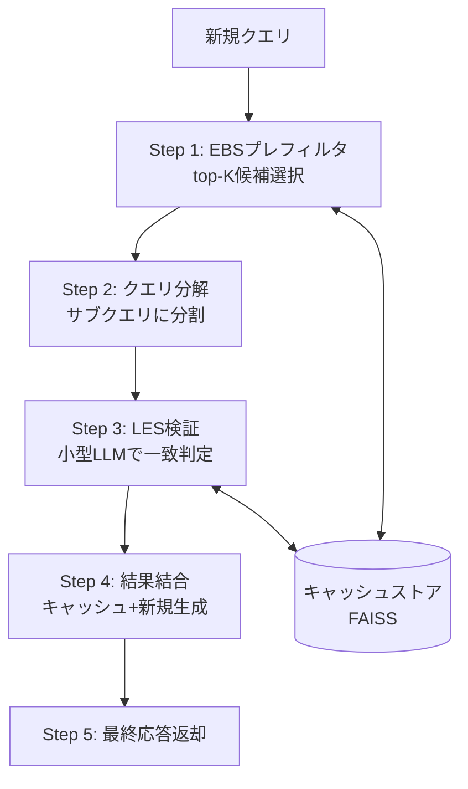

## 論文概要（Abstract）

本記事は [arXiv:2502.03771 SemCache: Semantic-Aware GPT-Cache through LLM-Embedded Similarity](https://arxiv.org/abs/2502.03771) の解説記事です。

SemCacheは、LLM推論のセマンティックキャッシュにおける2つの根本的課題を解決する手法です。第1の課題は、既存の埋め込みベース類似度（EBS）が意味的に異なるクエリを誤って一致と判定してしまう**高い誤ポジティブ率（FPR: 40.2%）**です。第2の課題は、クエリの一部のみがキャッシュに一致する場合にも全体を再生成する**粗い粒度のキャッシュ**です。著者らはLLM自体をジャッジとして用いるLLM-Embedded Similarity（LES）と、クエリを分解して部分的にキャッシュヒットさせるSemantic-Aware Partial Cachingを提案し、FPRを8.7%に削減しつつ最大2.2倍の推論高速化を達成したと報告しています。

この記事は [Zenn記事: Azure OpenAIマルチリージョン負荷分散：Front Door×APIM×PTUで高可用性を設計する](https://zenn.dev/0h_n0/articles/b2bc25d92f46fb) の深掘りです。Zenn記事ではAzure APIMのセマンティックキャッシュ機能（`llm-semantic-cache-lookup`ポリシー）を解説していますが、本記事ではその基盤となるセマンティックキャッシュの学術的研究を掘り下げます。

## 情報源

- **arXiv ID**: 2502.03771
- **URL**: [https://arxiv.org/abs/2502.03771](https://arxiv.org/abs/2502.03771)
- **著者**: Kai Huang, Hao Guan, Faisal Nawab
- **発表年**: 2025
- **分野**: cs.AI, cs.LG, cs.DB

## 背景と動機（Background & Motivation）

LLM推論は高コスト・高レイテンシであり、本番デプロイメントにおいて経済的なボトルネックとなっています。セマンティックキャッシュは、過去に生成した応答を意味的に類似したクエリに対して再利用することで、このコストを削減するアプローチです。

しかし、著者らは既存のセマンティックキャッシュシステム（GPTCache等）に2つの深刻な問題があることを実験的に示しています。

**問題1: 埋め込みベース類似度（EBS）の不正確さ**。EBSはクエリの埋め込みベクトル間のコサイン類似度で一致判定を行いますが、「Pythonの長所は？」と「Pythonの短所は？」のように埋め込みが近くても回答が異なるケースを区別できません。著者らがTriviaQA、ARC、CommonsenseQA等のデータセットで評価した結果、EBS（閾値0.9）のFPRは平均40.2%に達したと報告されています（論文Figure 3）。GPTCacheの評価では、キャッシュヒット率50.2%に対してエラー率41.3%という結果が示されています。

**問題2: 粗い粒度のキャッシュ**。既存システムはクエリを原子的な単位として扱い、完全一致か完全再生成かの二択です。「勾配降下法とは何か、バックプロパゲーションはどう動くか」のようなクエリの場合、前半部分のみキャッシュに存在しても全体を再生成してしまいます。

## 主要な貢献（Key Contributions）

- **LLM-Embedded Similarity（LES）**: 小型LLM（LLaMA 3.2-3B / Mistral-7B）をジャッジとして用い、キャッシュ済み応答が新クエリに正確に答えられるかを判定する新しい類似度メトリック。FPRを40.2%から8.7%に削減（論文Figure 7より）
- **Semantic-Aware Partial Caching**: クエリをサブクエリに分解し、各サブクエリごとにキャッシュヒットを判定。一部はキャッシュ応答、残りは新規生成して最終的にLLMで結合。キャッシュヒット率を平均14.8ポイント改善（論文Figure 8より）
- **End-to-End性能改善**: キャッシュなしと比較して最大2.2倍の推論高速化（CommonsenseQAデータセット、論文Figure 9より）

## 技術的詳細（Technical Details）

### SemCacheの全体アーキテクチャ

SemCacheの処理パイプラインは5つのステップで構成されています（論文Figure 4より）。



### LLM-Embedded Similarity（LES）の仕組み

LESの核心的なアイデアは、**EBSをプレフィルタ、LLMをジャッジ**とする二段構成です。

**Step 1: EBSプレフィルタ**

まず、新規クエリの埋め込みベクトルを計算し、FAISSベクトルストアに対してtop-K（$K=5$）の近似最近傍検索を実行します。この段階では精度より再現率を重視し、候補を絞り込みます。

$$
\text{EBS}(q_{\text{new}}, q_{\text{cached}}) = \frac{\mathbf{e}(q_{\text{new}}) \cdot \mathbf{e}(q_{\text{cached}})}{|\mathbf{e}(q_{\text{new}})| \cdot |\mathbf{e}(q_{\text{cached}})|}
$$

ここで、$\mathbf{e}(q)$はクエリ$q$の埋め込みベクトルです。閾値$\tau = 0.9$で候補をフィルタリングします。

**Step 2: LESジャッジ**

EBSで選択された候補に対して、小型LLM（LLaMA 3.2-3B等）にプロンプトを与え、キャッシュ済み応答が新クエリに正確に答えられるかをY/Nで判定します。

LESジャッジは以下の入力を受け取ります。

- 新規クエリ
- キャッシュ済みクエリ
- キャッシュ済み応答

**LESの精度（論文Figure 7より）**:

| メトリック | EBS | LES | 改善 |
|-----------|-----|-----|------|
| FPR（偽陽性率） | 40.2% | 8.7% | 4.6倍改善 |
| TPR（真陽性率） | 89.8% | 87.5% | -2.3pt（微減） |

LESはTPRがわずかに低下しますが、FPRを大幅に削減します。これは、不正確なキャッシュヒット（誤った応答を返すケース）を防ぐことが、本番システムでは性能向上に直結するためです。

### Semantic-Aware Partial Caching

部分キャッシュは3段階で動作します。

**クエリ分解**: LLMを使ってクエリを意味的に独立したサブクエリに分解します。

**サブクエリごとのキャッシュ判定**: 各サブクエリに対してLESで一致判定を実行します。

**結果結合**: キャッシュから取得した応答と新規生成した応答を、LLMを使って一つの整合的な最終応答に結合します。

**部分キャッシュの効果（論文Figure 8より）**:

| データセット | 部分キャッシュ改善 | 備考 |
|-------------|----------------|------|
| TriviaQA | +12.3 pp | 一般知識QA |
| CommonsenseQA | +15.6 pp | 常識推論 |
| MathQA | +23.1 pp | 共通サブ問題が多い |
| **平均** | **+14.8 pp** | |

MathQAで改善が最大な理由は、数学問題が共通のサブ問題（算術演算等）を共有しやすいためと著者らは分析しています。

### アルゴリズム

SemCacheの中核処理を擬似コードで示します。

```python
from dataclasses import dataclass
import numpy as np


@dataclass
class CacheEntry:
    """キャッシュエントリ"""
    query: str
    response: str
    embedding: np.ndarray


def semcache_query(
    new_query: str,
    cache: list[CacheEntry],
    embedding_model,
    les_judge,
    main_llm,
    tau: float = 0.9,
    top_k: int = 5,
) -> str:
    """SemCacheのメインクエリ処理パイプライン

    Args:
        new_query: 新規クエリ
        cache: キャッシュエントリのリスト
        embedding_model: 埋め込みモデル
        les_judge: LESジャッジ用小型LLM
        main_llm: メインLLM
        tau: EBS類似度閾値
        top_k: EBSプレフィルタのK値

    Returns:
        最終応答文字列
    """
    # Step 1: EBSプレフィルタ
    query_embedding = embedding_model.encode(new_query)
    candidates = ebs_prefilter(query_embedding, cache, tau, top_k)

    # Step 2: クエリ分解
    sub_queries = decompose_query(new_query, main_llm)

    # Step 3: 各サブクエリに対してLES検証
    cached_parts: list[str] = []
    uncached_queries: list[str] = []

    for sub_q in sub_queries:
        matched = False
        for candidate in candidates:
            if les_verify(sub_q, candidate, les_judge):
                cached_parts.append(candidate.response)
                matched = True
                break
        if not matched:
            uncached_queries.append(sub_q)

    # Step 4: 未キャッシュ部分を新規生成
    new_responses = [main_llm.generate(q) for q in uncached_queries]

    # Step 5: 結果結合
    return compose_response(
        new_query, cached_parts, new_responses, main_llm
    )
```

## 実装のポイント（Implementation）

**EBSプレフィルタの設定**: 埋め込みモデルにはsentence-transformers系の軽量モデルが推奨されています。ベクトルストアにはFAISSを使用し、インデックスタイプはIVF_FLATまたはHNSWが適しています。

**LESジャッジの選択**: 著者らはLLaMA 3.2-3B（平均0.3秒）とMistral-7B（平均0.7秒）を評価しています。メインLLMの推論時間（GPT-4o miniで2〜10秒）と比較してオーバーヘッドは小さいとされていますが、ジャッジ用LLMのホスティングコストは追加で発生します。

**閾値の設計**: EBS閾値$\tau = 0.9$が標準的ですが、Zenn記事で解説したAzure APIMのセマンティックキャッシュでは`score-threshold`の設計指針が異なります（APIMでは低い値ほど厳密）。SemCacheの閾値設計をAzure APIMに適用する場合、メトリックの方向性の違いに注意が必要です。

**キャッシュウォームアップ**: コールドスタート時はキャッシュが空のため効果がありません。本番環境ではFAQや典型的なクエリで事前にキャッシュをウォームアップする戦略が有効です。

## 実験結果（Results）

### End-to-End性能（論文Figure 9より）

著者らが報告した、キャッシュなしベースラインに対するレイテンシ改善の結果を以下に示します。

| データセット | SemCache高速化倍率 | EBS-Only高速化倍率 |
|-------------|-------------------|-------------------|
| TriviaQA | 1.6x | 1.3x |
| CommonsenseQA | 2.2x | 1.5x |
| ARC | 1.7x | 1.4x |
| MathQA | 1.9x | 1.2x |
| **平均** | **1.8x** | **1.35x** |

EBS-Onlyの方がキャッシュヒット率は高い（FPRが高いため）ものの、誤ったキャッシュヒットが多いため、本番環境では再生成が必要になり実効的な高速化は劣ります。

### オーバーヘッド分析（論文Figure 10より）

| コンポーネント | レイテンシ（LLaMA 3.2-3B） | レイテンシ（Mistral-7B） |
|-------------|--------------------------|------------------------|
| LES判定 | 0.3秒 | 0.7秒 |
| クエリ分解 | 0.4秒 | 0.4秒 |
| メインLLM推論 | 2-10秒 | 2-10秒 |

## 実運用への応用（Practical Applications）

### Azure APIMセマンティックキャッシュとの関連

Zenn記事で解説したAzure APIMの`llm-semantic-cache-lookup`ポリシーは、EBSベースのセマンティックキャッシュです。SemCacheの研究結果は、このEBSベースアプローチの限界（FPR 40.2%）を定量的に示しています。

**実務への示唆**:
- APIMの`score-threshold`を0.05（厳密）に設定している場合、ヒット率は低いがFPRも低い
- 閾値を上げてヒット率を高めようとすると、SemCacheが指摘するFPR問題が顕在化する
- LESのような二段階検証をAPIMのカスタムポリシーで実装することで、より高いヒット率と低いFPRを両立できる可能性がある

### スケーリング戦略

LESジャッジ用の小型LLMのホスティングは追加コストとなりますが、メインLLMの推論コスト削減効果がこれを上回るケースが多いと考えられます。特に、同一ドメインのクエリが繰り返されるカスタマーサポートBot、FAQ対応、コード生成アシスタント等のユースケースで効果的です。

## 関連研究（Related Work）

- **GPTCache** (Fu et al., 2023): 最も広く使用されるセマンティックキャッシュ。EBSベースでFPR 40.2%の問題がSemCacheで指摘されている
- **CacheBlend** (Fu et al., EuroSys 2024): LLM内部のKVキャッシュ再利用に焦点。SemCacheのアプリケーション層キャッシュとはレイヤーが異なる
- **SimCache / Semantic Cache** (Liu et al., 2024): EBSベースのアプローチで、SemCacheと同様のFPR問題を抱える

## まとめと今後の展望

SemCacheは、セマンティックキャッシュの精度（LES）と粒度（部分キャッシュ）の両面を改善する研究です。特にFPR 40.2%→8.7%の改善は、EBSベースのキャッシュシステムを本番運用する際の重要な知見を提供しています。

今後の課題として、著者らは多言語対応の検証不足、長文クエリへの対応、LESジャッジのファインチューニングコストを挙げています。Azure APIMのセマンティックキャッシュ機能と組み合わせることで、LLMサービングのコスト最適化にさらなる可能性が開けます。

## 参考文献

- **arXiv**: [https://arxiv.org/abs/2502.03771](https://arxiv.org/abs/2502.03771)
- **Related**: GPTCache - [https://github.com/zilliztech/GPTCache](https://github.com/zilliztech/GPTCache)
- **Related Zenn article**: [Azure OpenAIマルチリージョン負荷分散](https://zenn.dev/0h_n0/articles/b2bc25d92f46fb)

---

:::message
この記事はAI（Claude Code）により自動生成されました。内容の正確性については論文の原文に基づいていますが、最新の情報は論文原文もご確認ください。
:::
