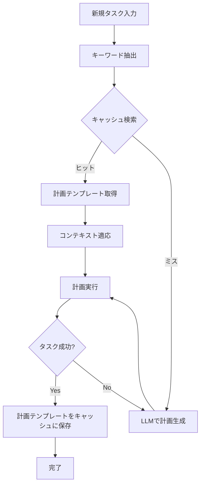

本記事は [Agentic Plan Caching: Test-Time Memory for Fast and Cost-Efficient LLM Agents](https://arxiv.org/abs/2506.14852) の解説記事です。

## 論文概要（Abstract）

LLMベースのエージェントは複雑なワークフローを自動化できるが、タスクごとに計画（Plan）をゼロから生成するため、APIコストとレイテンシが大きな課題となっている。本論文は、過去に生成した計画をテンプレート化してキャッシュし、意味的に類似した新規タスクに対して再利用・適応する「Agentic Plan Caching（APC）」を提案している。著者らは、WebArenaやALFWorldなどの標準ベンチマークで評価を行い、コスト50.31%削減とレイテンシ27.28%短縮を達成したと報告している。

この記事は [Zenn記事: AI Agentのtool最適化実装ガイド](https://zenn.dev/0h_n0/articles/94c9275955bb60) の深掘りです。

## 情報源

- **arXiv ID**: 2506.14852
- **URL**: [https://arxiv.org/abs/2506.14852](https://arxiv.org/abs/2506.14852)
- **著者**: Qizheng Zhang, Michael Wornow, Kunle Olukotun（Stanford University）
- **発表年**: 2025
- **分野**: cs.AI, cs.LG

## 背景と動機（Background & Motivation）

LLMエージェントは、ユーザーのリクエストに対して計画を生成し、ツールを呼び出して実行するアーキテクチャが一般的である。しかし、この計画生成プロセスには複数回のLLM推論が必要であり、5つのツールを順次実行するワークフローでは5回以上の推論パスが発生する。

既存のキャッシュ技術には、プロンプトキャッシュ（同一プレフィックスのKVキャッシュ再利用）やセマンティックキャッシュ（類似クエリへの応答再利用）がある。しかし、著者らはこれらがエージェントの計画には不十分だと指摘している。エージェントの計画は外部環境のデータに依存するため、単純な応答の再利用では対応できない。APCは計画の「構造」をテンプレート化し、コンテキスト固有の部分のみを適応させるという点で、既存手法とは異なるアプローチを採用している。

## 主要な貢献（Key Contributions）

- **貢献1**: テスト時に計画テンプレートを抽出・格納・検索・適応する「Agentic Plan Caching」フレームワークの提案
- **貢献2**: キーワード抽出ベースのマッチングによる軽量な計画検索アルゴリズム
- **貢献3**: 複数の実世界エージェントベンチマークでのコスト削減とレイテンシ短縮の実証

## 技術的詳細（Technical Details）

### APCのアーキテクチャ

APCは以下の4つのフェーズで構成される。



**フェーズ1: 計画テンプレートの抽出**

タスク実行が成功した後、生成された計画からコンテキスト固有の情報（具体的なファイル名、URL、ユーザーIDなど）を除去し、抽象的なテンプレートに変換する。

**フェーズ2: キーワードベースの計画検索**

新規タスクからキーワードを抽出し、キャッシュ内の計画テンプレートとマッチングする。著者らは埋め込みベースの類似度検索ではなく、キーワードマッチングを採用している。これは、計画の意味的類似度よりもタスクの構造的類似度の方が再利用可能性の指標として適切であるという知見に基づいている。

**フェーズ3: 軽量モデルによる適応**

キャッシュヒット時、取得した計画テンプレートを新規タスクのコンテキストに適応させる。この適応ステップには、主力モデル（GPT-4o等）より安価な軽量モデル（GPT-4o-mini等）を使用する。

**フェーズ4: 計画実行とキャッシュ更新**

適応済み計画を実行し、成功した場合は新たなテンプレートとしてキャッシュに追加する。失敗した場合はキャッシュミスとして扱い、主力モデルで計画を再生成する。

### 類似度スコアリング

キャッシュ検索におけるマッチングスコアは以下のように計算される。

$$
\text{score}(q, c) = \frac{|K(q) \cap K(c)|}{|K(q) \cup K(c)|}
$$

ここで、
- $q$: 新規タスクのクエリ
- $c$: キャッシュされた計画テンプレート
- $K(\cdot)$: テキストからキーワード集合を抽出する関数
- 分子はキーワードの共通部分（Jaccard係数）

キャッシュヒットの判定閾値 $\tau$ は論文の感度分析で $\tau = 0.85$ 前後が最適と報告されている。

### 適応アルゴリズム

キャッシュヒット時の適応処理を擬似コードで示す。

```python
from typing import Optional


def adapt_plan(
    cached_plan: str,
    new_task: str,
    lightweight_llm,
    threshold: float = 0.85,
) -> Optional[str]:
    """キャッシュされた計画テンプレートを新規タスクに適応させる

    Args:
        cached_plan: キャッシュから取得した計画テンプレート
        new_task: 新規タスクの説明文
        lightweight_llm: 適応に使用する軽量LLM（GPT-4o-mini等）
        threshold: キャッシュヒット判定の閾値

    Returns:
        適応済みの計画文字列。適応不可の場合はNone
    """
    # 差分を特定し、コンテキスト固有の部分を置換
    adaptation_prompt = f"""以下の計画テンプレートを、新しいタスクに適応してください。

計画テンプレート:
{cached_plan}

新しいタスク:
{new_task}

テンプレートの構造は維持しつつ、タスク固有の値（ファイル名、URL等）を
新しいタスクの内容に置き換えてください。"""

    adapted_plan = lightweight_llm.generate(adaptation_prompt)
    return adapted_plan
```

### コスト分析モデル

APCの総コストは以下の式で表される。

$$
C_{\text{total}} = (1 - h) \cdot C_{\text{full}} + h \cdot C_{\text{adapt}} + C_{\text{overhead}}
$$

ここで、
- $h$: キャッシュヒット率（$0 \leq h \leq 1$）
- $C_{\text{full}}$: キャッシュミス時のフル計画生成コスト
- $C_{\text{adapt}}$: キャッシュヒット時の適応コスト（$C_{\text{adapt}} \ll C_{\text{full}}$）
- $C_{\text{overhead}}$: キャッシュ検索・管理のオーバーヘッド

著者らは $C_{\text{overhead}}$ が総コストの1.04%程度であると報告しており、キャッシュミス時のペナルティは極めて小さい設計になっている。

## 実装のポイント（Implementation）

### キャッシュストアの選択

計画テンプレートの格納にはキーワードインデックスが必要である。著者らの実装ではインメモリのキーワードインデックスを使用しているが、本番環境ではElasticsearchやRedisのような全文検索エンジンが推奨される。

### 閾値チューニング

閾値 $\tau$ の設定は、偽陽性（異なるタスクに誤った計画を適用）と偽陰性（再利用可能な計画を見逃す）のトレードオフである。

| $\tau$ | キャッシュヒット率 | タスク成功率 | 推奨用途 |
|--------|-------------------|-------------|---------|
| 0.75 | 高い | やや低下 | 探索的なプロトタイプ |
| 0.85 | 中程度 | 維持 | 本番環境（著者推奨） |
| 0.95 | 低い | 高い | 安全性重視のシステム |

### キャッシュの鮮度管理

環境が変化するとキャッシュされた計画が無効になるリスクがある。著者らはLRU（Least Recently Used）+ TTL（Time To Live）のハイブリッドポリシーを推奨している。

```python
from datetime import datetime, timedelta


class PlanCache:
    """LRU + TTLハイブリッドの計画キャッシュ"""

    def __init__(
        self,
        max_size: int = 500,
        ttl_hours: int = 24,
    ):
        self.max_size = max_size
        self.ttl = timedelta(hours=ttl_hours)
        self._cache: dict[str, dict] = {}

    def get(self, keywords: set[str]) -> Optional[str]:
        """キーワードマッチングでキャッシュを検索"""
        best_match = None
        best_score = 0.0

        for key, entry in list(self._cache.items()):
            # TTLチェック
            if datetime.now() - entry["created_at"] > self.ttl:
                del self._cache[key]
                continue

            # Jaccard係数で類似度計算
            cached_keywords = entry["keywords"]
            intersection = len(keywords & cached_keywords)
            union = len(keywords | cached_keywords)
            score = intersection / union if union > 0 else 0.0

            if score > 0.85 and score > best_score:
                best_match = entry["plan"]
                best_score = score

        return best_match

    def put(self, keywords: set[str], plan: str) -> None:
        """計画テンプレートをキャッシュに保存"""
        if len(self._cache) >= self.max_size:
            # LRU: 最も古いエントリを削除
            oldest_key = min(
                self._cache,
                key=lambda k: self._cache[k]["last_accessed"],
            )
            del self._cache[oldest_key]

        key = frozenset(keywords)
        self._cache[str(key)] = {
            "keywords": keywords,
            "plan": plan,
            "created_at": datetime.now(),
            "last_accessed": datetime.now(),
        }
```

## Production Deployment Guide

### AWS実装パターン（コスト最適化重視）

**トラフィック量別の推奨構成**:

| 規模 | 月間リクエスト | 推奨構成 | 月額コスト | 主要サービス |
|------|--------------|---------|-----------|------------|
| **Small** | ~3,000 (100/日) | Serverless | $50-150 | Lambda + Bedrock + DynamoDB |
| **Medium** | ~30,000 (1,000/日) | Hybrid | $300-800 | Lambda + ECS Fargate + ElastiCache |
| **Large** | 300,000+ (10,000/日) | Container | $2,000-5,000 | EKS + Karpenter + EC2 Spot |

**Small構成の詳細** (月額$50-150):
- **Lambda**: 1GB RAM, 60秒タイムアウト ($20/月)
- **Bedrock**: Claude 3.5 Haiku, Prompt Caching有効 ($80/月)
- **DynamoDB**: On-Demand, 計画キャッシュストア ($10/月)
- **CloudWatch**: 基本監視 ($5/月)

**コスト削減テクニック**:
- Spot Instances使用で最大90%削減（EKS + Karpenter）
- Bedrock Batch API使用で50%削減（非リアルタイム処理）
- Prompt Caching有効化で30-90%削減
- APCによるLLM呼び出し回数削減で追加50%削減

**コスト試算の注意事項**: 上記は2026年3月時点のAWS ap-northeast-1（東京）リージョン料金に基づく概算値です。最新料金は [AWS料金計算ツール](https://calculator.aws/) で確認してください。

### Terraformインフラコード

**Small構成 (Serverless): Lambda + Bedrock + DynamoDB**

```hcl
module "vpc" {
  source  = "terraform-aws-modules/vpc/aws"
  version = "~> 5.0"

  name = "plan-cache-vpc"
  cidr = "10.0.0.0/16"
  azs  = ["ap-northeast-1a", "ap-northeast-1c"]
  private_subnets = ["10.0.1.0/24", "10.0.2.0/24"]

  enable_nat_gateway   = false
  enable_dns_hostnames = true
}

resource "aws_iam_role" "lambda_bedrock" {
  name = "plan-cache-lambda-role"

  assume_role_policy = jsonencode({
    Version = "2012-10-17"
    Statement = [{
      Action    = "sts:AssumeRole"
      Effect    = "Allow"
      Principal = { Service = "lambda.amazonaws.com" }
    }]
  })
}

resource "aws_iam_role_policy" "bedrock_invoke" {
  role = aws_iam_role.lambda_bedrock.id
  policy = jsonencode({
    Version = "2012-10-17"
    Statement = [{
      Effect   = "Allow"
      Action   = ["bedrock:InvokeModel", "bedrock:InvokeModelWithResponseStream"]
      Resource = "arn:aws:bedrock:ap-northeast-1::foundation-model/anthropic.claude-3-5-haiku*"
    }]
  })
}

resource "aws_lambda_function" "plan_cache_handler" {
  filename      = "lambda.zip"
  function_name = "plan-cache-agent"
  role          = aws_iam_role.lambda_bedrock.arn
  handler       = "index.handler"
  runtime       = "python3.12"
  timeout       = 60
  memory_size   = 1024

  environment {
    variables = {
      DYNAMODB_TABLE   = aws_dynamodb_table.plan_cache.name
      CACHE_THRESHOLD  = "0.85"
      CACHE_TTL_HOURS  = "24"
    }
  }
}

resource "aws_dynamodb_table" "plan_cache" {
  name         = "agent-plan-cache"
  billing_mode = "PAY_PER_REQUEST"
  hash_key     = "plan_hash"

  attribute {
    name = "plan_hash"
    type = "S"
  }

  ttl {
    attribute_name = "expire_at"
    enabled        = true
  }
}
```

### 運用・監視設定

```python
import boto3

cloudwatch = boto3.client('cloudwatch')

# キャッシュヒット率モニタリング
cloudwatch.put_metric_alarm(
    AlarmName='plan-cache-hit-rate-low',
    ComparisonOperator='LessThanThreshold',
    EvaluationPeriods=3,
    MetricName='CacheHitRate',
    Namespace='AgentPlanCache',
    Period=3600,
    Statistic='Average',
    Threshold=30.0,
    AlarmDescription='計画キャッシュのヒット率が30%を下回っています'
)

# Bedrockトークン使用量アラート
cloudwatch.put_metric_alarm(
    AlarmName='bedrock-token-spike',
    ComparisonOperator='GreaterThanThreshold',
    EvaluationPeriods=1,
    MetricName='TokenUsage',
    Namespace='AWS/Bedrock',
    Period=3600,
    Statistic='Sum',
    Threshold=500000,
    AlarmDescription='Bedrockトークン使用量が50万/時間を超過'
)
```

### コスト最適化チェックリスト

- [ ] キャッシュヒット率30%以上を目標に閾値チューニング
- [ ] 適応ステップにGPT-4o-mini等の軽量モデルを使用
- [ ] DynamoDB TTLで古い計画テンプレートを自動削除
- [ ] CloudWatchでキャッシュヒット率・コストを日次モニタリング
- [ ] Bedrock Batch APIで非リアルタイム処理を50%削減

## 実験結果（Results）

著者らは複数のエージェントベンチマークで評価を実施している。

| 指標 | ベースライン（キャッシュなし） | APC適用後 | 改善率 |
|------|---------------------------|----------|--------|
| APIコスト | 100% | 49.69% | **50.31%削減** |
| レイテンシ | 100% | 72.72% | **27.28%短縮** |
| タスク成功率 | 96.67% | 96.67% | **維持** |
| オーバーヘッド | - | 1.04% | 無視可能 |

（論文Table 2およびSection 5の実験結果より）

著者らは特に、キャッシュヒット時の適応コストがフル計画生成の10-20%程度であることを強調している。適応に安価な軽量モデルを使用するため、ヒット率が上がるほどコスト削減効果が増大する。

## 実運用への応用（Practical Applications）

APCは以下のようなユースケースで効果を発揮する。

**カスタマーサポートエージェント**: 「注文のキャンセル」「配送状況の確認」など、類似タスクが繰り返し発生するため、キャッシュヒット率が高くなる。著者らの分析では、このような定型業務では80%以上のヒット率が期待できるとしている。

**定型レポート生成**: 毎日の売上レポートや週次の分析レポートなど、構造が同じだがデータが異なるタスクに最適。計画テンプレート「データ取得→集計→可視化→レポート出力」を再利用できる。

**制約**: タスクの多様性が高い場合（自由形式の質問応答、クリエイティブ生成など）では、キャッシュヒット率が低下し、APCの効果は限定的になる。著者らもこの点を論文の限界として認めている。

## 関連研究（Related Work）

- **GPTCache** (arXiv 2404.12893): LLM応答レベルのセマンティックキャッシュ。APCは応答ではなく計画レベルでキャッシュする点が異なる
- **Prompt Cache** (arXiv 2409.17264): プロンプトのKVキャッシュ再利用。サーバーサイドの最適化であり、APCのようなアプリケーションレベルの計画再利用とは相補的
- **ToolShed** (arXiv 2410.14594): ツール選択のRAGベース最適化。APCと組み合わせることで、ツール選択と計画生成の両方を効率化できる

## まとめと今後の展望

APCは、LLMエージェントの計画をテスト時にキャッシュ・再利用することで、タスク成功率を維持しつつコスト50%削減を達成した手法である。キーワードベースのマッチングと軽量モデルによる適応という比較的シンプルな設計であり、既存のエージェントシステムへの導入障壁が低い。ただし、タスクの多様性が高い環境ではキャッシュヒット率が低下するため、適用ドメインの選定が重要となる。

## 参考文献

- **arXiv**: [https://arxiv.org/abs/2506.14852](https://arxiv.org/abs/2506.14852)
- **OpenReview**: [https://openreview.net/forum?id=n4V3MSqK77](https://openreview.net/forum?id=n4V3MSqK77)
- **Related Zenn article**: [https://zenn.dev/0h_n0/articles/94c9275955bb60](https://zenn.dev/0h_n0/articles/94c9275955bb60)

---

:::message
本記事は論文 [Agentic Plan Caching (arXiv:2506.14852)](https://arxiv.org/abs/2506.14852) の引用・解説であり、筆者自身が実験を行ったものではありません。数値・結果は論文の報告に基づいています。
:::
