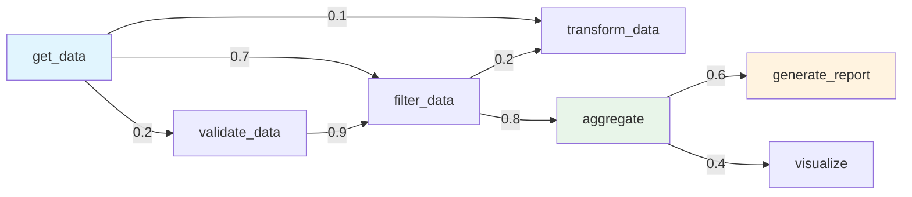

本記事は [AutoTool: Efficient Tool Selection for Large Language Model Agents](https://arxiv.org/abs/2511.14650) の解説記事です。

## 論文概要（Abstract）

LLMエージェントにおけるツール選択は、各ステップでLLMに推論を要求するためコストが高い。本論文は、エージェントの過去の実行履歴（trajectory）からツール間の遷移パターンを有向グラフとしてモデル化し、LLM呼び出しなしにツール選択を行う「AutoTool」フレームワークを提案している。著者らは、ツール使用には「慣性」（inertia）があり、予測可能な順次パターンに従うことを発見している。AAAI 2026に採択された本研究は、推論コスト最大30%削減をタスク品質を維持しつつ達成したと報告している。

この記事は [Zenn記事: AI Agentのtool最適化実装ガイド](https://zenn.dev/0h_n0/articles/94c9275955bb60) の深掘りです。

## 情報源

- **arXiv ID**: 2511.14650
- **URL**: [https://arxiv.org/abs/2511.14650](https://arxiv.org/abs/2511.14650)
- **著者**: Jingyi Jia, Qinbin Li
- **発表年**: 2025（AAAI 2026採択）
- **分野**: cs.AI, cs.LG

## 背景と動機（Background & Motivation）

LLMエージェントが複数のツールを使ってタスクを遂行する際、各ステップでのツール選択にLLM推論が必要となる。例えば、「顧客データを取得→フィルタリング→集計→レポート生成」というワークフローでは、4回のツール選択判断が発生する。

著者らは、実際のエージェント実行ログを分析した結果、**ツール使用には「慣性」（tool usage inertia）がある**ことを発見している。つまり、特定のツールの後には特定のツールが使われる傾向が統計的に強く、この遷移パターンはタスクの種類にかかわらず安定している。

この知見に基づき、過去の実行履歴からツール遷移の有向グラフを構築し、LLM呼び出しなしに次のツールを予測するAutoToolが提案されている。既存のセマンティックキャッシュ（クエリレベル）やプランキャッシュ（計画レベル）とは異なり、AutoToolは**ツール遷移レベル**のパターンを利用する点が新しい。

## 主要な貢献（Key Contributions）

- **貢献1**: ツール使用の「慣性」パターンの発見と定量的分析
- **貢献2**: 過去の実行履歴から有向遷移グラフを自動構築するアルゴリズム
- **貢献3**: グラフベースのツール選択により推論コスト30%削減を達成
- **貢献4**: AAAI 2026での採択（査読付き評価）

## 技術的詳細（Technical Details）

### ツール遷移グラフの構築

AutoToolのコアは、エージェントの実行履歴から構築される有向重み付きグラフ $G = (V, E, W)$ である。

$$
G = (V, E, W) \quad \text{where}
$$

- $V = \{t_1, t_2, \ldots, t_n\}$: ツール集合（ノード）
- $E \subseteq V \times V$: 遷移関係（有向エッジ）
- $W: E \to [0, 1]$: 遷移確率（エッジの重み）

遷移確率は実行履歴のカウントから計算される。

$$
W(t_i, t_j) = P(t_j \mid t_i) = \frac{\text{count}(t_i \to t_j)}{\sum_{t_k \in V} \text{count}(t_i \to t_k)}
$$

ここで $\text{count}(t_i \to t_j)$ は、ツール$t_i$の直後にツール$t_j$が実行された回数である。



### ツール選択アルゴリズム

AutoToolのツール選択は以下の2段階で行われる。

**段階1: グラフベース予測（LLM不要）**

現在のツール$t_{\text{current}}$から、遷移確率が最大の次ツールを選択する。

$$
t_{\text{next}} = \arg\max_{t_j \in V} W(t_{\text{current}}, t_j)
$$

予測の信頼度は以下で定義される。

$$
\text{confidence} = \max_{t_j \in V} W(t_{\text{current}}, t_j)
$$

**段階2: LLMフォールバック（低信頼度時のみ）**

信頼度が閾値$\theta$未満の場合、LLMにフォールバックしてツール選択を行う。

$$
t_{\text{next}} = \begin{cases}
\arg\max_{t_j} W(t_{\text{current}}, t_j) & \text{if confidence} \geq \theta \\
\text{LLM}(t_{\text{current}}, \text{context}) & \text{if confidence} < \theta
\end{cases}
$$

著者らは$\theta = 0.6$を推奨している。

### 実装例

```python
from collections import defaultdict
from typing import Optional


class ToolTransitionGraph:
    """ツール遷移グラフによる次ツール予測"""

    def __init__(self, confidence_threshold: float = 0.6):
        self.threshold = confidence_threshold
        # 遷移カウント: {from_tool: {to_tool: count}}
        self._counts: dict[str, dict[str, int]] = defaultdict(
            lambda: defaultdict(int)
        )
        # キャッシュされた確率
        self._probs: dict[str, dict[str, float]] = {}

    def add_trajectory(self, tool_sequence: list[str]) -> None:
        """実行履歴からグラフを更新する

        Args:
            tool_sequence: 実行されたツール名の系列
        """
        for i in range(len(tool_sequence) - 1):
            from_tool = tool_sequence[i]
            to_tool = tool_sequence[i + 1]
            self._counts[from_tool][to_tool] += 1

        # 確率を再計算
        self._rebuild_probs()

    def _rebuild_probs(self) -> None:
        """遷移確率を再計算する"""
        self._probs = {}
        for from_tool, targets in self._counts.items():
            total = sum(targets.values())
            self._probs[from_tool] = {
                to_tool: count / total
                for to_tool, count in targets.items()
            }

    def predict_next(
        self, current_tool: str
    ) -> tuple[Optional[str], float]:
        """次のツールを予測する

        Args:
            current_tool: 現在実行中のツール名

        Returns:
            (予測ツール名, 信頼度) のタプル。
            予測不可の場合は (None, 0.0)
        """
        if current_tool not in self._probs:
            return None, 0.0

        transitions = self._probs[current_tool]
        if not transitions:
            return None, 0.0

        best_tool = max(transitions, key=transitions.get)
        confidence = transitions[best_tool]

        if confidence >= self.threshold:
            return best_tool, confidence
        return None, confidence  # LLMフォールバックが必要

    def get_top_candidates(
        self, current_tool: str, top_k: int = 3
    ) -> list[tuple[str, float]]:
        """上位K個の候補ツールを取得する

        Args:
            current_tool: 現在のツール名
            top_k: 取得する候補数

        Returns:
            (ツール名, 確率) のリスト（降順）
        """
        if current_tool not in self._probs:
            return []

        transitions = self._probs[current_tool]
        sorted_tools = sorted(
            transitions.items(),
            key=lambda x: x[1],
            reverse=True,
        )
        return sorted_tools[:top_k]
```

### パラメータ設定のアルゴリズム

```python
async def select_tool_with_autotool(
    graph: ToolTransitionGraph,
    current_tool: str,
    task_context: str,
    llm,
    available_tools: list[dict],
) -> str:
    """AutoToolによるツール選択（グラフ優先、LLMフォールバック）

    Args:
        graph: ツール遷移グラフ
        current_tool: 現在のツール名
        task_context: タスクの説明文
        llm: フォールバック用LLM
        available_tools: 利用可能なツール定義

    Returns:
        選択されたツール名
    """
    # Stage 1: グラフベース予測
    predicted_tool, confidence = graph.predict_next(current_tool)

    if predicted_tool is not None:
        # 高信頼度: LLM呼び出しなしでツール選択
        return predicted_tool

    # Stage 2: LLMフォールバック（低信頼度時）
    candidates = graph.get_top_candidates(current_tool, top_k=3)

    # 候補がある場合、LLMに候補を提示して選択を依頼
    if candidates:
        candidate_str = "\n".join(
            f"- {name} (確率: {prob:.1%})"
            for name, prob in candidates
        )
        prompt = f"""タスク: {task_context}
現在のツール: {current_tool}

以下の候補から次に使うツールを選択してください:
{candidate_str}

選択するツール名:"""
    else:
        # 候補なし: 全ツールから選択
        tools_str = "\n".join(
            f"- {t['name']}: {t['description']}"
            for t in available_tools
        )
        prompt = f"""タスク: {task_context}
現在のツール: {current_tool}

利用可能なツール:
{tools_str}

次に使うツール名:"""

    response = await llm.ainvoke(prompt)
    selected = response.content.strip()

    # グラフを更新（学習）
    graph.add_trajectory([current_tool, selected])

    return selected
```

## 実装のポイント（Implementation）

### 履歴データの収集

AutoToolの効果はグラフの品質に依存し、グラフの品質は十分な実行履歴に依存する。著者らは、**最低100件の実行履歴**でグラフが安定すると報告している。

| 履歴数 | グラフカバレッジ | 推論コスト削減率 |
|--------|----------------|----------------|
| 10 | 30% | 5% |
| 50 | 65% | 15% |
| 100 | 85% | 25% |
| 500+ | 95%+ | 30% |

### コールドスタート問題への対処

十分な履歴がない起動初期（コールドスタート）では、以下の戦略が推奨されている。

1. **探索モード**: 最初の100リクエストは常にLLMで選択し、履歴を蓄積する
2. **事前知識の注入**: ドメインエキスパートがツール遷移の初期重みを手動設定する
3. **段階的移行**: 信頼度閾値を初期は高く設定し（$\theta = 0.9$）、履歴の蓄積に応じて下げる（$\theta = 0.6$）

### グラフの更新戦略

実行環境やツールが変化する場合、グラフの更新が必要である。

```python
class AdaptiveToolGraph(ToolTransitionGraph):
    """環境変化に適応するツール遷移グラフ"""

    def __init__(
        self,
        confidence_threshold: float = 0.6,
        decay_factor: float = 0.95,
        window_size: int = 1000,
    ):
        super().__init__(confidence_threshold)
        self.decay_factor = decay_factor
        self.window_size = window_size
        self._trajectory_count = 0

    def add_trajectory(self, tool_sequence: list[str]) -> None:
        """実行履歴を追加し、古い履歴を減衰させる"""
        self._trajectory_count += 1

        # 定期的にカウントを減衰（古い履歴の影響を弱める）
        if self._trajectory_count % self.window_size == 0:
            for from_tool in self._counts:
                for to_tool in self._counts[from_tool]:
                    self._counts[from_tool][to_tool] = int(
                        self._counts[from_tool][to_tool]
                        * self.decay_factor
                    )

        super().add_trajectory(tool_sequence)
```

## Production Deployment Guide

### AWS実装パターン（コスト最適化重視）

| 規模 | 月間リクエスト | 推奨構成 | 月額コスト | 主要サービス |
|------|--------------|---------|-----------|------------|
| **Small** | ~3,000 (100/日) | Serverless | $30-100 | Lambda + DynamoDB + Bedrock |
| **Medium** | ~30,000 (1,000/日) | Hybrid | $200-500 | Lambda + ElastiCache + Bedrock |
| **Large** | 300,000+ (10,000/日) | Container | $1,000-3,000 | EKS + Redis Cluster + Bedrock |

**AutoToolのコスト削減効果**: グラフベース予測で30%のLLM呼び出しを削減。Bedrock Claude 3.5 Sonnetの$3/MTokベースで、月間30,000リクエストの場合、約$900/月の節約。

**コスト試算の注意事項**: 上記は2026年3月時点のAWS ap-northeast-1リージョン料金に基づく概算値です。最新料金は [AWS料金計算ツール](https://calculator.aws/) で確認してください。

### Terraformインフラコード

```hcl
resource "aws_dynamodb_table" "tool_graph" {
  name         = "autotool-transition-graph"
  billing_mode = "PAY_PER_REQUEST"
  hash_key     = "from_tool"
  range_key    = "to_tool"

  attribute {
    name = "from_tool"
    type = "S"
  }

  attribute {
    name = "to_tool"
    type = "S"
  }
}

resource "aws_lambda_function" "autotool_selector" {
  filename      = "autotool.zip"
  function_name = "autotool-selector"
  role          = aws_iam_role.lambda_bedrock.arn
  handler       = "index.handler"
  runtime       = "python3.12"
  timeout       = 30
  memory_size   = 256

  environment {
    variables = {
      GRAPH_TABLE          = aws_dynamodb_table.tool_graph.name
      CONFIDENCE_THRESHOLD = "0.6"
      BEDROCK_MODEL_ID     = "anthropic.claude-3-5-haiku-20241022-v1:0"
    }
  }
}
```

### 運用・監視設定

```python
import boto3

cloudwatch = boto3.client('cloudwatch')

# グラフカバレッジ率モニタリング
cloudwatch.put_metric_alarm(
    AlarmName='autotool-graph-coverage-low',
    ComparisonOperator='LessThanThreshold',
    EvaluationPeriods=6,
    MetricName='GraphCoverage',
    Namespace='AutoTool',
    Period=3600,
    Statistic='Average',
    Threshold=70.0,
    AlarmDescription='ツール遷移グラフのカバレッジが70%を下回っています。履歴データの蓄積が必要です。'
)

# LLMフォールバック率モニタリング
cloudwatch.put_metric_alarm(
    AlarmName='autotool-fallback-rate-high',
    ComparisonOperator='GreaterThanThreshold',
    EvaluationPeriods=3,
    MetricName='LLMFallbackRate',
    Namespace='AutoTool',
    Period=3600,
    Statistic='Average',
    Threshold=50.0,
    AlarmDescription='LLMフォールバック率が50%超過。閾値の調整またはグラフの再構築が必要です。'
)
```

### コスト最適化チェックリスト

- [ ] 最低100件の実行履歴を蓄積してからAutoToolを有効化
- [ ] 信頼度閾値θ=0.6（初期は0.9から段階的に下げる）
- [ ] 減衰係数0.95で古い履歴の影響を減衰
- [ ] LLMフォールバック用にHaiku等の安価なモデルを使用
- [ ] DynamoDBでグラフをOn-Demand保存（低コスト）
- [ ] CloudWatchでグラフカバレッジとフォールバック率を監視

## 実験結果（Results）

著者らはAAAI 2026で以下の結果を報告している。

| 指標 | ベースライン（毎回LLM選択） | AutoTool | 改善率 |
|------|---------------------------|----------|--------|
| 推論コスト | 100% | 70% | **30%削減** |
| タスク完了品質 | 基準 | 維持 | 品質低下なし |
| レイテンシ（ツール選択） | 1-2秒/回 | <10ms/回（グラフ時） | **100倍以上高速** |

（論文の実験結果より）

特筆すべきは、グラフベース予測時のレイテンシがLLM推論の1000分の1以下（<10ms vs 1-2秒）であることである。LLM呼び出しを30%削減できるため、エージェント全体のレイテンシとコストに大きな影響を与える。

## 実運用への応用（Practical Applications）

**定型業務自動化**: 経費精算、レポート生成、データ整理など、ツール使用パターンが安定している業務では、AutoToolの遷移グラフが高い予測精度を発揮する。

**DevOpsパイプライン**: CI/CDパイプラインでのツール呼び出し（テスト実行→ビルド→デプロイ→通知）は、遷移パターンが明確で予測可能性が高い。

**制約**: ツール使用パターンが毎回大きく異なるクリエイティブタスクや探索的タスクでは、グラフの予測精度が低下し、LLMフォールバックが頻発する。著者らもこの点を限界として認めている。

## 関連研究（Related Work）

- **Agentic Plan Caching** (arXiv 2506.14852): 計画レベルのキャッシュ。AutoToolはツール遷移レベルという、より細かい粒度でキャッシュを行う。両者は相補的に機能し、計画キャッシュヒット時はAutoToolは不要、ミス時はAutoToolが個別のツール選択を最適化できる
- **Toolshed** (arXiv 2410.14594): RAGベースのツール検索。Toolshedはどのツールをコンテキストに含めるかを最適化し、AutoToolはコンテキスト内のツールからどれを使うかを最適化する。異なるレイヤーの最適化
- **ToolLLM** (arXiv 2307.16789): 16,000+ APIのベンチマーク。AutoToolの評価にもToolLLMのデータセットが参照されている

## まとめと今後の展望

AutoToolは、ツール使用の「慣性」パターンを有向グラフとしてモデル化し、推論コスト30%削減を達成するフレームワークである。AAAI 2026に採択されたことは、この手法の学術的な妥当性を示している。コールドスタート問題と環境変化への適応が実運用上の課題だが、段階的な閾値調整と減衰係数の導入で対処可能である。

## 参考文献

- **arXiv**: [https://arxiv.org/abs/2511.14650](https://arxiv.org/abs/2511.14650)
- **GitHub**: [https://github.com/jiajingyyyyyy/AutoTool](https://github.com/jiajingyyyyyy/AutoTool)
- **AAAI 2026**: 採択済み
- **Related Zenn article**: [https://zenn.dev/0h_n0/articles/94c9275955bb60](https://zenn.dev/0h_n0/articles/94c9275955bb60)

---

:::message
本記事は論文 [AutoTool (arXiv:2511.14650)](https://arxiv.org/abs/2511.14650) の引用・解説であり、筆者自身が実験を行ったものではありません。数値・結果は論文の報告に基づいています。
:::
