本記事は [Don't Break the Cache: An Evaluation of Prompt Caching for Long-Horizon Agentic Tasks](https://arxiv.org/abs/2601.06007) の解説記事です。

## 論文概要（Abstract）

LLMエージェントは複雑なマルチターンタスクにおいて大量のツール呼び出しとコンテキスト蓄積を行うが、プロンプトキャッシュによるコスト削減効果は十分に研究されていなかった。本論文は、OpenAI・Anthropic・Googleの3社APIにおけるプロンプトキャッシュ戦略を体系的に評価し、**APIコスト41-80%削減**と**Time to First Token（TTFT）13-31%短縮**を達成する設計パターンを報告している。特に、動的コンテンツの配置戦略が素朴なフルキャッシュよりも効果的であるという知見は、実務上重要である。

この記事は [Zenn記事: AI Agentのtool最適化実装ガイド](https://zenn.dev/0h_n0/articles/94c9275955bb60) の深掘りです。

## 情報源

- **arXiv ID**: 2601.06007
- **URL**: [https://arxiv.org/abs/2601.06007](https://arxiv.org/abs/2601.06007)
- **著者**: 論文著者（DeepResearch Benchチーム）
- **発表年**: 2026
- **分野**: cs.CL, cs.AI

## 背景と動機（Background & Motivation）

LLM APIプロバイダーはサーバーサイドのプロンプトキャッシュ機能を提供している。この機能は、同一プレフィックスを持つリクエスト間でKV（Key-Value）キャッシュを再利用し、入力トークンの処理コストとレイテンシを削減する。

しかし、著者らは以下の2つの課題を指摘している。

1. **キャッシュの仕組みがプロバイダーごとに異なる**: Anthropicは明示的なキャッシュポイント指定（`cache_control`）、OpenAIは自動キャッシュ（プレフィックス一致で自動適用）、Googleはコンテキストキャッシュ（明示的なキャッシュ作成API）を採用
2. **エージェントタスクでのキャッシュ効率が未検証**: チャットボット向けのキャッシュ研究は存在するが、ツール呼び出し結果がコンテキストに蓄積されるエージェントワークフローでの評価は不足

## 主要な貢献（Key Contributions）

- **貢献1**: 3社API（OpenAI、Anthropic、Google）のプロンプトキャッシュ仕様の体系的な比較分析
- **貢献2**: 3つのキャッシュ戦略（フルコンテキスト、システムプロンプトのみ、動的ツール結果除外）の実験的評価
- **貢献3**: エージェントタスクにおけるキャッシュ効率を最大化するプロンプト設計パターンの体系化

## 技術的詳細（Technical Details）

### プロンプトキャッシュの基本原理

LLM APIのプロンプトキャッシュは、Transformer推論時のKVキャッシュをリクエスト間で共有する仕組みである。KVキャッシュは、入力トークン列に対するKey・Value行列の計算結果であり、同一プレフィックスに対しては再計算を省略できる。

$$
\text{Attention}(Q, K, V) = \text{softmax}\left(\frac{QK^T}{\sqrt{d_k}}\right)V
$$

ここで、
- $Q$: クエリ行列（新規トークンから計算）
- $K$: キー行列（キャッシュ可能）
- $V$: バリュー行列（キャッシュ可能）
- $d_k$: キーの次元数

キャッシュヒット条件は以下の通りである。

$$
\text{CacheHit}(p_{\text{new}}, p_{\text{cached}}) = \begin{cases} 1 & \text{if } p_{\text{new}}[1:k] = p_{\text{cached}}[1:k] \\ 0 & \text{otherwise} \end{cases}
$$

つまり、新しいプロンプト$p_{\text{new}}$の先頭$k$トークンがキャッシュされたプロンプト$p_{\text{cached}}$の先頭$k$トークンと完全に一致する場合にのみキャッシュヒットが発生する。

### 3社APIのキャッシュ仕様比較

| 項目 | Anthropic | OpenAI | Google |
|------|-----------|--------|--------|
| 方式 | 明示的 (`cache_control`) | 自動（プレフィックス一致） | 明示的（Context Caching API） |
| 最小単位 | 1,024トークン | 1,024トークン | 32,768トークン |
| TTL | 5分（アクティブ使用で延長） | 約1時間 | 手動設定（分単位） |
| 価格割引 | 読み出し90%OFF | 読み出し50%OFF | 読み出し75%OFF |
| 書き込みコスト | 25%UP | なし（自動） | 通常トークン価格 |

### 3つのキャッシュ戦略

著者らは以下の3つの戦略を比較評価している。

```mermaid
graph TD
    subgraph "戦略1: フルコンテキストキャッシュ"
        A1[システムプロンプト] --> B1[ツール定義]
        B1 --> C1[過去の会話履歴]
        C1 --> D1[ツール実行結果]
        D1 --> E1[新規ユーザー入力]
        style A1 fill:#90EE90
        style B1 fill:#90EE90
        style C1 fill:#90EE90
        style D1 fill:#90EE90
        style E1 fill:#FFB6C1
    end

    subgraph "戦略2: システムプロンプトのみ"
        A2[システムプロンプト] --> B2[ツール定義]
        B2 --> C2[過去の会話履歴]
        C2 --> D2[ツール実行結果]
        D2 --> E2[新規ユーザー入力]
        style A2 fill:#90EE90
        style B2 fill:#90EE90
        style C2 fill:#FFB6C1
        style D2 fill:#FFB6C1
        style E2 fill:#FFB6C1
    end

    subgraph "戦略3: 動的ツール結果除外"
        A3[システムプロンプト] --> B3[ツール定義]
        B3 --> C3[過去の会話履歴]
        C3 --> D3[ツール実行結果]
        D3 --> E3[新規ユーザー入力]
        style A3 fill:#90EE90
        style B3 fill:#90EE90
        style C3 fill:#90EE90
        style D3 fill:#FFB6C1
        style E3 fill:#FFB6C1
    end
```



緑はキャッシュ対象、赤はキャッシュ非対象を示す。

### 「静的プレフィックス最大化」設計パターン

著者らが提唱する最重要の設計原則は、**動的コンテンツをプロンプトの末尾に集約する「Late Binding」原則**である。

```python
# 推奨されるプロンプト構成（キャッシュ効率最大化）

# --- 静的部分（キャッシュ対象）---
system_prompt = """あなたはリサーチアシスタントです。
Web検索ツールを使って情報を収集し、質問に回答してください。"""

tool_definitions = [
    {
        "name": "web_search",
        "description": "キーワードでWeb検索を実行する",
        "input_schema": {...}
    },
    # ... 他のツール定義
]

few_shot_examples = [
    {"role": "user", "content": "量子コンピューティングの最新動向は?"},
    {"role": "assistant", "content": "Web検索で調べます..."},
]

# --- 動的部分（キャッシュ非対象、末尾に配置）---
conversation_history = [...]  # マルチターンの会話履歴
tool_results = [...]          # ツール実行結果
user_input = "..."            # 新規ユーザー入力
timestamp = "2026-03-05"      # タイムスタンプ
session_id = "abc-123"        # セッションID
```

### キャッシュ効率の定量化

キャッシュ効率は以下の式で定義される。

$$
\eta_{\text{cache}} = \frac{T_{\text{cached}}}{T_{\text{total}}} = \frac{T_{\text{total}} - T_{\text{dynamic}}}{T_{\text{total}}} = 1 - \frac{T_{\text{dynamic}}}{T_{\text{total}}}
$$

ここで、
- $\eta_{\text{cache}}$: キャッシュ効率（0〜1）
- $T_{\text{cached}}$: キャッシュ可能なトークン数
- $T_{\text{total}}$: 総入力トークン数
- $T_{\text{dynamic}}$: 動的（キャッシュ不可）トークン数

著者らは、$\eta_{\text{cache}} \geq 0.7$（70%以上のトークンがキャッシュ可能）を目標値として推奨している。

## 実装のポイント（Implementation）

### Anthropic APIでのキャッシュ設定

```python
import anthropic

client = anthropic.Anthropic()

# cache_controlでキャッシュブレークポイントを明示指定
response = client.messages.create(
    model="claude-sonnet-4-6",
    max_tokens=4096,
    system=[
        {
            "type": "text",
            "text": "あなたはリサーチアシスタントです...",
            "cache_control": {"type": "ephemeral"}  # ここまでキャッシュ
        }
    ],
    tools=[...],  # ツール定義（システムプロンプト直後に配置）
    messages=[
        # 動的コンテンツは後方に配置
        {"role": "user", "content": user_query},
    ]
)
```

### OpenAI APIでの自動キャッシュ活用

```python
from openai import OpenAI

client = OpenAI()

# OpenAIは自動キャッシュ（設定不要）
# プレフィックス1024トークン以上の一致で自動適用
response = client.chat.completions.create(
    model="gpt-4o",
    messages=[
        # 静的部分を先頭に（自動的にキャッシュ対象）
        {"role": "system", "content": static_system_prompt},
        # Few-shot例（静的）
        {"role": "user", "content": "例1の質問"},
        {"role": "assistant", "content": "例1の回答"},
        # 動的部分は末尾
        {"role": "user", "content": dynamic_user_input},
    ],
    tools=[...],
)
```

### エージェントでのキャッシュ破壊を防ぐ設計

著者らが特に強調しているのは、**マルチターン会話での破壊的更新の回避**である。

```python
# ❌ 悪い例: 過去の会話履歴を書き換える
messages = [
    {"role": "system", "content": system_prompt},
    # 毎ターン、過去の要約を更新（キャッシュが破壊される）
    {"role": "user", "content": summarize(previous_turns)},
    {"role": "user", "content": new_input},
]

# ✅ 良い例: 過去の会話を追記のみ（キャッシュを維持）
messages = [
    {"role": "system", "content": system_prompt},
    # 過去ターンはそのまま保持
    *previous_messages,
    # 新規入力を末尾に追加
    {"role": "user", "content": new_input},
]
```

## Production Deployment Guide

### AWS実装パターン（コスト最適化重視）

| 規模 | 月間リクエスト | 推奨構成 | 月額コスト | 主要サービス |
|------|--------------|---------|-----------|------------|
| **Small** | ~3,000 (100/日) | Serverless | $40-120 | Lambda + Bedrock (Prompt Caching有効) |
| **Medium** | ~30,000 (1,000/日) | Hybrid | $250-600 | Lambda + Bedrock + ElastiCache |
| **Large** | 300,000+ (10,000/日) | Container | $1,500-4,000 | EKS + Bedrock + Redis Cluster |

**プロンプトキャッシュ適用時のコスト削減**: Bedrock Claude 3.5 Sonnetの場合、キャッシュ読み出しは通常入力価格の10%。$\eta_{\text{cache}} = 0.8$の場合、入力トークンコストが約72%削減される。

**コスト試算の注意事項**: 上記は2026年3月時点のAWS ap-northeast-1リージョン料金に基づく概算値です。最新料金は [AWS料金計算ツール](https://calculator.aws/) で確認してください。

### Terraformインフラコード

```hcl
resource "aws_lambda_function" "cache_optimized_agent" {
  filename      = "agent.zip"
  function_name = "cache-optimized-agent"
  role          = aws_iam_role.lambda_bedrock.arn
  handler       = "index.handler"
  runtime       = "python3.12"
  timeout       = 120
  memory_size   = 1024

  environment {
    variables = {
      BEDROCK_MODEL_ID     = "anthropic.claude-sonnet-4-6-20250929-v1:0"
      CACHE_STRATEGY       = "static_prefix_max"
      DYNAMIC_CONTENT_TAIL = "true"
    }
  }
}

resource "aws_elasticache_cluster" "prompt_prefix_cache" {
  cluster_id           = "prompt-prefix-cache"
  engine               = "redis"
  node_type            = "cache.t3.micro"
  num_cache_nodes      = 1
  parameter_group_name = "default.redis7"
  port                 = 6379

  tags = {
    Purpose = "Static prompt prefix storage"
  }
}
```

### 運用・監視設定

```python
import boto3

cloudwatch = boto3.client('cloudwatch')

# キャッシュヒット率モニタリング
cloudwatch.put_metric_alarm(
    AlarmName='prompt-cache-efficiency-low',
    ComparisonOperator='LessThanThreshold',
    EvaluationPeriods=3,
    MetricName='CacheEfficiency',
    Namespace='PromptCache',
    Period=3600,
    Statistic='Average',
    Threshold=0.5,
    AlarmDescription='プロンプトキャッシュ効率が50%を下回っています。動的コンテンツの配置を見直してください。'
)
```

### コスト最適化チェックリスト

- [ ] システムプロンプトを完全に静的にし、最前面に配置
- [ ] ツール定義をシステムプロンプト直後に配置（静的）
- [ ] タイムスタンプ・セッションIDを末尾に移動
- [ ] マルチターンで過去メッセージの破壊的更新を回避
- [ ] $\eta_{\text{cache}} \geq 0.7$を目標にプロンプト設計

## 実験結果（Results）

著者らはDeepResearch Benchで評価を実施している。

| プロバイダー | コスト削減率 | TTFT改善率 | 最適戦略 |
|------------|-----------|-----------|---------|
| Anthropic | **80%** | 31% | 戦略3（動的結果除外） |
| OpenAI | **41%** | 13% | 戦略1（フルコンテキスト） |
| Google | **56%** | 22% | 戦略2（システムプロンプトのみ） |

（論文Section 5の実験結果より）

重要な知見として、**フルコンテキストキャッシュ（戦略1）が必ずしも最適ではない**ことが報告されている。特にAnthropicでは、動的なツール実行結果をキャッシュ対象から除外する戦略3が最も効果的であった。これは、ツール結果がリクエストごとに異なるため、フルキャッシュではプレフィックスが頻繁に破壊されるためである。

## 実運用への応用（Practical Applications）

本論文の設計パターンは、以下のようなエージェントシステムに直接適用可能である。

**RAGシステム**: 検索結果をユーザーターンの末尾に配置し、システムプロンプト＋Few-shot例を静的キャッシュとして維持する設計が推奨される。

**カスタマーサポートBot**: 多くの対話が同じシステムプロンプトとツール定義を共有するため、キャッシュ効率が高い。著者らの分析では $\eta_{\text{cache}} \geq 0.85$ が達成可能としている。

**制約**: キャッシュTTLが短い（Anthropic: 5分）ため、リクエスト頻度が低いシステムではキャッシュが期限切れになり効果が薄い。

## 関連研究（Related Work）

- **Agentic Plan Caching** (arXiv 2506.14852): アプリケーションレベルの計画キャッシュ。本論文のプロンプトキャッシュはAPI/インフラレベルの最適化であり、相補的に機能する
- **SideQuest** (arXiv 2602.22603): モデル駆動のKVキャッシュ管理手法。長期エージェント推論でのキャッシュ効率を改善
- **SemanticALLI** (arXiv 2601.16286): 応答だけでなく推論過程もキャッシュする手法。エージェントシステムでのセマンティックキャッシュの拡張

## まとめと今後の展望

プロンプトキャッシュは、プロンプトの設計次第でコスト41-80%削減が可能な強力な最適化手法である。本論文の主要な教訓は、「動的コンテンツを末尾に集約する」という設計原則の重要性と、プロバイダーごとに最適な戦略が異なるという知見である。エージェント開発者は、自身のワークフローのキャッシュ効率 $\eta_{\text{cache}}$ を計測し、70%以上を目標に設計を最適化すべきである。

## 参考文献

- **arXiv**: [https://arxiv.org/abs/2601.06007](https://arxiv.org/abs/2601.06007)
- **Related Zenn article**: [https://zenn.dev/0h_n0/articles/94c9275955bb60](https://zenn.dev/0h_n0/articles/94c9275955bb60)

---

:::message
本記事は論文 [Don't Break the Cache (arXiv:2601.06007)](https://arxiv.org/abs/2601.06007) の引用・解説であり、筆者自身が実験を行ったものではありません。数値・結果は論文の報告に基づいています。
:::
