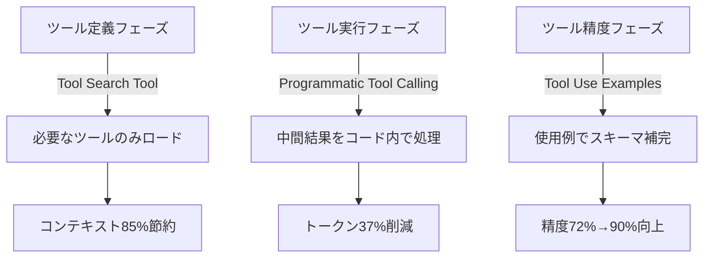

本記事は [Introducing advanced tool use on the Claude Developer Platform](https://www.anthropic.com/engineering/advanced-tool-use) の解説記事です。

## ブログ概要（Summary）

Anthropicは2025年11月、Claude Developer Platformに3つのベータ機能をリリースした。**Tool Search Tool**（ツール定義の動的検索・ロード）、**Programmatic Tool Calling**（コード実行環境でのツール一括呼び出し）、**Tool Use Examples**（ツール使用例によるスキーマ補完）である。これらは、数百〜数千のツールを持つエージェントがコンテキストウィンドウを効率的に使用するための機能群であり、Anthropicの内部テストではトークン使用量85%削減、ツール選択精度49%→74%向上が報告されている。

この記事は [Zenn記事: AI Agentのtool最適化実装ガイド](https://zenn.dev/0h_n0/articles/94c9275955bb60) の深掘りです。

## 情報源

- **種別**: 企業テックブログ
- **URL**: [https://www.anthropic.com/engineering/advanced-tool-use](https://www.anthropic.com/engineering/advanced-tool-use)
- **組織**: Anthropic Engineering
- **発表日**: 2025年11月

## 技術的背景（Technical Background）

MCP（Model Context Protocol）環境では、複数のサーバー（GitHub、Slack、Sentry、Grafana、Splunkなど）を接続すると、ツール定義だけで55K以上のトークンを消費する。Claude 3.5 Sonnetの200Kコンテキストウィンドウのうち、会話が始まる前に27%以上がツール定義で埋まる計算になる。

さらに、エージェントが5つのツールを順次実行するワークフローでは5回の推論パスが発生し、各パスでツール実行結果がコンテキストに蓄積される。Anthropicのブログでは、20以上のツール呼び出しを含むタスクで中間結果が50KB以上のコンテキストを占める事例が報告されている。

これらの課題に対し、3つの機能はそれぞれ異なるレイヤーで最適化を行う。



## 実装アーキテクチャ（Architecture）

### Tool Search Tool

Tool Search Toolは、ツール定義のオンデマンド検索を実現する仕組みである。従来は全ツールの定義をAPIリクエストの`tools`パラメータに含めていたが、Tool Search Toolでは`defer_loading: true`を指定したツールは初期ロードから除外される。

Claudeがタスクを分析し、必要なツールを判断した時点で、Tool Search Toolを使って該当ツールの定義を検索・ロードする。検索方式は**regex型**と**BM25型**の2種類が提供されている。

```python
# Tool Search Tool の設定例（Anthropic API）
tools = [
    # 検索ツール自体は常にロード（約500トークン）
    {
        "type": "tool_search_tool_regex_20251119",
        "name": "tool_search_tool_regex"
    },
    # 以下のツールは検索時にのみロード
    {
        "name": "github_create_pull_request",
        "description": "GitHubリポジトリにPull Requestを作成する。"
                       "タイトル、本文、ベースブランチを指定可能。",
        "defer_loading": True,
        "input_schema": {
            "type": "object",
            "properties": {
                "title": {"type": "string", "description": "PRのタイトル"},
                "body": {"type": "string", "description": "PRの説明"},
                "base": {"type": "string", "default": "main"}
            },
            "required": ["title", "body"]
        }
    },
    # ... 他のツールも同様
]
```

**パフォーマンス数値**（Anthropic公式ブログの報告値）:

| 指標 | 従来方式（全ツールロード） | Tool Search Tool | 改善率 |
|------|------------------------|-----------------|--------|
| ツール定義トークン数 | 約72K（50ツール） | 約8.7K | **85%削減** |
| Opus 4 精度 | 49% | 74% | **+25ポイント** |
| Opus 4.5 精度 | 79.5% | 88.1% | **+8.6ポイント** |

精度が向上する理由は、不要なツール定義がノイズとしてモデルの判断を妨げるのを防げるためである。Anthropicのブログでは「less noise leads to better tool selection」と説明されている。

**注意点**: Tool Search Toolの精度は、各ツールの`description`の品質に大きく依存する。抽象的な説明（「データを処理する」）よりも、具体的な説明（「PostgreSQLデータベースからユーザーテーブルのレコードをSQL条件で検索する」）の方が検索ヒット率が向上する。

### Programmatic Tool Calling（PTC）

PTCは、Claudeがツールを逐次呼び出す代わりに、**Pythonコードを生成して一括実行**するアプローチである。`allowed_callers`パラメータに`code_execution_20250825`を指定したツールは、直接呼び出しが禁止され、コード内からのみ呼び出し可能になる。

```python
# Programmatic Tool Calling の設定例
tools = [
    {
        "name": "get_team_members",
        "description": "指定チームのメンバー一覧を取得する",
        "allowed_callers": ["code_execution_20260120"],
        "input_schema": {
            "type": "object",
            "properties": {
                "team": {"type": "string"}
            },
            "required": ["team"]
        }
    },
    {
        "name": "get_expenses",
        "description": "指定ユーザーの経費データを取得する",
        "allowed_callers": ["code_execution_20260120"],
        "input_schema": {
            "type": "object",
            "properties": {
                "user_id": {"type": "string"},
                "quarter": {"type": "string"}
            },
            "required": ["user_id", "quarter"]
        }
    },
]

# Claudeが生成するコード例（APIレスポンスに含まれる）:
# team = await get_team_members("engineering")
# expenses = await asyncio.gather(*[
#     get_expenses(m["id"], "Q3") for m in team
# ])
# total = sum(e["amount"] for e in expenses)
# exceeded = [e for e in expenses if e["amount"] > 5000]
# print(json.dumps({
#     "total": total,
#     "exceeded_count": len(exceeded),
#     "details": exceeded
# }))
```

**コンテキスト削減のメカニズム**:

従来方式では、各ツール呼び出しの結果がClaudeのコンテキストに蓄積される。例えば、20人のチームメンバーそれぞれの経費を取得すると、20回のツール呼び出し結果がすべてコンテキストに入る。

PTCでは、これらの処理がコード実行環境内で完結し、`print()`で出力した最終結果のみがClaudeのコンテキストに返される。Anthropicの計測結果は以下の通りである。

| 指標 | 従来方式 | PTC | 改善率 |
|------|---------|-----|--------|
| 平均トークン数 | 43,588 | 27,297 | **37%削減** |
| 推論パス数（20ツール） | 20+ | 1-2 | **19パス削減** |
| 知識検索精度 | 25.6% | 28.5% | +2.9ポイント |
| GIAベンチマーク | 46.5% | 51.2% | +4.7ポイント |

### Tool Use Examples

JSON Schemaだけでは表現しきれないツールの使用パターン（日付フォーマット、IDの命名規則、ネスト構造の使い方など）を、具体的な入出力例で補完する機能である。

```python
{
    "name": "create_ticket",
    "description": "サポートチケットを作成する",
    "input_schema": {
        "type": "object",
        "properties": {
            "title": {"type": "string"},
            "priority": {"type": "string", "enum": ["low", "medium", "high", "critical"]},
            "reporter": {
                "type": "object",
                "properties": {
                    "id": {"type": "string"},
                    "contact": {
                        "type": "object",
                        "properties": {
                            "email": {"type": "string"}
                        }
                    }
                }
            }
        },
        "required": ["title", "priority"]
    },
    "input_examples": [
        {
            "title": "Login page returns 500 error",
            "priority": "critical",
            "reporter": {
                "id": "USR-12345",
                "contact": {"email": "jane@acme.com"}
            }
        }
    ]
}
```

Anthropicの内部テストでは、Tool Use Examplesの追加によりツール呼び出しの精度が72%→90%に改善したと報告されている。

## Production Deployment Guide

### AWS実装パターン（コスト最適化重視）

| 規模 | 月間リクエスト | 推奨構成 | 月額コスト | 主要サービス |
|------|--------------|---------|-----------|------------|
| **Small** | ~3,000 (100/日) | Serverless | $80-200 | Lambda + Bedrock + S3 |
| **Medium** | ~30,000 (1,000/日) | Hybrid | $400-1,000 | ECS Fargate + Bedrock + ElastiCache |
| **Large** | 300,000+ (10,000/日) | Container | $3,000-8,000 | EKS + Bedrock + Redis Cluster |

**Tool Search Tool適用時のコスト削減効果**:
- ツール定義トークン: 72K→8.7Kで85%削減
- Bedrock入力トークンコスト: $3/MTokの場合、リクエストあたり約$0.19節約
- 月間10,000リクエスト: 約$1,900/月の節約

**PTC適用時のコスト削減効果**:
- 平均トークン: 43,588→27,297で37%削減
- 推論パス削減により、API呼び出し回数自体が減少

**コスト試算の注意事項**: 上記は2026年3月時点のAWS ap-northeast-1リージョン料金とBedrock Claude 3.5 Sonnet料金に基づく概算値です。最新料金は [AWS料金計算ツール](https://calculator.aws/) で確認してください。

### Terraformインフラコード

```hcl
resource "aws_iam_role" "bedrock_agent" {
  name = "advanced-tool-use-agent"
  assume_role_policy = jsonencode({
    Version = "2012-10-17"
    Statement = [{
      Action    = "sts:AssumeRole"
      Effect    = "Allow"
      Principal = { Service = "lambda.amazonaws.com" }
    }]
  })
}

resource "aws_iam_role_policy" "bedrock_full" {
  role = aws_iam_role.bedrock_agent.id
  policy = jsonencode({
    Version = "2012-10-17"
    Statement = [
      {
        Effect   = "Allow"
        Action   = ["bedrock:InvokeModel", "bedrock:InvokeModelWithResponseStream"]
        Resource = "arn:aws:bedrock:ap-northeast-1::foundation-model/anthropic.claude-*"
      },
      {
        Effect   = "Allow"
        Action   = ["s3:GetObject", "s3:PutObject"]
        Resource = "${aws_s3_bucket.tool_definitions.arn}/*"
      }
    ]
  })
}

resource "aws_s3_bucket" "tool_definitions" {
  bucket = "tool-definitions-store"
}

resource "aws_lambda_function" "agent_handler" {
  filename      = "agent.zip"
  function_name = "advanced-tool-use-agent"
  role          = aws_iam_role.bedrock_agent.arn
  handler       = "index.handler"
  runtime       = "python3.12"
  timeout       = 120
  memory_size   = 2048

  environment {
    variables = {
      TOOL_SEARCH_ENABLED = "true"
      PTC_ENABLED         = "true"
      TOOL_DEFS_BUCKET    = aws_s3_bucket.tool_definitions.id
    }
  }
}
```

### 運用・監視設定

```python
import boto3

cloudwatch = boto3.client('cloudwatch')

# Tool Search Tool ヒット率モニタリング
cloudwatch.put_metric_alarm(
    AlarmName='tool-search-miss-rate-high',
    ComparisonOperator='GreaterThanThreshold',
    EvaluationPeriods=3,
    MetricName='ToolSearchMissRate',
    Namespace='AdvancedToolUse',
    Period=3600,
    Statistic='Average',
    Threshold=50.0,
    AlarmDescription='Tool Search Toolのミス率が50%を超過（description改善が必要）'
)

# PTCコード実行エラー率
cloudwatch.put_metric_alarm(
    AlarmName='ptc-execution-error-rate',
    ComparisonOperator='GreaterThanThreshold',
    EvaluationPeriods=2,
    MetricName='PTCErrorRate',
    Namespace='AdvancedToolUse',
    Period=300,
    Statistic='Average',
    Threshold=10.0,
    AlarmDescription='PTC実行エラー率が10%を超過'
)
```

### コスト最適化チェックリスト

- [ ] Tool Search Toolを有効化し、ツール定義トークンの85%を削減
- [ ] defer_loading: trueを全ツールに設定（検索ツール自体を除く）
- [ ] ツールのdescriptionを具体的に記述（検索精度直結）
- [ ] PTCを有効化し、3つ以上の依存ツール呼び出しを一括処理
- [ ] Tool Use Examplesを複雑なスキーマのツールに追加
- [ ] CloudWatchでTool Searchヒット率・PTCエラー率を監視

## パフォーマンス最適化（Performance）

Anthropicが報告している3機能の統合効果を整理する。

**段階的導入の推奨順序**:

1. **Tool Search Tool**（即効性が最も高い）: ツール定義トークンを85%削減。10個以上のツールがある場合は導入効果が大きい
2. **Tool Use Examples**（導入コスト最小）: 既存のツール定義にexamplesフィールドを追加するだけ。精度が72%→90%に改善
3. **Programmatic Tool Calling**（最も技術的変更が大きい）: コード実行環境の設定が必要だが、トークン37%削減の効果

**ボトルネック特定方法**: Anthropicの推奨として、まずAPIダッシュボードで以下を確認する。
- ツール定義のトークン数（10K超なら Tool Search Tool 導入）
- 1リクエストあたりの推論パス数（3回以上なら PTC 導入）
- ツール呼び出しの失敗率（10%超なら Tool Use Examples 導入）

## 運用での学び（Production Lessons）

Anthropicブログでは、以下の実運用上の知見が共有されている。

**Tool Search Toolの注意点**: regex型検索はツール名のパターンマッチに適しており、BM25型は自然言語のdescriptionマッチに適している。カスタムのembedding型検索を実装することも可能だが、多くのケースではBM25型で十分である。

**PTCの制約**: コード実行環境はサンドボックス化されているため、ファイルシステムへのアクセスやネットワーク呼び出しは制限される。ツール呼び出し以外の外部アクセスが必要な場合は、従来方式との併用が必要である。

**Tool Use Examplesの設計指針**: すべてのツールにexamplesを追加する必要はない。複雑なネスト構造を持つツール、日付やIDのフォーマットが重要なツールに絞って追加するのが効果的である。

## 学術研究との関連（Academic Connection）

Tool Search ToolはToolShed（arXiv 2410.14594）のRAGベースのツール検索と概念的に類似しているが、Anthropicの実装はAPI側に統合されている点が異なる。ToolShedがベクトル検索＋BM25のハイブリッド検索を採用しているのに対し、Tool Search Toolはregex型とBM25型の2方式を提供している。

PTCは、コード生成によるツール呼び出しの一括処理という点で、TaskWeaver（Microsoft Research）やCodeAct（arXiv 2402.01030）と関連する。これらの研究では、LLMがコードを生成して実行するパラダイムがツール呼び出し効率を改善することが示されている。

## まとめと実践への示唆

Anthropicの3機能は、LLMエージェントのツール利用における3つの主要なボトルネック（ツール定義のコンテキスト圧迫、中間結果の蓄積、スキーマの曖昧さ）にそれぞれ対処する。導入はTool Search Tool → Tool Use Examples → PTCの順で段階的に行うことが推奨されている。

## 参考文献

- **Blog URL**: [https://www.anthropic.com/engineering/advanced-tool-use](https://www.anthropic.com/engineering/advanced-tool-use)
- **API Docs (PTC)**: [https://platform.claude.com/docs/en/agents-and-tools/tool-use/programmatic-tool-calling](https://platform.claude.com/docs/en/agents-and-tools/tool-use/programmatic-tool-calling)
- **Related Zenn article**: [https://zenn.dev/0h_n0/articles/94c9275955bb60](https://zenn.dev/0h_n0/articles/94c9275955bb60)

---

:::message
本記事は [Anthropic Engineering Blog](https://www.anthropic.com/engineering/advanced-tool-use) の引用・解説であり、筆者自身がベンチマークや実験を行ったものではありません。数値はAnthropicの公式レポートに基づいています。
:::
