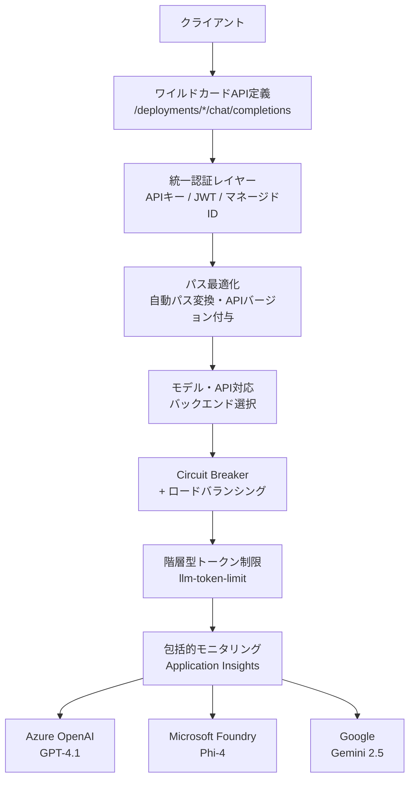

## ブログ概要（Summary）

本記事は [Microsoft Tech Community: Azure API Management - Unified AI Gateway Design Pattern](https://techcommunity.microsoft.com/blog/integrationsonazureblog/azure-api-management---unified-ai-gateway-design-pattern/4495436) の解説記事です。

欧州エネルギー企業Uniperが開発した「Unified AI Gateway」デザインパターンは、Azure API Management（APIM）のポリシー拡張性を活用し、複数のAIプロバイダー・モデル・APIフォーマットを**単一のAPIエンドポイント**で統一管理するアーキテクチャです。従来は「プロバイダー×モデル×APIバージョン」の組み合わせごとにAPI定義が必要だったのに対し、ワイルドカードAPI定義とポリシーフラグメントにより**API定義数を85%削減**し、機能デプロイを60〜180日短縮したと報告されています。

この記事は [Zenn記事: Azure OpenAIマルチリージョン負荷分散：Front Door×APIM×PTUで高可用性を設計する](https://zenn.dev/0h_n0/articles/b2bc25d92f46fb) の深掘りです。

## 情報源

- **種別**: 企業テックブログ（Microsoft Azure Integration Services Team）
- **URL**: [https://techcommunity.microsoft.com/blog/integrationsonazureblog/azure-api-management---unified-ai-gateway-design-pattern/4495436](https://techcommunity.microsoft.com/blog/integrationsonazureblog/azure-api-management---unified-ai-gateway-design-pattern/4495436)
- **組織**: Microsoft / Uniper（共同開発）
- **発表日**: 2025年（Microsoft Tech Community）

## 技術的背景（Technical Background）

生成AIの企業導入が加速する中、多くの組織が複数のAIプロバイダー（Azure OpenAI、Google Gemini、Anthropic等）とモデル（GPT-4.1、Phi-4、Gemini 2.5等）を併用するマルチモデル環境を運用しています。ブログによると、この環境では以下の3つの課題が顕在化します。

**課題1: API定義の指数的増加**。各「プロバイダー × モデル × APIタイプ × バージョン」の組み合わせが個別のAPI定義を必要とし、プロバイダーやモデルの追加のたびに管理対象が増大します。

**課題2: ルーティングの柔軟性不足**。従来の静的バックエンド紐付けでは、コスト・容量・パフォーマンスに基づく動的ルーティングが困難です。

**課題3: 管理の複雑性**。API定義の継続的メンテナンスが運用チームの負担となります。

Zenn記事で解説したAPIMのAI Gateway機能（バックエンドプール、Circuit Breaker、トークンレート制限）は個別のLLMバックエンド管理には有効ですが、マルチプロバイダー環境の統一管理には追加の抽象化レイヤーが必要です。Unified AI Gatewayパターンは、この抽象化をAPIMのポリシー拡張性で実現するアプローチです。

## 実装アーキテクチャ（Architecture）

### 7つのコアコンポーネント

Unified AI Gatewayは7つの要素で構成されています。ブログの記述に基づき、各コンポーネントの役割を解説します。



#### 1. ワイルドカードAPI定義

従来のAPIMでは、モデルごとにAPI定義（OpenAPI仕様）を用意する必要がありました。Unified AI Gatewayでは、すべてのHTTPメソッド（GET, POST, PUT, DELETE）に対して`/*`のワイルドカードオペレーションを1つ定義するだけで、新しいプロバイダーやモデルの追加時にAPIスキーマの変更が不要になります。

ブログによると、Uniperはこのアプローチにより環境あたり7つのAPI定義を1つに集約し、**85%の削減**を達成したと報告しています。

#### 2. 統一認証レイヤー

インバウンドリクエストに対して一貫した認証を強制します。

- **APIキー検証**: クライアントからのAPIキーをAPIMで検証
- **JWT検証**: OAuth 2.0 / OIDC トークンの検証
- **マネージドID**: バックエンドAIサービスへの認証にAzure Managed Identityを使用

Zenn記事で解説した`X-Azure-FDID`ヘッダー検証によるFront Doorバイパス防止と組み合わせることで、多層防御（Defense in Depth）を構成できます。

#### 3. パス最適化（Optimized Path Construction）

クライアントからのリクエストパスを自動変換し、バックエンドごとのAPIフォーマットの差異を吸収します。ブログの例では以下の変換が示されています。

```
クライアントリクエスト:
  /deployments/gpt-4.1-mini/chat/completions

自動変換後:
  /openai/deployments/gpt-4.1-mini/chat/completions?api-version=2025-01-01-preview
```

この変換はAPIMのinboundポリシーで実現されます。APIバージョンの自動付与により、クライアント側でのバージョン管理が不要になります。

#### 4. モデル・API対応バックエンド選択

リクエストのモデル名やAPIタイプに基づいて、動的にバックエンドを選択します。選択基準として以下が考慮されます。

- **容量（Capacity）**: 各バックエンドの残りTPMクォータ
- **コスト最適化**: モデルの料金差を考慮したルーティング
- **パフォーマンス**: レイテンシやスループット
- **運用要件**: データレジデンシー、コンプライアンス

#### 5. Circuit BreakerとLoad Balancing

APIMの組み込み機能を活用して以下を実現します。

- リージョンインスタンス間のトラフィック分散
- 障害閾値に達したエンドポイントの自動除外と再バランシング
- マルチリージョン冗長性

Zenn記事で詳述した`acceptRetryAfter: true`と`tripDuration: 'PT0S'`の設定は、このコンポーネントの核心部分です。

#### 6. 階層型トークン制限

`llm-token-limit`ポリシーによる消費者別のクォータ管理です。ブログでは「configurable quota thresholds」と記述されており、Zenn記事で解説したサブスクリプション単位のTPM制限と同様のアプローチが採用されています。

#### 7. 包括的モニタリング

Application Insightsとの統合により、すべてのAIリクエスト・レスポンスの一元的なログ収集と監査証跡を提供します。`llm-emit-token-metric`ポリシーによるトークン使用量の追跡もこのコンポーネントに含まれます。

### ポリシーフラグメントによるモジュラー設計

Unified AI Gatewayの実装上の特徴は、APIMの**ポリシーフラグメント**（モジュラーなポリシーコンポーネント）を活用している点です。各フラグメントは単一の責務（Single Responsibility）を持ち、再利用可能な単位として設計されています。

```xml
<!-- ポリシーフラグメントの構成例（概念図） -->
<inbound>
    <!-- Fragment 1: 認証 -->
    <include-fragment fragment-id="unified-auth" />
    <!-- Fragment 2: パス最適化 -->
    <include-fragment fragment-id="path-optimization" />
    <!-- Fragment 3: バックエンド選択 -->
    <include-fragment fragment-id="model-aware-routing" />
    <!-- Fragment 4: トークン制限 -->
    <include-fragment fragment-id="token-limiting" />
</inbound>
```

この設計により、個別のフラグメントを変更しても他のパイプラインに影響を与えず、段階的な機能追加が可能になります。

## Production Deployment Guide

### AWS実装パターン（コスト最適化重視）

Unified AI Gatewayと同等のマルチプロバイダーAIゲートウェイをAWSで構築する場合の構成を示します。

**トラフィック量別の推奨構成**:

| 規模 | 月間リクエスト | 推奨構成 | 月額コスト | 主要サービス |
|------|--------------|---------|-----------|------------|
| **Small** | ~3,000 (100/日) | Serverless | $50-150 | Lambda + Bedrock + DynamoDB |
| **Medium** | ~30,000 (1,000/日) | Hybrid | $300-800 | Lambda + ECS Fargate + ElastiCache |
| **Large** | 300,000+ (10,000/日) | Container | $2,000-5,000 | EKS + Karpenter + EC2 Spot |

**Small構成の詳細** (月額$50-150):
- **Lambda**: 1GB RAM, 60秒タイムアウト ($20/月)
- **Bedrock**: Claude 3.5 Haiku, Prompt Caching有効 ($80/月)
- **DynamoDB**: On-Demand ($10/月)
- **CloudWatch**: 基本監視 ($5/月)
- **API Gateway**: REST API ($5/月)

**Medium構成の詳細** (月額$300-800):
- **Lambda**: イベント処理 ($50/月)
- **ECS Fargate**: 0.5 vCPU, 1GB RAM × 2タスク ($120/月)
- **Bedrock**: Claude 3.5 Sonnet, Batch API活用 ($400/月)
- **ElastiCache Redis**: cache.t3.micro ($15/月)
- **Application Load Balancer**: ($20/月)

**Large構成の詳細** (月額$2,000-5,000):
- **EKS**: コントロールプレーン ($72/月)
- **EC2 Spot Instances**: g5.xlarge × 2-4台 (平均$800/月)
- **Karpenter**: 自動スケーリング（追加コストなし）
- **Bedrock Batch**: 50%割引活用 ($2,000/月)
- **S3**: プロンプトキャッシュストレージ ($20/月)
- **CloudWatch + X-Ray**: 詳細監視 ($100/月)

**コスト削減テクニック**:
- Spot Instances使用で最大90%削減（EKS + Karpenter）
- Reserved Instances購入で最大72%削減（1年コミット）
- Bedrock Batch API使用で50%削減
- Prompt Caching有効化で30-90%削減

**コスト試算の注意事項**: 上記は2026年3月時点のAWS ap-northeast-1（東京）リージョン料金に基づく概算値です。実際のコストはトラフィックパターン、リージョン、バースト使用量により変動します。最新料金は [AWS料金計算ツール](https://calculator.aws/) で確認してください。

### Terraformインフラコード

**Small構成 (Serverless): Lambda + Bedrock + DynamoDB**

```hcl
module "vpc" {
  source  = "terraform-aws-modules/vpc/aws"
  version = "~> 5.0"

  name = "ai-gateway-vpc"
  cidr = "10.0.0.0/16"
  azs  = ["ap-northeast-1a", "ap-northeast-1c"]
  private_subnets = ["10.0.1.0/24", "10.0.2.0/24"]

  enable_nat_gateway   = false
  enable_dns_hostnames = true
}

resource "aws_iam_role" "lambda_bedrock" {
  name = "lambda-bedrock-role"
  assume_role_policy = jsonencode({
    Version = "2012-10-17"
    Statement = [{
      Action    = "sts:AssumeRole"
      Effect    = "Allow"
      Principal = { Service = "lambda.amazonaws.com" }
    }]
  })
}

resource "aws_iam_role_policy" "bedrock_invoke" {
  role = aws_iam_role.lambda_bedrock.id
  policy = jsonencode({
    Version = "2012-10-17"
    Statement = [{
      Effect   = "Allow"
      Action   = ["bedrock:InvokeModel", "bedrock:InvokeModelWithResponseStream"]
      Resource = "arn:aws:bedrock:ap-northeast-1::foundation-model/anthropic.claude-3-5-haiku*"
    }]
  })
}

resource "aws_lambda_function" "ai_gateway" {
  filename      = "lambda.zip"
  function_name = "ai-gateway-handler"
  role          = aws_iam_role.lambda_bedrock.arn
  handler       = "index.handler"
  runtime       = "python3.12"
  timeout       = 60
  memory_size   = 1024

  environment {
    variables = {
      BEDROCK_MODEL_ID    = "anthropic.claude-3-5-haiku-20241022-v1:0"
      DYNAMODB_TABLE      = aws_dynamodb_table.routing_cache.name
      ENABLE_PROMPT_CACHE = "true"
    }
  }
}

resource "aws_dynamodb_table" "routing_cache" {
  name         = "ai-gateway-routing-cache"
  billing_mode = "PAY_PER_REQUEST"
  hash_key     = "route_key"

  attribute {
    name = "route_key"
    type = "S"
  }

  ttl {
    attribute_name = "expire_at"
    enabled        = true
  }
}

resource "aws_cloudwatch_metric_alarm" "lambda_cost" {
  alarm_name          = "ai-gateway-cost-spike"
  comparison_operator = "GreaterThanThreshold"
  evaluation_periods  = 1
  metric_name         = "Duration"
  namespace           = "AWS/Lambda"
  period              = 3600
  statistic           = "Sum"
  threshold           = 100000
  alarm_description   = "Lambda実行時間異常（コスト急増の可能性）"
  dimensions = {
    FunctionName = aws_lambda_function.ai_gateway.function_name
  }
}
```

**Large構成 (Container): EKS + Karpenter + Spot Instances**

```hcl
module "eks" {
  source  = "terraform-aws-modules/eks/aws"
  version = "~> 20.0"

  cluster_name    = "ai-gateway-cluster"
  cluster_version = "1.31"

  vpc_id     = module.vpc.vpc_id
  subnet_ids = module.vpc.private_subnets

  cluster_endpoint_public_access = true
  enable_cluster_creator_admin_permissions = true
}

resource "kubectl_manifest" "karpenter_provisioner" {
  yaml_body = <<-YAML
    apiVersion: karpenter.sh/v1alpha5
    kind: Provisioner
    metadata:
      name: spot-provisioner
    spec:
      requirements:
        - key: karpenter.sh/capacity-type
          operator: In
          values: ["spot"]
        - key: node.kubernetes.io/instance-type
          operator: In
          values: ["m5.xlarge", "m5.2xlarge"]
      limits:
        resources:
          cpu: "32"
          memory: "128Gi"
      providerRef:
        name: default
      ttlSecondsAfterEmpty: 30
  YAML
}

resource "aws_budgets_budget" "ai_gateway_monthly" {
  name         = "ai-gateway-monthly-budget"
  budget_type  = "COST"
  limit_amount = "5000"
  limit_unit   = "USD"
  time_unit    = "MONTHLY"

  notification {
    comparison_operator        = "GREATER_THAN"
    threshold                  = 80
    threshold_type             = "PERCENTAGE"
    notification_type          = "ACTUAL"
    subscriber_email_addresses = ["ops@example.com"]
  }
}
```

### セキュリティベストプラクティス

1. **ネットワーク**: EKSは`cluster_endpoint_public_access = false`を本番で設定、Lambda はVPC内配置
2. **認証・認可**: IAMロール最小権限、MFA必須、Kubernetes RBAC + IRSA
3. **シークレット**: AWS Secrets Manager使用、環境変数ハードコード禁止
4. **暗号化**: S3/DynamoDB/EBS全てKMS暗号化、TLS 1.2以上必須
5. **監査**: CloudTrail全リージョン有効化、GuardDuty脅威検知

### 運用・監視設定

**CloudWatch Logs Insights クエリ**:

```sql
fields @timestamp, model_id, input_tokens, output_tokens
| stats sum(input_tokens + output_tokens) as total_tokens by bin(1h)
| filter total_tokens > 100000

fields @timestamp, duration_ms
| stats pct(duration_ms, 95) as p95, pct(duration_ms, 99) as p99 by bin(5m)
```

**CloudWatch アラーム設定**:

```python
import boto3

cloudwatch = boto3.client('cloudwatch')

cloudwatch.put_metric_alarm(
    AlarmName='bedrock-token-spike',
    ComparisonOperator='GreaterThanThreshold',
    EvaluationPeriods=1,
    MetricName='TokenUsage',
    Namespace='AWS/Bedrock',
    Period=3600,
    Statistic='Sum',
    Threshold=500000,
    ActionsEnabled=True,
    AlarmActions=['arn:aws:sns:ap-northeast-1:123456789:cost-alerts'],
    AlarmDescription='Bedrockトークン使用量異常'
)
```

**X-Ray トレーシング**:

```python
from aws_xray_sdk.core import xray_recorder
from aws_xray_sdk.core import patch_all

patch_all()

@xray_recorder.capture('ai_gateway_routing')
def route_request(model_id: str, prompt: str) -> dict:
    """AIゲートウェイのルーティング処理"""
    xray_recorder.put_annotation('model', model_id)
    xray_recorder.put_metadata('prompt_length', len(prompt))
    # ルーティングロジック
    return {"status": "routed"}
```

### コスト最適化チェックリスト

**アーキテクチャ選択**:
- [ ] ~100 req/日 → Lambda + Bedrock (Serverless) - $50-150/月
- [ ] ~1000 req/日 → ECS Fargate + Bedrock (Hybrid) - $300-800/月
- [ ] 10000+ req/日 → EKS + Spot Instances (Container) - $2,000-5,000/月

**リソース最適化**:
- [ ] EC2: Spot Instances優先（最大90%削減）
- [ ] Reserved Instances: 1年コミットで72%削減
- [ ] Savings Plans: Compute Savings Plans検討
- [ ] Lambda: メモリサイズ最適化（CloudWatch Insights分析）
- [ ] ECS/EKS: アイドルタイムのスケールダウン

**LLMコスト削減**:
- [ ] Bedrock Batch API: 50%割引（非リアルタイム処理）
- [ ] Prompt Caching: 30-90%削減
- [ ] モデル選択: 開発はHaiku、本番複雑タスクはSonnet
- [ ] max_tokens設定で過剰生成防止

**監視・アラート**:
- [ ] AWS Budgets: 月額予算設定（80%警告）
- [ ] CloudWatch アラーム: トークンスパイク検知
- [ ] Cost Anomaly Detection: 自動異常検知
- [ ] 日次コストレポート: SNS/Slack送信

**リソース管理**:
- [ ] 未使用リソース削除: Trusted Advisor活用
- [ ] タグ戦略: 環境別・プロジェクト別コスト可視化
- [ ] S3ライフサイクル: 古いキャッシュ自動削除（30日）
- [ ] 開発環境: 夜間停止設定

## パフォーマンス最適化（Performance）

ブログによると、Uniperは以下の運用成果を報告しています。

**可用性**: Circuit Breakerとマルチリージョンルーティングにより、AIサービスの可用性**99.99%**を達成したと記載されています。

**デプロイ速度**: 従来のAPI定義ベースのアプローチでは新機能のデプロイに数週間〜数ヶ月を要していたのに対し、Unified AI Gatewayでは**60〜180日の短縮**が報告されています。これは、新モデルやプロバイダーの追加時にAPI定義の変更が不要になったためです。

**リクエスト性能**: ブログでは「equivalent request performance to conventional approaches（従来アプローチと同等のリクエスト性能）」と記載されており、ワイルドカードAPI定義の導入による性能劣化はないとされています。

## 運用での学び（Production Lessons）

### API定義の爆発問題

ブログで最も強調されているのは、マルチプロバイダー環境における**API定義の指数的増加**です。プロバイダー数 × モデル数 × APIバージョン数の組み合わせが、管理対象のAPI定義数を指数的に増やします。Uniperのケースでは、7つのAPI定義を1つに統合できたことが報告されています。

### ポリシーフラグメントの重要性

モノリシックなAPIMポリシー（すべてのロジックを1つのポリシーに記述）は、変更時の影響範囲が広く、テストが困難です。ポリシーフラグメントによるモジュラー設計は、マイクロサービスにおけるSingle Responsibility Principleと同様の設計思想であり、保守性の向上に貢献します。

### マルチプロバイダーのフェイルオーバー

単一プロバイダーに依存すると、そのプロバイダーの障害がサービス全体に波及します。Unified AI Gatewayパターンでは、Azure OpenAI、Google Gemini、Phi-4等の複数プロバイダーへのルーティングが可能であり、プロバイダーレベルのフェイルオーバーも実現できます。

## 学術研究との関連（Academic Connection）

Unified AI Gatewayパターンは、分散システムにおける**API Gateway**パターンの延長線上にあります。マイクロサービスアーキテクチャで確立されたAPI Gatewayパターン（認証の集約、ルーティング、レート制限）を、LLMサービングの文脈に適用したものと位置づけられます。

LLMルーティングの分野では、RouterEval（Huang et al., EMNLP 2025 Findings）がルーターメカニズムの体系的ベンチマークを提供しており、候補モデル数の増加に伴いルーターの性能が向上することを示しています。Unified AI Gatewayのモデル対応バックエンド選択は、このルーティング最適化の産業的実装として捉えることができます。

## まとめと実践への示唆

Unified AI Gatewayパターンは、Azure APIMのポリシー拡張性を活用した実践的なマルチプロバイダーAIゲートウェイの設計パターンです。Zenn記事で解説した3層アーキテクチャ（Front Door + APIM + Azure OpenAI）をさらに発展させ、プロバイダーに依存しない統一的なAPI層を構築できます。

特に、ワイルドカードAPI定義によるAPI管理の簡素化、ポリシーフラグメントによるモジュラー設計、動的バックエンド選択によるコスト最適化の3点が、マルチモデルAI基盤を運用する組織にとって参考になります。

## 参考文献

- **Blog URL**: [Azure API Management - Unified AI Gateway Design Pattern](https://techcommunity.microsoft.com/blog/integrationsonazureblog/azure-api-management---unified-ai-gateway-design-pattern/4495436)
- **Sample Code**: [Azure-Samples/APIM-Unified-AI-Gateway-Sample](https://github.com/Azure-Samples/APIM-Unified-AI-Gateway-Sample)
- **Related Zenn article**: [Azure OpenAIマルチリージョン負荷分散](https://zenn.dev/0h_n0/articles/b2bc25d92f46fb)

---

:::message
この記事はAI（Claude Code）により自動生成されました。内容の正確性については情報源の公式ブログに基づいていますが、最新の情報は公式ドキュメントもご確認ください。
:::
