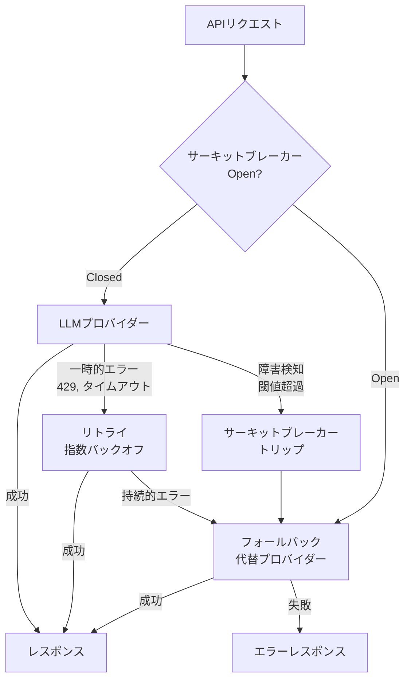
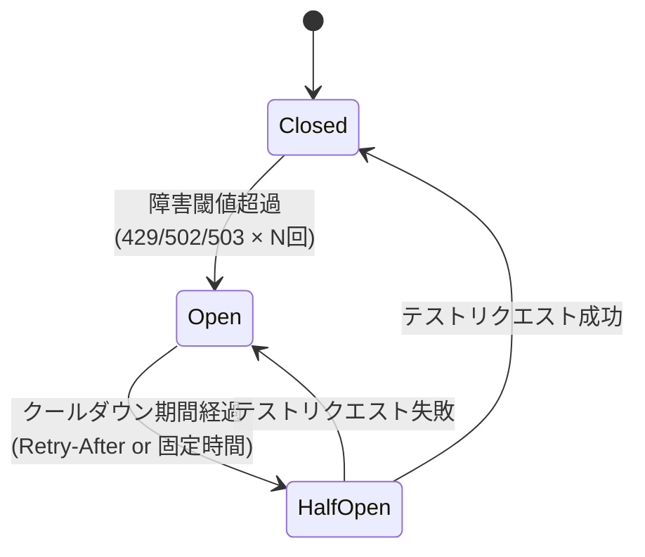

## ブログ概要（Summary）

本記事は [Portkey: Retries, fallbacks, and circuit breakers in LLM apps: what to use when](https://portkey.ai/blog/retries-fallbacks-and-circuit-breakers-in-llm-apps/) の解説記事です。

LLMアプリケーションの本番運用において、プロバイダーの障害やレート制限は避けられません。ブログでは、この問題に対する3つの相補的なパターン — **リトライ**（一時的エラーからの回復）、**フォールバック**（代替プロバイダーへの切り替え）、**サーキットブレーカー**（障害の伝播防止） — の役割と使い分けを解説しています。著者らはこれら3つを「置き換え可能」ではなく「レイヤードに組み合わせるもの」と位置づけています。

この記事は [Zenn記事: Azure OpenAIマルチリージョン負荷分散：Front Door×APIM×PTUで高可用性を設計する](https://zenn.dev/0h_n0/articles/b2bc25d92f46fb) の深掘りです。Zenn記事ではAzure APIMのCircuit Breakerと`acceptRetryAfter`の設定を解説していますが、本記事ではこれらのパターンをLLMアプリケーション全般の文脈で整理します。

## 情報源

- **種別**: 企業テックブログ（Portkey）
- **URL**: [https://portkey.ai/blog/retries-fallbacks-and-circuit-breakers-in-llm-apps/](https://portkey.ai/blog/retries-fallbacks-and-circuit-breakers-in-llm-apps/)
- **組織**: Portkey（LLM Gateway / AI Gatewayプロバイダー）
- **発表日**: 2025年

## 技術的背景（Technical Background）

LLMの本番運用では、以下のような障害パターンが頻繁に発生します。

- **429 Too Many Requests**: レート制限超過（Azure OpenAIではTPMクォータ超過時）
- **502/503**: プロバイダー側のサーバー障害
- **タイムアウト**: ネットワーク不安定やコールドスタート
- **リージョン障害**: クラウドプロバイダーのリージョンレベル障害

これらの障害に対して、リトライ・フォールバック・サーキットブレーカーの3つのパターンはそれぞれ異なるスコープと目的を持ちます。Zenn記事で解説したAzure APIMのCircuit Breakerは、このうちサーキットブレーカーパターンの具体的な実装であり、`acceptRetryAfter: true`設定はリトライパターンとの連携を実現するものです。

## 実装アーキテクチャ（Architecture）

### 3つのパターンの役割と関係

ブログの記述に基づき、3つのパターンの関係を以下のように整理します。



### パターン1: リトライ（Retries）

**対象**: 一時的な短命のエラー（ネットワーク不安定、TLSハンドシェイク失敗、コールドスタート、短期間のレート制限）

**動作**: 同じエンドポイントに対して指数バックオフ付きでリクエストを再送します。

```python
import time
from typing import TypeVar

T = TypeVar("T")


def retry_with_backoff(
    func,
    max_retries: int = 3,
    base_delay: float = 1.0,
    max_delay: float = 60.0,
    retry_after_header: float | None = None,
) -> T:
    """指数バックオフ付きリトライ

    Args:
        func: 実行する関数
        max_retries: 最大リトライ回数
        base_delay: 初回待機時間（秒）
        max_delay: 最大待機時間（秒）
        retry_after_header: Retry-Afterヘッダー値（秒）

    Returns:
        関数の戻り値
    """
    for attempt in range(max_retries + 1):
        try:
            return func()
        except (RateLimitError, TimeoutError) as e:
            if attempt == max_retries:
                raise

            if retry_after_header is not None:
                delay = retry_after_header
            else:
                delay = min(base_delay * (2 ** attempt), max_delay)

            # ジッタを追加してリトライストームを防止
            import random
            delay += random.uniform(0, delay * 0.1)

            time.sleep(delay)
```

**ブログが指摘する制約**: 「retries don't know when a failure is persistent」 — リトライは障害が持続的かどうかを判断できません。プロバイダーのリージョン障害時にリトライを繰り返すと、タイムアウト待ちの累積で大量のリクエストが無駄になります。

**Retry-Afterヘッダーの活用**: Azure OpenAIが429レスポンスで返す`Retry-After`ヘッダーに従うことで、適切なタイミングでリトライできます。Zenn記事で解説したAPIMの`acceptRetryAfter: true`は、このパターンをインフラ層で自動化するものです。

### パターン2: フォールバック（Fallbacks）

**対象**: プライマリプロバイダーの障害時に代替プロバイダーへルーティング

**動作**: プライマリが失敗したら、事前定義したセカンダリプロバイダーに切り替えます。

```python
from dataclasses import dataclass


@dataclass
class LLMProvider:
    """LLMプロバイダー定義"""
    name: str
    endpoint: str
    model: str
    priority: int


def fallback_request(
    prompt: str,
    providers: list[LLMProvider],
) -> str:
    """フォールバック付きLLMリクエスト

    Args:
        prompt: プロンプト
        providers: 優先度順のプロバイダーリスト

    Returns:
        LLMレスポンス
    """
    sorted_providers = sorted(providers, key=lambda p: p.priority)

    for provider in sorted_providers:
        try:
            return call_llm(provider, prompt)
        except Exception as e:
            log_warning(
                f"Provider {provider.name} failed: {e}, "
                f"trying next..."
            )
            continue

    raise AllProvidersFailedError("All providers exhausted")
```

**ブログが指摘する制約**:
1. **反応的（Reactive）**: タイムアウトを待ってから切り替えるため、レイテンシが増加する
2. **共有障害ドメイン**: フォールバック先が同じ基盤インフラ上にある場合、同時に障害が発生する可能性がある

Zenn記事の文脈では、PTU → PAYGのスピルオーバーがフォールバックパターンの一種です。PTUのCircuit Breakerがトリップすると、PAYG（フォールバック先）にルーティングされます。

### パターン3: サーキットブレーカー（Circuit Breakers）

**対象**: 障害の伝播防止。異常なエンドポイントを自動的にルーティングプールから除外

**動作**: 障害メトリクス（失敗回数、失敗率、特定のHTTPステータスコード）を監視し、閾値を超えたらサーキットを「Open」にしてトラフィックを遮断します。クールダウン期間後に「Half-Open」状態で一部リクエストを通し、正常なら「Closed」に戻します。



**ブログが示す定量的効果**: 毎分100リクエストのアプリケーションで5分間のリージョン障害が発生した場合、サーキットブレーカーにより**500〜1,000秒のタイムアウト待ち**を回避でき、**25,000〜50,000リクエスト**を正常なリージョンで処理できるとされています。

### 3パターンの組み合わせ

ブログの核心的主張は、「Retries help you recover from the small stuff. Fallbacks provide a plan B. And circuit breaker is the ultimate backup.」です。3つを**レイヤードに組み合わせる**ことで、障害の規模に応じた段階的な回復が実現します。

| パターン | 対象障害 | スコープ | レイテンシ影響 |
|---------|---------|---------|-------------|
| リトライ | 一時的（秒単位） | 同一エンドポイント | 低（バックオフ待ち） |
| フォールバック | 中期的（分単位） | 代替プロバイダー | 中（切替コスト） |
| サーキットブレーカー | 持続的（分〜時間） | ルーティングプール全体 | 低（即座に除外） |

Zenn記事のAPIM設定に当てはめると:
- **リトライ**: `Retry-After`ヘッダーに従ったリトライ（`acceptRetryAfter: true`）
- **フォールバック**: PTU → PAYGのスピルオーバー（バックエンドプールのpriority設定）
- **サーキットブレーカー**: APIMのCircuit Breaker（`failureCondition`と`tripDuration`）

## パフォーマンス最適化（Performance）

ブログでは具体的なベンチマーク数値は示されていませんが、サーキットブレーカーの導入による定量的効果の試算が示されています。

**障害シナリオ**: 100 req/min、5分間のリージョン障害
- **サーキットブレーカーなし**: 500リクエスト × 10秒タイムアウト = 5,000秒の無駄
- **サーキットブレーカーあり**: 最初の数リクエストで検知 → 即座に代替リージョンへ

この試算は、Zenn記事で解説したFront Door + APIMの3層アーキテクチャにおけるサーキットブレーカーの価値を裏付けています。

## 運用での学び（Production Lessons）

### リトライストームの危険性

ブログで特に強調されているのは、リトライの制約です。プロバイダーの大規模障害時にリトライを無制限に繰り返すと、以下のような「リトライストーム」が発生します。

1. 障害発生 → 全クライアントがリトライ開始
2. リトライリクエストがプロバイダーの負荷を増加
3. 障害が悪化 → さらにリトライ増加
4. カスケード障害

**対策**: 指数バックオフ + ジッタ + 最大リトライ回数の設定、およびサーキットブレーカーによる早期遮断。

### フォールバックの共有障害ドメイン

フォールバック先が同じクラウドプロバイダーの別リージョンである場合、リージョン横断的な障害（DNS障害、コントロールプレーン障害等）で両方が同時に影響を受けるリスクがあります。Zenn記事のマルチリージョン構成でも、Azure全体の障害には脆弱です。完全な冗長性には、マルチクラウド（Azure + AWS等）の検討が必要です。

### サーキットブレーカーの閾値設計

閾値の設計は難しく、ブログでは以下の監視メトリクスが推奨されています。

- **リクエスト失敗回数**: 絶対数での閾値（例: 10秒間で3回失敗）
- **失敗率**: 割合での閾値（例: 失敗率50%超過）
- **特定HTTPステータスコード**: 429、502、503をトリガーに設定

Zenn記事のAPIM設定では`failureCondition.count: 1`（PTU）と`count: 3`（PAYG）の非対称設定が示されています。PTUは1回の429で即トリップ（固定費を守るため早期にPAYGへ切り替え）、PAYGは3回まで許容（従量課金のため多少のリトライは許容）という設計思想です。

## 学術研究との関連（Academic Connection）

サーキットブレーカーパターンは、Michael Nygard著『Release It!』（2007年）で体系化された分散システムの安定性パターンです。Netflix OSS の Hystrix（現在はResilience4jに移行）が産業界での標準実装として広く採用されました。

LLMサービングの文脈では、SemCache（arXiv:2502.03771）がキャッシュ層での障害耐性を提供し、RouterEval（EMNLP 2025）がルーティング層の最適化を研究しています。これらとサーキットブレーカーパターンを組み合わせることで、多層的な障害耐性が実現されます。

## まとめと実践への示唆

リトライ・フォールバック・サーキットブレーカーの3つのパターンは、LLMアプリケーションの障害耐性を構築する基本要素です。これらは置き換え可能ではなく、レイヤードに組み合わせることで、一時的エラーから持続的障害まで段階的に対応できます。

Zenn記事のAzure APIM設定（Circuit Breaker + `acceptRetryAfter` + PTU/PAYGスピルオーバー）は、この3パターンをインフラ層で統合した実践的な実装例です。

## 参考文献

- **Blog URL**: [Retries, fallbacks, and circuit breakers in LLM apps](https://portkey.ai/blog/retries-fallbacks-and-circuit-breakers-in-llm-apps/)
- **Related**: Michael Nygard, "Release It!" (2018, 2nd Edition)
- **Related Zenn article**: [Azure OpenAIマルチリージョン負荷分散](https://zenn.dev/0h_n0/articles/b2bc25d92f46fb)

---

:::message
この記事はAI（Claude Code）により自動生成されました。内容の正確性については情報源のブログに基づいていますが、最新の情報は公式ドキュメントもご確認ください。
:::
