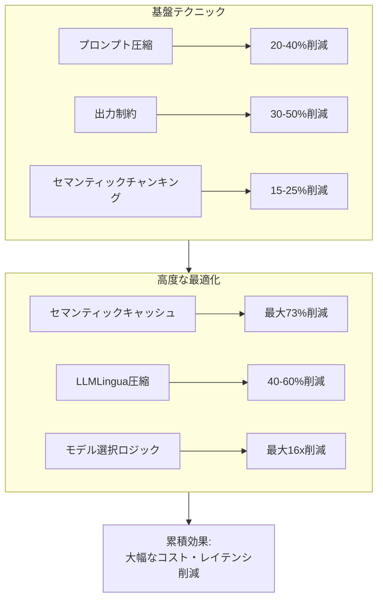
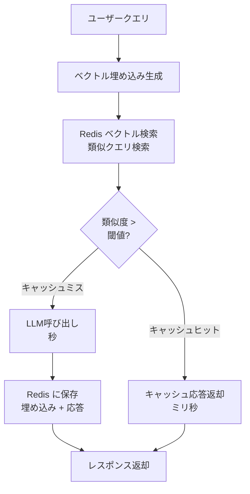

## ブログ概要（Summary）

本記事は [Redis: LLM Token Optimization: Cut Costs & Latency in 2026](https://redis.io/blog/llm-token-optimization-speed-up-apps/) の解説記事です。

LLMのトークンはAPI利用の「通貨」であり、各トークンがコストとレイテンシに直結します。ブログでは、トークン消費の最適化手法を**基盤テクニック**（追加ツール不要）と**高度な最適化**（セマンティックキャッシュ等）に分類し、実践的なコスト削減アプローチを解説しています。Redis LangCacheによるセマンティックキャッシュでは、高頻度クエリワークロードで**最大73%のコスト削減**が達成されたと報告されています。

この記事は [Zenn記事: Azure OpenAIマルチリージョン負荷分散：Front Door×APIM×PTUで高可用性を設計する](https://zenn.dev/0h_n0/articles/b2bc25d92f46fb) の深掘りです。Zenn記事ではAPIMのトークンレート制限（`llm-token-limit`）とセマンティックキャッシュを解説していますが、本記事ではトークン最適化をより広い視点から整理します。

## 情報源

- **種別**: 企業テックブログ（Redis）
- **URL**: [https://redis.io/blog/llm-token-optimization-speed-up-apps/](https://redis.io/blog/llm-token-optimization-speed-up-apps/)
- **組織**: Redis（セマンティックキャッシュ・ベクトル検索プロバイダー）
- **発表日**: 2026年

## 技術的背景（Technical Background）

### トークンのコスト構造

ブログによると、LLMのトークンは約4文字の英語テキストに相当し、100語の段落で約133トークンを消費します。重要なのは、**入力トークンと出力トークンのコスト差**です。

ブログが示すコスト構造:
- **入力トークン**: $2〜3 / 100万トークン
- **出力トークン**: $10〜15 / 100万トークン（入力の4〜5倍）

この非対称なコスト構造は、出力トークンの削減がコスト最適化に大きく寄与することを意味します。ブログの試算では、月100万会話（各500入力 + 200出力トークン）の場合、フラッグシップモデルで**$3,250/月**、バジェットモデルで**$195/月**（16倍安価）と報告されています。

### レイテンシへの影響

ブログはLLM推論の2フェーズを説明しています。

1. **プリフィルフェーズ**: 入力トークンを並列処理（比較的高速）
2. **デコードフェーズ**: 出力トークンを逐次生成（各トークン10〜100ms）

デコードフェーズでは、GPUがモデル重みとKVキャッシュを毎回メモリから読み込む必要があり、**メモリ帯域幅がボトルネック**になります。出力トークンの削減は、コストだけでなくレイテンシ改善にも直結します。

## 実装アーキテクチャ（Architecture）

### トークン最適化の全体像

ブログの内容に基づき、トークン最適化手法を体系的に整理します。



### 基盤テクニック（追加ツール不要）

#### 1. プロンプト圧縮

ブログが示す例:

```python
# 冗長なプロンプト（18トークン）
prompt_verbose = (
    "Could you please provide me with a comprehensive overview "
    "of my scheduled appointments for today?"
)

# 最適化されたプロンプト（8トークン、2.25倍効率的）
prompt_optimized = "What's on my calendar today?"
```

**実践ルール**:
- キーワードを先頭に配置
- 構造化出力（JSON等）を要求
- 生成ではなく抽出を指示

#### 2. 出力制約

```python
# max_tokensの明示的設定
response = client.chat.completions.create(
    model="gpt-4",
    max_tokens=100,  # ハードリミット
    messages=[
        {
            "role": "user",
            "content": "50語以内で回答: [質問]"
        }
    ],
)
```

出力トークンは入力の4〜6倍のコストがかかるため、`max_tokens`の設定とプロンプト内での出力長指示の両方が効果的です。

#### 3. セマンティックチャンキング

RAGシステムでは、文書を固定長（文字数）ではなく**意味的な単位**で分割することで、必要なコンテキストのみをプロンプトに含め、トークン消費を削減します。

### 高度な最適化

#### セマンティックキャッシュアーキテクチャ

ブログはRedisをベースとしたセマンティックキャッシュの実装パターンを示しています。



**Redis LangCacheの特徴**:
- **ベクトル検索**: 数百万ベクトルに対してサブミリ秒の検索
- **距離メトリクス**: コサイン類似度、ユークリッド距離、内積
- **統一ストレージ**: ベクトルDB + キャッシュ + セッション管理を1つのRedisインスタンスで実現

**性能**: ブログによると、高頻度クエリワークロードで**最大73%のコスト削減**を達成。「What's the weather like today?」と「How's the weather right now?」が類似度閾値に基づき同一キャッシュエントリにヒットする例が示されています。

#### モデル選択ロジック

タスクの複雑さに応じてモデルを使い分けることで、コストを大幅に削減できます。

| タスク種別 | 推奨モデル | コスト比 |
|-----------|-----------|---------|
| 分類・抽出 | バジェットモデル（Haiku等） | 1x（基準） |
| 要約・翻訳 | 中間モデル（Sonnet等） | 10-20x |
| 複雑な推論 | フラッグシップモデル（Opus等） | 50-100x |

Zenn記事の文脈では、APIMの`llm-token-limit`ポリシーによるサブスクリプション別TPM制限と組み合わせることで、組織内のモデル利用を最適化できます。

#### LLMLingua圧縮

ブログはLLMLinguaによるプロンプト圧縮を推奨しています。特にRAGシステムで取得した長いコンテキストの圧縮に有効で、性能の劣化を最小限に抑えながらトークン数を削減できます（参考: [LLMLingua論文 arXiv:2310.05736](https://arxiv.org/abs/2310.05736)）。

## パフォーマンス最適化（Performance）

### 追跡すべきメトリクス

ブログが推奨するトークン最適化のモニタリング指標:

| メトリクス | 説明 | 目的 |
|-----------|------|------|
| クエリタイプ別トークン消費 | タイプごとの入力/出力トークン数 | 最適化対象の特定 |
| キャッシュヒット率 | セマンティックキャッシュのヒット率 | キャッシュ効果の測定 |
| TTFT（Time to First Token） | 最初のトークンまでの時間 | 体感速度の測定 |
| クエリタイプ別推論レイテンシ | タイプごとのレイテンシ | ボトルネック特定 |
| ユーザーインタラクション単価 | 1インタラクションあたりのコスト | ROI測定 |

### 累積効果

ブログは、最適化テクニックの**累積効果**を強調しています。プロンプト圧縮 + セマンティックチャンキング + LLMLingua圧縮 + セマンティックキャッシュの各層がLLMに渡されるトークン数を段階的に削減し、高トラフィックアプリケーションではクエリあたりの小さな改善が月間で大きなコスト削減に繋がります。

## 運用での学び（Production Lessons）

### 会話履歴のトークン膨張

ブログが指摘する見落としがちな問題として、マルチターン会話での**会話履歴の累積的なトークン増加**があります。20ターンの会話では5,000〜10,000トークンに達しますが、直近のコンテキストのみ（500〜1,000トークン）で十分なケースが多いとされています。

対策:
- 古い会話の要約圧縮
- スライディングウィンドウ方式（直近N件のみ保持）
- 重要度スコアリングによる選択的保持

### RAGコンテキストの最適化

必要以上のドキュメントを取得すると、低関連度の情報でコンテキストウィンドウが埋まり、トークン消費と回答品質の両方に悪影響を与えます。トークン予算を固定し、関連度の高い情報を優先的に含める戦略が推奨されています。

### セマンティックキャッシュとAzure APIMの関連

Zenn記事で解説したAPIMの`llm-semantic-cache-lookup`ポリシーは、ブログで解説されたセマンティックキャッシュパターンの具体的な実装です。ブログの知見をAPIMに適用する際の注意点:

- APIMの`score-threshold`（低いほど厳密）とRedisの類似度閾値（高いほど厳密）は方向が逆
- APIMはAzure Managed Redisをバックエンドとして使用するため、ブログのRedis知見が直接適用可能
- `vary-by`パラメータでサブスクリプション別のキャッシュ分離が可能

## 学術研究との関連（Academic Connection）

セマンティックキャッシュの学術的基盤としては、SemCache（Huang et al., arXiv:2502.03771）が関連します。SemCacheはEBSベースのキャッシュのFPR（40.2%）を指摘し、LLMジャッジによる二段階検証を提案しています。ブログで紹介されたRedis LangCacheはEBSベースのアプローチですが、SemCacheのLES技術を組み合わせることでさらなる精度向上が期待できます。

また、プロンプト圧縮については、LLMLingua（Jiang et al., arXiv:2310.05736）が代表的な研究です。

## まとめと実践への示唆

トークン最適化は、LLMアプリケーションのコスト削減とレイテンシ改善の両方に寄与する実践的なアプローチです。基盤テクニック（プロンプト圧縮、出力制約）から開始し、トラフィック増加に応じてセマンティックキャッシュを導入する段階的なアプローチがブログで推奨されています。

Zenn記事のAPIM設定（`llm-token-limit` + `llm-semantic-cache-lookup`）は、このトークン最適化戦略をインフラ層で実装したものです。ブログの知見と組み合わせることで、アプリケーション層とインフラ層の両面からトークン消費を最適化できます。

## 参考文献

- **Blog URL**: [LLM Token Optimization: Cut Costs & Latency in 2026](https://redis.io/blog/llm-token-optimization-speed-up-apps/)
- **Related Paper**: LLMLingua - [https://arxiv.org/abs/2310.05736](https://arxiv.org/abs/2310.05736)
- **Related**: Redis LangCache - [https://redis.io/solutions/langcache](https://redis.io/solutions/langcache)
- **Related Zenn article**: [Azure OpenAIマルチリージョン負荷分散](https://zenn.dev/0h_n0/articles/b2bc25d92f46fb)

---

:::message
この記事はAI（Claude Code）により自動生成されました。内容の正確性については情報源のブログに基づいていますが、最新の情報は公式ドキュメントもご確認ください。
:::
