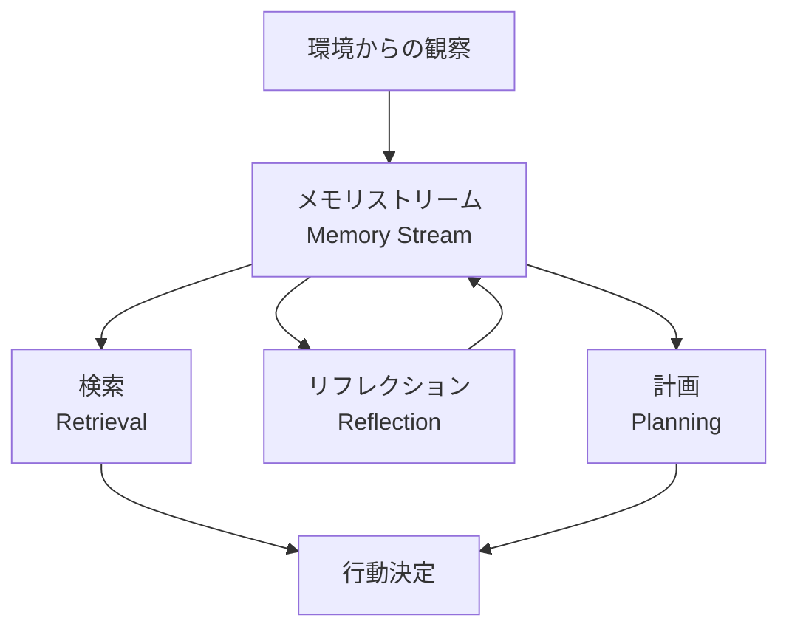
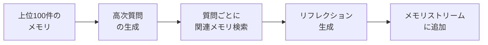

本記事は [arXiv:2304.03442 Generative Agents: Interactive Simulacra of Human Behavior](https://arxiv.org/abs/2304.03442) の解説記事です。

## 論文概要（Abstract）

Park, O'Brien, Cai, Morris, Liang, Bernstein（Stanford/Google, 2023）は、大規模言語モデルを拡張し、エージェントの経験を自然言語で完全に記録し、時間とともに高次のリフレクションに統合し、行動計画のために動的に検索するアーキテクチャを提案している。25体のエージェントが仮想環境「Smallville」で自律的に日常生活を送り、バレンタインデーパーティーの企画・招待・参加といった複雑な社会的行動を創発する様子が実証されている。

この論文は、Bedrock AgentCoreのExtraction→Consolidation→Reflectionアーキテクチャの理論的基盤となる研究であり、エピソード記憶とリフレクション生成の設計思想を理解する上で重要な1次情報である。

この記事は [Zenn記事: Bedrock AgentCoreエピソード記憶で顧客サポートの応答一貫性を向上させる](https://zenn.dev/0h_n0/articles/43fd3b0e65a835) の深掘りです。

## 情報源

- **arXiv ID**: 2304.03442
- **URL**: [https://arxiv.org/abs/2304.03442](https://arxiv.org/abs/2304.03442)
- **著者**: Joon Sung Park, Joseph C. O'Brien, Carrie J. Cai et al.
- **発表年**: 2023
- **分野**: cs.HC, cs.AI, cs.LG
- **引用数**: 5000+（2026年3月時点、Google Scholar参照）

## 背景と動機（Background & Motivation）

著者らは、信頼性のある人間行動のシミュレーションが、ゲーム、ソーシャルコンピューティング、プロトタイプ設計などの幅広い応用を持つと指摘している。従来のゲームAIやチャットボットは、事前定義されたルールベースの行動パターンに依存しており、長期的な記憶の保持、社会的関係の発展、環境からの学習といった能力が欠如していた。

著者らは、LLMが単体では「直近の会話履歴のみ」に依存する制約を指摘し、以下の3つの能力をアーキテクチャレベルで実現する必要があると主張している：

1. **経験の完全な記録**: すべての観察・会話を自然言語で保存
2. **高次の抽象化**: 個別の経験から一般的な洞察（リフレクション）を生成
3. **動的な検索**: 現在の状況に最も関連する記憶を効率的に取得

## 主要な貢献（Key Contributions）

- **メモリストリーム**: すべての経験を自然言語で記録するメモリアーキテクチャ。時系列順に格納され、各エントリに重要度スコアが付与される
- **リフレクション機構**: 蓄積されたメモリから高次の洞察を自動生成するプロセス。個別の経験を抽象化し、行動の指針となる知識を生成
- **検索スコアリング**: Recency（最新性）× Importance（重要度）× Relevance（関連度）の合成スコアによる動的メモリ検索

## 技術的詳細（Technical Details）

### 全体アーキテクチャ

Generative Agentsのアーキテクチャは、以下の3つのコンポーネントで構成される。



#### メモリストリーム（Memory Stream）

メモリストリームは、エージェントのすべての経験を時系列順に記録するデータストアである。各メモリエントリは以下の属性を持つ：

- **自然言語記述**: 経験の内容（例: 「田中さんが配送状況について問い合わせた」）
- **作成タイムスタンプ**: メモリが記録された時刻
- **最終アクセスタイムスタンプ**: 最後に検索で取得された時刻
- **重要度スコア**: LLMが1〜10で評価した重要度

論文によると、重要度スコアはLLMに以下のようなプロンプトで評価させる：

```
On the scale of 1 to 10, where 1 is purely mundane
(e.g., brushing teeth, making bed) and 10 is
extremely poignant (e.g., a break up, college
acceptance), rate the likely poignancy of the
following piece of memory.
Memory: [メモリ内容]
Rating: <fill in>
```

#### 検索スコアリング

論文の核心的な貢献の1つが、3要素の合成スコアによるメモリ検索である。あるクエリ $q$ に対するメモリ $m$ のスコアは以下のように計算される：

$$
\text{score}(q, m) = \alpha \cdot \text{recency}(m) + \beta \cdot \text{importance}(m) + \gamma \cdot \text{relevance}(q, m)
$$

ここで、

- $\alpha, \beta, \gamma$: 各要素の重み係数（論文では $\alpha = \beta = \gamma = 1$）
- $\text{recency}(m)$: 最新性スコア。最終アクセスからの時間 $t$ に対して指数減衰を適用

$$
\text{recency}(m) = \exp(-\lambda \cdot t)
$$

（$\lambda$: 減衰パラメータ、$t$: 最終アクセスからの経過時間）

- $\text{importance}(m)$: LLMが1〜10で評価した重要度スコア（0-1に正規化）

$$
\text{importance}(m) = \frac{\text{LLM\_rating}(m)}{10}
$$

- $\text{relevance}(q, m)$: クエリとメモリの埋め込みベクトル間のコサイン類似度

$$
\text{relevance}(q, m) = \frac{\mathbf{e}_q \cdot \mathbf{e}_m}{\|\mathbf{e}_q\| \cdot \|\mathbf{e}_m\|}
$$

（$\mathbf{e}_q$: クエリの埋め込み、$\mathbf{e}_m$: メモリの埋め込み）

この3要素スコアリングの設計により、「最近の経験」「重要な経験」「現在の状況に関連する経験」がバランスよく検索される。

### リフレクション生成

リフレクションは、蓄積されたメモリから高次の洞察を自動生成するプロセスである。論文によると、以下の2段階で実行される。

**Stage 1: リフレクション対象の決定**

最近の高スコアメモリ（上位100件）を取得し、LLMに「これらの経験から得られる3つの高次の質問」を生成させる。

```
Given only the information above, what are 3 most
salient high-level questions we can answer about
the subjects in the statements?
```

**Stage 2: リフレクションの生成**

生成された各質問に対して、関連するメモリを検索し、LLMが洞察を生成する。生成されたリフレクションは、新たなメモリエントリとしてメモリストリームに追加される。



**リフレクションの重要な特性**: リフレクション自体がメモリストリームに追加されるため、リフレクションに基づいたさらに高次のリフレクションが生成され得る。論文では、これを「リフレクションの連鎖」と呼んでおり、抽象度の異なる複数レベルの洞察が自然に形成されることが示されている。

### アルゴリズム

```python
import math
from dataclasses import dataclass, field


@dataclass
class MemoryEntry:
    """メモリストリームの1エントリ"""
    description: str
    created_at: float
    last_accessed: float
    importance: float  # 0.0-1.0
    embedding: list[float]
    is_reflection: bool = False
    evidence: list[int] = field(default_factory=list)


def retrieve_memories(
    query: str,
    memory_stream: list[MemoryEntry],
    current_time: float,
    decay_factor: float = 0.995,
    top_k: int = 10,
    alpha: float = 1.0,
    beta: float = 1.0,
    gamma: float = 1.0,
) -> list[MemoryEntry]:
    """3要素合成スコアによるメモリ検索（論文Section 3.2の実装）

    Args:
        query: 検索クエリ
        memory_stream: メモリストリーム
        current_time: 現在時刻
        decay_factor: 最新性の減衰係数
        top_k: 取得するメモリ数
        alpha: 最新性の重み
        beta: 重要度の重み
        gamma: 関連度の重み

    Returns:
        スコア上位k件のメモリリスト
    """
    query_embedding = embed(query)
    scored_memories = []

    for mem in memory_stream:
        # Recency: 指数減衰
        hours_since_access = (current_time - mem.last_accessed) / 3600
        recency = math.pow(decay_factor, hours_since_access)

        # Importance: LLMが評価した重要度（0-1）
        importance = mem.importance

        # Relevance: コサイン類似度
        relevance = cosine_similarity(query_embedding, mem.embedding)

        # 合成スコア
        score = alpha * recency + beta * importance + gamma * relevance
        scored_memories.append((score, mem))

    # スコア降順でソートし上位k件を返す
    scored_memories.sort(key=lambda x: x[0], reverse=True)
    return [mem for _, mem in scored_memories[:top_k]]


def generate_reflections(
    memory_stream: list[MemoryEntry],
    current_time: float,
    top_n: int = 100,
) -> list[MemoryEntry]:
    """リフレクション生成（論文Section 3.3の実装）

    Args:
        memory_stream: メモリストリーム
        current_time: 現在時刻
        top_n: リフレクション対象のメモリ数

    Returns:
        生成されたリフレクションのリスト
    """
    # Stage 1: 最近の高スコアメモリからリフレクション対象を選択
    recent_memories = sorted(
        memory_stream,
        key=lambda m: m.importance + (1 - (current_time - m.created_at) / 86400),
        reverse=True,
    )[:top_n]

    # Stage 2: 高次質問の生成
    questions = llm_generate_questions(recent_memories, n_questions=3)

    # Stage 3: 各質問に対してリフレクションを生成
    reflections = []
    for question in questions:
        relevant = retrieve_memories(question, memory_stream, current_time)
        reflection_text = llm_generate_reflection(question, relevant)
        reflection = MemoryEntry(
            description=reflection_text,
            created_at=current_time,
            last_accessed=current_time,
            importance=0.8,  # リフレクションは高い重要度
            embedding=embed(reflection_text),
            is_reflection=True,
            evidence=[id(m) for m in relevant],
        )
        reflections.append(reflection)

    return reflections
```

## 実装のポイント（Implementation）

論文およびGitHubリポジトリ（[joonspk-research/generative_agents](https://github.com/joonspk-research/generative_agents)）から読み取れる実装上の注意点：

- **メモリストリームのスケーラビリティ**: 全メモリに対して毎回スコアを計算するため、メモリ数の増加に伴い検索コストが線形に増大する。本番環境ではベクトルDBによるANN（近似最近傍）検索が必要
- **重要度スコアのLLMコール**: 各メモリに対して重要度を評価するLLMコールが発生するため、コスト面の考慮が必要。AgentCoreではこのスコアリングが内部的に処理される
- **リフレクション生成の頻度**: 論文では「累積重要度が閾値を超えた場合」にリフレクションを生成するとされているが、閾値の設定は経験的に調整が必要
- **GPT-3.5 Turbo時代の設計**: 論文はGPT-3.5 Turbo（2023年）を前提としており、現在のモデル（Claude Sonnet 4.6等）ではコンテキスト長が大幅に拡大しているため、メモリ管理の設計も見直しの余地がある

## 実験結果（Results）

### アブレーションスタディ

著者らは、アーキテクチャの各コンポーネントの寄与を評価するためにアブレーションスタディを実施している。論文のFigure 3より、以下の結果が報告されている：

| 構成 | 行動の信頼性 |
|------|------------|
| Full Architecture（観察+計画+リフレクション） | 最高スコア |
| 計画なし | 行動の一貫性が低下 |
| リフレクションなし | 長期的な行動パターンの質が低下 |
| 観察+リフレクションなし | 大幅に信頼性が低下 |

著者らの分析によると、リフレクション機構の除去は「エージェントが過去の経験から学習する能力を失わせる」効果があり、AgentCoreがリフレクション生成を重要な機能として組み込んでいる設計根拠と一致する。

### 創発行動の観察

論文では、25体のエージェントによるサンドボックスシミュレーションで以下の創発行動が観察されたと報告されている：

- **情報の自律的拡散**: あるエージェントがバレンタインデーパーティーを企画し、他のエージェントに招待が自律的に広がる
- **社会的関係の形成**: 共通の関心を持つエージェント同士が自然に関係を深める
- **記憶に基づく意思決定**: 過去の経験（リフレクション含む）に基づいて将来の行動を決定

## 実運用への応用（Practical Applications）

### AgentCoreエピソード記憶との設計思想の対応

Generative AgentsのアーキテクチャとAgentCoreのエピソード記憶には、以下の設計思想の対応関係がある：

| Generative Agents | AgentCore エピソード記憶 | 共通する設計思想 |
|-------------------|------------------------|----------------|
| メモリストリーム | CreateEvent API | 経験の完全な記録 |
| 重要度スコア | エピソード完了検出 | 重要な経験の識別 |
| リフレクション | Reflection Phase | 高次の洞察の自動生成 |
| 検索スコアリング | RetrieveMemory API | 関連する経験の動的検索 |

ただし、重要な違いもある。Generative Agentsは**全メモリをフラットに記録**し検索時にスコアリングで選別するのに対し、AgentCoreは**エピソードの完了を検出してから構造化レコードを生成**する。AgentCoreのアプローチは、ノイズの少ない高品質なメモリレコードを生成できる反面、進行中の会話では長期メモリが生成されないトレードオフがある。

### カスタマーサポートへの適用

Generative Agentsのリフレクション機構をカスタマーサポートに適用する場合、以下のパターンが考えられる：

1. **対応エピソードの蓄積**: 各顧客対応をメモリストリームに記録
2. **リフレクション生成**: 「配送トラブルの対応パターン」「返品手続きのベストプラクティス」等の高次洞察を自動生成
3. **検索と適用**: 新しい問い合わせに対して、リフレクション（ベストプラクティス）と過去の類似エピソードを検索し、一貫した対応を生成

これはAgentCoreのエピソード記憶が実現している「エピソード検索 + リフレクション検索」の2層構造と同じアプローチであり、Generative Agentsの理論がAgentCoreの設計に影響を与えていることが推測される。

## 関連研究（Related Work）

- **Reflexion（Shinn et al., 2023）**: 言語フィードバックによるエージェントの自己改善。Generative Agentsのリフレクションが「高次の洞察の生成」を目的とするのに対し、Reflexionは「失敗からの学習」に焦点を当てている
- **MemGPT（Packer et al., 2023）**: OSのページング機構に着想を得た仮想コンテキスト管理。メモリの階層的管理という点でGenerative Agentsと共通するが、リフレクション機構は持たない
- **Voyager（Wang et al., 2023）**: Minecraftで自律的にスキルを獲得するLLMエージェント。スキルライブラリへの蓄積はリフレクションの一形態と見なせるが、社会的インタラクションは対象外

## まとめと今後の展望

Generative Agentsは、エピソード記憶 + リフレクション + 計画の三層アーキテクチャを提案し、LLMエージェントに長期的な経験学習能力を付与する理論的基盤を確立した。Recency × Importance × Relevanceの3要素検索スコアリングは、メモリ検索の標準的なアプローチとなっている。

Bedrock AgentCoreのエピソード記憶は、この研究の設計思想をフルマネージドサービスとして実装したものと位置付けられる。特に、リフレクション生成（複数エピソードを横断した洞察の自動生成）は、Generative Agentsの核心的な貢献をそのまま継承している。

ただし、論文の実験はGPT-3.5 Turbo時代（2023年）のものであり、現在のモデル性能やコンテキスト長の拡大を考慮すると、メモリ管理の設計は再考の余地がある。全メモリに対する線形スコアリングのスケーラビリティ問題は、ベクトルDBの活用やANN検索への置き換えで対処可能である。

## 参考文献

- **arXiv**: [https://arxiv.org/abs/2304.03442](https://arxiv.org/abs/2304.03442)
- **Code**: [https://github.com/joonspk-research/generative_agents](https://github.com/joonspk-research/generative_agents) (MIT License)
- **Related Zenn article**: [https://zenn.dev/0h_n0/articles/43fd3b0e65a835](https://zenn.dev/0h_n0/articles/43fd3b0e65a835)
