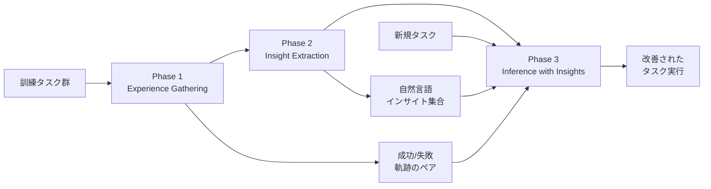
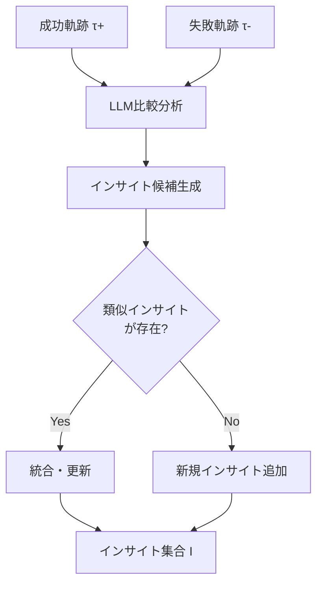
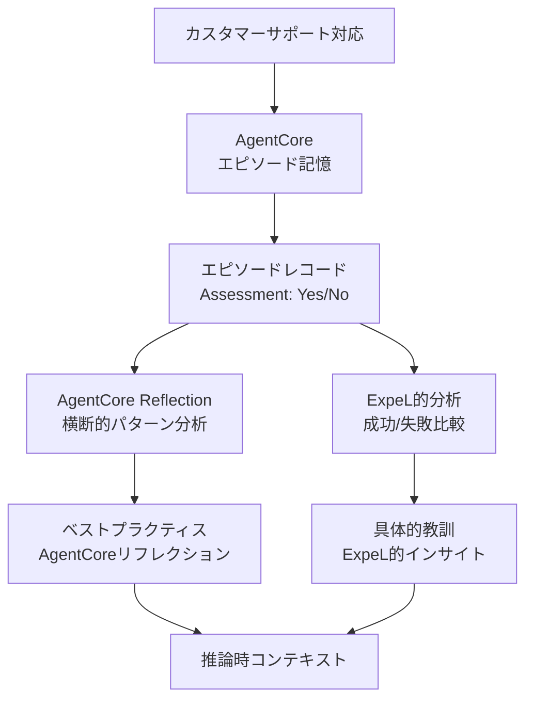

本記事は [arXiv:2308.10144 ExpeL: LLM Agents Are Experiential Learners](https://arxiv.org/abs/2308.10144) の解説記事です。

## 論文概要（Abstract）

Zhao, Huang, Xu, Lin, Liu, Huang（2023）は、LLMエージェントがパラメータの更新なしに、経験から自律的に知識を獲得し、将来のタスクに適用する手法「ExpeL（Experiential Learner）」を提案している。エージェントは訓練タスクから自律的に経験を蓄積し、成功・失敗パターンから自然言語で表現されたインサイト（洞察）を抽出する。推論時にはこれらのインサイトと過去の経験を参照して意思決定を行う。AAAI 2024に採択されている。

この論文は、Bedrock AgentCoreのエピソード記憶が実現する「経験からの学習」と「リフレクション生成」の設計思想と直接的に関連する研究であり、エピソードベースの知識獲得メカニズムの理論的根拠を理解する上で重要な1次情報である。

この記事は [Zenn記事: Bedrock AgentCoreエピソード記憶で顧客サポートの応答一貫性を向上させる](https://zenn.dev/0h_n0/articles/43fd3b0e65a835) の深掘りです。

## 情報源

- **arXiv ID**: 2308.10144
- **URL**: [https://arxiv.org/abs/2308.10144](https://arxiv.org/abs/2308.10144)
- **著者**: Andrew Zhao, Daniel Huang, Quentin Xu et al.
- **発表年**: 2023
- **分野**: cs.LG, cs.AI, cs.CL
- **採択**: AAAI 2024（38th Annual AAAI Conference on Artificial Intelligence）

## 背景と動機（Background & Motivation）

著者らは、LLMエージェントの学習における以下の課題を指摘している：

1. **パラメータ更新の制約**: GPT-4やClaudeといったAPI提供型のLLMは、ユーザーがモデルの重みを直接更新できない。従来のファインチューニングや強化学習ベースのアプローチは、これらのモデルには適用できない
2. **経験の消失**: 従来のLLMエージェント（ReAct等）は、各タスクを独立に実行し、過去のタスクから得た経験を保持しない。同じ種類のエラーを繰り返す傾向がある
3. **Reflexionの限界**: Reflexion（Shinn et al., 2023）は失敗からの学習を実現するが、学んだ知識は同一タスクの再試行にのみ適用され、異なるタスクへの転移が困難

著者らは、人間の経験学習プロセスにインスパイアされ、「経験の蓄積 → 知識の抽出 → 推論時の活用」という3段階のフレームワークを提案している。

## 主要な貢献（Key Contributions）

- **経験学習フレームワーク**: パラメータ更新なしに、訓練タスクからの経験蓄積と自然言語による知識抽出を実現する3段階アーキテクチャ
- **成功/失敗パターンの抽出**: 成功・失敗した軌跡を比較分析し、「何が成功に寄与したか」「何を避けるべきか」を自動抽出
- **転移学習の実現**: 抽出されたインサイトが未見のタスクにも適用可能であることを実証。ドメイン間の知識転移が自然言語レベルで実現される

## 技術的詳細（Technical Details）

### 全体アーキテクチャ

ExpeL は以下の3つのフェーズで構成される。



#### Phase 1: Experience Gathering（経験蓄積）

訓練タスク群に対してエージェントを実行し、成功・失敗の軌跡（trajectory）を蓄積する。

$$
\mathcal{E} = \{(t_i, \tau_i^+, \tau_i^-) \mid i = 1, \ldots, N\}
$$

ここで、
- $t_i$: $i$番目の訓練タスク
- $\tau_i^+$: タスク$t_i$の成功軌跡（アクション列と観察結果）
- $\tau_i^-$: タスク$t_i$の失敗軌跡
- $N$: 訓練タスク数

著者らによると、各タスクに対して複数回の試行を行い、Reflexion的な自己修正ループで成功軌跡を獲得する。成功・失敗の両方を記録することで、後続のInsight Extractionフェーズで「何が成功に寄与したか」の比較分析が可能になる。

#### Phase 2: Insight Extraction（インサイト抽出）

蓄積された成功・失敗軌跡のペアから、LLMを用いて再利用可能なインサイトを抽出する。



インサイト抽出のプロセスは以下の通り：

1. **比較分析**: 同一タスクの成功軌跡と失敗軌跡をLLMに入力し、「成功と失敗の違いは何か」「どのアクションが成功に寄与したか」を分析させる
2. **インサイト生成**: 分析結果から、将来のタスクに適用可能な一般的な教訓を自然言語で生成する
3. **インサイト統合**: 生成されたインサイトが既存のインサイト集合と類似している場合は統合し、新規の場合は追加する

インサイトの例（論文より）：
- 「Webページのナビゲーションでは、検索ボックスが見つからない場合、ページのスクロールよりもURL直接入力を試みる方が成功率が高い」
- 「在庫確認タスクでは、製品名の完全一致ではなく部分一致検索を使うことで、表記ゆれに対応できる」

#### Phase 3: Inference with Insights（インサイトを活用した推論）

新しいタスクの実行時に、蓄積されたインサイトと類似の過去経験を検索し、プロンプトに注入して意思決定を行う。

$$
\text{Action}_t = \text{LLM}(\text{task}, \text{context}, \underbrace{\text{top-k insights}}_{\text{Phase 2}}, \underbrace{\text{similar experiences}}_{\text{Phase 1}})
$$

ここで、
- $\text{top-k insights}$: 現在のタスクに最も関連するインサイト（ベクトル類似度で検索）
- $\text{similar experiences}$: 過去の類似タスクの成功軌跡

### AgentCoreのリフレクションとの対応

ExpeL のアーキテクチャとAgentCoreのエピソード記憶には、以下の概念的対応がある：

| ExpeL | AgentCore エピソード記憶 | 機能 |
|-------|------------------------|------|
| Experience Gathering | CreateEvent → Extraction | 経験の記録 |
| 成功/失敗軌跡 | エピソードレコード（Assessment: Yes/No） | 結果の評価 |
| Insight Extraction | Reflection Phase | 高次の洞察生成 |
| Inference with Insights | RetrieveMemory → コンテキスト注入 | 推論時の活用 |

重要な違いは、ExpeL が**成功と失敗の明示的な比較分析**によりインサイトを生成するのに対し、AgentCoreのリフレクションは**複数エピソードの横断的パターン分析**により洞察を生成する点である。ExpeL のアプローチは「なぜ成功したか/失敗したか」を直接的に抽出するため、インサイトの質が高い傾向があるが、成功・失敗のペアが必要という制約がある。

### アルゴリズム

```python
from dataclasses import dataclass


@dataclass
class Trajectory:
    """タスク実行の軌跡"""
    task: str
    actions: list[dict]  # [{action, observation, reward}, ...]
    success: bool
    final_result: str


@dataclass
class Insight:
    """抽出されたインサイト"""
    text: str
    source_tasks: list[str]
    confidence: float
    embedding: list[float]


def extract_insights(
    experiences: list[tuple[Trajectory, Trajectory]],
    existing_insights: list[Insight],
) -> list[Insight]:
    """Phase 2: 成功/失敗軌跡からインサイトを抽出（論文の手法に基づく擬似コード）

    Args:
        experiences: (成功軌跡, 失敗軌跡) のペアリスト
        existing_insights: 既存のインサイト集合

    Returns:
        更新されたインサイト集合
    """
    new_insights = []

    for success_traj, failure_traj in experiences:
        # LLMに成功・失敗の比較分析を実行させる
        prompt = f"""
        以下の2つのタスク実行軌跡を比較分析してください。

        【成功した軌跡】
        タスク: {success_traj.task}
        アクション列: {success_traj.actions}
        結果: {success_traj.final_result}

        【失敗した軌跡】
        タスク: {failure_traj.task}
        アクション列: {failure_traj.actions}
        結果: {failure_traj.final_result}

        質問:
        1. 成功と失敗の決定的な違いは何ですか？
        2. 将来の類似タスクに適用できる一般的な教訓は何ですか？
        3. 避けるべきパターンは何ですか？

        自然言語で簡潔にインサイトを生成してください。
        """

        insight_text = llm_generate(prompt)
        insight = Insight(
            text=insight_text,
            source_tasks=[success_traj.task],
            confidence=0.7,
            embedding=embed(insight_text),
        )

        # 既存インサイトとの重複チェック
        is_duplicate = False
        for existing in existing_insights:
            sim = cosine_similarity(insight.embedding, existing.embedding)
            if sim > 0.85:
                # 類似インサイトがある場合は統合
                existing.text = llm_merge_insights(existing.text, insight.text)
                existing.source_tasks.extend(insight.source_tasks)
                existing.confidence = min(1.0, existing.confidence + 0.1)
                is_duplicate = True
                break

        if not is_duplicate:
            new_insights.append(insight)

    existing_insights.extend(new_insights)
    return existing_insights


def inference_with_insights(
    task: str,
    insights: list[Insight],
    past_experiences: list[Trajectory],
    top_k_insights: int = 5,
    top_k_experiences: int = 3,
) -> str:
    """Phase 3: インサイトと経験を活用した推論（論文の手法に基づく擬似コード）

    Args:
        task: 新規タスク
        insights: インサイト集合
        past_experiences: 過去の経験（成功軌跡）
        top_k_insights: 参照するインサイト数
        top_k_experiences: 参照する経験数

    Returns:
        エージェントのアクション
    """
    task_embedding = embed(task)

    # 関連インサイトの検索
    relevant_insights = sorted(
        insights,
        key=lambda i: cosine_similarity(task_embedding, i.embedding),
        reverse=True,
    )[:top_k_insights]

    # 類似経験の検索
    relevant_experiences = sorted(
        past_experiences,
        key=lambda e: cosine_similarity(task_embedding, embed(e.task)),
        reverse=True,
    )[:top_k_experiences]

    # プロンプト構築
    prompt = f"""
    タスク: {task}

    【過去の教訓（インサイト）】
    {format_insights(relevant_insights)}

    【類似タスクの成功事例】
    {format_experiences(relevant_experiences)}

    上記の教訓と成功事例を参考に、最適なアクションを決定してください。
    """

    return llm_generate(prompt)
```

## 実装のポイント（Implementation）

- **成功・失敗ペアの収集**: Reflexionの自己修正ループを利用して成功軌跡を獲得する設計。初回の失敗 → フィードバック → 再試行 → 成功のサイクルが暗黙的にペアを生成する
- **インサイトの粒度管理**: 過度に具体的なインサイト（特定のタスクにのみ適用可能）と過度に抽象的なインサイト（実用性が低い）のバランスが重要。著者らはLLMプロンプトで「一般的だが具体的な教訓」を要求している
- **API制約への対応**: GPT-4等のAPI提供モデルに対応するため、パラメータ更新なしの学習を実現。インサイトと経験の蓄積はすべて外部ストレージで管理される
- **転移学習**: 異なるドメインのタスクでも、抽象度の高いインサイトは適用可能であることが論文で示されている

## 実験結果（Results）

### 性能向上の傾向

著者らは、複数のベンチマーク環境でExpeL の評価を実施している。論文によると、以下の傾向が報告されている：

- **経験蓄積に伴う持続的な改善**: 訓練タスク数の増加に伴い、エージェントの性能が持続的に向上する
- **転移学習の実証**: ある環境で獲得したインサイトが、異なる環境のタスクにも適用可能であることが確認されている
- **Reflexionとの比較**: Reflexionが同一タスクの再試行でのみ学習するのに対し、ExpeL は異なるタスクへの知識転移を実現している

### カスタマーサポートへの示唆

ExpeL の実験結果は、AgentCoreのエピソード記憶をカスタマーサポートに適用する際の以下の示唆を提供している：

1. **経験の蓄積による改善**: 対応事例が増えるほど、エージェントの応答品質が向上する（ExpeL の持続的改善の傾向と一致）
2. **成功/失敗の両方の記録**: AgentCoreのAssessment（Yes/No）は、ExpeL の成功/失敗軌跡に対応し、「何が成功に寄与したか」の分析を可能にする
3. **ドメイン間の転移**: 「配送トラブル」で学んだインサイトが「返品手続き」にも部分的に適用可能（共通の対応方針として）

## 実運用への応用（Practical Applications）

### AgentCoreとの統合パターン

ExpeL のインサイト抽出とAgentCoreのリフレクション生成を組み合わせることで、以下のような多層的な知識蓄積が実現可能である：



AgentCoreのリフレクションは「マクロレベルのパターン」（例: 「配送トラブルにはlookup_order + update_shipping_preferenceの組み合わせが効果的」）を提供し、ExpeL 的なインサイトは「ミクロレベルの教訓」（例: 「顧客が3回目の問い合わせの場合、優先配送を提案すると成功率が上がる」）を提供する。

### スケーラビリティの考慮事項

ExpeL の主な課題は、インサイト抽出時のLLMコール（成功/失敗ペアごとに1回）のコストである。AgentCoreのリフレクション生成がバックグラウンド処理で自動実行されるのに対し、ExpeL 的なアプローチを手動で実装する場合は、バッチ処理による定期的なインサイト更新が現実的である。

## 関連研究（Related Work）

- **Reflexion（Shinn et al., 2023）**: 失敗からの学習を自己修正ループで実現。ExpeL はReflexionの「同一タスク内学習」を「タスク間学習」に拡張したものと位置付けられる
- **Generative Agents（Park et al., 2023）**: メモリストリーム+リフレクションのアーキテクチャ。ExpeL のインサイト抽出はGenerative Agentsのリフレクション生成と類似するが、成功/失敗の明示的比較を行う点で異なる
- **Voyager（Wang et al., 2023）**: Minecraftでのスキル獲得エージェント。Voyagerのスキルライブラリへの蓄積はExpeL のインサイト蓄積と類似の機能を持つが、対象ドメインが異なる

## まとめと今後の展望

ExpeL は、LLMエージェントのパラメータ更新なしの経験学習を実現する実用的なフレームワークを提案している。成功/失敗軌跡の比較分析によるインサイト抽出は、Bedrock AgentCoreのリフレクション生成の設計思想と直接的に対応しており、エピソード記憶の理論的根拠を補強する研究である。

AAAI 2024に採択された本論文は、「API提供型LLM（GPT-4、Claude等）でもパラメータ更新なしに経験から学習できる」ことを実証しており、AgentCoreのような外部メモリサービスの有用性を裏付けるものである。カスタマーサポートにおいては、ExpeL のインサイト抽出とAgentCoreのリフレクション生成を組み合わせることで、マクロ/ミクロ両レベルの知識蓄積が実現可能と考えられる。

## 参考文献

- **arXiv**: [https://arxiv.org/abs/2308.10144](https://arxiv.org/abs/2308.10144)
- **Conference**: AAAI 2024（38th Annual AAAI Conference on Artificial Intelligence）
- **Related Zenn article**: [https://zenn.dev/0h_n0/articles/43fd3b0e65a835](https://zenn.dev/0h_n0/articles/43fd3b0e65a835)
