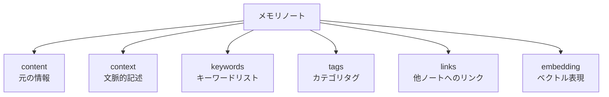
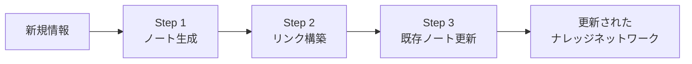

本記事は [arXiv:2502.12110 A-MEM: Agentic Memory for LLM Agents](https://arxiv.org/abs/2502.12110) の解説記事です。

## 論文概要（Abstract）

Xu, Liang, Mei, Gao, Tan, Zhang（2025）は、既存のLLMエージェントのメモリ管理が静的なストレージに依存しており、メモリ間の関係性や文脈の動的更新が不十分であるという課題に対し、Zettelkasten（ツェッテルカステン、カードノート法）にインスパイアされたエージェント型メモリシステム「A-MEM」を提案している。A-MEMは、各メモリを構造化されたノートとして管理し、ノート間の動的リンクと既存メモリの文脈的更新を自動化する。NeurIPS 2025のポスターとして採択され、6つの基盤モデルでの評価で既存のSOTAベースラインを上回る性能を報告している。

この記事は [Zenn記事: Bedrock AgentCoreエピソード記憶で顧客サポートの応答一貫性を向上させる](https://zenn.dev/0h_n0/articles/43fd3b0e65a835) の深掘りです。

## 情報源

- **arXiv ID**: 2502.12110
- **URL**: [https://arxiv.org/abs/2502.12110](https://arxiv.org/abs/2502.12110)
- **著者**: Wujiang Xu, Zujie Liang, Kai Mei et al.
- **発表年**: 2025
- **分野**: cs.CL, cs.HC
- **採択**: NeurIPS 2025 Poster

## 背景と動機（Background & Motivation）

著者らは、既存のLLMエージェントメモリシステムの主な課題を以下のように整理している：

1. **静的ストレージ**: MemoryBank、Reflexion等の既存手法は、メモリを独立した断片として格納する。新しいメモリが追加されても、既存のメモリの文脈や記述が更新されない
2. **関係性の欠如**: ベクトルDB上のflat storageでは、メモリ間の概念的な関連性（「配送業者変更の要望」と「過去の配送トラブル」の関連等）が捉えられない
3. **検索の限界**: ベクトル類似度検索のみでは、間接的に関連するメモリ（マルチホップの関係）を取得できない

著者らは、これらの課題を解決するために、人間のナレッジマネジメント手法であるZettelkasten方式の原則をLLMエージェントのメモリ管理に適用することを提案している。

## 主要な貢献（Key Contributions）

- **Zettelkasten方式のメモリ管理**: 各メモリを構造化されたノート（コンテキスト、キーワード、タグ、リンク）として管理し、ノート間の動的リンクにより相互接続されたナレッジネットワークを構築
- **動的メモリ進化**: 新しいメモリの追加時に、LLMが既存メモリの文脈的記述やリンクを自動更新。メモリベース全体が新しい情報に適応的に進化する
- **SOTAベースラインの超越**: LocMo、Conversation Chronicle、Multi-Session Chatの3ベンチマークで、GPT-4oおよびDeepSeek-V3を含む6モデルでの評価において既存手法を上回る性能を報告

## 技術的詳細（Technical Details）

### Zettelkasten方式とは

Zettelkasten（ドイツ語で「カードボックス」）は、社会学者Niklas Luhmannが発展させたナレッジマネジメント手法である。その核心は以下の原則にある：

1. **原子性**: 各ノートは1つの概念・アイデアを記述する
2. **相互接続性**: ノート間のリンクにより知識のネットワークを形成する
3. **文脈的記述**: 各ノートに文脈（なぜこの知識が重要か）を記載する
4. **索引化**: キーワードとタグによる多次元的なアクセス

A-MEMは、これらの原則をLLMエージェントのメモリ管理に適用している。

### メモリノートの構造

A-MEMのメモリノートは、以下の構造化された属性を持つ：



```python
from dataclasses import dataclass, field


@dataclass
class MemoryNote:
    """A-MEMのメモリノート構造（論文の手法に基づく）"""
    id: str
    content: str  # 元の情報（会話テキスト等）
    context: str  # LLMが生成した文脈的記述
    keywords: list[str]  # 自動抽出されたキーワード
    tags: list[str]  # カテゴリタグ
    links: list[str] = field(default_factory=list)  # 関連ノートIDのリスト
    embedding: list[float] = field(default_factory=list)  # ベクトル表現
    created_at: float = 0.0
    updated_at: float = 0.0
```

### メモリ追加パイプライン

新しい情報が入力された際のA-MEMのパイプラインは、以下の3ステップで構成される：



#### Step 1: ノート生成

新しい情報に対して、LLMが構造化されたメモリノートを生成する：

$$
\text{Note}_{\text{new}} = \text{LLM}(\text{content}, \text{prompt}_{\text{generate}})
$$

このステップで、`content`（元の情報）に対して`context`（文脈的記述）、`keywords`、`tags`がLLMにより自動生成される。

#### Step 2: リンク構築

生成されたノートと既存のメモリベースとの関連性を分析し、リンクを構築する：

$$
\text{Links}(\text{Note}_{\text{new}}) = \{n_j \in \mathcal{N} \mid \text{relevance}(\text{Note}_{\text{new}}, n_j) > \tau_{\text{link}}\}
$$

ここで、
- $\mathcal{N}$: 既存のメモリノート集合
- $\tau_{\text{link}}$: リンク構築の閾値
- $\text{relevance}(\cdot, \cdot)$: キーワード・タグの重複度とベクトル類似度の組み合わせ

著者らによると、リンク候補は以下の2つの方法で特定される：
1. **キーワード・タグマッチング**: 共通するキーワードやタグを持つノートを候補として取得
2. **ベクトル類似度検索**: 埋め込みベクトルのコサイン類似度による近傍検索

#### Step 3: 既存ノートの動的更新

新しいノートの追加により、関連する既存ノートの`context`（文脈的記述）が更新される：

$$
\text{context}(n_j) \leftarrow \text{LLM}(\text{context}(n_j), \text{Note}_{\text{new}}, \text{prompt}_{\text{update}})
$$

この「既存メモリの動的更新」がA-MEMの核心的な差別化ポイントである。従来のメモリシステム（Mem0、MemoryBank等）では新しいメモリの追加時に既存メモリの内容は変更されないが、A-MEMでは新しい情報の文脈で既存メモリの理解が更新される。

例えば、「田中さんが配送トラブルで問い合わせた」というメモリが存在する状態で、「田中さんが配送業者をFedExからSagawaに変更した」という新しいメモリが追加された場合、元の配送トラブルメモリの`context`が「この配送トラブルが、後のSagawa変更の背景となった」という文脈で更新される。

### 検索メカニズム

A-MEMの検索は、以下の2段階で実行される：

```python
def retrieve_memories(
    query: str,
    memory_notes: list[MemoryNote],
    top_k: int = 5,
    hop_depth: int = 2,
) -> list[MemoryNote]:
    """A-MEMのメモリ検索（論文の手法に基づく擬似コード）

    Args:
        query: 検索クエリ
        memory_notes: メモリノートのリスト
        top_k: 初期検索で取得するノート数
        hop_depth: リンクトラバーサルの深さ

    Returns:
        関連するメモリノートのリスト
    """
    # Stage 1: ベクトル類似度による初期検索
    query_embedding = embed(query)
    initial_results = vector_search(
        query_embedding, memory_notes, top_k=top_k
    )

    # Stage 2: リンクトラバーサルによる拡張検索
    expanded_results = set(initial_results)
    frontier = list(initial_results)

    for _ in range(hop_depth):
        next_frontier = []
        for note in frontier:
            for linked_id in note.links:
                linked_note = find_note_by_id(linked_id, memory_notes)
                if linked_note and linked_note not in expanded_results:
                    expanded_results.add(linked_note)
                    next_frontier.append(linked_note)
        frontier = next_frontier

    # スコアリング: 初期検索の類似度 + リンク距離による重み
    return rank_by_relevance(query, list(expanded_results))
```

このリンクトラバーサルにより、ベクトル類似度だけでは見つからない「間接的に関連するメモリ」を取得できる。例えば、「配送に関する問い合わせ」というクエリに対して、直接的には「配送状況の確認エピソード」が取得され、リンクを辿ることで「配送業者変更の背景」「過去の配送トラブル履歴」といった間接的な情報も取得できる。

## 実装のポイント（Implementation）

論文および公開リポジトリから読み取れる実装上の注意点：

- **LLMコール数**: メモリ追加ごとにLLMコールが3回発生（ノート生成 + リンク構築 + 既存ノート更新）。Mem0の2回と比較して多く、高頻度の追加ではコストが増大する
- **ベクトルDB**: ChromaDBが使用されている（差し替え可能）
- **リンク管理**: ノート間のリンクはJSON形式で管理。大規模なノード数でのスケーラビリティは論文で未検証
- **バッチ更新**: リアルタイム更新のみ対応。バッチ処理は未実装であるため、高頻度の会話では処理遅延に注意

## 実験結果（Results）

### ベンチマーク性能

著者らは、以下の3つのベンチマークで評価を実施している：

| ベンチマーク | 評価内容 | A-MEMの結果 |
|-------------|---------|------------|
| LocMo | 長期会話理解 | 著者らによると既存SOTAを上回る |
| Conversation Chronicle | マルチセッション会話 | 著者らによると既存SOTAを上回る |
| Multi-Session Chat | 複数セッション間の一貫性 | 著者らによると既存SOTAを上回る |

論文によると、BLEU、ROUGE、METEORの複数指標において、Basic RAG、MemoryBank、Reflexion等のベースラインを上回る性能が報告されている。GPT-4oおよびDeepSeek-V3を含む6つの基盤モデルで検証されている。

### Mem0との比較

論文では、Mem0がベースラインの1つとして比較されている。著者らの分析によると、A-MEMがMem0を上回る主な要因は：

1. **動的メモリ更新**: 新しい情報で既存メモリの文脈が更新されるため、時間の経過とともにメモリの質が向上する
2. **リンクトラバーサル**: ベクトル類似度だけでは見つからない間接的な関連情報を取得できる
3. **構造化された文脈**: キーワード・タグによる多次元的なインデックスにより、検索精度が向上する

## 実運用への応用（Practical Applications）

### AgentCoreエピソード記憶との比較

A-MEMとAgentCoreのエピソード記憶は、異なるアプローチでメモリの関連性管理を実現している：

| 観点 | A-MEM | AgentCore エピソード記憶 |
|------|-------|------------------------|
| メモリ粒度 | ノート単位（1概念1ノート） | エピソード単位（会話のまとまり） |
| 関連性管理 | ノート間の動的リンク | ネームスペース階層 |
| 既存メモリ更新 | LLMによる文脈更新 | なし（immutable） |
| 横断的洞察 | リンクトラバーサルで間接取得 | Reflectionフェーズで自動生成 |
| LLMコール/追加 | 3回 | エピソード完了時に1回 |
| インフラ | セルフホスティング | AWSフルマネージド |

A-MEMの「既存メモリの動的更新」は、エピソード記憶のリフレクション機構とは異なるアプローチで一貫性を実現している。リフレクションが「複数エピソードから高次の洞察を生成する」のに対し、A-MEMは「新しい情報で既存メモリの理解を更新する」。前者はマクロレベルの知見蓄積に、後者はミクロレベルの情報整合性に優れている。

### カスタマーサポートでの活用

A-MEMのリンクトラバーサルは、カスタマーサポートで以下のような活用が考えられる：

1. **顧客→注文→配送→トラブル**のリンクチェーンにより、「この顧客の注文に関連する全情報」をマルチホップで取得
2. 新しい問い合わせが追加されるたびに、過去の関連メモリの文脈が更新され、全体像が自動的に最新化される
3. キーワード・タグによる多次元検索で、「配送」「返品」「請求」等のカテゴリ横断的な検索が可能

## 関連研究（Related Work）

- **Generative Agents（Park et al., 2023）**: メモリストリーム+リフレクションの三層アーキテクチャ。A-MEMはリフレクション生成の代わりに、メモリ間の動的リンクと既存メモリの更新で知識の統合を実現
- **Mem0（Chhikara et al., 2025）**: ファクトレベルのメモリ統合とグラフメモリ拡張。A-MEMはZettelkasten方式の構造化ノートにより、よりきめ細かいメモリ管理を実現
- **HippoRAG（Gutiérrez et al., 2024）**: 海馬インデックス理論に基づく長期記憶。A-MEMのリンクトラバーサルとHippoRAGの知識グラフ検索は類似のアプローチだが、A-MEMは既存メモリの動的更新機能を持つ点で異なる

## まとめと今後の展望

A-MEMは、Zettelkasten方式の原則をLLMエージェントのメモリ管理に適用し、構造化ノート・動的リンク・既存メモリの文脈更新という3つの革新を実現している。NeurIPS 2025のポスターとして採択され、3ベンチマークでのSOTA性能が報告されている。

Bedrock AgentCoreのエピソード記憶との比較では、A-MEMの「既存メモリの動的更新」はリフレクション機構とは異なるアプローチで情報の一貫性を実現している。ただし、メモリ追加ごとに3回のLLMコールが発生するコスト面と、大規模ノード数でのリンク管理のスケーラビリティは、本番環境への適用時に考慮すべき点である。

## 参考文献

- **arXiv**: [https://arxiv.org/abs/2502.12110](https://arxiv.org/abs/2502.12110)
- **Code**: GitHub (A-mem repository)
- **Conference**: NeurIPS 2025 Poster
- **Related Zenn article**: [https://zenn.dev/0h_n0/articles/43fd3b0e65a835](https://zenn.dev/0h_n0/articles/43fd3b0e65a835)
