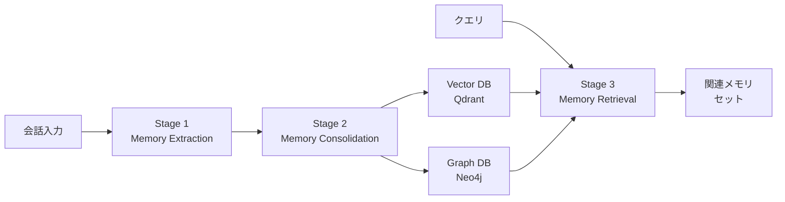
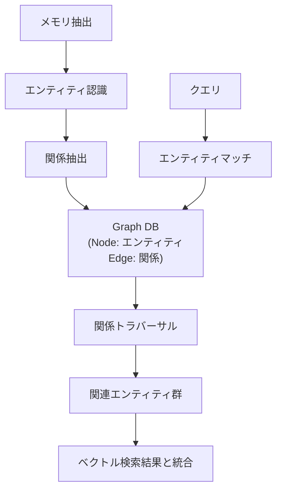

本記事は [arXiv:2504.19413 Mem0: Building Production-Ready AI Agents with Scalable Long-Term Memory](https://arxiv.org/abs/2504.19413) の解説記事です。

## 論文概要（Abstract）

Chhikara, Khant, Aryan, Singh, Yadav（2025）は、LLMがコンテキストウィンドウの制約によりマルチセッション会話で一貫性を維持できない問題に対し、動的にメモリを抽出・統合・検索するアーキテクチャ「Mem0」を提案している。LOCOMOベンチマーク（長期会話評価）において、OpenAIのメモリ機能と比較してLLM-as-a-Judge指標で26%の相対改善を報告している。さらに、グラフベースのメモリ表現を用いた拡張版により、会話要素間の関係構造を捉える能力が向上することが示されている。

この記事は [Zenn記事: Bedrock AgentCoreエピソード記憶で顧客サポートの応答一貫性を向上させる](https://zenn.dev/0h_n0/articles/43fd3b0e65a835) の深掘りです。

## 情報源

- **arXiv ID**: 2504.19413
- **URL**: [https://arxiv.org/abs/2504.19413](https://arxiv.org/abs/2504.19413)
- **著者**: Prateek Chhikara, Dev Khant, Saket Aryan, Taranjeet Singh, Deshraj Yadav
- **発表年**: 2025
- **分野**: cs.CL（Computation and Language）

## 背景と動機（Background & Motivation）

LLMベースのAIエージェントは、固定長のコンテキストウィンドウにより、セッションを跨いだ長期的な記憶の維持が困難である。著者らは、この問題に対する既存のアプローチを以下のように分類している：

1. **Full-context方式**: 過去の全会話をコンテキストに含める → コンテキスト長が増大し、レイテンシ・コストが悪化
2. **RAG方式**: ベクトル類似度検索で関連情報を取得 → 単一セッション内の検索に強いが、セッション間の関係を捉えにくい
3. **既存メモリシステム**: MemoryBank、Reflexion等 → 特定のタスクに特化しており、本番環境でのスケーラビリティに課題

著者らは、これらの課題を解決するために、動的なメモリ抽出・統合・検索を行い、かつ本番環境で即座にデプロイ可能なメモリアーキテクチャが必要だと主張している。

## 主要な貢献（Key Contributions）

- **動的メモリパイプライン**: 会話からの情報抽出 → 既存メモリとの矛盾解消・重複除去 → ベクトル類似度検索による関連メモリ取得の3段階パイプライン
- **グラフメモリ拡張**: Neo4j等のグラフDBを用いて、メモリ間の関係構造（エンティティ間の接続）を表現する拡張アーキテクチャ
- **LOCOMOベンチマーク**: 長期会話の4タイプ（single-hop, temporal, multi-hop, open-domain）の質問に対して、6カテゴリのベースラインを上回る性能を実証

## 技術的詳細（Technical Details）

### メモリパイプラインのアーキテクチャ

Mem0のコアアーキテクチャは、以下の3つのステージで構成される。



#### Stage 1: Memory Extraction（メモリ抽出）

会話の各ターンをLLMに入力し、保存すべきメモリ候補を自動抽出する。著者らの論文によると、抽出対象は以下の情報である：

- **ユーザー嗜好**: 「配送はFedEx希望」等の明示的な好み
- **事実情報**: ユーザーに関するファクト（名前、所属等）
- **コンテキスト情報**: 会話の文脈から推測される暗黙的な情報

抽出はLLMのシングルコールで実行され、構造化されたJSON形式でメモリ候補が出力される。

#### Stage 2: Memory Consolidation（メモリ統合）

新しく抽出されたメモリ候補を既存のメモリベースと照合し、以下の操作を実行する：

$$
\text{Consolidation}(m_{\text{new}}, M_{\text{existing}}) =
\begin{cases}
\text{ADD}(m_{\text{new}}) & \text{if } \nexists m_j \in M_{\text{existing}}: \text{sim}(m_{\text{new}}, m_j) > \tau \\
\text{UPDATE}(m_j, m_{\text{new}}) & \text{if } \text{sim}(m_{\text{new}}, m_j) > \tau \text{ and } m_{\text{new}} \neq m_j \\
\text{DELETE}(m_j) & \text{if } m_{\text{new}} \text{ contradicts } m_j \\
\text{NOOP} & \text{if } m_{\text{new}} = m_j
\end{cases}
$$

ここで、
- $m_{\text{new}}$: 新しく抽出されたメモリ候補
- $M_{\text{existing}}$: 既存のメモリベース
- $\text{sim}(\cdot, \cdot)$: ベクトル類似度（コサイン類似度）
- $\tau$: 類似度閾値

著者らによると、このConsolidationステップにより、矛盾するメモリの自動解消と重複の除去が実現される。これはBedrock AgentCoreのConsolidation（エピソード統合）と類似の設計思想であるが、Mem0はファクトレベルでの統合を行うのに対し、AgentCoreはエピソード（会話のまとまり）レベルでの統合を行う点で異なる。

#### Stage 3: Memory Retrieval（メモリ検索）

新しいクエリに対して、以下の2段階検索を実行する：

1. **ベクトル類似度検索**: Qdrant等のベクトルDBでクエリとメモリのコサイン類似度を計算し、上位k件を取得
2. **グラフ関係検索**（拡張版のみ）: Neo4j等のグラフDBでエンティティ間の関係を辿り、ベクトル検索では見つからない間接的に関連するメモリを取得

### グラフメモリ拡張

論文によると、グラフメモリ拡張は以下のように機能する：



グラフメモリのノードはエンティティ（人物、組織、製品等）を表し、エッジはそれらの関係を表現する。例えば、「田中さんはFedExを希望している」という情報は、`田中 --[配送業者希望]--> FedEx`というグラフ構造で保存される。

著者らの報告によると、このグラフ拡張により、LOCOMOベンチマークのmulti-hop質問（複数の情報を組み合わせて回答する質問）で、ベースのMem0と比較して約2%の精度向上が観測されている。

### アルゴリズム

```python
from dataclasses import dataclass


@dataclass
class Memory:
    """メモリレコードの基本構造"""
    id: str
    content: str
    embedding: list[float]
    metadata: dict
    user_id: str


def mem0_pipeline(
    conversation: list[dict],
    existing_memories: list[Memory],
    user_id: str,
    similarity_threshold: float = 0.8,
) -> list[Memory]:
    """Mem0のメモリパイプライン（論文の手法を簡略化した擬似コード）

    Args:
        conversation: 会話履歴
        existing_memories: 既存メモリベース
        user_id: ユーザー識別子
        similarity_threshold: 統合判定の類似度閾値

    Returns:
        更新後のメモリリスト
    """
    # Stage 1: Extraction（LLMで自動抽出）
    new_candidates = llm_extract_memories(conversation)

    # Stage 2: Consolidation（矛盾解消・重複除去）
    for candidate in new_candidates:
        candidate_embedding = embed(candidate.content)
        best_match, best_sim = find_most_similar(
            candidate_embedding, existing_memories
        )

        if best_sim < similarity_threshold:
            # 新規メモリとして追加
            existing_memories.append(candidate)
        elif is_contradictory(candidate, best_match):
            # 矛盾する場合は古い方を削除し、新しい方を追加
            existing_memories.remove(best_match)
            existing_memories.append(candidate)
        elif candidate.content != best_match.content:
            # 類似だが異なる場合は更新
            best_match.content = merge_contents(
                best_match.content, candidate.content
            )

    return existing_memories
```

## 実装のポイント（Implementation）

論文およびOSSリポジトリから読み取れる実装上の注意点：

- **ベクトルDB**: デフォルトでQdrantを使用。Chromadb、Pinecone等への差し替えも可能
- **グラフDB**: Neo4jが推奨。グラフ機能はオプショナルで、使用しなくても動作する
- **LLMコール数**: メモリ追加時にLLMコールが1回（抽出）+ 1回（統合判定）発生。高頻度の会話ではAPIコストに注意
- **ユーザー分離**: `user_id`ベースでメモリを分離。マルチテナント対応が標準

**OSSとプラットフォームの違い**: 論文の著者らはOSS版（[github.com/mem0ai/mem0](https://github.com/mem0ai/mem0)、MITライセンス）とMem0 Platformの両方を提供している。OSS版はセルフホスティングが必要だが、完全な制御が可能。

## 実験結果（Results）

### LOCOMOベンチマーク

著者らは、LOCOMOベンチマーク（長期会話理解の評価データセット）で性能を検証している。LOCOMOは以下の4タイプの質問で構成される：

| 質問タイプ | 説明 | Mem0改善率 |
|-----------|------|-----------|
| Single-hop | 1つの情報で回答可能 | 著者らによると改善を報告 |
| Temporal | 時系列情報が必要 | 著者らによると改善を報告 |
| Multi-hop | 複数情報の組み合わせが必要 | グラフ拡張で+2%（論文の報告値） |
| Open-domain | 自由形式の質問 | 著者らによると改善を報告 |

論文のTable 2より、6カテゴリのベースライン（既存メモリシステム、RAG、フルコンテキスト、OSS、プロプライエタリ、専用プラットフォーム）を横断して、LLM-as-a-Judge指標でOpenAI比+26%の相対改善を達成したと報告されている。

### レイテンシとコスト

論文によると、以下の性能特性が報告されている：

- **p95レイテンシ**: フルコンテキスト方式と比較して91%削減
- **トークンコスト**: 90%以上の削減
- **レイテンシ中央値**: 0.1〜0.3秒（p95: 0.5秒）

これらの数値は、不要な過去会話をコンテキストに含めないことによる改善である。

## 実運用への応用（Practical Applications）

### Bedrock AgentCoreとの比較

Mem0とBedrock AgentCore Memoryは類似の問題を解決するが、アプローチが異なる：

| 観点 | Mem0 | AgentCore エピソード記憶 |
|------|------|------------------------|
| メモリ粒度 | ファクト単位（個別の情報断片） | エピソード単位（会話のまとまり） |
| 統合方式 | LLMベースの矛盾解消・重複除去 | エピソード完了検出→構造化 |
| リフレクション | なし（ファクト保存のみ） | 横断的リフレクション自動生成 |
| インフラ | セルフホスティング / Mem0 Platform | AWSフルマネージド |
| グラフ | Neo4j統合（オプション） | なし |
| ライセンス | MIT（OSS） | AWSサービス（従量課金） |

カスタマーサポートのユースケースでは、Mem0はユーザーの個別情報（好み、過去の注文等）の蓄積に優れ、AgentCoreのエピソード記憶は対応パターンの学習（リフレクション生成）に優れる。両者を組み合わせることで、「個別の顧客情報に基づくパーソナライズ」と「対応パターンの一貫性」の両方を実現できる可能性がある。

### スケーラビリティ

論文によると、Mem0のメモリ検索はベクトルDB（Qdrant）とグラフDB（Neo4j）に依存しており、それぞれのスケーリング特性に従う。ベクトルDBはHNSWインデックスにより、数百万レコードでもmsオーダーの検索が可能である。ただし、メモリ追加時のLLMコール（抽出+統合判定で2回）がボトルネックとなる可能性があり、高頻度の会話ではバッチ処理やキューイングの検討が必要となる。

## Production Deployment Guide

### AWS実装パターン（コスト最適化重視）

Mem0のセルフホスティング版をAWS上にデプロイする場合の構成：

| 規模 | 月間リクエスト | 推奨構成 | 月額コスト目安 | 主要サービス |
|------|--------------|---------|--------------|------------|
| **Small** | ~3,000 (100/日) | Serverless | $100-250 | Lambda + Qdrant Cloud + Bedrock |
| **Medium** | ~30,000 (1,000/日) | Hybrid | $500-1,200 | ECS Fargate + Qdrant + Bedrock |
| **Large** | 300,000+ (10,000/日) | Container | $3,000-7,000 | EKS + Qdrant Cluster + Neo4j + Bedrock |

**コスト試算の注意事項**: 上記は2026年3月時点のAWS ap-northeast-1料金に基づく概算値です。Mem0のLLMコール（メモリ追加ごとに2回）がコストの主要因となるため、Bedrock Batch APIやPrompt Cachingの活用が重要です。最新料金は [AWS料金計算ツール](https://calculator.aws/) で確認してください。

### Terraformインフラコード

**Small構成 (Serverless)**:

```hcl
resource "aws_iam_role" "lambda_mem0" {
  name = "lambda-mem0-role"

  assume_role_policy = jsonencode({
    Version = "2012-10-17"
    Statement = [{
      Action = "sts:AssumeRole"
      Effect = "Allow"
      Principal = { Service = "lambda.amazonaws.com" }
    }]
  })
}

resource "aws_iam_role_policy" "mem0_bedrock" {
  role = aws_iam_role.lambda_mem0.id

  policy = jsonencode({
    Version = "2012-10-17"
    Statement = [{
      Effect   = "Allow"
      Action   = ["bedrock:InvokeModel"]
      Resource = "arn:aws:bedrock:ap-northeast-1::foundation-model/anthropic.claude-*"
    }]
  })
}

resource "aws_lambda_function" "mem0_handler" {
  filename      = "lambda.zip"
  function_name = "mem0-agent"
  role          = aws_iam_role.lambda_mem0.arn
  handler       = "index.handler"
  runtime       = "python3.12"
  timeout       = 120
  memory_size   = 1024

  environment {
    variables = {
      QDRANT_URL       = var.qdrant_url
      QDRANT_API_KEY   = var.qdrant_api_key
      BEDROCK_MODEL_ID = "anthropic.claude-haiku-4-5-20251001"
    }
  }
}

resource "aws_cloudwatch_metric_alarm" "mem0_cost" {
  alarm_name          = "mem0-invocation-spike"
  comparison_operator = "GreaterThanThreshold"
  evaluation_periods  = 1
  metric_name         = "Invocations"
  namespace           = "AWS/Lambda"
  period              = 3600
  statistic           = "Sum"
  threshold           = 500
  alarm_description   = "Mem0 Lambda呼び出し数異常（LLMコスト急増の可能性）"

  dimensions = {
    FunctionName = aws_lambda_function.mem0_handler.function_name
  }
}
```

### 運用・監視設定

```python
import boto3

cloudwatch = boto3.client('cloudwatch')

# Mem0メモリ追加レイテンシ監視
cloudwatch.put_metric_alarm(
    AlarmName='mem0-consolidation-latency',
    ComparisonOperator='GreaterThanThreshold',
    EvaluationPeriods=2,
    MetricName='ConsolidationLatency',
    Namespace='Custom/Mem0',
    Period=300,
    Statistic='Average',
    Threshold=10000,  # 10秒超過
    AlarmDescription='Mem0 Consolidationレイテンシ異常'
)
```

### コスト最適化チェックリスト

- [ ] LLMコール最適化: メモリ抽出にHaiku 4.5を使用（$0.25/MTok）
- [ ] Qdrant: Qdrant Cloudの無料枠（1GBまで）を活用
- [ ] バッチ処理: 非リアルタイムのメモリ統合はBatch APIで50%削減
- [ ] Prompt Caching: 抽出プロンプトのシステム部分をキャッシュ
- [ ] メモリ上限: ユーザーあたりのメモリ数上限を設定（1000件推奨）
- [ ] TTL: 古いメモリの自動削除（180日推奨）

## 関連研究（Related Work）

- **MemoryBank（Zhong et al., 2023）**: エビングハウスの忘却曲線を導入した長期記憶メカニズム。Mem0はより実用的なConsolidation（矛盾解消・重複除去）に焦点を当てている
- **Generative Agents（Park et al., 2023）**: エピソード記憶+リフレクション+計画の三層アーキテクチャ。Mem0はリフレクション機構を持たないが、グラフメモリにより関係構造を表現
- **A-MEM（Xu et al., 2025）**: Zettelkasten方式のメモリリンク管理。Mem0のグラフメモリと類似のアプローチだが、A-MEMはメモリ間のリンクを動的に更新する点で異なる

## まとめと今後の展望

Mem0は、LLMエージェントの長期記憶管理における実用的なアーキテクチャを提案している。メモリの動的抽出・統合・検索の3段階パイプラインは、Bedrock AgentCoreのExtraction→Consolidation→Reflectionパイプラインと設計思想を共有しつつ、ファクトレベルでの粒度管理とグラフベースの関係表現という独自のアプローチを取っている。

LOCOMOベンチマークでの+26%改善（著者らの報告値）とp95レイテンシ91%削減は、本番環境での長期記憶管理の実現可能性を示すものである。ただし、メモリ追加ごとのLLMコール（2回）によるコスト増と、グラフDBのインフラ管理コストは、デプロイ時に考慮すべき点である。

## 参考文献

- **arXiv**: [https://arxiv.org/abs/2504.19413](https://arxiv.org/abs/2504.19413)
- **Code**: [https://github.com/mem0ai/mem0](https://github.com/mem0ai/mem0) (MIT License)
- **Related Zenn article**: [https://zenn.dev/0h_n0/articles/43fd3b0e65a835](https://zenn.dev/0h_n0/articles/43fd3b0e65a835)
