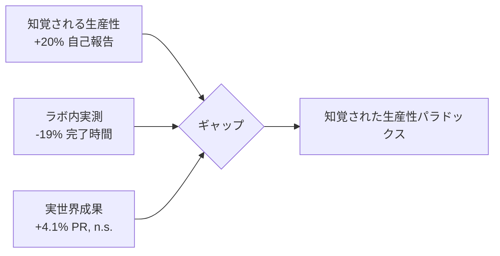

本記事は [arXiv:2507.09089](https://arxiv.org/abs/2507.09089) の解説記事です。

## 論文概要（Abstract）

AIコーディングツールの生産性向上効果は、多くの場合、人工的なタスクや初心者プログラマーを対象とした研究で報告されてきた。本論文は、実際のオープンソースプロジェクトに貢献する経験豊富な開発者246名を対象とした無作為化比較試験（RCT）を実施し、6週間にわたって生産性への影響を測定した。結果として、AIツールはラボセッションでのタスク完了時間を19%短縮したものの、実世界のPull Requestマージ数（+4.1%、p=0.16）や Issue解決率（+3.3%、p=0.24）の増加は統計的に有意ではなかった。さらに、開発者はAIツールにより+20%生産性が向上したと自己報告しているが、実測値との間に大きなギャップが存在することが明らかになった。

この記事は [Zenn記事: Claude CodeとCursor IDEの併用で自動コーディング精度を高める実践手法](https://zenn.dev/0h_n0/articles/d10139cd09e957) の深掘りです。

## 情報源

- **arXiv ID**: 2507.09089
- **URL**: [https://arxiv.org/abs/2507.09089](https://arxiv.org/abs/2507.09089)
- **著者**: Filippo Graziano et al.
- **発表年**: 2025
- **分野**: cs.SE, cs.AI

## 背景と動機（Background & Motivation）

GitHub Copilot、Claude、GPT-4ベースのコーディングツールの急速な普及に伴い、AIコーディングアシスタントの生産性向上効果についての主張が広く流布している。しかし著者らは、既存の研究には以下の問題があると指摘している：

- 多くの研究がLeetCodeスタイルの人工的なタスクを使用している
- 学生や初心者プログラマーの母集団が過大に代表されている
- 実世界の生産性向上は十分に定量化されていない

著者らの貢献は、事前登録済みのRCTにより、経験豊富な開発者が実際のオープンソースタスクに取り組む状況での生産性影響を測定したことにある。

## 主要な貢献（Key Contributions）

- **貢献1**: 246名の経験豊富なOSS開発者を対象とした初のRCT（無作為化比較試験）の実施
- **貢献2**: ラボ内でのタスク速度向上（-19%完了時間）と実世界のプロジェクト成果（+4.1%マージPR、有意差なし）のギャップを定量化
- **貢献3**: 自己報告生産性（+20%）と実測生産性（+4.1%）の乖離——「知覚される生産性ギャップ」を初めて体系的に文書化

## 技術的詳細（Technical Details）

### 実験設計

**参加者**: 246名のOSS開発者（34ヶ国）

著者らが設定した包含基準：
- 過去6ヶ月間に3件以上のマージ済みPR
- 3年以上のプロフェッショナル開発経験
- 主要言語: Python, JavaScript/TypeScript, Go, Rust
- 除外条件: 既にAIコーディングツールを週5時間以上使用している開発者

**地理分布**: 北米38%、欧州41%、アジア18%、その他3%

**研究デザイン**: 並行群RCT、OSF事前登録済み、6週間＋1週間のオンボーディング

**層別化**: 主要言語、経験年数（3-7年 vs 8年以上）、プロジェクトドメインで層別無作為化

### 治療群と対照群

**治療群 (n=123)** に提供されたツール：
- GitHub Copilot（Chat + インライン補完、GPT-4oバックエンド）
- Cursor IDE（Claude 3.5 Sonnetバックエンド）
- Claude.ai（計画・デバッグ用）
- 参加者はどのツールを使うか自由に選択可能

**対照群 (n=123)**: 標準的な開発環境、AI支援なし。個人的なAIツール使用を回避するよう要請（コンプライアンスは宣誓＋抜き打ちチェックで監視）。

### 評価指標

**主要評価指標**（事前指定）：
1. マージ済みPull Request数（6週間合計）
2. Issue解決率（解決Issue / 割り当て・自己選択Issue）

**副次的評価指標**：
3. ラボセッションでのタスク完了時間（2週間ごとの標準化タスク）
4. コミットされた正味コード行数
5. コードレビューのターンアラウンドタイム
6. 自己報告生産性（週次サーベイ、1-10リッカート尺度）

### 統計分析

- Intention-to-treat（ITT）分析、層別化変数で調整した線形回帰
- 有意水準: p < 0.05（両側検定）
- 検出力: 15%の効果量を検出する80%の検出力で設計

## 実験結果（Results）

### 主要評価指標: 実世界の6週間成果

著者らが報告している結果：

| 指標 | 対照群 (n=123) | 治療群 (n=123) | 差分 | p値 |
|------|---------------|---------------|------|-----|
| マージ済みPR（平均） | 12.3 | 12.8 | +4.1% | 0.16 |
| Issue解決率 | 0.61 | 0.63 | +3.3% | 0.24 |

**いずれの主要評価指標も統計的有意に達していない。**

### 副次的評価指標: ラボセッション

| 指標 | 対照群 | 治療群 | 差分 | p値 |
|------|-------|-------|------|-----|
| タスク完了時間（分） | 73.4 | 59.5 | **-19.0%** | **<0.001** |
| タスク完了率 | 81% | 86% | +6.2% | 0.09 |
| 正味コミット行数 | 148 | 163 | +10.1% | 0.04 |

**ラボセッションでのタスク完了時間の19%短縮は統計的に有意（p<0.001）。**

### サブグループ分析

**経験年数別**（著者らの報告より）：

| サブグループ | マージPR差分 | p値 |
|------------|-----------|-----|
| 3-7年の経験 | +8.3% | 0.08 |
| 8年以上の経験 | +1.2% | 0.78 |

経験豊富な開発者（8年以上）ではAIツールからの恩恵がほぼ見られない。経験が浅い開発者（3-7年）では正の傾向があるものの有意水準には達していない。

**主要言語別**（著者らの報告より）：

| 言語 | PR差分 | p値 |
|------|-------|-----|
| Python | +6.1% | 0.14 |
| JavaScript/TypeScript | +5.8% | 0.19 |
| Go | -1.4% | 0.87 |
| Rust | +0.9% | 0.93 |

GoとRustの開発者ではAIツールの効果がほぼゼロまたは負の傾向を示している。著者らはこれを、強い型システムと既存のツールエコシステムが開発者のフローを既に十分サポートしているためと推測している。

### 知覚される生産性ギャップ

本論文の中心的な発見の一つ：

- **治療群の自己報告生産性向上**: **+20%**（退出調査の平均値）
- **実際のマージPR増加**: **+4.1%**（統計的に有意でない）
- **ラボタスク時間短縮**: **-19.0%**（統計的に有意）

著者らは、AIツールがタスクレベル（個別のコーディングセッション）では速度向上の感覚を生み出すが、これがプロジェクトレベルの成果に比例して反映されないと分析している。

## 実装のポイント（Implementation）

### なぜラボと実世界で結果が異なるのか

著者らは以下の仮説を提示している：

**1. タスク分布の違い**: 実際のOSS開発では、コーディング以外にコミュニケーション、計画、コードレビューなどの活動が大きな割合を占める。AIツールはこれらの活動に対する支援が限定的である。

**2. ボトルネックのシフト**: AIがコーディングを加速しても、レビュー、ディスカッション、マージのレイテンシは変わらない。結果として、全体のスループットはコーディング以外のボトルネックに制約される。

**3. 探索コスト**: 開発者がAIツールの機能を探索する時間が、実質的な生産性向上を相殺している。

**4. スキルキャリブレーション期間**: 6週間はAI支援ワークフローを完全に内在化するには短い可能性がある。

### 組織的な意思決定への示唆

著者らが指摘する重要なポイント：開発者が「20%速くなった」と感じているが実際には4%の改善（しかも有意でない）である場合、開発者の満足度調査に基づいてAIツールのROIを推定する組織は、投資対効果を過大評価するリスクがある。

### 先行研究との比較

| 研究 | 対象 | タスク | 速度改善 |
|------|------|-------|---------|
| Peng et al. (2023) | 学生 | 孤立タスク | 55%速度向上 |
| 本論文 ラボ | 経験者 | 標準化タスク | 19%速度向上 |
| 本論文 実世界 | 経験者 | 実OSS作業 | 4.1%（n.s.） |

この比較から、タスクの人工性が高いほど、また対象者の経験が浅いほど、AIツールの効果が大きく見える傾向が示唆される。

## 実運用への応用（Practical Applications）

### Claude Code / Cursor IDEの導入判断

本論文の知見は、Zenn記事で紹介されている両ツールの導入判断に以下の示唆を与える：

1. **「生産性X倍」の主張に懐疑的になる**: 論文のデータは、AIツールが個別タスクの速度を改善しても、プロジェクト全体の生産性向上に直結しないことを示唆している
2. **ラボ内の速度向上は信頼できる**: 19%のタスク完了時間短縮は有意であり、単純作業（ボイラープレート生成、テストスタブ作成等）では明確な効果がある
3. **言語・ドメインによる差に注意**: Python/JavaScriptでは効果が見られる傾向があるが、Go/Rustでは効果がほぼない
4. **経験豊富な開発者ほど効果が小さい**: 8年以上の経験者では+1.2%（p=0.78）

### AIツールが有効な作業カテゴリ

著者らの定性的調査（治療群のオープンエンドアンケート）から：

**効果が高い作業**:
- ボイラープレート生成
- ドキュメンテーション
- テストスタブの生成

**効果が低い作業**:
- アーキテクチャ設計の判断
- 複雑なレガシーコードの理解
- 微妙な並行処理のデバッグ

**共通の課題**:
- AIの提案にはレビュー時間が必要であり、速度向上を部分的に相殺する
- 「信頼のキャリブレーション（trust calibration）」——AIの提案をいつ受け入れ、いつ拒否するかを学ぶ——が後天的スキルとして認識されている

## 関連研究（Related Work）

- **Peng et al. (2023)**: GitHub Copilotを学生対象で評価し、孤立タスクで55%の速度向上を報告。本論文の19%/4.1%との差は、対象者の経験とタスクの人工性の違いで説明される。
- **Kalliamvakou (2022)**: 単一セッション研究でCopilotのタスク完了時間短縮を報告。ラボ設定での結果は本論文と整合するが、実世界への外挿は未検証だった。
- **METR (2025) 別研究**: AI Safety組織METRによる16名の開発者を対象とした研究でも、AIツールによる19%の完了時間増加（悪化）が報告されている。本論文とは一部方法論が異なるが、「ラボの効果が実世界に反映されない」という知見は共通している。

## まとめと今後の展望

本論文の主要な知見を整理する：

1. AIコーディングツールは**ラボ内の孤立タスクで約19%の速度向上**を提供する（p<0.001）
2. この速度向上は**6週間の実世界OSS開発では統計的に有意なプロジェクト成果の改善に反映されない**（+4.1%、p=0.16）
3. **知覚される生産性（+20%）と実測される生産性（+4.1%）の間に大きなギャップ**が存在する
4. 効果は**経験年数、言語、ドメインによって異なる**: 経験が浅い開発者やPython/JS開発者では正の傾向
5. 著者らは、より長期間の研究、コード品質・アーキテクチャ影響・知識移転効果を含むより包括的な測定フレームワークの必要性を指摘している

**重要な留意点**: 著者らも明記しているように、本研究は15%の効果量を検出する検出力で設計されている。観測された4%の効果が実在しても、これを検出するにはより大きなサンプルサイズが必要である。したがって、「AIツールに効果がない」という結論ではなく、「効果があるとしても15%未満である」というのが正確な解釈である。

## 参考文献

- **arXiv**: [https://arxiv.org/abs/2507.09089](https://arxiv.org/abs/2507.09089)
- **METR Blog**: [https://metr.org/blog/2025-07-10-early-2025-ai-experienced-os-dev-study/](https://metr.org/blog/2025-07-10-early-2025-ai-experienced-os-dev-study/)
- **Related Zenn article**: [https://zenn.dev/0h_n0/articles/d10139cd09e957](https://zenn.dev/0h_n0/articles/d10139cd09e957)

---

:::message
本記事は [arXiv:2507.09089](https://arxiv.org/abs/2507.09089) の解説記事であり、著者自身が実験を行ったものではありません。数値・結果はすべて原論文からの引用です。
:::
