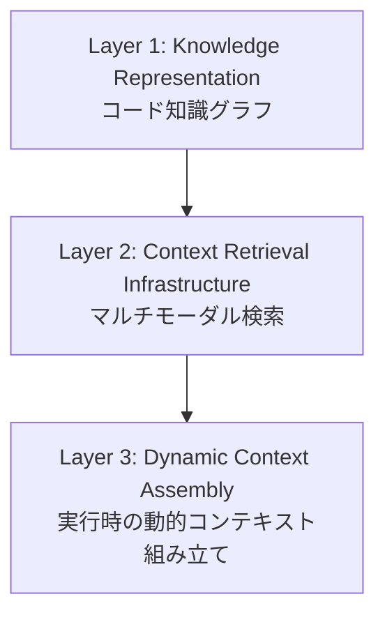

本記事は [arXiv:2602.20478](https://arxiv.org/abs/2602.20478) の解説記事です。

## 論文概要（Abstract）

大規模なコードベース（数十万〜数百万行）を扱うAIコーディングエージェントには、単一のコンテキストウィンドウに収まりきらない膨大な情報を効率的に取得・活用する仕組みが必要である。本論文は「Codified Context」という3層構造のインフラを提案し、コード知識グラフ（Knowledge Graph）、マルチモーダル検索、動的コンテキスト組み立てを統合することで、SWE-bench Verifiedで43.8%の解決率を達成したと報告している。これはCodeium社の研究チームによる実装を伴う論文である。

この記事は [Zenn記事: Claude CodeとCursor IDEの併用で自動コーディング精度を高める実践手法](https://zenn.dev/0h_n0/articles/d10139cd09e957) の深掘りです。

## 情報源

- **arXiv ID**: 2602.20478
- **URL**: [https://arxiv.org/abs/2602.20478](https://arxiv.org/abs/2602.20478)
- **著者**: Kyle Mistele, Karthik Bharadwaj, Aryamaan Dhomne et al.（Codeium）
- **発表年**: 2026
- **分野**: cs.SE, cs.AI

## 背景と動機（Background & Motivation）

現代のソフトウェアプロジェクトは巨大である。論文によれば、Googleのコードベースは20億行、Facebookは数千万行に及ぶ。GPT-4oの最大コンテキストウィンドウ（128Kトークン）でもこれらのコードベース全体は収まらない。

著者らが指摘する核心的な課題は、**Institutional Knowledge（組織固有の暗黙知）の欠如**である。人間の開発者がジュニアからシニアに成長する過程で獲得するのは、アーキテクチャの意図、暗黙の規約、設計上の決定理由、非公式のドキュメントといった知識である。現在のAIコーディングエージェントはこのInstitutional Knowledgeを持たないため、大規模コードベースでは十分な性能を発揮できない。

## 主要な貢献（Key Contributions）

- **貢献1**: 大規模コードベース向けの3層コンテキスト取得インフラ「Codified Context」の設計と実装
- **貢献2**: コードの構造的関係と意味的関係を統合するコード知識グラフの構築手法（概念ノードと規約自動抽出を含む）
- **貢献3**: SWE-bench Verifiedで43.8%、内部エンタープライズベンチマークでベースライン比+16〜20ppの改善を実証

## 技術的詳細（Technical Details）

### 3層アーキテクチャ

著者らが提案するCodified Contextは以下の3層で構成される。



### Layer 1: Knowledge Representation（知識表現）

コードベースを有向グラフ $G = (V, E)$ として表現する。

**頂点 $V$ の種類:**

| 種類 | 説明 |
|------|------|
| File | ファイルノード |
| Symbol | 関数・クラス・変数 |
| Module | モジュール/パッケージ |
| Documentation | Docstring・コメント |
| Test | テストノード |
| **Concept** | **抽象的な概念ノード（本論文の新規性）** |

**辺 $E$ の種類:**
- `IMPORTS`: インポート関係
- `CALLS`: 関数呼び出し
- `INHERITS`: 継承関係
- `IMPLEMENTS`: インターフェース実装
- `REFERENCES`: 変数参照
- `TESTS`: テスト対象の関係
- `CONCEPTUALLY_RELATED`: 埋め込みベクトルから計算される意味的類似性

#### Concept Nodes（概念ノード）

本論文の核心的な新規性の一つである。純粋なコード構造（AST）だけでなく、コードベースの「概念」もグラフに取り込む。

著者らによる生成方法：
1. コードの埋め込みベクトルを生成し、クラスタリング
2. LLMにより各クラスタに自然言語ラベルを付与（例: 「認証システム」「データベース接続プール」「APIレート制限ロジック」）
3. 概念間の階層構造（親概念・子概念）を構築

#### コードベース規約の自動抽出

大規模コードベースには暗黙の規約が存在する（例: エラー処理のパターン、ロギングスタイル）。著者らはこれを以下の手順で自動抽出している：

1. 頻出パターンの統計的検出
2. LLMによる規約の自然言語記述
3. 規約をグラフのメタデータとして保存

### Layer 2: Context Retrieval Infrastructure（コンテキスト検索）

複数の検索手法を統合するマルチモーダル検索を実装している。

| 手法 | 得意なクエリ |
|------|------------|
| Vector Search | 意味的に類似したコード |
| Graph Traversal (BFS/DFS) | 依存関係・呼び出しチェーン |
| Keyword/BM25 | 特定の関数名・クラス名 |
| LSP-based | 型情報・定義ジャンプ |

検索結果の統合スコアは以下の式で計算される：

$$
\text{score}(d) = \alpha \cdot s_{\text{vec}}(d) + \beta \cdot s_{\text{graph}}(d) + \gamma \cdot s_{\text{kw}}(d) + \delta \cdot s_{\text{lsp}}(d)
$$

ここで、
- $d$: ドキュメント（コード片）
- $s_{\text{vec}}(d)$: ベクトル検索スコア
- $s_{\text{graph}}(d)$: グラフ走査スコア
- $s_{\text{kw}}(d)$: キーワード検索スコア
- $s_{\text{lsp}}(d)$: LSPベーススコア
- $\alpha, \beta, \gamma, \delta$: タスクタイプ依存の重み

#### 階層的コンテキスト検索

コンテキストの粒度を4段階で制御する。

1. **File level**: ファイル概要・目的の要約
2. **Symbol level**: 関数・クラスのシグネチャ + Docstring
3. **Implementation level**: 実装の完全なコード
4. **Cross-file level**: 関連ファイルの統合ビュー

エージェントは粗い粒度から始めて必要に応じて詳細化する（coarse-to-fine retrieval）。

### Layer 3: Dynamic Context Assembly（動的コンテキスト組み立て）

コンテキストウィンドウのトークン数に上限があるため、**コンテキスト予算（context budget）** の概念を導入している。

**Context Eviction Policy**: LRU（Least Recently Used）に類似したポリシーで古いコンテキストを退避する。アクセス頻度、関連度スコア、最終アクセス時刻を考慮する。

**Just-In-Time Context Injection**: エージェントが特定のコードを参照する直前に必要なコンテキストを注入する遅延評価的アプローチ。Zenn記事で紹介されているAnthropicの「Just-in-Time retrieval」戦略と同じ原則に基づいている。

### 実装の技術スタック

著者らが使用した技術：

| コンポーネント | 技術 |
|--------------|------|
| ASTパーシング | Tree-sitter（30+言語対応） |
| グラフDB | Neo4j（本番）/ NetworkX（テスト） |
| ベクトルストア | Qdrant |
| コード埋め込み | Voyage Code 2（Voyage AI） |
| LSPクライアント | pylsp, TypeScript Language Server |

#### インクリメンタル更新

コード変更時にグラフ全体を再構築するのは非効率であるため、差分更新を実装している：

1. `git diff` を解析して変更ファイルを特定
2. 影響を受けるノード・辺のみ更新
3. 変更の波及範囲（transitive dependencies）も更新

著者らが報告しているスケーラビリティ（論文より）：

| コードベース規模 | ノード数 | 初期構築時間 | 差分更新時間 |
|----------------|---------|------------|------------|
| 10K LOC | ~5K | < 10秒 | < 1秒 |
| 100K LOC | ~50K | ~2分 | < 5秒 |
| 1M LOC | ~500K | ~20分 | < 30秒 |

## 実験結果（Results）

### SWE-bench Verified

著者らが報告しているSWE-bench Verified解決率（論文より）：

| システム | 解決率 |
|---------|--------|
| SWE-agent (GPT-4o) | 18.4% |
| AutoCodeRover (GPT-4o) | 28.7% |
| OpenHands (Claude 3.5 Sonnet) | 38.0% |
| Devin 2.0 | 41.8% |
| **Codified Context Agent** | **43.8%** |

著者らによると、特にDjango、Sphinx、sympyなどの大規模リポジトリでの改善が顕著であり、小規模リポジトリではグラフ構築のオーバーヘッドがメリットを上回る場合があるとされている。

### 内部エンタープライズベンチマーク

著者らが報告しているタスク別成功率（Codified Contextありvs なし）：

| タスク | なし | あり | 改善 |
|--------|-----|-----|------|
| Bug Fix | 34% | 52% | +18pp |
| Feature Addition | 28% | 47% | +19pp |
| Refactoring | 41% | 61% | +20pp |
| Doc Generation | 58% | 74% | +16pp |
| Test Generation | 45% | 63% | +18pp |

### アブレーション実験

各コンポーネントの累積的な寄与（著者らの報告より）：

| 設定 | SWE-bench解決率 |
|------|---------------|
| Vector Search only（ベースライン） | 33.2% |
| + Graph Traversal | 37.6% (+4.4pp) |
| + LSP Integration | 40.1% (+2.5pp) |
| + Concept Nodes | 42.3% (+2.2pp) |
| + Convention Extraction | 43.8% (+1.5pp) |

すべてのコンポーネントが独立して寄与していることが示されている。

### コンテキスト効率

「Lost in the Middle」問題への対処効果として、著者らは以下の数値を報告している：

- フラットな長文コンテキスト（128Kトークン）: 関連情報活用率 ~60%
- Codified Context（動的選択、平均8Kトークン）: 関連情報活用率 ~87%

つまり、少ないトークン数でより高い情報活用率を達成している。

## 実装のポイント（Implementation）

本論文の知見を実プロジェクトに活かすための要点：

### コード知識グラフの構築

```python
import networkx as nx
from tree_sitter import Language, Parser

def build_code_knowledge_graph(repo_path: str) -> nx.DiGraph:
    """リポジトリからコード知識グラフを構築する

    Args:
        repo_path: リポジトリのパス

    Returns:
        コード知識グラフ（有向グラフ）
    """
    G = nx.DiGraph()

    # 1. ASTパーシングでシンボルノードを作成
    for file_path in glob_python_files(repo_path):
        tree = parse_with_tree_sitter(file_path)
        symbols = extract_symbols(tree)  # 関数、クラス、変数
        for sym in symbols:
            G.add_node(sym.id, type="symbol", name=sym.name,
                       file=file_path, line=sym.line)

    # 2. インポート・呼び出し関係の辺を追加
    for file_path in glob_python_files(repo_path):
        imports = extract_imports(file_path)
        calls = extract_function_calls(file_path)
        for imp in imports:
            G.add_edge(file_path, imp.target, type="IMPORTS")
        for call in calls:
            G.add_edge(call.caller, call.callee, type="CALLS")

    # 3. Concept Nodesの生成（LLMによるクラスタラベル付与）
    embeddings = compute_code_embeddings(G)
    clusters = cluster_embeddings(embeddings)
    for cluster in clusters:
        concept_label = llm_generate_label(cluster)
        G.add_node(concept_label, type="concept")
        for node in cluster.members:
            G.add_edge(node, concept_label,
                       type="CONCEPTUALLY_RELATED")

    return G
```

### マルチモーダル検索の統合

検索結果の重み $(\alpha, \beta, \gamma, \delta)$ はタスクタイプに応じて調整が必要である。著者らの実験結果から推測される推奨値：

- **バグ修正**: グラフ走査の重み $\beta$ を高くする（呼び出しチェーンの追跡が重要）
- **機能追加**: ベクトル検索の重み $\alpha$ を高くする（類似コードの発見が重要）
- **リファクタリング**: LSPの重み $\delta$ を高くする（型情報・参照解析が重要）

### 実プロジェクトへの段階的導入

著者らの論文からは直接言及されていないが、以下の段階的アプローチが考えられる：

1. **Phase 1**: Tree-sitterによるAST解析 + BM25検索のみ（最小構成）
2. **Phase 2**: Qdrant等のベクトルストアを追加（意味的検索）
3. **Phase 3**: Neo4j等のグラフDBを追加（構造的検索）
4. **Phase 4**: Concept Nodes + Convention Extraction（完全構成）

## 実運用への応用（Practical Applications）

### Claude CodeおよびCursorとの統合

Zenn記事で紹介されているMCP（Model Context Protocol）は、本論文のContext Retrieval Infrastructureと概念的に重なる。MCPサーバーとして知識グラフ検索を実装すれば、Claude CodeおよびCursorの両方から同じコンテキスト検索機能を利用できる。

### スケーリングの現実

著者らが報告している初期構築時間（100K LOCで約2分、1M LOCで約20分）は、CI/CDパイプラインに組み込む場合には許容範囲である。ただし、差分更新（100K LOCで<5秒）の安定性が実運用では鍵となる。

### 制約と注意点

- **メタプログラミング**: リフレクションやメタプログラミングを多用するコードではグラフの精度が低下する
- **多言語混在**: 言語をまたぐ依存関係の解析は部分的なサポートにとどまる
- **LLM依存**: Concept Node生成にLLMを使うため、LLMの品質に依存する

## 関連研究（Related Work）

- **SWE-agent** (Yang et al., NeurIPS 2024): ACI（Agent-Computer Interface）によるファイル操作を提案。本論文はSWE-agentのエージェントに知識グラフベースのコンテキスト検索を組み合わせることで性能改善を実現している。
- **GraphRAG** (Edge et al., 2024): グラフ構造を活用したRAG。本論文はGraphRAGの概念をコードベースに特化して拡張し、LSP統合や概念ノードを追加している。
- **"Lost in the Middle"** (Liu et al., TACL 2024): 長いコンテキストの中間部分が無視される問題。本論文のDynamic Context Assemblyはこの問題への直接的な対策となっている。

## まとめと今後の展望

本論文は、大規模コードベースにおけるAIエージェントの性能向上のために「Codified Context」インフラを提案した。著者らが報告する主要な成果は以下の通り：

1. コード知識グラフ、マルチモーダル検索、動的コンテキスト組み立ての3層アーキテクチャ
2. SWE-bench Verifiedで43.8%の解決率（当時の報告値）
3. 平均8Kトークンで87%の情報活用率（128Kフラットコンテキストの60%を上回る）
4. Concept NodesとConvention Extractionが独自の寄与を持つことをアブレーション実験で確認

今後の課題として、リアルタイムグラフ更新、複数リポジトリをまたぐ依存関係のサポート、エージェントフィードバックによるグラフの自動改善が挙げられている。

## 参考文献

- **arXiv**: [https://arxiv.org/abs/2602.20478](https://arxiv.org/abs/2602.20478)
- **Related Zenn article**: [https://zenn.dev/0h_n0/articles/d10139cd09e957](https://zenn.dev/0h_n0/articles/d10139cd09e957)

---

:::message
本記事は [arXiv:2602.20478](https://arxiv.org/abs/2602.20478) の解説記事であり、著者自身が実験を行ったものではありません。数値・結果はすべて原論文からの引用です。
:::
