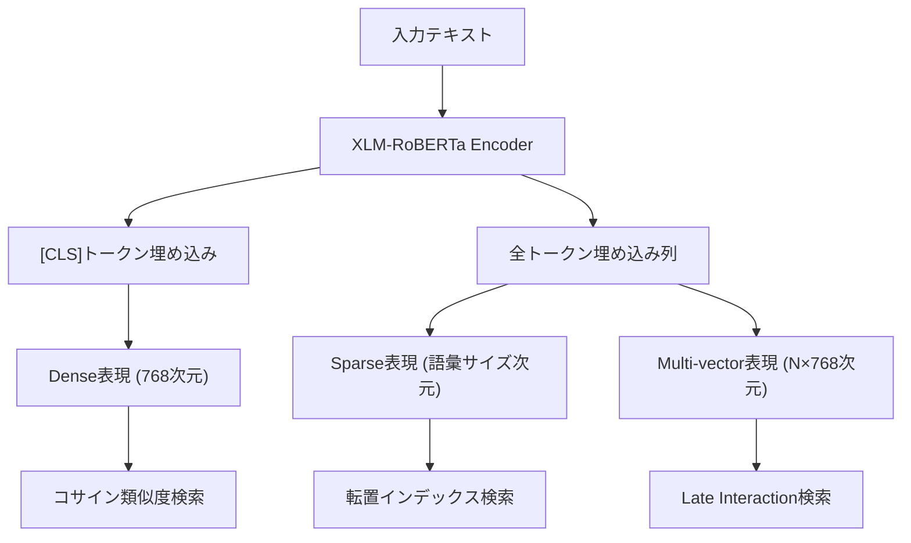

本記事は [arXiv:2402.03216](https://arxiv.org/abs/2402.03216) の解説記事です。

## 論文概要（Abstract）

BGE M3-Embedding（以下M3）は、BAAI（Beijing Academy of Artificial Intelligence）が提案した埋め込みモデルであり、**Multi-Linguality**（100言語以上対応）、**Multi-Functionality**（Dense/Sparse/Multi-vector検索を同時サポート）、**Multi-Granularity**（短文から8192トークンの長文まで対応）の3つのMulti（M3）を特徴とする。従来のハイブリッド検索では、BM25用のスパースインデックスとDense Retrieval用のベクトルインデックスを別々に管理する必要があったが、M3は単一のモデルから3種類の検索用表現を同時に出力できるため、インフラの複雑さを大幅に削減できる。著者らは自己知識蒸留（Self-Knowledge Distillation）という新しい学習手法を提案し、MIRACL、BEIR等のベンチマークで従来手法を上回る結果を報告している。

この記事は [Zenn記事: BM25×ベクトル検索のハイブリッド実装ガイド](https://zenn.dev/0h_n0/articles/46d801df9b61de) の深掘りです。

## 情報源

- **arXiv ID**: 2402.03216
- **URL**: [https://arxiv.org/abs/2402.03216](https://arxiv.org/abs/2402.03216)
- **著者**: Jianlv Chen, Shitao Xiao, Peitian Zhang, Kun Luo, Defu Lian, Zheng Liu
- **発表年**: 2024
- **分野**: cs.CL, cs.IR

## 背景と動機（Background & Motivation）

RAGシステムにおけるハイブリッド検索は、BM25（スパース検索）とDense Retrieval（デンス検索）を組み合わせることで検索精度を向上させる。Zenn記事で解説されているように、BM25は固有名詞やエラーコードの完全一致に強く、Dense Retrievalは意味的類似性に強い。

しかし、従来のハイブリッド検索には以下の運用上の課題がある。

1. **インフラの二重管理**: Elasticsearch等のBM25インデックスとQdrant等のベクトルDBを別々に運用する必要がある
2. **スコアスケールの不一致**: BM25スコア（0〜数十）とコサイン類似度（0〜1）の統合に正規化が必要
3. **言語ごとの対応**: BM25は言語ごとにトークナイザが必要だが、Dense Retrievalは多言語モデルで統一可能

M3はこれらの課題に対し、「1つのモデルで3種類の検索機能を提供する」というアプローチで解決を試みる。

## 主要な貢献（Key Contributions）

- **貢献1**: Dense Retrieval、Lexical（Sparse）Retrieval、Multi-vector（ColBERT型）Retrievalの3機能を単一モデルで実現
- **貢献2**: Self-Knowledge Distillation（自己知識蒸留）による学習手法の提案。3機能の統合スコアを教師信号として各機能の学習を改善
- **貢献3**: 100言語以上・8192トークンまでの入力に対応し、MIRACLおよびBEIRで既存手法を上回る結果を報告

## 技術的詳細（Technical Details）

### 3つの検索機能のアーキテクチャ

M3は、XLM-RoBERTa（多言語BERT系モデル）をバックボーンとし、単一のフォワードパスから3種類の表現を生成する。



#### Dense Retrieval

`[CLS]`トークンの隠れ状態を取得し、線形射影で固定次元のベクトルに変換する。

$$
\mathbf{e}_{\text{dense}} = \text{normalize}(\mathbf{W}_d \cdot \mathbf{h}_{\text{[CLS]}})
$$

ここで、$\mathbf{h}_{\text{[CLS]}}$は`[CLS]`トークンの隠れ状態、$\mathbf{W}_d$は線形射影行列である。

スコアは以下のコサイン類似度で計算される。

$$
s_{\text{dense}}(q, d) = \frac{\mathbf{e}_q^{\text{dense}} \cdot \mathbf{e}_d^{\text{dense}}}{|\mathbf{e}_q^{\text{dense}}| \cdot |\mathbf{e}_d^{\text{dense}}|}
$$

#### Sparse（Lexical）Retrieval

各トークン位置の隠れ状態をMLM（Masked Language Model）ヘッドに通し、語彙全体に対する重みを算出する。ReLU活性化で負の重みを除去し、各語彙項のスパース重みを得る。

$$
w_t = \max_{i \in \text{positions}(t)} \text{ReLU}(\text{MLM}(\mathbf{h}_i)_t)
$$

ここで、$w_t$は語彙項$t$のスパース重み、$\mathbf{h}_i$は$i$番目のトークンの隠れ状態である。同一語彙項が複数位置に出現する場合は最大値を採用する。

スコアはスパースベクトルの内積で計算される。

$$
s_{\text{sparse}}(q, d) = \sum_{t \in q \cap d} w_t^q \cdot w_t^d
$$

この方式はSPLADEと類似しているが、M3はSPLADEのようにスパース性正則化を別途適用せず、MLMヘッドの出力をそのまま利用する。

#### Multi-vector（ColBERT型）Retrieval

全トークンの隠れ状態を保持し、クエリとドキュメントのトークン間のMaxSim操作でスコアを計算する。

$$
s_{\text{multi}}(q, d) = \frac{1}{|q|} \sum_{i=1}^{|q|} \max_{j=1}^{|d|} (\mathbf{h}_i^q \cdot \mathbf{h}_j^d)
$$

これはColBERTの後期相互作用（Late Interaction）と同一の計算である。各クエリトークンに対して最も類似するドキュメントトークンを見つけ、その類似度の平均を取る。

### Self-Knowledge Distillation

M3の学習では、3つの検索機能のスコアを統合した教師信号を使う。

$$
s_{\text{teacher}}(q, d) = s_{\text{dense}}(q, d) + s_{\text{sparse}}(q, d) + s_{\text{multi}}(q, d)
$$

この統合スコアを教師信号として、各機能の損失関数に組み込む。

$$
\mathcal{L} = \mathcal{L}_{\text{dense}} + \mathcal{L}_{\text{sparse}} + \mathcal{L}_{\text{multi}} + \lambda \cdot \mathcal{L}_{\text{distill}}
$$

ここで、$\mathcal{L}_{\text{distill}}$は統合スコアと各機能スコアのKLダイバージェンスである。直感的には、「3つの機能が合意した判断」を各機能が個別に学習するという構造になっている。

### ハイブリッド検索での統合

M3の3つのスコアはRRFで統合できる。

$$
\text{RRF}(d) = \sum_{r \in \{\text{dense}, \text{sparse}, \text{multi}\}} \frac{1}{k + \text{rank}_r(d)}
$$

### 実装コード例

```python
"""BGE M3-Embeddingによるハイブリッド検索の実装例."""
from FlagEmbedding import BGEM3FlagModel


def encode_with_m3(
    texts: list[str],
    model_name: str = "BAAI/bge-m3",
    batch_size: int = 32,
    max_length: int = 512,
) -> dict:
    """M3モデルで3種類の表現を同時に取得.

    Args:
        texts: エンコード対象のテキストリスト
        model_name: HuggingFaceモデル名
        batch_size: バッチサイズ
        max_length: 最大トークン長

    Returns:
        dense, sparse, colbert_vecsを含む辞書
    """
    model = BGEM3FlagModel(model_name, use_fp16=True)

    output = model.encode(
        texts,
        batch_size=batch_size,
        max_length=max_length,
        return_dense=True,
        return_sparse=True,
        return_colbert_vecs=True,
    )

    return {
        "dense": output["dense_vecs"],      # shape: (N, 1024)
        "sparse": output["lexical_weights"], # list of dict[token_id, weight]
        "colbert": output["colbert_vecs"],   # list of (seq_len, 1024) arrays
    }


def m3_hybrid_score(
    query_output: dict,
    doc_output: dict,
    weights: tuple[float, float, float] = (0.4, 0.2, 0.4),
) -> float:
    """M3の3スコアを重み付き線形結合で統合.

    Args:
        query_output: クエリのM3出力
        doc_output: ドキュメントのM3出力
        weights: (dense_weight, sparse_weight, multi_weight)

    Returns:
        統合スコア
    """
    import numpy as np

    # Dense score
    q_dense = query_output["dense"]
    d_dense = doc_output["dense"]
    s_dense = float(np.dot(q_dense, d_dense) /
                     (np.linalg.norm(q_dense) * np.linalg.norm(d_dense)))

    # Sparse score
    q_sparse = query_output["sparse"]
    d_sparse = doc_output["sparse"]
    common_tokens = set(q_sparse.keys()) & set(d_sparse.keys())
    s_sparse = sum(q_sparse[t] * d_sparse[t] for t in common_tokens)

    # Multi-vector score (MaxSim)
    q_vecs = query_output["colbert"]  # (q_len, dim)
    d_vecs = doc_output["colbert"]    # (d_len, dim)
    sim_matrix = np.dot(q_vecs, d_vecs.T)
    s_multi = float(np.mean(np.max(sim_matrix, axis=1)))

    w_d, w_s, w_m = weights
    return w_d * s_dense + w_s * s_sparse + w_m * s_multi
```

## 実装のポイント（Implementation）

**GPU要件**: M3はXLM-RoBERTaベースのため、推論にGPU（RTX 3090相当以上）が推奨される。FP16モードで約2GBのVRAMを消費する。CPUでも動作するが、バッチサイズ32で512トークンの処理に数秒を要する。

**インデックス構築**: Dense表現はFAISSやQdrantにインデックス可能。Sparse表現はElasticsearch互換の転置インデックスとして構築可能。Multi-vector表現はColBERT形式のインデックスが必要で、サイズがDense比で約10倍になる点に注意が必要である。

**Qdrantとの統合**: Qdrantはスパースベクトルをネイティブサポートしているため、M3のDense + Sparse表現をQdrantの`prefetch` + RRFで統合するのが実用的なパターンである。ColBERT表現は精度向上が必要な場合のみ追加する。

**モデルサイズとレイテンシのトレードオフ**: M3は約560Mパラメータであり、推論レイテンシはバッチ32で約50ms/query（GPU使用時）。リアルタイム検索にはバッチ処理の工夫が必要である。

## 実験結果（Results）

著者らは複数のベンチマークでM3の評価を行い、以下の結果を報告している。

**MIRACLベンチマーク（多言語検索）** - 論文Table 3より:

| 手法 | nDCG@10（平均） |
|------|---------------|
| BM25 | 44.2 |
| Dense (BGE-Large) | 60.2 |
| M3 Dense only | 62.1 |
| M3 Hybrid (Dense+Sparse+Multi) | 66.8 |

**BEIRベンチマーク（英語ドメイン外検索）** - 論文Table 2より:

著者らはBGE-Largeに対して+2.1ptの改善を報告している。M3-Hybridは全データセットで単一機能を上回り、特にスパース検索が寄与するSciFact、FiQAで大きな改善が見られたとされる。

**制約事項**: ColBERT型のMulti-vector表現はインデックスサイズが大きく（Dense比で約10倍）、ストレージコストが増大する。また、M3は多言語対応に最適化されているため、日本語単言語では日本語特化モデルの方が精度が出る可能性がある。

## 実運用への応用（Practical Applications）

M3はZenn記事で紹介されているハイブリッド検索の構築を大幅に簡素化する。

**M3を使う場合のアーキテクチャ変更**:

| 項目 | 従来構成 | M3構成 |
|------|---------|--------|
| BM25エンジン | Elasticsearch | 不要（M3 Sparseで代替可能） |
| ベクトルDB | Qdrant | Qdrant（Dense + Sparse） |
| 埋め込みモデル | OpenAI等 | M3（自前ホスティング） |
| スコア統合 | 正規化 + RRF | RRFのみ（スケール統一） |
| インフラ台数 | 2-3台 | 1-2台 |

**Qdrantとの統合パターン**: QdrantのQuery APIでM3のDense + Sparse表現をprefetchで統合し、RRFで最終ランキングを生成する構成が推奨される。これはZenn記事のQdrantセクションで紹介されているパターンそのものであり、M3を埋め込みモデルとして使用するだけで実現可能である。

## 関連研究（Related Work）

- **SPLADE（Formal et al., SIGIR 2021）**: 学習型スパース検索の先駆け。M3のSparse表現はSPLADEに影響を受けているが、独立したスパース正則化は適用していない。
- **ColBERT（Khattab & Zaharia, 2020）**: 後期相互作用（Late Interaction）によるMulti-vector検索を提案。M3のMulti-vector機能はColBERTの計算手法を採用している。
- **E5-Mistral（Wang et al., 2024）**: LLMベースの埋め込みモデル。Dense性能はM3を上回る可能性があるが、Sparse/Multi-vectorは未対応。

## まとめと今後の展望

M3は「1モデルで3種類の検索機能」という実用的なアプローチにより、ハイブリッド検索のインフラ複雑さを大幅に削減する。著者らはMIRACL、BEIRでの改善を報告しており、特に多言語環境での有効性が際立つ。

実務では、BM25 + Dense Retrievalの二重インフラを運用している場合に、M3への移行によるインフラ簡素化が最大のメリットとなる。一方、日本語単言語で最高精度を求める場合は、M3のSparse + Dense構成と従来のElasticsearch BM25 + 専用Dense modelの構成を比較評価することが推奨される。

## 参考文献

- **arXiv**: [https://arxiv.org/abs/2402.03216](https://arxiv.org/abs/2402.03216)
- **Code**: [https://github.com/FlagOpen/FlagEmbedding](https://github.com/FlagOpen/FlagEmbedding) (MIT License)
- **Model**: [https://huggingface.co/BAAI/bge-m3](https://huggingface.co/BAAI/bge-m3) (Apache 2.0)
- **Related Zenn article**: [https://zenn.dev/0h_n0/articles/46d801df9b61de](https://zenn.dev/0h_n0/articles/46d801df9b61de)
