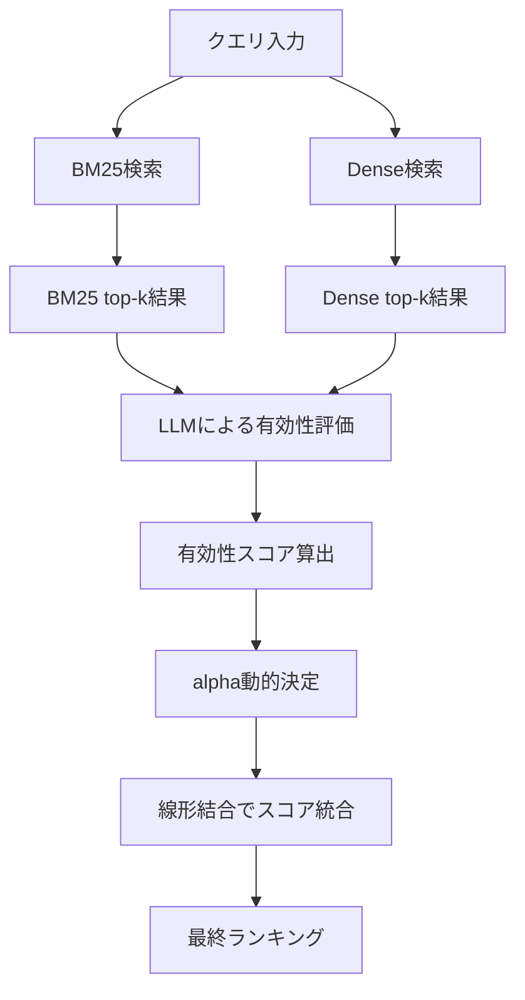

本記事は [arXiv:2503.23013](https://arxiv.org/abs/2503.23013) の解説記事です。

## 論文概要（Abstract）

DAT（Dynamic Alpha Tuning）は、RAG（Retrieval-Augmented Generation）におけるハイブリッド検索の重み付けを、クエリごとに動的に調整する手法である。従来のハイブリッド検索では、BM25とDense Retrievalのスコアを固定のalpha値で線形結合するか、RRF（Reciprocal Rank Fusion）で順位ベースの統合を行うのが一般的であった。DATは、LLMを活用して各クエリにおけるBM25結果とDense結果の「有効性スコア」を評価し、その結果に基づいてalphaを動的に決定する。著者らは、DATが固定alpha方式やRRFを複数の評価指標で上回ると報告している。

この記事は [Zenn記事: BM25×ベクトル検索のハイブリッド実装ガイド](https://zenn.dev/0h_n0/articles/46d801df9b61de) の深掘りです。

## 情報源

- **arXiv ID**: 2503.23013
- **URL**: [https://arxiv.org/abs/2503.23013](https://arxiv.org/abs/2503.23013)
- **著者**: Hsin-Ling Hsu, Jengnan Tzeng
- **発表年**: 2025
- **分野**: cs.IR（Information Retrieval）

## 背景と動機（Background & Motivation）

RAGシステムにおいて、BM25（語彙ベースのスパース検索）とDense Retrieval（埋め込みベースのデンス検索）を組み合わせたハイブリッド検索は広く採用されている。しかし、両者のスコアをどのように統合するかは依然として課題である。

従来の代表的なアプローチには以下の問題がある。

1. **固定alpha方式**: $\text{score} = \alpha \cdot s_{\text{dense}} + (1 - \alpha) \cdot s_{\text{bm25}}$ で全クエリに同一のalphaを適用する。しかし、クエリによってBM25が有効な場合（固有名詞検索）とDense Retrievalが有効な場合（意味検索）が異なるため、単一のalphaでは最適化できない。

2. **RRF（Reciprocal Rank Fusion）**: スコアの絶対値を無視し順位のみで統合するため、スコア差の情報が失われる。例えば、BM25で圧倒的に高いスコアを持つ文書とそうでない文書の区別ができない。

DATはこの課題に対し、クエリの特性に応じてalphaを動的に変化させることで、検索精度の向上を目指す。

## 主要な貢献（Key Contributions）

- **貢献1**: クエリごとにBM25とDense Retrievalの有効性をLLMで評価し、alphaを動的に決定するフレームワークの提案
- **貢献2**: 有効性スコアの正規化手法により、安定したalpha推定を実現
- **貢献3**: 固定alpha方式およびRRFに対する複数データセットでの優位性の実証

## 技術的詳細（Technical Details）

### DATのアルゴリズム

DATの核心は、各クエリに対してBM25検索結果とDense検索結果のそれぞれの「有効性」をLLMに評価させ、その評価結果に基づいてalphaを調整する点にある。

全体のフローは以下の通りである。



### スコア統合の数式

DATにおける最終スコアは以下の式で計算される。

$$
\text{score}_{\text{DAT}}(q, d) = \alpha(q) \cdot \hat{s}_{\text{dense}}(q, d) + (1 - \alpha(q)) \cdot \hat{s}_{\text{bm25}}(q, d)
$$

ここで、
- $q$: 入力クエリ
- $d$: 文書
- $\alpha(q)$: クエリ$q$に対する動的alpha値（$0 \leq \alpha \leq 1$）
- $\hat{s}_{\text{dense}}(q, d)$: 正規化されたDense Retrievalスコア
- $\hat{s}_{\text{bm25}}(q, d)$: 正規化されたBM25スコア

### alpha決定プロセス

DATでは、alphaの決定に以下のステップを踏む。

**ステップ1: 各検索手法のtop-1結果を取得**

$$
d_{\text{bm25}}^* = \arg\max_{d} s_{\text{bm25}}(q, d), \quad d_{\text{dense}}^* = \arg\max_{d} s_{\text{dense}}(q, d)
$$

**ステップ2: LLMによる有効性評価**

LLMに対して、クエリ$q$と各top-1結果$d_{\text{bm25}}^*$、$d_{\text{dense}}^*$のペアを提示し、それぞれの関連度を評価させる。評価結果を有効性スコア$e_{\text{bm25}}$、$e_{\text{dense}}$として取得する。

**ステップ3: 有効性スコアの正規化とalpha算出**

$$
\alpha(q) = \frac{e_{\text{dense}}(q)}{e_{\text{dense}}(q) + e_{\text{bm25}}(q)}
$$

ここで、$e_{\text{dense}}(q)$と$e_{\text{bm25}}(q)$はそれぞれLLMが出力したDense検索結果とBM25検索結果の有効性スコアである。Dense側の有効性が高ければalphaは1に近づき、BM25側が高ければ0に近づく。

### スコア正規化

BM25スコアとDenseスコアはスケールが大きく異なるため、統合前にMin-Max正規化を適用する。

$$
\hat{s}(q, d) = \frac{s(q, d) - \min_{d' \in D_q} s(q, d')}{\max_{d' \in D_q} s(q, d') - \min_{d' \in D_q} s(q, d')}
$$

ここで、$D_q$はクエリ$q$に対する候補文書集合である。

### アルゴリズムの擬似コード

```python
"""DAT (Dynamic Alpha Tuning) の実装概要."""
from dataclasses import dataclass


@dataclass(frozen=True)
class RetrievalResult:
    """検索結果."""

    doc_id: str
    score: float
    content: str


def dat_hybrid_search(
    query: str,
    bm25_results: list[RetrievalResult],
    dense_results: list[RetrievalResult],
    llm_client: object,
) -> list[tuple[str, float]]:
    """DATによるハイブリッド検索.

    Args:
        query: 検索クエリ
        bm25_results: BM25検索結果（スコア降順）
        dense_results: Dense検索結果（スコア降順）
        llm_client: LLMクライアント

    Returns:
        (doc_id, combined_score) のリスト（スコア降順）
    """
    # Step 1: top-1結果を取得
    bm25_top1 = bm25_results[0]
    dense_top1 = dense_results[0]

    # Step 2: LLMで有効性評価
    e_bm25 = evaluate_effectiveness(llm_client, query, bm25_top1.content)
    e_dense = evaluate_effectiveness(llm_client, query, dense_top1.content)

    # Step 3: alpha算出
    alpha = e_dense / (e_dense + e_bm25 + 1e-8)

    # Step 4: スコア正規化
    bm25_normalized = min_max_normalize(bm25_results)
    dense_normalized = min_max_normalize(dense_results)

    # Step 5: 線形結合
    all_doc_ids = set(bm25_normalized) | set(dense_normalized)
    combined = {}
    for doc_id in all_doc_ids:
        s_bm25 = bm25_normalized.get(doc_id, 0.0)
        s_dense = dense_normalized.get(doc_id, 0.0)
        combined[doc_id] = alpha * s_dense + (1 - alpha) * s_bm25

    return sorted(combined.items(), key=lambda x: x[1], reverse=True)


def evaluate_effectiveness(
    llm_client: object,
    query: str,
    document: str,
) -> float:
    """LLMでクエリと文書の関連度を評価.

    Args:
        llm_client: LLMクライアント
        query: クエリ文字列
        document: 文書内容

    Returns:
        有効性スコア（0.0-1.0）
    """
    prompt = f"""以下のクエリと文書の関連度を0から10で評価してください。
クエリ: {query}
文書: {document[:500]}
スコア（0-10の整数）:"""
    response = llm_client.generate(prompt)
    score = int(response.strip()) / 10.0
    return min(max(score, 0.0), 1.0)


def min_max_normalize(
    results: list[RetrievalResult],
) -> dict[str, float]:
    """Min-Max正規化.

    Args:
        results: 検索結果リスト

    Returns:
        doc_id -> 正規化スコアの辞書
    """
    if not results:
        return {}
    scores = [r.score for r in results]
    min_s, max_s = min(scores), max(scores)
    diff = max_s - min_s
    if diff == 0:
        return {r.doc_id: 1.0 for r in results}
    return {r.doc_id: (r.score - min_s) / diff for r in results}
```

## 実装のポイント（Implementation）

DATを本番環境に導入する際の実装上の考慮点を整理する。

**LLM呼び出しのレイテンシ**: DATはクエリごとにLLM呼び出しを行うため、リアルタイム検索ではレイテンシが課題となる。著者らは小規模モデルでも有効と報告しているが、本番環境ではクエリあたり100-500msの追加レイテンシを見込む必要がある。対策として、LLM評価結果のキャッシュや、類似クエリに対するalpha値の事前計算が考えられる。

**スコア正規化の選択**: Min-Max正規化は候補文書集合に依存するため、候補集合のサイズや分布が変わるとalphaの安定性に影響する。Z-score正規化やRank-based正規化との比較検討が推奨される。

**フォールバック戦略**: LLM呼び出しが失敗した場合やタイムアウトした場合に備えて、デフォルトのalpha値（例: 0.5）へのフォールバックを実装すべきである。

**バッチ処理での活用**: リアルタイムではなくバッチ処理（RAGパイプラインの事前検索、オフライン評価等）では、LLMコストが許容範囲内に収まりやすく、DATの効果を発揮しやすい。

## 実験結果（Results）

著者らは、DATが固定alpha方式のハイブリッド検索を複数の評価指標で上回ると報告している。

**DATの有効性が報告されている状況**:

| 比較対象 | DATの報告 |
|---------|----------|
| 固定alpha ($\alpha = 0.5$) | 複数指標で改善 |
| RRF ($k = 60$) | 一部データセットで改善 |
| BM25単体 | 大幅改善 |
| Dense単体 | 改善 |

著者らは特に以下の点を主張している。

- DATは固定alphaに対して「一貫して有意な改善」を示す
- 小規模LLMを使用した場合でも効果が維持される
- クエリタイプが多様な環境（語彙検索向きと意味検索向きの混在）で効果が顕著

**制約事項**: 論文の実験詳細（具体的なデータセット名や数値）はarXiv preprint段階では限定的であり、査読付き会議での発表時にベンチマーク詳細が公開される可能性がある。

## 実運用への応用（Practical Applications）

DATはZenn記事で紹介されている固定alpha方式やRRFの「次のステップ」として位置づけられる。

**適用が向いているケース**:
- ドメインが多様なRAGシステム（法律文書、技術文書、一般知識が混在）
- クエリタイプの分布が不均一（固有名詞検索と自然文検索が混在）
- バッチ処理ベースの検索パイプライン（オフラインインデクシング、評価パイプライン）

**適用が難しいケース**:
- リアルタイム検索でレイテンシ制約が厳しい場合（<50ms）
- LLM呼び出しのコストが許容できない場合
- 単一ドメインで固定alphaが十分に機能している場合

**スケーリング戦略**: クエリの特徴量（クエリ長、OOV率、BM25スコア分散等）からalphaを予測する軽量分類器（LightGBM等）を事前学習し、推論時はLLM呼び出しを省略する方法が考えられる。これにより、DATの精度向上を維持しつつ、レイテンシを<1msに抑えることが可能になる。

## 関連研究（Related Work）

- **RRF（Cormack et al., 2009）**: 順位ベースの統合手法。SIGIR 2009で提案され、ハイブリッド検索のデファクトスタンダードとなっている。DATはRRFが無視するスコアの絶対値情報を活用する点で差別化される。
- **Learned Fusion（arXiv:2408.09017）**: BM25とDenseのスコアをGradient Boosted Treesで学習する手法。DATと同様にクエリ適応的だが、訓練データが必要な点でDATのゼロショット性と異なる。
- **Adaptive Retrieval Fusion（arXiv:2406.14773）**: 適応的な重み学習によるハイブリッド融合。DATと目的は類似するが、LLMベースの評価ではなく学習ベースのアプローチを取る。

## まとめと今後の展望

DATは、ハイブリッド検索における固定alpha問題に対して、LLMを活用したクエリ適応的なalpha調整という新しいアプローチを提案している。著者らは固定alpha方式やRRFに対する改善を報告しており、特にクエリタイプが多様な環境での有効性を主張している。

実務への示唆としては、まずRRFや固定alphaでベースラインを構築し、精度改善が必要な場合にDATへの移行を検討するのが現実的なアプローチである。バッチ処理環境ではLLMコストを許容しやすく、DATの効果を享受しやすい。リアルタイム環境では、LightGBM等の軽量モデルによる代替が有望である。

今後は、査読付き会議での詳細なベンチマーク結果の公開、クロスドメイン汎化性の検証、および軽量化手法の研究が期待される。

## 参考文献

- **arXiv**: [https://arxiv.org/abs/2503.23013](https://arxiv.org/abs/2503.23013)
- **Related Zenn article**: [https://zenn.dev/0h_n0/articles/46d801df9b61de](https://zenn.dev/0h_n0/articles/46d801df9b61de)
- **RRF原論文**: Cormack, G. V., Clarke, C. L., & Buettcher, S. (2009). Reciprocal rank fusion outperforms condorcet and individual rank learning methods. SIGIR 2009.
- **Learned Fusion**: [https://arxiv.org/abs/2408.09017](https://arxiv.org/abs/2408.09017)
