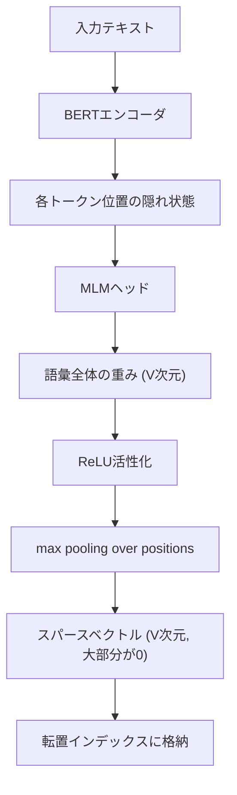

本記事は [arXiv:2401.05501](https://arxiv.org/abs/2401.05501) の解説記事です。

## 論文概要（Abstract）

SPLADE-v3は、Naver Labsが開発した学習型スパース検索（Learned Sparse Retrieval）モデルの第3世代である。SPLADE（SParse Lexical AnD Expansion）は、BERTのMLM（Masked Language Model）ヘッドを活用して文書やクエリのスパース表現を学習する。従来のBM25がTF-IDFに基づく固定的なスパース表現を使用するのに対し、SPLADEはニューラルネットワークで最適な語彙重みを学習する。SPLADE-v3では知識蒸留（Cross-Encoder Distillation）の改善により、BM25をMS MARCOベンチマークのMRR@10で約19ポイント上回る結果が報告されている（論文のTable 1より、BM25: 18.4、SPLADE-v3 Ensemble: 37.8）。重要な特徴として、SPLADEの出力は従来のBM25と同じ転置インデックスで動作するため、Elasticsearch等の既存インフラに統合可能である。

この記事は [Zenn記事: BM25×ベクトル検索のハイブリッド実装ガイド](https://zenn.dev/0h_n0/articles/46d801df9b61de) の深掘りです。

## 情報源

- **arXiv ID**: 2401.05501
- **URL**: [https://arxiv.org/abs/2401.05501](https://arxiv.org/abs/2401.05501)
- **著者**: Carlos Lassance et al. (Naver Labs Europe)
- **発表年**: 2024
- **分野**: cs.IR

## 背景と動機（Background & Motivation）

Zenn記事で解説されているBM25は、転置インデックスによる高速検索と、固有名詞・エラーコード等の完全一致に強いという利点がある。しかし、BM25のスコアリングは固定的なTF-IDF重みに基づいており、「意味的に関連するが語彙的に一致しない」文書を見つけることができない。

例えば、「機械学習の高速化」というクエリに対して、「ニューラルネットワークの推論最適化」という文書はBM25ではヒットしにくい。これはZenn記事で指摘されている「BM25は意味的類似性に弱い」という課題そのものである。

この課題に対するアプローチは2つある。

1. **Dense Retrieval**: テキストを密ベクトルに変換し、ベクトル空間での近傍探索を行う（Zenn記事のベクトル検索セクション）
2. **Learned Sparse Retrieval**: スパース表現自体をニューラルネットワークで学習し、BM25の転置インデックス互換性を維持しつつ意味的な検索能力を付与する

SPLADEは後者のアプローチに属し、BM25の利点（転置インデックス互換、説明可能性）を保ちつつ、検索精度を大幅に改善する。

## 主要な貢献（Key Contributions）

- **貢献1**: SPLADE-v3 EnsembleモデルによりMS MARCO MRR@10でBM25を約19pt上回る結果を達成（論文Table 1: BM25 18.4 → SPLADE-v3 37.8）
- **貢献2**: Cross-Encoder蒸留の改善により、前世代SPLADE++からさらなる精度向上を実現
- **貢献3**: BEIRゼロショット評価でBM25を平均nDCG@10で上回り、ドメイン外の汎化性能を実証

## 技術的詳細（Technical Details）

### SPLADEのアーキテクチャ

SPLADEは、BERTのMLMヘッドを再利用してスパース表現を生成する。



### 数式定義

入力テキスト$x$に対するSPLADEのスパース表現は以下のように定義される。

$$
w_j(x) = \max_{i \in \{1, \ldots, n\}} \log\left(1 + \text{ReLU}\left(\text{MLM}(\mathbf{h}_i)_j\right)\right)
$$

ここで、
- $n$: 入力テキストのトークン数
- $\mathbf{h}_i$: $i$番目のトークンのBERT隠れ状態
- $\text{MLM}(\cdot)_j$: MLMヘッドの出力のうち語彙項$j$に対応するlogit
- $w_j(x)$: テキスト$x$における語彙項$j$のスパース重み

$\log(1 + \text{ReLU}(\cdot))$は2つの役割を持つ。
1. **ReLU**: 負の重みを除去し、スパース性を確保
2. **$\log(1 + \cdot)$**: 大きな重みの増大を抑制し、特定の語に過度に依存しないようにする

### 検索スコアの計算

クエリ$q$と文書$d$のスコアは、スパースベクトルの内積で計算される。

$$
s(q, d) = \sum_{j \in V} w_j(q) \cdot w_j(d)
$$

ここで、$V$は語彙全体の集合（BERTの場合30,522次元）である。実際にはほとんどの$w_j$が0であるため、非ゼロ要素のみを対象とした効率的な計算が可能である。これは転置インデックスでの検索と等価であり、BM25と同じインフラで動作する。

### 語彙拡張（Term Expansion）

SPLADEの重要な特徴は**語彙拡張**である。MLMヘッドは入力テキストに含まれない語彙項にも正の重みを割り当てることができる。

例えば、「犬を散歩させる」という文書に対して、SPLADEは以下のような拡張を行う可能性がある。

- 元の語彙: 「犬」「散歩」
- 拡張された語彙: 「ペット」「イヌ」「ウォーキング」「リード」

これにより、「ペットの運動」というクエリでも上記文書がヒットするようになる。BM25ではこのような語彙的ギャップを埋めることができない。

### 知識蒸留（Knowledge Distillation）

SPLADE-v3では、Cross-Encoder（クエリと文書を同時に入力するモデル）の出力を教師信号としてスパースモデルを学習する。

$$
\mathcal{L}_{\text{distill}} = \text{KL}\left(p_{\text{teacher}}(d | q) \,\|\, p_{\text{student}}(d | q)\right)
$$

ここで、
- $p_{\text{teacher}}(d | q)$: Cross-Encoderの関連度スコアのsoftmax分布
- $p_{\text{student}}(d | q)$: SPLADEのスパーススコアのsoftmax分布

Cross-Encoderは精度が高いがクエリ-文書ペアの全組合せを評価する必要があり、実用的な検索には使えない。知識蒸留により、Cross-Encoderの精度をスパースモデルに転移させることで、高精度かつ高速な検索を実現する。

### 実装コード例

```python
"""SPLADEによるスパース検索の実装例."""
import torch
from transformers import AutoModelForMaskedLM, AutoTokenizer


def encode_splade(
    text: str,
    model: AutoModelForMaskedLM,
    tokenizer: AutoTokenizer,
    max_length: int = 256,
) -> dict[int, float]:
    """SPLADEでテキストをスパースベクトルにエンコード.

    Args:
        text: 入力テキスト
        model: SPLADEモデル（MLMヘッド付き）
        tokenizer: トークナイザ
        max_length: 最大トークン長

    Returns:
        token_id -> weight の辞書（非ゼロ要素のみ）
    """
    inputs = tokenizer(
        text,
        return_tensors="pt",
        max_length=max_length,
        truncation=True,
        padding=True,
    )

    with torch.no_grad():
        outputs = model(**inputs)
        logits = outputs.logits  # (1, seq_len, vocab_size)

    # log(1 + ReLU(logits)) -> max pooling over positions
    weights = torch.log1p(torch.relu(logits))
    sparse_vec = weights.max(dim=1).values.squeeze(0)  # (vocab_size,)

    # 非ゼロ要素のみ抽出
    nonzero_indices = sparse_vec.nonzero(as_tuple=True)[0]
    sparse_dict = {
        int(idx): float(sparse_vec[idx])
        for idx in nonzero_indices
    }

    return sparse_dict


def splade_score(
    query_sparse: dict[int, float],
    doc_sparse: dict[int, float],
) -> float:
    """SPLADEスパースベクトルの内積スコア.

    Args:
        query_sparse: クエリのスパース表現
        doc_sparse: 文書のスパース表現

    Returns:
        内積スコア
    """
    common_tokens = set(query_sparse) & set(doc_sparse)
    return sum(
        query_sparse[t] * doc_sparse[t]
        for t in common_tokens
    )


# 使用例
if __name__ == "__main__":
    model_name = "naver/splade-v3"
    tokenizer = AutoTokenizer.from_pretrained(model_name)
    model = AutoModelForMaskedLM.from_pretrained(model_name)
    model.eval()

    query_sparse = encode_splade("ハイブリッド検索の実装方法", model, tokenizer)
    doc_sparse = encode_splade("BM25とベクトル検索を組み合わせた検索手法", model, tokenizer)

    score = splade_score(query_sparse, doc_sparse)
    print(f"Score: {score:.4f}")
    print(f"Query non-zero terms: {len(query_sparse)}")
    print(f"Doc non-zero terms: {len(doc_sparse)}")
```

## 実装のポイント（Implementation）

**GPU要件**: SPLADEのエンコーディングにはGPUが推奨される。クエリエンコードに約50ms（GPU）、CPUでは数百msを要する。BM25が<1msでクエリ処理できることと比較すると、レイテンシの増加が大きい。

**Elasticsearch統合**: SPLADEの出力は転置インデックス互換であるため、Pyserini経由でAnserini（Luceneベースの検索ライブラリ）のインデックスとして構築可能である。Elasticsearch 8.xではELSER（Elastic Learned Sparse EncodeR）としてSPLADEの概念が取り込まれている。

**EfficientモデルとEnsembleモデル**: SPLADE-v3にはEfficient版とEnsemble版がある。Efficient版はレイテンシが約2倍速いが精度が低い。Ensembleモデルは複数のSPLADEモデルの出力を統合し、最高精度を達成する。

**スパース性の調整**: SPLADEはFLOPS正則化パラメータにより、スパース度（非ゼロ要素の数）を制御できる。スパース度が高い（非ゼロが少ない）ほど検索は高速だが精度は低下する。MS MARCOでは文書あたり約200-300の非ゼロ語彙項が一般的な設定である。

## 実験結果（Results）

著者らが報告した主要な実験結果は以下の通りである。

**MS MARCO Passage Ranking** - 論文Table 1より:

| 手法 | MRR@10 |
|------|--------|
| BM25 | 18.4 |
| SPLADE++ EnsembleDistil | 36.8 |
| SPLADE-v3 Ensemble | 37.8 |
| Dense (ColBERTv2) | 39.7 |

**BEIR ゼロショット評価** - 論文Table 2より:

著者らはBEIR 18データセットでBM25を平均nDCG@10で上回ると報告している。特にスパース手法が得意とするSciFact（科学論文検索）やFiQA（金融質問応答）で顕著な改善が見られたとされる。

**制約事項**: Dense手法（ColBERTv2等）はMRR@10で依然としてSPLADE-v3を上回っている。SPLADEの最大の価値は「BM25互換のインフラで動作しつつ、BM25を大幅に上回る」点にあり、Dense手法の完全な代替ではない。

## 実運用への応用（Practical Applications）

SPLADEはZenn記事で紹介されているハイブリッド検索の「BM25側」を強化する手段として位置づけられる。

**ハイブリッド検索でのSPLADE活用**:

| 構成 | BM25側 | Dense側 | 統合 |
|------|--------|---------|------|
| 従来 | BM25 | bi-encoder | RRF |
| SPLADE置換 | SPLADE-v3 | bi-encoder | RRF |
| M3統合 | BGE M3 Sparse | BGE M3 Dense | RRF |

SPLADEでBM25を置き換えることで、語彙拡張による意味的検索能力が加わり、ハイブリッド検索全体の精度向上が期待できる。Zenn記事で紹介されているQdrantのスパースベクトル機能にSPLADEの出力を格納することで、既存のRRFパイプラインにそのまま統合可能である。

**コスト考慮**: SPLADEのエンコーディングにはGPUが必要であり、BM25のCPUのみの運用と比較してインフラコストが増加する。オフラインのインデックス構築時にGPUバッチ処理を行い、検索時は転置インデックスのみを使用する構成が現実的である。

## 関連研究（Related Work）

- **BM25（Robertson et al., 1994）**: TF-IDFベースの古典的スパース検索。SPLADEはBM25の転置インデックス構造を継承しつつ、重み計算をニューラルネットワークで置き換える。
- **DeepCT（Dai & Callan, 2020）**: BERTで語彙重みを学習する初期の手法。SPLADEとの違いは、DeepCTが入力テキスト中の語彙のみに重みを付与するのに対し、SPLADEは語彙拡張を行う点。
- **ELSER（Elastic）**: Elasticsearchに組み込まれた学習型スパース検索。SPLADEの概念をベースに、Elasticが独自に学習したモデル。

## まとめと今後の展望

SPLADE-v3は、BM25の転置インデックス互換性を保ちつつ、知識蒸留と語彙拡張により検索精度を大幅に改善した学習型スパースモデルである。著者らはMS MARCOでBM25比+19pt（MRR@10）の改善を報告している。

実務では、既存のElasticsearch/BM25インフラを大幅に変更せずに検索精度を向上させたい場合にSPLADEの導入が有効である。特にZenn記事で紹介されているハイブリッド検索構成において、BM25をSPLADEに置き換えることで、「スパース側の精度向上 + Dense側の意味検索」という相乗効果が期待できる。

今後は、日本語対応モデルの精度検証、エンコーディングレイテンシの改善、およびQdrantやElasticsearchとの統合パターンの標準化が期待される。

## 参考文献

- **arXiv**: [https://arxiv.org/abs/2401.05501](https://arxiv.org/abs/2401.05501)
- **Code**: [https://github.com/naver/splade](https://github.com/naver/splade) (Apache 2.0)
- **Model**: [https://huggingface.co/naver/splade-v3](https://huggingface.co/naver/splade-v3)
- **Related Zenn article**: [https://zenn.dev/0h_n0/articles/46d801df9b61de](https://zenn.dev/0h_n0/articles/46d801df9b61de)
