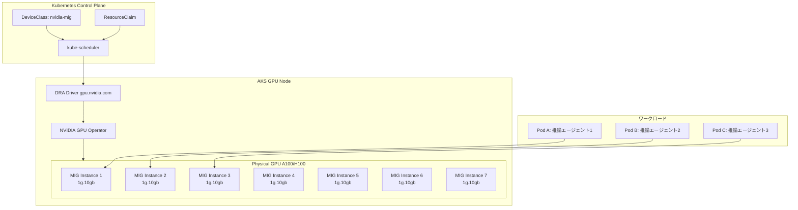

## ブログ概要（Summary）

本記事は [Multi-instance GPU (MIG) with Dynamic Resource Allocation (DRA) on AKS](https://blog.aks.azure.com/2026/03/03/multi-instance-gpu-with-dra-on-aks) の解説記事です。

Azure AKS Engineering Blogが2026年3月3日に公開したこの記事では、NVIDIA Multi-Instance GPU（MIG）とKubernetes Dynamic Resource Allocation（DRA）を組み合わせて、GPUリソースを効率的に共有する手法を解説している。従来のDevice Pluginでは1 GPUを1 Podに割り当てる方式しかなく、GPU利用率が低下する問題があった。MIG+DRAにより、A100やH100などの高性能GPUを複数の独立したインスタンスに分割し、DRAのResourceClaim APIで動的に割り当てることが可能になった。

この記事は [Zenn記事: AIエージェント時代のKubernetes進化とEKS・GKE・AKSクラウドネイティブ比較](https://zenn.dev/0h_n0/articles/65bb6e56bbe88b) の深掘りです。

## 情報源

- **種別**: 公式テックブログ（AKS Engineering Blog）
- **URL**: [https://blog.aks.azure.com/2026/03/03/multi-instance-gpu-with-dra-on-aks](https://blog.aks.azure.com/2026/03/03/multi-instance-gpu-with-dra-on-aks)
- **組織**: Microsoft Azure / AKS Engineering Team
- **発表日**: 2026年3月3日

## 技術的背景（Technical Background）

GPUベースのAIワークロードをKubernetes上で運用する際、GPU利用率の低さが大きな課題である。AKS Engineering Blogによれば、「individual workloads often consume only a portion of the available device」であり、1台のGPUを丸ごと1つのPodに割り当てる従来方式では、GPUの計算能力やメモリが十分に活用されない。

この課題に対し、NVIDIAのMIG（Multi-Instance GPU）技術は物理GPUを複数の独立したインスタンスに分割する。各インスタンスは専用のコンピュート・メモリ・キャッシュリソースを持ち、ハードウェアレベルで分離される。NVIDIAの仕様によれば、A100の場合は最大7つのMIGインスタンスに分割可能である。

従来のDevice Pluginベースのアプローチでは、MIGインスタンスは静的に設定され、ワークロードの変化に応じた動的な再構成が困難だった。Kubernetes DRA（Dynamic Resource Allocation）との統合により、MIGインスタンスの動的な割り当てとResourceClaimベースの宣言的管理が可能になった。

## 実装アーキテクチャ（Architecture）

### MIG+DRAの動作フロー



### NVIDIA GPU Operatorの設定

MIG+DRAを使用するには、まずNVIDIA GPU Operatorをインストールする。AKS Engineering Blogによれば、従来のDevice Pluginを無効化し、DRAドライバを有効にする設定が必要である。

```yaml
# GPU Operator Helm values
devicePlugin:
  enabled: false    # Device Pluginを無効化
mig:
  strategy: single  # 全GPUを同一プロファイルで分割
```

DRAドライバの設定:
```yaml
gpuResourcesEnabledOverride: true
nvidiaDriverRoot: "/run/nvidia/driver"
```

AKS Engineering Blogでは「disable the legacy Kubernetes device plugin to allow DRA-based management instead of static allocation」と述べている。Device PluginとDRAを同時に有効にすることはできないため、移行時には注意が必要である。

### DeviceClassの定義

DeviceClassはNVIDIA MIGデバイスを選択するためのフィルタを定義する。

```yaml
apiVersion: resource.k8s.io/v1
kind: DeviceClass
metadata:
  name: nvidia-mig
spec:
  selectors:
  - cel:
      expression: "device.driver == 'gpu.nvidia.com'"
```

CEL式`device.driver == 'gpu.nvidia.com'`により、NVIDIAのDRAドライバが管理するデバイスのみが選択される。

### ResourceClaimTemplateの定義

ワークロードがMIGインスタンスを要求するためのテンプレートを定義する。

```yaml
apiVersion: resource.k8s.io/v1
kind: ResourceClaimTemplate
metadata:
  name: mig-gpu-1g
spec:
  spec:
    devices:
      requests:
      - name: gpu
        exactly:
          deviceClassName: nvidia-mig
          count: 1
```

AKS Engineering Blogによれば、このResourceClaimTemplateの設計により「workloads declare needs without knowing partition assignments」が実現される。アプリケーション開発者はMIGプロファイルの詳細を知る必要がなく、必要なデバイス数を宣言するだけでよい。

### ワークロードからの参照

PodからResourceClaimTemplateを参照する方法は以下の通りである。

```yaml
apiVersion: batch/v1
kind: Job
metadata:
  name: ai-inference-job
spec:
  template:
    spec:
      containers:
      - name: inference
        image: my-inference:latest
        resources:
          claims:
          - name: gpu
      resourceClaims:
      - name: gpu
        resourceClaimTemplateName: mig-gpu-1g
      restartPolicy: Never
```

`resources.claims`でResourceClaimを参照し、`resourceClaims`でテンプレートを指定する。従来の`resources.limits.nvidia.com/gpu: 1`という指定方法からの大きな変化である。

### AKSノードプールの設定

MIG対応のGPUノードをAKSに追加する際のAzure CLI設定:

```bash
az aks nodepool add \
  --resource-group myResourceGroup \
  --cluster-name myAKSCluster \
  --name migpool \
  --node-count 2 \
  --gpu-driver none \
  --node-vm-size Standard_ND96amsr_A100_v4
```

AKS Engineering Blogによれば、`--gpu-driver none`フラグは「prevents conflicts with operator-managed drivers」のために指定する。GPU OperatorがドライバのインストールとMIG設定を管理するため、AKSの組み込みGPUドライバインストールを無効化する必要がある。

### MIG戦略の選択

NVIDIA GPU Operatorは2つのMIG戦略をサポートする。

| 戦略 | 説明 | 適用シナリオ |
|------|------|------------|
| **single** | 全GPUを同一プロファイルで分割 | 同種のワークロードを複数実行する場合 |
| **mixed** | GPU内で異なるプロファイルを混在 | 異なるサイズのワークロードを混在させる場合 |

single戦略の場合、例えばA100 80GBを7つの`1g.10gb`インスタンスに分割できる。mixed戦略では、1つの`3g.40gb`と2つの`1g.10gb`のように異なるサイズのインスタンスを混在させることが可能である。

## 対応GPU一覧

MIGはNVIDIAの以下のGPUでサポートされている（NVIDIAの公式MIG User Guide参照）。

| GPU | メモリ | 最大MIGインスタンス数 | 主要プロファイル |
|-----|-------|---------------------|----------------|
| **A100 40GB** | 40GB | 7 | 1g.5gb, 2g.10gb, 3g.20gb, 4g.20gb, 7g.40gb |
| **A100 80GB** | 80GB | 7 | 1g.10gb, 2g.20gb, 3g.40gb, 4g.40gb, 7g.80gb |
| **H100** | 80GB | 7 | 1g.10gb, 2g.20gb, 3g.40gb, 4g.40gb, 7g.80gb |
| **H200** | 141GB | 7 | 1g.20gb, 2g.40gb, 3g.70gb |

## 検証方法

AKS Engineering Blogでは、以下のコマンドでMIG+DRA環境の動作確認方法が紹介されている。

```bash
# MIG対応ノードの確認
kubectl describe node <node-name> | grep "mig"
# 期待される出力: nvidia.com/mig.capable=true, nvidia.com/mig.strategy=single

# DeviceClassの確認
kubectl get deviceclass
# 期待される出力: nvidia-mig

# ResourceClaimTemplateの確認
kubectl get resourceclaimtemplate

# ResourceSliceでデバイス情報を確認
kubectl get resourceslice -o yaml
```

## 実装のポイント

### MIGプロファイルの選定

MIGプロファイルの選定は、ワークロードのGPUメモリ要件に基づいて行う。

- **推論（小規模モデル）**: `1g.10gb`（A100 80GB時）。Bert、DistilBERTなど数GBのモデル
- **推論（中規模モデル）**: `3g.40gb`。7B〜13Bパラメータのモデル
- **推論（大規模モデル）**: `7g.80gb`（分割なし）。70B以上のモデル

GPUメモリ要件は`nvidia-smi`コマンドや推論フレームワーク（vLLM、TGI等）のベンチマーク結果から事前に計測することが推奨される。プロファイルを過小に設定するとOOM（Out of Memory）が発生し、過大に設定するとGPU利用率が低下する。

### Device Pluginからの移行注意点

Device PluginからDRAへの移行時には、以下の点に注意する。

1. **同時有効化不可**: Device PluginとDRAドライバは同時に使用できない。移行は全ノード一斉に行う必要がある
2. **YAML変更**: `resources.limits.nvidia.com/gpu`から`resourceClaims`への書き換えが必要
3. **Kubernetes 1.34以降必須**: AKSでDRAを使用するにはKubernetes 1.34以降のバージョンが必要

### パフォーマンス考慮事項

MIGによるGPU分割は、ハードウェアレベルの分離を提供するため、タイムシェアリング方式と比較してパフォーマンスの予測性が高い。各MIGインスタンスは専用のコンピュートユニット、L2キャッシュ、メモリ帯域幅を持つ。

ただし、分割数を増やすとインスタンスあたりのリソースは減少するため、ワークロードのスループットは比例的に低下する。最適な分割数は、ワークロードのGPU利用パターンを計測した上で決定する必要がある。

## Production Deployment Guide

### AWS実装パターン（コスト最適化重視）

MIG+DRAをAWS EKS上で実現するパターンを示す。

| 規模 | 月間リクエスト | 推奨構成 | 月額コスト | 主要サービス |
|------|--------------|---------|-----------|------------|
| **Small** | ~3,000 (100/日) | Lambda + Bedrock | $50-150 | Lambda + Bedrock API |
| **Medium** | ~30,000 (1,000/日) | EKS + MIG | $2,000-5,000 | EKS + p4d.24xlarge + MIG 7分割 |
| **Large** | 300,000+ (10,000/日) | EKS + MIG + DRA | $10,000-30,000 | EKS + p5.48xlarge + DRA + Karpenter |

**Medium構成の詳細**（月額$2,000-5,000）:
- **EKS**: コントロールプレーン ($72/月)
- **p4d.24xlarge Spot x 1-2台**: A100 80GB x 8台/ノード、各GPUを7分割（Spot利用で最大90%削減）
- **実効GPU数**: 8 GPU x 7 MIG = 56 MIGインスタンス/ノード
- **NVIDIA GPU Operator**: DRA Driver付き（追加コストなし）
- **CloudWatch**: ($50/月)

**コスト試算の注意事項**: 上記は2026年3月時点のAWS ap-northeast-1料金に基づく概算値です。MIG分割による実効コスト削減率はワークロード特性に依存します。最新料金は [AWS料金計算ツール](https://calculator.aws/) で確認してください。

### Terraformインフラコード

**Medium構成: EKS + MIG + DRA**

```hcl
module "eks" {
  source  = "terraform-aws-modules/eks/aws"
  version = "~> 20.0"

  cluster_name    = "mig-dra-cluster"
  cluster_version = "1.34"

  vpc_id     = module.vpc.vpc_id
  subnet_ids = module.vpc.private_subnets

  cluster_endpoint_public_access = true
  enable_cluster_creator_admin_permissions = true
}

resource "kubectl_manifest" "karpenter_mig_pool" {
  yaml_body = <<-YAML
    apiVersion: karpenter.sh/v1
    kind: NodePool
    metadata:
      name: gpu-mig-pool
    spec:
      template:
        spec:
          nodeClassRef:
            group: eks.amazonaws.com
            kind: NodeClass
            name: gpu-mig
          requirements:
            - key: node.kubernetes.io/instance-type
              operator: In
              values: ["p4d.24xlarge", "p5.48xlarge"]
            - key: karpenter.sh/capacity-type
              operator: In
              values: ["spot", "on-demand"]
      limits:
        nvidia.com/gpu: "32"
      disruption:
        consolidationPolicy: WhenEmptyOrUnderutilized
        consolidateAfter: 60s
  YAML
}

resource "aws_budgets_budget" "mig_monthly" {
  name         = "mig-inference-monthly"
  budget_type  = "COST"
  limit_amount = "5000"
  limit_unit   = "USD"
  time_unit    = "MONTHLY"

  notification {
    comparison_operator       = "GREATER_THAN"
    threshold                 = 80
    threshold_type            = "PERCENTAGE"
    notification_type         = "ACTUAL"
    subscriber_email_addresses = ["ops@example.com"]
  }
}
```

### 運用・監視設定

**MIGインスタンス利用率の監視**:
```sql
-- CloudWatch Logs Insights: MIGインスタンスごとの利用率
fields @timestamp, mig_instance, gpu_utilization, memory_used_mb
| stats avg(gpu_utilization) as avg_util, max(memory_used_mb) as max_mem by mig_instance
| filter avg_util < 20
```

**アラーム設定**:
```python
import boto3

cloudwatch = boto3.client('cloudwatch')

cloudwatch.put_metric_alarm(
    AlarmName='mig-underutilization',
    ComparisonOperator='LessThanThreshold',
    EvaluationPeriods=6,
    MetricName='GPUUtilization',
    Namespace='ContainerInsights',
    Period=600,
    Statistic='Average',
    Threshold=10.0,
    AlarmDescription='MIGインスタンス利用率10%未満（プロファイル再検討推奨）',
    AlarmActions=['arn:aws:sns:ap-northeast-1:123456789:gpu-alerts'],
)
```

### コスト最適化チェックリスト

**アーキテクチャ選択**:
- [ ] GPU不要 → Lambda + Bedrock (Serverless)
- [ ] 小規模推論 → EKS + g5 + MIG不要
- [ ] 中規模推論 → EKS + p4d + MIG 7分割 + DRA
- [ ] 大規模推論 → EKS + p5 + MIG + DRA + Karpenter

**リソース最適化**:
- [ ] MIG分割でGPU利用率向上（1台を最大7ワークロードで共有）
- [ ] Spot Instances優先（Karpenter自動管理、最大90%削減）
- [ ] DRA Prioritized Listで代替GPU自動選択
- [ ] Reserved Instances: ベースラインGPUノード用
- [ ] Karpenter ttlSecondsAfterEmpty: アイドル時スケールダウン

**監視・アラート**:
- [ ] MIGインスタンスごとの利用率モニタリング
- [ ] AWS Budgets: 月額予算設定
- [ ] OOMエラー監視（MIGプロファイルサイズ不足の検出）
- [ ] Cost Anomaly Detection

**リソース管理**:
- [ ] MIGプロファイルの定期レビュー（利用パターン変化への対応）
- [ ] 未使用NodePool削除
- [ ] ECRイメージライフサイクルポリシー
- [ ] 開発環境: 夜間スケールダウン

## 学術研究との関連（Academic Connection）

MIG+DRAの技術は、以下の研究領域と関連する。

- **GPU仮想化**: NVIDIAのMIGはハードウェアレベルの分離を提供するが、ソフトウェアレベルのGPU仮想化（vGPU、CUDA MPS）との比較研究が進んでいる
- **リソースパッキング最適化**: 複数のワークロードをMIGインスタンスに効率的に配置するビンパッキング問題としての定式化
- **QoS保証**: MIGの分離保証がマルチテナント環境でのSLA達成にどの程度寄与するかの実証研究

## まとめと実践への示唆

AKS Engineering Blogが紹介するMIG+DRAの組み合わせは、「right-sized GPU partitions to multiple workloads at the same time」を実現するアプローチである。従来のDevice Pluginでは不可能だった宣言的なGPU分割管理が、Kubernetes v1.34のDRA GAとNVIDIA GPU Operatorの組み合わせで可能になった。

実務においては、まずワークロードのGPUメモリ要件を計測し、適切なMIGプロファイルを選定することが重要である。プロファイルの過小設定はOOMを引き起こし、過大設定は利用率低下につながる。推論ワークロードのベンチマークを実施した上で、MIG戦略（single/mixed）を決定することが推奨される。

AKSでの設定手順はAzure CLIベースで比較的シンプルだが、`--gpu-driver none`フラグの設定やDevice Pluginの無効化など、移行時の注意点がある。本番導入前にステージング環境での検証を行うことが望ましい。

## 参考文献

- **AKS Blog**: [https://blog.aks.azure.com/2026/03/03/multi-instance-gpu-with-dra-on-aks](https://blog.aks.azure.com/2026/03/03/multi-instance-gpu-with-dra-on-aks)
- **AKS DRA Introduction**: [https://blog.aks.azure.com/2025/11/17/dra-devices-and-drivers-on-kubernetes](https://blog.aks.azure.com/2025/11/17/dra-devices-and-drivers-on-kubernetes)
- **NVIDIA MIG User Guide**: [https://docs.nvidia.com/datacenter/tesla/mig-user-guide/](https://docs.nvidia.com/datacenter/tesla/mig-user-guide/)
- **NVIDIA GPU Operator DRA**: [https://docs.nvidia.com/nim-operator/latest/dra.html](https://docs.nvidia.com/nim-operator/latest/dra.html)
- **Related Zenn article**: [https://zenn.dev/0h_n0/articles/65bb6e56bbe88b](https://zenn.dev/0h_n0/articles/65bb6e56bbe88b)
