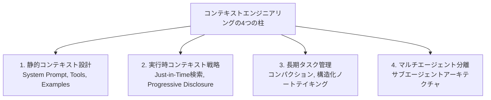
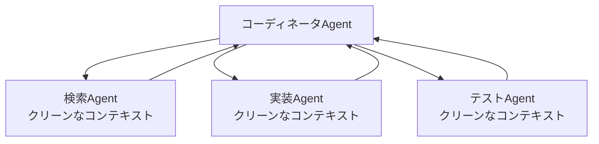

本記事は [Anthropic Engineering: Effective context engineering for AI agents](https://www.anthropic.com/engineering/effective-context-engineering-for-ai-agents) の解説記事です。

## ブログ概要（Summary）

Anthropicのエンジニアリングブログでは、LLMベースのAIエージェントにおけるコンテキストエンジニアリングの体系的なアプローチが提唱されている。従来のプロンプトエンジニアリングが「プロンプト単体の改善」に焦点を当てるのに対し、コンテキストエンジニアリングは「LLM推論時に最適なトークンセットを管理する」ことを目的とする。ブログでは、コンパクション（要約）、構造化ノートテイキング（永続メモリ）、Just-in-Time検索、サブエージェントアーキテクチャといった具体的な手法が紹介されている。

この記事は [Zenn記事: Claude CodeとCursor IDEの併用で自動コーディング精度を高める実践手法](https://zenn.dev/0h_n0/articles/d10139cd09e957) の深掘りです。

## 情報源

- **種別**: 企業テックブログ
- **URL**: [https://www.anthropic.com/engineering/effective-context-engineering-for-ai-agents](https://www.anthropic.com/engineering/effective-context-engineering-for-ai-agents)
- **組織**: Anthropic Engineering
- **発表日**: 2025年（具体的な月日は記事上に明記なし）

## 技術的背景（Technical Background）

### コンテキストエンジニアリング vs プロンプトエンジニアリング

ブログでは、この2つの概念を関連しつつも異なるものとして定義している：

- **プロンプトエンジニアリング**: LLMへの指示を書き、整理すること
- **コンテキストエンジニアリング**: LLM推論時の最適なトークンセットを管理すること（プロンプト以外の全情報を含む）

この区別が重要な理由は、実際のAIエージェント開発では、プロンプト本体よりもコンテキスト管理——何を含め、何を除外するか——が性能に大きく影響するためである。

### なぜコンテキスト管理が重要か

ブログでは、Transformerアーキテクチャの制約が根本的な理由として挙げられている。Self-Attentionメカニズムにおいて、すべてのトークンは他のすべてのトークンに対してアテンションを計算する。これにより、コンテキスト長 $n$ に対して $O(n^2)$ のペアワイズ関係が生じ、コンテキストが長くなるほど各トークンに割り当てられる「注意予算」が分散する。

ブログではこの現象を「Context Rot（コンテキストの腐食）」と呼んでおり、Needle-in-a-Haystackベンチマークで実証されているモデル性能の劣化と対応している。

## 実装アーキテクチャ（Architecture）

ブログで紹介されている手法を体系化すると、以下の4つの柱に整理できる。



### 柱1: 静的コンテキスト設計

ブログでは、静的コンテキスト（System Prompt, Tools, Examples）の設計について以下の原則が提唱されている：

**System Prompt**: 「適切な高度（altitude）でアイデアを提示する」べきとされている。具体的すぎて脆い（brittle）ロジックと、曖昧すぎて役に立たない汎用的な指示の中間を狙う。Zenn記事でCLAUDE.mdの50-100行という推奨が紹介されているが、これはこの原則の実践的な解釈である。

**Tools**: 「モデルにとってよく理解されており、機能的な重複が最小限」であるべきとされている。ツールセットが肥大化すると、エージェントの判断に曖昧性が生じ、性能が低下する。Spotifyが Honkのツールを3つに制限した設計思想（本シリーズの別記事で解説）と一致する知見である。

**Examples**: 網羅的なエッジケースリストではなく、「多様で正規的な（canonical）例」を厳選すること。ブログでは「例は千の言葉に値する絵」と表現されている。

### 柱2: 実行時コンテキスト戦略

**Just-in-Time Retrieval（必要時検索）**

事前にすべてのデータをロードするのではなく、軽量な識別子（ファイルパス、保存されたクエリ、Webリンク等）を保持し、ツールを通じて動的に情報をロードする手法である。

ブログではClaude Codeの実装が例として挙げられている。Claude Codeはターゲットクエリを書き、`head` や `tail` のようなコマンドを活用して、データオブジェクト全体をロードせずに必要な部分のみを取得する。

Zenn記事で紹介されているClaude Codeの「コードベース全体を自動マッピングし」た上で必要なファイルを選択的に読み込む動作は、このJust-in-Time Retrievalの具体的な実装例である。

**Progressive Disclosure（段階的開示）**

エージェントが探索を通じて段階的にコンテキストを発見する手法。ファイルサイズから複雑さを推測し、命名規則から目的を推測し、タイムスタンプから関連性を判断する。

### 柱3: 長期タスク管理

**コンパクション（Compaction）**

コンテキストウィンドウの上限に近づいた際に、会話履歴を要約して新しいコンテキストウィンドウで再開する手法である。ブログでは以下の2段階アプローチが推奨されている：

1. **再現率（recall）の最大化**: まずはアーキテクチャ決定や重要な詳細を漏れなく保持する
2. **精度（precision）の改善**: 冗長な出力や不要な中間結果を削除する

Claude Codeでは、コンテキストウィンドウの上限に近づくと自動的にコンパクションが実行される。Zenn記事でも「システムが自動的に以前のメッセージを圧縮する」仕組みとして言及されている。

**構造化ノートテイキング（Structured Note-Taking）**

エージェントがコンテキストウィンドウの外に永続的なメモを書き出し、後で必要な時にコンテキストに読み込む手法である。ブログではClaude Codeのtodo listや、カスタムエージェントのNOTES.mdファイルが例として挙げられている。

Zenn記事で紹介されているCLAUDE.mdの自動メモリ機能（`~/.claude/projects/*/memory/MEMORY.md`）も、この構造化ノートテイキングの実装例である。

ブログでは、この手法の効果をポケモンゲームの例で示している。エージェントが数千ステップにわたるゲームプレイ中に戦略的メモを維持することで、長期的な意思決定の一貫性を保てるという事例である。

### 柱4: マルチエージェント分離

**サブエージェントアーキテクチャ**

専門化されたサブエージェントが焦点を絞ったタスクをクリーンなコンテキストウィンドウで処理し、コーディネータが結果を統合する手法である。



この設計はZenn記事で紹介されているClaude Codeの「Agent Teams」機能と直接対応する。Agent Teamsではメインエージェント、バックエンドAgent、フロントエンドAgent、テストAgentが並列に動作し、メールボックスシステムを通じて協調する。

## パフォーマンス最適化（Performance）

### コンテキスト効率の原則

ブログでは、コンテキストエンジニアリングの目標を「望ましい結果の確率を最大化する、最小の高シグナルトークンセットを見つけること」と定義している。

$$
\text{Goal} = \arg\min_{C \subseteq \text{All Tokens}} |C| \quad \text{s.t.} \quad P(\text{desired outcome} \mid C) \geq \theta
$$

ここで、
- $C$: 選択されたコンテキストトークンの集合
- $\theta$: 目標確率の閾値

実践的には、事前に一部のデータを取得しておく（速度のため）と、必要に応じて自律的に探索する（網羅性のため）のハイブリッド戦略が推奨されている。

### ハイブリッド戦略の実装例

```python
class ContextManager:
    """コンテキスト管理の実装例

    Anthropicのブログで提唱されている
    ハイブリッド戦略をコードで表現したもの
    """

    def __init__(self, max_tokens: int = 100_000):
        self.max_tokens = max_tokens
        self.static_context: list[str] = []  # 事前ロード
        self.dynamic_refs: dict[str, str] = {}  # 軽量参照

    def add_static(self, content: str) -> None:
        """事前ロードするコンテキスト（System Prompt等）"""
        self.static_context.append(content)

    def add_reference(self, key: str, path: str) -> None:
        """Just-in-Time取得用の軽量参照"""
        self.dynamic_refs[key] = path

    def retrieve_on_demand(self, key: str) -> str:
        """必要時に動的にコンテキストを取得

        Args:
            key: 参照キー

        Returns:
            取得したコンテキスト
        """
        path = self.dynamic_refs[key]
        content = read_file(path)
        return content

    def compact(self, conversation: list[dict]) -> list[dict]:
        """コンテキストが上限に近づいた際の圧縮

        1. アーキテクチャ決定を保持（recall最大化）
        2. 冗長な出力を削除（precision改善）
        """
        summary = summarize_conversation(conversation)
        return [{"role": "system", "content": summary}]
```

## 運用での学び（Production Lessons）

### 「最もシンプルなことを試せ」

ブログの結論として、「モデルの能力が向上するにつれて、"うまくいく最もシンプルなこと（the simplest thing that works）"が堅実なアドバイスであり続ける」と述べられている。

これは過度に複雑なコンテキスト管理メカニズムを構築する前に、シンプルなCLAUDE.mdファイルの最適化から始めるべきだという実践的な指針と解釈できる。

### Context Rotの実体験

ブログで言及されている「コンテキストの腐食」は、実際のClaude Code利用でも体験される。長時間のセッションでAIとの対話を重ねると、初期に指示したCLAUDE.mdの規約が徐々に無視されるようになる現象がこれに該当する。Zenn記事で「Granular Commits + 定期的にセッションをリセット」が推奨されているのは、このContext Rotへの対処策である。

## 学術研究との関連（Academic Connection）

### "Lost in the Middle"との関連

ブログで言及されているContext Rotは、Liu et al. (TACL 2024)の「Lost in the Middle」研究と対応する。長いコンテキストの中間部分の情報が無視される傾向は、Self-Attentionの注意予算の分散として理論的に説明できる。

### コンテキストファイルの実証評価

arXiv 2602.11988（本シリーズの別記事で解説）では、AGENTS.mdの効果が最大+4.21%と控えめであることが報告されている。ブログの「最もシンプルなことを試せ」原則と、論文の「短く焦点を絞ったファイルが効果的」という知見は整合している。

### Codified Contextとの補完関係

arXiv 2602.20478（本シリーズの別記事で解説）の知識グラフベースのアプローチは、ブログのJust-in-Time Retrievalをより高度に実装したものと位置づけられる。ブログが原則を示し、論文が具体的なアーキテクチャを提供するという補完関係にある。

## まとめと実践への示唆

Anthropicのコンテキストエンジニアリングブログは、AIエージェント開発における以下の実践的な指針を提供している：

1. **コンテキストは有限資源**: トークンは貴重であり、「最小の高シグナルトークンセット」を追求する
2. **静的 + 動的のハイブリッド**: System Promptで基本設定を提供しつつ、Just-in-Timeで詳細を動的取得
3. **コンパクションと永続メモリ**: 長期タスクではconversation summaryと構造化メモの組み合わせが有効
4. **ツールは少なく高品質に**: 機能的重複の少ない、モデルにとって理解しやすいツールセットを設計
5. **シンプルから始める**: モデルの進化に伴い、複雑なメカニズムよりもシンプルなアプローチが有効になる場合がある

## 参考文献

- **Blog URL**: [https://www.anthropic.com/engineering/effective-context-engineering-for-ai-agents](https://www.anthropic.com/engineering/effective-context-engineering-for-ai-agents)
- **Claude Code Best Practices**: [https://www.anthropic.com/engineering/claude-code-best-practices](https://www.anthropic.com/engineering/claude-code-best-practices)
- **Related Zenn article**: [https://zenn.dev/0h_n0/articles/d10139cd09e957](https://zenn.dev/0h_n0/articles/d10139cd09e957)

---

:::message
本記事は [Anthropic Engineering Blog](https://www.anthropic.com/engineering/effective-context-engineering-for-ai-agents) の解説記事であり、著者自身が実験を行ったものではありません。内容はすべてAnthropicのブログからの引用・解釈です。
:::
