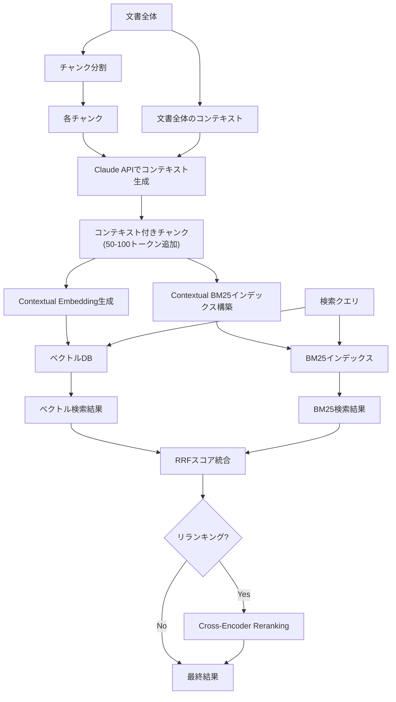

本記事は [Anthropic: Contextual Retrieval](https://www.anthropic.com/news/contextual-retrieval) の解説記事です。

## ブログ概要（Summary）

AnthropicのContextual Retrieval（2024年9月公開）は、RAGシステムにおけるチャンク分割時の情報損失を解決する手法である。従来のRAGでは、文書をチャンクに分割する際にチャンク単体では文脈がわからなくなる問題があった。Contextual Retrievalは、各チャンクにClaudeを使って文脈情報を前置（prepend）してからBM25インデックスおよびベクトルインデックスを構築する。Anthropicの実験では、Contextual Embeddings + Contextual BM25の組み合わせにより、検索失敗率を49%削減し、さらにリランキングを追加することで67%の削減を達成したと報告されている。

この記事は [Zenn記事: BM25×ベクトル検索のハイブリッド実装ガイド](https://zenn.dev/0h_n0/articles/46d801df9b61de) の深掘りです。

## 情報源

- **種別**: 企業テックブログ
- **URL**: [https://www.anthropic.com/news/contextual-retrieval](https://www.anthropic.com/news/contextual-retrieval)
- **組織**: Anthropic
- **発表日**: 2024年9月19日

## 技術的背景（Technical Background）

RAGの一般的なパイプラインでは、文書を数百トークン程度のチャンクに分割し、各チャンクの埋め込みベクトルを生成してベクトルDBに格納する。検索時にはクエリの埋め込みと近傍探索を行い、関連チャンクをLLMのコンテキストに注入する。

この方式の根本的な課題は**チャンクの文脈喪失**である。例えば、あるチャンクに「同社の売上は前年比20%増加した」と記載されていても、チャンク単体では「同社」がどの企業を指すのか、「前年」がいつなのかがわからない。この情報損失はBM25検索でもベクトル検索でも同様に発生する。

Zenn記事で解説されているハイブリッド検索（BM25 + ベクトル検索 + RRF）はスコア統合の改善であり、チャンクの内容自体は改善しない。Contextual Retrievalはチャンクの表現を改善するアプローチであり、ハイブリッド検索と組み合わせることで相乗効果が得られる。

## 実装アーキテクチャ（Architecture）

### Contextual Retrievalの全体像



### コンテキスト生成のプロセス

各チャンクに対して、以下のようなプロンプトでClaudeを呼び出す。

```
<document>
{文書全体のテキスト}
</document>

以下のチャンクは上記の文書の一部です。
このチャンクを検索で見つけやすくするための、簡潔なコンテキスト（50-100トークン）を生成してください。

<chunk>
{チャンクのテキスト}
</chunk>
```

生成されたコンテキストをチャンクの先頭に付与する。

**例**:
- **元のチャンク**: 「同社の売上は前年比20%増加した」
- **生成コンテキスト**: 「[Apple Inc.の2024年Q3決算報告書より] 」
- **コンテキスト付きチャンク**: 「[Apple Inc.の2024年Q3決算報告書より] 同社の売上は前年比20%増加した」

### Contextual BM25の仕組み

コンテキストを付与することで、BM25検索時に以下の効果がある。

1. **エンティティの明示化**: 「Apple」「2024年」「Q3」等の検索キーワードがチャンクに含まれるようになる
2. **語彙の拡張**: 文脈に関連する用語が追加され、BM25のTF-IDFスコアが適切に計算される
3. **曖昧性の解消**: 「同社」→「Apple Inc.」のように、代名詞や省略が具体的な用語に置き換わる

これはZenn記事で説明されているBM25の弱点（意味的類似性に弱い）を部分的に補強する効果がある。

### Contextual Embeddingsの仕組み

ベクトル検索においても、コンテキスト付与により埋め込みベクトルの品質が向上する。

- コンテキストなし: 「売上が20%増加した」→ 一般的な売上成長のベクトル
- コンテキストあり: 「[Apple Q3決算] 売上が20%増加した」→ Apple社の決算に特化したベクトル

これにより、「Appleの最近の売上」というクエリに対する検索精度が向上する。

## 実装コード例

```python
"""Contextual Retrievalの実装例."""
import anthropic


def generate_context(
    client: anthropic.Anthropic,
    document: str,
    chunk: str,
    model: str = "claude-3-5-haiku-20241022",
) -> str:
    """チャンクにコンテキストを生成.

    Args:
        client: Anthropic APIクライアント
        document: 文書全体のテキスト
        chunk: 対象チャンクのテキスト
        model: 使用するClaudeモデル

    Returns:
        生成されたコンテキスト文字列
    """
    prompt = f"""<document>
{document[:20000]}
</document>

以下のチャンクは上記の文書の一部です。
このチャンクを検索で見つけやすくするための、簡潔なコンテキスト
（50-100トークン）を生成してください。コンテキストのみを出力してください。

<chunk>
{chunk}
</chunk>"""

    response = client.messages.create(
        model=model,
        max_tokens=200,
        messages=[{"role": "user", "content": prompt}],
    )
    return response.content[0].text


def contextualize_chunks(
    client: anthropic.Anthropic,
    document: str,
    chunks: list[str],
) -> list[str]:
    """全チャンクにコンテキストを付与.

    Args:
        client: Anthropic APIクライアント
        document: 文書全体
        chunks: チャンクのリスト

    Returns:
        コンテキスト付きチャンクのリスト
    """
    contextualized = []
    for chunk in chunks:
        context = generate_context(client, document, chunk)
        contextualized.append(f"{context}\n\n{chunk}")
    return contextualized
```

## パフォーマンス最適化（Performance）

Anthropicの実験で報告されている数値は以下の通りである（ブログ記事の図表より）。

**検索失敗率（1 - Recall@20）の比較**:

| 手法 | 失敗率 | ベースラインからの削減率 |
|------|--------|----------------------|
| 通常のEmbedding（ベースライン） | 5.7% | - |
| Contextual Embeddings | 3.7% | 35%削減 |
| Contextual Embeddings + Contextual BM25 | 2.9% | 49%削減 |
| 上記 + Reranking | 1.9% | 67%削減 |

**コスト**: Prompt Cachingを使用した場合、コンテキスト生成のコストは100万ドキュメントトークンあたり約$1.02と報告されている。これは一度きりの前処理コストであり、インデックス構築時に発生する。

**レイテンシへの影響**: コンテキスト生成はインデックス構築時（オフライン）に行うため、検索時のレイテンシには影響しない。チャンクサイズが50-100トークン増加するため、ベクトルDBのストレージは若干増加する。

**チャンク数とTop-kの関係**: 著者らの実験ではTop-20チャンクがTop-10やTop-5より効果的であったと報告されている。これはRAGにおいてリコール重視の検索が精度に直結することを示唆している。

## 運用での学び（Production Lessons）

Anthropicのブログから読み取れる運用上の知見を整理する。

**コンテキスト生成のモデル選択**: Anthropicは高速・低コストのHaikuモデルの使用を推奨している。コンテキスト生成は比較的単純なタスク（文書から関連する文脈を抽出するだけ）であるため、大規模モデルは不要である。

**チャンク境界の影響**: ブログではチャンクの境界、サイズ、オーバーラップが検索精度に大きく影響すると述べられている。コンテキスト生成はチャンク境界の問題を緩和するが、完全には解決しない。

**埋め込みモデルの選択**: 実験ではVoyageとGeminiの埋め込みモデルが最も良い結果を示したと報告されている。モデル選択はContextual Retrievalの効果に影響するため、自分のデータセットでの比較評価が推奨される。

**BM25の重要性**: Contextual BM25を追加することでContextual Embeddingsのみの場合から追加で14ポイントの削減が得られたという結果は、ベクトル検索のみに依存するRAGシステムにBM25を追加する価値を改めて示している。これはZenn記事の「なぜハイブリッドが必要か」セクションの主張と一致する。

## 学術研究との関連（Academic Connection）

Contextual Retrievalは以下の学術研究と関連が深い。

- **Dense Passage Retrieval（DPR, Karpukhin et al., 2020）**: DPRで報告されたBM25 + Dense検索のハイブリッド化による精度向上をベースに、チャンクの前処理で精度を底上げするアプローチ
- **Query Expansion（古典的IR手法）**: クエリ側を拡張するQuery Expansionに対し、Contextual Retrievalはドキュメント側を拡張する「Document Expansion」として位置づけられる
- **DocT5Query（Nogueira et al., 2019）**: T5を使ったドキュメント拡張手法。Contextual Retrievalは文脈の追加であり、関連クエリの生成であるDocT5Queryとは異なるが、ドキュメント側の表現を改善するという点で共通する

## まとめと実践への示唆

Contextual Retrievalは、チャンクにコンテキストを付与するという比較的シンプルな手法でハイブリッド検索の精度を向上させる。Anthropicの報告によれば、Contextual Embeddings + Contextual BM25で49%、Reranking追加で67%の検索失敗率削減が達成されている。

実践では、Zenn記事で紹介されているハイブリッド検索（BM25 + ベクトル検索 + RRF）の**前処理ステップ**としてContextual Retrievalを組み込むことで、検索基盤を変更せずに精度向上が期待できる。コンテキスト生成は一度きりの前処理であり、Claude 3.5 Haiku + Prompt Cachingで100万トークンあたり約$1.02と低コストである。

## 参考文献

- **Blog URL**: [https://www.anthropic.com/news/contextual-retrieval](https://www.anthropic.com/news/contextual-retrieval)
- **Related Papers**: DPR (Karpukhin et al., 2020), DocT5Query (Nogueira et al., 2019)
- **Related Zenn article**: [https://zenn.dev/0h_n0/articles/46d801df9b61de](https://zenn.dev/0h_n0/articles/46d801df9b61de)
