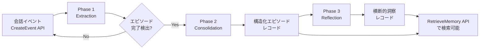
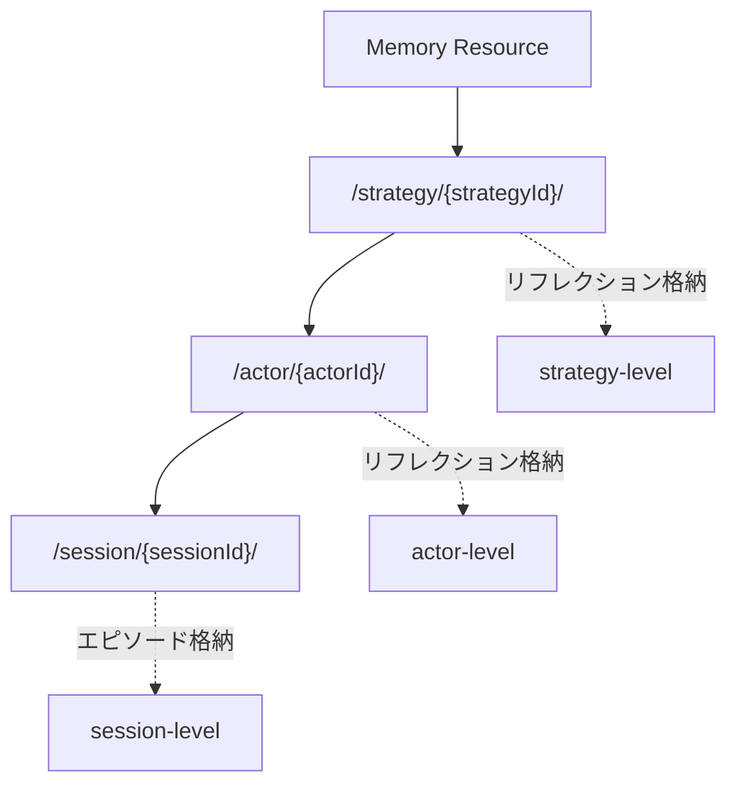

本記事は [Build agents to learn from experiences using Amazon Bedrock AgentCore episodic memory](https://aws.amazon.com/blogs/machine-learning/build-agents-to-learn-from-experiences-using-amazon-bedrock-agentcore-episodic-memory/) および [Episodic memory strategy - Amazon Bedrock AgentCore](https://docs.aws.amazon.com/bedrock-agentcore/latest/devguide/episodic-memory-strategy.html) の解説記事です。

## ブログ概要（Summary）

AWSは2025年12月のre:Inventで、Bedrock AgentCoreのエピソード記憶戦略を発表した。この機能は、AIエージェントが過去のインタラクションを構造化されたエピソードとして記録し、複数エピソードを横断したリフレクション（洞察）を自動生成することで、将来の類似タスクに対する応答品質を向上させるものである。公式ブログでは、Extraction（抽出）→ Consolidation（統合）→ Reflection（振り返り）の3フェーズアーキテクチャと、カスタマーサポートやコーディングアシスタントでの適用パターンが紹介されている。

この記事は [Zenn記事: Bedrock AgentCoreエピソード記憶で顧客サポートの応答一貫性を向上させる](https://zenn.dev/0h_n0/articles/43fd3b0e65a835) の深掘りです。

## 情報源

- **種別**: 企業テックブログ（AWS Machine Learning Blog）
- **URL**: [https://aws.amazon.com/blogs/machine-learning/build-agents-to-learn-from-experiences-using-amazon-bedrock-agentcore-episodic-memory/](https://aws.amazon.com/blogs/machine-learning/build-agents-to-learn-from-experiences-using-amazon-bedrock-agentcore-episodic-memory/)
- **組織**: Amazon Web Services
- **発表時期**: 2025年12月（re:Invent 2025）
- **補足ドキュメント**: [Episodic memory strategy](https://docs.aws.amazon.com/bedrock-agentcore/latest/devguide/episodic-memory-strategy.html)、[System prompts for episodic memory](https://docs.aws.amazon.com/bedrock-agentcore/latest/devguide/memory-episodic-prompt.html)

## 技術的背景（Technical Background）

### なぜエピソード記憶が必要か

LLMベースのエージェントは、コンテキストウィンドウの制約により、セッションを跨いだ長期的な経験の蓄積が困難である。AWSの公式ドキュメントでは、エピソード記憶が他のメモリ戦略（サマリー・セマンティック・ユーザー嗜好）とは異なるアプローチを取ると説明されている。

従来のメモリ戦略との主な違いは以下の通りである：

| 戦略 | 記録対象 | 生成タイミング | インデックスキー |
|------|----------|---------------|-----------------|
| サマリー | 会話の要約テキスト | 各イベント後に随時 | 会話ID |
| セマンティック | 事実・知識の断片 | 各イベント後に随時 | ファクト内容 |
| ユーザー嗜好 | ユーザーの好み | 各イベント後に随時 | 嗜好カテゴリ |
| **エピソード** | **構造化された経験記録** | **エピソード完了検出時のみ** | **intent（意図）** |

エピソード記憶の特徴は、**会話の「まとまり」を検出してからレコードを生成する**点にある。これにより、断片的な情報ではなく、状況・意図・結果・教訓を含む完結した経験として記録される。

### 認知科学との対応

AWSのエピソード記憶設計は、人間の認知科学におけるエピソード記憶（Tulving, 1972）の概念に基づいている。人間のエピソード記憶が「いつ・どこで・何が起きたか」を時空間的に符号化するのと同様に、AgentCoreのエピソード記憶は各インタラクションをSituation（状況）・Intent（意図）・Assessment（評価）・Justification（根拠）・Reflection（振り返り）の5要素で構造化する。

## 実装アーキテクチャ（Architecture）

### 3フェーズパイプラインの詳細

ブログおよび公式ドキュメントで紹介されているエピソード記憶のアーキテクチャは、以下の3フェーズで構成される。



#### Phase 1: Extraction（抽出）

Extractionフェーズでは、会話の各ターンを分析し、エピソードの完了を検出する。公式ドキュメントのシステムプロンプトによると、各ターンに対して以下のXMLスキーマで情報が抽出される：

```xml
<summary_turn>
  <turn_id>1</turn_id>
  <situation>ユーザーが注文状況の確認を要求</situation>
  <intent>注文追跡システムを呼び出して配送状況を取得</intent>
  <action>lookup_order(order_id='ABC-789')</action>
  <thought>注文番号が提供されたためlookup_orderツールを選択</thought>
  <assessment_assistant>Yes - 配送状況の取得に成功</assessment_assistant>
  <assessment_user>No - まだ会話が続く可能性がある</assessment_user>
</summary_turn>
```

公式ドキュメントでは、各フィールドは1〜2文に制限し、PIIを除外するよう指示されている。`assessment_user`が`Yes`になった時点でエピソード完了と判定される。

**実装上の注意点**: ドキュメントでは「`TOOL`ロールのメッセージをCreateEventに含めると最適な結果が得られる」と明記されている。TOOLメッセージを省略すると、`action`フィールドが空になり、Consolidation以降のフェーズの品質が低下する。

#### Phase 2: Consolidation（統合）

エピソード完了が検出されると、複数ターンのExtraction結果を1つの構造化レコードに統合する。出力スキーマは以下の通りである：

```xml
<summary>
  <situation>顧客が配送状況の確認と配送業者変更を要求</situation>
  <intent>注文追跡と配送設定の更新</intent>
  <assessment>Yes</assessment>
  <justification>
    注文ABC-789の配送状況を正常に取得し、
    配送業者の変更設定も完了した
  </justification>
  <reflection>
    配送関連の問い合わせでは、状況確認と設定変更を
    一度の対応で完結させることで顧客満足度が向上する。
    lookup_orderとupdate_shipping_preferenceの
    ツール組み合わせが効果的だった。
  </reflection>
</summary>
```

このフェーズでは、ブログの説明によると、エピソード全体を通じた「パターン分析」「ツール有効性の評価」「改善のための推奨事項」が生成される。

#### Phase 3: Reflection（振り返り）

Reflectionフェーズは、複数のエピソードを横断して分析し、再利用可能な洞察を生成するバックグラウンドプロセスである。出力スキーマは以下の通り：

```xml
<reflections>
  <reflection>
    <operator>add</operator>
    <title>配送トラブル対応のベストプラクティス</title>
    <use_cases>
      配送遅延、誤配送、破損などの配送関連の問い合わせ対応時。
      顧客が配送業者の変更を希望している場合。
    </use_cases>
    <hints>
      - lookup_orderで現状確認後、update_shipping_preferenceで
        設定変更を行う組み合わせが効果的
      - 配送トラブルが3回以上の顧客には優先配送を提案
      - 追跡番号と到着予定日の両方を必ず伝える
    </hints>
    <confidence>0.8</confidence>
  </reflection>
</reflections>
```

公式ドキュメントによると、Reflectionには以下の制約がある：

- `use_cases` + `hints`は100〜200語以内
- `confidence`は0.1〜1.0（0.1刻み）
- 過度に長いリフレクションは焦点を絞ったパターンに分割する
- `operator`は`add`（新規）または`update`（既存の更新、IDが必要）

### ネームスペース設計とストレージ階層

公式ドキュメントでは、エピソードとリフレクションの格納先として3つのパターンが示されている。



**設計上の重要なポイント**: リフレクションは常にエピソードより浅い階層に格納される。例えば、エピソードが`/strategy/{id}/actor/{actorId}/session/{sessionId}/`に格納される場合、リフレクションは`/strategy/{id}/actor/{actorId}/`に配置される。これは、リフレクションが**複数セッションを横断した洞察**であるため、セッション単位ではなくアクター単位で管理されるべきだからである。

**プライバシーに関する注意**: 公式ドキュメントでは、リフレクションがデフォルトで複数のアクター（顧客）を横断する可能性があると述べられている。顧客間のプライバシーを確保するには、リフレクションのネームスペースにも`{actorId}`を含めるか、ガードレールとの併用が推奨されている。

### インデックス設計

公式ドキュメントによると、メモリレコードのインデックスは以下のように設計されている：

- **エピソード**: `intent`フィールドでインデックス → ユーザーの「意図」に近い表現で検索すると精度が向上
- **リフレクション**: `use_case`フィールドでインデックス → タスクの「種類」や「問題カテゴリ」で検索すると精度が向上

この設計により、新しい問い合わせに対して「過去に同じ意図を持った顧客にどう対応したか」（エピソード検索）と「このタイプの問題に対するベストプラクティスは何か」（リフレクション検索）を分けて取得できる。

## パフォーマンス特性と運用上の考慮事項

### エピソード生成のタイミング

公式ドキュメントでは、エピソード記憶が他のメモリ戦略と比較して**レコード生成が遅い**ことが明記されている。これは、エピソード完了の検出を待つ必要があるためである。具体的には：

- **サマリー・セマンティック**: 各CreateEventの直後にレコード生成
- **エピソード**: エピソード完了検出後にConsolidationを実行（複数ターン待機）
- **リフレクション**: エピソード蓄積後にバックグラウンドで生成（さらに遅延）

このため、ブログでは「初回は60秒以上待機してからリフレクションを検索する」ことが推奨されている。

### 推奨ユースケース

公式ドキュメントでは、以下のユースケースが推奨されている：

1. **カスタマーサポート**: 過去の対応パターンから一貫した回答を生成
2. **コーディングアシスタント**: セッション履歴からコード修正パターンを学習
3. **生産性ツール**: ユーザーのワークフローパターンを学習
4. **トラブルシューティング**: 障害対応の成功パターンを蓄積
5. **診断フロー**: 診断手順の最適化パターンを抽出

### エピソード検出の制限事項

公式ドキュメントから読み取れるエピソード検出の制限事項は以下の通りである：

| ケース | 問題 | 対策 |
|--------|------|------|
| 顧客の突然離脱 | エピソード未完了のまま残る | セッションタイムアウト設定 |
| 1セッションで複数話題 | 話題切り替えで分割される | 各エピソードを独立して扱う |
| 長時間の会話 | エピソード検出が遅延 | 定期的なイベント送信 |
| リフレクション遅延 | バックグラウンド処理のため即時反映されない | 初回60秒以上待機 |

## Production Deployment Guide

### AWS実装パターン（コスト最適化重視）

AgentCore Memoryは完全マネージドサービスであるため、インフラ管理は不要だが、連携するコンピュートリソースとLLM推論のコストは設計次第で変動する。

| 規模 | 月間リクエスト | 推奨構成 | 月額コスト目安 | 主要サービス |
|------|--------------|---------|--------------|------------|
| **Small** | ~3,000 (100/日) | Serverless | $80-200 | Lambda + AgentCore Memory + Bedrock |
| **Medium** | ~30,000 (1,000/日) | Hybrid | $400-1,000 | Lambda + ECS Fargate + AgentCore Memory |
| **Large** | 300,000+ (10,000/日) | Container | $2,500-6,000 | EKS + Karpenter + AgentCore Memory |

**コスト試算の注意事項**: 上記は2026年3月時点のAWS ap-northeast-1（東京）リージョン料金に基づく概算値です。AgentCore Memoryの課金はCreateEventリクエスト単位、レコード/日の月平均、RetrieveMemoryリクエスト単位で構成されます。最新料金は [AWS料金計算ツール](https://calculator.aws/) および [AgentCore Pricing](https://aws.amazon.com/bedrock/agentcore/pricing/) で確認してください。

**Small構成の詳細** (月額$80-200):
- **Lambda**: 1GB RAM, 60秒タイムアウト ($25/月)
- **AgentCore Memory**: CreateEvent + RetrieveMemory ($30-80/月、トラフィック依存)
- **Bedrock**: Claude Haiku 4.5, Prompt Caching有効 ($25-95/月)

**コスト削減テクニック**:
- Bedrock Batch APIで非リアルタイム処理を50%割引
- Prompt Cachingでシステムプロンプトのトークンコストを30-90%削減
- AgentCoreのネームスペース設計で不要な検索スコープを絞り、RetrieveMemoryリクエスト数を削減

### Terraformインフラコード

**Small構成 (Serverless): Lambda + AgentCore Memory + Bedrock**

```hcl
# --- IAMロール（最小権限） ---
resource "aws_iam_role" "lambda_agentcore" {
  name = "lambda-agentcore-role"

  assume_role_policy = jsonencode({
    Version = "2012-10-17"
    Statement = [{
      Action = "sts:AssumeRole"
      Effect = "Allow"
      Principal = { Service = "lambda.amazonaws.com" }
    }]
  })
}

resource "aws_iam_role_policy" "agentcore_memory" {
  role = aws_iam_role.lambda_agentcore.id

  policy = jsonencode({
    Version = "2012-10-17"
    Statement = [
      {
        Effect = "Allow"
        Action = [
          "bedrock-agentcore:CreateEvent",
          "bedrock-agentcore:RetrieveMemoryRecords",
          "bedrock-agentcore:ListMemoryRecords",
          "bedrock-agentcore:DeleteMemoryRecord"
        ]
        Resource = "arn:aws:bedrock-agentcore:ap-northeast-1:*:memory/*"
      },
      {
        Effect = "Allow"
        Action = [
          "bedrock:InvokeModel",
          "bedrock:InvokeModelWithResponseStream"
        ]
        Resource = "arn:aws:bedrock:ap-northeast-1::foundation-model/anthropic.claude-*"
      }
    ]
  })
}

# --- Lambda関数 ---
resource "aws_lambda_function" "support_agent" {
  filename      = "lambda.zip"
  function_name = "episodic-memory-support-agent"
  role          = aws_iam_role.lambda_agentcore.arn
  handler       = "index.handler"
  runtime       = "python3.12"
  timeout       = 60
  memory_size   = 1024

  environment {
    variables = {
      AGENTCORE_MEMORY_ID = var.memory_id
      BEDROCK_MODEL_ID    = "anthropic.claude-haiku-4-5-20251001"
      AWS_REGION          = "ap-northeast-1"
    }
  }
}

# --- CloudWatch アラーム（コスト監視） ---
resource "aws_cloudwatch_metric_alarm" "lambda_cost" {
  alarm_name          = "agentcore-lambda-cost-spike"
  comparison_operator = "GreaterThanThreshold"
  evaluation_periods  = 1
  metric_name         = "Duration"
  namespace           = "AWS/Lambda"
  period              = 3600
  statistic           = "Sum"
  threshold           = 100000
  alarm_description   = "Lambda実行時間異常（AgentCore APIレイテンシ増加の可能性）"

  dimensions = {
    FunctionName = aws_lambda_function.support_agent.function_name
  }
}
```

**Large構成 (Container): EKS + Karpenter**

```hcl
module "eks" {
  source  = "terraform-aws-modules/eks/aws"
  version = "~> 20.0"

  cluster_name    = "agentcore-episodic-cluster"
  cluster_version = "1.31"

  vpc_id     = module.vpc.vpc_id
  subnet_ids = module.vpc.private_subnets

  cluster_endpoint_public_access = true
  enable_cluster_creator_admin_permissions = true
}

resource "kubectl_manifest" "karpenter_provisioner" {
  yaml_body = <<-YAML
    apiVersion: karpenter.sh/v1alpha5
    kind: Provisioner
    metadata:
      name: agentcore-provisioner
    spec:
      requirements:
        - key: karpenter.sh/capacity-type
          operator: In
          values: ["spot"]
        - key: node.kubernetes.io/instance-type
          operator: In
          values: ["m7i.xlarge", "m7i.2xlarge"]
      limits:
        resources:
          cpu: "64"
          memory: "256Gi"
      ttlSecondsAfterEmpty: 30
  YAML
}

resource "aws_budgets_budget" "agentcore_monthly" {
  name         = "agentcore-monthly-budget"
  budget_type  = "COST"
  limit_amount = "6000"
  limit_unit   = "USD"
  time_unit    = "MONTHLY"

  notification {
    comparison_operator        = "GREATER_THAN"
    threshold                  = 80
    threshold_type             = "PERCENTAGE"
    notification_type          = "ACTUAL"
    subscriber_email_addresses = ["ops@example.com"]
  }
}
```

### 運用・監視設定

**CloudWatch Logs Insights クエリ**:

```sql
-- AgentCore APIレイテンシ分析
fields @timestamp, api_call, duration_ms
| filter api_call in ["CreateEvent", "RetrieveMemoryRecords"]
| stats avg(duration_ms) as avg_latency,
        pct(duration_ms, 95) as p95,
        pct(duration_ms, 99) as p99
  by bin(5m), api_call

-- エピソード生成遅延の監視
fields @timestamp, episode_id, extraction_to_consolidation_ms
| filter extraction_to_consolidation_ms > 60000
| stats count() as delayed_episodes by bin(1h)
```

**CloudWatch アラーム設定**:

```python
import boto3

cloudwatch = boto3.client('cloudwatch')

cloudwatch.put_metric_alarm(
    AlarmName='agentcore-retrieve-latency',
    ComparisonOperator='GreaterThanThreshold',
    EvaluationPeriods=2,
    MetricName='RetrieveLatency',
    Namespace='Custom/AgentCore',
    Period=300,
    Statistic='Average',
    Threshold=5000,  # 5秒超過でアラート
    AlarmDescription='AgentCore RetrieveMemory レイテンシ異常'
)
```

### コスト最適化チェックリスト

**アーキテクチャ選択**:
- [ ] ~100 req/日 → Lambda + AgentCore Memory (Serverless) - $80-200/月
- [ ] ~1000 req/日 → ECS Fargate + AgentCore Memory (Hybrid) - $400-1,000/月
- [ ] 10000+ req/日 → EKS + AgentCore Memory (Container) - $2,500-6,000/月

**AgentCore Memory最適化**:
- [ ] ネームスペース設計: 検索スコープを最小化（不要な階層を検索しない）
- [ ] TTL設定: 古いエピソードを自動削除（リフレクションは保持）
- [ ] RetrieveMemoryのtop_k: 必要最小限に設定（エピソード5件、リフレクション3件を推奨）

**LLMコスト削減**:
- [ ] Bedrock Batch API: 非リアルタイム処理は50%割引
- [ ] Prompt Caching: システムプロンプトの固定部分をキャッシュ
- [ ] モデル選択: 分類タスクはHaiku 4.5、複雑な推論はSonnet 4.6

**監視・アラート**:
- [ ] AWS Budgets: 月額予算設定（80%で警告、100%でアラート）
- [ ] CloudWatch: RetrieveMemoryレイテンシ監視
- [ ] Cost Anomaly Detection: 自動異常検知有効化
- [ ] 日次コストレポート: SNS/Slackへ自動送信

**リソース管理**:
- [ ] エピソードクリーンアップ: 90日以上のエピソードを定期削除
- [ ] リフレクション保持: リフレクションは蓄積価値が高いため長期保持
- [ ] タグ戦略: 環境別（dev/staging/prod）でコスト可視化
- [ ] 開発環境: AgentCore Memoryの検索回数を制限

## 学術研究との関連（Academic Connection）

AgentCoreのエピソード記憶アーキテクチャは、以下の学術研究との関連が認められる：

- **Generative Agents（Park et al., 2023）**: メモリストリームからリフレクションを生成する三層アーキテクチャの原典。AgentCoreのExtraction→Consolidation→Reflectionパイプラインは、この研究のメモリ記録→リフレクション生成→計画のアーキテクチャと設計思想を共有している
- **Reflexion（Shinn et al., 2023）**: 言語フィードバックによるエージェントの自己改善。AgentCoreのリフレクション生成は、この研究の「言語的な振り返りによる学習」の概念を実装レベルに落とし込んだものと位置付けられる
- **ExpeL（Zhao et al., 2023）**: 経験からの学習（Experiential Learning）。成功・失敗エピソードから再利用可能な知見を抽出する手法は、AgentCoreのリフレクション生成と同様のアプローチを取っている

## まとめと実践への示唆

AWSのBedrock AgentCoreエピソード記憶は、学術研究で提案されたエピソード記憶+リフレクションのアーキテクチャを、フルマネージドサービスとして本番環境に適用可能にしたものである。Extraction→Consolidation→Reflectionの3フェーズパイプラインにより、エージェントは過去の経験を構造化し、横断的な洞察を自動生成できる。

実装上は、TOOLロールのメッセージをCreateEventに含めること、ネームスペース設計でプライバシーを確保すること、リフレクションの生成遅延を考慮したアーキテクチャ設計が重要となる。

## 参考文献

- **AWS Blog**: [Build agents to learn from experiences using Amazon Bedrock AgentCore episodic memory](https://aws.amazon.com/blogs/machine-learning/build-agents-to-learn-from-experiences-using-amazon-bedrock-agentcore-episodic-memory/)
- **AWS Docs**: [Episodic memory strategy](https://docs.aws.amazon.com/bedrock-agentcore/latest/devguide/episodic-memory-strategy.html)
- **AWS Docs**: [System prompts for episodic memory](https://docs.aws.amazon.com/bedrock-agentcore/latest/devguide/memory-episodic-prompt.html)
- **AWS Pricing**: [Amazon Bedrock AgentCore Pricing](https://aws.amazon.com/bedrock/agentcore/pricing/)
- **Related Zenn article**: [https://zenn.dev/0h_n0/articles/43fd3b0e65a835](https://zenn.dev/0h_n0/articles/43fd3b0e65a835)
