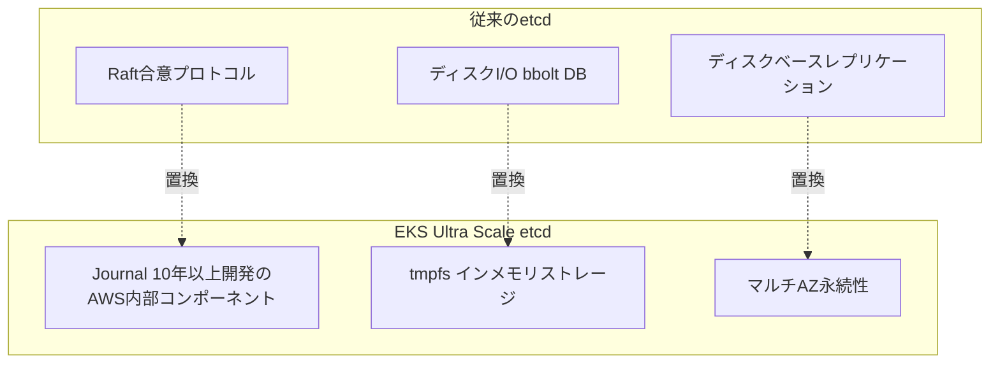

## ブログ概要（Summary）

本記事は [Amazon EKS enables ultra scale AI/ML workloads with support for 100K nodes per cluster](https://aws.amazon.com/blogs/containers/amazon-eks-enables-ultra-scale-ai-ml-workloads-with-support-for-100k-nodes-per-cluster/) の解説記事です。

Amazon EKSが2025年7月に発表した1クラスタあたり最大100,000ノードのサポートは、従来のEKSの限界を10倍に拡張する改革である。単一クラスタで最大160万のAWS Trainiumチップまたは80万のNVIDIA GPUをサポートし、Anthropic（Claude）やAmazon（Nova）がこの超大規模クラスタを採用していると報告されている。本記事では、この実現を可能にしたetcdの根本的な再設計、Karpenterの高速スケーリング、ネットワーク最適化について解説する。

この記事は [Zenn記事: AIエージェント時代のKubernetes進化とEKS・GKE・AKSクラウドネイティブ比較](https://zenn.dev/0h_n0/articles/65bb6e56bbe88b) の深掘りです。

## 情報源

- **種別**: 公式テックブログ（AWS Containers Blog）
- **URL**: [https://aws.amazon.com/blogs/containers/amazon-eks-enables-ultra-scale-ai-ml-workloads-with-support-for-100k-nodes-per-cluster/](https://aws.amazon.com/blogs/containers/amazon-eks-enables-ultra-scale-ai-ml-workloads-with-support-for-100k-nodes-per-cluster/)
- **組織**: Amazon Web Services
- **発表日**: 2025年7月（AWS公式What's New）
- **詳細分析**: InfoQ 2025年9月記事

## 技術的背景（Technical Background）

Kubernetesのコントロールプレーンは、etcdを中核とする分散合意システムに基づいている。従来のetcdはRaftプロトコルによる合意形成を行い、ディスクI/Oに依存したデータ永続化を行っていた。この設計は数千ノード規模では十分だが、10万ノード規模ではボトルネックとなる。

AWS公式ブログによれば、EKSの超大規模クラスタでは10万ノード、90万Pod、合計1,000万以上のKubernetesオブジェクトが存在し、etcdデータベースサイズはパーティション全体で32GBに達する。従来のetcdアーキテクチャではこのスケールに対応できなかった。

## 実装アーキテクチャ（Architecture）

### etcdの根本的再設計

EKS 100Kノード対応の最も重要な技術革新は、etcdの内部アーキテクチャの全面的な刷新である。



**1. Raft合意バックエンドからJournalへの移行**

InfoQの報告によれば、AWSはetcdの合意バックエンドをRaftベースの実装から「journal」と呼ばれるAWS内部コンポーネントに置き換えた。journalはAWSが10年以上にわたって構築してきたシステムで、超高速かつ順序保証されたデータレプリケーションをマルチAZ（Availability Zone）耐久性とともに提供する。

この変更により、以下の改善が報告されている。
- 読み書きスループットの桁違いの向上
- 予測可能なレイテンシ
- メンテナンス操作の高速化

**2. インメモリストレージへの移行（tmpfs）**

etcdのバックエンドデータベースをディスクからtmpfs（メモリベースのファイルシステム）に完全移行した。ディスクI/Oのボトルネックが解消され、読み取り・書き込みのレイテンシが大幅に低減した。

InfoQの報告では、etcdデータベースの最大サイズは従来の倍の20GBに拡張されている。

**3. APIサーバーの最適化**

Kubernetes v1.31で導入されたstrongly consistent reads from cache機能を活用し、以下の改善を実現している。

- サーバーサイドCPU使用量が30%削減（InfoQ報告）
- Listリクエストの処理速度が3倍に高速化
- リクエストタイムアウト、リトライ戦略、ワーク並列度、スロットリングパラメータの網羅的なチューニング

### パフォーマンスベンチマーク

AWS公式ブログおよびInfoQの報告に基づくベンチマーク結果を以下に示す。

| メトリクス | 値 | 備考 |
|-----------|-----|------|
| **最大ノード数/クラスタ** | 100,000 | 従来比10倍 |
| **最大Pod数** | 900,000+ | 100Kノード運用時 |
| **Kubernetesオブジェクト総数** | 10,000,000+ | ノード+Pod+Service等 |
| **スケジューラスループット** | 500 Pods/秒 | 100Kノードスケールでの値 |
| **Karpenterスケーリング速度** | 2,000ノード/分 | 100K EC2インスタンスを50分で起動 |
| **最大Trainiumチップ** | 1,600,000 | 単一クラスタ |
| **最大NVIDIA GPU** | 800,000 | 単一クラスタ |
| **etcd最大DBサイズ** | 20GB | 従来比2倍、パーティション全体で32GB |
| **ドリフト操作時間** | 約4時間 | クラスタ全体 |

### Karpenterによる高速スケーリング

Karpenterは100,000のEC2インスタンスを50分で起動し、毎分2,000のノードがReady状態でクラスタに参加する性能を実現した。

```yaml
apiVersion: karpenter.sh/v1
kind: NodePool
metadata:
  name: ultra-scale-ai
spec:
  template:
    spec:
      nodeClassRef:
        group: eks.amazonaws.com
        kind: NodeClass
        name: ai-workload
      requirements:
        - key: node.kubernetes.io/instance-type
          operator: In
          values: ["p5.48xlarge", "trn1.32xlarge", "inf2.48xlarge"]
        - key: karpenter.sh/capacity-type
          operator: In
          values: ["on-demand", "spot"]
  limits:
    nvidia.com/gpu: "10000"
    aws.amazon.com/neuron: "50000"
  disruption:
    consolidationPolicy: WhenEmptyOrUnderutilized
    consolidateAfter: 30s
```

### ネットワーク最適化

**Amazon VPC CNI Prefix Mode**: ノード起動レートが3倍に向上。Prefix Modeでは、各ENIに個別のIPアドレスではなくIPv4プレフィックス（/28）を割り当てることで、ENIの消費を削減しIPアドレスの割り当てを高速化する。

**追加ネットワークカードでのPod ENI**: 100 Gb/s以上の帯域幅を実現し、パケットレート性能が向上。大規模分散学習やマルチエージェント間の通信ボトルネックを解消する。

**Seekable OCI**: 5GBを超える大規模AI/MLコンテナイメージのダウンロード・展開時間を最大2倍短縮。イメージ全体をダウンロードする前にコンテナの起動を開始できる遅延読み込み技術である。

## テストシナリオ

AWS公式ブログによれば、以下の実環境シミュレーションが実施された。

1. **大規模事前学習**: 100Kノード全体を使用した大規模事前学習ジョブ
2. **並列ファインチューニング**: 10個の並列ファインチューニングジョブ、各10Kノード使用
3. **混合ワークロード**: ファインチューニングと推論タスクの混合実行

いずれのシナリオでも、APIレイテンシはKubernetesのSLO（Service Level Objective）範囲内に維持されたと報告されている。

## 実装のポイント

### 100Kノードクラスタの設計指針

100Kノードクラスタを活用するための設計上の考慮事項を整理する。

**適用すべきワークロード**:
- フロンティアモデルの事前学習（数千GPU以上を必要とするジョブ）
- 大規模並列推論（数百〜数千のモデルレプリカを同時実行）
- マルチテナントAIプラットフォーム（複数チームが1つのクラスタを共有）

**適用すべきでないワークロード**:
- 小規模な推論サービス（数台〜数十台のノードで十分）
- 開発・テスト環境（コスト効率が低い）

### コスト考慮事項

100Kノードクラスタは大規模な運用コストを伴う。AWS公式ブログでは具体的なコスト数値は公開されていないが、以下の要素を考慮する必要がある。

- **EKSコントロールプレーン**: 100Kノード対応のUltra Scaleティアの料金
- **コンピュートコスト**: p5.48xlarge（8x H100 GPU）は東京リージョンで約$98/時間（オンデマンド、2026年3月時点の参考値）
- **ネットワークコスト**: ノード間のデータ転送量

Spot Instancesの活用がコスト最適化の鍵となる。Karpenterの`capacity-type: spot`設定により、最大90%のコスト削減が報告されている。

## Production Deployment Guide

### AWS実装パターン（コスト最適化重視）

| 規模 | 月間リクエスト | 推奨構成 | 月額コスト | 主要サービス |
|------|--------------|---------|-----------|------------|
| **Small** | ~3,000 (100/日) | Lambda + Bedrock | $50-150 | Lambda + Bedrock + DynamoDB |
| **Medium** | ~30,000 (1,000/日) | EKS Standard | $2,000-5,000 | EKS + g5 Spot + Karpenter |
| **Large** | 300,000+ (10,000/日) | EKS Ultra Scale | $50,000+ | EKS 100K + p5/trn1 + DRA |

**Large構成の詳細**（月額$50,000+）:
- **EKS Ultra Scale**: コントロールプレーン
- **p5.48xlarge Spot x 50-100台**: GPU推論/学習ノード
- **trn1.32xlarge x 100-500台**: Trainium学習ノード（Spotで最大90%削減）
- **Karpenter**: 自動スケーリング（毎分2,000ノード起動可能）
- **VPC CNI Prefix Mode**: 高速ネットワーキング

**コスト試算の注意事項**: 上記は2026年3月時点のAWS ap-northeast-1料金に基づく概算値です。100Kノードクラスタのコストはワークロード構成に大きく依存します。最新料金は [AWS料金計算ツール](https://calculator.aws/) で確認してください。

### Terraformインフラコード

**Large構成: EKS Ultra Scale + Karpenter**

```hcl
module "eks" {
  source  = "terraform-aws-modules/eks/aws"
  version = "~> 20.0"

  cluster_name    = "ultra-scale-ai-cluster"
  cluster_version = "1.34"

  vpc_id     = module.vpc.vpc_id
  subnet_ids = module.vpc.private_subnets

  cluster_endpoint_public_access = true
  enable_cluster_creator_admin_permissions = true

  cluster_addons = {
    vpc-cni = {
      configuration_values = jsonencode({
        env = {
          ENABLE_PREFIX_DELEGATION = "true"
          WARM_PREFIX_TARGET       = "1"
        }
      })
    }
  }
}

resource "kubectl_manifest" "karpenter_nodepool_gpu" {
  yaml_body = <<-YAML
    apiVersion: karpenter.sh/v1
    kind: NodePool
    metadata:
      name: gpu-ultra-scale
    spec:
      template:
        spec:
          nodeClassRef:
            group: eks.amazonaws.com
            kind: NodeClass
            name: gpu-workload
          requirements:
            - key: node.kubernetes.io/instance-type
              operator: In
              values: ["p5.48xlarge", "p4d.24xlarge"]
            - key: karpenter.sh/capacity-type
              operator: In
              values: ["spot", "on-demand"]
      limits:
        nvidia.com/gpu: "1000"
      disruption:
        consolidationPolicy: WhenEmptyOrUnderutilized
        consolidateAfter: 60s
  YAML
}

resource "aws_budgets_budget" "ultra_scale_monthly" {
  name         = "ultra-scale-monthly"
  budget_type  = "COST"
  limit_amount = "100000"
  limit_unit   = "USD"
  time_unit    = "MONTHLY"

  notification {
    comparison_operator       = "GREATER_THAN"
    threshold                 = 80
    threshold_type            = "PERCENTAGE"
    notification_type         = "ACTUAL"
    subscriber_email_addresses = ["ops@example.com"]
  }
}
```

### 運用・監視設定

**CloudWatch Logs Insights クエリ**:
```sql
-- Karpenterスケーリングイベントの監視
fields @timestamp, @message
| filter @message like /launched|terminated/
| stats count(*) as node_events by bin(5m)

-- APIサーバーレイテンシ監視
fields @timestamp, verb, resource, latency_ms
| filter latency_ms > 1000
| stats count(*) as slow_requests, avg(latency_ms) as avg_latency by verb, resource
```

**コスト監視**:
```python
import boto3

cloudwatch = boto3.client('cloudwatch')

cloudwatch.put_metric_alarm(
    AlarmName='eks-ultra-scale-cost',
    ComparisonOperator='GreaterThanThreshold',
    EvaluationPeriods=1,
    MetricName='EstimatedCharges',
    Namespace='AWS/Billing',
    Period=86400,
    Statistic='Maximum',
    Threshold=5000.0,
    AlarmDescription='日次コスト$5,000超過アラート',
    AlarmActions=['arn:aws:sns:ap-northeast-1:123456789:cost-alerts'],
)
```

### コスト最適化チェックリスト

**アーキテクチャ選択**:
- [ ] ~100ノード → EKS Standard + g5 Spot
- [ ] ~1,000ノード → EKS + Karpenter + Reserved
- [ ] 10,000+ノード → EKS Ultra Scale + Spot + Reserved混合

**リソース最適化**:
- [ ] Spot Instances優先（Karpenter自動管理、最大90%削減）
- [ ] Seekable OCIでコンテナイメージ起動高速化
- [ ] VPC CNI Prefix Modeでネットワーク効率化
- [ ] Reserved Instances: ベースラインノード用に1年コミット
- [ ] Savings Plans: Compute Savings Plans検討

**監視・アラート**:
- [ ] AWS Budgets: 月額予算設定
- [ ] Container Insights: ノード・Pod利用率
- [ ] Cost Anomaly Detection: 自動異常検知
- [ ] Karpenterメトリクス: スケーリングイベント監視

**リソース管理**:
- [ ] Karpenter consolidation: 未使用ノードの自動削除
- [ ] タグ戦略: チーム別・ジョブ別コスト追跡
- [ ] ECR ライフサイクルポリシー
- [ ] 開発クラスタ: 夜間スケールダウン

## 運用での学び（Production Lessons）

AWS公式ブログでは、Anthropic（Claude）とAmazon（Nova）がEKS Ultra Scaleクラスタを採用していることが報告されている。

大規模クラスタ運用で留意すべき点として以下が挙げられている。

**etcd容量管理**: パーティション全体で32GBに達するetcdデータベースは、定期的なコンパクションとデフラグメンテーションが重要。ただしEKSではAWSがコントロールプレーンを管理するため、ユーザー側での直接的なetcd運用は不要である。

**ノード起動の計画**: Karpenterは毎分2,000ノードの起動が可能だが、EC2の容量制限やAZごとの在庫状況により実際の速度は変動する。大規模ジョブの開始前に十分なリードタイムを設けることが推奨される。

**Kubernetesオブジェクト数の管理**: 1,000万オブジェクトを超える環境では、不要なリソースの定期的なクリーンアップ（完了済みJob、古いReplicaSet等）がAPIサーバーの応答性維持に重要となる。

## 学術研究との関連（Academic Connection）

EKS 100Kノードの実現は、以下の研究領域と密接に関連する。

- **分散システムの合意アルゴリズム**: etcdのRaftからjournalへの移行は、大規模分散システムにおける合意プロトコルの実用的な限界と代替手法を示す事例
- **大規模GPUクラスタスケジューリング**: 80万GPUの効率的なスケジューリングは、組合せ最適化問題としての計算量削減が研究テーマとなる
- **クラウドスケールの弾力性**: 毎分2,000ノードという起動速度は、クラウドインフラの物理的・論理的な限界に迫る水準

## まとめと実践への示唆

Amazon EKSの100Kノード対応は、etcdの根本的な再設計（journal + tmpfs）、APIサーバーの最適化、Karpenterの高速スケーリング、ネットワークスタックの改善という複合的な技術革新によって実現された。InfoQの報告によれば、スケジューラは100Kノードスケールで毎秒500 Podのスケジューリングを達成し、APIレイテンシはKubernetes SLO範囲内に維持されている。

フロンティアモデルの学習や大規模並列推論など、従来の単一クラスタでは実現できなかったワークロードに対して、EKS Ultra Scaleは有力な選択肢となる。ただし、運用コストは非常に大きいため、Spot Instancesの活用やKarpenterのconsolidation設定によるコスト最適化が必須である。

## 参考文献

- **AWS Blog**: [https://aws.amazon.com/blogs/containers/amazon-eks-enables-ultra-scale-ai-ml-workloads-with-support-for-100k-nodes-per-cluster/](https://aws.amazon.com/blogs/containers/amazon-eks-enables-ultra-scale-ai-ml-workloads-with-support-for-100k-nodes-per-cluster/)
- **InfoQ**: [https://www.infoq.com/news/2025/09/aws-eks-kubernetes-ultrascale/](https://www.infoq.com/news/2025/09/aws-eks-kubernetes-ultrascale/)
- **Under the hood**: [https://aws.amazon.com/blogs/containers/under-the-hood-amazon-eks-ultra-scale-clusters/](https://aws.amazon.com/blogs/containers/under-the-hood-amazon-eks-ultra-scale-clusters/)
- **Related Zenn article**: [https://zenn.dev/0h_n0/articles/65bb6e56bbe88b](https://zenn.dev/0h_n0/articles/65bb6e56bbe88b)
