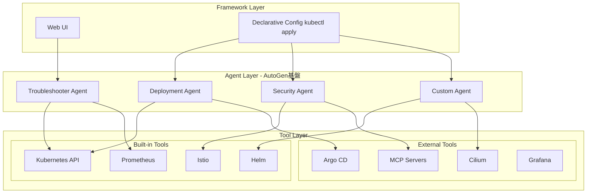

## ブログ概要（Summary）

本記事は [Kagent: Bringing Agentic AI to Cloud Native](https://www.cncf.io/blog/2025/04/15/kagent-bringing-agentic-ai-to-cloud-native/) の解説記事です。

kagentは、Kubernetes上でAIエージェントをネイティブ実行するためのオープンソースフレームワークであり、2025年5月22日にCNCF Sandboxプロジェクトとして採択された。Solo.ioが開発を主導し、MicrosoftのAutoGen基盤の上に構築されている。KubeCon + CloudNativeCon Europe 2025（ロンドン）でCNCFへの寄贈が発表され、100日間で100名以上のコントリビュータを獲得した。本記事ではkagentのアーキテクチャ、CRDベースのエージェント管理、ユースケースを解説する。

この記事は [Zenn記事: AIエージェント時代のKubernetes進化とEKS・GKE・AKSクラウドネイティブ比較](https://zenn.dev/0h_n0/articles/65bb6e56bbe88b) の深掘りです。

## 情報源

- **種別**: 公式テックブログ（CNCF）
- **URL**: [https://www.cncf.io/blog/2025/04/15/kagent-bringing-agentic-ai-to-cloud-native/](https://www.cncf.io/blog/2025/04/15/kagent-bringing-agentic-ai-to-cloud-native/)
- **組織**: Cloud Native Computing Foundation (CNCF) / Solo.io
- **発表日**: 2025年4月15日
- **CNCF成熟度**: Sandbox（2025年5月22日採択）

## 技術的背景（Technical Background）

クラウドネイティブ環境の運用は年々複雑化している。CNCF Annual Cloud Native Survey（2026年1月発表）によれば、コンテナユーザーの82%がKubernetesを本番環境で運用しており、マイクロサービス・サービスメッシュ・オブザーバビリティスタックの組み合わせは運用者に高度な知識を要求する。

この運用複雑性に対し、AIエージェントによる自動化が注目されている。しかし、汎用的なAIエージェントフレームワーク（LangChain、CrewAIなど）はKubernetesネイティブではなく、以下の課題がある。

1. **ライフサイクル管理**: エージェントの定義・更新・ロールバックがKubernetesの宣言的モデルに統合されていない
2. **GitOps非対応**: エージェント設定がGitリポジトリでバージョン管理しにくい
3. **ツール統合**: Kubernetes API、Prometheus、Istioなどクラウドネイティブツールとの統合に個別実装が必要

kagentはこれらの課題を解決するために設計された、Kubernetesネイティブのエージェントフレームワークである。

## 実装アーキテクチャ（Architecture）

### 3層アーキテクチャ

kagentは3層構造で設計されている。



**1. Tools層**: Kubernetes API、Prometheus、Istio、Helm、Argo CDなど事前定義されたツール群。MCP（Model Context Protocol）サーバーとの統合もサポートし、カスタムツールの追加も可能。CNCF公式ブログによれば、kagentは「pre-defined functions enabling agent interactions」としてツール層を位置付けている。

**2. Agents層**: ツールを活用して「iterative planning, task execution, result analysis, and continuous outcome improvement」を自律的に行うエージェント群。Microsoft AutoGen基盤の推論エンジンを使用し、複雑な非決定論的タスクを解決する。

**3. Framework層**: Web UIと宣言的設定（`kubectl apply`）の両方に対応するインターフェース。エージェント定義をKubernetes CRDとして管理できるため、既存のCI/CDパイプラインにそのまま統合できる。

### CRDベースのエージェント定義

kagentの最大の特徴は、AIエージェントをKubernetes Custom Resource Definition（CRD）として定義できる点である。

```yaml
apiVersion: kagent.dev/v1alpha2
kind: Agent
metadata:
  name: k8s-troubleshooter
  namespace: kagent
spec:
  description: "Kubernetes障害調査エージェント"
  type: Declarative
  declarative:
    modelConfig: anthropic-claude
    systemMessage: |
      あなたはKubernetesの障害調査専門エージェントです。
      Podの状態、ログ、メトリクスを分析して根本原因を特定します。
    tools:
      - type: McpServer
        mcpServer:
          name: kagent-tool-server
          kind: RemoteMCPServer
          apiGroup: kagent.dev
          toolNames:
            - k8s_get_resources
            - k8s_get_pod_logs
            - k8s_get_events
      - type: McpServer
        mcpServer:
          name: prometheus-tool-server
          kind: RemoteMCPServer
          apiGroup: kagent.dev
          toolNames:
            - prometheus_query
```

このCRDベースの設計により、以下の運用パターンが実現される。

| 運用パターン | 説明 |
|---|---|
| **GitOps管理** | エージェント定義をGitリポジトリで管理し、Argo CDやFlux CDでデプロイ |
| **バージョン管理** | `kubectl rollout`によるエージェント設定のロールバック |
| **名前空間分離** | チーム・環境ごとにエージェントを分離 |
| **RBAC統合** | KubernetesのRBACでエージェントのアクセス制御 |

### ModelConfig CRD

LLMプロバイダの設定は別途`ModelConfig` CRDとして定義する。

```yaml
apiVersion: kagent.dev/v1alpha2
kind: ModelConfig
metadata:
  name: anthropic-claude
  namespace: kagent
spec:
  provider: anthropic
  model: claude-sonnet-4-20250514
  apiKeySecretRef:
    name: anthropic-api-key
    key: api-key
```

kagentはマルチLLM対応であり、OpenAI、Anthropic、Google Vertex AI、Ollamaなど複数のプロバイダをサポートしている。

### MCP（Model Context Protocol）統合

kagentのツール層はMCPサーバーとの統合をネイティブにサポートしている。MCPはAnthropicが提唱するプロトコルで、LLMと外部ツールの標準的なインターフェースを定義する。

```yaml
tools:
  - type: McpServer
    mcpServer:
      name: custom-mcp-server
      kind: RemoteMCPServer
      apiGroup: kagent.dev
      toolNames:
        - custom_tool_1
        - custom_tool_2
```

この設計により、MCPサーバーとして実装された任意のツールをkagentエージェントから利用できる。既存のMCPサーバーエコシステム（GitHub MCP、Slack MCPなど）をそのまま活用可能である。

## DevOps特化のユースケース

CNCF公式ブログおよびkagent公式ドキュメントでは、以下のユースケースが紹介されている。

### 1. アプリケーショントラブルシューティング

Podの障害原因をKubernetes API・ログ・Prometheusメトリクスから自動分析する。SREの初動対応を支援し、MTTR（Mean Time To Recovery）の短縮を目指す。

### 2. アラート自動対応

Prometheusアラートをトリガーとして、エージェントが自動的に調査・対応を実行する。たとえば、CPUスパイクの検知時にHPA設定の調整を提案する。

### 3. プログレッシブデプロイ

Argo CDやIstioと連携し、カナリアリリースやブルー/グリーンデプロイの自動化を支援する。メトリクス異常時の自動ロールバックも対応する。

### 4. ゼロトラストセキュリティ

Istio・Ciliumと連携し、mTLS設定・NetworkPolicy・認証/認可ポリシーの自動生成・検証を行う。

## コミュニティの成長

CNCF公式ブログ「Celebrating 100 Days of Kagent」（2025年8月19日）によれば、kagentは公開後100日間で以下の成果を達成した。

- **コントリビュータ数**: 100名以上（85%以上がSolo.io外部から参加）
- **GitHub Stars**: 1,000以上
- **初回リリース**: 2025年3月17日
- **CNCF Sandbox採択**: 2025年5月22日

この成長速度は、Kubernetes運用自動化へのAIエージェント活用に対するコミュニティの関心の高さを反映している。

## 実装のポイント

### kagentとKubeflow Trainerの使い分け

kagentとKubeflow Trainerは役割が異なる。混同しやすいが、以下のように使い分ける。

| 項目 | kagent | Kubeflow Trainer |
|------|--------|-----------------|
| **目的** | AIエージェントの**推論実行**（運用自動化） | AIモデルの**学習・ファインチューニング** |
| **入力** | ユーザーの質問・アラート・タスク | 学習データセット |
| **出力** | 調査結果・対応アクション | 学習済みモデル |
| **リソース** | LLM API呼び出し（CPU中心） | GPU/TPU（大量のGPUメモリ必要） |

### セキュリティ考慮事項

kagentエージェントはKubernetes APIへのアクセス権を持つため、以下のセキュリティ対策が推奨される。

1. **RBAC最小権限**: エージェントのServiceAccountに必要最小限のClusterRole/Roleを付与する
2. **NetworkPolicy**: エージェントPodからのEgressを制限し、LLMエンドポイントと必要なKubernetes APIのみ許可する
3. **Secret管理**: LLMのAPIキーはKubernetes Secretとして管理し、外部シークレットマネージャ（HashiCorp Vault、AWS Secrets Manager等）との統合を検討する
4. **監査ログ**: エージェントが実行したアクションをCloudTrailやKubernetes Audit Logで追跡する

### 本番導入時の注意

kagentは2026年3月時点でCNCF Sandbox段階であり、APIは`v1alpha2`である。本番環境での利用には以下の点を考慮する必要がある。

- APIの破壊的変更が発生する可能性がある
- エージェントの自律的アクションに対するguardrail（安全柵）の設計が重要
- LLM APIの利用コストがスケールに応じて増加する

## パフォーマンス最適化（Performance）

kagentのパフォーマンス特性は、主にLLMの推論レイテンシに依存する。

**レスポンス時間の目安**:
- 単純なkubectlクエリ: 2-5秒（LLM推論1-2回）
- トラブルシューティング（ログ分析含む）: 15-30秒（LLM推論3-5回）
- 複雑なデプロイメント操作: 30-60秒（LLM推論5-10回）

**コスト考慮**: エージェントのLLM API呼び出し頻度はワークロードに依存する。Prometheusアラートのトリガー頻度が高い環境では、不要なアラートのフィルタリングをkagent前段で行うことが推奨される。

## 学術研究との関連（Academic Connection）

kagentの設計は、以下の研究領域と関連する。

- **LLMエージェントの自律性制御**: エージェントが自律的にアクションを実行する際の安全性保証は、AI Safety研究の重要テーマ
- **マルチエージェントシステム**: 複数のkagentエージェントが協調して問題解決するパターンは、分散AIの研究に通じる
- **AIOps**: IT運用の自動化にAIを活用するAIOps（Artificial Intelligence for IT Operations）の実践的実装

## まとめと実践への示唆

kagentは、Kubernetes上でAIエージェントを管理するための初のCNCF Sandboxプロジェクトであり、CRDベースの宣言的管理・GitOps統合・MCP対応という特徴により、既存のクラウドネイティブエコシステムにスムーズに統合できる設計となっている。

CNCF公式ブログが述べるように、kagentは「simple chat interactions」を超えた「advanced reasoning and iterative planning to autonomously solve complex, non-deterministic multi-step problems」を実現するフレームワークである。ステージング環境での検証から始め、まずはトラブルシューティングやアラート対応など低リスクなユースケースから導入することが推奨される。

## 参考文献

- **CNCF Blog**: [https://www.cncf.io/blog/2025/04/15/kagent-bringing-agentic-ai-to-cloud-native/](https://www.cncf.io/blog/2025/04/15/kagent-bringing-agentic-ai-to-cloud-native/)
- **kagent公式サイト**: [https://kagent.dev/](https://kagent.dev/)
- **GitHub**: [https://github.com/kagent-dev/kagent](https://github.com/kagent-dev/kagent)
- **CNCF 100 Days**: [https://www.cncf.io/blog/2025/08/19/celebrating-100-days-of-kagent/](https://www.cncf.io/blog/2025/08/19/celebrating-100-days-of-kagent/)
- **Solo.io Blog**: [https://www.solo.io/blog/bringing-agentic-ai-to-kubernetes-contributing-kagent-to-cncf](https://www.solo.io/blog/bringing-agentic-ai-to-kubernetes-contributing-kagent-to-cncf)
- **Related Zenn article**: [https://zenn.dev/0h_n0/articles/65bb6e56bbe88b](https://zenn.dev/0h_n0/articles/65bb6e56bbe88b)
