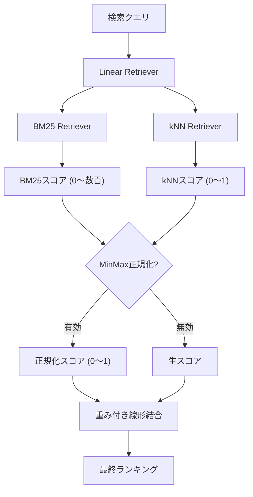

本記事は [Elastic Search Labs: Linear Retriever for Hybrid Search](https://www.elastic.co/search-labs/blog/linear-retriever-hybrid-search) の解説記事です。

## ブログ概要（Summary）

Elasticsearchは2025年にLinear Retrieverを導入した（Elasticsearch 8.18 / 9.0以降で利用可能）。これはRRF（Reciprocal Rank Fusion）の代替として設計されたハイブリッド検索の統合手法である。RRFが各検索結果の「順位」のみを使用してスコアの実数値を無視するのに対し、Linear Retrieverはスコアの実数値を活用した重み付き線形結合を行う。Elasticのブログでは、RRFが「スコア差の情報を失う」ことにより不適切なランキングを生成するケースがあると指摘し、Linear Retrieverがそれを解決すると説明している。

この記事は [Zenn記事: BM25×ベクトル検索のハイブリッド実装ガイド](https://zenn.dev/0h_n0/articles/46d801df9b61de) の深掘りです。

## 情報源

- **種別**: 企業テックブログ
- **URL**: [https://www.elastic.co/search-labs/blog/linear-retriever-hybrid-search](https://www.elastic.co/search-labs/blog/linear-retriever-hybrid-search)
- **組織**: Elastic (Elasticsearch Labs)
- **発表日**: 2025年5月28日（最終更新: 2026年1月7日）

## 技術的背景（Technical Background）

Zenn記事で解説されているRRFは、BM25とベクトル検索の結果を順位ベースで統合する手法である。RRFの統合スコアは以下の式で計算される。

$$
\text{RRF}(d) = \sum_{r \in R} \frac{1}{k + \text{rank}_r(d)}
$$

RRFの利点は「スコア正規化が不要」であることだが、同時に「スコアの絶対値情報が失われる」という制約がある。

### RRFの限界を示す具体例

以下のケースを考える。

| 文書 | BM25スコア | kNNスコア | BM25順位 | kNN順位 |
|------|----------|----------|---------|--------|
| doc1 | **100.0** | 0.347 | 2 | 2 |
| doc2 | 1.5 | **0.348** | 3 | 1 |
| doc3 | 1.0 | 0.346 | 4 | 3 |
| doc4 | 0.5 | 0.345 | 5 | 4 |

RRFはスコアの絶対値を無視するため、doc1のBM25スコアが100.0（doc2の1.5と比べて66倍以上）であるという重要な情報が失われる。RRFの計算結果ではdoc2がdoc1より上位にランクされる可能性がある（doc2はkNN順位1位）。

しかし、doc1のBM25スコアが圧倒的に高いことは、doc1がクエリの語彙的な意味で極めて関連性が高いことを示しており、この情報を無視するのは不適切である。

### Linear Retrieverの解決策

Linear Retrieverはスコアの実数値を使う。

$$
\text{score}_{\text{linear}}(d) = w_{\text{bm25}} \cdot s_{\text{bm25}}(d) + w_{\text{knn}} \cdot s_{\text{knn}}(d)
$$

上記の例では、$w_{\text{bm25}} = 1.5$、$w_{\text{knn}} = 5$ と設定すると、doc1は $1.5 \times 100 + 5 \times 0.347 = 151.735$ となり、doc2の $1.5 \times 1.5 + 5 \times 0.348 = 3.99$ を大きく上回る。

## 実装アーキテクチャ（Architecture）

### Linear Retrieverの構成



### Elasticsearchでの設定例

```json
GET /documents/_search
{
  "retriever": {
    "linear": {
      "retrievers": [
        {
          "retriever": {
            "standard": {
              "query": {
                "match": {
                  "content": "ハイブリッド検索の実装"
                }
              }
            }
          },
          "weight": 1.5
        },
        {
          "retriever": {
            "knn": {
              "field": "content_vector",
              "query_vector": [0.01, 0.42, 0.13],
              "k": 100,
              "num_candidates": 200
            }
          },
          "weight": 5.0
        }
      ]
    }
  },
  "size": 10
}
```

この設定では、BM25結果に重み1.5、kNN結果に重み5.0を掛けて線形結合する。

### MinMax正規化オプション

BM25スコア（0〜数百の範囲）とkNNスコア（0〜1の範囲）はスケールが大きく異なる。Linear RetrieverはオプションでMinMax正規化を提供する。

$$
\hat{s}(d) = \frac{s(d) - \min_{d' \in D} s(d')}{\max_{d' \in D} s(d') - \min_{d' \in D} s(d')}
$$

MinMax正規化を有効にすると、両方のスコアが$[0, 1]$の範囲にスケーリングされ、重みの解釈が直感的になる。

Zenn記事で説明されている「Linear Combinationのalpha方式」と同等であり、正規化後は以下と等価になる。

$$
\text{score}(d) = \alpha \cdot \hat{s}_{\text{knn}}(d) + (1 - \alpha) \cdot \hat{s}_{\text{bm25}}(d)
$$

### RRFとLinear Retrieverの比較

```json
// RRF Retriever (既存)
{
  "retriever": {
    "rrf": {
      "retrievers": [
        { "standard": { "query": { "match": { "content": "query" } } } },
        { "knn": { "field": "content_vector", "query_vector": [...], "k": 100 } }
      ],
      "rank_constant": 60,
      "rank_window_size": 100
    }
  }
}
```

```json
// Linear Retriever (新規)
{
  "retriever": {
    "linear": {
      "retrievers": [
        {
          "retriever": { "standard": { "query": { "match": { "content": "query" } } } },
          "weight": 1.5
        },
        {
          "retriever": { "knn": { "field": "content_vector", "query_vector": [...], "k": 100 } },
          "weight": 5.0
        }
      ]
    }
  }
}
```

設定構造は類似しており、`rrf`を`linear`に置き換え、`rank_constant`/`rank_window_size`の代わりに`weight`を指定するだけで移行できる。

## パフォーマンス最適化（Performance）

**RRF vs Linear Retrieverの使い分け**:

| 観点 | RRF | Linear Retriever |
|------|-----|-----------------|
| チューニング | k値のみ（k=60で安定） | 重みの調整が必要 |
| スコア正規化 | 不要 | MinMax正規化推奨 |
| スコア情報の活用 | 順位のみ | 実数値を活用 |
| 精度の上限 | 中〜高 | 高（適切に重みを調整した場合） |
| 導入コスト | 低い | 中程度（重みの評価が必要） |
| ロバスト性 | 高い（設定に鈍感） | 中程度（重みに敏感） |

Elasticのブログによると、Linear RetrieverはRRFに対して約40件のアノテーション済みクエリで性能を上回ることが可能とされているが、結果の安定性はRRFの方が高いとも述べられている。

**Weighted RRF**: Elasticは従来の（等重み）RRFに加え、Weighted RRFも導入している。これはRRFの順位ベース統合を維持しつつ、各retrieverに重みを割り当てるハイブリッドアプローチである。Linear Retrieverへの完全移行が難しい場合の中間選択肢として位置づけられている。

## 運用での学び（Production Lessons）

**重み設定のガイドライン**: ブログの例では$w_{\text{knn}} = 5$、$w_{\text{bm25}} = 1.5$が使用されている。これはkNNスコアの範囲が狭い（0〜1）のに対しBM25スコアの範囲が広い（0〜数百）ため、MinMax正規化なしの場合にkNN側の重みを大きくしてバランスを取る必要があることを示している。MinMax正規化を有効にした場合は、重みの設定が直感的になる。

**評価データの重要性**: Linear Retrieverの重み調整には評価データ（クエリと正解文書のペア）が必要である。Elasticのブログでは約40件のアノテーション済みクエリで改善が見られたとされているが、安定した結果を得るにはZenn記事で推奨されている50〜100件以上の評価データが望ましい。

**段階的な移行**: RRFから直接Linear Retrieverに移行するのではなく、以下の段階的アプローチが推奨される。
1. RRF（デフォルト設定）でベースライン構築
2. Weighted RRFで各retrieverの重み付け効果を確認
3. Linear Retriever + MinMax正規化で精度改善を評価
4. 評価データが十分なら正規化なしのLinear Retrieverで微調整

## 学術研究との関連（Academic Connection）

- **Cormack et al. (SIGIR 2009)**: RRFの原論文。順位ベース統合の有効性を示したが、スコア情報の損失については議論されていなかった。Linear Retrieverはこの制約を解消する。
- **DAT（arXiv:2503.23013）**: クエリごとにalphaを動的調整するアプローチ。Linear Retrieverの重みは静的だが、DATの概念をLinear Retrieverに適用する（クエリごとに重みを変更する）ことが将来的な拡張として考えられる。
- **Learning to Rank**: Linear Retrieverの重み最適化はLTR（Learning to Rank）のサブセットとして位置づけられる。LambdaMART等の手法で重みを自動最適化する研究が進んでいる。

## まとめと実践への示唆

Elasticsearch Linear Retrieverは、RRFの「スコア情報を無視する」という制約を解消し、スコアの実数値を活用した重み付き線形結合でハイブリッド検索を実現する。Elasticsearch 8.18 / 9.0以降で利用可能であり、既存のRRF設定からの移行も容易である。

実践的には、Zenn記事で紹介されているElasticsearchのRRF retriever構文を使用している場合、Linear Retrieverへの移行によりスコア差の情報を活用した精度改善が期待できる。ただし、重みの調整には評価データが必要であるため、まずRRFでベースラインを構築し、評価データが揃った段階でLinear Retrieverへの移行を検討するのが現実的なアプローチである。

RRFは設定に鈍感で安定した結果を提供するのに対し、Linear Retrieverは適切にチューニングすればRRFを上回る可能性がある。両者はトレードオフの関係にあり、評価データの量と検索要件に応じて使い分けることが重要である。

## 参考文献

- **Blog URL**: [https://www.elastic.co/search-labs/blog/linear-retriever-hybrid-search](https://www.elastic.co/search-labs/blog/linear-retriever-hybrid-search)
- **Weighted RRF**: [https://www.elastic.co/search-labs/blog/weighted-reciprocal-rank-fusion-rrf](https://www.elastic.co/search-labs/blog/weighted-reciprocal-rank-fusion-rrf)
- **Elasticsearch RRF Reference**: [https://www.elastic.co/docs/reference/elasticsearch/rest-apis/retrievers/rrf-retriever](https://www.elastic.co/docs/reference/elasticsearch/rest-apis/retrievers/rrf-retriever)
- **Related Zenn article**: [https://zenn.dev/0h_n0/articles/46d801df9b61de](https://zenn.dev/0h_n0/articles/46d801df9b61de)
