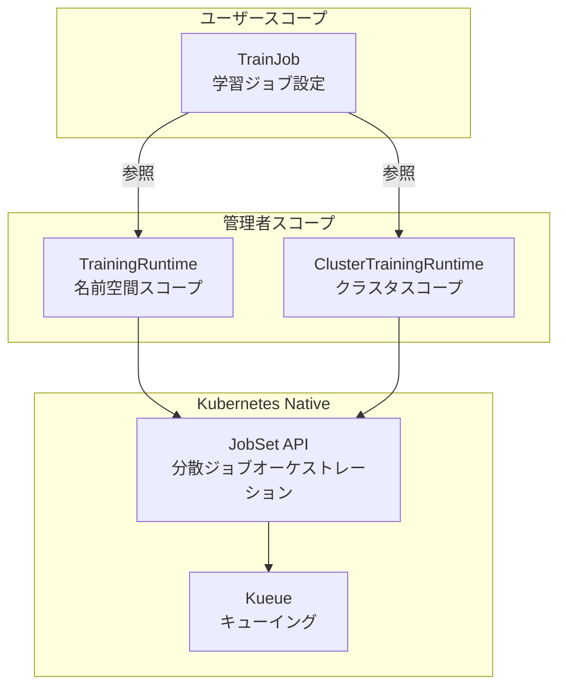

## ブログ概要（Summary）

本記事は [Democratizing AI Model Training on Kubernetes: Introducing Kubeflow Trainer V2](https://blog.kubeflow.org/trainer/intro/) の解説記事です。

Kubeflow Trainer V2は、Kubernetes上でのAIモデル分散学習を簡素化する次世代フレームワークである。2025年7月にv2.0、同年11月にv2.1がリリースされた。従来のV1ではフレームワークごとに個別のCRD（PyTorchJob、TFJobなど）が必要だったが、V2では**TrainJob**という単一のCRDで統一された。Kueueとの統合によるバッチスケジューリング、MPI v2による自動SSH鍵生成、Python SDKによるKubernetes APIの抽象化が主要な特徴である。

この記事は [Zenn記事: AIエージェント時代のKubernetes進化とEKS・GKE・AKSクラウドネイティブ比較](https://zenn.dev/0h_n0/articles/65bb6e56bbe88b) の深掘りです。

## 情報源

- **種別**: 公式テックブログ（Kubeflow Blog）
- **URL**: [https://blog.kubeflow.org/trainer/intro/](https://blog.kubeflow.org/trainer/intro/)
- **組織**: Kubeflow Community（CNCF Incubating）
- **発表日**: 2025年（V2.0: 2025年7月、V2.1: 2025年11月）

## 技術的背景（Technical Background）

大規模言語モデル（LLM）や画像生成モデルの学習には、数十〜数千のGPUを使った分散学習が必要である。しかし、Kubernetes上での分散学習には以下の課題があった。

1. **CRDの断片化**: PyTorchJob、TFJob、MPIJobなどフレームワークごとに異なるCRDが存在し、設定方法がバラバラだった
2. **レプリカ設定の冗長性**: 各フレームワークのCRDでワーカー数・リソース・コンテナイメージを個別に指定する必要があり、YAMLが数百行に膨れ上がっていた
3. **リソース管理の欠如**: GPUリソースの公平な分配やキューイングの標準的な仕組みがなかった

Kubeflow Trainer V2はこれらの課題を解決するために、**関心の分離**（Separation of Concerns）の原則に基づいて設計された。

## 実装アーキテクチャ（Architecture）

### CRDの構成

Trainer V2は3つのCRDで構成される。



**1. TrainJob（ユーザー向け）**: 学習ジョブの設定を定義する。コード・データセット・モデルの参照と、使用するRuntimeへのポインタを含む。ユーザーはインフラの詳細を知らなくてよい。

**2. TrainingRuntime（名前空間スコープ）**: チームごとのインフラ定義。GPU数、フレームワーク固有の設定、Pod障害ポリシーなどを含む。

**3. ClusterTrainingRuntime（クラスタスコープ）**: クラスタ全体で共有されるインフラ定義。管理者が事前に設定した分散学習の構成を提供する。

### V1 vs V2の比較

V1ではフレームワークごとに冗長な設定が必要だったが、V2では大幅に簡素化された。

**V1（PyTorchJob）の例**:
```yaml
apiVersion: kubeflow.org/v1
kind: PyTorchJob
metadata:
  name: llm-finetune
spec:
  pytorchReplicaSpecs:
    Master:
      replicas: 1
      template:
        spec:
          containers:
          - name: pytorch
            image: my-training:latest
            resources:
              limits:
                nvidia.com/gpu: 4
    Worker:
      replicas: 7
      template:
        spec:
          containers:
          - name: pytorch
            image: my-training:latest
            resources:
              limits:
                nvidia.com/gpu: 4
```

**V2（TrainJob）の例**:
```yaml
apiVersion: kubeflow.org/v2alpha1
kind: TrainJob
metadata:
  name: llm-finetune
spec:
  runtimeRef:
    name: torch-distributed
  trainer:
    image: my-training:latest
    numNodes: 8
    resourcesPerNode:
      requests:
        nvidia.com/gpu: 4
```

V2ではTrainJobがRuntimeを参照するだけで、フレームワーク固有の設定はClusterTrainingRuntimeに委譲される。

### ClusterTrainingRuntimeの定義例

管理者が事前にPyTorch分散学習用のRuntimeを定義する。

```yaml
apiVersion: kubeflow.org/v2alpha1
kind: ClusterTrainingRuntime
metadata:
  name: torch-distributed
spec:
  numNodes: 1
  startingPort: 29500
  template:
    spec:
      replicatedJobs:
      - name: node
        template:
          spec:
            template:
              spec:
                containers:
                - name: trainer
                  env:
                  - name: MASTER_ADDR
                    value: "$(NODE_0_ADDR)"
                  - name: MASTER_PORT
                    value: "29500"
                  - name: NCCL_DEBUG
                    value: "INFO"
  podGroupPolicy:
    podGroupPolicySource:
      coscheduling:
        scheduleTimeoutSeconds: 300
```

`podGroupPolicy`により、全Podが同時にスケジューリングされるgang-schedulingが設定されている。これにより、一部のPodだけがGPUを確保して残りが待機するデッドロック状態を防止する。

### JobSet APIの活用

Trainer V2の内部では、Kubernetes-nativeなJobSet APIが分散ジョブのオーケストレーションに使用される。JobSetは複数のJobをグループとして管理し、以下の機能を提供する。

- **Gang-scheduling**: PodGroupPolicyによる全Pod同時スケジューリング
- **障害耐性**: PodFailurePolicyによるノード障害時の自動リカバリ
- **ネットワーク設定**: Pod間のヘッドレスService自動生成

### Kueue統合によるキューイング

Kueueとの統合により、GPUリソースが不足している場合にTrainJobをキューに入れ、リソースが利用可能になった時点で自動的にスケジューリングする。

Kubeflow公式ブログによれば、V2.0ではPod Integration（個別Podレベルのキューイング）を提供し、V2.1ではTrainJobレベルのネイティブKueueサポートが進められている。

### MPI v2サポート

V2.1ではMPI v2サポートが追加され、以下の機能が提供される。

- **自動SSH鍵生成**: ノード間通信に必要なSSH鍵を自動生成し、Kubernetes Secretとして管理
- **DeepSpeed統合**: DeepSpeedのマルチノード学習を手動SSH設定なしで実行可能
- **MPIランチャー設定**: mpirunコマンドのパラメータを宣言的に設定

```yaml
apiVersion: kubeflow.org/v2alpha1
kind: TrainJob
metadata:
  name: deepspeed-training
spec:
  runtimeRef:
    name: mpi-v2
  trainer:
    image: my-deepspeed-training:latest
    numNodes: 4
    resourcesPerNode:
      requests:
        nvidia.com/gpu: 8
```

## Python SDKによる抽象化

Trainer V2のPython SDKは、Kubernetes APIの直接操作を不要にする。

```python
from kubeflow.trainer import TrainerClient

client = TrainerClient()

# 分散学習ジョブの投入
job_name = client.train(
    runtime=client.get_runtime("torch-distributed"),
    trainer=CustomTrainer(
        func=my_training_function,
        num_nodes=8,
        resources_per_node={"gpu": 4}
    )
)

# ジョブの状態確認
status = client.get_job(job_name)
print(f"Status: {status.phase}, Nodes: {status.active_nodes}/{status.total_nodes}")
```

SDKの`CustomTrainer`を使えば、学習関数を直接渡すだけで分散学習が実行される。コンテナイメージのビルドやKubernetes YAMLの作成は不要である。

## 実装のポイント

### データセット・モデルの初期化

Trainer V2では、データセットとモデルのダウンロードを専用のinitializerコンテナで1回だけ実行し、共有ボリュームで全ノードに配布する設計となっている。

```yaml
spec:
  datasetConfig:
    storageUri: s3://my-bucket/datasets/llama-finetune
  modelConfig:
    storageUri: hf://meta-llama/Llama-3.2-1B
```

この設計により、各ノードが個別にデータをダウンロードする冗長なネットワークI/Oを削減できる。

### V1からの移行

V1のPyTorchJob/TFJobからV2のTrainJobへの移行は段階的に行える。Kubeflow公式ドキュメントでは、V1のCRDは引き続きサポートされるが、新規プロジェクトではV2の使用が推奨されている。

移行のポイントは以下の通り。

1. **ClusterTrainingRuntimeの作成**: V1で使用していたフレームワーク設定をRuntimeとして抽出
2. **TrainJobへの書き換え**: V1のCRDをTrainJobに置き換え、RuntimeRefで参照
3. **Kueueの導入**: リソースキューイングの設定を追加

### 制約事項

Kubeflow公式ブログによれば、V2には以下の制約がある。

- **JAXサポートは開発中**: v2.1時点でPyTorch、DeepSpeed、MPI v2に対応。JAXは今後対応予定
- **TrainJob APIはv2alpha1**: APIは安定版ではなく、破壊的変更の可能性がある
- **ネイティブKueueサポート**: Pod Integrationは提供されるが、TrainJobレベルの完全なKueue統合は開発中

## Production Deployment Guide

### AWS実装パターン（コスト最適化重視）

| 規模 | GPUノード数 | 推奨構成 | 月額コスト | 主要サービス |
|------|-----------|---------|-----------|------------|
| **Small** | 1-4ノード | EKS + g5 On-Demand | $2,000-5,000 | EKS + g5.xlarge |
| **Medium** | 4-16ノード | EKS + p4d Spot | $5,000-20,000 | EKS + p4d.24xlarge Spot |
| **Large** | 16+ノード | EKS + p5 + Kueue | $20,000-100,000+ | EKS + p5.48xlarge + Kueue |

**Medium構成の詳細**（月額$5,000-20,000）:
- **EKS**: コントロールプレーン ($72/月)
- **p4d.24xlarge Spot x 4-8台**: A100 GPU x 8台/ノード（Spot利用で最大90%削減）
- **EFS**: 共有ストレージ（データセット・モデル共有）($100-500/月)
- **S3**: 学習データ・チェックポイント保存 ($50-200/月)
- **CloudWatch + Container Insights**: ($50/月)

**コスト試算の注意事項**: 上記は2026年3月時点のAWS ap-northeast-1料金に基づく概算値です。GPU学習の実際のコストはジョブ実行時間に大きく依存します。最新料金は [AWS料金計算ツール](https://calculator.aws/) で確認してください。

### Terraformインフラコード

**Medium構成: EKS + Kueue + Kubeflow Trainer V2**

```hcl
module "eks" {
  source  = "terraform-aws-modules/eks/aws"
  version = "~> 20.0"

  cluster_name    = "ml-training-cluster"
  cluster_version = "1.34"

  vpc_id     = module.vpc.vpc_id
  subnet_ids = module.vpc.private_subnets

  cluster_endpoint_public_access = true
  enable_cluster_creator_admin_permissions = true
}

resource "kubectl_manifest" "karpenter_gpu_pool" {
  yaml_body = <<-YAML
    apiVersion: karpenter.sh/v1
    kind: NodePool
    metadata:
      name: gpu-training
    spec:
      template:
        spec:
          nodeClassRef:
            group: eks.amazonaws.com
            kind: NodeClass
            name: gpu-training
          requirements:
            - key: node.kubernetes.io/instance-type
              operator: In
              values: ["p4d.24xlarge", "p5.48xlarge"]
            - key: karpenter.sh/capacity-type
              operator: In
              values: ["spot", "on-demand"]
      limits:
        nvidia.com/gpu: "64"
      disruption:
        consolidationPolicy: WhenEmpty
        consolidateAfter: 120s
  YAML
}

resource "aws_efs_file_system" "shared_storage" {
  creation_token   = "ml-shared-storage"
  performance_mode = "generalPurpose"
  throughput_mode  = "bursting"

  tags = {
    Name = "kubeflow-shared-storage"
  }
}

resource "aws_budgets_budget" "training_monthly" {
  name         = "ml-training-monthly"
  budget_type  = "COST"
  limit_amount = "20000"
  limit_unit   = "USD"
  time_unit    = "MONTHLY"

  notification {
    comparison_operator       = "GREATER_THAN"
    threshold                 = 80
    threshold_type            = "PERCENTAGE"
    notification_type         = "ACTUAL"
    subscriber_email_addresses = ["ml-ops@example.com"]
  }
}
```

### 運用・監視設定

**CloudWatch Logs Insights クエリ**:
```sql
-- 学習ジョブの実行時間分析
fields @timestamp, job_name, duration_seconds, gpu_count
| stats avg(duration_seconds) as avg_duration, sum(duration_seconds * gpu_count) as total_gpu_seconds by job_name
| sort total_gpu_seconds desc

-- GPU利用率の監視
fields @timestamp, node_name, gpu_utilization
| stats avg(gpu_utilization) as avg_util by bin(5m)
| filter avg_util < 30
```

**コスト監視**:
```python
import boto3

cloudwatch = boto3.client('cloudwatch')

cloudwatch.put_metric_alarm(
    AlarmName='gpu-training-cost',
    ComparisonOperator='GreaterThanThreshold',
    EvaluationPeriods=1,
    MetricName='EstimatedCharges',
    Namespace='AWS/Billing',
    Period=86400,
    Statistic='Maximum',
    Threshold=1000.0,
    AlarmDescription='日次学習コスト$1,000超過アラート',
    AlarmActions=['arn:aws:sns:ap-northeast-1:123456789:ml-cost-alerts'],
)
```

### コスト最適化チェックリスト

**アーキテクチャ選択**:
- [ ] 小規模学習 (~4 GPU) → EKS + g5 On-Demand
- [ ] 中規模学習 (4-64 GPU) → EKS + p4d Spot + Kueue
- [ ] 大規模学習 (64+ GPU) → EKS + p5 + Kueue + Reserved混合

**リソース最適化**:
- [ ] Spot Instances優先（Karpenter自動管理、最大90%削減）
- [ ] Kueueによるジョブキューイング（GPU空き待ちの効率化）
- [ ] EFS共有ストレージでデータダウンロード重複排除
- [ ] チェックポイント間隔の最適化（S3コスト vs 再実行コスト）
- [ ] Reserved Instances: 定常的な学習ノード用

**監視・アラート**:
- [ ] AWS Budgets: 月額予算設定
- [ ] GPU利用率モニタリング: 30%未満で通知
- [ ] ジョブ実行時間トラッキング
- [ ] Spot中断率の監視

**リソース管理**:
- [ ] Karpenter consolidation: 学習完了後の自動スケールダウン
- [ ] S3チェックポイントのライフサイクルポリシー
- [ ] ECRイメージの定期クリーンアップ
- [ ] 開発クラスタ: 夜間停止

## 学術研究との関連（Academic Connection）

Kubeflow Trainer V2の設計は、以下の研究領域と関連する。

- **分散学習の効率化**: Data Parallelism、Model Parallelism、Pipeline Parallelismの組み合わせ最適化
- **ジョブスケジューリング**: GPUクラスタにおける公平性・効率性のトレードオフ（Gandiva、Tiresias等の研究）
- **障害耐性**: 大規模分散学習におけるチェックポイント戦略と復旧メカニズム

## まとめと実践への示唆

Kubeflow Trainer V2は、TrainJob APIによるCRD統一、ClusterTrainingRuntimeによる関心の分離、Kueueによるバッチスケジューリングという3つの設計原則により、Kubernetes上での分散学習の複雑性を大幅に低減している。

Kubeflow公式ブログが述べるように、V2は「dramatically reducing configuration complexity」を実現し、MLエンジニアがインフラの詳細を意識せずに分散学習を実行できる環境を提供する。ただし、APIはv2alpha1段階であり、本番導入には破壊的変更のリスクを考慮した設計が必要である。新規プロジェクトではV2の採用を推奨する一方、既存のV1ワークロードについては段階的な移行を計画することが望ましい。

## 参考文献

- **Kubeflow Blog**: [https://blog.kubeflow.org/trainer/intro/](https://blog.kubeflow.org/trainer/intro/)
- **Kubeflow Trainer Docs**: [https://www.kubeflow.org/docs/components/trainer/overview/](https://www.kubeflow.org/docs/components/trainer/overview/)
- **GitHub**: [https://github.com/kubeflow/trainer](https://github.com/kubeflow/trainer)
- **Kueue TrainJob**: [https://kueue.sigs.k8s.io/docs/tasks/run/trainjobs/](https://kueue.sigs.k8s.io/docs/tasks/run/trainjobs/)
- **Related Zenn article**: [https://zenn.dev/0h_n0/articles/65bb6e56bbe88b](https://zenn.dev/0h_n0/articles/65bb6e56bbe88b)
