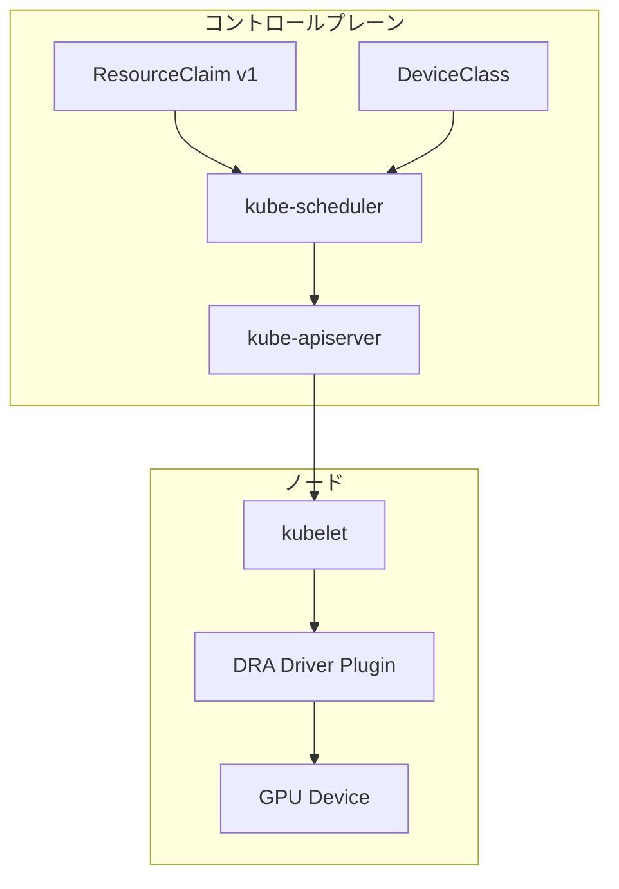

## ブログ概要（Summary）

本記事は [Kubernetes v1.34: DRA has graduated to GA](https://kubernetes.io/blog/2025/09/01/kubernetes-v1-34-dra-updates/) の解説記事です。

Kubernetes v1.34（2025年8月27日リリース、コードネーム "Of Wind & Will"）において、Dynamic Resource Allocation（DRA）がGeneral Availability（GA）に到達した。DRAは`resource.k8s.io`グループのコアAPIをv1安定版として提供し、GPUやFPGAなどの特殊ハードウェアを宣言的に管理するための標準的な仕組みとなった。本記事では、DRAの技術的詳細、新機能、およびAIワークロードへの影響を解説する。

この記事は [Zenn記事: AIエージェント時代のKubernetes進化とEKS・GKE・AKSクラウドネイティブ比較](https://zenn.dev/0h_n0/articles/65bb6e56bbe88b) の深掘りです。

## 情報源

- **種別**: 公式テックブログ（Kubernetes Project）
- **URL**: [https://kubernetes.io/blog/2025/09/01/kubernetes-v1-34-dra-updates/](https://kubernetes.io/blog/2025/09/01/kubernetes-v1-34-dra-updates/)
- **組織**: Kubernetes DRA Team
- **発表日**: 2025年9月1日

## 技術的背景（Technical Background）

従来のKubernetesにおけるGPUリソース管理はDevice Pluginに依存していた。Device Pluginは`nvidia.com/gpu: 1`のように整数単位でデバイスをリクエストする仕組みであり、以下の制約があった。

1. **デバイスの部分割り当て不可**: 1台のGPUを複数Podで共有する標準的な方法がなかった
2. **トポロジ非考慮**: NVLinkやPCIeバス接続を考慮したスケジューリングができなかった
3. **静的な割り当て**: リソース要件を柔軟に記述する手段がなかった

DRAはこれらの課題に対し、`ResourceClaim`という新しいAPI抽象化を導入して解決を図る。ワークロードは必要なデバイスの**プロパティ**を記述し、実際のデバイス割り当てはスケジューラに委譲される設計となっている。

## 実装アーキテクチャ（Architecture）

### DRAの基本構成要素

DRAのアーキテクチャは以下の3つのコンポーネントで構成される。



1. **ResourceClaim**: ワークロードが必要とするデバイスの要件を宣言するリソース。CEL（Common Expression Language）式でフィルタリング条件を記述できる
2. **DeviceClass**: クラスタ管理者がデバイスの分類を定義するリソース。ドライバ名やデフォルトの設定を指定する
3. **DRA Driver**: 各ノードでデバイスの検出・割り当て・設定を行うプラグイン

### ResourceClaim APIの構造

GA化されたResourceClaim APIでは、`resource.k8s.io/v1`が標準バージョンとなった。以下にGPU要件を記述するResourceClaimの例を示す。

```yaml
apiVersion: resource.k8s.io/v1
kind: ResourceClaim
metadata:
  name: ai-inference-gpu
spec:
  devices:
    requests:
    - name: gpu
      deviceClassName: gpu.nvidia.com
      selectors:
      - cel:
          expression: >
            device.attributes['memory'].compareTo(quantity('40Gi')) >= 0
    config:
    - requests: ["gpu"]
      opaque:
        driver: gpu.nvidia.com
        parameters:
          apiVersion: gpu.nvidia.com/v1
          kind: GpuConfig
          sharing:
            strategy: MIG
            migDevices:
            - profile: 3g.40gb
              count: 2
```

このResourceClaimでは、CEL式`device.attributes['memory'].compareTo(quantity('40Gi')) >= 0`により40GiB以上のメモリを持つGPUを要求している。さらに`sharing.strategy: MIG`でNVIDIA MIGによるパーティショニングを指定している。

### DeviceClassの定義

DeviceClassはクラスタ管理者がデバイスカテゴリを定義するために使用する。

```yaml
apiVersion: resource.k8s.io/v1
kind: DeviceClass
metadata:
  name: gpu.nvidia.com
spec:
  selectors:
  - cel:
      expression: "device.driver == 'gpu.nvidia.com'"
```

## GA化で安定した機能群

### コアAPIのGA昇格

Kubernetes v1.34では、`resource.k8s.io`グループの以下のAPIがGAに昇格した。

| API | 説明 | 安定性 |
|-----|------|--------|
| ResourceClaim | デバイス要件の宣言 | GA (v1) |
| DeviceClass | デバイス分類の定義 | GA (v1) |
| ResourceSlice | ノード上のデバイス情報 | GA (v1) |

Kubernetes公式ブログによれば、GA化によりDRAは「安定版として長期的にKubernetesの一部となり、破壊的変更は導入されない」と明言されている。

### ベータ昇格した新機能

v1.34では以下の機能がベータに昇格し、デフォルトで有効化されている。

**1. Prioritized List（優先リスト）**

ワークロードが複数のデバイスオプションを優先順位付きで指定できる機能。たとえば「ハイエンドGPU 1台が望ましいが、なければミッドレンジGPU 2台でも可」という柔軟な要求を記述できる。

```yaml
apiVersion: resource.k8s.io/v1
kind: ResourceClaim
metadata:
  name: flexible-gpu
spec:
  devices:
    requests:
    - name: gpu
      firstAvailable:
      - deviceClassName: gpu-high-end
        selectors:
        - cel:
            expression: "device.attributes['memory'].compareTo(quantity('80Gi')) >= 0"
        count: 1
      - deviceClassName: gpu-mid-range
        selectors:
        - cel:
            expression: "device.attributes['memory'].compareTo(quantity('24Gi')) >= 0"
        count: 2
```

この機能により、クラスタのリソース利用率が向上する。高性能GPUが空いていなくても代替デバイスでワークロードを実行できるため、スケジューリング待ちの時間が短縮される。

**2. Admin Access Labelling**

特定のデバイスへのアクセスを認可されたユーザーに限定する機能。Namespaceに`resource.k8s.io/admin-access: "true"`ラベルを付与することで、`adminAccess`フィールドを使用したResourceClaimの作成を制御する。

**3. Kubelet Pod Resources API連携**

kubeletがDRAで割り当てられたリソース情報をPodResources APIを通じて公開する。ノード監視エージェントがDRAリソースの割り当て状況を把握でき、モニタリングやオブザーバビリティの向上に寄与する。

### アルファで導入された新機能

**Consumable Capacity**: 物理デバイスを複数のResourceClaimで共有する柔軟なモデル。MIGのような事前定義パーティションがなくても、管理者定義のポリシーに基づいてデバイス容量を分割できる。

**Binding Conditions**: スケジューラがPodのノードバインディングを、外部リソースの準備完了が確認されるまで遅延させる機能。FPGAのようなアタッチ可能デバイスで、リソース未準備によるPod起動失敗を防止する。

**Resource Health Status**: DRAで割り当てられたデバイスの健全性ステータスをPod Statusに公開する機能。デバイスの障害をアプリケーションレベルで検知しやすくなる。

## 実装のポイント

### Device Pluginからの移行

DRA GA化に伴い、既存のDevice Pluginベースのワークロードからの移行を検討する必要がある。v1.34では**Extended Resource Mapping**がアルファとして導入されており、DRA管理のリソースを従来の拡張リソースとして公開できる。

```yaml
# 従来: Device Plugin
resources:
  limits:
    nvidia.com/gpu: 1

# 新規: DRA ResourceClaim
resourceClaims:
- name: gpu
  resourceClaimTemplateName: inference-gpu
```

Extended Resource Mappingを使えば、既存のワークロードYAMLを変更せずにDRAの恩恵を受けられる。ただし、この機能はアルファ段階であり、本番環境での使用には注意が必要である。

### CEL式によるデバイスフィルタリング

DRAのCEL式は強力だが、パフォーマンスへの影響を考慮する必要がある。スケジューラはResourceClaimごとにCEL式を評価するため、複雑な式は過度に使わず、DeviceClassでの事前フィルタリングと組み合わせることが推奨される。

### DRAドライバの可用性確認

2026年3月時点で、DRA対応ドライバの提供状況はベンダーにより異なる。NVIDIA GPU Operatorはv25.10以降でDRAをサポートしている。AMDやIntelのドライバについては各ベンダーの公式ドキュメントを確認する必要がある。

## Production Deployment Guide

### AWS実装パターン（コスト最適化重視）

DRAを活用したGPU推論クラスタをAWS EKS上に構築するパターンを示す。

| 規模 | 月間リクエスト | 推奨構成 | 月額コスト | 主要サービス |
|------|--------------|---------|-----------|------------|
| **Small** | ~3,000 (100/日) | Serverless | $50-150 | Lambda + Bedrock + DynamoDB |
| **Medium** | ~30,000 (1,000/日) | EKS+DRA | $800-2,000 | EKS + g5.xlarge Spot + DRA |
| **Large** | 300,000+ (10,000/日) | EKS Ultra | $5,000-15,000 | EKS + p5.48xlarge + DRA + MIG |

**Medium構成の詳細**（月額$800-2,000）:
- **EKS**: コントロールプレーン ($72/月)
- **EC2 Spot g5.xlarge x 2-4台**: GPU推論ノード (平均$400-800/月、Spot利用で最大90%削減)
- **Karpenter**: DRA対応の自動スケーリング（追加コストなし）
- **Application Load Balancer**: ($20/月)
- **CloudWatch + Container Insights**: ($50/月)

**コスト試算の注意事項**: 上記は2026年3月時点のAWS ap-northeast-1（東京）リージョン料金に基づく概算値です。実際のコストはトラフィックパターン、リージョン、バースト使用量により変動します。最新料金は [AWS料金計算ツール](https://calculator.aws/) で確認してください。

### Terraformインフラコード

**Medium構成: EKS + DRA + Karpenter**

```hcl
module "eks" {
  source  = "terraform-aws-modules/eks/aws"
  version = "~> 20.0"

  cluster_name    = "dra-inference-cluster"
  cluster_version = "1.34"

  vpc_id     = module.vpc.vpc_id
  subnet_ids = module.vpc.private_subnets

  cluster_endpoint_public_access = true
  enable_cluster_creator_admin_permissions = true
}

resource "aws_iam_role" "karpenter_controller" {
  name = "karpenter-controller"
  assume_role_policy = jsonencode({
    Version = "2012-10-17"
    Statement = [{
      Effect = "Allow"
      Principal = { Federated = module.eks.oidc_provider_arn }
      Action = "sts:AssumeRoleWithWebIdentity"
    }]
  })
}

resource "kubectl_manifest" "karpenter_nodepool" {
  yaml_body = <<-YAML
    apiVersion: karpenter.sh/v1
    kind: NodePool
    metadata:
      name: gpu-dra-pool
    spec:
      template:
        spec:
          nodeClassRef:
            group: eks.amazonaws.com
            kind: NodeClass
            name: gpu-dra
          requirements:
            - key: node.kubernetes.io/instance-type
              operator: In
              values: ["g5.xlarge", "g5.2xlarge"]
            - key: karpenter.sh/capacity-type
              operator: In
              values: ["spot", "on-demand"]
      limits:
        nvidia.com/gpu: "16"
  YAML
}

resource "aws_budgets_budget" "gpu_monthly" {
  name         = "gpu-monthly-budget"
  budget_type  = "COST"
  limit_amount = "2000"
  limit_unit   = "USD"
  time_unit    = "MONTHLY"

  notification {
    comparison_operator       = "GREATER_THAN"
    threshold                 = 80
    threshold_type            = "PERCENTAGE"
    notification_type         = "ACTUAL"
    subscriber_email_addresses = ["ops@example.com"]
  }
}
```

### 運用・監視設定

**CloudWatch Logs Insights クエリ**:
```sql
-- DRAリソース割り当て状況の監視
fields @timestamp, @message
| filter @message like /ResourceClaim/
| stats count(*) as claim_count by bin(1h)

-- GPU利用率の異常検知
fields @timestamp, gpu_utilization
| stats avg(gpu_utilization) as avg_util, pct(gpu_utilization, 95) as p95_util by bin(5m)
| filter avg_util < 10
```

**CloudWatch アラーム設定**:
```python
import boto3

cloudwatch = boto3.client('cloudwatch')

cloudwatch.put_metric_alarm(
    AlarmName='gpu-underutilization',
    ComparisonOperator='LessThanThreshold',
    EvaluationPeriods=6,
    MetricName='GPUUtilization',
    Namespace='ContainerInsights',
    Period=600,
    Statistic='Average',
    Threshold=15.0,
    AlarmDescription='GPU利用率が15%未満（DRA MIG分割の検討を推奨）',
    AlarmActions=['arn:aws:sns:ap-northeast-1:123456789:gpu-alerts'],
)
```

### コスト最適化チェックリスト

**アーキテクチャ選択**:
- [ ] ~100 req/日 → Lambda + Bedrock (Serverless) - $50-150/月
- [ ] ~1000 req/日 → EKS + DRA + Spot (Hybrid) - $800-2,000/月
- [ ] 10000+ req/日 → EKS + DRA + MIG (Container) - $5,000-15,000/月

**リソース最適化**:
- [ ] Spot Instances優先（Karpenter自動管理、最大90%削減）
- [ ] DRA MIG分割でGPU利用率向上（A100を最大7分割）
- [ ] Karpenter ttlSecondsAfterEmpty設定（アイドル時自動スケールダウン）
- [ ] Reserved Instances: 安定ベースライン用に1年コミット（最大72%削減）
- [ ] Savings Plans: Compute Savings Plans検討

**監視・アラート**:
- [ ] AWS Budgets: 月額予算設定（80%で警告、100%でアラート）
- [ ] Container Insights: GPU利用率モニタリング
- [ ] Cost Anomaly Detection: 自動異常検知
- [ ] 日次コストレポート: SNS/Slackへ自動送信

**リソース管理**:
- [ ] 未使用NodePool削除
- [ ] タグ戦略（環境別・プロジェクト別）
- [ ] ライフサイクルポリシー: ECRイメージの自動削除
- [ ] 開発環境: 夜間・休日のスケールダウン

## パフォーマンス最適化（Performance）

DRA GA化による性能面での影響について、Kubernetes公式ブログおよびDatadogの分析記事によると以下が報告されている。

**スケジューリング性能**:
- DRAのスケジューリング判断はスケジューラ内部で完結するため、外部コンポーネントとの通信遅延がない
- CEL式の評価はミリ秒オーダーで完了する（単純な式の場合）

**リソース利用率**:
- MIGシェアリングとDRAの組み合わせにより、GPU利用率がDevice Plugin方式と比較して向上する可能性がある
- Prioritized List機能により、スケジューリング待ちのPodが減少し、クラスタ全体のスループットが改善される

**注意点**: パフォーマンスの具体的な改善率はワークロード特性に大きく依存する。DRA導入前後でのベンチマーク計測を推奨する。

## 運用での学び（Production Lessons）

DRA GA化に伴い、運用で留意すべき点がいくつかある。

**バージョン互換性**: DRAはKubernetes 1.34でGAだが、各クラウドプロバイダのマネージドKubernetesでの対応状況は異なる。AWS EKSは1.33からDRAをサポートし、Azure AKSは1.34以降で対応している。利用するマネージドKubernetesのバージョンを事前に確認する必要がある。

**DRAドライバの成熟度**: DRA自体はGAだが、各ハードウェアベンダーのDRAドライバはまだベータ段階のものもある。ドライバのバージョンアップに追従する運用体制を整備することが重要である。

**モニタリング**: kubeletのPod Resources API連携（ベータ）により、Prometheus等でDRAリソースの割り当て状況を可視化できるようになった。ただし、メトリクスの粒度はDRAドライバの実装に依存する。

## 学術研究との関連（Academic Connection）

DRAの設計思想は、以下の研究分野と関連が深い。

- **GPU仮想化・パーティショニング**: NVIDIA MIGやAMD MxGPUなどのハードウェアレベル分割技術をKubernetesのスケジューリングと統合する取り組み
- **宣言的リソース管理**: Infrastructure as Code（IaC）の考え方をデバイス割り当てに適用し、ワークロードとインフラの疎結合を実現する設計
- **トポロジ考慮スケジューリング**: NUMA、PCIeバス、NVLinkなどのハードウェアトポロジを考慮した配置最適化の研究

## まとめと実践への示唆

Kubernetes v1.34でのDRA GA化は、AIワークロードのリソース管理における重要な転換点である。Kubernetes公式ブログが述べるように、「破壊的変更なしに安定版として提供される」ことで、プロダクション環境での採用障壁が大きく下がった。Prioritized List、Admin Access、Consumable Capacityといった新機能が加わり、GPUリソースの効率的な活用がKubernetesの標準機能として実現されつつある。

実務においては、まずDevice Pluginからの移行計画を策定し、Extended Resource Mappingを活用して既存ワークロードへの影響を最小化しながらDRAを導入することが推奨される。

## 参考文献

- **Blog URL**: [https://kubernetes.io/blog/2025/09/01/kubernetes-v1-34-dra-updates/](https://kubernetes.io/blog/2025/09/01/kubernetes-v1-34-dra-updates/)
- **DRA Concepts**: [https://kubernetes.io/docs/concepts/scheduling-eviction/dynamic-resource-allocation/](https://kubernetes.io/docs/concepts/scheduling-eviction/dynamic-resource-allocation/)
- **Kubernetes v1.34 Release**: [https://kubernetes.io/blog/2025/08/27/kubernetes-v1-34-release/](https://kubernetes.io/blog/2025/08/27/kubernetes-v1-34-release/)
- **Related Zenn article**: [https://zenn.dev/0h_n0/articles/65bb6e56bbe88b](https://zenn.dev/0h_n0/articles/65bb6e56bbe88b)
