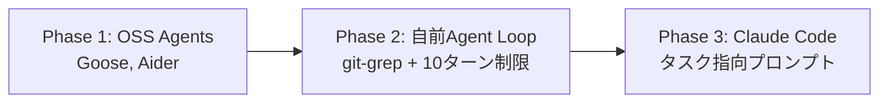

本記事は [Spotify Engineering: Background Coding Agents: Context Engineering (Honk, Part 2)](https://engineering.atspotify.com/2025/11/context-engineering-background-coding-agents-part-2) の解説記事です。

## ブログ概要（Summary）

Spotifyは社内のバックグラウンドコーディングエージェント「Honk」を用いて、大規模コードマイグレーションを自動化し、1,500件以上のPull Requestを本番環境にマージしている。本記事で取り上げるPart 2では、Honkのコンテキストエンジニアリング——すなわちプロンプト設計、ツール選択、エージェント特性に合わせた最適化——についての実践知見が報告されている。SpotifyはGoose、Aider等のオープンソースエージェントから始まり、自前のエージェントループを経て、最終的にClaude Codeを採用するに至った。このプロセスで得られた教訓は、AIコーディングツールの実践的な活用を目指すすべてのチームにとって参考になる。

この記事は [Zenn記事: Claude CodeとCursor IDEの併用で自動コーディング精度を高める実践手法](https://zenn.dev/0h_n0/articles/d10139cd09e957) の深掘りです。

## 情報源

- **種別**: 企業テックブログ
- **URL**: [https://engineering.atspotify.com/2025/11/context-engineering-background-coding-agents-part-2](https://engineering.atspotify.com/2025/11/context-engineering-background-coding-agents-part-2)
- **組織**: Spotify Engineering
- **発表日**: 2025年11月

## 技術的背景（Technical Background）

Spotifyは数千のマイクロサービスと内部ライブラリを運用しており、プラットフォームの進化に伴うコードマイグレーション（API変更、依存ライブラリ更新、フレームワーク移行等）が恒常的に発生している。これらのマイグレーションは技術的には単純だが、対象リポジトリの数が膨大であるため、人手での対応はスケールしない。

この課題に対してSpotifyは、AIコーディングエージェントによる自動化を模索した。ブログシリーズの構成は以下の通りである：

- **Part 1**: Honkの全体像と1,500+ PRマージの実績
- **Part 2（本記事の対象）**: コンテキストエンジニアリングの実践知見
- **Part 3**: フィードバックループによる結果の予測可能性向上

Honkの基盤にはAnthropicのClaude CodeおよびClaude Agent SDKが使われており、Spotifyの内部プラットフォーム「Backstage」やFleet Management（2022年から運用）と統合されている。

## 実装アーキテクチャ（Architecture）

### エージェント選定の変遷

Spotifyのブログによると、チームは以下の3段階を経てClaude Codeに到達している。



**Phase 1: オープンソースエージェント（Goose, Aider）**

Spotifyのブログによると、GooseやAiderは初期のタスクでは効果を示したが、「マイグレーションユースケースにスケールさせようとした際にすぐに問題にぶつかった」とされている。具体的には、複数リポジトリにまたがるマージ可能なPull Requestを安定的に生成することが困難だった。

**Phase 2: 自前のエージェントループ**

チームは自前のソリューションを構築した。このアプローチでは、ユーザーが `git-grep` コマンドで対象ファイルを明示的に指定し、エージェントのコンテキストを10ターン、3回のリトライに制限していた。しかし、複数ファイルにまたがるカスケーディングな変更が必要なケースでは、ターン数の枯渇やコンテキスト消失が発生した。

**Phase 3: Claude Code**

最終的にClaude Codeが「最もパフォーマンスの高いエージェント」として選択された。約50のマイグレーションに適用され、ほとんどのバックグラウンドエージェントPRが本番にマージされている。

### ツール選択の哲学

Spotifyのアプローチで注目すべきは、**エージェントに提供するツールを意図的に制限している**点である。ブログでは以下のように報告されている：

多数のMCP（Model Context Protocol）ツールを公開するのではなく、以下の3つに限定している：

1. **検証ツール**: フォーマッタ、リンター、テストを実行するツール
2. **標準化されたGitアクセス**: サブコマンドが制限されたGit操作
3. **Bash**: 厳格なコマンド許可リスト付き

コード検索ツールやドキュメント参照ツールは**あえて提供せず**、ユーザーが必要なコンテキストをプロンプトに直接埋め込む方式を採用している。この設計思想の背後には、ツールが増えるほどエージェントの判断に曖昧さが生じ、予測不可能な動作につながるという経験則がある。

## プロンプト設計の実践知見

### エージェント特性に応じたプロンプト

Spotifyのブログで報告されている最も重要な知見の一つは、**エージェントの種類によって最適なプロンプトスタイルが異なる**という発見である：

| エージェント | 最適なプロンプトスタイル | 理由 |
|-------------|----------------------|------|
| 自前Agent Loop | **厳密なステップバイステップ** | ツーン制限があり、各ステップを明示する必要がある |
| Claude Code | **ゴール記述型（End State）** | エージェント自身が手順を判断する能力があり、過度に詳細な指示は逆効果 |

Zenn記事で紹介されているClaude CodeとCursor IDEの使い分けにも通じる知見である。Claude Codeは「完成状態を記述して任せる」アプローチが適しており、Cursorの対話的なモードとは異なる設計原則が要求される。

### プロンプト設計6原則

ブログで報告されている原則を整理する：

**原則1: エージェント能力に合わせたプロンプト設計**

Claude Codeに対しては、ステップバイステップの手順ではなく、望ましい最終状態（End State）を記述する。エージェントが到達方法を自ら判断する余地を残す。

**原則2: 前提条件の明示**

特に「実行してはならない条件」を明示的に記述する。ブログでは「preconditionsを明示的に、特にアクションを阻止する条件を明確にすること」と推奨されている。

**原則3: 具体的なコード例の提供**

抽象的な指示ではなく、変更前後のコード例を含めることで、エージェントの出力品質が向上する。

**原則4: 検証可能なゴールの設定**

テストで検証できるゴールを設定することで、エージェントの自律的なフィードバックループが機能する。

**原則5: 1プロンプト1変更**

複数の変更を1つのプロンプトに詰め込むと、コンテキスト枯渇のリスクが高まる。

**原則6: セッション後のフィードバック要求**

エージェントにセッション終了時のフィードバックを求め、次回のプロンプト改善に活用する。

### 現在の課題

ブログでは以下の未解決課題も率直に報告されている：

- プロンプトの進化は試行錯誤ベースであり、体系的な評価フレームワークがない
- マージされたPRが元の問題を実際に解決したかどうかの確認は、今後のフィードバックループメカニズム（Part 3で詳述）に委ねられている

## パフォーマンス最適化（Performance）

### 実績

ブログシリーズ全体での実績：

- **1,500+** のPull Requestがマージ済み
- **約50** のマイグレーションに適用
- 2025年12月以降、一部のシニアエンジニアは手動でコードを書くことをやめ、すべてHonk経由でAI生成コードを使用

### インフラ基盤

Honkの成功は、Spotify側のインフラ投資に依存している点も報告されている：

- **Fleet Management**（2022年〜）: 大規模なサービス群の管理
- **Backstage**: Spotify発のオープンソース開発者ポータル
- **標準化されたビルドシステム**: 一貫したCI/CD
- **包括的なテストスイート**: エージェントの自動検証に不可欠

ブログでは、これらのインフラなしにはHonkの成功は得られなかったと明示されている。

## 運用での学び（Production Lessons）

### 2つのアンチパターン

ブログで指摘されている主要なアンチパターン：

1. **過度に汎用的なプロンプト**: エージェントに意図を「テレパシーで」推測させようとするパターン。結果が不安定になる。
2. **過度に詳細なプロンプト**: すべてのケースをカバーしようとするパターン。エージェントが予想外の状況に遭遇した際に破綻する。

### 最適なバランス

ブログの知見を踏まえると、最適なプロンプトは「目標は明確に、手段は柔軟に」という原則に従う。具体的には：

```markdown
# 良い例（Claude Code向け）
このリポジトリの全APIエンドポイントで
deprecated_auth_v1 を auth_v2 に移行してください。

## 前提条件
- auth_v2 は既に依存関係に含まれている
- 変更後は全テストが通ること
- deprecated_auth_v1 のインポートが残っていないこと

## コード例
変更前:
from mylib.auth import deprecated_auth_v1 as auth
変更後:
from mylib.auth import auth_v2 as auth
```

```markdown
# 悪い例（過度に詳細）
1. まず grep -r "deprecated_auth_v1" を実行
2. 各ファイルを開く
3. import文を変更
4. 関数呼び出しを変更
5. テストを実行
6. ...（20ステップ）
```

## 学術研究との関連（Academic Connection）

### コンテキストエンジニアリングの理論的基盤

Spotifyの実践知見は、学術研究とも整合する。Birgitta Böckeler氏（Thoughtworks）の[martinfowler.comの記事](https://martinfowler.com/articles/exploring-gen-ai/context-engineering-coding-agents.html)で定義されている「コンテキストエンジニアリング = モデルが見るものをキュレーションし、より良い結果を得ること」は、Spotifyがツール数を制限し、プロンプトに必要な情報を直接埋め込む方式と一致する。

### AGENTS.md評価研究との比較

arXiv 2602.11988の研究（本シリーズの別記事で解説）では、AGENTS.mdの効果は最大+4.21%と控えめであると報告されている。一方、Spotifyのアプローチは静的なファイル（AGENTS.md）に頼るのではなく、タスクごとに最適化されたプロンプトを動的に構築しており、この違いが実績の差に寄与している可能性がある。

## まとめと実践への示唆

Spotifyの「Honk」は、Claude Codeを基盤としたバックグラウンドコーディングエージェントの大規模運用事例として、いくつかの重要な教訓を提示している：

1. **エージェント選定は段階的に**: OSS → 自前 → Claude Codeと段階を踏むことで、要件と制約を明確化できる
2. **ツール制限が品質を向上させる**: 多くのツールを与えるほど良いわけではなく、検証・Git・Bashの3つに絞ることで予測可能性が向上
3. **プロンプトはエージェント特性に合わせる**: Claude Codeにはゴール記述型、ステップバイステップが必要なエージェントには手順型
4. **インフラ投資が前提**: 標準化されたビルドシステム、テストスイート、Fleet Managementなしにはスケールしない
5. **「プロンプト作成は難しい」**: ブログでもこの点が率直に認められており、体系的な評価フレームワークの構築が今後の課題

## 参考文献

- **Blog URL**: [https://engineering.atspotify.com/2025/11/context-engineering-background-coding-agents-part-2](https://engineering.atspotify.com/2025/11/context-engineering-background-coding-agents-part-2)
- **Part 1**: [https://engineering.atspotify.com/2025/11/spotifys-background-coding-agent-part-1](https://engineering.atspotify.com/2025/11/spotifys-background-coding-agent-part-1)
- **Part 3**: [https://engineering.atspotify.com/2025/12/feedback-loops-background-coding-agents-part-3](https://engineering.atspotify.com/2025/12/feedback-loops-background-coding-agents-part-3)
- **Related Zenn article**: [https://zenn.dev/0h_n0/articles/d10139cd09e957](https://zenn.dev/0h_n0/articles/d10139cd09e957)

---

:::message
本記事は [Spotify Engineering Blog](https://engineering.atspotify.com/2025/11/context-engineering-background-coding-agents-part-2) の解説記事であり、著者自身が実験を行ったものではありません。数値・結果はすべてSpotify Engineeringブログからの引用です。
:::
