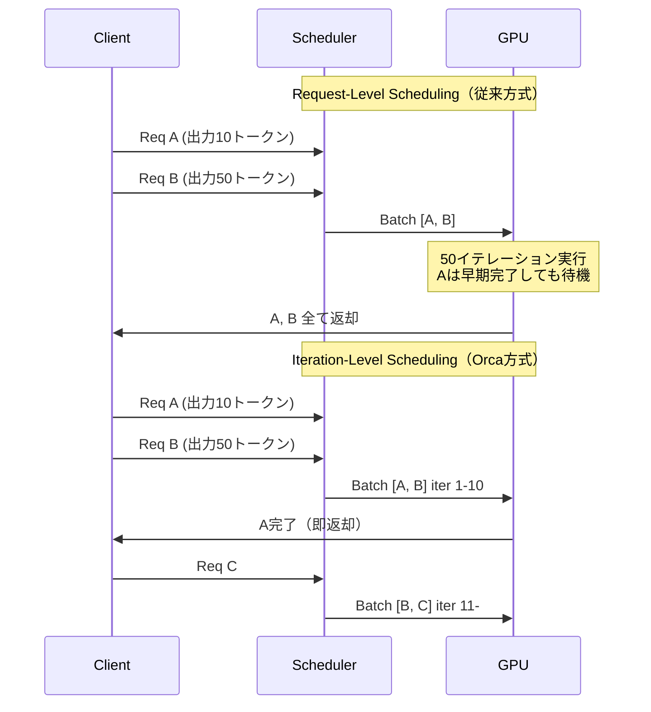
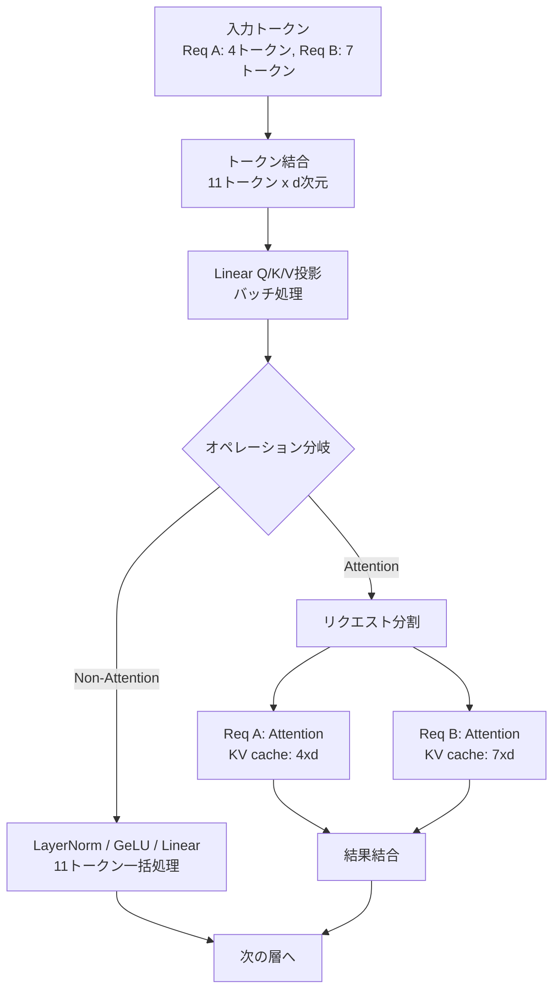

本記事は [https://www.usenix.org/conference/osdi22/presentation/yu](https://www.usenix.org/conference/osdi22/presentation/yu) の解説記事です。

## 論文概要（Abstract）

Orcaは、transformerベースの生成モデルに特化した分散サービングシステムである。著者らは、既存の推論サービングシステムがリクエスト単位でスケジューリングを行うことでGPU利用率が低下する問題を指摘し、**iteration-level scheduling**（イテレーション単位スケジューリング）と**selective batching**（選択的バッチング）という2つの手法を提案している。GPT-3 175Bモデルにおいて、NVIDIA FasterTransformerと比較して同等レイテンシで36.9倍のスループット改善を達成したと報告されている。

この記事は [Zenn記事: LLMバッチ処理の並列最適化：asyncio×キュー×トークンバジェットで処理速度を8倍にする](https://zenn.dev/0h_n0/articles/5f7f36e631d6b0) の深掘りです。

## 情報源

- **会議名**: OSDI 2022（16th USENIX Symposium on Operating Systems Design and Implementation）
- **年**: 2022
- **URL**: [https://www.usenix.org/conference/osdi22/presentation/yu](https://www.usenix.org/conference/osdi22/presentation/yu)
- **著者**: Gyeong-In Yu, Joo Seong Jeong, Geon-Woo Kim, Soojeong Kim, Byung-Gon Chun（Seoul National University, FriendliAI）
- **実装規模**: C++ 13,000行（CUDA, gRPC, NCCL使用）

## カンファレンス情報

**OSDIについて**: OSDI（Operating Systems Design and Implementation）は、USENIXが主催するシステム分野のトップカンファレンスの1つである。SOSPと並んでオペレーティングシステム・分散システム領域の最高峰会議として知られ、採択率は通常15-20%程度と競争率が高い。Orcaは2022年7月にカリフォルニア州カールスバッドで開催されたOSDI'22で発表された。

## 背景と動機（Background & Motivation）

### 自己回帰生成の特性

transformerベースの生成モデル（GPT-3等）は、テキスト生成時に**自己回帰的**にトークンを1つずつ生成する。1つのリクエストを処理するためにモデルを複数回実行する必要があり、各イテレーションで1トークンが出力される。この性質が、従来のサービングシステムにおける根本的な非効率を生んでいた。

### 従来のrequest-level schedulingの問題

従来の推論サービングシステム（NVIDIA FasterTransformer等）は**リクエスト単位**でバッチを構成し、バッチ内の全リクエストが完了するまで次のバッチを開始しない。この方式には以下の問題がある。

1. **早期完了リクエストの待機**: バッチ内で生成が早く終わったリクエストが、他のリクエストの完了を待つ必要がある
2. **新規リクエストの待機**: 新たに到着したリクエストが、現行バッチの完了まで処理開始できない
3. **GPU利用率の低下**: 生成長のばらつきが大きいほど、パディングによる無駄な計算が増大する



## 技術的詳細（Technical Details）

### Iteration-Level Scheduling

Orcaの核心は、スケジューリングの粒度を「リクエスト」から「イテレーション」に変更した点にある。スケジューラは各イテレーションの前にバッチ構成を決定し、実行エンジンにモデルの1イテレーション分だけを実行させる。

具体的なスケジューリングの流れは以下の通りである。

1. **イテレーション開始前**: スケジューラが現在のバッチ構成を評価
2. **完了リクエストの除外**: EOSトークンを出力したリクエストをバッチから除外し、結果をクライアントに返却
3. **新規リクエストの追加**: 空いたスロットに待機キューから新しいリクエストを追加
4. **イテレーション実行**: 更新されたバッチで1イテレーション実行

著者らはスケジューリングアルゴリズムとしてFCFS（First-Come-First-Served）を採用している。

```python
from dataclasses import dataclass, field


@dataclass
class Request:
    """推論リクエストを表すデータクラス"""
    request_id: int
    input_tokens: list[int]
    generated_tokens: list[int] = field(default_factory=list)
    max_tokens: int = 512

    @property
    def is_finished(self) -> bool:
        EOS_TOKEN = 50256
        if not self.generated_tokens:
            return False
        return self.generated_tokens[-1] == EOS_TOKEN or len(self.generated_tokens) >= self.max_tokens


class IterationLevelScheduler:
    """Orcaのiteration-level schedulingの擬似実装"""

    def __init__(self, max_batch_size: int):
        self.max_batch_size = max_batch_size
        self.waiting_queue: list[Request] = []
        self.running_batch: list[Request] = []

    def schedule_iteration(self) -> list[Request]:
        """1イテレーション分のバッチを構成する（FCFS）"""
        self.running_batch = [r for r in self.running_batch if not r.is_finished]
        while self.waiting_queue and len(self.running_batch) < self.max_batch_size:
            self.running_batch.append(self.waiting_queue.pop(0))
        return self.running_batch
```

### Selective Batching

iteration-level schedulingを実現するうえで、transformerモデルの全オペレーションに一律にバッチングを適用することはできない。著者らはtransformer層のオペレーションを2種類に分類し、**選択的にバッチングを適用する**手法を提案している。

#### Non-Attentionオペレーション（バッチング適用可能）

Linear、LayerNorm、GeLU等のオペレーションは各トークンが独立に処理される。異なるリクエストに属するトークンであっても、1つのテンソルに結合して**トークン単位**でバッチ処理が可能である。

$$
\text{Linear}(\text{concat}(\mathbf{x}_A, \mathbf{x}_B)) = \text{concat}(\text{Linear}(\mathbf{x}_A), \text{Linear}(\mathbf{x}_B))
$$

ここで $\mathbf{x}_A \in \mathbb{R}^{4 \times d}$、$\mathbf{x}_B \in \mathbb{R}^{7 \times d}$ であり、$d$ はモデルの隠れ層次元数である。

#### Attentionオペレーション（個別処理が必要）

Self-Attentionでは、各リクエストが異なる長さのKVキャッシュを保持しているため、単純なバッチ処理ができない。

$$
\text{Attention}(Q_i, K_i, V_i) = \text{softmax}\left(\frac{Q_i K_i^T}{\sqrt{d_k}}\right) V_i
$$

ここで添字 $i$ はリクエストIDを表す。$K_i \in \mathbb{R}^{s_i \times d_k}$、$V_i \in \mathbb{R}^{s_i \times d_v}$ であり、$s_i$ はリクエスト $i$ の現在のシーケンス長である。リクエストごとに $s_i$ が異なるため、$K_i$ と $K_j$ を単純にバッチ化できない。著者らはAttentionオペレーションではバッチを**リクエスト単位に分割**し個別処理する方式を採用しており、この分割が全体効率に与える影響は小さいと報告している。



### PrefillフェーズとDecodeフェーズ

transformerベースの生成モデルの推論には2つのフェーズがある。

- **Prefill（初期化）**: プロンプトの全トークンを一度に処理し、KVキャッシュを構築する
- **Decode（生成）**: 1トークンずつ自己回帰的に生成する

Orcaの実装ではバッチ内の全リクエストが同一フェーズであることを前提としている。新規リクエストのprefillは既存のdecodeバッチとは分離して実行される。

### 分散実行アーキテクチャ

Orcaは数千億パラメータのモデルに対応するため、**intra-layer parallelism**（テンソル並列）と**inter-layer parallelism**（パイプライン並列）の両方を採用している。

- **制御プレーン**: gRPCによるスケジューラ-ワーカー間通信
- **データプレーン**: NCCLによるGPU間テンソル転送
- **カスタムカーネル**: LayerNorm、Attention、GeLU用のCUDAフュージョンカーネル

## 実装のポイント

### KVキャッシュのメモリ管理

Orcaでは、KVキャッシュ用GPUメモリを**最大トークン数分**あらかじめ確保する方式を採用している。この方式はシンプルだが、生成長が最大長より短い場合にメモリが無駄になる課題がある。この課題は後続のvLLMが提案した**PagedAttention**により解決された。

### バッチサイズの動的制御

バッチサイズの上限はGPUメモリ制約で決まる。

$$
\sum_{i=1}^{B} s_i \cdot 2 \cdot L \cdot d \leq M_{\text{KV}}
$$

ここで $B$ はバッチサイズ、$s_i$ はリクエスト $i$ のシーケンス長、$L$ はtransformer層数、$d$ はヘッド次元数、$M_{\text{KV}}$ はKVキャッシュ用GPUメモリ量である。

### カスタムCUDAカーネル

著者らはselective batchingの効率的実装のため、LayerNorm、Attention、GeLUのフュージョンカーネルを開発している。Attentionカーネルではリクエストごとに異なるKVキャッシュ長を処理する必要があり、可変長テンソル対応のカスタム実装が不可欠である。

## Production Deployment Guide

Orcaの手法は現在vLLM、SGLang、TensorRT-LLM等の主要推論エンジンに実装されている。ここではOrcaの知見を活用した本番環境構築パターンを示す。

### AWS実装パターン（コスト最適化重視）

**コスト試算の注意**: 以下は2026年3月時点のAWS東京リージョンの概算値である。実際のコストはトラフィックパターン、リージョン、バースト使用量により変動する。

| 構成 | トラフィック | アーキテクチャ | 月額概算 |
|------|------------|--------------|---------|
| Small | ~100 req/日 | Lambda + Bedrock | $50-150 |
| Medium | ~1,000 req/日 | ECS Fargate + vLLM | $800-2,000 |
| Large | 10,000+ req/日 | EKS + GPU Spot + vLLM | $3,000-8,000 |

**Small構成**: Bedrock APIに推論を委任するサーバーレス構成。Bedrock $30-80、Lambda $5-15、DynamoDBキャッシュ $5-10（月額）。

**Medium構成**: ECS Fargate上でvLLMコンテナを稼働しcontinuous batchingを直接活用。GPU搭載インスタンス（g5.xlarge）1-2台。

**Large構成**: EKS上でvLLMをデプロイし、KarpenterでGPU Spot Instances（g5系）を優先使用。コスト最大70%削減。

**コスト削減テクニック**: Spot Instances（最大70-90%削減）、Reserved Instances（1年コミットで40%削減）、vLLM prefix caching（KVキャッシュ再利用で30-50%削減）、continuous batching活用（スループット3-8倍向上）。

### Terraformインフラコード

**Small構成（Serverless）**:

```hcl
resource "aws_lambda_function" "inference" {
  function_name = "llm-inference"
  runtime       = "python3.12"
  handler       = "handler.lambda_handler"
  role          = aws_iam_role.lambda_exec.arn
  timeout       = 120
  memory_size   = 512
  environment { variables = {
    CACHE_TABLE = aws_dynamodb_table.cache.name
    MODEL_ID    = "anthropic.claude-3-haiku-20240307-v1:0"
  }}
}

resource "aws_dynamodb_table" "cache" {
  name         = "llm-response-cache"
  billing_mode = "PAY_PER_REQUEST"
  hash_key     = "prompt_hash"
  attribute { name = "prompt_hash", type = "S" }
  server_side_encryption { enabled = true }
}
```

**Large構成（EKS + Karpenter Spot GPU）**:

```hcl
module "eks" {
  source          = "terraform-aws-modules/eks/aws"
  version         = "~> 20.0"
  cluster_name    = "llm-serving-cluster"
  cluster_version = "1.31"
}

resource "kubectl_manifest" "karpenter_nodepool" {
  yaml_body = yamlencode({
    apiVersion = "karpenter.sh/v1", kind = "NodePool"
    spec = {
      template = { spec = { requirements = [
        { key = "karpenter.sh/capacity-type", operator = "In",
          values = ["spot", "on-demand"] },
        { key = "node.kubernetes.io/instance-type", operator = "In",
          values = ["g5.xlarge", "g5.2xlarge", "g5.4xlarge"] },
      ]}}
      limits     = { "nvidia.com/gpu" = "16" }
      disruption = { consolidationPolicy = "WhenEmptyOrUnderutilized" }
    }
  })
}
```

### 運用・監視設定

```python
import boto3
from aws_xray_sdk.core import xray_recorder, patch_all

patch_all()


def create_gpu_utilization_alarm(instance_id: str, sns_arn: str) -> dict:
    """GPU利用率低下アラーム（continuous batchingの効果監視）"""
    cw = boto3.client("cloudwatch", region_name="ap-northeast-1")
    return cw.put_metric_alarm(
        AlarmName=f"gpu-underutil-{instance_id}",
        MetricName="GPUUtilization", Namespace="Custom/GPU",
        Statistic="Average", Period=300, EvaluationPeriods=3,
        Threshold=20.0, ComparisonOperator="LessThanThreshold",
        AlarmActions=[sns_arn],
    )


@xray_recorder.capture("llm_inference")
def invoke_model(prompt: str, model_id: str) -> str:
    """X-Rayトレース付きLLM推論"""
    subsegment = xray_recorder.current_subsegment()
    subsegment.put_annotation("model_id", model_id)
    bedrock = boto3.client("bedrock-runtime")
    response = bedrock.invoke_model(modelId=model_id, body=prompt)
    return response["body"].read().decode()
```

### コスト最適化チェックリスト

**アーキテクチャ選択**:
- [ ] トラフィック ~100 req/日 → Serverless、~1,000 → Hybrid、10,000+ → Container

**リソース最適化**:
- [ ] GPU Spot Instances優先（最大70-90%削減）
- [ ] Reserved Instances 1年コミットでベースライン確保
- [ ] Karpenter自動スケールダウン設定
- [ ] 不要時間帯のスケールゼロ

**LLMコスト削減**:
- [ ] vLLM prefix caching有効化
- [ ] continuous batching max_batch_size最適化
- [ ] Bedrock Batch API使用（非リアルタイム処理に50%削減）
- [ ] トークン数制限・モデル選択ロジック

**監視・アラート**:
- [ ] AWS Budgets（月額上限 + 80%閾値通知）
- [ ] CloudWatch GPU利用率アラーム
- [ ] Cost Anomaly Detection有効化
- [ ] 日次コストレポート自動送信

**リソース管理**:
- [ ] 未使用GPUインスタンス自動停止
- [ ] タグ戦略（Environment, Team, CostCenter）
- [ ] ECRイメージ・EBSライフサイクルポリシー
- [ ] 開発環境の夜間・週末停止

## 実験結果（Results）

著者らはGPT-3アーキテクチャに基づく複数サイズのモデル（13B、101B、175B、341Bパラメータ）で評価を実施している。ベースラインはNVIDIA FasterTransformerである。

| 比較項目 | FasterTransformer | Orca | 改善率 |
|---------|-------------------|------|--------|
| スループット（同等レイテンシ） | 1x（ベースライン） | 36.9x | 36.9倍 |

**スループット改善の要因**: 著者らは改善の主因としてiteration-level schedulingによるGPU利用率の向上を挙げている。従来方式ではバッチ内の最長リクエストに律速されるため、短いリクエスト完了後もGPUリソースが浪費されていた。Orcaでは完了リクエストを即座に返却し新規リクエストを追加することで、GPU利用率を継続的に高く維持できる。

**出力長分布の影響**: 出力長のばらつきが大きいほどOrcaの優位性が顕著になると報告されている。プロダクション環境では出力長が10-500トークンと大きくばらつくため、Orcaの恩恵は大きい。

## 実運用への応用（Practical Applications）

### Continuous Batchingの普及

Orcaが提案したiteration-level scheduling（continuous batching）は、現在のLLMサービング基盤の標準技術となっている。

- **vLLM**: PagedAttentionとcontinuous batchingを組み合わせ、KVキャッシュのメモリ効率をさらに改善
- **SGLang**: RadixAttentionによるprefix cachingとcontinuous batchingを統合
- **TensorRT-LLM**: NVIDIA公式推論エンジンもcontinuous batchingを標準搭載
- **FriendliAI**: Orcaの著者らが創業した企業が商用サービスとして提供

### Zenn記事との関連

関連Zenn記事で解説されているvLLMのトークンバジェットパラメータやasyncio並列呼び出しパターンは、Orcaが確立したcontinuous batchingの恩恵を最大限に活用するためのクライアントサイド最適化に相当する。サーバーサイドがOrcaの手法で高スループットを実現し、クライアントサイドがasyncioで並列リクエストを投入することで、エンドツーエンドの処理効率が最大化される。

### 本番環境での考慮事項

1. **Prefill-Decode分離**: Orcaではprefillとdecodeが同一バッチに混在できない。後続研究（Sarathi, Splitwise等）でprefill-decode disaggregationが提案されている
2. **SLO管理**: バッチサイズが動的に変化するため、レイテンシSLOの管理が複雑になる
3. **メモリプランニング**: KVキャッシュのメモリ使用量が動的変動するため、OOM回避のadmission control設計が必要

## 関連研究

- **vLLM (Kwon et al., SOSP 2023)**: Orcaのcontinuous batchingにPagedAttentionを組み合わせ、KVキャッシュのメモリ断片化を解消
- **FasterTransformer (NVIDIA)**: Orcaの評価ベースライン。request-level schedulingの従来型推論エンジン
- **Sarathi (Agrawal et al., 2023)**: prefillとdecodeのチャンク化混合バッチングを提案し、Orcaのprefill-decode分離制約を緩和
- **SGLang (Zheng et al., 2024)**: RadixAttentionによるprefix cachingとcontinuous batchingを統合

## まとめと今後の展望

Orcaはtransformerベース生成モデルのサービングにおいてiteration-level schedulingとselective batchingを提案し、GPT-3 175Bモデルで36.9倍のスループット改善を実証した。この論文が確立したcontinuous batchingの概念は、vLLM、SGLang、TensorRT-LLMなど現在の主要推論エンジンの基盤技術となっている。

今後の研究方向としては、prefillとdecodeの混合スケジューリング、KVキャッシュの分散管理、異種GPUクラスタでの最適配置などが活発に研究されている。

## 参考文献

- **Conference URL**: [https://www.usenix.org/conference/osdi22/presentation/yu](https://www.usenix.org/conference/osdi22/presentation/yu)
- **PDF**: [https://www.usenix.org/system/files/osdi22-yu.pdf](https://www.usenix.org/system/files/osdi22-yu.pdf)
- **FriendliAI Research**: [https://friendli.ai/research/orca](https://friendli.ai/research/orca)
- **Related Zenn article**: [https://zenn.dev/0h_n0/articles/5f7f36e631d6b0](https://zenn.dev/0h_n0/articles/5f7f36e631d6b0)
