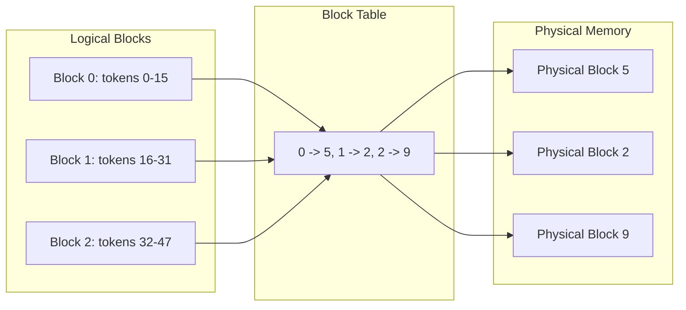
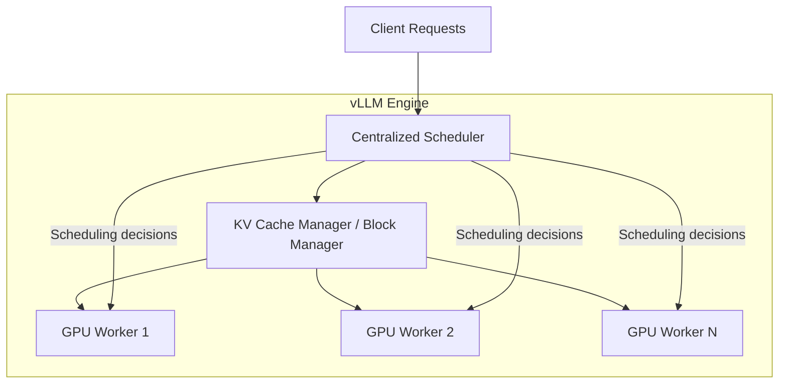

本記事は [https://arxiv.org/abs/2309.06180](https://arxiv.org/abs/2309.06180) の解説記事です。本記事の著者自身が実験を行ったものではなく、論文の内容を解説・引用したものです。

## 論文概要（Abstract）

PagedAttentionは、OSの仮想メモリにおけるページング機構からインスパイアされたattentionアルゴリズムである。LLMサービングにおけるKVキャッシュのメモリ管理を最適化し、従来システムで60-80%に達していたKVキャッシュメモリの浪費をほぼゼロに削減する。著者らはPagedAttentionを基盤としたLLMサービングエンジンvLLMを構築し、FasterTransformerやOrcaと比較して同等のレイテンシで2-4倍のスループット向上を達成したと報告している。

この記事は [Zenn記事: LLMバッチ処理の並列最適化：asyncio×キュー×トークンバジェットで処理速度を8倍にする](https://zenn.dev/0h_n0/articles/5f7f36e631d6b0) の深掘りです。

## 情報源

- **arXiv ID**: 2309.06180
- **URL**: [https://arxiv.org/abs/2309.06180](https://arxiv.org/abs/2309.06180)
- **著者**: Woosuk Kwon, Zhuohan Li, Siyuan Zhuang, et al.（UC Berkeley）
- **発表年**: 2023（SOSP 2023）
- **分野**: cs.LG, cs.DC

## 背景と動機（Background & Motivation）

LLMサービングにおいて、GPUメモリの大部分はモデルパラメータとKVキャッシュで占有される。例えばOPT-13BモデルをNVIDIA A100（40GB）で運用する場合、モデルパラメータが約65%、KVキャッシュが約30%のGPUメモリを消費する。KVキャッシュはリクエストごとに動的に増減し、そのサイズは入出力のシーケンス長に依存するため事前予測が困難である。

従来のLLMサービングシステムでは、KVキャッシュに連続したメモリ領域を事前に確保するアプローチが一般的であった。しかし著者らの分析によれば、この方式では以下3種類のメモリ浪費が発生し、KVキャッシュメモリの実質利用率は20.4-38.4%に留まっていた。

1. **予約（Reservation）**: 最大シーケンス長分のメモリを事前確保するが、実際の出力長は不明
2. **内部断片化（Internal Fragmentation）**: 確保した領域のうち、実際のトークン生成に使われない部分
3. **外部断片化（External Fragmentation）**: 固定サイズブロックと可変長シーケンスの不一致による隙間

この60-80%のメモリ浪費が、同時処理可能なリクエスト数（バッチサイズ）を制限し、GPUのスループットを大幅に低下させる主因であった。

## 主要な貢献（Key Contributions）

- **PagedAttentionアルゴリズム**: OSの仮想メモリページングを応用し、KVキャッシュを固定サイズのブロックに分割して非連続メモリ上に格納するattention機構を提案
- **vLLMサービングエンジン**: PagedAttentionを基盤とした高スループットLLMサービングシステムの構築。集中型スケジューラ、ブロックマネージャ、GPU Workerから構成
- **メモリ共有機構**: ブロックテーブルと参照カウントを用いたCopy-on-Write方式により、パラレルサンプリングやビームサーチでのKVキャッシュ共有を実現。ビームサーチで最大55.2%のメモリ削減

## 技術的詳細（Technical Details）

### PagedAttentionのメモリ管理

PagedAttentionの核心は、KVキャッシュを固定サイズの**ブロック**に分割し、OSの仮想メモリのように論理ブロックを物理ブロックにマッピングする点にある。

各シーケンスのKVキャッシュは論理ブロック列として管理される。1ブロックには$B$個のトークンのKeyベクトルとValueベクトルが格納される（典型的な$B$は16）。ブロックテーブルが論理ブロック番号から物理ブロック番号へのマッピングを保持する。



この非連続配置により、外部断片化が完全に解消される。内部断片化はシーケンスの最終ブロックのみで発生し、浪費率は4%未満に抑えられると著者らは報告している。

### Attention計算

標準的なself-attentionは以下の式で計算される。

$$
\text{Attention}(Q, K, V) = \text{softmax}\left(\frac{QK^T}{\sqrt{d_k}}\right)V
$$

ここで、
- $Q \in \mathbb{R}^{1 \times d_k}$: 現在のトークンのQueryベクトル（自己回帰生成時）
- $K \in \mathbb{R}^{n \times d_k}$: これまでの全トークンのKeyベクトル
- $V \in \mathbb{R}^{n \times d_v}$: これまでの全トークンのValueベクトル
- $d_k$: Keyの次元数
- $n$: シーケンス長

PagedAttentionでは、$K$と$V$がブロック単位で物理メモリに分散格納されている。attentionスコアの計算は各物理ブロックに対して個別に実行され、最終的に結果が統合される。ブロック$j$に格納されたKey行列を$K_j \in \mathbb{R}^{B \times d_k}$、Value行列を$V_j \in \mathbb{R}^{B \times d_v}$とすると、PagedAttentionカーネルはブロックテーブルを参照して各$K_j$, $V_j$の物理アドレスを取得し、分散されたブロックから正しい結果を計算する。

$$
A_j = \frac{Q K_j^T}{\sqrt{d_k}}, \quad \text{output} = \text{softmax}\left([A_0, A_1, \ldots, A_{\lceil n/B \rceil - 1}]\right) \cdot [V_0; V_1; \ldots]
$$

### Copy-on-Write（CoW）によるメモリ共有

パラレルサンプリングやビームサーチでは、同一プロンプトから複数の出力シーケンスが生成される。PagedAttentionでは、共有されるプロンプト部分のKVキャッシュブロックを物理的にコピーせず、複数のシーケンスのブロックテーブルから同一の物理ブロックを参照する。

各物理ブロックには参照カウントが付与される。あるシーケンスが共有ブロックに書き込みを行う必要が生じた場合にのみ、そのブロックのコピーを作成する（Copy-on-Write）。

```python
def copy_on_write(block_table: dict, seq_id: int, logical_block: int,
                  block_manager: "BlockManager") -> int:
    """Copy-on-Write: 共有ブロックへの書き込み時にコピーを作成

    Args:
        block_table: シーケンスごとの論理->物理ブロックマッピング
        seq_id: 書き込み対象のシーケンスID
        logical_block: 書き込み対象の論理ブロック番号
        block_manager: 物理ブロックの割り当てを管理するマネージャ

    Returns:
        書き込み先の物理ブロック番号
    """
    physical_block = block_table[seq_id][logical_block]
    ref_count = block_manager.get_ref_count(physical_block)

    if ref_count > 1:
        # 他のシーケンスも参照中 -> コピーを作成
        new_block = block_manager.allocate()
        block_manager.copy_block(physical_block, new_block)
        block_manager.decrement_ref_count(physical_block)
        block_table[seq_id][logical_block] = new_block
        return new_block
    else:
        # 自分だけが参照 -> そのまま書き込み
        return physical_block
```

著者らの報告によれば、パラレルサンプリングで6.1-9.8%、ビームサーチ（幅6）で最大55.2%のメモリ削減を達成している。

### vLLMシステムアーキテクチャ

vLLMは以下の3コンポーネントで構成される。



- **Centralized Scheduler**: FCFS（First-Come-First-Served）方式でリクエストをバッチ処理。メモリ不足時はシーケンスのプリエンプション（物理ブロックの解放とCPUへのスワップ、または再計算）を実行
- **Block Manager**: 論理ブロックと物理ブロックのマッピング管理、参照カウント管理、CoW処理を担当
- **GPU Workers**: 実際のモデル推論とPagedAttentionカーネルの実行

スケジューラはiteration-levelスケジューリングを採用しており、各デコードステップごとにバッチの構成を動的に変更できる。これによりOrcaと同様の連続バッチ処理（continuous batching）を実現しつつ、メモリ効率の面で大幅に優れた性能を発揮する。

## 実装のポイント（Implementation）

### ブロックサイズの選択

論文ではブロックサイズ$B = 16$トークンを基本としている。これはGPU演算効率とメモリ断片化のトレードオフから決定されている。$B$が大きいほどGPUカーネルの並列処理効率が向上するが、最終ブロックの内部断片化も増加する。OPT-13Bモデルでは1ブロックあたり約12.8KBとなる。

### GPUカーネル最適化

PagedAttentionカーネルはCUDAで実装されており、ブロックテーブルの間接参照を効率的に処理する。各CUDAスレッドブロックが1つの物理ブロックを処理し、shared memoryを活用してブロック内のattention計算を高速化している。

### プリエンプション戦略

メモリ不足時の2つの回復戦略がある。

1. **Swapping**: 物理ブロックをCPUメモリへ退避。PCIeバス帯域幅がボトルネックとなる
2. **Recomputation**: プリエンプトされたシーケンスのKVキャッシュを再計算。GPU計算コストが発生するが、CPU-GPU間転送が不要

著者らは短いシーケンスではRecomputation、長いシーケンスではSwappingが有利と報告している。

## Production Deployment Guide

### AWS実装パターン（コスト最適化重視）

vLLMベースのLLMサービングをAWS上にデプロイする場合の推奨構成を示す。コスト試算は2026年3月時点のap-northeast-1（東京）リージョンの概算値であり、実際のコストはトラフィックパターンやバースト使用量により変動する。最新料金はAWS料金計算ツールで確認を推奨する。

| 構成 | トラフィック | インスタンス | 月額概算 |
|------|-------------|-------------|---------|
| Small | ~100 req/日 | g5.xlarge (1x A10G) | $150-300 |
| Medium | ~1,000 req/日 | g5.2xlarge (1x A10G, 32GB) | $500-1,200 |
| Large | 10,000+ req/日 | p4d.24xlarge (8x A100) x2 | $5,000-12,000 |

**Small構成**: g5.xlarge上でvLLMを起動し、7Bクラスのモデルを提供。Spot Instancesを活用すれば最大70%のコスト削減が見込める。ALB + Auto Scaling Groupで可用性を確保する。

**Medium構成**: g5.2xlargeでvLLMを稼働し、13Bクラスのモデルを提供。ECS Fargateではなく、GPUが必要なためEC2 Launch Typeを使用する。Reserved Instancesの1年コミットで最大40%削減。

**Large構成**: EKS上に複数のp4d.24xlargeまたはg5.48xlargeノードを配置。KarpenterによるSpot優先の自動スケーリングで、70B以上のモデルをtensor parallelismで分散推論する。Spot Instancesの活用で最大60-70%のコスト削減が見込める（p4d Spotの供給安定性はリージョンによる）。

### Terraformインフラコード

**Small構成（EC2 + vLLM）**:

```hcl
# vLLM Small構成: g5.xlarge + ALB
# 月額概算: $150-300（Spot利用時）

resource "aws_launch_template" "vllm" {
  name_prefix   = "vllm-serving-"
  image_id      = data.aws_ami.deep_learning.id  # AWS Deep Learning AMI
  instance_type = "g5.xlarge"

  instance_market_options {
    market_type = "spot"
    spot_options {
      max_price                      = "0.50"  # On-Demand: ~$1.006/hr
      instance_interruption_behavior = "stop"
    }
  }

  block_device_mappings {
    device_name = "/dev/xvda"
    ebs {
      volume_size = 100
      volume_type = "gp3"
      encrypted   = true  # KMS暗号化
    }
  }

  user_data = base64encode(<<-EOF
    #!/bin/bash
    pip install vllm
    python -m vllm.entrypoints.openai.api_server \
      --model meta-llama/Llama-3.1-8B-Instruct \
      --max-model-len 4096 \
      --gpu-memory-utilization 0.90 \
      --port 8000
  EOF
  )

  tag_specifications {
    resource_type = "instance"
    tags = { Name = "vllm-serving", Environment = "production" }
  }
}

resource "aws_autoscaling_group" "vllm" {
  desired_capacity = 1
  max_size         = 3
  min_size         = 1
  launch_template {
    id      = aws_launch_template.vllm.id
    version = "$Latest"
  }
  target_group_arns = [aws_lb_target_group.vllm.arn]
}

resource "aws_lb_target_group" "vllm" {
  port     = 8000
  protocol = "HTTP"
  vpc_id   = aws_vpc.main.id
  health_check {
    path                = "/health"
    interval            = 30
    healthy_threshold   = 2
    unhealthy_threshold = 3
  }
}
```

**Large構成（EKS + Karpenter）**:

```hcl
# vLLM Large構成: EKS + Karpenter + Spot GPU Instances
# 月額概算: $5,000-12,000

module "eks" {
  source          = "terraform-aws-modules/eks/aws"
  version         = "~> 20.0"
  cluster_name    = "vllm-cluster"
  cluster_version = "1.31"
  vpc_id          = aws_vpc.main.id
  subnet_ids      = aws_subnet.private[*].id

  cluster_endpoint_public_access = false  # プライベートアクセスのみ
}

# Karpenter NodePool: Spot GPU優先
resource "kubectl_manifest" "karpenter_nodepool" {
  yaml_body = <<-YAML
    apiVersion: karpenter.sh/v1
    kind: NodePool
    metadata:
      name: gpu-inference
    spec:
      template:
        spec:
          requirements:
            - key: "karpenter.sh/capacity-type"
              operator: In
              values: ["spot", "on-demand"]  # Spot優先
            - key: "node.kubernetes.io/instance-type"
              operator: In
              values: ["g5.12xlarge", "g5.48xlarge", "p4d.24xlarge"]
            - key: "nvidia.com/gpu"
              operator: Gt
              values: ["0"]
          nodeClassRef:
            group: karpenter.k8s.aws
            kind: EC2NodeClass
            name: gpu-nodes
      limits:
        cpu: "256"
        nvidia.com/gpu: "32"
      disruption:
        consolidationPolicy: WhenEmptyOrUnderutilized
        consolidateAfter: 60s
  YAML
}

# AWS Budgets: 月額予算アラート
resource "aws_budgets_budget" "vllm" {
  name         = "vllm-monthly-budget"
  budget_type  = "COST"
  limit_amount = "8000"
  limit_unit   = "USD"
  time_unit    = "MONTHLY"

  notification {
    comparison_operator       = "GREATER_THAN"
    threshold                 = 80
    threshold_type            = "PERCENTAGE"
    notification_type         = "ACTUAL"
    subscriber_email_addresses = ["ops@example.com"]
  }
}
```

### 運用・監視設定

**CloudWatch Logs Insights: vLLMレイテンシ分析**:

```
fields @timestamp, @message
| filter @message like /request_latency/
| stats avg(latency_ms) as avg_lat,
        pct(latency_ms, 95) as p95_lat,
        pct(latency_ms, 99) as p99_lat,
        count() as req_count
  by bin(1h)
| sort @timestamp desc
```

**CloudWatch アラーム設定（Python）**:

```python
import boto3

cloudwatch = boto3.client("cloudwatch", region_name="ap-northeast-1")

def create_gpu_utilization_alarm(instance_id: str, threshold: float = 30.0) -> None:
    """GPU使用率低下アラーム: Spot中断やvLLMクラッシュの検知

    Args:
        instance_id: 監視対象のEC2インスタンスID
        threshold: GPU使用率の下限閾値（%）
    """
    cloudwatch.put_metric_alarm(
        AlarmName=f"vllm-gpu-underutil-{instance_id}",
        MetricName="GPUUtilization",
        Namespace="CWAgent",
        Statistic="Average",
        Period=300,
        EvaluationPeriods=3,
        Threshold=threshold,
        ComparisonOperator="LessThanThreshold",
        AlarmActions=["arn:aws:sns:ap-northeast-1:ACCOUNT:vllm-alerts"],
        Dimensions=[{"Name": "InstanceId", "Value": instance_id}],
    )
```

**X-Ray トレーシング設定**:

```python
from aws_xray_sdk.core import xray_recorder, patch_all
import requests

patch_all()  # boto3, requests等を自動計装

@xray_recorder.capture("vllm_inference")
def call_vllm(prompt: str, max_tokens: int = 512) -> dict:
    """vLLMエンドポイントへの推論リクエスト（X-Rayトレース付き）

    Args:
        prompt: 入力プロンプト
        max_tokens: 最大生成トークン数

    Returns:
        vLLMからのレスポンス
    """
    subsegment = xray_recorder.current_subsegment()
    subsegment.put_annotation("model", "llama-3.1-8b")
    subsegment.put_metadata("prompt_length", len(prompt))

    response = requests.post(
        "http://vllm-alb.internal:8000/v1/completions",
        json={"prompt": prompt, "max_tokens": max_tokens},
        timeout=30,
    )
    subsegment.put_metadata("tokens_generated", response.json().get("usage", {}).get("completion_tokens", 0))
    return response.json()
```

**Cost Explorer日次レポート（Python）**:

```python
import boto3
from datetime import date, timedelta

ce = boto3.client("ce", region_name="us-east-1")
sns = boto3.client("sns", region_name="ap-northeast-1")

def daily_cost_report() -> None:
    """日次コストレポート: GPU関連コストを抽出しSNS通知"""
    today = date.today()
    result = ce.get_cost_and_usage(
        TimePeriod={"Start": str(today - timedelta(days=1)), "End": str(today)},
        Granularity="DAILY",
        Metrics=["UnblendedCost"],
        Filter={"Dimensions": {"Key": "SERVICE", "Values": [
            "Amazon Elastic Compute Cloud - Compute",
            "Amazon Elastic Kubernetes Service",
        ]}},
    )
    cost = float(result["ResultsByTime"][0]["Total"]["UnblendedCost"]["Amount"])
    if cost > 300:  # $300/日超過でアラート
        sns.publish(
            TopicArn="arn:aws:sns:ap-northeast-1:ACCOUNT:cost-alerts",
            Subject="vLLM Daily Cost Alert",
            Message=f"Yesterday's GPU cost: ${cost:.2f}",
        )
```

### コスト最適化チェックリスト

**アーキテクチャ選択**:
- [ ] トラフィック100 req/日以下 -> g5.xlarge単体（Spot）
- [ ] トラフィック1,000 req/日 -> g5.2xlarge + ASG
- [ ] トラフィック10,000+ req/日 -> EKS + Karpenter

**リソース最適化**:
- [ ] GPU Spot Instances優先（g5: 最大70%削減）
- [ ] Reserved Instances 1年コミット検討（40%削減）
- [ ] Savings Plans（Compute）の適用検討
- [ ] `--gpu-memory-utilization 0.90`で余剰メモリ最小化
- [ ] Auto Scaling: 夜間・低トラフィック時のスケールダウン設定
- [ ] EBS gp3ボリューム使用（gp2より最大20%安価）

**LLMサービングコスト削減**:
- [ ] vLLMの`--max-model-len`を実際の最大長に制限
- [ ] PagedAttentionのブロックサイズ調整（デフォルト16）
- [ ] Prefix Caching有効化（`--enable-prefix-caching`）で共有プロンプト高速化
- [ ] 量子化モデル（AWQ/GPTQ）使用で小型GPU対応

**監視・アラート**:
- [ ] AWS Budgets: 月額予算の80%/100%でアラート設定
- [ ] CloudWatch: GPU使用率低下アラーム（Spot中断検知）
- [ ] CloudWatch: レイテンシP99アラーム
- [ ] Cost Anomaly Detection有効化
- [ ] 日次コストレポートSNS通知

**リソース管理**:
- [ ] 未使用EBSスナップショットの定期削除
- [ ] コスト配分タグ: `Team`, `Project`, `Environment`
- [ ] ECRイメージライフサイクルポリシー（古いイメージ自動削除）
- [ ] 開発/ステージング環境の夜間自動停止（EventBridge + Lambda）
- [ ] S3モデルキャッシュのライフサイクルルール設定

## 実験結果（Results）

著者らはOPT-13B, OPT-66B, OPT-175B, LLaMA-13Bの4モデルに対し、ShareGPTデータセット（ユーザーがChatGPTと行った対話データ）とAlpacaデータセット（GPT-3.5で生成したデータ）を用いて評価を行っている。

### 基本サンプリングにおけるスループット比較

論文のFigure 12-14より、vLLMはOrcaのOracle（理論最適メモリ管理）と比較して以下のスループット向上を示している。

| モデル | データセット | vs Orca (Oracle) | vs FasterTransformer |
|--------|------------|------------------|---------------------|
| OPT-13B | ShareGPT | 1.7x-2.7x | 最大22x |
| OPT-175B | ShareGPT | 2x-4x | 該当なし |
| LLaMA-13B | ShareGPT | 同等以上 | 同等以上 |

著者らによれば、シーケンスが長くなるほど改善幅が拡大する傾向があり、これはPagedAttentionのメモリ効率が長いKVキャッシュほど効果を発揮するためと分析されている。

### 高度なデコーディングでの効果

ビームサーチ（幅6）での評価において、vLLMはAlpacaデータセットで基本サンプリングの1.3倍から2.3倍へと改善幅が拡大したと報告されている。これはCoWメカニズムによるビーム間のKVキャッシュ共有が効果的に機能したためである。

### メモリ効率

従来システムのKVキャッシュメモリ浪費率が60-80%であったのに対し、vLLMでは4%未満に低下した。この結果、より多くのリクエストを同時にバッチ処理できるようになり、GPU利用率の大幅な向上につながっている。

## 実運用への応用（Practical Applications）

PagedAttentionの技術は、関連Zenn記事で扱っているLLMバッチ処理の並列最適化と直接関連する。Zenn記事ではasyncioとキューを用いたクライアント側の並列化を扱っているが、vLLMのPagedAttentionはサーバー側のメモリ効率を最大化する。両者を組み合わせることで、クライアント側で大量リクエストを効率的に投入し、サーバー側でそれらを最大バッチサイズで処理するという端から端までの最適化が実現できる。

実運用では以下の点が重要である。

- **スループット**: vLLMのcontinuous batchingとPagedAttentionの組み合わせにより、同一ハードウェアで2-4倍のリクエスト処理が可能。コスト効率に直結する
- **レイテンシ**: メモリ効率の改善はスループット向上に寄与するが、個々のリクエストのレイテンシは同等水準を維持
- **スケーリング**: tensor parallelismによる複数GPU間の分散推論に対応。大規模モデル（70B以上）の運用が可能
- **Prefix Caching**: 共通のシステムプロンプトを持つリクエスト群では、KVキャッシュのプレフィックス共有によりさらなる効率化が可能

## 関連研究（Related Work）

- **Orca (Yu et al., 2022)**: iteration-levelスケジューリングによるcontinuous batchingを提案。vLLMはOrcaのスケジューリング方式を踏襲しつつ、メモリ管理面で大幅な改善を加えている
- **FlashAttention (Dao et al., 2022)**: attentionカーネルのメモリ・計算効率を最適化。PagedAttentionとは補完的な関係にあり、vLLMではFlashAttentionとPagedAttentionの両方を利用可能
- **FasterTransformer (NVIDIA)**: NVIDIA製の高速Transformerライブラリ。静的メモリ確保方式のため、長いシーケンスではメモリ効率に課題がある
- **SpecInfer / Medusa**: 投機的デコーディングによるレイテンシ削減アプローチ。PagedAttentionのメモリ管理とは異なる軸での最適化

## まとめと今後の展望

PagedAttentionは、OSの仮想メモリの概念をLLMサービングに持ち込むことで、KVキャッシュのメモリ効率を根本的に改善した。従来60-80%であったメモリ浪費を4%未満に削減し、同一ハードウェアで2-4倍のスループット向上を実現したことは、LLM運用コストの削減に直結する成果である。

vLLMは2023年の論文発表以降も活発に開発が続いており、PagedAttention V2やPrefix Caching、Speculative Decodingとの統合など、さらなる最適化が進んでいる。GPU上のメモリ管理の効率化は、LLMの大規模運用において引き続き重要な研究課題であり、本論文はその基盤的な貢献として位置づけられる。

## 参考文献

- **arXiv**: [https://arxiv.org/abs/2309.06180](https://arxiv.org/abs/2309.06180)
- **SOSP 2023 Proceedings**: [https://dl.acm.org/doi/10.1145/3600006.3613165](https://dl.acm.org/doi/10.1145/3600006.3613165)
- **Code**: [https://github.com/vllm-project/vllm](https://github.com/vllm-project/vllm)
- **vLLM Blog**: [https://blog.vllm.ai/2023/06/20/vllm.html](https://blog.vllm.ai/2023/06/20/vllm.html)
- **Related Zenn article**: [https://zenn.dev/0h_n0/articles/5f7f36e631d6b0](https://zenn.dev/0h_n0/articles/5f7f36e631d6b0)
