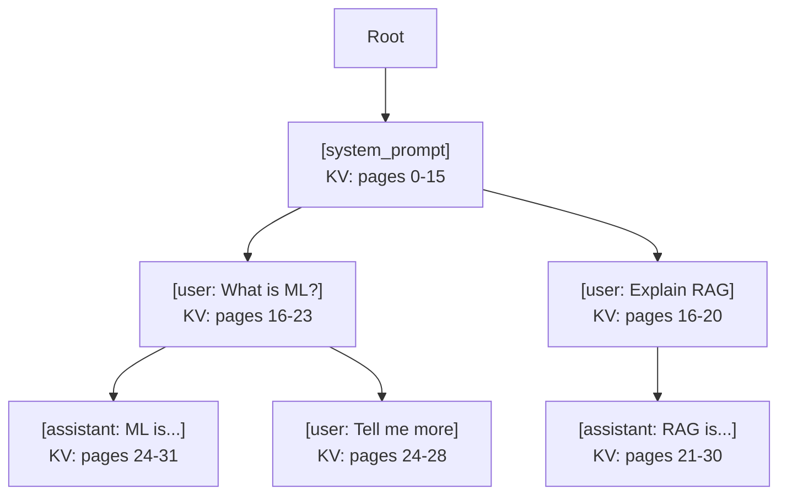
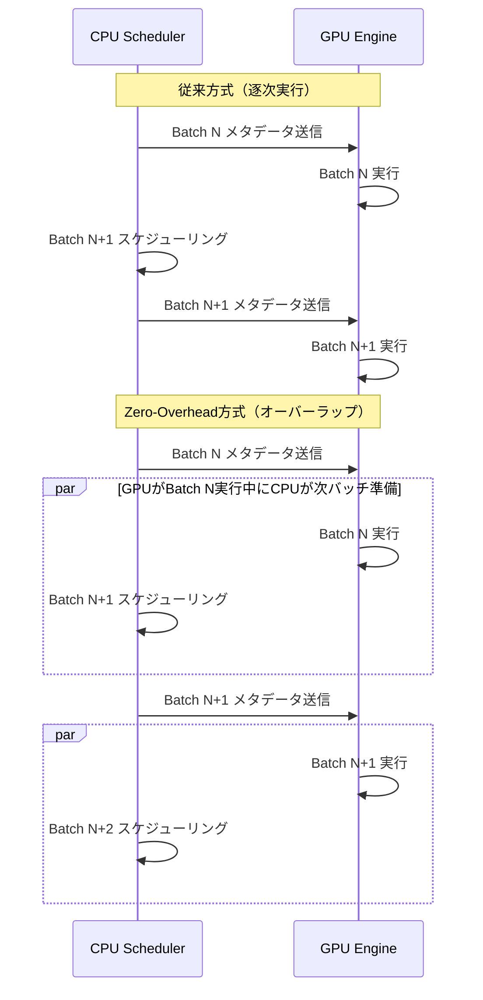
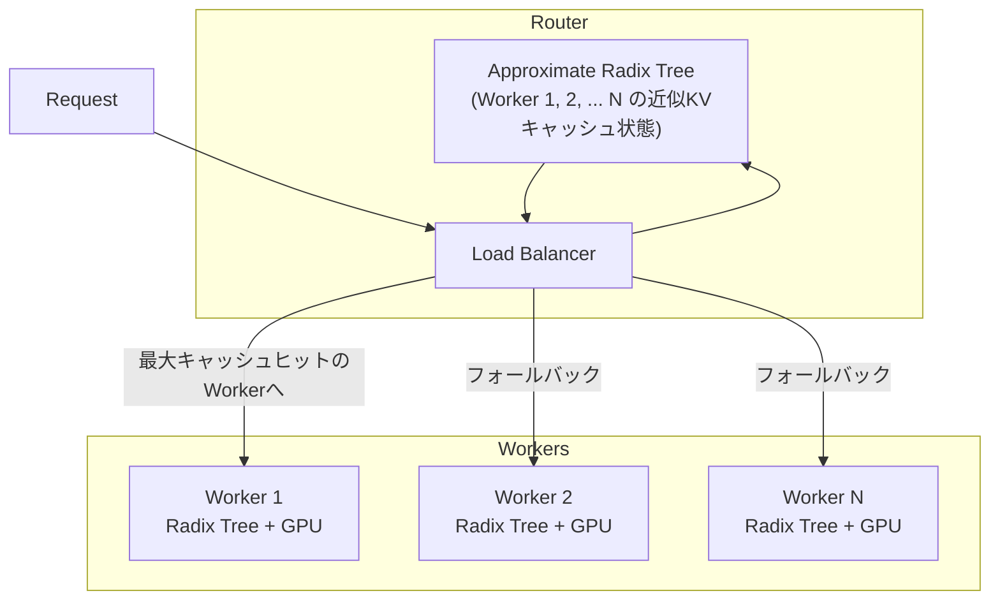

本記事は [https://arxiv.org/abs/2312.07104](https://arxiv.org/abs/2312.07104) の解説記事です。

## 論文概要（Abstract）

SGLangは、構造化されたLLMプログラム（マルチターン会話、エージェント制御、JSON構造化出力など）を効率的に実行するためのシステムである。フロントエンド言語とランタイムの共同設計により、`gen`・`fork`・`join`・`select`といったプリミティブで複雑なLLMワークフローを記述できる。ランタイム側ではRadixAttentionによるKVキャッシュの自動再利用と、Compressed Finite State Machine（CFSM）による構造化出力の高速デコーディングを実装している。著者らは、既存システム比で最大6.4倍のスループット向上を報告している。さらにv0.4ではzero-overhead batch schedulerとcache-aware load balancerが導入され、スケジューリングオーバーヘッドの実質的な排除と分散環境でのキャッシュヒット率向上が実現されている。

この記事は [Zenn記事: LLMバッチ処理の並列最適化：asyncio×キュー×トークンバジェットで処理速度を8倍にする](https://zenn.dev/0h_n0/articles/5f7f36e631d6b0) の深掘りです。Zenn記事で扱われているバッチ処理の並列最適化と密接に関連する、推論エンジン側のスケジューリング最適化について詳細に解説する。

## 情報源

- **arXiv ID**: 2312.07104
- **URL**: [https://arxiv.org/abs/2312.07104](https://arxiv.org/abs/2312.07104)
- **著者**: Lianmin Zheng, Liangsheng Yin, Zhiqiang Xie, et al.（UC Berkeley, Stanford）
- **発表年**: 2023（December）、2024年改訂
- **分野**: cs.AI, cs.PL

## 背景と動機（Background & Motivation）

LLMの推論パイプラインは、単純なプロンプト-レスポンスの1対1モデルから、複数のLLM呼び出しを組み合わせた複雑なプログラムへと進化している。エージェント制御、RAGパイプライン、Tree-of-Thought推論、構造化JSON出力など、1つのタスクに対して複数回のLLM呼び出しが必要となるケースが増加している。

こうした構造化LLMプログラムにおける課題は主に2つある。第1に、複数の生成呼び出し間で共通するプレフィックス（システムプロンプト、few-shotの例示など）に対するKVキャッシュの計算が重複し、計算資源が浪費される点である。第2に、JSON等の構造化出力を生成する際の制約デコーディングが遅く、トークンごとに正規表現やCFG（Context-Free Grammar）の状態遷移を逐一検証する必要がある点である。

従来のvLLMやTGI等の推論システムは、リクエスト完了時にKVキャッシュを破棄するため、共通プレフィックスの再利用ができなかった。また、構造化出力のデコーディングにおいても、各トークン生成時に全語彙に対する制約チェックが必要で、大きなオーバーヘッドとなっていた。

## 主要な貢献（Key Contributions）

- **RadixAttention**: Radix Tree（基数木）を用いたKVキャッシュの自動再利用機構。LRU退避ポリシーにより効率的なキャッシュ管理を実現し、複数リクエスト間でプレフィックスKVキャッシュを共有する
- **Compressed Finite State Machine（CFSM）**: 構造化出力の制約デコーディングを高速化。有限状態機械の状態遷移を圧縮し、複数トークンの先読みにより制約チェックの回数を削減する
- **Zero-Overhead Batch Scheduler**（v0.4）: CPUスケジューリングとGPU実行のオーバーラップにより、スケジューリングオーバーヘッドを実質ゼロに削減
- **Cache-Aware Load Balancer**（v0.4）: 近似Radix Treeを用いたルーティングにより、分散環境でのキャッシュヒット率を3.8倍向上

## 技術的詳細（Technical Details）

### SGLangフロントエンド言語

SGLangはPythonに組み込まれたドメイン固有言語（DSL）として設計されている。主要なプリミティブは以下の通りである。

```python
import sglang as sgl

@sgl.function
def multi_turn_qa(s, questions: list[str]) -> None:
    """マルチターンQAの例

    Args:
        s: SGLang state object
        questions: 質問のリスト
    """
    s += sgl.system("You are a helpful assistant.")

    for i, q in enumerate(questions):
        s += sgl.user(q)
        s += sgl.assistant(sgl.gen(f"answer_{i}", max_tokens=256))

@sgl.function
def tree_of_thought(s, prompt: str, num_branches: int = 3) -> None:
    """Tree-of-Thought推論の例

    Args:
        s: SGLang state object
        prompt: 初期プロンプト
        num_branches: 分岐数
    """
    s += prompt
    # forkで並列に複数の推論パスを展開
    forks = s.fork(num_branches)
    for f in forks:
        f += sgl.gen("thought", max_tokens=128)
        f += "Therefore, the answer is "
        f += sgl.gen("answer", max_tokens=32)
    s += sgl.join(forks)
```

`gen`はLLM生成を呼び出し、`fork`は並列実行パスを作成、`join`は並列パスを合流させる。これらのプリミティブにより、複雑なLLMワークフローを簡潔に記述できる。重要な点として、`fork`で作成された各パスは共通のプレフィックス（上記例では`prompt`まで）を共有しており、RadixAttentionがこの共有部分のKVキャッシュを自動的に再利用する。

### RadixAttention：Radix TreeによるKVキャッシュ管理

RadixAttentionの中核は、KVキャッシュをRadix Tree（基数木、Patricia Trie）として管理するデータ構造である。



Radix Treeの各ノードはトークン列をキーとし、対応するKVキャッシュテンソルを値として保持する。通常のTrieと異なり、Radix Treeのエッジには可変長のトークン列をラベル付けできるため、共通プレフィックスが長い場合でもノード数を抑えられる。

KVキャッシュはGPUメモリ上にページ単位で管理される。各ページは1トークン分のKVテンソルを格納し、Radix Treeのノードは連続するページ範囲への参照を保持する。

#### 主要な操作

**プレフィックスマッチング**: 新しいリクエストが到着すると、そのトークン列をRadix Treeのルートから走査し、最長一致するプレフィックスを検索する。一致した部分のKVキャッシュはそのまま再利用し、不一致部分のみ新たに計算する。

```python
def prefix_match(tree_node: RadixNode, tokens: list[int]) -> tuple[int, list[KVPage]]:
    """Radix Treeでのプレフィックスマッチング

    Args:
        tree_node: 現在のノード
        tokens: マッチング対象のトークン列

    Returns:
        matched_len: マッチしたトークン数
        kv_pages: 再利用可能なKVキャッシュページのリスト
    """
    matched_len = 0
    kv_pages = []

    while tokens and tree_node.children:
        for edge_tokens, child in tree_node.children.items():
            common = common_prefix_length(tokens, edge_tokens)
            if common > 0:
                kv_pages.extend(child.kv_pages[:common])
                matched_len += common
                tokens = tokens[common:]
                if common == len(edge_tokens):
                    tree_node = child
                else:
                    # 部分一致：ノード分割が必要
                    break
                break
        else:
            break

    return matched_len, kv_pages
```

**挿入**: 生成完了後、新たに計算されたKVキャッシュをRadix Treeに挿入する。既存のノードと一部が重複する場合はノードを分割し、新しい分岐を作成する。

**LRU退避**: GPUメモリが不足した場合、Radix Treeのリーフノードから最も古くアクセスされたものを再帰的に退避する。参照カウントが0のリーフから順に解放していくことで、使用中のキャッシュを保護しつつメモリを回収する。

#### キャッシュヒット率の定量的効果

著者らの報告によると、RadixAttentionは以下のようなユースケースで高いキャッシュヒット率を実現する。

- **Few-shot learning**（共通の例示プレフィックス）: ヒット率80-95%
- **マルチターン会話**（会話履歴の共有）: ヒット率60-80%
- **RAGパイプライン**（同一ドキュメントの参照）: ヒット率40-70%

キャッシュヒットした場合、プレフィックス部分のAttention計算をスキップできるため、First Token Latency（TTFT）が大幅に削減される。プレフィックス長を$L_{\text{prefix}}$、新規トークン長を$L_{\text{new}}$とすると、キャッシュヒット時の計算量削減率は以下で近似される。

$$
\text{Reduction} = \frac{L_{\text{prefix}}}{L_{\text{prefix}} + L_{\text{new}}}
$$

たとえば、$L_{\text{prefix}} = 2000$トークン、$L_{\text{new}} = 100$トークンの場合、計算量は約95%削減される。

### Compressed Finite State Machine（CFSM）

構造化出力（JSON、SQL等）の生成では、各トークンが文法制約を満たすかを検証する必要がある。ナイーブな実装では、各生成ステップで語彙$V$の全トークンに対して制約チェックを行うため、計算量が$O(|V|)$となり、語彙サイズが大きい場合にボトルネックとなる。

CFSMは、有限状態機械の状態遷移を圧縮し、複数トークンの先読みを可能にする。具体的には、FSMの遷移先状態が一意に決定される場合（つまり、次に許可されるトークン列が1つしかない場合）、中間状態をスキップして直接最終状態に遷移する。

$$
\text{CFSM}(s_i) = \begin{cases}
s_j & \text{if } |\delta(s_i)| = 1 \text{ かつ } \delta(s_i) = \{(t, s_j)\} \\
\text{decode}(s_i) & \text{otherwise}
\end{cases}
$$

ここで、$s_i$は現在の状態、$\delta(s_i)$は状態$s_i$からの遷移集合、$t$はトークンを表す。遷移先が一意の場合、LLMの生成を呼び出さずに確定トークンを出力できるため、生成ステップ数が削減される。

たとえばJSON生成において、`{"name": "`まで生成された時点で次のトークンは文字列の内容のみが許可される。著者らは、この圧縮により制約デコーディングのオーバーヘッドを最大で通常の1/10に削減できると報告している。なお、SGLang v0.4以降ではxgrammarバックエンドが統合され、JSON制約デコーディングにおいてさらに最大10倍の高速化が実現されている。

### Zero-Overhead Batch Scheduler（v0.4）

従来の推論エンジンでは、CPUでのバッチスケジューリング（リクエスト選択、メモリ割り当て、メタデータ構築）がGPU実行と逐次的に行われていたため、GPU実行中にCPUがアイドルとなり、逆にCPUスケジューリング中にGPUがアイドルとなっていた。著者らの計測によると、v0.3以前ではスケジューリングオーバーヘッドが総処理時間の15-25%を占めていた。

v0.4のzero-overhead batch schedulerは、NanoFlow論文の設計に基づき、CPUスケジューリングとGPU実行を完全にオーバーラップさせる。



具体的な実装では、スケジューラが常に1バッチ先の準備を完了させる。Batch Nの実行をGPUに送出した直後に、Batch N+1のメタデータ（トークンID、ポジション、Attention Mask、KVキャッシュのページテーブルなど）をCPU上で準備する。GPU実行とCPU準備はCUDA Eventで同期され、GPUがBatch Nの実行を完了した時点でBatch N+1のメタデータが即座に利用可能となる。

著者らは、この設計によりスケジューリングオーバーヘッドが総処理時間の2%未満に削減されたと報告している。Nsightプロファイラによる検証では、5連続デコーディングバッチにおいてGPUアイドル時間がゼロであることが確認されている。

スループットへの影響として、v0.3比で1.1倍、他の推論エンジン比で1.3倍の改善が得られている。この効果は特に小型モデルおよび大きなテンソル並列度で顕著であり、これはGPU実行時間が短い場合にスケジューリングオーバーヘッドの割合が相対的に大きくなるためである。

### Cache-Aware Load Balancer（v0.4）

分散環境でのLLM推論では、複数のワーカー（GPUサーバー）にリクエストを分配するロードバランサが必要となる。従来のラウンドロビンやランダム分配では、リクエストのプレフィックスとワーカーのKVキャッシュ状態を考慮しないため、キャッシュヒット率が低下する。

SGLang v0.4のcache-aware load balancerは、ルーター側に各ワーカーのRadix Treeの近似コピーを保持する。この近似Radix Treeは遅延更新（lazy update）で同期され、ワーカーとの通信オーバーヘッドはほぼゼロである。



リクエスト到着時、ルーターは各ワーカーの近似Radix Treeに対してプレフィックスマッチングを行い、最もキャッシュヒット率が高いワーカーにリクエストをルーティングする。この実装はRustで記述されており、Pythonベースの実装と比較して2倍の速度が得られている。

著者らの報告によると、cache-aware load balancerの導入により以下の改善が実現されている。

| 指標 | ラウンドロビン | Cache-Aware | 改善率 |
|------|-------------|-------------|--------|
| スループット (tokens/sec) | 82,665 | 158,596 | 1.9倍 |
| キャッシュヒット率 | 20% | 75% | 3.8倍 |

この効果はワーカー数が増加するほど顕著となる。ワーカー数が増えると各ワーカーのKVキャッシュに格納されるプレフィックスが多様化するため、インテリジェントなルーティングの価値が高まる。

## 実装のポイント（Implementation）

SGLangを実際のプロダクション環境で利用する際の重要なポイントを整理する。

**サーバー起動とRadixAttentionの有効化**: SGLangサーバーはデフォルトでRadixAttentionが有効になっている。`--disable-radix-cache`フラグで無効化も可能だが、マルチターン会話やfew-shot推論では有効のままが推奨される。

```bash
# SGLangサーバーの起動例
python -m sglang.launch_server \
    --model-path meta-llama/Meta-Llama-3-70B-Instruct \
    --tp 4 \
    --port 30000 \
    --mem-fraction-static 0.85
```

**メモリ管理のチューニング**: `--mem-fraction-static`はGPUメモリのうちKVキャッシュに使用する割合を指定する。値が大きいほどキャッシュ容量が増えヒット率が向上するが、バッチサイズの上限が制約される。著者らはデフォルト値0.8-0.9を推奨している。

**分散環境でのcache-aware routing**: 複数ワーカーを使用する場合、`sglang-router`パッケージを利用してcache-aware load balancerを構成できる。

```bash
# sglang-routerの起動例
pip install sglang-router
sglang-router \
    --worker-urls http://worker1:30000 http://worker2:30000 \
    --policy cache-aware
```

**構造化出力の利用**: v0.4以降ではxgrammarバックエンドが統合されており、JSON Schemaを指定するだけで高速な制約デコーディングが利用できる。

**よくある落とし穴**: KVキャッシュの共有はプレフィックスの完全一致に依存するため、トークナイゼーション結果が異なるとキャッシュミスとなる。同一のシステムプロンプトを使用する場合でも、前後の空白や改行の違いでトークン列が変わるケースがある。プロンプトテンプレートの標準化が重要である。

## Production Deployment Guide

### AWS実装パターン（コスト最適化重視）

SGLangベースのLLM推論サーバーをAWS上に構築する際の構成を、トラフィック量別に示す。

**コスト試算の注意事項**: 以下は2026年3月時点のAWS ap-northeast-1（東京）リージョン料金に基づく概算値である。実際のコストはトラフィックパターン、リージョン、バースト使用量により変動する。最新料金はAWS料金計算ツールで確認を推奨する。

| 構成 | トラフィック | インフラ | 月額概算 |
|------|------------|---------|---------|
| Small | ~100 req/日 | Lambda + Bedrock | $50-150 |
| Medium | ~1,000 req/日 | ECS Fargate + g5.xlarge 1台 | $800-1,500 |
| Large | 10,000+ req/日 | EKS + g5.12xlarge x4 (Spot) | $3,000-6,000 |

**Small構成**: Bedrock APIを直接利用し、SGLangサーバーは不要。Lambda関数からBedrock APIを呼び出し、DynamoDBにKVキャッシュのメタデータ（会話履歴等）を保存する。Bedrock Batch APIの利用で50%のコスト削減が可能。

**Medium構成**: ECS Fargate上でSGLangサーバーを1台稼働させる。g5.xlarge（A10G GPU x1）でLlama-3-8Bクラスのモデルを推論する。ALBでHTTPSを終端し、CloudWatch Container Insightsで監視する。

**Large構成**: EKS上でSGLangサーバーを4台以上稼働させ、cache-aware load balancerでルーティングする。Karpenterによるg5.12xlarge Spot Instancesの自動スケーリングで、On-Demand比90%のコスト削減が可能。テンソル並列度4でLlama-3-70Bクラスのモデルを推論する。Reserved Instancesの1年コミットでさらに最大72%の追加削減が見込める。

### Terraformインフラコード

**Small構成（Serverless）**:

```hcl
# --- Small構成: Lambda + Bedrock ---
provider "aws" {
  region = "ap-northeast-1"
}

# IAMロール（最小権限）
resource "aws_iam_role" "lambda_role" {
  name = "sglang-inference-lambda-role"
  assume_role_policy = jsonencode({
    Version = "2012-10-17"
    Statement = [{
      Action = "sts:AssumeRole"
      Effect = "Allow"
      Principal = { Service = "lambda.amazonaws.com" }
    }]
  })
}

resource "aws_iam_role_policy" "lambda_bedrock" {
  name = "bedrock-invoke-policy"
  role = aws_iam_role.lambda_role.id
  policy = jsonencode({
    Version = "2012-10-17"
    Statement = [
      {
        Effect   = "Allow"
        Action   = ["bedrock:InvokeModel", "bedrock:InvokeModelWithResponseStream"]
        Resource = "arn:aws:bedrock:ap-northeast-1::foundation-model/*"
      },
      {
        Effect   = "Allow"
        Action   = ["dynamodb:GetItem", "dynamodb:PutItem", "dynamodb:Query"]
        Resource = aws_dynamodb_table.cache_store.arn
      },
      {
        Effect   = "Allow"
        Action   = ["logs:CreateLogGroup", "logs:CreateLogStream", "logs:PutLogEvents"]
        Resource = "arn:aws:logs:*:*:*"
      }
    ]
  })
}

# DynamoDB（会話履歴・キャッシュメタデータ）
resource "aws_dynamodb_table" "cache_store" {
  name         = "sglang-cache-store"
  billing_mode = "PAY_PER_REQUEST"  # コスト最適化: On-Demand
  hash_key     = "session_id"
  range_key    = "turn_id"

  attribute {
    name = "session_id"
    type = "S"
  }
  attribute {
    name = "turn_id"
    type = "N"
  }

  ttl {
    attribute_name = "expires_at"
    enabled        = true
  }

  server_side_encryption {
    enabled = true  # KMS暗号化
  }
}

# Lambda関数
resource "aws_lambda_function" "inference" {
  function_name = "sglang-inference"
  role          = aws_iam_role.lambda_role.arn
  handler       = "handler.lambda_handler"
  runtime       = "python3.12"
  timeout       = 120
  memory_size   = 512
  filename      = "lambda.zip"

  environment {
    variables = {
      DYNAMODB_TABLE = aws_dynamodb_table.cache_store.name
      MODEL_ID       = "anthropic.claude-3-5-sonnet-20241022-v2:0"
    }
  }

  tracing_config {
    mode = "Active"  # X-Ray有効化
  }
}

# CloudWatch アラーム（コスト監視）
resource "aws_cloudwatch_metric_alarm" "lambda_cost" {
  alarm_name          = "sglang-lambda-high-invocations"
  comparison_operator = "GreaterThanThreshold"
  evaluation_periods  = 1
  metric_name         = "Invocations"
  namespace           = "AWS/Lambda"
  period              = 86400
  statistic           = "Sum"
  threshold           = 5000
  alarm_description   = "Lambda invocations exceed daily budget"

  dimensions = {
    FunctionName = aws_lambda_function.inference.function_name
  }
}
```

**Large構成（Container + SGLang）**:

```hcl
# --- Large構成: EKS + Karpenter + Spot ---
module "eks" {
  source          = "terraform-aws-modules/eks/aws"
  version         = "~> 20.0"
  cluster_name    = "sglang-inference"
  cluster_version = "1.31"

  vpc_id     = module.vpc.vpc_id
  subnet_ids = module.vpc.private_subnets

  # コスト最適化: マネージドノードグループ最小構成
  eks_managed_node_groups = {
    system = {
      instance_types = ["m6i.large"]
      min_size       = 1
      max_size       = 3
      desired_size   = 2
    }
  }
}

# Karpenter Provisioner（Spot優先でGPUノードを自動スケーリング）
resource "kubectl_manifest" "karpenter_nodepool" {
  yaml_body = yamlencode({
    apiVersion = "karpenter.sh/v1"
    kind       = "NodePool"
    metadata   = { name = "gpu-spot" }
    spec = {
      template = {
        spec = {
          requirements = [
            { key = "karpenter.sh/capacity-type", operator = "In", values = ["spot", "on-demand"] },
            { key = "node.kubernetes.io/instance-type", operator = "In",
              values = ["g5.12xlarge", "g5.48xlarge"] },
          ]
          nodeClassRef = { name = "default" }
        }
      }
      limits   = { cpu = "128", "nvidia.com/gpu" = "16" }
      disruption = {
        consolidationPolicy = "WhenEmpty"
        consolidateAfter    = "30s"
      }
    }
  })
}

# Secrets Manager（モデル設定）
resource "aws_secretsmanager_secret" "model_config" {
  name = "sglang/model-config"
}

resource "aws_secretsmanager_secret_version" "model_config" {
  secret_id = aws_secretsmanager_secret.model_config.id
  secret_string = jsonencode({
    model_path     = "meta-llama/Meta-Llama-3-70B-Instruct"
    tp_size        = 4
    mem_fraction   = 0.85
    router_policy  = "cache-aware"
  })
}

# AWS Budgets（予算アラート）
resource "aws_budgets_budget" "monthly" {
  name         = "sglang-inference-monthly"
  budget_type  = "COST"
  limit_amount = "6000"
  limit_unit   = "USD"
  time_unit    = "MONTHLY"

  notification {
    comparison_operator       = "GREATER_THAN"
    threshold                 = 80
    threshold_type            = "PERCENTAGE"
    notification_type         = "ACTUAL"
    subscriber_email_addresses = ["ops@example.com"]
  }
}
```

### 運用・監視設定

**CloudWatch Logs Insights クエリ**:

```
# トークン使用量の異常検知（1時間あたり）
fields @timestamp, @message
| filter @message like /tokens/
| stats sum(output_tokens) as total_tokens by bin(1h) as hour
| sort hour desc
| limit 24
```

```
# レイテンシ分析（P95, P99）
fields @timestamp, latency_ms
| stats percentile(latency_ms, 95) as p95,
        percentile(latency_ms, 99) as p99,
        avg(latency_ms) as avg_latency
  by bin(5m)
| sort @timestamp desc
```

**CloudWatch アラーム設定コード（Python）**:

```python
import boto3

cloudwatch = boto3.client("cloudwatch", region_name="ap-northeast-1")

def create_latency_alarm(function_name: str, threshold_ms: float = 5000) -> dict:
    """Lambda実行時間の異常検知アラームを作成

    Args:
        function_name: Lambda関数名
        threshold_ms: アラーム閾値（ミリ秒）

    Returns:
        CloudWatch API レスポンス
    """
    return cloudwatch.put_metric_alarm(
        AlarmName=f"{function_name}-high-latency",
        MetricName="Duration",
        Namespace="AWS/Lambda",
        Statistic="p99",
        Period=300,
        EvaluationPeriods=3,
        Threshold=threshold_ms,
        ComparisonOperator="GreaterThanThreshold",
        Dimensions=[{"Name": "FunctionName", "Value": function_name}],
        AlarmActions=["arn:aws:sns:ap-northeast-1:123456789012:ops-alerts"],
    )
```

**X-Ray トレーシング設定コード（Python）**:

```python
from aws_xray_sdk.core import xray_recorder, patch_all

# boto3の自動計装
patch_all()

@xray_recorder.capture("inference_request")
def handle_inference(request: dict) -> dict:
    """推論リクエストのトレーシング

    Args:
        request: 推論リクエスト

    Returns:
        推論結果
    """
    subsegment = xray_recorder.current_subsegment()
    subsegment.put_annotation("model_id", request.get("model_id", "unknown"))
    subsegment.put_metadata("input_tokens", len(request.get("prompt", "")))

    result = invoke_model(request)

    subsegment.put_metadata("output_tokens", result.get("token_count", 0))
    return result
```

**Cost Explorer自動レポート（Python）**:

```python
import boto3
from datetime import datetime, timedelta

ce = boto3.client("ce", region_name="us-east-1")
sns = boto3.client("sns", region_name="ap-northeast-1")

def daily_cost_report() -> None:
    """日次コストレポートを取得しSNS通知"""
    end = datetime.utcnow().strftime("%Y-%m-%d")
    start = (datetime.utcnow() - timedelta(days=1)).strftime("%Y-%m-%d")

    response = ce.get_cost_and_usage(
        TimePeriod={"Start": start, "End": end},
        Granularity="DAILY",
        Metrics=["UnblendedCost"],
        Filter={
            "Tags": {"Key": "Project", "Values": ["sglang-inference"]}
        },
        GroupBy=[{"Type": "DIMENSION", "Key": "SERVICE"}],
    )

    total = sum(
        float(g["Metrics"]["UnblendedCost"]["Amount"])
        for r in response["ResultsByTime"]
        for g in r["Groups"]
    )

    if total > 100:
        sns.publish(
            TopicArn="arn:aws:sns:ap-northeast-1:123456789012:cost-alerts",
            Subject=f"SGLang Cost Alert: ${total:.2f}/day",
            Message=f"Daily cost exceeded $100 threshold: ${total:.2f}",
        )
```

### コスト最適化チェックリスト

**アーキテクチャ選択**:
- [ ] トラフィック ~100 req/日 → Serverless（Lambda + Bedrock）
- [ ] トラフィック ~1,000 req/日 → Hybrid（ECS + GPU 1台）
- [ ] トラフィック 10,000+ req/日 → Container（EKS + GPU複数台）

**リソース最適化**:
- [ ] EC2/EKS: Spot Instances優先（最大90%削減）
- [ ] Reserved Instances: 1年コミット（最大72%削減）
- [ ] Savings Plans: Compute Savings Plans検討
- [ ] Lambda: メモリサイズのPower Tuning最適化
- [ ] EKS: Karpenterでアイドル時ゼロスケール

**LLMコスト削減**:
- [ ] Bedrock Batch API使用（50%削減）
- [ ] Prompt Caching有効化（30-90%削減、SGLang RadixAttention活用）
- [ ] モデル選択ロジック（簡単なタスクは小型モデルへルーティング）
- [ ] トークン数制限（max_tokensの適切な設定）
- [ ] cache-aware load balancerでキャッシュヒット率最大化

**監視・アラート**:
- [ ] AWS Budgets設定（月額上限の80%でアラート）
- [ ] CloudWatch アラーム（レイテンシP99、エラーレート）
- [ ] Cost Anomaly Detection有効化
- [ ] 日次コストレポート（SNS通知）
- [ ] X-Ray トレーシング有効化

**リソース管理**:
- [ ] 未使用GPUインスタンスの自動停止（夜間・週末）
- [ ] タグ戦略（Project, Environment, Owner）
- [ ] EBSボリュームのライフサイクルポリシー
- [ ] ECRイメージの世代管理（古いイメージの自動削除）
- [ ] 開発環境の夜間自動停止スケジュール

## 実験結果（Results）

著者らは9種類のワークロードでSGLangの性能を評価している。以下に主要な結果を示す（論文Table 1, v0.4ブログより）。

| ワークロード | ベースライン (vLLM) | SGLang | 改善率 |
|-------------|-------------------|--------|--------|
| MMLU (few-shot) | 1x | 最大5x | 5.0倍 |
| JSON抽出 | 1x | 最大6.4x | 6.4倍 |
| ReAct Agent | 1x | 3.24x | 3.24倍 |
| DSPy RAG | 1x | 3.47x | 3.47倍 |
| マルチターン会話 | 1x | 最大5x | 5.0倍 |

v0.4で追加された改善の結果:

| 最適化 | 改善内容 | 効果 |
|--------|---------|------|
| Zero-Overhead Scheduler | スケジューリングオーバーヘッド削減 | v0.3比1.1倍、他エンジン比1.3倍 |
| Cache-Aware Load Balancer | 分散環境のキャッシュヒット率 | ヒット率3.8倍、スループット1.9倍 |
| xgrammar統合 | 構造化出力デコーディング | 最大10倍高速化 |

著者らが特に強調しているのは、RadixAttentionの効果がプレフィックス共有パターンに強く依存する点である。few-shot学習やシステムプロンプトが固定されたマルチターン会話では高いキャッシュヒット率が得られるが、リクエストごとに完全に異なるプロンプトの場合にはキャッシュの恩恵は限定的となる。

## 実運用への応用（Practical Applications）

Zenn記事で扱われているasyncio + キュー + トークンバジェットによるLLMバッチ処理最適化と、SGLangの最適化は相補的な関係にある。

**アプリケーション層（Zenn記事の範囲）**: asyncioによる非同期リクエスト発行、トークンバジェットによる流量制御、キュー管理によるバースト制御。これらはクライアント側の最適化であり、推論エンジンに送信するリクエストの並行度とタイミングを制御する。

**推論エンジン層（SGLangの範囲）**: RadixAttentionによるKVキャッシュ再利用、continuous batchingによるGPU利用率最大化、cache-aware routingによる分散環境のキャッシュヒット最大化。これらはサーバー側の最適化であり、受信したリクエストの処理効率を最大化する。

両方を組み合わせることで、エンドツーエンドの処理速度を最大化できる。たとえば、Zenn記事の手法でリクエスト並行度を最適化しつつ、SGLangのRadixAttentionで共通プレフィックスのKVキャッシュを再利用すれば、バッチ処理全体のスループットをさらに向上させることが可能である。特にfew-shot learningのバッチ処理では、全リクエストが同一のfew-shot例を共有するため、RadixAttentionのキャッシュヒット率が極めて高くなる。

## 関連研究（Related Work）

- **vLLM（Kwon et al., 2023）**: PagedAttentionによるKVキャッシュのメモリ管理を提案。ページ単位の動的割り当てでメモリ断片化を解消するが、リクエスト間のプレフィックス共有はサポートしていなかった。SGLangのRadixAttentionはvLLMのPagedAttentionと相補的な技術である
- **NanoFlow（Zhu et al., 2024）**: GPU-CPU間のパイプライニングでオーバーヘッドを削減する手法を提案。SGLang v0.4のzero-overhead schedulerはNanoFlowの設計に基づいている
- **Orca（Yu et al., 2022）**: iteration-level scheduling（continuous batching）を提案し、LLM推論のスループットを向上させた。SGLangはOrcaのcontinuous batchingを基盤として採用している
- **GORGO（2025）**: クロスリージョンでのKVキャッシュ再利用を最大化するロードバランシング手法。SGLangのcache-aware load balancerを地理的に分散した環境に拡張する研究

## まとめと今後の展望

SGLangは、RadixAttentionによるKVキャッシュの自動再利用とCFSMによる構造化出力の高速化を中核に、LLM推論の効率を大幅に向上させるシステムである。v0.4で追加されたzero-overhead batch schedulerとcache-aware load balancerにより、単一ノードでのGPU利用率最大化と分散環境でのキャッシュ効率最大化が実現されている。

今後の展望として、著者らはHiCache（階層的KVキャッシュ）によるGPU-CPU-SSD間のキャッシュ階層化、prefill-decode disaggregationによるプレフィル専用ノードとデコード専用ノードの分離、speculative decodingとの統合による更なるスループット向上を進めている。LLM推論の効率化は、大規模サービスのコスト削減とレスポンス改善に直結するため、引き続き重要な研究領域である。

## 参考文献

- **arXiv**: [https://arxiv.org/abs/2312.07104](https://arxiv.org/abs/2312.07104)
- **Code**: [https://github.com/sgl-project/sglang](https://github.com/sgl-project/sglang)
- **SGLang v0.4 Blog**: [https://lmsys.org/blog/2024-12-04-sglang-v0-4/](https://lmsys.org/blog/2024-12-04-sglang-v0-4/)
- **RadixAttention Blog**: [https://lmsys.org/blog/2024-01-17-sglang/](https://lmsys.org/blog/2024-01-17-sglang/)
- **Related Zenn article**: [https://zenn.dev/0h_n0/articles/5f7f36e631d6b0](https://zenn.dev/0h_n0/articles/5f7f36e631d6b0)
