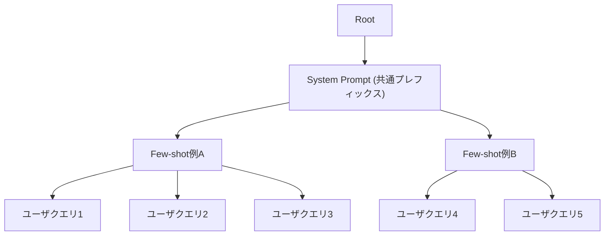

本記事は [https://arxiv.org/abs/2412.03594](https://arxiv.org/abs/2412.03594) の解説記事です。

## 論文概要（Abstract）

BatchLLMは、大規模バッチLLM推論に特化した最適化システムである。既存のLLM推論エンジン（vLLM、SGLang等）はストリーミングリクエストへの応答を重視する設計であり、数千～数万件のリクエストをまとめて処理するバッチ推論シナリオでは、プレフィックスのKVキャッシュ再利用やGPU利用率の面で最適化の余地が残されている。BatchLLMは、グローバルプレフィックス共有（Global Prefix Sharing）、スループット指向トークンバッチング（Throughput-oriented Token Batching）、水平カーネル融合（Horizontal Fusion）の3つの技術を導入し、著者らはvLLMおよびSGLangに対して1.3倍から10.8倍のスループット向上を達成したと報告している。

この記事は [Zenn記事: LLMバッチ処理の並列最適化：asyncio×キュー×トークンバジェットで処理速度を8倍にする](https://zenn.dev/0h_n0/articles/5f7f36e631d6b0) の深掘りです。

## 情報源

- **arXiv ID**: 2412.03594
- **URL**: [https://arxiv.org/abs/2412.03594](https://arxiv.org/abs/2412.03594)
- **著者**: Zhen Zheng, Xin Ji, Taosong Fang, et al.
- **発表年**: 2024年（2024年11月投稿、2025年1月改訂）
- **分野**: cs.CL, cs.AI, cs.DC, cs.LG

## 背景と動機（Background & Motivation）

LLMのバッチ推論は、コード生成、文書要約、データ抽出といった大規模オフライン処理で広く利用されている。こうしたワークロードでは、同一のシステムプロンプトやfew-shotの例示が数千件のリクエスト間で共有されることが多い。

既存の推論エンジン（vLLM、SGLang等）は、LRUベースのキャッシュを用いてプレフィックスのKVコンテキストを再利用する設計を採用している。しかし、この方式にはバッチ推論固有の課題がある。LRUキャッシュはリクエストの到着順序に依存するため、異なるプレフィックスを持つリクエストが交互に処理されると、共通プレフィックスのKVキャッシュが途中でevict（追い出し）される。その結果、本来再利用可能だったプレフィックス計算が繰り返し実行され、GPUの計算資源とメモリが浪費される。

さらに、既存エンジンのトークンバッチングはリクエスト数の上限で制御されており、デコーディング主体のバッチではGPUが十分に活用されない。BatchLLMはこれらの課題を、バッチ処理シナリオに特化した設計で解決することを目指している。

## 主要な貢献（Key Contributions）

- **Global Prefix Sharing**: 全リクエストのプレフィックスをグローバルに解析し、Radix Treeを構築して共通プレフィックスを動的計画法で最適化。同一プレフィックスのリクエストをグループ化してスケジューリングし、KVキャッシュのevictionを防止する
- **Throughput-oriented Token Batching**: デコーディング比率の高いリクエストグループを優先的にスケジューリングし、プリフィルチャンクとデコーディングトークンを効率的に混合。Memory-centric方式でトークンバッチサイズをGPUメモリ上限まで拡大する
- **Horizontal Fusion**: プレフィックス共有Attention計算において、プレフィックスKVと個別KVのAttentionを単一カーネルに融合し、カーネル起動オーバーヘッドとテール効果を削減
- **包括的な実験評価**: マイクロベンチマークおよび産業ワークロードにおいて、NVIDIA A100とAMD MI200の両環境でvLLM・SGLangとの比較を実施

## 技術的詳細（Technical Details）

### Global Prefix Sharing

BatchLLMのプレフィックス共有は、全リクエストをトークン列としてRadix Tree（基数木）に挿入することから始まる。各ノードはトークン列の共通部分を表し、葉ノードが個別リクエストに対応する。

構築されたRadix Treeに対し、動的計画法（DP）アルゴリズムを適用して最適な共有粒度を決定する。具体的には、各ノードの子ノードを「マージすべきか、分割すべきか」を再帰的に評価する。

**マージ判定の基準**:

孫ノード $c'$ について、マージによるトークン節約量（gain）を以下で計算する:

$$
\text{gain}(c') = (\text{leaves}(c') - 1) \times \text{tokens}(c')
$$

ここで、
- $\text{leaves}(c')$: 孫ノード $c'$ の配下にある葉ノード数（リクエスト数）
- $\text{tokens}(c')$: 孫ノード $c'$ のトークン数

このgainが、子ノードのトークン数（penalty）を上回る場合にマージを実行する。

**トークン節約率**:

Global Prefix Sharingの効果は、トークン節約率 $R_{\text{saving}}$ で定量化される（論文Equation 2）:

$$
R_{\text{saving}} = \left(1 - \frac{N_{\text{processed}}}{N_{\text{logical}}}\right) \times 100
$$

ここで、
- $N_{\text{processed}}$: 実際に処理されたプリフィルトークン数
- $N_{\text{logical}}$: プレフィックス共有がない場合の論理的プリフィルトークン数

著者らの実験（論文Table 2相当）では、プレフィックス長2000トークン・共有度16のマイクロベンチマークにおいて、vLLM（chunked-prefill + prefix-caching有効）のトークン節約率が40.1%であるのに対し、BatchLLMは85.2%を達成したと報告されている。プレフィックス長16000・共有度16の極端なケースでは、vLLMが6.3%、SGLangが5.2%に低下する一方、BatchLLMは92.6%を維持している。



**スケジューリング戦略**: 同一プレフィックスを共有するリクエストはグループとしてまとめてスケジュールされる。これにより、プレフィックスのKVキャッシュはグループ内の全リクエストが完了するまで保持され、LRUによる早期evictionが防止される。グループ完了後にKVメモリを即座に解放するため、メモリ効率も維持される。

### Throughput-oriented Token Batching

BatchLLMは、リクエストグループのデコーディング比率に基づいてスケジューリング順序を決定する。

**デコーディング比率**（論文Equation 3-4）:

個別リクエストのデコーディング比率:

$$
R = \frac{L_{\text{decode}}}{L_{\text{prefill}}}
$$

グループレベルのデコーディング比率（出力長を1に正規化）:

$$
R_{\text{group}} = \frac{1}{L_{\text{prefix}} + \sum L_{\text{distinct}}}
$$

ここで、
- $L_{\text{decode}}$: デコーディングトークン数
- $L_{\text{prefill}}$: プリフィルトークン数
- $L_{\text{prefix}}$: グループの共通プレフィックス長
- $L_{\text{distinct}}$: 各リクエスト固有のプロンプト長

デコーディング比率の高いグループを先にスケジュールすることで、デコーディングフェーズが早期に開始され、後続グループのプリフィルチャンクとデコーディングトークンの混合が促進される。

**3キューフェッチング**: 各イテレーションで以下の優先順位でトークンを取得する:

1. **デコーディングキュー**: 既にデコーディング中のリクエストのトークン
2. **個別プロンプトキュー**: プレフィックス処理済みリクエストの固有プロンプト部分
3. **共通プレフィックスキュー**: 新規グループのプレフィックス部分

この順序により、アクティブなリクエストが優先的に完了し、KVメモリが早期に解放される。

### Memory-centric Token Batching

従来のトークンバッチングは、同時処理リクエスト数の上限（例: vLLMの`max_num_seqs`）でバッチサイズを制御する。この方式では、デコーディング主体のバッチ（各リクエストが1トークンずつ生成）でGPUが大幅に遊休する。

BatchLLMはリクエスト数ではなく、KVメモリの使用量上限 $M_{\text{threshold}}$ でバッチを制御する:

```python
def memory_centric_batching(
    pending_chunks: list[PrefillChunk],
    active_decoding: list[DecodingRequest],
    m_threshold: int,
    s_chunk: int,
) -> TokenBatch:
    """Memory-centricトークンバッチング

    Args:
        pending_chunks: 処理待ちのプリフィルチャンク
        active_decoding: アクティブなデコーディングリクエスト
        m_threshold: KVメモリ使用量上限（トークン単位）
        s_chunk: プリフィルチャンクサイズ

    Returns:
        構築されたトークンバッチ
    """
    batch = TokenBatch()
    current_memory = sum(r.kv_memory for r in active_decoding)

    # デコーディングトークンを優先追加
    for req in active_decoding:
        batch.add_decoding_token(req)

    # 残りメモリでプリフィルチャンクを追加
    for chunk in pending_chunks:
        chunk_memory = min(s_chunk, chunk.remaining) * 2  # KV pair
        if current_memory + chunk_memory > m_threshold:
            break
        batch.add_prefill_chunk(chunk, s_chunk)
        current_memory += chunk_memory

    return batch
```

この方式により、デコーディング主体のバッチでもプリフィルチャンクを積極的にインターリーブでき、GPU利用率が向上する。

### Horizontal Fusion

プレフィックス共有Attention（Prefix-shared Attention）では、各リクエストが共通プレフィックスのKVコンテキストと個別のKVコンテキストの両方に対してAttentionを計算する必要がある。素朴な実装では、プレフィックスKVに対するAttentionと個別KVに対するAttentionを別々のカーネルとして起動する。

BatchLLMのHorizontal Fusionは、これら2つのAttention計算を単一のGPUカーネルに融合する:

- 異なるスレッドブロックがプレフィックスKVと個別KVの計算をそれぞれ担当
- 各部分に対して自動チューニングで最適なタイリング構成を選択
- OpenAI Triton言語で実装し、NVIDIA（CUDA）とAMD（ROCm）の両GPU環境に対応
- AMDではAOTriton（Ahead-of-Time compilation）を使用してウォームアップオーバーヘッドを回避

この融合により、カーネル起動オーバーヘッドの削減とテール効果（一部のスレッドブロックが先に完了して待機する非効率）の軽減を実現している。

## 実装のポイント（Implementation）

BatchLLMの実装における注意点を以下に整理する。

**Radix Treeの構築オーバーヘッド**: 著者らの報告によると、8000リクエストのプレフィックス解析に要する時間は1.51秒であり、全体の推論時間919.54秒に対して0.01%未満のオーバーヘッドである。バッチ処理ではレイテンシよりスループットが重要であるため、この前処理コストは許容範囲内といえる。

**チャンクサイズの選択**: プリフィルのチャンクサイズ $S_{\text{chunk}}$ は、GPUの計算効率とメモリ効率のトレードオフを決定する重要なハイパーパラメータである。小さすぎるとカーネル起動のオーバーヘッドが増大し、大きすぎるとデコーディングトークンとのインターリーブが粗くなる。

**KVメモリ上限の設定**: $M_{\text{threshold}}$ はGPUのHBM容量、モデルサイズ、および同時処理リクエスト数から逆算する。過度に大きく設定するとOOMが発生し、小さすぎるとスループットが低下する。

**Tritonカーネルの実装**: Horizontal FusionカーネルはOpenAI Tritonで記述されているため、CUDAの手書きカーネル（FlashAttention等）と比較してNVIDIA環境では若干の性能差が生じる可能性がある。ただし、AMD環境でのポータビリティが得られるメリットがある。

## Production Deployment Guide

BatchLLMの技術をプロダクション環境のバッチ推論基盤に適用するための実装ガイドを示す。

### AWS実装パターン（コスト最適化重視）

BatchLLMの最適化思想（プレフィックス共有、メモリ中心のバッチング）を活かすには、GPU上でのセルフホスティング推論が前提となる。以下にトラフィック量別の推奨構成を示す。

**コスト試算の注意**: 以下は2026年3月時点のAWS ap-northeast-1（東京）リージョンの概算値である。実際のコストはトラフィックパターン、リージョン、Spotの中断頻度等により変動する。最新料金は[AWS料金計算ツール](https://calculator.aws/)で確認されたい。

| 構成 | トラフィック | インフラ | 月額概算 |
|------|------------|---------|---------|
| Small | ~1000 req/日 | ECS Fargate + Bedrock Batch API | $200-500 |
| Medium | ~10000 req/日 | ECS on EC2 (g5.2xlarge) + S3バッチ | $1,500-3,000 |
| Large | 100000+ req/日 | EKS + p4d.24xlarge Spot + NVMe SSD | $5,000-15,000 |

**Small構成の詳細**: バッチリクエストをS3に蓄積し、Bedrock Batch APIで処理する。Bedrock Batch APIはオンデマンド推論比で50%のコスト削減が可能である。プレフィックス共有の最適化はBedrock側で自動適用されないため、プロンプトの共通部分を分離してPrompt Cachingを併用する。

**Medium構成の詳細**: g5.2xlarge（A10G 24GB）上にvLLMをデプロイし、BatchLLMの思想を参考にしたバッチスケジューラを実装する。ECS Serviceのスケジューリングでバッチジョブを管理し、処理完了後にスケールダウンする。

**Large構成の詳細**: EKS上にp4d.24xlarge（A100 x8）のSpotインスタンスを配置し、Karpenterで自動スケーリングする。Spot Instancesの活用により、オンデマンド比で最大90%のコスト削減が見込める。Reserved Instancesの1年コミットで最大72%の追加削減も検討に値する。

### Terraformインフラコード

**Small構成（Serverless + Bedrock Batch）**:

```hcl
# --- Small構成: Bedrock Batch API + S3 + Lambda ---

resource "aws_s3_bucket" "batch_input" {
  bucket = "llm-batch-input-${var.environment}"

  tags = {
    Project     = "batch-llm"
    Environment = var.environment
    CostCenter  = "ml-inference"
  }
}

resource "aws_s3_bucket_server_side_encryption_configuration" "batch_input" {
  bucket = aws_s3_bucket.batch_input.id

  rule {
    apply_server_side_encryption_by_default {
      sse_algorithm     = "aws:kms"
      kms_master_key_id = aws_kms_key.batch_llm.arn
    }
  }
}

resource "aws_kms_key" "batch_llm" {
  description             = "KMS key for BatchLLM data encryption"
  deletion_window_in_days = 7
  enable_key_rotation     = true
}

resource "aws_iam_role" "batch_lambda" {
  name = "batch-llm-lambda-role"

  assume_role_policy = jsonencode({
    Version = "2012-10-17"
    Statement = [{
      Action = "sts:AssumeRole"
      Effect = "Allow"
      Principal = { Service = "lambda.amazonaws.com" }
    }]
  })
}

resource "aws_iam_role_policy" "batch_lambda" {
  name = "batch-llm-lambda-policy"
  role = aws_iam_role.batch_lambda.id

  policy = jsonencode({
    Version = "2012-10-17"
    Statement = [
      {
        Effect   = "Allow"
        Action   = ["s3:GetObject", "s3:PutObject"]
        Resource = "${aws_s3_bucket.batch_input.arn}/*"
      },
      {
        Effect   = "Allow"
        Action   = ["bedrock:InvokeModel", "bedrock:CreateModelInvocationJob"]
        Resource = "*"
      },
      {
        Effect   = "Allow"
        Action   = ["logs:CreateLogGroup", "logs:CreateLogStream", "logs:PutLogEvents"]
        Resource = "arn:aws:logs:*:*:*"
      }
    ]
  })
}

resource "aws_lambda_function" "batch_orchestrator" {
  function_name = "batch-llm-orchestrator"
  role          = aws_iam_role.batch_lambda.arn
  handler       = "handler.lambda_handler"
  runtime       = "python3.12"
  timeout       = 900  # 15分（Bedrock Batch APIジョブ投入用）
  memory_size   = 512

  environment {
    variables = {
      BATCH_BUCKET     = aws_s3_bucket.batch_input.id
      MODEL_ID         = "anthropic.claude-3-5-sonnet-20241022-v2:0"
      MAX_BATCH_SIZE   = "1000"
    }
  }

  filename = "lambda/batch_orchestrator.zip"
}

# CloudWatch アラーム: Lambda実行時間監視
resource "aws_cloudwatch_metric_alarm" "lambda_duration" {
  alarm_name          = "batch-llm-lambda-duration"
  comparison_operator = "GreaterThanThreshold"
  evaluation_periods  = 1
  metric_name         = "Duration"
  namespace           = "AWS/Lambda"
  period              = 300
  statistic           = "Average"
  threshold           = 600000  # 10分
  alarm_description   = "Lambda execution time exceeds 10 minutes"

  dimensions = {
    FunctionName = aws_lambda_function.batch_orchestrator.function_name
  }
}
```

**Large構成（EKS + Karpenter + Spot）**:

```hcl
# --- Large構成: EKS + Karpenter + GPU Spot Instances ---

module "eks" {
  source  = "terraform-aws-modules/eks/aws"
  version = "~> 20.0"

  cluster_name    = "batch-llm-cluster"
  cluster_version = "1.31"

  vpc_id     = module.vpc.vpc_id
  subnet_ids = module.vpc.private_subnets

  cluster_endpoint_public_access = false  # セキュリティ: プライベートのみ

  eks_managed_node_groups = {
    system = {
      instance_types = ["m6i.xlarge"]
      min_size       = 2
      max_size       = 4
      desired_size   = 2
    }
  }
}

# Karpenter NodePool: GPU Spot優先
resource "kubectl_manifest" "gpu_nodepool" {
  yaml_body = yamlencode({
    apiVersion = "karpenter.sh/v1"
    kind       = "NodePool"
    metadata   = { name = "gpu-batch-inference" }
    spec = {
      template = {
        spec = {
          requirements = [
            { key = "node.kubernetes.io/instance-type", operator = "In",
              values = ["p4d.24xlarge", "g5.12xlarge", "g5.48xlarge"] },
            { key = "karpenter.sh/capacity-type", operator = "In",
              values = ["spot", "on-demand"] },  # Spot優先
            { key = "topology.kubernetes.io/zone", operator = "In",
              values = ["ap-northeast-1a", "ap-northeast-1c"] }
          ]
          nodeClassRef = { name = "gpu-node-class" }
        }
      }
      limits   = { cpu = "384", "nvidia.com/gpu" = "32" }
      disruption = {
        consolidationPolicy = "WhenEmptyOrUnderutilized"
        consolidateAfter    = "60s"  # バッチ完了後速やかにスケールダウン
      }
    }
  })
}

# Secrets Manager: モデル設定
resource "aws_secretsmanager_secret" "model_config" {
  name                    = "batch-llm/model-config"
  recovery_window_in_days = 7
}

# AWS Budgets: 月額予算アラート
resource "aws_budgets_budget" "batch_llm" {
  name         = "batch-llm-monthly"
  budget_type  = "COST"
  limit_amount = "15000"
  limit_unit   = "USD"
  time_unit    = "MONTHLY"

  notification {
    comparison_operator       = "GREATER_THAN"
    threshold                 = 80
    threshold_type            = "PERCENTAGE"
    notification_type         = "ACTUAL"
    subscriber_email_addresses = [var.alert_email]
  }
}
```

### 運用・監視設定

**CloudWatch Logs Insights クエリ（バッチ推論のスループット監視）**:

```
# 1時間あたりのトークン処理量とレイテンシ分析
fields @timestamp, @message
| filter @message like /batch_complete/
| stats
    sum(tokens_processed) as total_tokens,
    avg(latency_ms) as avg_latency,
    pct(latency_ms, 95) as p95_latency,
    pct(latency_ms, 99) as p99_latency,
    count(*) as batch_count
  by bin(1h) as time_bucket
| sort time_bucket desc
```

**CloudWatch アラーム設定（Python）**:

```python
import boto3

cloudwatch = boto3.client("cloudwatch", region_name="ap-northeast-1")

def create_throughput_alarm(cluster_name: str, sns_topic_arn: str) -> None:
    """バッチ推論スループット低下アラームを作成する

    Args:
        cluster_name: EKSクラスタ名
        sns_topic_arn: 通知先SNSトピックARN
    """
    cloudwatch.put_metric_alarm(
        AlarmName=f"{cluster_name}-throughput-drop",
        MetricName="TokensPerSecond",
        Namespace="BatchLLM/Inference",
        Statistic="Average",
        Period=300,
        EvaluationPeriods=3,
        Threshold=100.0,  # 100 tokens/sec未満で警告
        ComparisonOperator="LessThanThreshold",
        AlarmActions=[sns_topic_arn],
        Dimensions=[{"Name": "ClusterName", "Value": cluster_name}],
    )
```

**X-Ray トレーシング設定（Python）**:

```python
from aws_xray_sdk.core import xray_recorder, patch_all

patch_all()  # boto3, requests等を自動計装

@xray_recorder.capture("batch_inference")
def run_batch_inference(requests: list[dict], model_id: str) -> list[dict]:
    """バッチ推論実行（X-Rayトレーシング付き）"""
    subsegment = xray_recorder.current_subsegment()
    subsegment.put_annotation("model_id", model_id)
    subsegment.put_metadata("request_count", len(requests))
    subsegment.put_metadata("total_input_tokens",
                            sum(r["input_tokens"] for r in requests))
    # ... 推論ロジック ...
    return results
```

**Cost Explorer 日次レポート（Python）**:

```python
import boto3
from datetime import date, timedelta

def get_daily_inference_cost(sns_topic_arn: str) -> None:
    """日次推論コストを取得し、閾値超過時にSNS通知する"""
    ce = boto3.client("ce", region_name="us-east-1")
    sns = boto3.client("sns", region_name="ap-northeast-1")

    today = date.today()
    yesterday = today - timedelta(days=1)

    response = ce.get_cost_and_usage(
        TimePeriod={"Start": str(yesterday), "End": str(today)},
        Granularity="DAILY",
        Metrics=["BlendedCost"],
        Filter={
            "Tags": {"Key": "Project", "Values": ["batch-llm"]}
        },
    )

    daily_cost = float(
        response["ResultsByTime"][0]["Total"]["BlendedCost"]["Amount"]
    )

    if daily_cost > 500:  # $500/日超過で通知
        sns.publish(
            TopicArn=sns_topic_arn,
            Subject="BatchLLM Cost Alert",
            Message=f"Daily cost: ${daily_cost:.2f} (threshold: $500)",
        )
```

### コスト最適化チェックリスト

**アーキテクチャ選択**:
- [ ] バッチ規模に応じた構成を選択（Serverless / Hybrid / Container）
- [ ] Bedrock Batch API vs セルフホスティングのコスト比較を実施
- [ ] プレフィックス共有度に応じてセルフホスティングの優先度を判断

**リソース最適化**:
- [ ] EC2: Spot Instances優先（p4d/g5で最大90%削減）
- [ ] Reserved Instances: 安定ワークロード部分に1年コミット（最大72%削減）
- [ ] Savings Plans: 計算使用量のベースライン分をカバー
- [ ] EKS: Karpenterでバッチ完了後に速やかにスケールダウン
- [ ] Lambda: メモリサイズ最適化（Power Tuningで検証）

**LLMコスト削減**:
- [ ] Bedrock Batch API使用で50%削減
- [ ] Prompt Caching有効化でプレフィックス共有分を30-90%削減
- [ ] モデル選択ロジック: タスク難易度に応じてHaiku/Sonnet/Opusを切替
- [ ] トークン数制限: max_tokensを適切に設定し不要な生成を抑制
- [ ] プレフィックスの最大共有化: リクエストのソートによるキャッシュヒット率向上

**監視・アラート**:
- [ ] AWS Budgets: 月額予算アラート（80%/100%閾値）
- [ ] CloudWatch: スループット低下・レイテンシ異常の検知
- [ ] Cost Anomaly Detection: 異常なコストスパイクの自動検知
- [ ] 日次コストレポート: Cost Explorer APIで自動取得・SNS通知

**リソース管理**:
- [ ] 未使用GPUインスタンスの自動停止（Karpenter consolidation）
- [ ] タグ戦略: Project/Environment/CostCenterタグの徹底
- [ ] S3ライフサイクルポリシー: バッチ入出力データの自動削除（30日）
- [ ] 開発環境: 夜間・週末のGPUノード停止スケジュール
- [ ] EBSスナップショット: 不要なスナップショットの定期削除

## 実験結果（Results）

### マイクロベンチマーク

著者らは、NVIDIA A100 80GBおよびAMD MI200環境で、Llama-3.1-8B、Qwen-2.5-14B、Llama-3.1-70B（4bit GPTQ）を用いた実験を実施している。

**NVIDIA A100でのスループット比較（Llama-3.1-8B、6400リクエスト）**:

| 条件 | vLLM最良構成比 | SGLang比 |
|------|--------------|---------|
| プレフィックス長2000、共有度4 | 1.4-3.0倍 | 1.2-2.5倍 |
| プレフィックス長16000、共有度16 | **10.8倍** | **9.5倍** |

**AMD MI200での結果（Llama-3.1-8B、6400リクエスト）**:

| 条件 | vLLM最良構成比 | SGLang比 |
|------|--------------|---------|
| 各種構成 | 1.8-4.1倍 | 1.3-2.8倍 |

（数値は論文Section 5の実験結果より引用）

最大の性能差（10.8倍）が観測されるのは、プレフィックス長が長く共有度が高いケースである。この条件では、vLLMのLRUキャッシュがプレフィックスのKVコンテキストを頻繁にevictするため、同じプレフィックスの再計算が大量に発生する。BatchLLMのGlobal Prefix Sharingはこの再計算を根本的に排除する。

### 産業ワークロード

コードスニペット生成タスク（平均共有度約3、平均プレフィックス長約1570トークン、平均個別プロンプト約30トークン）での結果:

| 環境 | vLLM最良構成 | BatchLLM | 高速化率 |
|------|------------|----------|---------|
| NVIDIA A100 (Qwen-2.5-7B) | 6.71 | 8.67 | **1.30倍** |
| AMD MI200 (Qwen-2.5-7B) | 3.36 | 4.24 | **1.26倍** |

（数値は論文Section 5の産業ワークロード実験より引用）

産業ワークロードでは共有度が3程度と低いため、マイクロベンチマークほどの劇的な改善は見られない。しかし、それでも30%程度のスループット向上を達成している点は注目に値する。

### アブレーション分析

著者らはQwen-2.5-7Bを用いた3000件の産業クエリで各最適化技術の寄与を分析している:

| 構成 | スループット |
|------|-----------|
| vLLM + chunked-prefill（token-batching無効） | 5.79 |
| vLLM + chunked-prefill（token-batching有効） | 5.94 |
| BatchLLM（token-batching無効） | 8.16 |
| BatchLLM（token-batching有効） | **8.47** |

（数値は論文のアブレーション実験より引用）

Global Prefix Sharingの寄与が最も大きく（5.94 → 8.16、約37%向上）、Throughput-oriented Token Batchingがさらに約4%の追加改善をもたらしていることが読み取れる。

## 実運用への応用（Practical Applications）

BatchLLMの最適化技術は、以下のような実運用シナリオで特に効果的である。

**大規模コード解析**: 同一のシステムプロンプトとfew-shot例（数千トークン）を共有する数万件のコードレビューリクエストを処理するケース。プレフィックス共有度が高いため、BatchLLMの最大の恩恵を受けられる。

**文書バッチ処理**: 企業内文書の要約・分類・情報抽出を定期的にバッチ実行するケース。同一カテゴリの文書は同じプロンプトテンプレートを共有するため、リクエストのグルーピングによりスループットが向上する。

**評価・ベンチマーク**: LLMの出力品質をバッチで評価するケース（LLM-as-a-Judge等）。評価プロンプトが全リクエストで共通であるため、プレフィックス共有が効果的に機能する。

Zenn記事で紹介されているasyncio×キュー×トークンバジェットの手法は、API経由のバッチ処理を最適化するアプリケーション層のアプローチである。一方、BatchLLMは推論エンジン内部のスケジューリングとカーネル最適化に焦点を当てている。両者は異なるレイヤーの最適化であり、組み合わせることで相乗効果が期待できる。

## 関連研究（Related Work）

- **vLLM / PagedAttention** (Kwon et al., 2023): KVキャッシュのページング管理を導入し、メモリ断片化を解消。LRUベースのプレフィックスキャッシュ機能も提供するが、バッチ処理での最適化は限定的である
- **SGLang / RadixAttention** (Zheng et al., 2024): Radix Treeを用いたプレフィックスキャッシュを実装。ストリーミング処理に最適化されているが、グローバルなプレフィックス解析は行わない
- **Sarathi-Serve** (Agrawal et al., 2024): Chunked-prefillとStall-freeスケジューリングを提案。デコーディングリクエストのレイテンシ安定化に焦点を当てており、BatchLLMのスループット最適化とは相補的な関係にある
- **Cascade Inference** (Juravsky et al., 2024): プレフィックス共有Attention向けのCUDAカーネルを提案。BatchLLMのHorizontal FusionはTritonベースでクロスプラットフォーム対応を実現している

## まとめと今後の展望

BatchLLMは、大規模バッチLLM推論における3つの最適化（Global Prefix Sharing、Throughput-oriented Token Batching、Horizontal Fusion）を統合的に実装し、vLLMおよびSGLangに対して最大10.8倍のスループット向上を達成したシステムである。特にプレフィックス共有度が高いワークロードでの効果が顕著であり、コード生成・文書処理・LLM評価といった実運用シナリオへの適用が期待される。

今後の研究方向として、マルチGPU環境でのプレフィックス共有スケジューリング、動的ワークロード（バッチ+ストリーミング混在）への対応、およびQuantizationとの組み合わせによるさらなるスループット向上が挙げられる。

## 参考文献

- **arXiv**: [https://arxiv.org/abs/2412.03594](https://arxiv.org/abs/2412.03594)
- **vLLM**: [https://github.com/vllm-project/vllm](https://github.com/vllm-project/vllm)
- **SGLang**: [https://github.com/sgl-project/sglang](https://github.com/sgl-project/sglang)
- **Related Zenn article**: [https://zenn.dev/0h_n0/articles/5f7f36e631d6b0](https://zenn.dev/0h_n0/articles/5f7f36e631d6b0)
