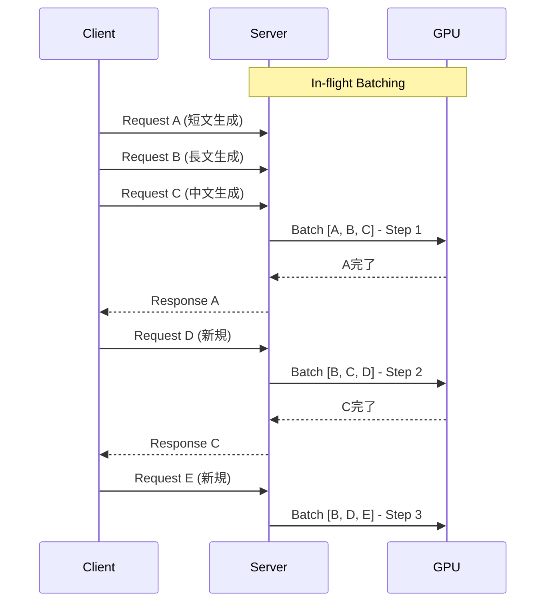
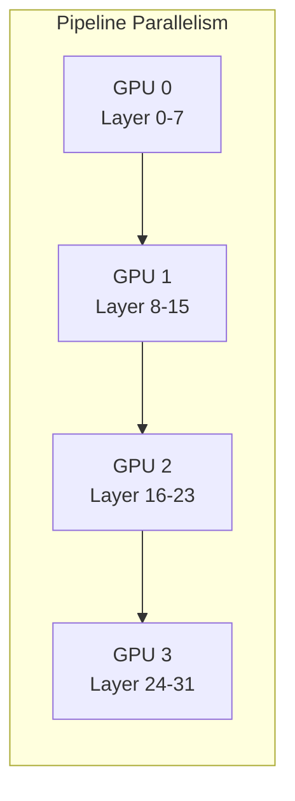

## ブログ概要（Summary）

本記事は [https://developer.nvidia.com/blog/mastering-llm-techniques-inference-optimization/](https://developer.nvidia.com/blog/mastering-llm-techniques-inference-optimization/) の解説記事です。

NVIDIAのShashank VermaとNeal Vaidyaによる本ブログ（2023年11月17日公開、2024年8月15日更新）は、LLM推論における主要なボトルネックとその最適化テクニックを体系的に整理している。バッチング戦略（静的バッチングからIn-flight batchingへの進化）、KVキャッシュのメモリ管理、PagedAttentionによるメモリフラグメンテーション削減、FlashAttentionによるI/O効率化、モデル並列化（Pipeline / Tensor / Sequence parallelism）、そして量子化・スパーシティまで、推論パイプライン全体の最適化手法を網羅している。

この記事は [Zenn記事: LLMバッチ処理の並列最適化：asyncio×キュー×トークンバジェットで処理速度を8倍にする](https://zenn.dev/0h_n0/articles/5f7f36e631d6b0) の深掘りです。

## 情報源

- **種別**: 企業テックブログ
- **URL**: [https://developer.nvidia.com/blog/mastering-llm-techniques-inference-optimization/](https://developer.nvidia.com/blog/mastering-llm-techniques-inference-optimization/)
- **組織**: NVIDIA（著者: Shashank Verma, Neal Vaidya）
- **発表日**: 2023年11月17日（2024年8月15日更新）

## 技術的背景（Technical Background）

LLM推論は、学習（Training）とは異なる固有のボトルネックを持つ。学習フェーズではGPUの演算能力（FLOPs）が律速になることが多いが、推論フェーズでは**メモリ帯域幅**と**メモリ容量**が主要なボトルネックとなる。

この違いが生じる理由は、推論時のAutoregressive decoding（自己回帰的な逐次生成）にある。トークンを1つずつ生成するたびにモデルの全パラメータをGPUメモリから読み出す必要があるが、1トークンあたりの演算量は小さい。結果としてGPU演算ユニットはメモリからのデータ転送を待つ時間が支配的になる。これは「memory-bound」な状態と呼ばれる。

NVIDIAのブログでは、この問題に対する6つの主要な最適化アプローチを整理している。バッチングによるGPU利用率向上、KVキャッシュによる再計算回避、PagedAttentionによるメモリ効率化、FlashAttentionによるI/O最適化、モデル並列化による計算分散、そして量子化・スパーシティによるモデルサイズ削減である。

## 実装アーキテクチャ（Architecture）

### バッチング戦略: 静的バッチングからIn-flight Batchingへ

**静的バッチング（Static Batching）**では、複数のリクエストをまとめて処理するが、バッチ内の全リクエストが完了するまで次のバッチを処理できない。生成長が異なるリクエストが混在すると、短いリクエストは長いリクエストの完了を待つことになり、GPUリソースが無駄になる。

**In-flight Batching（Continuous Batching）**は、この非効率を解消する。NVIDIAのブログによると、「完了したシーケンスは即座にバッチから退出し、他のリクエストの処理中に新しいリクエストの実行を開始する」という戦略である。



TensorRT-LLMではIn-flight batchingがデフォルトで有効化されており、NVIDIAのベンチマークではH100 GPU上でスループットが2倍以上向上したと報告されている。

### KVキャッシュ: メモリ消費量の計算

Transformer推論では、各トークン生成時にそれまでの全トークンに対するAttention計算が必要になる。KVキャッシュは、過去のトークンに対するKey・Valueテンソルを保存することで再計算を防ぐ仕組みである。

NVIDIAのブログでは、KVキャッシュのメモリ消費量を以下の式で示している。

$$
\text{KV Cache Size} = B \times L \times 2 \times N_{\text{layers}} \times H \times P
$$

ここで、
- $B$: バッチサイズ
- $L$: シーケンス長
- $2$: Key・Value の2テンソル分
- $N_{\text{layers}}$: Transformerレイヤー数
- $H$: 隠れ層の次元数（hidden size）
- $P$: 精度あたりのバイト数（FP16なら2バイト）

**具体例: Llama 2 7B**（$N_{\text{layers}}=32$, $H=4096$, FP16精度）でバッチサイズ1・シーケンス長4096の場合、

$$
1 \times 4096 \times 2 \times 32 \times 4096 \times 2 \approx 2 \text{ GB}
$$

バッチサイズ32では約64GBとなり、A100 80GBのメモリの大部分を占有する。

### PagedAttention: OSのページング概念をKVキャッシュに適用

KVキャッシュの課題は、リクエストごとに必要なメモリサイズが事前に確定しないことである。最大シーケンス長分のメモリを事前確保すると未使用領域が大量に発生し（内部フラグメンテーション）、異なるサイズのリクエストが混在するとメモリの隙間が生じる（外部フラグメンテーション）。

NVIDIAのブログでは、PagedAttentionがOSの仮想メモリのページング機構からインスピレーションを得ていると説明している。KVキャッシュを固定サイズのブロックに分割し、非連続なメモリ領域に配置することでフラグメンテーションを削減する。

vLLMプロジェクトの報告（Kwon et al., SOSP 2023）によると、従来のシステムではKVキャッシュメモリの60-80%が無駄になっていたのに対し、PagedAttentionでは無駄が4%未満に抑えられている。この結果、同一ハードウェア上で2-4倍のスループット向上が実現されたと報告されている。

### FlashAttention: I/O-Awareな正確Attention計算

FlashAttention（Dao et al., NeurIPS 2022）は、Attention計算の数学的な結果を変えずに、GPUメモリ階層を考慮したI/O効率の高い実装を提供するアルゴリズムである。

| メモリ種別 | 容量 | 帯域幅（A100の場合） |
|-----------|------|---------------------|
| HBM（High Bandwidth Memory） | 40-80 GB | 1.5-2.0 TB/s |
| SRAM（オンチップ） | ~20 MB | ~19 TB/s |

NVIDIAのブログでは、FlashAttentionが「タイリングによりattention計算の順序を再編成し、最終行列の小さな部分を一度に完全に計算・書き出す」と説明している。標準的なAttention実装では中間テンソル $S = QK^T$（サイズ $N \times N$）をHBMに書き出すが、FlashAttentionはこの中間テンソルの実体化を回避し、タイル単位でSRAM上で計算を完結させる。

$$
\text{Standard Attention HBM accesses} = \Omega(Nd + N^2)
$$

$$
\text{FlashAttention HBM accesses} = O\left(\frac{N^2 d^2}{M}\right)
$$

ここで$N$はシーケンス長、$d$はheadの次元数、$M$はSRAMのサイズである。典型的なパラメータでは、HBMアクセスを最大9倍削減できると報告されている。

### Grouped-Query Attention（GQA）

標準的なMulti-Head Attention（MHA）では各Attention Headが独立したKey・Valueを持つためKVキャッシュのメモリ消費が大きい。Multi-Query Attention（MQA）では全HeadがKey・Valueを共有するがモデル品質が低下する場合がある。

NVIDIAのブログでは、GQAがこの中間的な解として「Key・Valueを数グループのQuery Headに射影する」と説明している。MHAで学習済みのモデルを元の学習計算量の約5%でGQAに変換でき、Llama 2 70BがGQAを採用している。

### モデル並列化

NVIDIAのブログでは3種類のモデル並列化手法を説明している。

**Pipeline Parallelism**: モデルのレイヤーを複数のGPUに垂直分割する。ナイーブな実装ではパイプラインバブルが発生するため、マイクロバッチングで効率を改善する。

**Tensor Parallelism**: 個々のレイヤーを水平分割する。Multi-Head AttentionではAttention Headを異なるGPUに割り当て、MLPレイヤーでは重み行列を分割して並列計算する。

**Sequence Parallelism**: LayerNormやDropoutなどの操作をシーケンス次元に沿って分割する。



### 量子化とスパーシティ

**量子化**はモデルの重みや活性化値の精度を削減する手法である。NVIDIAのブログでは、重みの量子化は比較的単純だが活性化値の量子化は外れ値の存在により困難であると指摘している。LLM.int8()では外れ値を含む特定のレンジに対して高精度を維持する工夫が行われている。

**構造化スパーシティ**は重み行列の値をゼロに置換する手法で、NVIDIAのGPUでは2:4パターン（4要素中2要素をゼロにする）がハードウェアレベルで加速される。

## Production Deployment Guide

### AWS実装パターン（コスト最適化重視）

**注意**: 以下のコスト試算は2026年3月時点のAWS ap-northeast-1（東京）リージョンの概算値である。実際のコストはトラフィックパターン、リージョン、バースト使用量により変動する。

| 構成 | トラフィック | 推奨アーキテクチャ | 月額概算 |
|------|-------------|-------------------|---------|
| Small | ~100 req/日 | Lambda + Bedrock | $50-150 |
| Medium | ~1000 req/日 | ECS Fargate + vLLM | $300-800 |
| Large | 10000+ req/日 | EKS + GPU Spot + TensorRT-LLM | $2,000-5,000 |

**Small構成**: Lambda + Bedrock APIのサーバーレス構成。Batch APIで50%削減。**Medium構成**: ECS Fargate + vLLM（PagedAttention + Continuous Batching）。g5.xlarge使用。**Large構成**: EKS + TensorRT-LLM + Karpenter自動スケーリング。p4d.24xlarge Spotで最大90%コスト削減。

**コスト削減テクニック**: Spot Instances（最大90%削減）、Reserved Instances（最大72%削減）、Bedrock Batch API（50%削減）、Prompt Caching（30-90%削減）。

### Terraformインフラコード

**Small構成（Serverless: Lambda + Bedrock）**

```hcl
terraform {
  required_version = ">= 1.9"
  required_providers {
    aws = { source = "hashicorp/aws", version = "~> 5.80" }
  }
}

provider "aws" { region = "ap-northeast-1" }

resource "aws_iam_role" "llm_lambda" {
  name = "llm-inference-lambda-role"
  assume_role_policy = jsonencode({
    Version = "2012-10-17"
    Statement = [{
      Action = "sts:AssumeRole", Effect = "Allow"
      Principal = { Service = "lambda.amazonaws.com" }
    }]
  })
}

resource "aws_iam_role_policy" "bedrock_invoke" {
  name = "bedrock-invoke-policy"
  role = aws_iam_role.llm_lambda.id
  policy = jsonencode({
    Version = "2012-10-17"
    Statement = [
      {
        Effect = "Allow"
        Action = ["bedrock:InvokeModel", "bedrock:InvokeModelWithResponseStream"]
        Resource = "arn:aws:bedrock:ap-northeast-1::foundation-model/*"
      },
      {
        Effect = "Allow"
        Action = ["dynamodb:PutItem", "dynamodb:GetItem", "dynamodb:Query"]
        Resource = aws_dynamodb_table.request_log.arn
      }
    ]
  })
}

resource "aws_lambda_function" "llm_inference" {
  function_name = "llm-inference"
  runtime       = "python3.12"
  handler       = "handler.lambda_handler"
  role          = aws_iam_role.llm_lambda.arn
  timeout       = 120
  memory_size   = 512
  filename      = "lambda.zip"
}

resource "aws_dynamodb_table" "request_log" {
  name         = "llm-request-log"
  billing_mode = "PAY_PER_REQUEST"  # On-Demandでコスト最適化
  hash_key     = "request_id"
  attribute { name = "request_id"; type = "S" }
  server_side_encryption { enabled = true }  # KMS暗号化
}
```

**Large構成（Container: EKS + Karpenter + Spot）**

```hcl
module "eks" {
  source          = "terraform-aws-modules/eks/aws"
  version         = "~> 20.31"
  cluster_name    = "llm-inference-cluster"
  cluster_version = "1.31"
  vpc_id          = module.vpc.vpc_id
  subnet_ids      = module.vpc.private_subnets
  cluster_endpoint_public_access = false  # プライベートアクセスのみ
}

# Karpenter: Spot優先で最大90%コスト削減
resource "kubectl_manifest" "karpenter_nodepool" {
  yaml_body = yamlencode({
    apiVersion = "karpenter.sh/v1"
    kind       = "NodePool"
    metadata   = { name = "gpu-inference" }
    spec = {
      template = { spec = {
        requirements = [
          { key = "karpenter.sh/capacity-type", operator = "In", values = ["spot", "on-demand"] },
          { key = "node.kubernetes.io/instance-type", operator = "In",
            values = ["p4d.24xlarge", "g5.12xlarge", "g5.48xlarge"] }
        ]
      }}
      limits     = { cpu = "256", "nvidia.com/gpu" = "32" }
      disruption = { consolidationPolicy = "WhenEmptyOrUnderutilized", consolidateAfter = "30s" }
    }
  })
}

resource "aws_budgets_budget" "gpu_monthly" {
  name         = "llm-gpu-monthly-budget"
  budget_type  = "COST"
  limit_amount = "5000"
  limit_unit   = "USD"
  time_unit    = "MONTHLY"
  notification {
    comparison_operator        = "GREATER_THAN"
    threshold                  = 80
    threshold_type             = "PERCENTAGE"
    notification_type          = "ACTUAL"
    subscriber_email_addresses = ["ops-team@example.com"]
  }
}
```

### 運用・監視設定

**CloudWatch Logs Insights クエリ（推論レイテンシ分析）**

```
fields @timestamp, @message
| filter @message like /inference_latency/
| stats avg(latency_ms) as avg_latency,
        percentile(latency_ms, 95) as p95_latency,
        percentile(latency_ms, 99) as p99_latency
  by bin(1h)
| sort @timestamp desc
```

**X-Ray トレーシング + コスト監視（Python）**

```python
from aws_xray_sdk.core import xray_recorder, patch_all
import boto3

patch_all()  # boto3自動計装

@xray_recorder.capture("llm_inference")
def invoke_model(prompt: str, model_id: str) -> dict:
    """LLM推論を実行しX-Rayでトレースする。"""
    subsegment = xray_recorder.current_subsegment()
    subsegment.put_annotation("model_id", model_id)
    subsegment.put_metadata("prompt_length", len(prompt))
    response = bedrock_runtime.invoke_model(
        modelId=model_id,
        body=json.dumps({"prompt": prompt, "max_tokens": 4096}),
    )
    return response

def daily_cost_report() -> None:
    """日次コストレポートを取得し閾値超過時にSNS通知する。"""
    ce = boto3.client("ce", region_name="us-east-1")
    result = ce.get_cost_and_usage(
        TimePeriod={"Start": yesterday, "End": today},
        Granularity="DAILY", Metrics=["UnblendedCost"],
        Filter={"Dimensions": {"Key": "SERVICE",
            "Values": ["Amazon Bedrock", "AWS Lambda", "Amazon Elastic Kubernetes Service"]}},
    )
    total = sum(float(g["Metrics"]["UnblendedCost"]["Amount"])
                for r in result["ResultsByTime"] for g in r["Groups"])
    if total > 100:
        sns.publish(TopicArn="arn:aws:sns:...:cost-alert",
                    Message=f"Daily cost: ${total:.2f}")
```

### コスト最適化チェックリスト

**アーキテクチャ選択**
- [ ] トラフィック量に応じた構成選択（Serverless / Hybrid / Container）
- [ ] GPU要件の明確化（Bedrock APIか自前GPUか）
- [ ] リージョン選択（GPU Spot価格の低いリージョン活用）

**リソース最適化**
- [ ] EC2/EKS: Spot Instances優先（最大90%削減）
- [ ] Reserved Instances: 安定負荷分に1年コミット（最大72%削減）
- [ ] Savings Plans検討
- [ ] Lambda: メモリサイズ最適化（512MB-1024MBで検証）
- [ ] EKS: Karpenterで未使用ノードを30秒以内に回収

**LLMコスト削減**
- [ ] Bedrock Batch API: 非リアルタイム処理で50%削減
- [ ] Prompt Caching有効化（30-90%削減）
- [ ] モデル選択ロジック: 簡易タスクには軽量モデル
- [ ] トークン数制限: max_tokensの適切な設定
- [ ] 量子化モデル活用: INT8/FP8で推論コスト削減

**監視・アラート**
- [ ] AWS Budgets: 月額予算上限の設定
- [ ] CloudWatch アラーム: トークン使用量・レイテンシ異常検知
- [ ] Cost Anomaly Detection有効化
- [ ] 日次コストレポート: サービス別コスト可視化

**リソース管理**
- [ ] 未使用EBSボリューム・スナップショットの削除
- [ ] タグ戦略: Environment/Team/CostCenterでコスト配分
- [ ] S3ライフサイクルポリシー: 推論ログの自動アーカイブ
- [ ] 開発環境の夜間・週末停止

## パフォーマンス最適化（Performance）

NVIDIAのブログおよび関連する学術研究から得られるパフォーマンス指標を整理する。

**バッチング戦略の効果**: TensorRT-LLMのIn-flight batchingとカーネルレベルの最適化を組み合わせることで、H100上でスループットが2倍以上向上したとNVIDIAは報告している。

**PagedAttentionの効果**（vLLM、Kwon et al., SOSP 2023）:

| メトリクス | 従来手法 | PagedAttention |
|-----------|---------|---------------|
| KVキャッシュメモリ無駄率 | 60-80% | 4%未満 |
| スループット vs HuggingFace TGI | 1x | 最大3.5x |
| スループット vs HuggingFace Transformers | 1x | 最大24x |

ただしPagedAttentionはカーネルレベルのレイテンシが20-26%増加する。エンドツーエンドのスループットが向上するのは、メモリ効率化によりバッチサイズを拡大できるためである。

**FlashAttentionの効果**: 標準Attention実装と比較してHBMアクセスを最大9倍削減。FlashAttention-3（2024年）ではHopper GPUの非同期機能とFP8量子化でさらに高速化されている。

## 運用での学び（Production Lessons）

**KVキャッシュメモリの監視が最重要**: 推論サーバーの障害原因として多いのがKVキャッシュのOOMである。バッチサイズとシーケンス長の組み合わせでメモリ消費が急増するため、GPUメモリ使用率の継続的な監視が不可欠である。NVIDIA DCGMを使ったモニタリングが推奨される。

**Spot Instancesの中断対策**: GPU Spotは中断リスクがあるため、KarpenterでOn-Demandへのフォールバックを設定し、グレースフルシャットダウンで処理中リクエストを完了させる設計が必要である。

**量子化精度のトレードオフ**: INT8/FP8量子化は速度改善に有効だが、本番導入前に対象タスクのベンチマークで精度劣化を定量評価すべきである。

**バッチサイズの動的調整**: ピーク時のバッチサイズが大きすぎるとKVキャッシュがOOMを引き起こす。最大バッチサイズの上限設定とメモリ使用率に基づくAdmission Controlが重要である。

## 学術研究との関連（Academic Connection）

NVIDIAのブログで紹介されている技術は以下の学術研究に基づいている。

- **PagedAttention**: Kwon et al., "Efficient Memory Management for Large Language Model Serving with PagedAttention," SOSP 2023。vLLMとして実装。
- **FlashAttention**: Dao et al., NeurIPS 2022。FlashAttention-2（2023）、FlashAttention-3（2024）と進化。
- **Grouped-Query Attention**: Ainslie et al., EMNLP 2023。Llama 2 70Bに採用。
- **LLM.int8()**: Dettmers et al., NeurIPS 2022。活性化値の外れ値を考慮した混合精度量子化。

関連するZenn記事ではアプリケーション層でのバッチ処理並列化が扱われており、本ブログのGPU側推論最適化と相補的な内容である。

## まとめと実践への示唆

NVIDIAのブログは、LLM推論最適化を6つの観点から整理した包括的なガイドである。

実務では、PagedAttention（vLLM）やIn-flight batching（TensorRT-LLM）の導入がスループット改善の第一歩となる。FlashAttentionはPyTorch 2.0以降で標準サポートされている。大規模モデル（70B以上）ではTensor ParallelismとGQAの組み合わせが現実的な選択肢であり、量子化は精度とのトレードオフを評価した上で段階的に導入すべきである。

## 参考文献

- **Blog URL**: [Mastering LLM Techniques: Inference Optimization - NVIDIA](https://developer.nvidia.com/blog/mastering-llm-techniques-inference-optimization/)
- **PagedAttention論文**: [Kwon et al., SOSP 2023](https://arxiv.org/abs/2309.06180)
- **FlashAttention論文**: [Dao et al., NeurIPS 2022](https://arxiv.org/abs/2205.14135)
- **vLLM公式ドキュメント**: [https://docs.vllm.ai/](https://docs.vllm.ai/en/stable/design/paged_attention/)
- **TensorRT-LLM**: [NVIDIA TensorRT-LLM GitHub](https://github.com/NVIDIA/TensorRT-LLM)
- **Related Zenn article**: [LLMバッチ処理の並列最適化](https://zenn.dev/0h_n0/articles/5f7f36e631d6b0)
