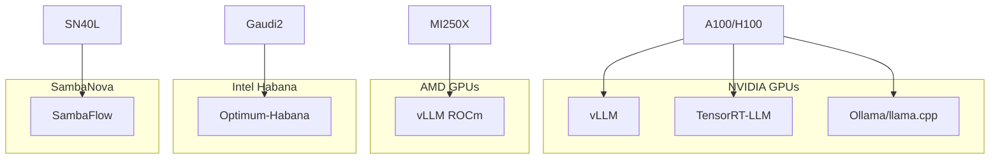

本記事は [LLM-Inference-Bench: Inference Benchmarking of Large Language Models on AI Accelerators](https://arxiv.org/abs/2411.00136)（arXiv:2411.00136、2024年10月31日投稿）の解説記事です。

## 論文概要（Abstract）

Chitty-Venkata et al.は、LLM推論の計算効率性を評価するための包括的なベンチマークスイート「LLM-Inference-Bench」を提案している。NVIDIAおよびAMDのGPU、Intel HabanaおよびSambaNova等の専用AIアクセラレータ上で、LLaMA、Mistral、Qwenファミリーの7Bおよび70Bモデルの推論性能を体系的に比較評価し、最適な構成を特定するためのインタラクティブダッシュボードを提供している。

この記事は [Zenn記事: Ollama本番運用ガイド：Kubernetes・認証・監視で構築するオンプレLLM基盤](https://zenn.dev/0h_n0/articles/3a91fb8a02cdc4) の深掘りです。Zenn記事ではNVIDIA A100を前提としたOllama構成を解説しているが、本論文はハードウェア選定の客観的根拠を提供する。

## 情報源

- **arXiv ID**: 2411.00136
- **URL**: [https://arxiv.org/abs/2411.00136](https://arxiv.org/abs/2411.00136)
- **著者**: Krishna Teja Chitty-Venkata, Siddhisanket Raskar, Bharat Kale, Farah Ferdaus, Aditya Tanikanti, Ken Raffenetti, Valerie Taylor, Murali Emani, Venkatram Vishwanath
- **発表年**: 2024
- **分野**: cs.LG（Machine Learning）
- **ライセンス**: CC BY 4.0

## 背景と動機（Background & Motivation）

LLM推論のハードウェア選定は、性能・コスト・可用性のトレードオフで決まる。しかし、異なるハードウェアプラットフォーム間での公正な比較は困難である。理由は以下の通りである。

1. **推論フレームワークの差異**: NVIDIA GPU向けにはvLLM、TensorRT-LLM、Ollama等が存在するが、AMD GPU向けにはvLLMの一部機能しか対応していない。Intel Habana向けには専用のOptimum-Habanaが必要
2. **量子化手法の差異**: NVIDIA GPUではGGUF（llama.cpp/Ollama）、AWQ、GPTQ等が使えるが、他プラットフォームでは対応する量子化手法が限定される
3. **ベンチマーク条件の統一困難**: 既存のベンチマークは特定のハードウェア/フレームワークに偏っており、クロスプラットフォーム比較が難しい

Zenn記事ではNVIDIA A100を前提としているが、組織のハードウェア調達計画によってはAMD MI250XやIntel Gaudi2が選択肢になる場合がある。本論文はそうした意思決定の根拠を提供する。

## 主要な貢献（Key Contributions）

著者らは以下の3つの貢献を報告している。

- **貢献1**: NVIDIA/AMD GPU、Intel Habana、SambaNova等の複数プラットフォームにまたがるLLM推論ベンチマークスイートの構築
- **貢献2**: LLaMA、Mistral、Qwenファミリーの7Bおよび70Bモデルでの体系的な性能評価
- **貢献3**: 最適なハードウェア/フレームワーク構成を特定するためのインタラクティブダッシュボードの提供

## 技術的詳細（Technical Details）

### ベンチマーク対象プラットフォーム

論文で評価されているハードウェアプラットフォームは以下の通りである。

| プラットフォーム | メーカー | メモリ | アーキテクチャ | 主な用途 |
|---------------|---------|--------|-------------|---------|
| A100 80GB | NVIDIA | 80GB HBM2e | Ampere | データセンター推論・訓練 |
| H100 80GB | NVIDIA | 80GB HBM3 | Hopper | 最新データセンター推論 |
| MI250X | AMD | 128GB HBM2e | CDNA 2 | HPC・AI推論 |
| Gaudi2 | Intel Habana | 96GB HBM2e | - | AI推論特化 |
| SN40L | SambaNova | - | Reconfigurable | AI推論特化 |

### 評価モデル

| モデルファミリー | パラメータ数 | 量子化 | 用途 |
|---------------|-----------|--------|------|
| LLaMA 2/3 | 7B, 70B | FP16, INT8 | 汎用チャット・推論 |
| Mistral | 7B | FP16, INT8 | 高効率チャット |
| Qwen | 7B, 70B | FP16, INT8 | 多言語対応 |

### ベンチマーク手法

LLM推論の性能は以下の指標で評価される。

$$
\text{Throughput} = \frac{N_{\text{output\_tokens}}}{T_{\text{total}}} \quad [\text{tokens/s}]
$$

$$
\text{TTFT} = T_{\text{first\_token}} - T_{\text{request}} \quad [\text{ms}]
$$

$$
\text{TPOT} = \frac{T_{\text{total}} - T_{\text{prefill}}}{N_{\text{output\_tokens}} - 1} \quad [\text{ms/token}]
$$

ここで、
- $N_{\text{output\_tokens}}$: 出力トークン数
- $T_{\text{total}}$: 総処理時間
- $T_{\text{first\_token}}$: 最初のトークンが生成された時刻
- $T_{\text{request}}$: リクエスト送信時刻
- $T_{\text{prefill}}$: プリフィル処理時間

### フレームワーク別の対応状況



この図は、Ollamaの対応プラットフォームが基本的にNVIDIA GPUに限定されることを示している。AMD GPUではOllamaも動作するが、vLLM ROCm版の方が最適化されている場合がある。

## 実装のポイント（Implementation）

### ベンチマーク実行の設計

LLM推論ベンチマークを正確に実行するには、以下の点に注意が必要である。

**ウォームアップの必要性**: LLM推論エンジンは初回リクエスト時にCUDAカーネルのJITコンパイルやKVキャッシュの初期化を行う。ベンチマーク開始前に10-20回のウォームアップリクエストを送信し、定常状態での性能を計測する必要がある。

**入出力長の制御**: 入力トークン数と出力トークン数を固定し、条件を揃える。論文では入力1024トークン、出力128トークンなどの標準的な設定が使用されている。

**同時実行レベルの段階的変化**: 単一リクエストのレイテンシだけでなく、複数リクエスト同時実行時のスループットを計測する。これはZenn記事で解説されているOllamaの`OLLAMA_NUM_PARALLEL`設定と直接関連する。

```python
import time
from typing import NamedTuple


class BenchmarkResult(NamedTuple):
    """ベンチマーク結果を格納する構造体"""
    throughput_tokens_per_sec: float
    ttft_ms: float
    tpot_ms: float
    total_latency_ms: float


def measure_inference(
    client,
    prompt: str,
    max_tokens: int = 128,
    num_warmup: int = 10,
    num_runs: int = 50,
) -> BenchmarkResult:
    """LLM推論のベンチマークを実行する

    Args:
        client: LLM推論クライアント（OpenAI互換API）
        prompt: 入力プロンプト
        max_tokens: 最大出力トークン数
        num_warmup: ウォームアップ回数
        num_runs: 計測回数

    Returns:
        BenchmarkResult: ベンチマーク結果
    """
    # ウォームアップ
    for _ in range(num_warmup):
        client.completions.create(
            model="llama3.1:8b",
            prompt=prompt,
            max_tokens=max_tokens,
        )

    # 計測
    latencies = []
    ttfts = []
    for _ in range(num_runs):
        start = time.perf_counter()
        first_token_time = None

        stream = client.completions.create(
            model="llama3.1:8b",
            prompt=prompt,
            max_tokens=max_tokens,
            stream=True,
        )

        token_count = 0
        for chunk in stream:
            if first_token_time is None:
                first_token_time = time.perf_counter()
            token_count += 1

        end = time.perf_counter()
        latencies.append(end - start)
        ttfts.append(first_token_time - start)

    avg_latency = sum(latencies) / len(latencies)
    avg_ttft = sum(ttfts) / len(ttfts)
    avg_throughput = max_tokens / avg_latency
    avg_tpot = (avg_latency - avg_ttft) / (max_tokens - 1) * 1000

    return BenchmarkResult(
        throughput_tokens_per_sec=avg_throughput,
        ttft_ms=avg_ttft * 1000,
        tpot_ms=avg_tpot,
        total_latency_ms=avg_latency * 1000,
    )
```

## 実験結果（Results）

### ハードウェア別の性能特性

論文の評価結果から、以下の傾向が読み取れる（具体的な数値は論文のインタラクティブダッシュボードで確認可能）。

| ハードウェア | 7Bモデル性能 | 70Bモデル性能 | コスト効率 |
|------------|------------|-------------|----------|
| H100 | 最高スループット | 最高スループット | 中（高価） |
| A100 | 高スループット | 高スループット | 中 |
| MI250X | 中程度 | 中程度 | 高（AMD価格優位） |
| Gaudi2 | 中程度 | 限定的 | 高（Intel価格優位） |
| SN40L | 特定ワークロードで高性能 | 限定的 | 特殊用途向け |

### Ollama利用環境での適用

Zenn記事ではNVIDIA A100を前提としているが、本論文の知見に基づくと以下の選択肢も検討に値する。

| 用途 | 推奨ハードウェア | 理由 |
|------|---------------|------|
| 開発・テスト | RTX 4090 (24GB) | コスト効率最高、Ollama完全対応 |
| 本番（7B-13B） | A100 40GB | Ollama対応、十分な性能 |
| 本番（70B） | A100 80GB / H100 | Zenn記事の推奨構成 |
| コスト重視 | AMD MI300X | vLLM ROCm対応、Ollama一部対応 |

### モデルサイズと推論フレームワークの関係

$$
\text{Memory Required} = \frac{P \times B}{Q} + S_{\text{KV}}
$$

ここで、$P$はパラメータ数、$B$はバイト数/パラメータ（FP16=2、INT8=1、INT4=0.5）、$Q$は量子化効率、$S_{\text{KV}}$はKVキャッシュサイズである。

7Bモデル（INT4量子化）の場合:

$$
\text{Memory} = \frac{7 \times 10^9 \times 0.5}{1} + S_{\text{KV}} \approx 3.5\text{GB} + S_{\text{KV}}
$$

A100 80GBでは理論上20個以上の7Bモデルを同時ロード可能だが、KVキャッシュと並列リクエストのメモリオーバーヘッドを考慮すると、実用的にはZenn記事で示されている`OLLAMA_MAX_LOADED_MODELS`の式に従って計算する必要がある。

## 実運用への応用（Practical Applications）

### オンプレミスLLM基盤のハードウェア選定

本論文のベンチマーク結果は、Zenn記事のOllama本番運用構成におけるハードウェア選定に直接活用できる。

**NVIDIA環境（Zenn記事の前提）**: A100/H100 + vLLM/Ollamaの組み合わせが最も広くベンチマークされており、性能予測の信頼性が高い。Ollamaはllama.cppをバックエンドとして使用しており、NVIDIAのCUDA最適化の恩恵を直接受ける。

**AMD環境（代替選択肢）**: MI250X/MI300XではvLLM ROCm版が推奨される。Ollamaも ROCm対応しているが、NVIDIAほど最適化されていない場合がある。コスト面ではAMD GPUが優位な場合が多い。

**Intel環境（特殊用途）**: Gaudi2/Gaudi3はOptimum-Habanaフレームワークでの利用が前提となる。Ollamaは非対応のため、Intel環境ではvLLMまたは専用フレームワークの使用が必要。

### インタラクティブダッシュボードの活用

著者らが提供するインタラクティブダッシュボードでは、以下のパラメータを変更して最適構成を探索できる。

- ハードウェアプラットフォーム
- モデルファミリー・サイズ
- 推論フレームワーク
- バッチサイズ
- 入力/出力トークン長

このダッシュボードは、Zenn記事で解説されているGPU選定（`nodeSelector: gpu-type: "a100"`）やリソース制限の設計根拠として活用できる。

## 関連研究（Related Work）

- **MLPerf Inference**: MLCommonsが運営する業界標準ベンチマーク。MLPerf Inference 5.1（2025年9月）ではLlama 3.1 8Bが新たに追加され、vLLMがリファレンス実装として採用されている。LLM-Inference-Benchはより多くのハードウェアプラットフォームをカバーしている点で補完的
- **vLLM Benchmark Suite**: vLLMプロジェクトが提供するベンチマークスクリプト。NVIDIA GPU中心の評価に特化しており、クロスプラットフォーム比較は限定的
- **GuideLLM**: Red Hatが公開するベンチマークツール。Kubernetes環境での推論性能評価に特化しており、本論文のハードウェアレベル評価を補完する

## まとめと今後の展望

LLM-Inference-Benchは、LLM推論のハードウェア選定に客観的根拠を提供する重要なベンチマークスイートである。Zenn記事のOllama本番運用設計に対する主な示唆は以下の通りである。

1. **NVIDIA GPUは推論フレームワークの選択肢が最も広い**（vLLM、TensorRT-LLM、Ollama等）。Zenn記事のNVIDIA A100前提は合理的な選択である
2. **AMD MI300X等の代替ハードウェア**も性能面では競争力があり、コスト面で優位な場合がある。ただしOllamaの最適化度合いはNVIDIAに劣る
3. **ベンチマーク手法**（ウォームアップ、入出力長固定、同時実行レベル変化）は、Ollamaの本番性能評価にも適用すべきである

今後は、量子化手法（GGUF vs AWQ vs GPTQ）のクロスプラットフォーム比較や、マルチGPU構成でのスケーラビリティ評価が期待される。

## 参考文献

- **arXiv**: [https://arxiv.org/abs/2411.00136](https://arxiv.org/abs/2411.00136)
- **MLPerf Inference**: [https://mlcommons.org/benchmarks/inference/](https://mlcommons.org/benchmarks/inference/)
- **Related Zenn article**: [https://zenn.dev/0h_n0/articles/3a91fb8a02cdc4](https://zenn.dev/0h_n0/articles/3a91fb8a02cdc4)
