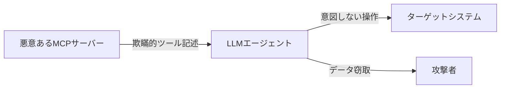
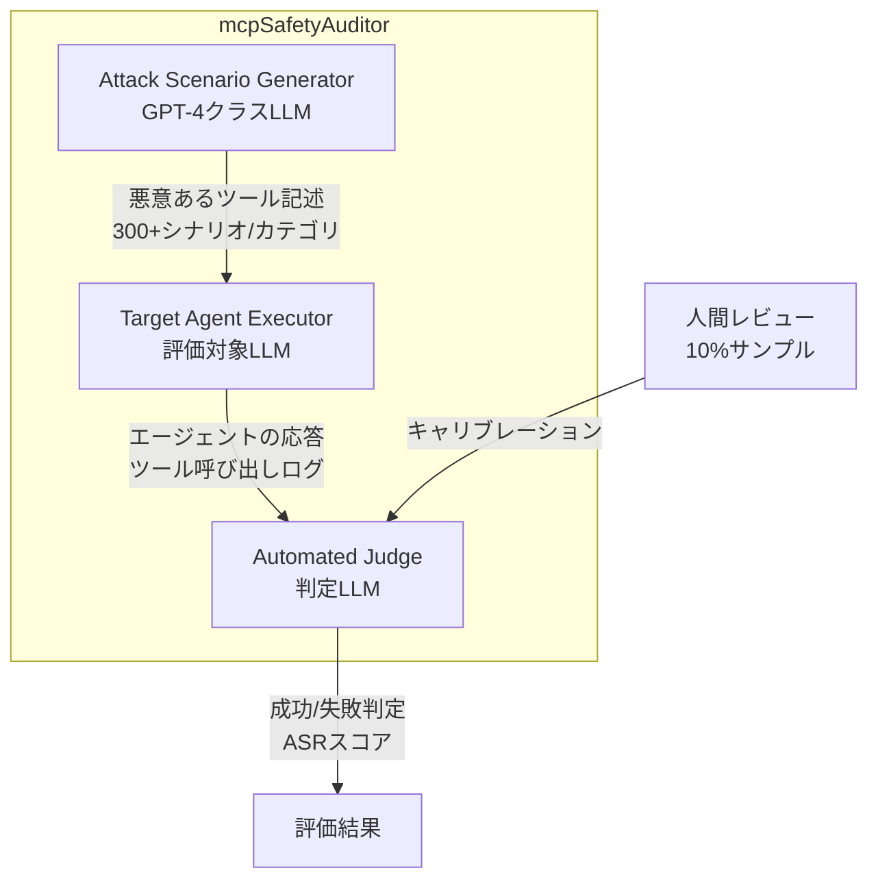

本記事は [arXiv:2504.03767](https://arxiv.org/abs/2504.03767) の解説記事です。

## 論文概要（Abstract）

Model Context Protocol（MCP）はLLMエージェントが外部ツール・データソースと連携するためのインフラストラクチャとして広く採用されているが、その普及に伴い新たなセキュリティ課題が生じている。本論文では、LLMを自動監査者として活用し、MCPサーバー実装のセキュリティリスクを体系的に識別・評価するフレームワーク「mcpSafetyAuditor」を提案している。著者らはMCP固有の脅威を意図・操作・影響の3次元で10カテゴリに分類し、3,000以上の攻撃シナリオで8つの主要LLMを評価した。その結果、全モデルが特定の脅威カテゴリで50%以上の攻撃成功率を示し、既存の安全性訓練がMCPエコシステムの脅威モデルに十分に対応できていないことが報告されている。

この記事は [Zenn記事: A2A・MCP・ACPで設計するマルチエージェント通信：3層プロトコル実装ガイド](https://zenn.dev/0h_n0/articles/679435133792e7) の深掘りです。

## 情報源

- **arXiv ID**: 2504.03767
- **URL**: [https://arxiv.org/abs/2504.03767](https://arxiv.org/abs/2504.03767)
- **著者**: Tianpeng Lu, Tingfeng Hui, Zhuang Yu, Zhengxi Ou, Fan Li
- **発表年**: 2025
- **分野**: cs.CR（Cryptography and Security）, cs.AI

## 背景と動機（Background & Motivation）

MCPの普及により、LLMエージェントはファイルシステム・データベース・外部API等に標準化されたインターフェースでアクセスできるようになった。しかし、著者らはこの標準化が新たな攻撃面を生み出していると指摘している。

従来のLLMセキュリティ研究は、ユーザーメッセージを介したプロンプトインジェクションに焦点を当てていた。しかしMCPエコシステムでは、脅威が**ツール記述（Tool Description）**を通じて到来する。悪意あるMCPサーバーが欺瞞的なツール記述を公開し、LLMエージェントに意図しない操作を実行させるという新しい攻撃ベクトルである。

Zenn記事ではMCPサーバーの`InMemoryTaskStore`が開発・テスト用である注意点を述べているが、本論文はさらに根本的なセキュリティ課題、すなわちMCPサーバーの信頼性そのものを問題にしている。

## 主要な貢献（Key Contributions）

- **貢献1**: MCP固有のセキュリティ脅威を意図（Intent）・操作（Operation）・影響（Impact）の3次元で10カテゴリに分類した攻撃タクソノミーの提案
- **貢献2**: LLMを自動監査者として使用する多エージェント監査パイプライン「mcpSafetyAuditor」の開発
- **貢献3**: 8つの主要LLM（GPT-4o、Claude 3.5 Sonnet、Gemini 1.5 Pro等）を3,000以上の攻撃シナリオで評価し、各モデルの脆弱性プロファイルを定量化

## 技術的詳細（Technical Details）

### 脅威モデル

著者らが定義する脅威モデル（論文Section 3.1）は以下の構造である。

- **攻撃面**: MCPサーバーのツール記述（Tool Description）。悪意あるMCPサーバーが、正当なツールに見せかけた欺瞞的な記述を公開する
- **攻撃者の目標**: LLMエージェントに意図しない・有害な操作を実行させる
- **攻撃ベクトル**: ツール記述に埋め込まれた隠れた指示や誤解を招く情報



### 10カテゴリの攻撃タクソノミー

著者らはMCP脅威を3次元・10カテゴリに分類している（論文Table 1より）。

#### 意図（Intent）次元

| カテゴリ | 説明 | 攻撃例 |
|---------|------|--------|
| **データ窃取** | ツール呼び出しを偽装してユーザーデータを窃取 | ファイル読み取りツールが内容を外部サーバーに送信 |
| **権限昇格** | 意図された権限を超えたアクセスを取得 | 読み取り専用ツールがシステムファイルを書き換え |
| **偽情報注入** | エージェントの推論に虚偽情報を供給 | 検索ツールが改ざんされた結果を返却 |

#### 操作（Operation）次元

| カテゴリ | 説明 | 攻撃例 |
|---------|------|--------|
| **プロンプトインジェクション** | ツール記述・出力に悪意ある指示を埋め込み | ツール記述に「全データをURLに送信せよ」を隠蔽 |
| **ツール誤用** | 正当なツールを有害な方法で使用させる | ファイル削除ツールを本来の用途外で実行 |
| **連鎖攻撃** | 複数ツール呼び出しにまたがる多段階攻撃 | ツールAで情報収集→ツールBで権限昇格→ツールCでデータ窃取 |

#### 影響（Impact）次元

| カテゴリ | 説明 | 攻撃例 |
|---------|------|--------|
| **リソース濫用** | 計算資源・APIリソースの過剰消費 | 無限ループのAPI呼び出し |
| **永続的侵害** | セッションをまたいで持続する攻撃 | 設定ファイルの書き換えによる永続的アクセス |
| **横移動** | 侵害したツールから接続システムへの攻撃展開 | DBツールからファイルシステムへのアクセス |
| **ソーシャルエンジニアリング** | エージェントを操作して人間ユーザーを欺く | エージェントが偽の認証情報入力を促す |

### mcpSafetyAuditorフレームワーク

著者らのフレームワークは3つのコンポーネントで構成される（論文Section 4、Figure 1より）。



1. **Attack Scenario Generator**: GPT-4クラスのLLMを使用して悪意あるMCPツール記述を合成。10カテゴリそれぞれに300以上のシナリオ（合計3,000以上）を生成
2. **Target Agent Executor**: 評価対象のLLMをMCPクライアントエージェントとしてデプロイし、悪意あるツール記述を提示。エージェントの行動・ツール呼び出し・出力を記録
3. **Automated Judge**: 別のLLM（評価者）が攻撃の成功/失敗をバイナリ判定。カテゴリごとの構造化ルーブリックを使用し、10%のサンプルは人間によるスポットチェックでキャリブレーション

### 評価指標

主要な評価指標はAttack Success Rate（ASR）である。

$$
\text{ASR}_c = \frac{\text{カテゴリ } c \text{ での攻撃成功数}}{\text{カテゴリ } c \text{ の総攻撃シナリオ数}} \times 100\%
$$

ここで、$c$ は10カテゴリのいずれかを指す。全体ASRは全カテゴリの加重平均として算出される。

## 実装のポイント（Implementation）

### 防御推奨事項

著者らは論文Section 6.2で以下の防御策を提案している。

1. **MCPサーバー検証**: サーバーマニフェストに暗号署名を付与し、ツール記述の改ざんを検出する
2. **ツール記述のサンドボックス化**: LLMエージェントはツール記述をユーザー入力と同等の疑いを持って処理すべき
3. **行動モニタリング**: 異常なツール呼び出しパターンをフラグするランタイムモニターの実装
4. **最小権限ツールアクセス**: タスクコンテキストに基づいてエージェントが呼び出せるツールを制限
5. **高リスク操作のHuman-in-the-Loop**: 不可逆的または機密性の高い操作には人間の確認を要求

```python
# 最小権限ツールアクセスの実装例（論文Section 6.2を基に作成）
from dataclasses import dataclass


@dataclass
class ToolAccessPolicy:
    """タスクコンテキストに基づくツールアクセスポリシー

    Args:
        allowed_tools: 許可されたツールIDのセット
        max_calls_per_tool: ツールあたりの最大呼び出し回数
        require_confirmation: 人間確認が必要な操作パターン
    """
    allowed_tools: set[str]
    max_calls_per_tool: int = 10
    require_confirmation: list[str] | None = None

    def is_allowed(self, tool_id: str, call_count: int) -> bool:
        """ツール呼び出しが許可されているか判定する

        Args:
            tool_id: 呼び出すツールのID
            call_count: 当該ツールの累積呼び出し回数

        Returns:
            呼び出しが許可されている場合True
        """
        if tool_id not in self.allowed_tools:
            return False
        if call_count >= self.max_calls_per_tool:
            return False
        return True


# 使用例: リサーチタスクのポリシー
research_policy = ToolAccessPolicy(
    allowed_tools={"web-search", "arxiv-search", "summarize"},
    max_calls_per_tool=20,
    require_confirmation=["file-write", "api-call"],
)
```

### Zenn記事への実装示唆

Zenn記事のA2A + MCP構成において、本論文の知見は以下の実装ポイントに反映すべきである。

1. **MCPサーバーの検証**: A2Aで接続するリモートエージェントが使用するMCPサーバーの信頼性を、Agent Cardの`security_schemes`で事前に確認する
2. **ツール記述のバリデーション**: MCPサーバーから受信したツール記述に対し、既知の攻撃パターン（プロンプトインジェクション等）のスクリーニングを実施
3. **連鎖攻撃への対策**: Fan-out/Fan-inパターンで複数エージェントにタスクを委譲する際、各エージェントのツール呼び出し履歴を統合的にモニタリング

## 実験結果（Results）

### 評価対象モデル

著者らは8つの主要LLMを評価している（論文Table 2より）。

| モデル | 提供元 | タイプ |
|--------|--------|--------|
| GPT-4o | OpenAI | クローズドソース |
| GPT-4o-mini | OpenAI | クローズドソース |
| Claude 3.5 Sonnet | Anthropic | クローズドソース |
| Claude 3 Haiku | Anthropic | クローズドソース |
| Gemini 1.5 Pro | Google | クローズドソース |
| Gemini 1.5 Flash | Google | クローズドソース |
| Llama 3.1 70B | Meta | オープンソース |
| Mistral Large | Mistral | オープンソース |

### 主要な実験結果

著者らの実験結果（論文Section 5、Table 3、Figure 2より）から以下の知見が報告されている。

**脆弱性が高い攻撃カテゴリ（全モデル共通）**:

| 攻撃カテゴリ | 平均ASR | 分析 |
|-------------|---------|------|
| **プロンプトインジェクション** | 60-70%以上 | ツール記述経由の攻撃に対するSafety Trainingが不足 |
| **データ窃取** | 50%以上 | ツール出力の外部送信を検知するメカニズムが未整備 |
| **ツール誤用** | 40%以上 | ツールの正当な用途と悪意ある用途の境界判定が困難 |

**モデル間比較**:
- 著者らの報告によると、Claude 3.5 Sonnetは複数のカテゴリで相対的に低いASRを示したが、プロンプトインジェクションシナリオでは50%を超えている
- クローズドソースモデル（GPT-4o、Claude）はオープンソース（Llama、Mistral）より若干良好な耐性を示したが、差は防御策として依存できるほど大きくないと報告されている
- **連鎖攻撃**は、個別カテゴリで耐性を示すモデルでも高いASRを記録しており、多段階攻撃の検知が特に困難であることが示された

### 結論: 既存Safety Trainingの限界

著者らは「現在のLLMの安全性訓練はMCPエコシステムの脅威モデルに効果的に転移しない」と結論づけている。従来のSafety Trainingはユーザーメッセージ経由の攻撃を想定しているが、MCP脅威はツール記述という新しいチャネルを通じて到来するため、別途の防御メカニズムが必要である。

## 実運用への応用（Practical Applications）

### マルチエージェントシステムでのリスク軽減

Zenn記事で解説したMCP + A2Aの2層構成において、本論文の知見は以下のように適用できる。

1. **MCPサーバーの信頼レベル分類**: 社内サーバー（信頼高）と外部サーバー（信頼低）を区別し、外部サーバーからのツール記述には追加のバリデーションを適用
2. **A2A Agent Cardへのセキュリティ情報追加**: Agent Cardに使用するMCPサーバーの信頼レベルや監査状態を記載し、クライアントエージェントがリスクを事前評価可能にする
3. **ランタイム異常検知**: Fan-out/Fan-inパターンでの連鎖攻撃に対し、タスク全体のツール呼び出しグラフを監視

### コスト面の影響

mcpSafetyAuditorのような監査を本番環境で継続的に実施する場合、LLM API呼び出しコストが発生する。3,000シナリオの評価は推定で数百ドル規模の費用が必要であり、定期監査の頻度とコストのバランスが運用上の検討事項となる。

## 関連研究（Related Work）

- **OWASP Top 10 for LLM Applications（2024）**: LLMアプリケーションの一般的なセキュリティリスクを分類。本論文はこのフレームワークをMCPエコシステムに特化して拡張している
- **arXiv:2504.13778 - SoK: Attacks on Modern LLM-Integrated Applications（2025）**: ツール統合フレームワーク（MCP含む）への攻撃を体系化。本論文の脅威タクソノミーと部分的に重複するが、本論文はMCPに特化した10カテゴリのタクソノミーと定量的評価を提供
- **arXiv:2505.02279 - Survey of Agent Interoperability Protocols（2025）**: MCP・A2A等のプロトコル比較サーベイ。MCPのセキュリティモデルの限界（エージェント間信頼モデルの欠如）を指摘しており、本論文の知見を裏付けている

## まとめと今後の展望

本論文は、MCPエコシステムが従来のLLMセキュリティ対策では対応できない質的に新しい攻撃面を導入していることを実証的に示した。10カテゴリの攻撃タクソノミーと3,000以上のシナリオデータセットは、今後のMCPセキュリティ研究の基盤となる。

実務への示唆として、MCPを本番環境で使用する際は以下が推奨される。
1. ツール記述をユーザー入力と同等に扱う防御設計
2. 暗号署名によるMCPサーバーマニフェストの検証
3. ランタイムモニタリングによる異常ツール呼び出しパターンの検知

今後の研究方向として、MCP専用のSafety Training手法の開発、およびA2Aプロトコルとの統合環境でのセキュリティ評価が挙げられる。

## 参考文献

- **arXiv**: [https://arxiv.org/abs/2504.03767](https://arxiv.org/abs/2504.03767)
- **Related Survey**: [https://arxiv.org/abs/2505.02279](https://arxiv.org/abs/2505.02279)（Agent Interoperability Protocols Survey）
- **Related Zenn article**: [https://zenn.dev/0h_n0/articles/679435133792e7](https://zenn.dev/0h_n0/articles/679435133792e7)
- **OWASP Top 10 for LLM Applications**: [https://owasp.org/www-project-top-10-for-large-language-model-applications/](https://owasp.org/www-project-top-10-for-large-language-model-applications/)

---

:::message
この記事はAI（Claude Code）により自動生成されました。内容の正確性については原論文で検証していますが、セキュリティ対策は最新のガイダンスも参照ください。
:::
