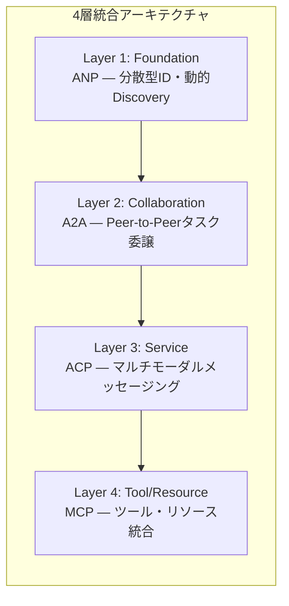

本記事は [arXiv:2505.02279](https://arxiv.org/abs/2505.02279) の解説記事です。

## 論文概要（Abstract）

AIエージェントの急速な普及に伴い、異種システム間の相互運用性を確保するための標準化された通信プロトコルが求められている。本論文は、Model Context Protocol（MCP）、Agent Communication Protocol（ACP）、Agent-to-Agent Protocol（A2A）、Agent Network Protocol（ANP）の4つのプロトコルを体系的に調査し、アーキテクチャ基盤・通信パラダイム・セキュリティモデル・ユースケース適合性の観点から比較分析を行っている。著者らは4プロトコルが競合関係ではなく補完関係にあることを示し、ANP→A2A→ACP→MCPの層状統合アーキテクチャを提案している。

この記事は [Zenn記事: A2A・MCP・ACPで設計するマルチエージェント通信：3層プロトコル実装ガイド](https://zenn.dev/0h_n0/articles/679435133792e7) の深掘りです。

## 情報源

- **arXiv ID**: 2505.02279
- **URL**: [https://arxiv.org/abs/2505.02279](https://arxiv.org/abs/2505.02279)
- **著者**: Abul Ehtesham, Aditi Singh, Gaurav Kumar Gupta, Saket Kumar
- **発表年**: 2025
- **分野**: cs.AI, cs.MA（Multi-Agent Systems）

## 背景と動機（Background & Motivation）

2024年から2025年にかけて、LLMベースの自律エージェントが急速に普及した。しかし、エージェント間の通信には統一された標準がなく、フレームワークごとに独自のプロトコルが乱立している状況がある。著者らは、この問題を以下の3点に整理している。

1. **ツール連携とエージェント間協調は別問題**: MCPはツールアクセスに適するが、エージェント同士のタスク委譲には対応していない
2. **DiscoveryとTrustの未成熟**: エージェントが動的に他のエージェントを発見し、信頼関係を構築するメカニズムが不十分
3. **デプロイメントコンテキストの多様性**: ローカル開発からエンタープライズ、オープンインターネットまで、それぞれ異なるセキュリティ・スケーラビリティ要件がある

これらの課題に対し、既存の4プロトコルがどのように対応するかを体系的に整理することが本論文の目的である。

## 主要な貢献（Key Contributions）

- **貢献1**: MCP・ACP・A2A・ANPの4プロトコルについて、アーキテクチャ・通信モデル・セキュリティ・Discovery・デプロイメントの5軸で比較分析を実施
- **貢献2**: 4プロトコルが補完関係にあることを示し、ANP（Foundation Layer）→A2A（Collaboration Layer）→ACP（Service Layer）→MCP（Tool/Resource Layer）の4層統合アーキテクチャを提案
- **貢献3**: Trust・スケーラビリティ・セマンティック整合性・ガバナンスの4つのオープンチャレンジを特定し、プロトコル選択ガイダンスを提供

## 技術的詳細（Technical Details）

### 4プロトコルのアーキテクチャ比較

著者らは各プロトコルのアーキテクチャを以下のように分類している（論文Section 7.1より）。

| 次元 | MCP | ACP | A2A | ANP |
|------|-----|-----|-----|-----|
| **提唱者** | Anthropic | IBM/BeeAI | Google | コミュニティ |
| **アーキテクチャ** | Client-Server | RESTサーバー | Peer-to-Peer | 分散型P2P |
| **トランスポート** | stdio / HTTP+SSE | HTTP/REST | HTTP/SSE | HTTP / DID |
| **Discovery** | 静的（事前設定URI） | 手動/レジストリ | Agent Card（半動的） | DID + JSON-LD（動的） |
| **状態管理** | ステートフル | ステートレスREST | ステートフル（Taskライフサイクル） | ステートレス（ID層） |
| **マルチモーダル** | 限定的 | あり（Parts） | あり（Artifacts） | あり（JSON-LD） |
| **セキュリティ** | OAuth 2.0 / OS分離 | TLS / APIキー | HTTPS / OAuth / JWT | DID暗号ID |
| **エージェント間信頼** | なし | なし | Agent Card交渉 | 検証可能資格情報 |
| **デプロイ範囲** | ローカル/企業内 | ローカル/企業内 | 企業/クラウド | オープンインターネット |
| **成熟度** | 高（Anthropic） | 中 | 中〜高（Google） | 低（コミュニティ） |

### MCPの通信プリミティブ

MCPは以下の4つの通信プリミティブを定義している（論文Section 3.2より）。

- **Tools**: 呼び出し可能な関数（例: ファイル読み取り、DB検索）
- **Resources**: 構造化データへのアクセス（例: ファイルシステム、データベース）
- **Prompts**: LLMへの入力テンプレート
- **Sampling**: LLM推論の呼び出し

メッセージ形式はJSON-RPC 2.0を採用しており、トランスポートはローカル環境ではstdio、リモート環境ではHTTP+SSEを使用する。

### A2AのAgent CardとTaskモデル

A2Aの中核概念は**Agent Card**と**Task**である（論文Section 5.2より）。

Agent Cardは`/.well-known/agent.json`に配置されるJSON形式のメタデータで、エージェントの能力・エンドポイント・認証要件を宣言する。クライアントエージェントはAgent Cardを取得することで、リモートエージェントの能力を動的に把握できる。

Taskは明確なライフサイクル（submitted → working → completed/failed）を持つ作業単位で、以下の要素で構成される。

- **Messages**: タスク内のロールベース（user/agent）メッセージ交換
- **Artifacts**: 構造化されたタスク出力
- **Push Notifications**: 非同期更新のWebhook通知

### ANPのDIDベース分散型アイデンティティ

ANPはW3C標準のDecentralized Identifiers（DID）を採用している（論文Section 6より）。

$$
\text{DID} = \text{did}:\text{method}:\text{method-specific-identifier}
$$

ここで、
- $\text{method}$: DID解決メソッド（例: `web`, `key`）
- $\text{method-specific-identifier}$: メソッド固有のID

DIDドキュメントにはエージェントの公開鍵が含まれ、中央認証局なしで暗号的に検証可能なアイデンティティを提供する。JSON-LDメタデータによりセマンティックなDiscoveryが可能になる。

### 層状統合アーキテクチャ

著者らが提案する4層統合スタック（論文Section 8.1より）は以下の構成である。



エンドツーエンドのシナリオでは、Agent AがANPでオープンネットワーク上のAgent Bを発見し、A2Aでタスクを委譲する。Agent BはACPでエンタープライズマルチモーダルサービスを呼び出し、MCPでローカルDBやファイルシステムにアクセスする。結果は逆方向にAgent Aまで伝搬する。

## 実装のポイント（Implementation）

### プロトコル選択の判断基準

著者らは論文Section 8.3で以下のガイダンスを示している。

- **MCPを使うべき場面**: 単一エージェントがツール・ファイル・DB・APIへの構造化アクセスを必要とする場合
- **ACPを使うべき場面**: エンタープライズ環境、マルチモーダルコンテンツ、REST native アーキテクチャ
- **A2Aを使うべき場面**: 複数エージェントのタスク委譲をチーム・システム間で行う場合
- **ANPを使うべき場面**: 分散型アイデンティティと動的Discoveryが必要なオープンインターネットエージェントネットワーク
- **層状組み合わせ**: 上記すべてを必要とする本番マルチエージェントシステム

### 実装上の注意点

1. **Trust Gapへの対処**: MCP・ACPにはエージェント間信頼モデルがない。A2AのAgent Cardは部分的に対応するが、高セキュリティ環境ではANPのDID/検証可能資格情報が必要
2. **Discoveryのスケーラビリティ**: Agent Cardのクローリングは大規模環境でボトルネックになりうる。キャッシュ戦略とTTL設定が重要
3. **ステートフル vs ステートレスの選択**: 長時間実行ワークフローにはA2A（ステートフル）、水平スケーリング優先ならACP（ステートレスREST）

```python
# プロトコル選択の判断フロー（論文Section 8.3を基に作成）
def select_protocol(
    need_tool_access: bool,
    need_agent_collaboration: bool,
    need_open_network: bool,
    need_multimodal: bool,
) -> list[str]:
    """デプロイ要件に基づくプロトコル選択

    Args:
        need_tool_access: ツール・リソースアクセスが必要か
        need_agent_collaboration: エージェント間協調が必要か
        need_open_network: オープンネットワーク対応が必要か
        need_multimodal: マルチモーダル対応が必要か

    Returns:
        推奨プロトコルのリスト
    """
    protocols: list[str] = []
    if need_tool_access:
        protocols.append("MCP")
    if need_multimodal:
        protocols.append("ACP")
    if need_agent_collaboration:
        protocols.append("A2A")
    if need_open_network:
        protocols.append("ANP")
    return protocols
```

## 実験結果（Results）

本論文はサーベイであるため定量的なベンチマーク実験は含まれていない。代わりに、著者らは5つの比較軸で定性的な評価を行っている（論文Section 7より）。

| 評価軸 | 最も優れるプロトコル | 理由 |
|--------|---------------------|------|
| **Discoveryの柔軟性** | ANP | DID+JSON-LDによる完全動的セマンティックDiscovery |
| **エンタープライズ適合性** | A2A | Google・Linux Foundation支援、Agent Cardによる半動的Discovery |
| **ツール統合の成熟度** | MCP | Anthropic運営、10,000以上のサーバーが稼働 |
| **マルチモーダル対応** | ACP | REST Parts構造でテキスト・画像・音声・バイナリを統一処理 |
| **分散型信頼** | ANP | DID暗号IDによる中央認証局不要の検証 |

著者らは「成熟度と機能の逆相関」を指摘している。すなわち、成熟したプロトコル（MCP、A2A）は分散化の度合いが低く、ANPは最も汎用的なアーキテクチャを提供するが、ツーリング・本番デプロイ事例・実装コストの面で課題がある。

## 実運用への応用（Practical Applications）

### Zenn記事の3層アーキテクチャとの対応

Zenn記事ではMCP（垂直: ツール連携）とA2A（水平: エージェント間）の2層構成を解説しているが、本論文はさらにACP（マルチモーダルサービス層）とANP（分散型ID層）を加えた4層構成を提案している。

**プロダクション視点での適用パターン**:

- **スタートアップ（小規模）**: MCP + A2A の2層で十分。Zenn記事の構成が最適
- **エンタープライズ（中規模）**: MCP + ACP + A2A の3層。ACPのREST nativeな設計が既存インフラと親和性が高い
- **オープンプラットフォーム（大規模）**: 4層すべてを採用。ANPのDIDで組織横断のエージェントネットワークを構築

### スケーリング上の課題

著者らは論文Section 9.3で以下のスケーラビリティ課題を挙げている。

- **DID解決のレイテンシ**: ANPのDID解決は追加のネットワークラウンドトリップが必要
- **Agent Cardクローリング**: 大規模環境では数千のAgent Cardを定期的にフェッチする必要がある
- **MCPセッションオーバーヘッド**: ステートフルなMCPセッションはサーバーリソースを消費する

## 関連研究（Related Work）

- **AutoGen（Microsoft, 2023）**: マルチエージェント会話フレームワーク。独自の通信プロトコルを使用し、標準化されたプロトコルには準拠していない。本論文の4プロトコルとは補完関係にある
- **MetaGPT（2023）**: ソフトウェアエンジニアリングワークフロー向けの構造化通信を提供。A2AのTask概念と類似するが、フレームワーク固有の実装である
- **CAMEL（2023）**: ロールプレイベースのマルチエージェント通信フレームワーク。A2Aが標準化しようとしている「エージェント間の自然言語協調」の先駆的研究

## まとめと今後の展望

本論文の主要な成果は、MCP・ACP・A2A・ANPの4プロトコルが「競合ではなく補完関係」にあることを体系的に示した点にある。著者らが提案する4層統合アーキテクチャ（ANP→A2A→ACP→MCP）は、マルチエージェントシステムの設計における実用的な指針を提供している。

今後の課題として、著者らは以下を挙げている。
1. **統一的な信頼フレームワーク**: プロトコル横断の信頼モデルの標準化
2. **クロスプロトコルセマンティック標準**: 組織間のオントロジー整合
3. **ガバナンス機関**: IETF/W3Cに相当するエージェントプロトコル標準化団体の設立
4. **開発者ツーリング**: SDK統一、プロトコル横断テストフレームワークの整備

## 参考文献

- **arXiv**: [https://arxiv.org/abs/2505.02279](https://arxiv.org/abs/2505.02279)
- **Related Zenn article**: [https://zenn.dev/0h_n0/articles/679435133792e7](https://zenn.dev/0h_n0/articles/679435133792e7)
- **A2A Protocol仕様**: [https://a2a-protocol.org/latest/specification/](https://a2a-protocol.org/latest/specification/)
- **MCP公式ドキュメント**: [https://modelcontextprotocol.io/](https://modelcontextprotocol.io/)

---

:::message
この記事はAI（Claude Code）により自動生成されました。内容の正確性については原論文で検証していますが、最新の仕様変更については各プロトコルの公式ドキュメントもご確認ください。
:::
