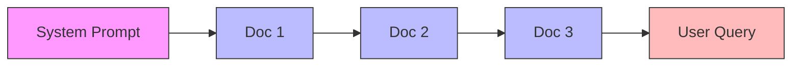
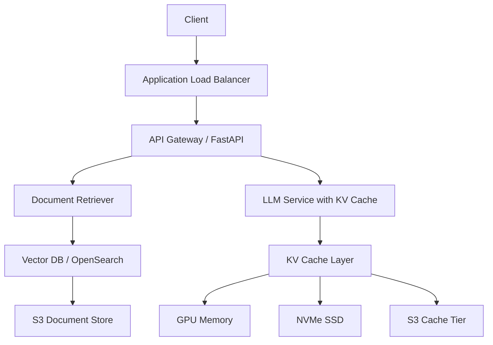

本記事は [https://arxiv.org/abs/2405.16444](https://arxiv.org/abs/2405.16444) の解説記事です。

## 論文概要（Abstract）

CacheBlendは、RAG（Retrieval-Augmented Generation）システムにおいて、事前計算済みのKVキャッシュを非プレフィックス位置でも再利用可能にする手法である。従来のprefix cachingでは、入力の先頭部分と一致するKVキャッシュのみが再利用対象であったが、CacheBlendは任意の位置に挿入された検索文書のKVキャッシュを選択的に再計算（selective recompute）することで融合する。著者らは、TTFT（Time-to-First-Token）を2.2〜3.3倍高速化し、推論スループットを2.8〜5倍向上させつつ、生成品質の劣化を1%以内に抑えたと報告している。本手法はACM EuroSys 2025でBest Paperを受賞した。

この記事は [Zenn記事: OpenAI Assistants APIのThread管理とResponses API移行実践ガイド](https://zenn.dev/0h_n0/articles/80554aca49f2ed) の深掘りです。

## 情報源

- **arXiv ID**: 2405.16444
- **URL**: [https://arxiv.org/abs/2405.16444](https://arxiv.org/abs/2405.16444)
- **著者**: Jiayi Yao, Hanchen Li, Yuhan Liu, Siddhant Ray, Yihua Cheng, Qizheng Zhang, Kuntai Du, Shan Lu, Junchen Jiang（University of Chicago, Microsoft Research）
- **発表年**: 2024年（arXiv投稿）、2025年（ACM EuroSys 2025 Best Paper）
- **分野**: cs.DC, cs.AI, cs.CL

## 背景と動機（Background & Motivation）

RAGシステムでは、LLMへの入力が「システムプロンプト + 検索文書1 + 検索文書2 + ... + ユーザクエリ」という構造を持つ。各検索文書は独立に事前計算してKVキャッシュとして保存できるが、問題はその再利用にある。

従来のprefix cachingは、入力の先頭から連続して一致するトークン列のKVキャッシュのみを再利用する。しかし、RAGでは検索結果の組み合わせがクエリごとに異なるため、先頭以外の位置に挿入された文書のKVキャッシュは再利用できない。これは、Transformerの自己注意機構において、あるトークンのKV値がそれ以前のすべてのトークンに依存する（cross-attention effect）ためである。

この制約により、prefix cachingのヒット率はRAGシナリオでは著しく低下する。著者らの実測では、RAGワークロードにおいてprefix cachingのヒット率は10〜30%程度にとどまると報告されている。CacheBlendはこの課題を、非プレフィックスKVキャッシュの選択的再計算によって解決する。



上図のように、RAGの入力ではDoc 1〜3が検索結果として挿入される。prefix cachingではSystem Promptのキャッシュのみ再利用可能だが、CacheBlendではDoc 1〜3のKVキャッシュも部分的に再利用する。

## 主要な貢献（Key Contributions）

- **選択的KV再計算（Selective KV Recompute）**: 事前計算済みKVキャッシュを非プレフィックス位置でも再利用し、cross-attentionの影響が大きいトークンのみを選択的に再計算する手法を提案。全トークンの10〜20%の再計算で生成品質を維持できることを実証した
- **パイプライン化による遅延隠蔽**: KVキャッシュのストレージからの読み出しと選択的再計算を2スレッドでパイプライン実行し、I/O遅延を計算時間で隠蔽するスケジューリング手法を設計した
- **柔軟なストレージ階層の活用**: KVキャッシュをGPUメモリだけでなく、CPUメモリやSSDに配置可能にし、推論遅延を増加させることなくキャッシュ容量を拡大する設計を実現した

## 技術的詳細（Technical Details）

### 選択的再計算アルゴリズム

CacheBlendの中核は、事前計算済みKVキャッシュを再利用しつつ、cross-attentionの影響で値が大きく変化するトークンのみを再計算する仕組みである。

通常のprefill処理では、Transformerの各層で全トークンのKV値を計算する。CacheBlendでは、事前計算済みのKV値を初期値として読み込み、各層で一部のトークンのみKV値を更新する。

### HKVD（High KV Deviation）トークン選定

再計算対象のトークンは、**KV偏差（KV Deviation）** に基づいて選定される。KV偏差は、事前計算されたKV値と、先行テキストを考慮して完全に再計算したKV値との差分として定義される。

トークン $j$ における層 $i$ でのKV偏差は次のように定義される:

$$
\Delta_{\text{KV}}^{(i)}[j] = \| \mathbf{KV}_{\text{cached}}^{(i)}[j] - \mathbf{KV}_{\text{full}}^{(i)}[j] \|_2
$$

ここで $\mathbf{KV}_{\text{cached}}^{(i)}[j]$ は事前計算済みのKV値、$\mathbf{KV}_{\text{full}}^{(i)}[j]$ は先行テキストを含めて完全に再計算したKV値である。

著者らの重要な発見は、ある層でKV偏差が大きいトークンは、次の層でもKV偏差が大きい傾向があるという**層間相関（cross-layer correlation）** である。この性質を利用し、CacheBlendは**段階的フィルタリング（Gradual Filtering）** を採用する。

### 段階的フィルタリングスキーム

全トークンのKV偏差を毎層計算するのはコストが高いため、CacheBlendは以下の段階的手法を用いる:

1. **層1**: 全トークンのうち $r_1$% のトークンを再計算し、KV偏差を測定
2. **層2**: 層1で選定されたHKVDトークンの中から、さらに $r_2$% を再計算対象として絞り込む
3. **層 $L$ まで繰り返す**: 各層で再計算対象を段階的に選定

著者らの実験では、各層で全トークンの10〜20%を再計算することで、生成品質の劣化をF1スコアで0.02以内、Rouge-Lで0.02以内に抑えられることが報告されている。

### 位置エンコーディングの更新

非プレフィックス位置でKVキャッシュを再利用する場合、位置エンコーディング（RoPE: Rotary Positional Embedding）の更新が必要となる。事前計算時のトークン位置と、実際の入力における位置が異なるためである。

CacheBlendでは、RoPEの回転行列を用いて位置エンコーディングを効率的に変換する:

$$
\mathbf{K}_{\text{new}}[j] = R(\Delta p_j) \cdot \mathbf{K}_{\text{cached}}[j]
$$

ここで $R(\Delta p_j)$ は位置差分 $\Delta p_j$ に対応する回転行列である。著者らは、この乗算は1回のみ実行されるため、オーバーヘッドは無視できる程度であると述べている。

### パイプライン化の設計

CacheBlendは、KVキャッシュの読み出しと選択的再計算を2つのスレッドでパイプライン実行する。

再計算の所要時間とキャッシュ読み出しの所要時間は以下で推定される:

$$
T_{\text{recompute}} = r\% \times T_{\text{prefill}}(L)
$$

$$
T_{\text{load}} = \frac{\text{PerTokenKVSize} \times L}{\text{StorageThroughput}}
$$

ここで $r$% は再計算比率、$L$ は層数、$T_{\text{prefill}}(L)$ は全層のprefill時間である。CacheBlendは $T_{\text{recompute}}$ と $T_{\text{load}}$ をオーバーラップさせることで、実効的な遅延を $\max(T_{\text{recompute}}, T_{\text{load}})$ に削減する。

### vLLMとの統合

CacheBlendはvLLMのcontinuous batching機構と統合されており、以下の3つのAPIを実装している:

- `fetch_kv(text, layer_id)`: ストレージからKVキャッシュを取得
- `prefill_layer(input_dict, KVCache)`: 選択されたトークンに対して部分的なprefillを実行
- `synchronize()`: KVキャッシュの読み出し完了を保証

ハッシュテーブル（100万チャンクで約16MB）をCPUメモリに保持し、KVキャッシュの格納位置を高速に検索する設計である。

## 実装のポイント（Implementation Notes）

### CUDAカーネルの改修

CacheBlendの選択的再計算は、標準的なTransformerのprefillカーネルを改修して実装されている。具体的には、各層のprefill処理において、再計算対象トークンのインデックスリストを受け取り、それらのトークンのKV値のみを更新するカスタムカーネルが実装されている。

### 閾値チューニングのガイドライン

再計算比率 $r$% のチューニングについて、著者らは以下のガイドラインを示している:

| 再計算比率 | TTFT削減 | 品質劣化（F1） | 推奨用途 |
|-----------|---------|--------------|---------|
| 5% | 最大 | 0.02〜0.05 | レイテンシ最優先の用途 |
| 10% | 大 | 0.01〜0.02 | 一般的なRAGシステム |
| 20% | 中 | < 0.01 | 品質重視の用途 |

著者らは、ストレージデバイスの速度に応じて再計算比率を適応的に調整することを推奨している。SSDの帯域幅が高い環境では再計算比率を下げ、逆にストレージが遅い環境では再計算比率を上げてI/O遅延を隠蔽する戦略が有効であると述べている。

### LMCacheとの統合

CacheBlendの実装は[LMCache](https://github.com/LMCache/LMCache)としてオープンソース化されている。LMCacheはvLLMと統合可能なKVキャッシュ管理ライブラリであり、以下の機能を提供する:

```python
# LMCacheの基本的な使用例（概念的なコード）
from lmcache import LMCacheConfig, LMCacheEngine

# キャッシュエンジンの設定
config = LMCacheConfig(
    chunk_size=512,           # チャンクサイズ（トークン数）
    storage_backend="ssd",    # ストレージバックエンド
    recompute_ratio=0.1,      # 再計算比率 10%
    pipeline_enabled=True,    # パイプライン化の有効化
)

# vLLMと統合したサービング
engine = LMCacheEngine(config)
```

上記はLMCacheの設計思想を示す概念的なコードであり、実際のAPIは[公式リポジトリ](https://github.com/LMCache/LMCache)を参照されたい。

## Production Deployment Guide

### AWS上でのKVキャッシュ付きRAGシステム構築

CacheBlendの知見を活用し、本番環境でKVキャッシュ対応のRAGシステムを構築する際のアーキテクチャと設定例を示す。

### システムアーキテクチャ



### Terraformによるインフラ定義

```hcl
# GPU推論インスタンスの定義
resource "aws_instance" "llm_inference" {
  ami           = "ami-0xxxxxxxx"  # Deep Learning AMI
  instance_type = "p4d.24xlarge"   # A100 x 8

  root_block_device {
    volume_size = 500
    volume_type = "gp3"
    throughput  = 1000  # MB/s
    iops        = 16000
  }

  # KVキャッシュ用NVMe SSDはインスタンスストア
  # p4d.24xlargeには8x 1TB NVMe SSDが付属

  tags = {
    Name        = "llm-inference-cacheblend"
    Environment = "production"
  }
}

# KVキャッシュのS3バックエンド
resource "aws_s3_bucket" "kv_cache_store" {
  bucket = "kv-cache-store-prod"

  tags = {
    Purpose = "KV Cache Storage for RAG"
  }
}

resource "aws_s3_bucket_lifecycle_configuration" "kv_cache_lifecycle" {
  bucket = aws_s3_bucket.kv_cache_store.id

  rule {
    id     = "expire-old-cache"
    status = "Enabled"

    expiration {
      days = 7  # 7日以上アクセスされないキャッシュを削除
    }

    filter {
      prefix = "kv-cache/"
    }
  }
}
```

### vLLM + LMCacheのデプロイ設定

```yaml
# docker-compose.yml
version: "3.8"
services:
  vllm-server:
    image: vllm/vllm-openai:latest
    runtime: nvidia
    environment:
      - NVIDIA_VISIBLE_DEVICES=all
      - VLLM_WORKER_MULTIPROC_METHOD=spawn
    volumes:
      - /mnt/nvme/kv-cache:/kv-cache    # NVMe SSDマウント
      - /mnt/models:/models               # モデル格納
    command: >
      --model /models/Meta-Llama-3-70B-Instruct
      --tensor-parallel-size 4
      --max-model-len 32768
      --enable-prefix-caching
      --kv-cache-dtype fp16
      --gpu-memory-utilization 0.90
    ports:
      - "8000:8000"
    deploy:
      resources:
        reservations:
          devices:
            - driver: nvidia
              count: 4
              capabilities: [gpu]
    healthcheck:
      test: ["CMD", "curl", "-f", "http://localhost:8000/health"]
      interval: 30s
      timeout: 10s
      retries: 3
```

### RAGパイプラインの実装例

```python
"""
RAGパイプラインにおけるKVキャッシュ再利用の実装例。

CacheBlendの知見を活用し、検索文書のKVキャッシュを
効率的に再利用するRAGシステムの構成を示す。
"""

import hashlib
from dataclasses import dataclass, field
from typing import Optional

import httpx


@dataclass
class CachedDocument:
    """KVキャッシュ付き検索文書を表すデータクラス。"""

    doc_id: str
    content: str
    cache_key: str = field(init=False)

    def __post_init__(self) -> None:
        """コンテンツのハッシュからキャッシュキーを生成する。"""
        self.cache_key = hashlib.sha256(
            self.content.encode()
        ).hexdigest()[:16]


class RAGPipelineWithCache:
    """KVキャッシュ再利用対応のRAGパイプライン。

    検索文書をチャンク単位でキャッシュし、
    同一文書が異なるクエリで再利用される場合に
    KVキャッシュのヒット率を向上させる。

    Attributes:
        vllm_url: vLLMサーバのエンドポイント
        chunk_size: KVキャッシュのチャンクサイズ（トークン数）
        cache_registry: キャッシュ済み文書のレジストリ
    """

    def __init__(
        self,
        vllm_url: str = "http://localhost:8000",
        chunk_size: int = 512,
    ) -> None:
        self.vllm_url = vllm_url
        self.chunk_size = chunk_size
        self.cache_registry: dict[str, CachedDocument] = {}

    def register_document(self, doc_id: str, content: str) -> str:
        """文書をキャッシュレジストリに登録する。

        Args:
            doc_id: 文書の一意識別子
            content: 文書のテキスト内容

        Returns:
            生成されたキャッシュキー
        """
        doc = CachedDocument(doc_id=doc_id, content=content)
        self.cache_registry[doc.cache_key] = doc
        return doc.cache_key

    def build_prompt(
        self,
        system_prompt: str,
        documents: list[str],
        query: str,
    ) -> str:
        """RAGプロンプトを構築する。

        CacheBlendの知見に基づき、文書の順序を固定して
        prefix cachingのヒット率を最大化する。

        Args:
            system_prompt: システムプロンプト
            documents: 検索された文書のリスト
            query: ユーザクエリ

        Returns:
            構築されたプロンプト文字列
        """
        # 文書をハッシュ順でソートし、順序を安定化
        sorted_docs = sorted(documents)
        doc_section = "\n\n---\n\n".join(
            f"[Document {i+1}]\n{doc}"
            for i, doc in enumerate(sorted_docs)
        )
        return (
            f"{system_prompt}\n\n"
            f"## Reference Documents\n\n{doc_section}\n\n"
            f"## Question\n\n{query}"
        )

    async def generate(
        self,
        system_prompt: str,
        documents: list[str],
        query: str,
        max_tokens: int = 1024,
        temperature: float = 0.1,
    ) -> Optional[str]:
        """KVキャッシュを活用してLLM生成を実行する。

        Args:
            system_prompt: システムプロンプト
            documents: 検索された文書リスト
            query: ユーザクエリ
            max_tokens: 最大生成トークン数
            temperature: サンプリング温度

        Returns:
            生成されたテキスト。エラー時はNone
        """
        prompt = self.build_prompt(system_prompt, documents, query)

        async with httpx.AsyncClient(timeout=60.0) as client:
            response = await client.post(
                f"{self.vllm_url}/v1/completions",
                json={
                    "model": "Meta-Llama-3-70B-Instruct",
                    "prompt": prompt,
                    "max_tokens": max_tokens,
                    "temperature": temperature,
                },
            )
            response.raise_for_status()
            result = response.json()
            return result["choices"][0]["text"]
```

### 監視設定（Prometheus + Grafana）

```yaml
# prometheus/kv_cache_metrics.yml
# KVキャッシュ関連のメトリクス監視設定
scrape_configs:
  - job_name: "vllm-kv-cache"
    metrics_path: "/metrics"
    static_configs:
      - targets: ["vllm-server:8000"]
    metric_relabel_configs:
      - source_labels: [__name__]
        regex: "vllm_cache_.*|vllm_gpu_.*|vllm_num_requests_.*"
        action: keep

# 監視すべき主要メトリクス:
# - vllm_cache_hit_rate: KVキャッシュヒット率
# - vllm_gpu_cache_usage_perc: GPUキャッシュ使用率
# - vllm_num_requests_running: 実行中リクエスト数
# - vllm_avg_prompt_throughput_toks_per_s: プロンプトスループット
# - vllm_e2e_request_latency_seconds: エンドツーエンドレイテンシ
```

```yaml
# grafana/dashboards/kv_cache_dashboard.json の概要
# 以下のパネルを含むダッシュボード:
#
# 1. KV Cache Hit Rate（時系列グラフ）
#    - クエリ: rate(vllm_cache_hit_rate[5m])
#    - 閾値アラート: 50%未満で警告、30%未満で障害
#
# 2. TTFT Distribution（ヒストグラム）
#    - クエリ: histogram_quantile(0.95, vllm_e2e_request_latency_seconds)
#    - P50/P95/P99を表示
#
# 3. GPU Memory Utilization
#    - クエリ: vllm_gpu_cache_usage_perc
#    - 閾値: 95%超で警告
#
# 4. Cache Eviction Rate
#    - クエリ: rate(vllm_cache_evictions_total[5m])
#    - evictionが頻発する場合はキャッシュサイズ拡張を検討
```

### OpenAI Responses APIとの対応関係

OpenAI Responses APIの`previous_response_id`やConversations APIが内部で実現しているキャッシュ再利用は、CacheBlendと類似の技術的課題を解決している。以下に対応関係を示す:

| CacheBlendの概念 | OpenAI APIでの対応 |
|-----------------|-------------------|
| KVキャッシュの再利用 | Prompt Caching（自動適用） |
| 非プレフィックスキャッシュ | `previous_response_id`による会話履歴キャッシュ |
| 選択的再計算 | 内部実装（非公開） |
| チャンク単位のキャッシュ | 1024トークン単位のキャッシュ粒度 |
| パイプライン化 | サーバサイドで透過的に実行 |

OpenAIのドキュメントによれば、Prompt Cachingにより入力コストが最大50%削減され、レイテンシが約80%改善されるとされている。CacheBlendの手法は、このようなプロダクション環境でのKVキャッシュ活用の学術的基盤を提供している。

## 実験結果（Experimental Results）

### 実験環境

著者らはNVIDIA A40 GPU（48GB VRAM）、128GB RAM、1TB NVMe SSD（4.8 GB/s帯域）の環境で評価を実施している。評価対象モデルはMistral-7B、Yi-34B、Llama-70B（8bit量子化）の3種類である。

### TTFT（Time-to-First-Token）の高速化

| モデル | ベースライン（Full Recompute） | CacheBlend | 高速化率 |
|-------|--------------------------|------------|---------|
| Mistral-7B | 1.0x | 2.2x | 2.2倍 |
| Yi-34B | 1.0x | 2.8x | 2.8倍 |
| Llama-70B | 1.0x | 3.3x | 3.3倍 |

モデルサイズが大きくなるほど高速化率が向上している。これは、大規模モデルではprefillの計算コストが支配的になるため、選択的再計算による削減効果が相対的に大きくなることによる。

### 生成品質の評価

著者らは2WikiMQA（200テストケース）、MuSiQue（150テストケース）、SAMSum（200テストケース）、MultiNews（60テストケース）で評価を行っている。

| 手法 | F1スコア差分 | Rouge-L差分 |
|------|------------|------------|
| Full KV Reuse（再計算なし） | -0.15〜-0.35 | -0.10〜-0.25 |
| CacheBlend（10%再計算） | -0.01〜-0.02 | -0.01〜-0.02 |
| Full Recompute（ベースライン） | 0 | 0 |

Full KV Reuse（再計算を一切行わない方式）ではF1スコアが0.15〜0.35低下するのに対し、CacheBlendは10%の再計算で品質劣化を0.02以内に抑えている。

### スループットの比較

推論スループット（トークン/秒）について、著者らはCacheBlendがFull Recomputeに対して2.8〜5倍、prefix cachingに対して3.3倍の改善を達成したと報告している。これは、選択的再計算によりGPU計算量が削減されることに加え、パイプライン化によりストレージI/Oの遅延が隠蔽される効果による。

## 実運用への応用（Practical Implications）

### OpenAI Responses APIのキャッシュ利用率向上との関連

Zenn記事「OpenAI Assistants APIのThread管理とResponses API移行実践ガイド」で解説されているResponses APIの`previous_response_id`パラメータは、会話履歴のKVキャッシュを効率的に再利用する仕組みである。CacheBlendの研究は、このような機能の技術的背景を理解する上で重要な知見を提供する。

具体的には、以下の点でCacheBlendの知見が実務に活用できる:

1. **キャッシュヒット率の最大化**: 文書の順序を固定し、共通プレフィックスを長くすることで、prefix cachingのヒット率を向上させる。Responses APIでは`previous_response_id`の活用がこれに相当する
2. **チャンクサイズの最適化**: CacheBlendの実験では512トークンのチャンクサイズが有効であることが示されており、RAGシステムの文書分割粒度の参考になる
3. **コストと品質のトレードオフ**: 再計算比率を調整することでレイテンシと品質のバランスを取る考え方は、APIのキャッシュ利用率40〜80%向上の背景にある設計思想と共通する

### セルフホスティング環境での適用

OpenAI APIに依存せず、vLLM + LMCacheを用いて自社環境でCacheBlendを適用する場合、以下の点に留意する:

- KVキャッシュのストレージ帯域がボトルネックになりうるため、NVMe SSD（4GB/s以上）の利用が推奨される
- チャンクサイズ（128〜512トークン）はワークロードに応じて調整する
- 再計算比率は品質要件に応じて5〜20%の範囲で設定する

## 関連研究（Related Work）

- **Pensieve** (Liu et al., 2024): 分散KVキャッシュ管理を行うが、非プレフィックスキャッシュの再利用は対象外
- **ChunkAttention** (Ye et al., 2024): チャンク単位のAttention計算を効率化するが、KVキャッシュの部分的再計算は行わない
- **vLLM** (Kwon et al., 2023): PagedAttentionによる効率的なKVキャッシュ管理を実現するが、prefix cachingに限定される
- **SGLang** (Zheng et al., 2024): RadixAttentionによるプレフィックス共有を実現するが、非プレフィックスの再利用は未対応
- **CacheClip** (2025): CacheBlendの後続研究として、KV偏差の推定精度を改善する手法を提案

CacheBlendは、これらの既存手法がカバーしていなかった「非プレフィックス位置でのKVキャッシュ再利用」という課題に対する解法を提供している。

## まとめと今後の展望

CacheBlendは、RAGシステムにおけるKVキャッシュの再利用率を大幅に向上させる手法である。選択的再計算により、全トークンの10〜20%のみを再計算することで、TTFTを2.2〜3.3倍高速化しつつ、生成品質の劣化を1%以内に抑えることが実証された。ACM EuroSys 2025でBest Paperを受賞したことからも、その学術的・実用的価値が認められている。

ただし、著者ら自身が認めているように、現時点ではTransformerアーキテクチャに限定されており、MambaやGriffinといった非Transformer構造への適用は今後の課題である。また、分散環境でのノード間KVキャッシュ共有や、より多様なモデル・データセットでの検証も残されている。

OpenAI Responses APIのPrompt Cachingやprefix cachingの技術的背景を理解し、自社RAGシステムのキャッシュ戦略を設計する上で、CacheBlendの知見は実務的にも有用である。

---

**注記**: 本記事はarXiv論文 [2405.16444](https://arxiv.org/abs/2405.16444) および関連公開情報の解説であり、筆者自身による実験・検証は行っていません。数値データおよび実験結果は著者らの報告に基づいています。

## 参考文献

1. Yao, J., Li, H., Liu, Y., et al. "CacheBlend: Fast Large Language Model Serving for RAG with Cached Knowledge Fusion." arXiv:2405.16444, 2024. [https://arxiv.org/abs/2405.16444](https://arxiv.org/abs/2405.16444)
2. LMCache Project. [https://github.com/LMCache/LMCache](https://github.com/LMCache/LMCache)
3. LMCache Blog. "CacheBlend (Best Paper @ ACM EuroSys'25)." [https://blog.lmcache.ai/en/2025/03/31/cacheblend-best-paper-acm-eurosys25-enabling-100-kv-cache-hit-rate-in-rag/](https://blog.lmcache.ai/en/2025/03/31/cacheblend-best-paper-acm-eurosys25-enabling-100-kv-cache-hit-rate-in-rag/)
4. Kwon, W., et al. "Efficient Memory Management for Large Language Model Serving with PagedAttention." SOSP 2023.
5. OpenAI. "Prompt Caching." [https://platform.openai.com/docs/guides/prompt-caching](https://platform.openai.com/docs/guides/prompt-caching)
