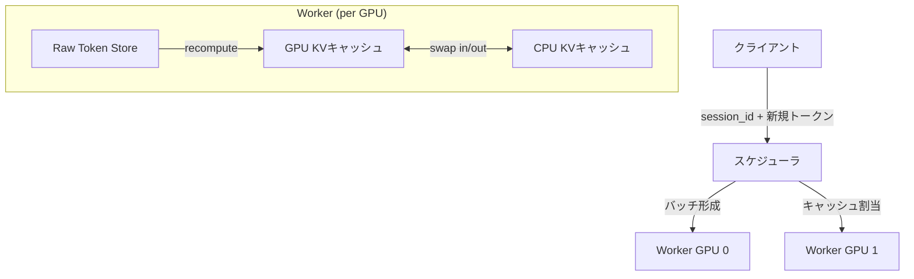

本記事は [https://arxiv.org/abs/2312.05516](https://arxiv.org/abs/2312.05516) の解説記事です。本記事の著者自身が実験を行ったものではなく、論文の内容を解説・引用したものです。

## 論文概要（Abstract）

Pensieveは、マルチターン会話におけるLLMサービングの効率を大幅に改善するシステムである。従来のステートレスなLLMサービングでは、会話のターンごとに過去の会話履歴を繰り返し再処理する必要があった。Pensieveはサーバーサイドで会話状態（KVキャッシュ）を永続化し、GPU-CPUの2層キャッシュ構造により効率的な状態管理を実現する。著者らはvLLMやTensorRT-LLMと比較して1.14-3.0倍のスループット向上を達成したと報告している。

この記事は [Zenn記事: OpenAI Assistants APIのThread管理とResponses API移行実践ガイド](https://zenn.dev/0h_n0/articles/80554aca49f2ed) の深掘りです。

## 情報源

- **arXiv ID**: 2312.05516
- **URL**: [https://arxiv.org/abs/2312.05516](https://arxiv.org/abs/2312.05516)
- **著者**: Lingfan Yu, Jinkun Lin, Jinyang Li
- **発表年**: 2023（arXiv初版）、EuroSys 2025で採択
- **分野**: cs.LG, cs.DC

## 背景と動機（Background & Motivation）

LLMを用いたチャットアプリケーションでは、ユーザーとの対話が複数ターンにわたることが一般的である。ShareGPTデータセットの統計によれば、会話の平均ターン数は5.56回に達する。

従来のLLMサービングシステム（vLLM、TensorRT-LLMなど）はリクエスト間でステートレスに動作する。つまり、ユーザーが3回目の発話を送信する際、過去2回分の会話履歴を含むプロンプト全体を毎回prefillフェーズで再計算する必要がある。この冗長な計算はターンが増えるほど深刻になり、Time-To-First-Token（TTFT）の増大とGPU計算資源の浪費を引き起こす。

例えば、Llama 2-13Bモデルでは1トークンあたりのKVキャッシュサイズが約0.78MBに達する。16,384トークンの会話コンテキストを毎回再計算することは、GPUの計算能力とメモリ帯域の両面で大きな無駄となる。Pensieveはこの問題を、サーバーサイドでの会話状態の永続化により解決する。

## 主要な貢献（Key Contributions）

- **ステートフルLLMサービングアーキテクチャ**: セッション単位でKVキャッシュをサーバーサイドに永続化し、会話履歴の冗長な再計算を排除する設計を提案
- **GPU-CPU 2層キャッシュと適応的退避ポリシー**: GPU VRAMとCPU DRAMを階層的に活用し、causal attentionのコスト構造を考慮した退避ポリシーにより、限られたメモリで効率的にKVキャッシュを管理
- **汎化PagedAttentionカーネル**: 複数入力トークンと非連続GPU メモリ上のKVキャッシュに対応したattentionカーネルを実装し、prefillフェーズとgenerationフェーズの統一的なスケジューリングを実現

## 技術的詳細（Technical Details）

### システムアーキテクチャ

Pensieveは単一のスケジューラと複数のワーカー（GPU単位）から構成される。スケジューラはバッチ形成とキャッシュ割り当てを管理し、各ワーカーがGPU上でのカーネル実行とデータ移動を担当する。



各会話セッションには一意のセッションIDが割り当てられ、スケジューラはこのIDを用いてKVキャッシュの位置を追跡する。新たなリクエストが到着すると、スケジューラは以下の手順で処理する。

1. セッションIDに対応するKVキャッシュの存在を確認
2. キャッシュがGPU上にあれば、新規トークンのみprefillを実行
3. キャッシュがCPU上にあれば、GPU側へswap-inしてからprefillを実行
4. キャッシュが退避済みの場合は、保存されたraw tokenから再計算

### KVキャッシュのメモリ管理

KVキャッシュのサイズは以下の式で計算される。

$$
M_{kv} = L \times H \times 2 \times b
$$

ここで、
- $L$: Transformerのレイヤー数
- $H$: 隠れ層の次元数
- $2$: KeyとValueの2種類
- $b$: 1要素あたりのバイト数（FP16で2バイト）

例えばLlama 2-13B（$L=40$, $H=5120$, $b=2$）の場合、1トークンあたりのKVキャッシュは以下となる。

$$
M_{kv} = 40 \times 5120 \times 2 \times 2 = 819,200 \text{ bytes} \approx 0.78 \text{ MB/token}
$$

Grouped-Query Attention（GQA、グループサイズ4）を使用するモデルではヘッド数が$1/4$に削減されるため、メモリ要件も$1/4$となる。

### GPU-CPU 2層キャッシュ構造

Pensieveは、PagedAttentionのブロック管理をGPU-CPU間に拡張した2層キャッシュを構築する。

- **GPU層（ホットキャッシュ）**: アクティブな会話のKVキャッシュを格納。A100 80GBの場合、モデルパラメータを除いた約40GBをKVキャッシュに割り当て
- **CPU層（ウォームキャッシュ）**: GPUから退避されたKVキャッシュを格納。論文の実験環境では220GB/GPUのCPUメモリを使用

GPUキャッシュの10%はgenerationフェーズのための予約領域として確保される。これはバッチ実行中に新規トークンのKVキャッシュを書き込むための領域であり、不足するとリクエストが中断（サスペンド）される。

### 退避ポリシー

Pensieveの退避ポリシーは、単純なLRU（Least Recently Used）ではなく、causal attentionの計算コスト構造を考慮したコスト認識型ポリシーを採用する。チャンク（32トークン単位）ごとに以下の保持価値（Retention Value）を計算する。

$$
V = \frac{\text{Cost}(s, l)}{T}
$$

ここで、
- $\text{Cost}(s, l)$: 位置$s$から長さ$l$のチャンクを再計算するコスト
- $T$: 当該会話が最後にアクティブだった時刻からの経過時間

退避の優先順位には2つの重要な特性がある。

1. **会話レベル**: 最も長期間アクティブでない会話のチャンクを優先的に退避する
2. **チャンクレベル**: 会話履歴の先頭側（earlier end）から退避する。causal attentionでは後続トークンのattention計算に先行トークンのKVキャッシュが必要であるため、先頭側のチャンクは再計算コストが相対的に低い

### パイプライン化されたswap-in

CPUからGPUへのKVキャッシュ転送（swap-in）は、レイヤー単位でパイプライン化される。Transformerの各レイヤーのKVキャッシュは当該レイヤーのself-attentionでのみ使用されるため、レイヤー$i$の転送完了を待ってレイヤー$i$の計算を開始しつつ、レイヤー$i+1$の転送を並行して実行できる。

```python
# パイプラインswap-inの擬似コード
def pipelined_inference(
    model_layers: list["TransformerLayer"],
    cpu_kv_cache: dict[int, "KVCache"],
    input_tokens: "Tensor",
) -> "Tensor":
    """レイヤー単位のパイプラインswap-inによる推論

    Args:
        model_layers: Transformerの各レイヤー
        cpu_kv_cache: CPU上のKVキャッシュ（レイヤーID -> キャッシュ）
        input_tokens: 入力トークンテンソル

    Returns:
        モデル出力テンソル
    """
    hidden = input_tokens
    # レイヤー0のswap-inを先行開始
    swap_event = async_swap_in(cpu_kv_cache[0])

    for i, layer in enumerate(model_layers):
        # 当該レイヤーのswap-in完了を待機
        swap_event.synchronize()

        # 次レイヤーのswap-inを非同期で開始
        if i + 1 < len(model_layers):
            swap_event = async_swap_in(cpu_kv_cache[i + 1])

        # 当該レイヤーの計算実行（GPU KVキャッシュ使用）
        hidden = layer(hidden, gpu_kv_cache=gpu_kv_cache[i])

    return hidden
```

このパイプライン手法により、PCIe転送レイテンシの大部分を計算と重畳（overlap）できる。ただし著者らは、swap-inとswap-outを同時に実行するとPCIeの双方向帯域幅が18-20%低下することを報告しており、swap-inを優先するスケジューリングを採用している。

### 汎化PagedAttentionカーネル

vLLMのPagedAttentionカーネルはgenerationフェーズ（1トークンずつ生成）に特化しており、行列-ベクトル積で実装されている。しかしPensieveでは、部分的にキャッシュが存在する場合に複数の新規トークンをprefillする必要があるため、行列-行列積をサポートする汎化カーネルが必要となる。

著者らはNVIDIA Cutlassを基盤に、以下の特徴を持つ汎化PagedAttentionカーネルを実装している。

- 可変長クエリテンソル（ragged-sized query tensors）のサポート
- 非連続GPU メモリ上のKVキャッシュへのアクセス
- causal maskingのfused実装（中間スコアのmaterializationを回避）
- prefillとgenerationの統一バッチ処理

実装規模は約7,000行のC++/CUDAコードと報告されている。

## 実装のポイント（Implementation）

Pensieveを実際に運用する際の重要な考慮点を以下に示す。

**Sticky Session設計**: Pensieveの効果を最大化するには、同一セッションIDのリクエストを同一サーバーにルーティングするsticky session（セッション固定）が必要となる。ロードバランサーはセッションIDに基づくルーティングを実装する必要がある。

**Cold Start対策**: 新規セッションの初回リクエストやキャッシュが完全に退避された場合は、通常のステートレスサービングと同等のprefillコストが発生する。著者らはraw tokenをpersistent storeに保存し、退避されたKVキャッシュの再計算を可能にしている。

**メモリ容量の制約**: A100 80GBの場合でもKVキャッシュに割り当て可能な領域は約40GBであり、Llama 2-13Bで約50,000トークン分のKVキャッシュしか保持できない。長い会話コンテキスト（16Kトークン）の場合、同時に数十会話程度がGPU上で管理可能な上限となる。

**generationフェーズの予約**: GPU KVキャッシュの10%をgenerationフェーズ用に予約する設計は保守的だが、不足するとリクエストが中断されるため、ワークロードの特性に応じた調整が必要である。

## Production Deployment Guide

Pensieveの設計思想をプロダクション環境に適用する場合のAWS実装パターンを示す。ステートフルLLMサービングではKVキャッシュの永続化とsticky sessionが鍵となる。

### AWS実装パターン（コスト最適化重視）

**トラフィック量別の推奨構成**:

| 構成 | トラフィック | アーキテクチャ | 月額概算 |
|------|-------------|---------------|---------|
| Small | ~100 req/日 | SageMaker Serverless + S3 | $200-500 |
| Medium | ~1,000 req/日 | ECS Fargate + ElastiCache | $1,500-3,000 |
| Large | 10,000+ req/日 | EKS + EC2 p4d/p5 + Spot | $8,000-20,000 |

**注意**: 上記コストは2026年3月時点のAWS東京リージョン（ap-northeast-1）の概算値であり、実際のコストはトラフィックパターン、GPUインスタンスの可用性、リージョンにより変動する。最新料金はAWS料金計算ツールで確認を推奨する。

**Small構成（~100 req/日）**:
- SageMaker Inference Endpointで単一GPUインスタンス（ml.g5.xlarge）を使用
- セッション管理にDynamoDB（On-Demand）、KVキャッシュのオフロード先としてS3を使用
- 低トラフィック時のコスト効率を重視

**Medium構成（~1,000 req/日）**:
- ECS Fargate上にvLLMベースのサービングコンテナを配置
- ElastiCache（Redis）でセッションIDとKVキャッシュメタデータを管理
- ALBのsticky sessionでセッション固定を実現
- GPU: g5.2xlarge x 2台

**Large構成（10,000+ req/日）**:
- EKS上にKarpenterで自動スケーリング
- p4d.24xlarge（A100 x 8）またはp5.48xlarge（H100 x 8）のSpot Instances活用
- Redis Cluster（ElastiCache）でセッション管理
- NVMe SSD（ローカルストレージ）をCPU KVキャッシュとして活用

**コスト削減テクニック**:
- Spot Instancesの活用でGPUインスタンスコストを最大90%削減
- Reserved InstancesまたはSavings Plans（1年コミット）で最大72%削減
- KVキャッシュの永続化により冗長なprefill計算を削減し、GPU使用効率を向上

### Terraformインフラコード

**Small構成（SageMaker + DynamoDB）**:

```hcl
# Pensieve-style Stateful LLM Serving - Small構成
# 2026年3月時点のTerraform AWS Provider ~> 5.x

resource "aws_dynamodb_table" "session_store" {
  name         = "llm-session-store"
  billing_mode = "PAY_PER_REQUEST"
  hash_key     = "session_id"

  attribute {
    name = "session_id"
    type = "S"
  }

  ttl {
    attribute_name = "expires_at"
    enabled        = true
  }

  server_side_encryption {
    enabled = true  # KMS暗号化
  }

  tags = {
    Project     = "stateful-llm-serving"
    Environment = "production"
    CostCenter  = "ml-inference"
  }
}

resource "aws_iam_role" "sagemaker_execution" {
  name = "sagemaker-llm-serving-role"

  assume_role_policy = jsonencode({
    Version = "2012-10-17"
    Statement = [{
      Action = "sts:AssumeRole"
      Effect = "Allow"
      Principal = {
        Service = "sagemaker.amazonaws.com"
      }
    }]
  })
}

resource "aws_iam_role_policy" "sagemaker_minimal" {
  name = "sagemaker-minimal-access"
  role = aws_iam_role.sagemaker_execution.id

  policy = jsonencode({
    Version = "2012-10-17"
    Statement = [
      {
        Effect = "Allow"
        Action = [
          "dynamodb:GetItem",
          "dynamodb:PutItem",
          "dynamodb:UpdateItem",
          "dynamodb:DeleteItem"
        ]
        Resource = aws_dynamodb_table.session_store.arn
      },
      {
        Effect = "Allow"
        Action = [
          "s3:GetObject",
          "s3:PutObject"
        ]
        Resource = "${aws_s3_bucket.kv_cache_store.arn}/*"
      },
      {
        Effect = "Allow"
        Action = [
          "logs:CreateLogGroup",
          "logs:CreateLogStream",
          "logs:PutLogEvents"
        ]
        Resource = "arn:aws:logs:*:*:*"
      }
    ]
  })
}

resource "aws_s3_bucket" "kv_cache_store" {
  bucket = "llm-kv-cache-offload-${data.aws_caller_identity.current.account_id}"

  tags = {
    Project = "stateful-llm-serving"
  }
}

resource "aws_s3_bucket_server_side_encryption_configuration" "kv_cache" {
  bucket = aws_s3_bucket.kv_cache_store.id

  rule {
    apply_server_side_encryption_by_default {
      sse_algorithm = "aws:kms"
    }
  }
}

resource "aws_s3_bucket_lifecycle_configuration" "kv_cache_ttl" {
  bucket = aws_s3_bucket.kv_cache_store.id

  rule {
    id     = "expire-old-cache"
    status = "Enabled"
    expiration {
      days = 7  # 7日以上前のKVキャッシュを自動削除
    }
  }
}

data "aws_caller_identity" "current" {}
```

**Large構成（EKS + Karpenter）**:

```hcl
# Large構成 - EKS + Karpenter (Spot優先)
module "eks" {
  source  = "terraform-aws-modules/eks/aws"
  version = "~> 20.0"

  cluster_name    = "stateful-llm-cluster"
  cluster_version = "1.31"

  vpc_id     = module.vpc.vpc_id
  subnet_ids = module.vpc.private_subnets

  # Karpenter用のIRSA設定
  enable_cluster_creator_admin_permissions = true

  cluster_endpoint_public_access = false  # セキュリティ: プライベートのみ
}

# Karpenter NodePool - GPU Spot優先
resource "kubectl_manifest" "karpenter_nodepool" {
  yaml_body = yamlencode({
    apiVersion = "karpenter.sh/v1"
    kind       = "NodePool"
    metadata = {
      name = "gpu-spot-pool"
    }
    spec = {
      template = {
        spec = {
          requirements = [
            {
              key      = "karpenter.sh/capacity-type"
              operator = "In"
              values   = ["spot", "on-demand"]  # Spot優先
            },
            {
              key      = "node.kubernetes.io/instance-type"
              operator = "In"
              values   = ["p4d.24xlarge", "p4de.24xlarge", "p5.48xlarge"]
            }
          ]
          nodeClassRef = {
            group = "karpenter.k8s.aws"
            kind  = "EC2NodeClass"
            name  = "gpu-nodes"
          }
        }
      }
      limits = {
        cpu    = "384"
        memory = "3Ti"
      }
      disruption = {
        consolidationPolicy = "WhenEmptyOrUnderutilized"
        consolidateAfter    = "30s"
      }
    }
  })
}

# AWS Budgets - 月次コストアラート
resource "aws_budgets_budget" "llm_serving" {
  name         = "stateful-llm-monthly"
  budget_type  = "COST"
  limit_amount = "25000"
  limit_unit   = "USD"
  time_unit    = "MONTHLY"

  notification {
    comparison_operator       = "GREATER_THAN"
    threshold                 = 80
    threshold_type            = "PERCENTAGE"
    notification_type         = "ACTUAL"
    subscriber_email_addresses = ["ml-ops@example.com"]
  }
}

# Secrets Manager - モデル設定
resource "aws_secretsmanager_secret" "llm_config" {
  name       = "stateful-llm/model-config"
  kms_key_id = aws_kms_key.llm_encryption.id
}

resource "aws_kms_key" "llm_encryption" {
  description             = "KMS key for LLM serving secrets"
  deletion_window_in_days = 7
  enable_key_rotation     = true
}
```

### 運用・監視設定

**CloudWatch Logs Insights クエリ**（KVキャッシュヒット率の監視）:

```
# KVキャッシュヒット率の時系列分析
fields @timestamp, session_id, cache_hit, cache_location
| filter event_type = "inference_request"
| stats
    count(*) as total,
    sum(case when cache_hit = 1 then 1 else 0 end) as hits,
    sum(case when cache_hit = 1 then 1 else 0 end) * 100.0 / count(*) as hit_rate
  by bin(1h)
| sort @timestamp desc
```

**CloudWatch アラーム設定（Python）**:

```python
import boto3

def create_kv_cache_alarms(
    cloudwatch: boto3.client,
    sns_topic_arn: str,
) -> None:
    """KVキャッシュ関連のCloudWatchアラームを作成

    Args:
        cloudwatch: CloudWatch クライアント
        sns_topic_arn: 通知先SNSトピックARN
    """
    # GPU メモリ使用率アラーム（90%超過で警告）
    cloudwatch.put_metric_alarm(
        AlarmName="llm-gpu-memory-high",
        MetricName="GPUMemoryUtilization",
        Namespace="Custom/LLMServing",
        Statistic="Average",
        Period=300,
        EvaluationPeriods=2,
        Threshold=90.0,
        ComparisonOperator="GreaterThanThreshold",
        AlarmActions=[sns_topic_arn],
    )

    # KVキャッシュヒット率低下アラーム（50%未満で警告）
    cloudwatch.put_metric_alarm(
        AlarmName="llm-kv-cache-hit-rate-low",
        MetricName="KVCacheHitRate",
        Namespace="Custom/LLMServing",
        Statistic="Average",
        Period=300,
        EvaluationPeriods=3,
        Threshold=50.0,
        ComparisonOperator="LessThanThreshold",
        AlarmActions=[sns_topic_arn],
    )
```

**X-Ray トレーシング設定（Python）**:

```python
from aws_xray_sdk.core import xray_recorder, patch_all

# boto3の自動計装
patch_all()

@xray_recorder.capture("llm_inference")
def handle_inference_request(
    session_id: str,
    new_tokens: list[int],
) -> dict:
    """推論リクエストの処理（X-Rayトレース付き）

    Args:
        session_id: 会話セッションID
        new_tokens: 新規入力トークンのリスト

    Returns:
        推論結果の辞書
    """
    subsegment = xray_recorder.current_subsegment()
    subsegment.put_annotation("session_id", session_id)
    subsegment.put_metadata("input_length", len(new_tokens))

    # KVキャッシュルックアップ
    cache_result = lookup_kv_cache(session_id)
    subsegment.put_annotation("cache_hit", cache_result.hit)
    subsegment.put_annotation("cache_location", cache_result.location)

    return run_inference(session_id, new_tokens, cache_result)
```

**Cost Explorer自動レポート（Python）**:

```python
import boto3
from datetime import datetime, timedelta

def daily_cost_report(sns_topic_arn: str) -> None:
    """日次コストレポートを生成しSNS通知

    Args:
        sns_topic_arn: 通知先SNSトピックARN
    """
    ce = boto3.client("ce")
    sns = boto3.client("sns")

    end = datetime.utcnow().strftime("%Y-%m-%d")
    start = (datetime.utcnow() - timedelta(days=1)).strftime("%Y-%m-%d")

    response = ce.get_cost_and_usage(
        TimePeriod={"Start": start, "End": end},
        Granularity="DAILY",
        Metrics=["UnblendedCost"],
        Filter={
            "Tags": {
                "Key": "Project",
                "Values": ["stateful-llm-serving"],
            }
        },
        GroupBy=[{"Type": "DIMENSION", "Key": "SERVICE"}],
    )

    total = sum(
        float(g["Metrics"]["UnblendedCost"]["Amount"])
        for r in response["ResultsByTime"]
        for g in r["Groups"]
    )

    if total > 100.0:
        sns.publish(
            TopicArn=sns_topic_arn,
            Subject="[ALERT] LLM Serving daily cost exceeded $100",
            Message=f"Daily cost: ${total:.2f}\nDate: {start}",
        )
```

### コスト最適化チェックリスト

**アーキテクチャ選択**:
- [ ] トラフィック量に応じた構成選択（Small/Medium/Large）
- [ ] KVキャッシュ永続化による冗長prefill削減効果の試算
- [ ] Sticky session対応ロードバランサーの選定

**リソース最適化**:
- [ ] GPU Spot Instances優先（p4d/p5で最大90%削減）
- [ ] Reserved Instances/Savings Plans（1年コミットで最大72%削減）
- [ ] Karpenterによる自動スケーリング（GPU利用率ベース）
- [ ] Lambda/SageMakerのメモリサイズ最適化
- [ ] アイドル時のスケールダウン設定

**LLMコスト削減**:
- [ ] KVキャッシュ永続化でprefill計算コストを削減
- [ ] Prompt Caching有効化（30-90%削減）
- [ ] モデル選択ロジック（タスク難易度に応じた小型モデル活用）
- [ ] 最大トークン数制限の設定
- [ ] バッチ処理可能なリクエストの集約

**監視・アラート**:
- [ ] AWS Budgets設定（月次予算アラート）
- [ ] CloudWatchアラーム（GPU利用率、KVキャッシュヒット率）
- [ ] Cost Anomaly Detection有効化
- [ ] 日次コストレポート自動生成
- [ ] X-Rayトレーシング（推論レイテンシ分析）

**リソース管理**:
- [ ] 未使用GPUインスタンスの自動停止
- [ ] タグ戦略（Project/Environment/CostCenter）
- [ ] S3 KVキャッシュのライフサイクルポリシー（7日で自動削除）
- [ ] 開発環境の夜間・週末停止
- [ ] CloudTrail/Config有効化（監査ログ）

## 実験結果（Results）

著者らはShareGPTおよびUltraChatデータセットを用いて、Azure NC A100 v4シリーズ（A100 80GB GPU、220GB CPU RAM/GPU）上で評価を実施している。

**スループット比較（論文Figure 7, 8より）**:

| モデル | GPU数 | vs vLLM | vs TensorRT-LLM |
|--------|-------|---------|-----------------|
| OPT-13B | 1 | 1.36x | 1.14x |
| Llama 2-13B | 1 | 1.70x | 1.58x |
| OPT-66B | 4 | 2.04x | 1.64x |
| Llama 2-70B | 4 | 3.0x | 2.47x |

マルチGPU構成（4 GPU）でより大きなスループット向上が得られている点が注目に値する。著者らはこれについて、大規模モデルではprefillフェーズの計算コストが相対的に大きく、KVキャッシュの再利用による計算削減効果がより顕著になるためと説明している。

**退避ポリシーの効果（論文Table 2より）**:
著者らのコスト認識型退避ポリシーは、単純なLRUと比較して再計算トークン数を最大14.6%削減し、CPUキャッシュヒット率で最大4.4ポイントの改善を達成したと報告している。

**ユーザーシンク時間への感度**: 平均シンク時間（ユーザーの応答間隔）が60秒から600秒に増加しても、Pensieveはステートレスベースラインを上回る性能を維持することが示されている。ただし、シンク時間が長くなるほどキャッシュ退避の頻度が上がり、改善幅は縮小する。

## 実運用への応用（Practical Applications）

PensieveのステートフルLLMサービング設計は、OpenAIのAPI設計と密接に関連する。

**OpenAI Responses APIとの対応**: OpenAIのResponses APIにおける`previous_response_id`パラメータは、まさにPensieveのセッションID概念に相当する。サーバーサイドで会話コンテキストを保持し、クライアントは前回のレスポンスIDを指定するだけで会話を継続できる。これにより、クライアント側で会話履歴全体を毎回送信する必要がなくなる。

**Assistants API Thread管理との関係**: OpenAI Assistants APIのThread/Run構造も、Pensieveのセッション管理アーキテクチャと同様の設計思想を持つ。ThreadがセッションIDに、Run内部でのKVキャッシュ管理がPensieveのGPU-CPU階層キャッシュに対応すると解釈できる。

**プロダクションでの適用場面**:
- カスタマーサポートチャットボット（長時間セッション、高頻度ターン）
- コード補完エージェント（プロジェクトコンテキストの永続化）
- マルチエージェントシステム（エージェント間の共有コンテキスト管理）

## 関連研究（Related Work）

- **PagedAttention / vLLM**（Kwon et al., 2023）: KVキャッシュのメモリ管理を最適化したLLMサービングエンジン。Pensieveはvlmのメモリ管理を拡張し、セッション間でのKVキャッシュ永続化を追加
- **Orca**（Yu et al., 2022）: iteration-levelスケジューリングによるLLMサービング最適化。Pensieveはこのスケジューリング手法を前提としつつ、ステートフル機能を追加
- **SGLang**（Zheng et al., 2024）: RadixAttentionによるprefix共有でKVキャッシュの再利用を実現。Pensieveが会話単位のキャッシュ管理に焦点を当てるのに対し、SGLangはプロンプト間の共通prefix活用に注力
- **HCache**（Gao et al., EuroSys 2025）: Pensieveと同じくEuroSys 2025で発表。HCache はホスト側メモリへの高速な状態退避・復元に焦点を当てている

## まとめと今後の展望

Pensieveは、マルチターン会話におけるLLMサービングの効率を大幅に改善するステートフルサービングシステムである。GPU-CPU 2層キャッシュ、コスト認識型退避ポリシー、汎化PagedAttentionカーネルの3つの技術的貢献により、vLLMと比較して最大3.0倍のスループット向上を実現したと著者らは報告している。

今後の研究方向としては、分散環境でのKVキャッシュ共有（複数サーバー間でのセッションマイグレーション）、より大きなコンテキスト長（100K+トークン）への対応、そしてMixture-of-Experts（MoE）モデルとの統合が考えられる。OpenAI Responses APIやAssistants APIのようなステートフルAPIの普及に伴い、Pensieveが提示したサーバーサイド状態管理の設計思想はLLMサービングの標準的なアプローチとなる可能性がある。

## 参考文献

- **arXiv**: [https://arxiv.org/abs/2312.05516](https://arxiv.org/abs/2312.05516)
- **ACM DL**: [https://dl.acm.org/doi/10.1145/3689031.3696086](https://dl.acm.org/doi/10.1145/3689031.3696086)
- **Related Zenn article**: [https://zenn.dev/0h_n0/articles/80554aca49f2ed](https://zenn.dev/0h_n0/articles/80554aca49f2ed)
- **vLLM (PagedAttention)**: [https://arxiv.org/abs/2309.06180](https://arxiv.org/abs/2309.06180)
- **SGLang (RadixAttention)**: [https://arxiv.org/abs/2312.07104](https://arxiv.org/abs/2312.07104)
