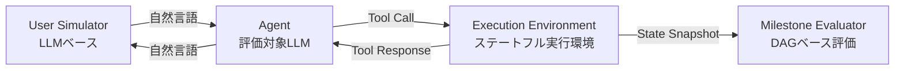

## 論文概要

ToolSandboxは、Apple Researchが提案した大規模言語モデル（LLM）のツール利用能力を評価するための、ステートフル・対話型ベンチマークである。既存のベンチマークが単発のFunction Calling評価に留まるのに対し、ToolSandboxは状態を持つツール実行環境と対話型ユーザシミュレータを組み合わせ、マルチターンかつ状態依存のタスクに対するLLMの能力を包括的に評価する。著者らは1,032のテストシナリオで主要モデルを評価し、GPT-4oが平均類似度73.0%で最高スコアを記録した一方、オープンソースモデルとの間に大きな性能差があることを報告している。

本記事はAI（Claude）による論文の引用・解説記事であり、独自の実験は行っていない。

## 関連Zenn記事

本記事は [Zenn記事: OpenAI Assistants APIのThread管理とResponses API移行実践ガイド](https://zenn.dev/0h_n0/articles/80554aca49f2ed) の深掘りです。

## 情報源

| 項目 | 内容 |
|------|------|
| arXiv ID | [2408.04682](https://arxiv.org/abs/2408.04682) |
| タイトル | ToolSandbox: A Stateful, Conversational, Interactive Evaluation Benchmark for LLM Tool Use Capabilities |
| 著者 | Jiarui Lu, Thomas Holleis, Yizhe Zhang, Bernhard Aumayer, Feng Nan, Felix Bai, Shuang Ma, Shen Ma, Mengyu Li, Guoli Yin, Zirui Wang, Ruoming Pang |
| 所属 | Apple |
| 初回投稿 | 2024年8月8日 |
| 最新版 | 2025年4月16日（v2） |
| 分野 | cs.CL, cs.AI, cs.LG |

## 背景と動機

LLMがツールを呼び出して実世界のタスクを遂行する能力（Function Calling / Tool Use）は、AIエージェント開発の核心技術として注目されている。OpenAI Assistants APIやResponses APIが提供するFunction Calling機能は、LLMに外部ツールを接続する標準的なインターフェースであり、チャットボットやエージェントの実用化に不可欠な要素となっている。

しかし、従来のベンチマークには以下の限界があると著者らは指摘している。

- **BFCL（Berkeley Function Calling Leaderboard）**: 単発のFunction Calling精度を評価するが、マルチターンの対話や状態遷移を考慮しない
- **APIBench / Gorilla**: RESTful APIの呼び出し精度を評価するが、ステートレスなWeb APIが対象であり、ツール間の状態依存を扱えない
- **Off-policyな評価**: 事前に記録された対話軌跡に基づく評価は、エージェントの実際の対話行動を反映しない

実際のFunction Calling利用場面では、ツール呼び出しの結果によって次の行動が変わり、エラーが発生すれば別のツールで状態を修正してリトライする必要がある。例えば、Assistants APIのThread内でメッセージ送信ツールを呼んだ際にネットワークエラーが返った場合、エージェントは通信設定を確認・修正してから再試行しなければならない。このようなステートフルかつ対話的な評価が、ToolSandboxの設計動機である。

## 主要な貢献

著者らは以下の3点をToolSandboxの主要な貢献として報告している。

1. **ステートフルなツール実行環境**: 変更可能なワールドステート（セルラー通信、WiFi、位置情報サービス、低電力モード）を備え、ツール間の暗黙的な状態依存を評価できるフレームワークを構築した
2. **On-policyな対話型評価**: LLMベースのユーザシミュレータにより、エージェントの行動に応じて動的に対話が進行する評価方式を実現した。これにより、事前記録の対話軌跡に依存しない、より現実的な評価が可能になった
3. **マイルストーン／マインフィールド評価戦略**: 完全一致ではなく、到達すべきマイルストーン（必須イベント）と到達してはならないマインフィールド（禁止イベント）のDAG構造により、柔軟かつ厳密な評価を実現した

## 技術的詳細

### 評価フレームワークのアーキテクチャ

ToolSandboxは、3つの主要コンポーネントがメッセージバスを介して通信するアーキテクチャで構成されている。



- **User Simulator**: LLMで駆動されるユーザ役。タスクゴール、知識境界（シミュレータが知るべき/知るべきでない情報）、Few-shot例の3つのプロンプトで制御される。著者らによれば、全コンポーネントを含めた場合のシミュレーションエラー率は8.02%である
- **Agent**: 評価対象のLLM。ツール定義（JSON Schema）を受け取り、自然言語でユーザと対話しながらツールを呼び出す
- **Execution Environment**: Pythonネイティブのステートフル環境。各ツールは型ヒント付きPython関数として実装され、ワールドステートを読み書きする

### タスク分類

ToolSandboxでは、1,032のテストシナリオが以下の6次元で分類されている。

| カテゴリ | 説明 | 特徴 |
|----------|------|------|
| Single/Multiple Tool Call | 1回 vs 複数回のツール呼び出し | 基本的なツール選択能力 |
| Single/Multiple User Turn | 1ターン vs 複数ターンの対話 | 曖昧な要求への確認能力 |
| State Dependency | ツール実行が可変状態に依存 | エラーリカバリ能力 |
| Canonicalization | 自然言語を正規形に変換 | 相対日時→タイムスタンプ等 |
| Insufficient Information | 意図的に達成不可能なタスク | ハルシネーション回避能力 |
| Tool Augmentation | 無関係なツールの追加や定義の改変 | ノイズ耐性 |

著者らの報告によれば、シナリオの85%が上記の少なくとも1つの難易度カテゴリに該当する。各シナリオは平均13.9ターン、平均3.80回のツール呼び出しを含み、11ドメイン（連絡先、メッセージ、リマインダー、システム設定など）にまたがる34種類のツールが定義されている。

### 評価指標: マイルストーンとマインフィールド

ToolSandboxの評価は、従来の完全一致方式ではなく、DAG（有向非巡回グラフ）構造に基づくマイルストーン評価を採用している。

**マイルストーン**は、タスク達成のために必ず発生すべきイベントを定義する。各マイルストーンノード $v \in V_{M^+}$ に対し、対話軌跡のスナップショット $S_n$ との最適なマッピング $f^+$ を求め、平均類似度を計算する。

$$
\text{avgsim}^+ = \frac{1}{m} \sum_{i=1}^{m} \text{sim}(v_i^{M^+}, f^+(v_i^{M^+}))
$$

ここで、$m$ はマイルストーンの数、$\text{sim}$ は各マイルストーンの種類に応じた類似度関数（完全一致、ROUGE-L F値、AST一致など）である。マッピングはDAGのトポロジカル順序を維持する制約のもとで最適化される。

$$
f^+ = \arg\max \text{avgsim}^+ \quad \text{s.t.} \quad f^+(S_n) \in \text{top}(G_{M^+})
$$

**マインフィールド**は、発生してはならないイベントを定義する。いずれかのマインフィールドにマッチした場合、スコアは0となる。

$$
\text{score} = \text{score}_{M^+} \times \mathbb{I}(\text{score}_{M^-} = 0)
$$

$\mathbb{I}$ は指示関数であり、マインフィールドスコアが0（違反なし）の場合のみ1を返す。この設計により、タスク全体が失敗した場合でも中間的な達成度を計測でき、かつ致命的なエラー（ハルシネーションによる誤ったツール呼び出しなど）を厳しくペナライズできる。

### ツール定義形式

ToolSandboxのツールは、型ヒント付きPython関数として定義され、OpenAI Function Calling互換のJSON Schemaに自動変換される。

```python
def send_message(phone_number: str, content: str) -> str:
    """Send a message to a phone number.

    Args:
        phone_number: Phone number to send a message to.
        content: The content of the message to send.

    Raises:
        ConnectionError: If cellular service is disabled.
    """
```

この関数定義から以下のようなJSON Schemaが生成される。

```json
{
  "type": "function",
  "function": {
    "name": "send_message",
    "description": "Send a message to a phone number.",
    "parameters": {
      "type": "object",
      "properties": {
        "phone_number": {
          "type": "string",
          "description": "Phone number to send a message to."
        },
        "content": {
          "type": "string",
          "description": "The content of the message to send."
        }
      },
      "required": ["phone_number", "content"]
    }
  }
}
```

この形式はOpenAI Assistants APIやResponses APIのFunction Calling定義と同一であり、既存のFunction Calling実装をそのまま評価対象にできる設計となっている。

## 実装のポイント

### 実行環境の構成

ToolSandboxはPythonネイティブで実装されており、著者らによれば以下の設計方針が採用されている。

- **状態管理**: 各ツールがアクセスするワールドステートは中央で管理され、ツール実行のたびにスナップショットが記録される。これにより任意のターンでの状態を後から検証できる
- **4つの可変状態**: セルラー通信、WiFi、位置情報サービス、低電力モードの4つのシステム設定がツールの前提条件として機能する。著者らの報告では、34ツールのうち44%がこれらの状態に依存するステートフルなツールである
- **エラー発生機構**: 前提条件を満たさないツール呼び出しに対してPython例外（`ConnectionError`等）を返し、エージェントのエラーリカバリ能力を評価する

### ユーザシミュレータの設計

On-policy評価を実現するユーザシミュレータは、3つのプロンプトコンポーネントで制御される。

1. **User Goal**: タスクの説明（エージェントを「User B」として参照）
2. **Knowledge Boundary**: シミュレータが知るべき情報と知るべきでない情報の境界
3. **Demonstration**: 正しい対話行動のFew-shot例

著者らの消融実験によれば、Knowledge Boundaryを除去するとエラー率が8.02%から15.64%に増加し、Demonstrationを除去するとさらに悪化する。この結果は、ユーザシミュレータの品質がベンチマーク全体の信頼性に直結することを示している。

### モデル非依存な設計

ToolSandboxは特定のLLMプロバイダに依存しない設計となっている。ツール定義はOpenAI Function Calling形式で統一されているが、評価対象モデルのAPIアダプタを差し替えることで任意のモデルを評価できる。著者らは実際にOpenAI、Anthropic、オープンソースの各モデルを同一条件で比較評価している。

## 実験結果

### モデル間比較

著者らが報告した主要モデルの評価結果は以下の通りである（minimalist promptでの平均類似度スコア）。

| モデル | 平均類似度 (%) | 備考 |
|--------|---------------|------|
| GPT-4o | 73.0 | 最高スコア |
| Claude-3-Opus | 69.2 | プロプライエタリ2位 |
| GPT-3.5-Turbo | 65.6 | コスト効率面で注目 |
| GPT-4 | 64.3 | GPT-4oに劣後 |
| Claude-3-Haiku | 54.9 | 軽量モデル |
| Hermes-2-Pro (OSS) | 31.4 | OSS最高 |

### カテゴリ別の知見

著者らは以下のカテゴリ別の重要な知見を報告している。

**State Dependency（状態依存）**: 大規模モデル（GPT-4、Claude-3-Opus）がパラレルツールコールを発行する傾向があり、依存関係のあるツールを同時に呼び出してしまうことで、小規模モデルよりもスコアが低下する逆転現象が観測された。これは、Assistants APIやResponses APIでparallel function callingを有効にした場合に現実的に発生しうる問題である。

**Canonicalization（正規化）**: 「明日の10時」や「来週の月曜」といった相対的な時間表現をタイムスタンプに変換するタスクで、全モデルが苦戦した。特に時間関連の引数変換が困難であったと報告されている。

**Insufficient Information（情報不足）**: 意図的に達成不可能なタスク（必要な情報がユーザから提供されない等）において、能力の高いモデルほどハルシネーションにより誤ったツール呼び出しを行う傾向が観測された。著者らは、モデルの全体的な能力とInformation Insufficiencyスコアに逆相関があると報告している。

**エラーリカバリ**: ツール呼び出しが例外を返した際に、原因となる状態を修正して再試行する能力は全モデルで大幅に低下した。特に、ネストした状態依存（低電力モードがONの場合、まず低電力モードを解除してからセルラー通信を有効にし、その後メッセージ送信を行う必要がある）は最も困難なタスクカテゴリであった。

## 実運用への応用

### Function Calling互換性テストへの活用

ToolSandboxの設計は、OpenAI Assistants APIからResponses APIへの移行時における互換性テストのフレームワークとして応用可能である。

Assistants APIではThread内でステートフルにFunction Callingが管理されるが、Responses APIではステートレスな設計となり、状態管理をアプリケーション側で実装する必要がある。この移行において以下の検証観点が重要となる。

- **状態依存のテスト**: ToolSandboxのState Dependencyタスクに類似した、複数ツール間の依存関係を含むテストケースで移行前後の挙動を比較する
- **エラーリカバリの検証**: ツール呼び出し失敗時のリトライロジックが、APIの変更によって影響を受けないか確認する
- **Parallel Function Callingの影響評価**: Responses APIではparallel tool callsの制御方法が異なるため、ToolSandboxの知見（大規模モデルの逆転現象）を踏まえた設計が求められる

### エージェント品質のCI/CD統合

ToolSandboxのマイルストーン評価方式は、LLMエージェントの品質をCI/CDパイプラインに組み込む際の設計指針として参考になる。到達すべきマイルストーンと禁止すべきマインフィールドをYAML等で定義し、エージェントの対話ログに対して自動評価を実行するアプローチは、モデル更新やプロンプト変更時の回帰テストとして有効である。

## 関連研究

- **BFCL（Berkeley Function Calling Leaderboard）**: 単発のFunction Calling精度を評価するベンチマーク。ToolSandboxとは異なり、マルチターン対話や状態依存を考慮しない（Yan et al., 2024）
- **APIBench / Gorilla**: LLMのAPI呼び出し能力を評価するベンチマーク。RESTful APIのステートレスな呼び出しが対象であり、一部のモデル（Gorilla等）はツールレスポンスを消費できないため、ToolSandboxでは評価不能であった（Patil et al., 2023）
- **TaskBench**: ツール間の依存関係をグラフで定義するベンチマーク。ToolSandboxと問題意識は共通するが、対話型評価は含まない（Shen et al., 2023）
- **MetaTool**: ツール選択のメタ認知を評価するベンチマーク。Insufficient Informationカテゴリと類似した「ツールを使うべきでない」場面の判断を含む（Huang et al., 2024）

## まとめと今後の展望

ToolSandboxは、LLMのツール利用能力を「ステートフル」「マルチターン」「On-policy」という3つの軸で包括的に評価するベンチマークであり、従来の単発Function Calling評価の限界を克服する試みである。著者らの実験結果から、現在の最先端モデルでもエラーリカバリや状態依存タスクに大きな課題があることが明らかになった。

特に、大規模モデルがパラレルツールコールにより状態依存タスクで性能低下する逆転現象や、高性能モデルほど情報不足タスクでハルシネーションを起こしやすいという知見は、Function Callingを活用したエージェント設計において重要な示唆を与えている。Assistants APIからResponses APIへの移行を進める開発者にとっても、ステートフルなツール呼び出しの評価手法として参考になる研究である。

## 参考文献

1. Lu, J., Holleis, T., Zhang, Y., Aumayer, B., Nan, F., Bai, F., Ma, S., Ma, S., Li, M., Yin, G., Wang, Z., & Pang, R. (2024). ToolSandbox: A Stateful, Conversational, Interactive Evaluation Benchmark for LLM Tool Use Capabilities. arXiv:2408.04682. [https://arxiv.org/abs/2408.04682](https://arxiv.org/abs/2408.04682)
2. Yan, F., et al. (2024). Berkeley Function Calling Leaderboard. [https://gorilla.cs.berkeley.edu/leaderboard.html](https://gorilla.cs.berkeley.edu/leaderboard.html)
3. Patil, S. G., Zhang, T., Wang, X., & Gonzalez, J. E. (2023). Gorilla: Large Language Model Connected with Massive APIs. arXiv:2305.15334. [https://arxiv.org/abs/2305.15334](https://arxiv.org/abs/2305.15334)
4. Shen, Y., et al. (2023). TaskBench: Benchmarking Large Language Models for Task Automation. arXiv:2311.18760. [https://arxiv.org/abs/2311.18760](https://arxiv.org/abs/2311.18760)
5. Huang, Y., et al. (2024). MetaTool Benchmark for Large Language Models. arXiv:2310.03128. [https://arxiv.org/abs/2310.03128](https://arxiv.org/abs/2310.03128)
