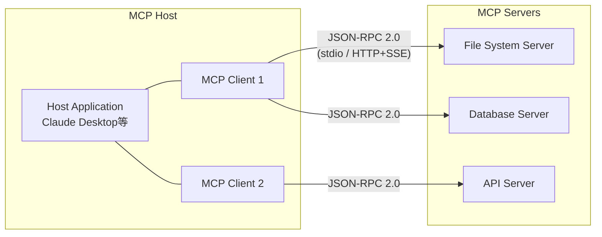

本記事は [Anthropic: Donating the Model Context Protocol and establishing the Agentic AI Foundation](https://www.anthropic.com/news/donating-the-model-context-protocol-and-establishing-of-the-agentic-ai-foundation) の解説記事です。

## ブログ概要（Summary）

2025年12月、AnthropicはModel Context Protocol（MCP）をLinux Foundation傘下の新組織「Agentic AI Foundation（AAIF）」に寄贈することを発表した。AAIFはAnthropic、Block、OpenAIが共同設立し、Google、Microsoft、AWS、Cloudflare、Bloombergが支援する。MCPは発表から約1年で10,000以上のアクティブなパブリックサーバー、Python・TypeScript SDKの月間9,700万以上のダウンロードを達成しており、エージェントAI時代のインフラストラクチャ標準として確立されつつある。

この記事は [Zenn記事: A2A・MCP・ACPで設計するマルチエージェント通信：3層プロトコル実装ガイド](https://zenn.dev/0h_n0/articles/679435133792e7) の深掘りです。

## 情報源

- **種別**: 企業テックブログ
- **URL**: [https://www.anthropic.com/news/donating-the-model-context-protocol-and-establishing-of-the-agentic-ai-foundation](https://www.anthropic.com/news/donating-the-model-context-protocol-and-establishing-of-the-agentic-ai-foundation)
- **組織**: Anthropic
- **発表日**: 2025年12月9日

## 技術的背景（Technical Background）

### MCPとは何か

Model Context Protocol（MCP）は、2024年にAnthropicが発表したオープン標準プロトコルである。LLMエージェントが外部ツール・データソース・サービスに接続するための統一インターフェースを提供する。

MCPの設計思想は「一度実装すれば、エコシステム全体の統合がアンロックされる」というものであり、各エージェントフレームワークが個別にAPIインテグレーションを実装する必要を解消する。

### なぜ寄贈が必要だったのか

MCPの急速な普及に伴い、単一企業による管理からコミュニティ主導のガバナンスへの移行が求められるようになった。ブログでは以下の理由が示唆されている。

1. **ベンダー中立性の確保**: Anthropic単独の管理では、競合他社（Google、Microsoft、OpenAI）がプロトコルの方向性に影響力を持てない
2. **エコシステムの持続性**: 特定企業の事業判断に依存しないガバナンス体制が必要
3. **標準化の加速**: Linux Foundationの既存インフラ（CI/CD、法的フレームワーク、コミュニティ管理ツール）を活用して開発スピードを向上

### Zenn記事との関連

Zenn記事ではMCPを「エージェントの手（外部データ・APIアクセス）」と位置づけ、A2A（エージェントの言葉）との2層構成を解説している。本ブログで発表されたAAIFへの寄贈は、MCPがA2Aと並ぶ業界標準として制度的に確立されたことを意味する。

## 実装アーキテクチャ（Architecture）

### MCPのClient-Serverモデル

MCPはHost・Client・Serverの3つのコンポーネントで構成される。

- **Host**: LLMアプリケーション（Claude Desktop、Cursor、VS Code等）
- **Client**: Host内に埋め込まれ、MCPサーバーとの接続を管理
- **Server**: ツール・リソース・プロンプトを公開するサービス

### 通信プリミティブ

MCPは4つの通信プリミティブを定義している。

| プリミティブ | 説明 | 使用例 |
|-------------|------|--------|
| **Tools** | 呼び出し可能な関数 | ファイル読み取り、DB検索、API呼び出し |
| **Resources** | 構造化データへのアクセス | ファイルシステム、データベーステーブル |
| **Prompts** | LLMへの入力テンプレート | 定型的な質問パターン |
| **Sampling** | LLM推論の呼び出し | サーバー側でのLLM実行 |

### 最新の技術進化

ブログでは、MCP発表後の技術進化として以下が紹介されている。

1. **Tool Search**: 数千のツールから関連ツールを効率的に検索する機能
2. **Programmatic Tool Calling**: API経由でのプログラマティックなツール呼び出し
3. **公式コミュニティレジストリ**: サーバー発見のための公式レジストリ
4. **非同期操作・ステートレス**: 新たに追加された非同期操作とステートレスモードのサポート
5. **サーバーアイデンティティ**: サーバーの識別・認証メカニズム
6. **公式拡張機能**: プロトコルの公式拡張ポイント

## パフォーマンス最適化（Performance）

### エコシステム規模の指標

ブログで公開されている採用指標は以下の通り（2025年12月時点）。

| 指標 | 値 |
|------|-----|
| **アクティブパブリックMCPサーバー** | 10,000以上 |
| **月間SDKダウンロード数** | 9,700万以上（Python + TypeScript） |
| **Claudeコネクタ数** | 75以上 |
| **SDK対応言語** | 全主要プログラミング言語 |

### 採用プラットフォーム

MCPは以下の主要プラットフォームに採用されている。

- **AIアシスタント**: ChatGPT、Gemini、Claude、Microsoft Copilot
- **開発ツール**: Cursor、Visual Studio Code
- **クラウドプラットフォーム**: AWS、Google Cloud、Microsoft Azure、Cloudflare

### Tool Searchによるスケーリング

Tool Search機能は、エージェントが数千のMCPサーバー（ツール）から関連するものを効率的に選択するための仕組みである。これにより、本番環境で大量のツールを扱う際のレイテンシを削減し、コンテキストウィンドウの消費を最適化する。

## 運用での学び（Production Lessons）

### AAIF（Agentic AI Foundation）のガバナンス

AAIFはLinux Foundation傘下のDirected Fund（特定目的基金）として設立された。

**共同設立者（Co-founders）**:
- **Anthropic**: MCP（Model Context Protocol）を寄贈
- **Block**: goose（オープンソースAIエージェント）を寄贈
- **OpenAI**: AGENTS.md（エージェント仕様記述標準）を寄贈

**支援企業**: Google、Microsoft、AWS、Cloudflare、Bloomberg

**ガバナンスモデル**: MCPの既存ガバナンスモデルは変更されず、コミュニティ入力と透明な意思決定プロセスが維持される。

### 競合他社の協調

注目すべきは、AIモデル開発で競合するAnthropic・OpenAI・Googleが、インフラストラクチャ標準の策定では協力している点である。これは、プロトコル層の標準化が各社のビジネスモデル（モデル提供・API課金）と直接競合しないためと考えられる。

### MCP発表からAAIF設立までのタイムライン

| 時期 | イベント |
|------|---------|
| 2024年 | Anthropic、MCPを発表 |
| 2024年末〜2025年初頭 | MCPサーバーの急速な増加、SDK普及開始 |
| 2025年4月 | Google、A2Aプロトコルを発表（MCPと補完関係） |
| 2025年中盤 | ChatGPT、Gemini、VS Code等がMCP採用 |
| 2025年12月 | Anthropic、MCPをAAIFに寄贈。AAIF設立 |
| 2026年 | AAIF管理下でMCP仕様の標準化が進行 |

## 学術研究との関連（Academic Connection）

### MCPのセキュリティ研究

MCPの普及に伴い、セキュリティ研究も活発化している。arXiv:2504.03767（MCP Safety Audit）では、MCPサーバーの悪意あるツール記述がLLMエージェントを攻撃するベクトルとなりうることが報告されている。AAIFによる標準化プロセスには、このようなセキュリティ課題への対処も含まれると期待される。

### エージェントプロトコルのサーベイ

arXiv:2505.02279では、MCPをACP・A2A・ANPと並べた4層統合アーキテクチャが提案されている。MCPはこのスタックの最下層（Tool/Resource Layer）に位置づけられ、上位プロトコル（A2A等）と組み合わせて使用される想定である。

### オープンスタンダードの歴史的文脈

MCPのAAIFへの寄贈は、Web標準（W3C）、コンテナ標準（OCI/CNCF）、API標準（OpenAPI Foundation）と同様のパターンを踏襲している。企業が開発した技術を中立的な財団に移管することで、エコシステム全体の信頼性と持続性を高める手法は、インフラストラクチャ技術の標準化において繰り返し成功してきた。

## まとめと実践への示唆

AnthropicのMCPのAAIFへの寄贈は、エージェントAIのインフラストラクチャ標準化における制度的な転換点である。

1. **MCPの標準としての地位確立**: 主要AI企業（Anthropic、OpenAI、Google、Microsoft）がすべてMCPを支持・採用しており、ツール統合の事実上の標準となった
2. **A2Aとの補完関係の制度化**: AAIF設立と同時期にA2AがLinux Foundationに移管されており、MCP（ツール統合）+ A2A（エージェント間通信）の2層構成が制度的にも確立された
3. **エコシステムの持続性**: Linux Foundation管理下に移行したことで、特定企業の事業判断に依存しない持続可能な開発体制が整った

Zenn記事で解説したMCP + A2Aの2層アーキテクチャは、AAIF設立によって制度的な裏付けを得たことになる。今後のマルチエージェントシステム設計では、この2層構成を基本として採用することが推奨される。

## 参考文献

- **Blog URL**: [https://www.anthropic.com/news/donating-the-model-context-protocol-and-establishing-of-the-agentic-ai-foundation](https://www.anthropic.com/news/donating-the-model-context-protocol-and-establishing-of-the-agentic-ai-foundation)
- **MCP公式**: [https://modelcontextprotocol.io/](https://modelcontextprotocol.io/)
- **Introducing MCP**: [https://www.anthropic.com/news/model-context-protocol](https://www.anthropic.com/news/model-context-protocol)
- **AAIF (Linux Foundation)**: Linux Foundation Agentic AI Foundation
- **Related Zenn article**: [https://zenn.dev/0h_n0/articles/679435133792e7](https://zenn.dev/0h_n0/articles/679435133792e7)

---

:::message
この記事はAI（Claude Code）により自動生成されました。内容の正確性についてはAnthropicの原文で検証していますが、AAIF・MCPの最新状況は公式サイトもご確認ください。
:::
