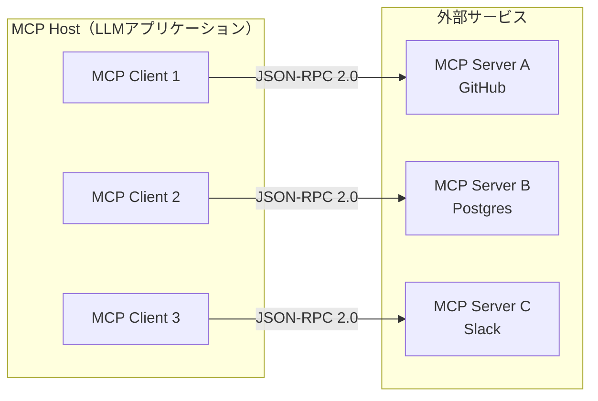
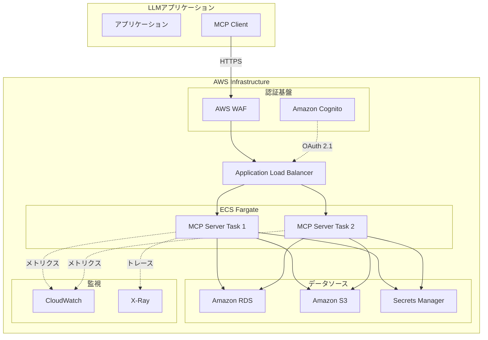
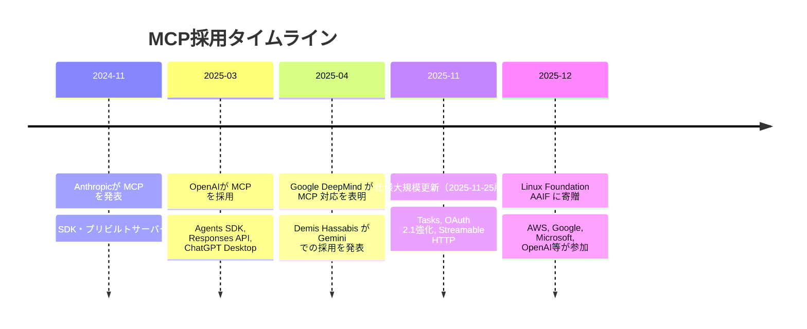

> **本記事はAIによって生成されています。** 内容の正確性には十分注意していますが、最新の情報は公式ドキュメントをご確認ください。

## ブログ概要

Model Context Protocol（MCP）は、Anthropicが2024年11月に発表したオープンプロトコルである。LLMアプリケーションと外部データソースやツールとの間に標準化された接続インターフェースを提供することを目的としている。Anthropicは公式ブログ「[Introducing the Model Context Protocol](https://www.anthropic.com/news/model-context-protocol)」にて、MCPが「AIアシスタントとデータソース間の安全な双方向接続を実現するオープン標準」であると説明している。2025年12月にはLinux Foundation傘下のAgentic AI Foundation（AAIF）に寄贈され、ベンダー中立なオープンガバナンスへと移行した。

本記事は [Zenn記事: OpenAI Assistants APIのThread管理とResponses API移行実践ガイド](https://zenn.dev/0h_n0/articles/80554aca49f2ed) の深掘りです。

## 情報源

| 項目 | 内容 |
|------|------|
| 種別 | 企業テックブログ |
| URL | [https://www.anthropic.com/news/model-context-protocol](https://www.anthropic.com/news/model-context-protocol) |
| 組織 | Anthropic |
| 発表日 | 2024年11月25日 |

## 技術的背景

LLMをプロダクション環境で活用する際、外部ツールやデータソースとの接続は避けられない課題である。従来のアプローチでは、各ツールプロバイダーが独自のAPIフォーマットやSDKを提供し、LLMアプリケーション側がそれぞれに対応するカスタム実装を行う必要があった。この結果、N個のLLMアプリケーションとM個のツールの組み合わせに対して最大$$ N \times M $$の統合実装が発生する、いわゆる「フラグメンテーション問題」が生じていた。

Anthropicのブログによれば、MCPはこの問題に対して「カスタム実装を統一的接続に置き換える」ことを目指しているとされる。USB-Cが物理デバイスの接続を標準化したように、MCPはLLMと外部サービスの接続を標準化するプロトコルとして設計された。

## 実装アーキテクチャ

### クライアント-サーバーアーキテクチャ

MCPはクライアント-サーバーモデルに基づいている。[公式仕様（2025-11-25版）](https://modelcontextprotocol.io/specification/2025-11-25)によれば、アーキテクチャは3つの主要コンポーネントで構成される。



- **MCP Host**: LLMアプリケーション本体（チャットボット、IDE拡張など）。1つ以上のMCP Clientを管理する
- **MCP Client**: Host内に存在し、特定のMCP Serverとの1対1の接続を維持する。プロトコルのネゴシエーションやメッセージのルーティングを担う
- **MCP Server**: 外部のツールやデータソースを公開する。Resources、Tools、Promptsなどのプリミティブを通じて機能を提供する

### プロトコルプリミティブ

MCPの仕様は4つのコアプリミティブを定義している。

| プリミティブ | 方向 | 説明 |
|-------------|------|------|
| **Resources** | Server → Client | データや内容を公開し、LLMのコンテキストとして利用可能にする |
| **Tools** | Server → Client（実行はClient起点） | サーバーが実行可能なアクション（関数呼び出し）を公開する |
| **Prompts** | Server → Client | 構造化されたプロンプトテンプレートを公開する |
| **Sampling** | Server → Client（LLM呼び出し要求） | サーバーがクライアント側のLLM推論をリクエストする |

### JSON-RPCベースの通信プロトコル

MCPの通信はJSON-RPC 2.0をベースとしている。メッセージは3種類に分類される。

```json
// Request: methodとidを持つ
{"jsonrpc": "2.0", "id": 1, "method": "tools/list", "params": {}}

// Response: resultまたはerrorとidを持つ
{"jsonrpc": "2.0", "id": 1, "result": {"tools": [...]}}

// Notification: methodを持つがidを持たない（応答不要）
{"jsonrpc": "2.0", "method": "notifications/progress", "params": {"token": "abc", "progress": 50}}
```

### トランスポート層

MCPは複数のトランスポートメカニズムをサポートしている。

- **stdio**: 標準入出力を利用する。ローカルプロセス間通信に適する
- **Streamable HTTP**（2025-11-25仕様で推奨）: HTTPリクエストとServer-Sent Events（SSE）を組み合わせる。リモート／分散構成に推奨される
- **HTTP/SSE**（レガシー）: 旧来のSSEベーストランスポート。新規実装ではStreamable HTTPが推奨される

### SDKとプリビルトサーバー

Anthropicは公式SDK（Python、TypeScript）とプリビルトサーバーを提供している。プリビルトサーバーには、Google Drive、Slack、GitHub、Git、Postgres、Puppeteerなどが含まれる。Anthropicのブログによれば、MCPのSDKは月間9,700万以上のダウンロードを記録しているとされる。

## Production Deployment Guide

### アーキテクチャ設計

本番環境でMCPサーバーをホスティングする際には、セキュリティ、スケーラビリティ、可観測性の3つの観点を考慮する必要がある。以下では、AWS上でのリモートMCPサーバーデプロイメントの構成例を示す。



### Terraformによるインフラ定義

以下は、ECS FargateでMCPサーバーをホスティングするTerraform構成の概要である。なお、HashiCorpが提供する[Terraform MCP Server](https://developer.hashicorp.com/terraform/mcp-server)は、Terraformレジストリとの連携を目的としたMCPサーバーであり、ここで示すのはMCPサーバー自体をECS上にデプロイするためのTerraform定義である。

```hcl
# ECS Fargate タスク定義
resource "aws_ecs_task_definition" "mcp_server" {
  family                   = "mcp-server"
  requires_compatibilities = ["FARGATE"]
  network_mode             = "awsvpc"
  cpu                      = 512
  memory                   = 1024
  execution_role_arn       = aws_iam_role.ecs_execution.arn
  task_role_arn            = aws_iam_role.mcp_task.arn

  container_definitions = jsonencode([{
    name      = "mcp-server"
    image     = "${aws_ecr_repository.mcp.repository_url}:latest"
    essential = true

    portMappings = [{
      containerPort = 8080
      protocol      = "tcp"
    }]

    environment = [
      { name = "MCP_TRANSPORT", value = "streamable-http" },
      { name = "MCP_PORT", value = "8080" },
      { name = "MCP_LOG_LEVEL", value = "info" }
    ]

    secrets = [
      {
        name      = "DATABASE_URL"
        valueFrom = aws_secretsmanager_secret.db_url.arn
      }
    ]

    logConfiguration = {
      logDriver = "awslogs"
      options = {
        "awslogs-group"         = aws_cloudwatch_log_group.mcp.name
        "awslogs-region"        = var.region
        "awslogs-stream-prefix" = "mcp"
      }
    }

    healthCheck = {
      command     = ["CMD-SHELL", "curl -f http://localhost:8080/health || exit 1"]
      interval    = 30
      timeout     = 5
      retries     = 3
      startPeriod = 60
    }
  }])
}

# ECS サービス定義（Auto Scaling付き）
resource "aws_ecs_service" "mcp_server" {
  name            = "mcp-server"
  cluster         = aws_ecs_cluster.main.id
  task_definition = aws_ecs_task_definition.mcp_server.arn
  desired_count   = 2
  launch_type     = "FARGATE"

  network_configuration {
    subnets          = var.private_subnet_ids
    security_groups  = [aws_security_group.mcp_server.id]
    assign_public_ip = false
  }

  load_balancer {
    target_group_arn = aws_lb_target_group.mcp.arn
    container_name   = "mcp-server"
    container_port   = 8080
  }
}

# Auto Scaling
resource "aws_appautoscaling_target" "mcp" {
  max_capacity       = 10
  min_capacity       = 2
  resource_id        = "service/${aws_ecs_cluster.main.name}/${aws_ecs_service.mcp_server.name}"
  scalable_dimension = "ecs:service:DesiredCount"
  service_namespace  = "ecs"
}

resource "aws_appautoscaling_policy" "mcp_cpu" {
  name               = "mcp-cpu-scaling"
  policy_type        = "TargetTrackingScaling"
  resource_id        = aws_appautoscaling_target.mcp.resource_id
  scalable_dimension = aws_appautoscaling_target.mcp.scalable_dimension
  service_namespace  = aws_appautoscaling_target.mcp.service_namespace

  target_tracking_scaling_policy_configuration {
    predefined_metric_specification {
      predefined_metric_type = "ECSServiceAverageCPUUtilization"
    }
    target_value = 70.0
  }
}
```

### MCP Server実装例（Python SDK）

以下は、Python SDKを用いたリモートMCPサーバーの実装例である。Streamable HTTPトランスポートを使用し、ヘルスチェックエンドポイントを含む構成を示す。

```python
"""MCP Server - Streamable HTTP transport example."""

from mcp.server import Server
from mcp.server.streamable_http import StreamableHTTPServer
from mcp.types import Tool, TextContent

server = Server("example-mcp-server")


@server.list_tools()
async def list_tools() -> list[Tool]:
    """利用可能なツール一覧を返す。"""
    return [
        Tool(
            name="query_database",
            description="データベースに対してSQLクエリを実行する",
            inputSchema={
                "type": "object",
                "properties": {
                    "query": {
                        "type": "string",
                        "description": "実行するSQLクエリ",
                    }
                },
                "required": ["query"],
            },
        )
    ]


@server.call_tool()
async def call_tool(name: str, arguments: dict) -> list[TextContent]:
    """ツール呼び出しを処理する。"""
    if name == "query_database":
        # 実際のDB接続処理（省略）
        result = await execute_query(arguments["query"])
        return [TextContent(type="text", text=str(result))]
    raise ValueError(f"Unknown tool: {name}")


if __name__ == "__main__":
    http_server = StreamableHTTPServer(
        server,
        host="0.0.0.0",
        port=8080,
    )
    http_server.run()
```

### CloudWatch監視設定

MCPサーバーの運用では、以下のメトリクスを監視することが推奨される。

```hcl
# CloudWatch ダッシュボードとアラーム
resource "aws_cloudwatch_metric_alarm" "mcp_high_latency" {
  alarm_name          = "mcp-server-high-latency"
  comparison_operator = "GreaterThanThreshold"
  evaluation_periods  = 3
  metric_name         = "TargetResponseTime"
  namespace           = "AWS/ApplicationELB"
  period              = 60
  statistic           = "Average"
  threshold           = 5.0
  alarm_description   = "MCPサーバーのレスポンスタイムが5秒を超過"

  dimensions = {
    LoadBalancer = aws_lb.mcp.arn_suffix
    TargetGroup  = aws_lb_target_group.mcp.arn_suffix
  }

  alarm_actions = [aws_sns_topic.alerts.arn]
}

resource "aws_cloudwatch_metric_alarm" "mcp_error_rate" {
  alarm_name          = "mcp-server-error-rate"
  comparison_operator = "GreaterThanThreshold"
  evaluation_periods  = 2
  threshold           = 5.0
  alarm_description   = "MCPサーバーの5xxエラー率が5%を超過"

  metric_query {
    id          = "error_rate"
    expression  = "(errors / requests) * 100"
    label       = "Error Rate (%)"
    return_data = true
  }

  metric_query {
    id = "errors"
    metric {
      metric_name = "HTTPCode_Target_5XX_Count"
      namespace   = "AWS/ApplicationELB"
      period      = 300
      stat        = "Sum"
      dimensions = {
        LoadBalancer = aws_lb.mcp.arn_suffix
      }
    }
  }

  metric_query {
    id = "requests"
    metric {
      metric_name = "RequestCount"
      namespace   = "AWS/ApplicationELB"
      period      = 300
      stat        = "Sum"
      dimensions = {
        LoadBalancer = aws_lb.mcp.arn_suffix
      }
    }
  }

  alarm_actions = [aws_sns_topic.alerts.arn]
}
```

### OpenAI Responses APIからの接続

OpenAIのResponses APIは、リモートMCPサーバーへの接続をネイティブにサポートしている。[OpenAI公式ドキュメント](https://platform.openai.com/docs/guides/tools-connectors-mcp)によれば、Responses APIはStreamable HTTPおよびHTTP/SSEトランスポートに対応し、追加のツール呼び出し料金は発生しない（トークン使用量のみ課金）。

```python
"""OpenAI Responses APIからリモートMCPサーバーを利用する例。"""

from openai import OpenAI

client = OpenAI()

response = client.responses.create(
    model="gpt-4.1",
    input="データベースからユーザー一覧を取得してください",
    tools=[
        {
            "type": "mcp",
            "server_label": "my-db-server",
            "server_url": "https://mcp.example.com/sse",
            "require_approval": "never",
            "headers": {
                "Authorization": "Bearer <ACCESS_TOKEN>"
            },
        }
    ],
)

for item in response.output:
    print(item)
```

Responses APIの実行フローは以下の通りである。

1. `tools`パラメータにMCPサーバー情報を指定
2. APIランタイムがサーバーのトランスポートを自動検出（Streamable HTTPまたはHTTP/SSE）
3. `tools/list`を呼び出してツール一覧を取得（`mcp_list_tools`出力アイテムとして返却）
4. モデルが適切なツールを選択して呼び出し
5. ツール実行結果をモデルのコンテキストに追加し、最終応答を生成

なお、OpenAIのドキュメントでは、MCPサーバーが独自のツール定義を持つため、意図しないデータ共有を防ぐ目的でデフォルトではツール呼び出しに承認が必要とされている。`require_approval`パラメータで制御可能である。

## パフォーマンス最適化

MCPサーバーのパフォーマンスについて、[MCP公式仕様のプロダクションガイド](https://modelcontextprotocol.io/specification/2025-11-25)では以下の点が言及されている。

- **接続管理**: MCPはステートフルなセッションを維持するため、クライアントとサーバー間の接続状態管理が重要である。ロードバランサーを使用する場合はスティッキーセッションの考慮が必要になる
- **レート制限**: グローバルおよびセッションごとのレート制限の設定が推奨されている。過度なリクエストによるサーバーや依存リソースの過負荷を防ぐためである
- **ステートレスモード**: 高可用性デプロイメントやロードバランサー使用時には、各リクエストを独立して処理するステートレスモードが有用とされている
- **非同期タスク**: 2025-11-25仕様で導入されたTasksプリミティブにより、長時間実行される処理を非同期で管理できる。タスクIDを即座に返却し、クライアントが定期的にステータスを確認する「call-now, fetch-later」パターンが標準化された

## 運用での学び

### セキュリティ考慮事項

2025-11-25仕様では、OAuth 2.1ベースの認証フレームワークが強化された。[MCP公式チュートリアル](https://modelcontextprotocol.io/docs/tutorials/security/authorization)によれば、以下の要素が推奨されている。

- **OAuth 2.1 + PKCE**: 認証コードフロー+PKCEが必須とされている。PKCEはOAuth 2.1で必須であり、MCPでも同様に要求される
- **短命なアクセストークン**: 漏洩時の影響範囲を最小化するため、短命なトークンの使用が推奨されている
- **スコープベースのアクセス制御**: ツールごとの細粒度な権限設定（例: `weather:read`, `calendar:write`）が推奨されている
- **Client ID Metadata Documents（CIMD）**: 2025-11-25仕様で導入された。Dynamic Client Registrationに代わる分散型の信頼モデルであり、`client_id`がメタデータを指すURLとなる
- **Machine-to-Machine認証**: `client_credentials`フローによるヘッドレスなエージェント間通信をサポートする

### 制約と限界

MCPの採用にあたっては、以下の制約を認識しておく必要がある。

- MCPサーバーが独自のツール定義を持つため、サーバー提供者によるデータアクセス範囲を事前に検証する必要がある
- ステートフルなセッション管理のオーバーヘッドが存在する
- 現時点ではすべてのLLMプロバイダーがMCPを同等にサポートしているわけではない

## 学術研究との関連

LLMのツール利用能力に関する学術研究として、Appleが発表した[ToolSandbox](https://arxiv.org/abs/2408.04682)（NAACL 2025 Findings）が挙げられる。ToolSandboxは、ステートフルかつ対話的な環境でLLMのツール呼び出し能力を評価するベンチマークであり、ツール間の暗黙的な状態依存関係や不十分な情報下での判断など、実運用で発生する課題を体系的に評価している。MCPが標準化しようとしているツール統合の品質評価という観点で、こうしたベンチマークとの連携が今後重要になると考えられる。

## 採用タイムライン

MCPは発表から1年余りで業界標準としての地位を確立しつつある。以下に主要なマイルストーンを示す。



Linux Foundationの[Agentic AI Foundation（AAIF）](https://www.linuxfoundation.org/press/linux-foundation-announces-the-formation-of-the-agentic-ai-foundation)には、Platinum MemberとしてAmazon Web Services、Anthropic、Block、Bloomberg、Cloudflare、Google、Microsoft、OpenAIが参加している。MCPに加え、Blockの[goose](https://github.com/block/goose)およびOpenAIの[AGENTS.md](https://github.com/openai/agents-md)がAAIFの初期プロジェクトとして寄贈されている。

## まとめと実践への示唆

MCPは、LLMとツール間の接続を標準化するオープンプロトコルとして、発表から約1年で業界の主要プレイヤーに採用されるに至った。特にOpenAIのResponses APIがMCPをネイティブサポートしたことは、[Zenn記事](https://zenn.dev/0h_n0/articles/80554aca49f2ed)で解説されているAssistants APIからの移行において重要な意味を持つ。Assistants APIでは利用できなかったMCPツール統合が、Responses APIでは標準機能として利用可能になったためである。

MCPの仕様が安定し、ガバナンスがLinux Foundationに移管されたことで、プロダクション環境での採用障壁は低下している。一方で、セキュリティモデルの理解やサーバー運用のベストプラクティスの蓄積はまだ発展途上にある。今後のエコシステムの成熟に注目すべきである。

## 参考文献

- Anthropic. "[Introducing the Model Context Protocol](https://www.anthropic.com/news/model-context-protocol)." 2024-11-25.
- Model Context Protocol. "[Specification 2025-11-25](https://modelcontextprotocol.io/specification/2025-11-25)."
- Anthropic. "[Donating the Model Context Protocol and establishing of the Agentic AI Foundation](https://www.anthropic.com/news/donating-the-model-context-protocol-and-establishing-of-the-agentic-ai-foundation)." 2025-12-09.
- Linux Foundation. "[Linux Foundation Announces the Formation of the Agentic AI Foundation (AAIF)](https://www.linuxfoundation.org/press/linux-foundation-announces-the-formation-of-the-agentic-ai-foundation)." 2025-12-09.
- OpenAI. "[MCP and Connectors - OpenAI API](https://platform.openai.com/docs/guides/tools-connectors-mcp)."
- OpenAI. "[New tools and features in the Responses API](https://openai.com/index/new-tools-and-features-in-the-responses-api/)." 2025-03.
- MCP Blog. "[One Year of MCP: November 2025 Spec Release](http://blog.modelcontextprotocol.io/posts/2025-11-25-first-mcp-anniversary/)." 2025-11-25.
- Subramanya N. "[MCP Enterprise Readiness: How the 2025-11-25 Spec Closes the Production Gap](https://subramanya.ai/2025/12/01/mcp-enterprise-readiness-how-the-2025-11-25-spec-closes-the-production-gap/)." 2025-12-01.
- Model Context Protocol. "[Understanding Authorization in MCP](https://modelcontextprotocol.io/docs/tutorials/security/authorization)."
- HashiCorp. "[Terraform MCP Server](https://developer.hashicorp.com/terraform/mcp-server)."
- AWS Labs. "[Official MCP Servers for AWS](https://awslabs.github.io/mcp/)."
- Lu, J. et al. "[ToolSandbox: A Stateful, Conversational, Interactive Evaluation Benchmark for LLM Tool Use Capabilities](https://arxiv.org/abs/2408.04682)." NAACL 2025 Findings.
- Google Cloud Blog. "[Announcing official MCP support for Google services](https://cloud.google.com/blog/products/ai-machine-learning/announcing-official-mcp-support-for-google-services)." 2025-04.
