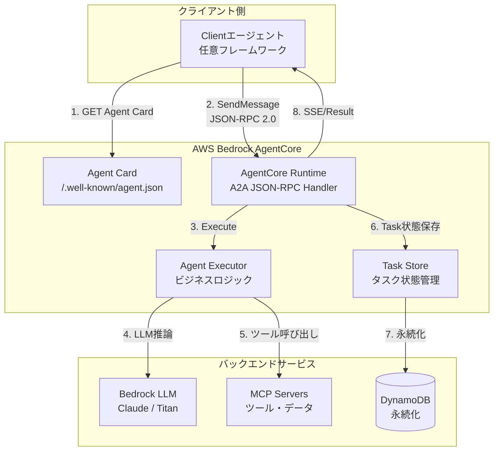

本記事は [AWS Machine Learning Blog: Introducing agent-to-agent protocol support in Amazon Bedrock AgentCore Runtime](https://aws.amazon.com/blogs/machine-learning/introducing-agent-to-agent-protocol-support-in-amazon-bedrock-agentcore-runtime/) および [AWS Open Source Blog: Open Protocols for Agent Interoperability Part 4](https://aws.amazon.com/blogs/opensource/open-protocols-for-agent-interoperability-part-4-inter-agent-communication-on-a2a/) の解説記事です。

## ブログ概要（Summary）

AWSはAmazon Bedrock AgentCore Runtimeに、Agent-to-Agent（A2A）プロトコルのサポートを導入した。これにより、異なるフレームワーク・モデル・ホスティングインフラで構築されたAIエージェント間の標準化された通信が可能になる。AWSはA2AをMCPと並ぶエージェント相互運用性の柱として位置づけ、AWS Open Source Blogの4部作シリーズ「Open Protocols for Agent Interoperability」でMCP（Part 1）からA2A（Part 4）までの技術実装を体系的に解説している。

この記事は [Zenn記事: A2A・MCP・ACPで設計するマルチエージェント通信：3層プロトコル実装ガイド](https://zenn.dev/0h_n0/articles/679435133792e7) の深掘りです。

## 情報源

- **種別**: 企業テックブログ
- **URL（主）**: [https://aws.amazon.com/blogs/machine-learning/introducing-agent-to-agent-protocol-support-in-amazon-bedrock-agentcore-runtime/](https://aws.amazon.com/blogs/machine-learning/introducing-agent-to-agent-protocol-support-in-amazon-bedrock-agentcore-runtime/)
- **URL（補）**: [https://aws.amazon.com/blogs/opensource/open-protocols-for-agent-interoperability-part-4-inter-agent-communication-on-a2a/](https://aws.amazon.com/blogs/opensource/open-protocols-for-agent-interoperability-part-4-inter-agent-communication-on-a2a/)
- **組織**: Amazon Web Services
- **発表日**: 2025年

## 技術的背景（Technical Background）

### AWSのエージェント相互運用性戦略

AWSは「Open Protocols for Agent Interoperability」と題した4部作のブログシリーズで、エージェント間通信の標準化に対する包括的なアプローチを示している。

| Part | テーマ | プロトコル |
|------|--------|-----------|
| Part 1 | エージェント間通信の基礎 | MCP |
| Part 2 | ツール統合 | MCP |
| Part 3 | エージェント協調 | MCP + A2A |
| Part 4 | エージェント間通信 | A2A |

この構成は、MCPとA2Aを補完的な関係として位置づけるAWSの戦略を反映している。MCPがツール・データソースへのアクセスを標準化し、A2Aがエージェント間のタスク委譲・協調を標準化する。

### なぜBedrock AgentCoreにA2Aが必要か

Amazon Bedrock AgentCoreは、AIエージェントの構築・デプロイ・スケーリングを支援するマネージドサービスである。従来のBedrockエージェントは単一のエージェントとして動作していたが、企業のユースケースが複雑化するにつれ、複数の専門エージェントを組み合わせたマルチエージェントシステムの需要が高まった。

A2Aプロトコルのサポートにより、以下が可能になる。

1. **フレームワーク間接続**: LangGraph、CrewAI、Semantic Kernel等で構築されたエージェントとBedrock Agentの相互通信
2. **クロスクラウド通信**: AWS上のエージェントがAzure・GCP上のエージェントと標準プロトコルで通信
3. **ベンダー非依存**: 特定のAIモデルプロバイダーに依存しない通信標準

### Zenn記事との技術的関連

Zenn記事ではA2A Python SDKを使った`ResearchAgentExecutor`の実装例を示しているが、Bedrock AgentCore Runtimeでは、この実行環境がマネージドサービスとして提供される。つまり、開発者はエージェントのビジネスロジック（`AgentExecutor`の`execute`メソッド）の実装に集中し、サーバー運用・スケーリング・可用性はAgentCoreに委譲できる。

## 実装アーキテクチャ（Architecture）

### Bedrock AgentCore + A2Aの構成



### Agent Cardの公開

Bedrock AgentCore RuntimeはA2A仕様に準拠した`/.well-known/agent.json`エンドポイントを自動的に公開する。開発者はAgent Cardの内容（スキル定義、認証方式等）を設定するだけでよい。

### Task Storeの永続化

Zenn記事では`InMemoryTaskStore`を使用した開発・テスト用の実装を紹介しているが、Bedrock AgentCoreでは以下のマネージドな永続化オプションが想定される。

- **DynamoDB**: サーバーレス構成でのTask状態永続化。On-Demandモードにより低コストで開始可能
- **ElastiCache Redis**: 高頻度アクセスのTask状態管理。Taskライフサイクルの状態遷移が頻繁な場合に適する

```python
# DynamoDBベースのTaskStore実装例（AWSパターン）
import boto3
import json
from datetime import datetime, timezone
from a2a.server.tasks import TaskStore
from a2a.types import Task


class DynamoDBTaskStore(TaskStore):
    """DynamoDBを使用したA2A Task永続化

    Bedrock AgentCore相当のTask永続化を自前実装する場合の例。
    Zenn記事のInMemoryTaskStoreを本番環境に置き換える際に使用。

    Args:
        table_name: DynamoDBテーブル名
    """

    def __init__(self, table_name: str = "a2a-tasks") -> None:
        self.table = boto3.resource("dynamodb").Table(table_name)

    async def get(self, task_id: str) -> Task | None:
        """Task IDでタスクを取得する"""
        response = self.table.get_item(Key={"task_id": task_id})
        item = response.get("Item")
        if item is None:
            return None
        return Task.model_validate_json(item["task_json"])

    async def save(self, task: Task) -> None:
        """タスクを保存（作成または更新）する"""
        self.table.put_item(
            Item={
                "task_id": task.id,
                "task_json": task.model_dump_json(),
                "status": task.status.state.value,
                "updated_at": datetime.now(timezone.utc).isoformat(),
                "ttl": int(datetime.now(timezone.utc).timestamp()) + 86400 * 7,
            }
        )

    async def delete(self, task_id: str) -> None:
        """タスクを削除する"""
        self.table.delete_item(Key={"task_id": task_id})
```

## パフォーマンス最適化（Performance）

### Bedrock AgentCoreのスケーリング特性

Bedrock AgentCore Runtimeはマネージドサービスとして以下のスケーリング特性を持つ。

- **自動スケーリング**: リクエスト量に応じてA2Aエンドポイントのインスタンス数を自動調整
- **マルチAZ配置**: 可用性確保のためのマルチアベイラビリティゾーン配置
- **コールドスタート最適化**: Lambda統合時のコールドスタート時間の最小化

### A2AとMCPの通信レイテンシ

マルチエージェントシステムでは、A2A（エージェント間）とMCP（ツールアクセス）の2段階の通信が発生する。AWSブログシリーズの知見に基づくレイテンシの内訳は以下の通りである。

| 通信段階 | レイテンシ要因 | 想定範囲 |
|---------|-------------|---------|
| Agent Card取得 | HTTP GET + DNS解決 | 10-50ms |
| A2A SendMessage | JSON-RPC over HTTPS | 20-100ms |
| Bedrock LLM推論 | モデルサイズ依存 | 500-5,000ms |
| MCP Tool呼び出し | ツール依存 | 50-2,000ms |
| SSEストリーミング | 初回応答 | 100-500ms |
| **合計（典型的）** | | **1-8秒** |

LLM推論がボトルネックであり、A2Aプロトコル自体のオーバーヘッドは全体の数%程度である。

### コスト最適化のポイント

AWSでA2Aベースのマルチエージェントシステムを運用する際のコスト最適化。

1. **Bedrock Batch API**: 非リアルタイム処理にはBatch APIを使用して50%のコスト削減
2. **Prompt Caching**: システムプロンプトの固定部分をキャッシュして30-90%削減
3. **モデル選択ロジック**: タスク複雑度に応じてHaiku（安価）とSonnet（高性能）を動的に選択

## 運用での学び（Production Lessons）

### AWSのオープンプロトコル戦略

AWSの4部作ブログシリーズは、AWSがプロプライエタリなエージェント通信方式ではなく、オープンプロトコル（MCP + A2A）に投資していることを示している。これは以下の戦略的意図を反映している。

1. **エコシステム拡大**: オープンプロトコルにより、AWS以外のプラットフォーム上のエージェントもBedrock Agentと通信可能にする
2. **ロックイン回避**: 顧客がベンダーロックインを懸念せずにBedrockを採用できるようにする
3. **標準化への投資**: Linux FoundationへのA2A/MCP移管を支援し、業界標準の策定に参加

### マルチクラウド相互運用の実現

A2Aプロトコルのサポートにより、以下のマルチクラウド構成が技術的に可能になる。

- **AWS Bedrock Agent ↔ Azure AI Foundry Agent**: A2A over HTTPS
- **AWS Bedrock Agent ↔ Google Vertex AI Agent**: A2A over HTTPS
- **AWS Bedrock Agent ↔ オンプレミスエージェント**: A2A over HTTPS + VPN/Direct Connect

組織間でエージェントを連携させる際、A2Aプロトコルが共通語となることで、各組織が異なるクラウドプロバイダーやフレームワークを使用していても通信が成立する。

### 本番環境での考慮事項

AWSでA2Aエージェントを本番運用する際の推奨事項。

| 項目 | 推奨設定 |
|------|---------|
| **認証** | Agent Cardに`security_schemes`でOAuth 2.0を設定 |
| **ネットワーク** | VPCエンドポイント経由でBedrock APIにアクセス |
| **モニタリング** | CloudWatch + X-Rayでタスクライフサイクルをトレース |
| **Task永続化** | DynamoDB（サーバーレス）またはElastiCache（高頻度） |
| **エラーハンドリング** | Task failedステートとリトライロジックの実装 |
| **レート制限** | Agent Cardにレート制限情報を記載 |

## 学術研究との関連（Academic Connection）

### プロトコル比較の文脈

arXiv:2505.02279（Agent Interoperability Protocols Survey）では、MCP・ACP・A2A・ANPの4プロトコルを比較分析している。AWSのアプローチは、このうちMCP（Tool/Resource Layer）とA2A（Collaboration Layer）の2層に集中投資するものであり、サーベイの推奨と一致する。

ACP（IBM発、REST APIベース）はA2Aに統合される方向にあり、ANP（分散型P2P）は現時点でAWSのマネージドサービスとの統合が困難なため、MCP + A2Aの2層が現実的な選択である。

### セキュリティへの対応

arXiv:2504.03767（MCP Safety Audit）で報告されたMCPのセキュリティ脆弱性に対し、Bedrock AgentCoreは以下のマネージドセキュリティ機能を提供する。

- **IAMロールベースのアクセス制御**: MCPツールへのアクセスを最小権限で制限
- **VPC配置**: パブリックインターネットを経由しないMCPサーバーアクセス
- **CloudTrail監査**: 全ツール呼び出しの監査ログ

### エンタープライズ向けマルチエージェント研究

AWS Open Source BlogシリーズはMCPサーバーの構築からA2Aエージェント間通信までを段階的に解説しており、エンタープライズでのマルチエージェントシステム構築のリファレンス実装として位置づけられる。

## まとめと実践への示唆

AWSのBedrock AgentCore RuntimeへのA2Aプロトコルサポート導入は、マルチエージェント通信の標準化がクラウドインフラレベルで進んでいることを示している。

実践的な示唆として以下の3点が重要である。

1. **マネージド vs セルフホスト**: Zenn記事のようにA2Aサーバーを自前で運用する場合と、Bedrock AgentCoreのマネージドランタイムを使用する場合のトレードオフを理解する。マネージドサービスは運用負荷を軽減するが、カスタマイズの柔軟性は制限される
2. **MCP + A2Aの2層設計**: AWS、Google、Microsoftの3大クラウドプロバイダーがいずれもMCP + A2Aの2層構成を採用しており、この設計パターンがデファクトスタンダードとなることが確実になった
3. **Task永続化の本番実装**: `InMemoryTaskStore`からDynamoDB/Redis等への移行は本番環境で必須であり、AWSのマネージドサービスを活用することで実装コストを削減できる

## 参考文献

- **AWS ML Blog**: [https://aws.amazon.com/blogs/machine-learning/introducing-agent-to-agent-protocol-support-in-amazon-bedrock-agentcore-runtime/](https://aws.amazon.com/blogs/machine-learning/introducing-agent-to-agent-protocol-support-in-amazon-bedrock-agentcore-runtime/)
- **AWS Open Source Blog Part 4**: [https://aws.amazon.com/blogs/opensource/open-protocols-for-agent-interoperability-part-4-inter-agent-communication-on-a2a/](https://aws.amazon.com/blogs/opensource/open-protocols-for-agent-interoperability-part-4-inter-agent-communication-on-a2a/)
- **AWS Open Source Blog Part 1 (MCP)**: [https://aws.amazon.com/blogs/opensource/open-protocols-for-agent-interoperability-part-1-inter-agent-communication-on-mcp/](https://aws.amazon.com/blogs/opensource/open-protocols-for-agent-interoperability-part-1-inter-agent-communication-on-mcp/)
- **MCP on AWS**: [https://aws.amazon.com/blogs/machine-learning/unlocking-the-power-of-model-context-protocol-mcp-on-aws/](https://aws.amazon.com/blogs/machine-learning/unlocking-the-power-of-model-context-protocol-mcp-on-aws/)
- **Related Zenn article**: [https://zenn.dev/0h_n0/articles/679435133792e7](https://zenn.dev/0h_n0/articles/679435133792e7)

---

:::message
この記事はAI（Claude Code）により自動生成されました。内容の正確性についてはAWSの公式ブログで検証していますが、Bedrock AgentCoreの最新仕様はAWS公式ドキュメントもご確認ください。
:::
