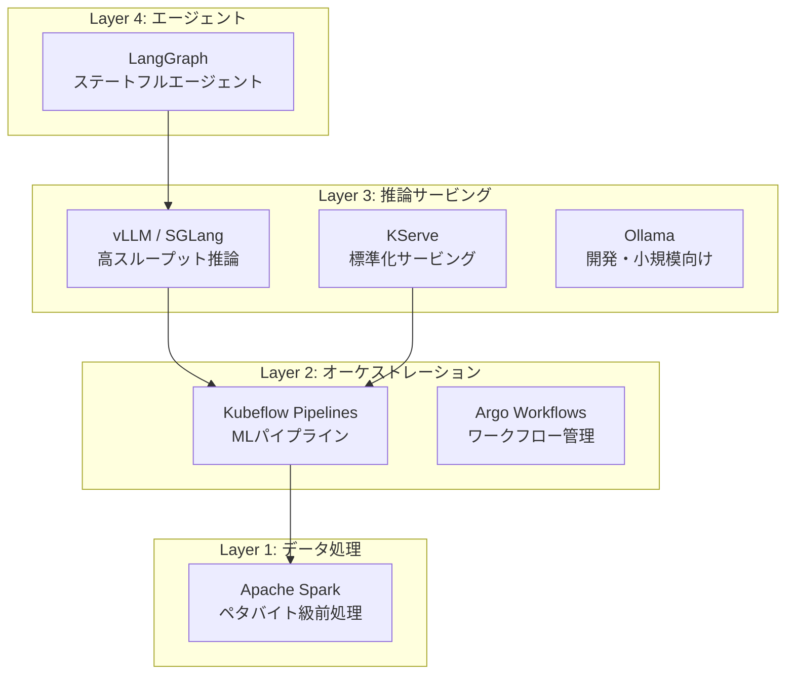

本記事は [The Great Migration: Why Every AI Platform is Converging on Kubernetes](https://www.cncf.io/blog/2026/03/05/the-great-migration-why-every-ai-platform-is-converging-on-kubernetes/)（CNCF公式ブログ、2026年3月5日公開）の解説記事です。

## ブログ概要（Summary）

AmazonのSabari Sawant氏がCNCF公式ブログに寄稿したこの記事は、Kubernetesが単なるマイクロサービスオーケストレーターから、データ処理・モデル訓練・推論・エージェントを統合する「AI統合基盤」へと進化している現状を分析している。CNCF年次調査（2026年1月）のデータを引用し、66%の組織がKubernetes上でLLM推論を実行していること、成功指標がPod密度から「tokens-per-second-per-dollar」に変化していることを報告している。

この記事は [Zenn記事: Ollama本番運用ガイド：Kubernetes・認証・監視で構築するオンプレLLM基盤](https://zenn.dev/0h_n0/articles/3a91fb8a02cdc4) の深掘りです。Zenn記事ではOllama単体のKubernetesデプロイを解説しているが、本記事ではLLM推論がKubernetesエコシステム全体の中でどのように位置づけられるかを俯瞰する。

## 情報源

- **種別**: 財団公式ブログ（CNCF / Cloud Native Computing Foundation）
- **URL**: [https://www.cncf.io/blog/2026/03/05/the-great-migration-why-every-ai-platform-is-converging-on-kubernetes/](https://www.cncf.io/blog/2026/03/05/the-great-migration-why-every-ai-platform-is-converging-on-kubernetes/)
- **組織**: CNCF（著者: Sabari Sawant, Amazon）
- **発表日**: 2026年3月5日

## 技術的背景（Technical Background）

2025年以降、LLM推論をKubernetes上で実行する組織が急増している。その背景には、データ処理・訓練・推論を別々のインフラで管理する「サイロ化」のコストが無視できなくなった事実がある。

ブログでは、この変化を3つの時代に整理している。

| 時代 | 期間 | Kubernetesの主用途 | 特徴 |
|------|------|-------------------|------|
| マイクロサービス時代 | 2015-2020 | ステートレスサービス | マルチテナント、CI/CD |
| Data + GenAI時代 | 2020-2024 | 分散データ処理 + GPU推論 | Spark on K8s、GPU Operator |
| エージェント時代 | 2025+ | 長時間推論ループ | ステートフルエージェント、KEDA |

Zenn記事で構築しているOllama+Kubernetes構成は「Data + GenAI時代」の典型的なパターンであるが、LLMエージェント（自律的なタスク実行）を視野に入れると「エージェント時代」の設計原則も考慮する必要がある。

## 実装アーキテクチャ（Architecture）

### Kubernetesがカバーする4層

ブログでは、AI/MLワークロードのKubernetes統合を4層で整理している。

Zenn記事のOllama構成はLayer 3に位置し、Prometheus+Grafana監視はLayer 3の運用基盤に相当する。ブログでは、各層で以下のツールが推奨されている。

### GPUリソース管理の最新動向

ブログで紹介されているGPUリソース管理技術は、Zenn記事のGPUスケジューリング解説を補完する重要な情報源である。

**Volcano / Apache YuniKorn / Kueue**: Gangスケジューリングを実装し、GPUの無駄遣いを防ぐ。Zenn記事で解説されているHPAとは異なるアプローチで、バッチ的なGPU割り当てに適している。

**Karpenter**: ノードレベルの自動スケーリングを実現する。GPUノードの追加・削除を需要に応じて自動化し、アイドルGPUのコストを削減する。

**Dynamic Resource Allocation（DRA）**: Kubernetes 1.34（2025年12月）でGAとなった機能で、ランタイムでのGPU分割を可能にする。Zenn記事で触れているMIG（Multi-Instance GPU）の動的管理にも対応する。

### Scale-to-Zeroによるコスト削減

ブログでは、KServe + Knativeの組み合わせによるScale-to-Zero（利用がないときにPod数を0にする）が紹介されている。GPUノードはアイドル時でも高額なコストが発生するため、夜間や低需要時にPodを0にスケールダウンすることで大幅なコスト削減が可能である。

Ollamaの場合、`OLLAMA_KEEP_ALIVE`を短く設定（例: `5m`）することでモデルをアンロードし、メモリを解放できるが、Pod自体は稼働し続けるためGPUコストは発生する。KServeのScale-to-Zeroと組み合わせることで、需要がない時間帯にGPUノード自体を停止し、Karpenterでノードを自動削除する構成が実現できる。

$$
\text{月額コスト削減} = C_{\text{GPU}} \times \frac{T_{\text{idle}}}{T_{\text{total}}} \times R_{\text{scale-to-zero}}
$$

ここで、$C_{\text{GPU}}$はGPU月額コスト、$T_{\text{idle}}$はアイドル時間、$T_{\text{total}}$は総時間、$R_{\text{scale-to-zero}}$はScale-to-Zero時の削減率（理論上100%）である。例えば、業務時間（8時間/日）のみ使用する場合、$T_{\text{idle}}/T_{\text{total}} = 16/24 \approx 0.67$となり、67%のコスト削減が見込める。

### 推論サービングの標準化

ブログによると、LLM推論サービングの標準は以下のように収斂している。

| ツール | 用途 | 特徴 |
|--------|------|------|
| vLLM | 高スループット推論 | PagedAttention、OpenAI互換API |
| SGLang | 構造化出力・高速推論 | RadixAttention、正規表現マスキング |
| KServe | 標準化サービングレイヤー | 自動スケーリング、バージョニング |
| Knative | Scale-to-Zero | GPUワークロードの休止期間コスト削減 |

Ollamaはこのリストに明示的に含まれていないが、これは企業規模のデプロイメントを対象としたブログであるためであり、中小規模環境でのOllamaの価値を否定するものではない。

## パフォーマンス最適化（Performance）

### 統計データによる現状把握

ブログで引用されているCNCF調査データは、Zenn記事の前提条件を裏付けるものである。

| 指標 | 数値 | 出典 |
|------|------|------|
| K8sで本番運用する組織 | 82% | CNCFコンテナ利用調査 |
| K8sでLLM推論を実行する組織 | 66% | CNCF年次調査2026 |
| データワークロードの50%以上をK8sで実行する組織 | ~50% | CNCF年次調査2026 |
| 先進的な組織のK8sデータワークロード比率 | 75%以上 | CNCF年次調査2026 |

Zenn記事でOllamaのKubernetesデプロイを選択した判断は、この業界動向と整合している。66%の組織がKubernetes上でLLM推論を実行しているという事実は、Kubernetes上でのLLMサービング（Ollamaを含む）が標準的なアプローチであることを示している。

### 成功指標の変化

ブログでは、Kubernetesの成功指標が「Pod密度」から「tokens-per-second-per-dollar（トークン/秒/ドル）」に変化していると述べている。

$$
\text{Efficiency} = \frac{\text{tokens/second}}{\text{cost/hour}}
$$

この指標は、GPUのスループット（tokens/second）をインフラコスト（$/hour）で割ったものである。Ollamaの場合、以下のように計算できる。

| GPU | モデル | スループット | GPU月額 | tokens/s/$ |
|-----|--------|------------|---------|-----------|
| RTX 4090 | 7B Q4 | 60-80 tok/s | ~$500 | 0.12-0.16 |
| A100 80GB | 70B Q4 | 30-40 tok/s | ~$2,500 | 0.012-0.016 |
| H100 80GB | 70B Q4 | 50-70 tok/s | ~$3,500 | 0.014-0.020 |

RTX 4090 + 7Bモデルの組み合わせが最もコスト効率が高いことがわかる。Zenn記事ではA100を前提としているが、用途によってはRTX 4090の方が適切な場合がある。

### コントロールプレーンのスケーラビリティ

ブログでは、etcd v3.6.0のメモリ使用量50%削減が紹介されている。大規模GPUクラスタでは、数百のGPUノードと数千のPodを管理するためにetcdの性能が重要になる。Zenn記事のOllama構成（2-10 Pod）ではこの制約は問題にならないが、組織全体でKubernetesを統合AI基盤として使用する場合には考慮が必要である。

## 運用での学び（Production Lessons）

### セキュリティとガバナンス

ブログでは、LLMワークロードのセキュリティに関する以下のツールが紹介されている。

| ツール | 用途 | Zenn記事との関連 |
|--------|------|----------------|
| gVisor | サンドボックス実行 | Ollamaコンテナの隔離強化 |
| Kata Containers | VM分離 | 信頼できないモデルの実行 |
| OPA（Open Policy Agent） | ポリシー制御 | API認証ポリシーの一元管理 |
| Kyverno | K8sポリシー | デプロイメント規約の自動適用 |
| SPIFFE/Spire | ワークロードID | サービス間認証の標準化 |

Zenn記事ではNginx Bearer Token認証を使っているが、ブログではSPIFFE/Spireによるワークロードレベルの認証が推奨されている。SPIFFE（Secure Production Identity Framework For Everyone）はゼロトラストアーキテクチャに基づき、各ワークロードに暗号学的IDを付与する仕組みである。

### マルチクラスタ管理

ブログでは、Armada（CNCFサンドボックスプロジェクト）が紹介されている。Armadaは複数のKubernetesクラスタを単一のリソースプールとして扱い、GPU密度の高いクラスタへのワークロード配分を最適化する。

Zenn記事では単一クラスタ構成を前提としているが、オンプレミスとクラウドを併用するハイブリッド構成では、Armadaのようなマルチクラスタ管理が必要になる場合がある。

### エージェント時代への準備

ブログが示す「エージェント時代」の設計原則は、Ollamaの長期運用計画に影響を与える。LLMエージェントはリクエスト/レスポンスパターンではなく、長時間の推論ループを実行する。

| 特性 | 従来の推論 | エージェント推論 |
|------|----------|-------------|
| リクエスト時間 | 秒単位 | 分〜時間単位 |
| 状態管理 | ステートレス | ステートフル |
| リソース消費 | 予測可能 | 変動的 |
| スケーリング | HPA（リクエストベース） | KEDA（イベントベース） |

OllamaでLLMエージェントを動かす場合、`OLLAMA_KEEP_ALIVE=-1`でモデルを常駐させ、長時間のリクエストに対応する必要がある。Zenn記事では`OLLAMA_KEEP_ALIVE=10m`としているが、エージェント用途では調整が必要である。

## 学術研究との関連（Academic Connection）

ブログで引用されているKueueは、Kubernetes SIG Schedulingが開発したジョブキューイングシステムである。Kueueの設計は、HPC（High-Performance Computing）の伝統的なジョブスケジューラ（Slurm、PBS）の概念をKubernetesネイティブに実装したものであり、GPUクラスタの公平なリソース分配とプリエンプション機能を提供する。

Karpenterによるノードスケーリングは、クラウドネイティブなリソースプロビジョニングの研究に基づいており、需要予測に基づくプロアクティブなノード追加により、GPUワークロードのコールドスタートレイテンシを削減する。

## まとめと実践への示唆

CNCFのこのブログは、KubernetesがAI/ML基盤の事実上の標準になりつつある現状を、調査データと技術動向の両面から分析した包括的な記事である。Zenn記事のOllama運用設計に対する示唆は以下の3点である。

1. **KubernetesでのLLM推論は業界標準**（66%の組織が採用）であり、Zenn記事のOllama+Kubernetes構成は主流のアプローチである
2. **コスト効率の指標**は「tokens-per-second-per-dollar」で評価すべきであり、Ollamaの場合RTX 4090 + 7Bモデルの組み合わせが最もコスト効率が高い
3. **エージェント時代への備え**として、Ollamaの`OLLAMA_KEEP_ALIVE`設定やKEDAベースのイベント駆動スケーリングの検討が推奨される

## 参考文献

- **Blog URL**: [https://www.cncf.io/blog/2026/03/05/the-great-migration-why-every-ai-platform-is-converging-on-kubernetes/](https://www.cncf.io/blog/2026/03/05/the-great-migration-why-every-ai-platform-is-converging-on-kubernetes/)
- **CNCF Annual Survey 2026**: CNCF年次調査（2026年1月公開）
- **Kueue**: [https://github.com/kubernetes-sigs/kueue](https://github.com/kubernetes-sigs/kueue)
- **Karpenter**: [https://github.com/kubernetes-sigs/karpenter](https://github.com/kubernetes-sigs/karpenter)
- **Related Zenn article**: [https://zenn.dev/0h_n0/articles/3a91fb8a02cdc4](https://zenn.dev/0h_n0/articles/3a91fb8a02cdc4)
