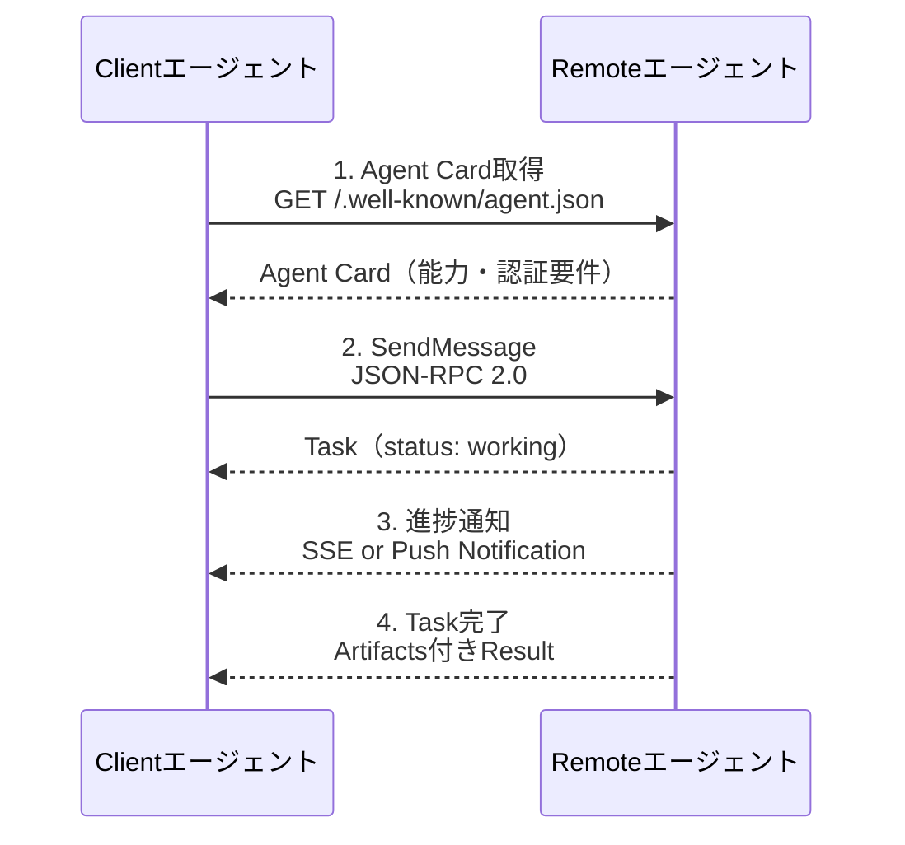
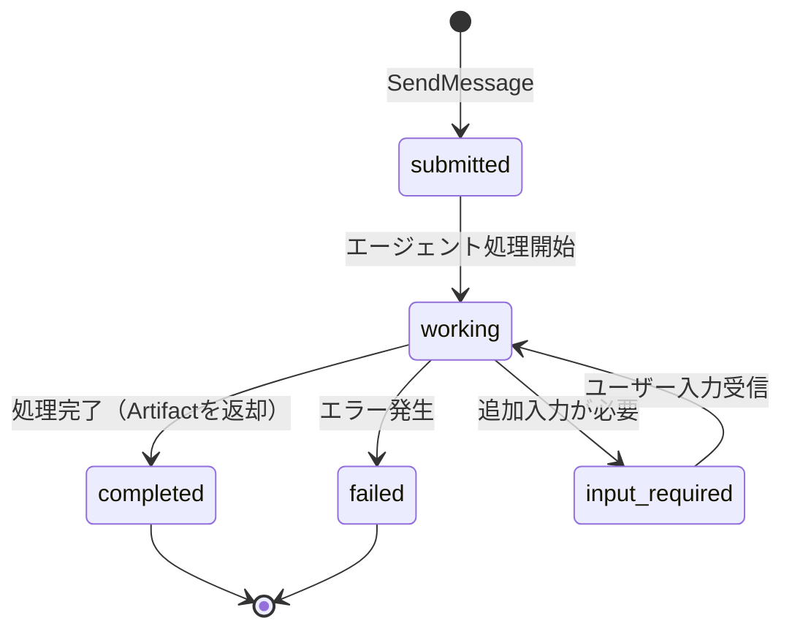

本記事は [Google Developers Blog: Announcing the Agent2Agent Protocol](https://developers.googleblog.com/en/a2a-a-new-era-of-agent-interoperability/) の解説記事です。

## ブログ概要（Summary）

2025年4月、GoogleはAIエージェント間の相互運用性を実現するオープンプロトコル「Agent2Agent（A2A）」を発表した。50社以上のテクノロジーパートナー（Atlassian、Salesforce、SAP、LangChain等）と大手コンサルティングファーム（Accenture、BCG、Deloitte等）の参画のもと、異なるフレームワーク・ベンダーで構築されたエージェントが標準化されたプロトコルで通信する仕組みを提供する。A2AはHTTP、SSE、JSON-RPCといった既存Web標準の上に構築されており、AnthropicのModel Context Protocol（MCP）を補完する位置づけである。

この記事は [Zenn記事: A2A・MCP・ACPで設計するマルチエージェント通信：3層プロトコル実装ガイド](https://zenn.dev/0h_n0/articles/679435133792e7) の深掘りです。

## 情報源

- **種別**: 企業テックブログ
- **URL**: [https://developers.googleblog.com/en/a2a-a-new-era-of-agent-interoperability/](https://developers.googleblog.com/en/a2a-a-new-era-of-agent-interoperability/)
- **組織**: Google Cloud（VP: Rao Surapaneni, Director: Miku Jha, PM: Michael Vakoc, Principal Engineer: Todd Segal）
- **発表日**: 2025年4月9日

## 技術的背景（Technical Background）

### なぜA2Aが必要なのか

Googleのブログでは、エンタープライズ環境において複数のAIエージェントが異なるプラットフォーム上で個別に動作している状況を問題提起している。たとえば、採用ワークフローでは候補者ソーシング・面接スケジューリング・バックグラウンドチェックのそれぞれに専門エージェントが存在するが、これらが相互に通信する標準がなかった。

既存のMCPはエージェントとツール・データソース間の接続（垂直統合）を担うが、エージェント同士の協調作業（水平統合）には対応していない。A2Aはこのギャップを埋めるプロトコルとして設計された。

### MCPとの関係

ブログでは明確に「A2A complements Anthropic's Model Context Protocol (MCP)」と述べている。

- **MCP**: エージェントに「手」を与える — ツール・データソースへの標準化されたアクセス
- **A2A**: エージェントに「言葉」を与える — エージェント間のタスク委譲・協調通信

この2つは競合ではなく、同じマルチエージェントシステム内で共存する関係にある。

## 実装アーキテクチャ（Architecture）

### 5つの設計原則

Googleはブログで以下の5つの設計原則を掲げている。

1. **Embrace agentic capabilities（エージェント能力の尊重）**: エージェントは共有メモリやツールを必要とせず、自然な非構造的モダリティで協調する
2. **Build on existing standards（既存標準の活用）**: HTTP、SSE、JSON-RPCの上に構築し、既存ITインフラとの統合を容易にする
3. **Secure by default（デフォルトセキュア）**: OpenAPI認証スキームと同等のエンタープライズグレード認証・認可を組み込む
4. **Support for long-running tasks（長時間タスク対応）**: 数秒の即時タスクから数時間・数日にわたる調査タスクまで、リアルタイムフィードバック・通知・状態更新を提供する
5. **Modality agnostic（モダリティ非依存）**: テキストだけでなく、音声・映像ストリーミングにも対応する

### コア通信モデル

A2Aプロトコルは**Clientエージェント**と**Remoteエージェント**の2つのロールで構成される。

### Agent Card — エージェントの「デジタル名刺」

Agent CardはJSON形式のメタデータで、`/.well-known/agent.json`エンドポイントで公開される。ブログでは以下の要素が紹介されている。

- **name / description**: エージェントの名前と説明
- **skills**: エージェントが提供するスキル一覧（ID、名前、説明、タグ、例文）
- **capabilities**: 対応機能（ストリーミング、プッシュ通知等）
- **security_schemes**: 認証方式（Bearer token、OAuth 2.0等）
- **input_modes / output_modes**: 対応入出力モダリティ（text、audio、video）

Agent Cardの設計意図は、LLMベースのクライアントがスキルの`examples`を読み取って適切なエージェントを自動選択できるようにすることにある。

### Task管理とライフサイクル

ブログではTaskを「A2A通信の中心」と位置づけている。Taskは以下のライフサイクルを持つ。

即時解決するタスクも、非同期更新を通じて長時間実行するタスクも、同じTaskモデルで管理される。出力は**Artifact**と呼ばれる構造化データとして返却される。

### User Experience Negotiation

ブログで言及されている特徴的な機能として、メッセージ内の**Parts**（フォーマット済みコンテンツ断片）によるUI能力のネゴシエーションがある。エージェント間で画像、iframe、動画、Webフォームなどのコンテンツタイプを交渉し、クライアント側の表示能力に適したフォーマットで結果を返すことができる。

## パフォーマンス最適化（Performance）

ブログでは具体的なベンチマーク数値は公開されていないが、以下のパフォーマンス特性が設計に組み込まれている。

**レイテンシ最適化**:
- HTTP/SSE採用により既存のCDN・ロードバランサーインフラを活用可能
- JSON-RPC 2.0の軽量なメッセージフォーマットにより、プロトコルオーバーヘッドを最小化
- SSEストリーミングにより、長時間タスクでも初回応答レイテンシを低く保てる

**スケーラビリティ**:
- ステートレスなHTTPベースの設計により水平スケーリングが容易
- Agent Cardの`/.well-known/`配置パターンにより、DNSベースのサービスディスカバリと統合可能

**トレードオフ**: A2Aを介したエージェント間通信は、同一プロセス内のフレームワーク内通信（例: LangGraphのノード間通信）と比較して、1リクエストあたり数十ms〜数百msの追加レイテンシが発生する。この点はZenn記事でも言及されている。

## 運用での学び（Production Lessons）

### パートナーエコシステムの規模

ブログ発表時点で50社以上が参画しており、テクノロジーパートナーとサービスパートナーの2カテゴリに分類される。

**テクノロジーパートナー（一部）**:
- **LangChain**: 「共有プロトコルとしてエージェントビルダー・ユーザーのニーズを満たすことに興奮している」（創業者コメント）
- **Salesforce**: 「A2A標準サポートにより、Agentforceと他のエコシステム間でエージェントがシームレスに動作する」
- その他: Atlassian, Box, Cohere, Intuit, MongoDB, PayPal, SAP, ServiceNow等

**サービスパートナー**: Accenture, BCG, Capgemini, Cognizant, Deloitte, HCLTech, KPMG, TCS, Wipro等

### Linux Foundationへの移管

A2Aは2025年のオープンソース公開後、Linux Foundationに移管された。これにより、特定企業のロックインリスクが低減し、コミュニティ主導の仕様策定プロセスが確立された。2026年3月時点ではv1.0 RC仕様が公開され、安定版はv0.3.0である。

### 主要クラウドプロバイダーの統合状況

- **Microsoft**: Azure AI FoundryとCopilot StudioにA2Aサポートを追加予定
- **AWS**: Amazon Bedrock AgentCore RuntimeでA2Aプロトコルサポートを提供
- **Google**: Interactions API表面をA2Aプロトコル表面に直接マッピング

## 学術研究との関連（Academic Connection）

### A2Aの学術的位置づけ

A2Aの設計は、マルチエージェントシステム（MAS）研究の長い歴史に基づいている。特に以下の研究との関連が深い。

- **FIPA ACL（Foundation for Intelligent Physical Agents, 2002）**: エージェント間通信の初期標準。A2AのAgent CardはFIPAのAgent Management System（AMS）の概念を現代化したものと解釈できる
- **Contract Net Protocol（Smith, 1980）**: タスク委譲のプロトコル。A2AのTask概念（submitted → working → completed）は、Contract Netのタスクアナウンス→入札→授与のパターンを簡素化したモデルである
- **arXiv:2505.02279（本サーベイ）**: A2AをMCP・ACP・ANPと並べて比較分析し、Collaboration Layerに位置づけている

### オープンソースフレームワークとの統合

ブログでは、A2AがフレームワークAgnosticであることを強調している。LangGraph、CrewAI、Semantic Kernel等で構築されたエージェントに`AgentExecutor`アダプターを追加するだけでA2A互換化できる。これはZenn記事の`LangGraphA2AExecutor`実装例と直接対応する。

## まとめと実践への示唆

GoogleのA2A発表ブログは、マルチエージェント通信の標準化における重要な転換点を記録している。50社以上の企業参画、Linux Foundationへの移管、主要クラウドプロバイダー3社の統合表明は、A2Aがデファクトスタンダードになりつつあることを示している。

実践的な示唆として、以下の3点が重要である。

1. **今すぐ始められる**: A2A Python SDK（v0.3.x）とAgent Cardの仕様は安定しており、プロトタイプ構築に着手可能
2. **MCPとの共存設計**: A2Aを導入する際はMCPとの2層構成を前提にし、ツールアクセス層とエージェント協調層を明確に分離する
3. **抽象化レイヤーの導入**: 仕様はv1.0 RC段階のため、今後の変更に備えてプロトコル層を抽象化する設計が推奨される

## 参考文献

- **Blog URL**: [https://developers.googleblog.com/en/a2a-a-new-era-of-agent-interoperability/](https://developers.googleblog.com/en/a2a-a-new-era-of-agent-interoperability/)
- **A2A Protocol仕様**: [https://a2a-protocol.org/latest/specification/](https://a2a-protocol.org/latest/specification/)
- **A2A GitHub**: [https://github.com/a2aproject/A2A](https://github.com/a2aproject/A2A)
- **A2A Python SDK**: [https://github.com/a2aproject/a2a-python](https://github.com/a2aproject/a2a-python)
- **Google Cloud Blog - A2A upgrade**: [https://cloud.google.com/blog/products/ai-machine-learning/agent2agent-protocol-is-getting-an-upgrade](https://cloud.google.com/blog/products/ai-machine-learning/agent2agent-protocol-is-getting-an-upgrade)
- **Related Zenn article**: [https://zenn.dev/0h_n0/articles/679435133792e7](https://zenn.dev/0h_n0/articles/679435133792e7)

---

:::message
この記事はAI（Claude Code）により自動生成されました。内容の正確性についてはGoogle Developers Blogの原文で検証していますが、A2A仕様の最新状況は公式サイトもご確認ください。
:::
