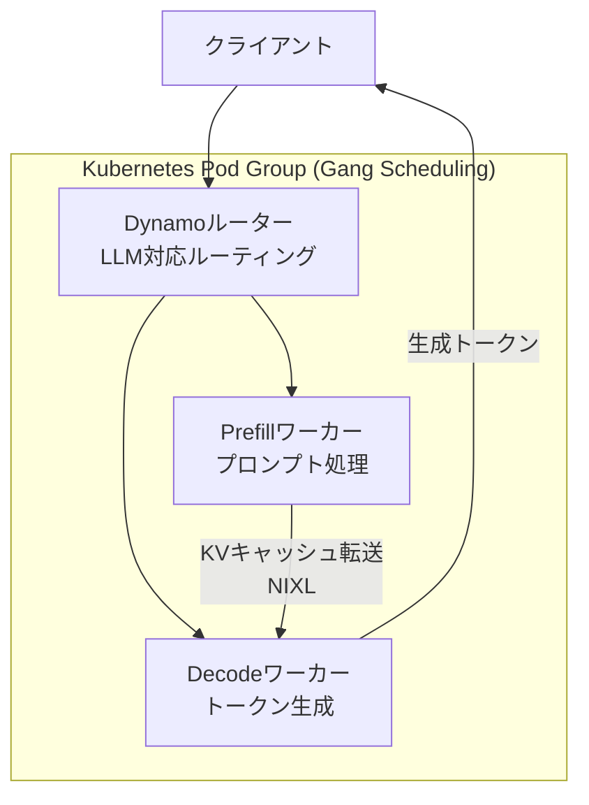
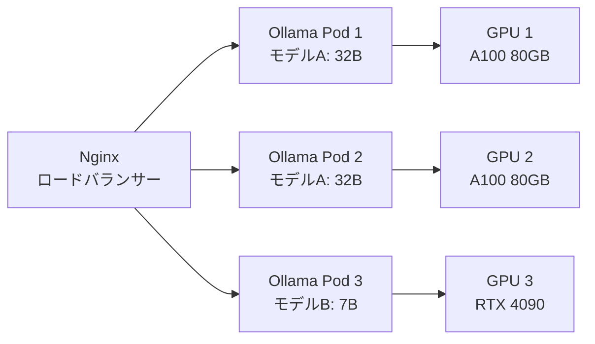

本記事は [Smart Multi-Node Scheduling for Fast and Efficient LLM Inference with NVIDIA Run:ai and NVIDIA Dynamo](https://developer.nvidia.com/blog/smart-multi-node-scheduling-for-fast-and-efficient-llm-inference-with-nvidia-runai-and-nvidia-dynamo)（NVIDIA Developer Blog、2025年9月29日公開）の解説記事です。

## ブログ概要（Summary）

NVIDIAのEkin Karabulut氏らが公開したこの技術ブログは、大規模LLM推論のマルチノードスケジューリングにおける2つの課題—Gangスケジューリングとトポロジ対応配置—をNVIDIA DynamoとRun:ai v2.23の統合で解決する方法を解説している。Dynamoの分離型Prefill/Decode、KVキャッシュルーティング、NIXLライブラリと、Run:aiのアトミックなPod起動およびネットワークトポロジ対応配置を組み合わせることで、マルチノード環境でのLLM推論のスループットとレイテンシを改善する。

この記事は [Zenn記事: Ollama本番運用ガイド：Kubernetes・認証・監視で構築するオンプレLLM基盤](https://zenn.dev/0h_n0/articles/3a91fb8a02cdc4) の深掘りです。Zenn記事ではOllamaの単一GPU構成を中心に解説しているが、70Bクラスのモデルを複数ノードにまたがって推論する場合に必要なスケジューリング技術を本記事で補完する。

## 情報源

- **種別**: 企業テックブログ（NVIDIA Developer）
- **URL**: [https://developer.nvidia.com/blog/smart-multi-node-scheduling-for-fast-and-efficient-llm-inference-with-nvidia-runai-and-nvidia-dynamo](https://developer.nvidia.com/blog/smart-multi-node-scheduling-for-fast-and-efficient-llm-inference-with-nvidia-runai-and-nvidia-dynamo)
- **組織**: NVIDIA
- **著者**: Ekin Karabulut, Oz Bar-Shalom, Julie Adrounie, Anish Maddipoti
- **発表日**: 2025年9月29日

## 技術的背景（Technical Background）

70B以上のLLMをA100 80GBで推論する場合、1枚のGPUにはモデル全体が収まらない。Q4量子化しても約40GBのVRAMが必要であり、KVキャッシュ分を含めると80GBを超える場合がある。Zenn記事の数式で示されている通り、GPUあたりのモデル搭載数は以下で決まる。

$$
N_{\max} = \left\lfloor \frac{V_{\text{GPU}} - V_{\text{system}}}{V_{\text{model}} + V_{\text{KV}}} \right\rfloor
$$

$N_{\max} = 0$となる場合（モデルが1枚のGPUに収まらない場合）、モデルを複数GPUに分割するTensor Parallelism（TP）が必要となる。TPを複数ノードにまたがって適用するには、GPU間の高速通信（NVLink/NVSwitch/InfiniBand）とスケジューリングの協調が不可欠である。

従来のKubernetesスケジューラには、以下の2つの問題がある。

1. **部分デプロイ問題**: 分散推論に必要な複数Pod（ルーター、Prefillワーカー、Decodeワーカー）が一部しか起動しないと、GPUが確保されているのに推論が実行できない
2. **トポロジ非対応**: ノード間通信の帯域幅差（NVLink vs InfiniBand vs Ethernet）を考慮せずにPodを配置すると、GPU間通信がボトルネックになる

## 実装アーキテクチャ（Architecture）

### NVIDIA Dynamoのコンポーネント

ブログで解説されているDynamoのアーキテクチャは、以下のコンポーネントで構成される。



| コンポーネント | 役割 | 特徴 |
|-------------|------|------|
| ルーター | リクエスト分配 | KVキャッシュ再利用を考慮したルーティング |
| Prefillワーカー | プロンプト処理 | 入力トークンの並列処理 |
| Decodeワーカー | トークン生成 | 自己回帰的な逐次生成 |
| NIXL | データ転送 | ノード間KVキャッシュの高速転送ライブラリ |

### 分離型Prefill/Decode

Dynamoの核心技術は、LLM推論の2フェーズ（PrefillとDecode）を分離して異なるGPU群に割り当てることである。

Prefillフェーズはプロンプト全体を並列に処理するため計算集約的（compute-bound）であり、Decodeフェーズはトークンを1つずつ生成するためメモリ帯域集約的（memory-bound）である。両フェーズを同じGPUで実行すると、長いPrefillジョブがDecodeステップをブロックしてしまう。

$$
T_{\text{total}} = T_{\text{prefill}} + \sum_{i=1}^{N} T_{\text{decode}}(i)
$$

分離により、PrefillとDecodeが独立してスケーリングできる。例えば、長いプロンプト（RAGなどで4000トークン以上）が多い環境ではPrefillワーカーを増やし、対話的な応答が中心の環境ではDecodeワーカーを増やすといった柔軟な構成が可能になる。

### KVキャッシュルーティング

ブログによると、DynamoのルーターはKVキャッシュの再利用を考慮してリクエストを振り分ける。同じシステムプロンプトを使う複数のリクエストを同じDecodeワーカーに送ることで、KVキャッシュの再計算を回避する。これはOllamaの`OLLAMA_KEEP_ALIVE`によるモデル常駐と類似の概念だが、KVキャッシュレベルでのより細粒度な最適化である。

## Run:ai v2.23のスケジューリング機能

### Gangスケジューリング

Run:aiは「密結合なコンポーネント（ルーター、Prefill、Decode）をアトミックに起動」するGangスケジューリングを提供する。すべてのPodが同時に起動するか、まったく起動しないかの二者択一となり、部分デプロイによるGPUの無駄遣いを防ぐ。

ブログによると、この機能は以下の問題を解消する。

- **リソースフラグメンテーション**: 部分デプロイされたワークロードがGPUを占有するがサービス不能な状態
- **コールドスタートレイテンシ**: コンポーネントが段階的に起動することによる初期応答遅延
- **デバッグの困難さ**: 一部のPodが起動していない状態の障害切り分け

### トポロジ対応配置

Run:aiのトポロジ対応配置は、管理者が定義したクラスタのネットワークトポロジに基づいて、相互依存するコンポーネントを最適なノードに配置する。

```yaml
metadata:
  annotations:
    kai.scheduler/topology-preferred-placement: "topology.kubernetes.io/zone"
    kai.scheduler/topology: "topology-1"
```

この設定により、PrefillワーカーとDecodeワーカーが同じゾーン（高速インターコネクトで接続されたノード群）に配置され、KVキャッシュ転送のレイテンシが最小化される。

### Kubernetes標準スケジューリングとの比較

| 機能 | Kubernetes標準 | Run:ai v2.23 |
|------|--------------|-------------|
| Pod起動 | 順次起動（リソースがあれば） | アトミック起動（全Pod同時） |
| ノード配置 | nodeSelector/affinity | トポロジ対応配置（NVLink考慮） |
| GPU管理 | nvidia.com/gpuリソース | 細粒度GPU分割（MIG対応） |
| 優先度制御 | PriorityClass | ワークロード優先度＋プリエンプション |
| キュー管理 | なし（Kueue等が必要） | 組み込みキュー管理 |

## Ollamaのマルチノード運用への示唆

### 現在のOllamaの制約

Zenn記事で解説されている通り、Ollamaは単一GPUでの推論を前提としている。Tensor Parallelismは非対応であり、複数GPUを使うにはPodを分離してロードバランシングする必要がある。

しかし、ブログで紹介されているスケジューリングの概念は、Ollamaのマルチノード運用にも応用可能である。

### 応用パターン



1. **モデル別Pod分離**: Zenn記事のNginxモデル別ルーティングを活用し、大型モデルはA100ノード、小型モデルはRTX 4090ノードに振り分ける
2. **Gangスケジューリング的な考え方**: Ollamaではモデルロードに時間がかかるため、`readinessProbe`が通過するまでトラフィックを送らない設計が重要（Zenn記事では`initialDelaySeconds: 30`と設定されている）
3. **ノード配置のトポロジ考慮**: `nodeSelector`でGPUタイプ別にノードを指定し、ネットワーク帯域が十分なノードにPodを配置する

### マルチノード構成のコスト比較

| 構成 | GPU | モデル | 月額概算 | 用途 |
|------|-----|--------|---------|------|
| Ollama × 2 Pod | A100 80GB × 2 | 70B Q4 × 2 | $5,000-8,000 | 冗長化 |
| Ollama × 3 Pod | A100 × 2 + 4090 × 1 | 70B + 7B | $6,000-9,000 | モデル混在 |
| Dynamo分離型 | H100 × 4 | 70B FP16 | $15,000-20,000 | 高スループット |

Ollamaの本番運用では、ブログのDynamo構成のような分離型アーキテクチャは不要であるが、スケーリング時のGangスケジューリング的な考え方（全Podが正常になってからトラフィックを流す）は重要な設計原則である。

## NIXLによるKVキャッシュ転送の技術詳細

NVIDIA Inference Xfer Library（NIXL）は、Dynamoの分離型アーキテクチャを支える高速データ転送ライブラリである。PrefillワーカーがKVキャッシュを生成した後、Decodeワーカーに転送する際のレイテンシを最小化する。

### 転送方式の比較

| 転送方式 | レイテンシ | スループット | CPU負荷 |
|---------|----------|------------|--------|
| CPU経由コピー | 高（ms単位） | 低 | 高 |
| GPUDirect P2P | 低（μs単位） | 高 | なし |
| GPUDirect RDMA（NIXL） | 最低（μs単位） | 最高 | なし |

NIXLはGPUDirect RDMA技術を使用し、送信側GPUのメモリから受信側GPUのメモリへ、CPUを介さずに直接データを転送する。これにより、KVキャッシュの転送時間が推論時間全体に対して無視できるレベルに抑えられる。

### KVキャッシュサイズの見積もり

KVキャッシュのサイズは以下の式で計算される。

$$
S_{\text{KV}} = 2 \times L \times H \times D \times N_{\text{seq}} \times \text{sizeof(dtype)}
$$

ここで、$L$はレイヤー数、$H$はアテンションヘッド数、$D$はヘッド次元、$N_{\text{seq}}$はシーケンス長、dtype sizeは精度（FP16で2バイト、INT8で1バイト）である。

例えば、Llama 3.1 70B（$L=80$、$H=8$（GQA）、$D=128$）でシーケンス長4096のKVキャッシュは以下のサイズになる。

$$
S_{\text{KV}} = 2 \times 80 \times 8 \times 128 \times 4096 \times 2 = 1.34 \text{ GB}
$$

このサイズのデータをノード間で転送する場合、InfiniBand 200Gbps接続で約54ms、NIXLのGPUDirect RDMA最適化により実効30ms程度で転送可能と推定される。

## 学術研究との関連（Academic Connection）

DynamoのPrefill/Decode分離は、Zhong et al.の "[DistServe: Disaggregating Prefill and Decoding for Goodput-optimized Large Language Model Serving](https://arxiv.org/abs/2401.09670)"（OSDI 2024）で提案された分離型サービングの考え方に基づいている。DistServeでは、Prefillのcompute-bound特性とDecodeのmemory-bound特性を活かしたリソース割り当てにより、SLO達成率が向上することが報告されている。

NIXLライブラリによるKVキャッシュ転送は、GPUDirect RDMA技術を活用し、CPU介在なしにGPU間でデータを転送する。これにより、ノード間のKVキャッシュ移行のレイテンシが大幅に削減される。

## まとめと実践への示唆

NVIDIAのこのブログは、マルチノードLLM推論のスケジューリングにおける最先端の手法を紹介している。Zenn記事のOllama運用設計に対する示唆は以下の3点である。

1. **Gangスケジューリングの原則**は、Ollamaの`PodDisruptionBudget`と`readinessProbe`の組み合わせで近似的に実現できる。全Podが正常になるまでトラフィックを流さない設計が重要
2. **トポロジ対応配置**は、GPUノードの`nodeSelector`設定に加えて、Pod Anti-Affinityで異なるノードへの分散配置を行うことで実現できる
3. **Prefill/Decode分離**はOllamaでは不要だが、vLLMへの移行を検討する際の参考となる。Ollamaの同時リクエスト制限（`OLLAMA_NUM_PARALLEL`）が問題になる規模では、分離型アーキテクチャの検討が有効

## 参考文献

- **Blog URL**: [https://developer.nvidia.com/blog/smart-multi-node-scheduling-for-fast-and-efficient-llm-inference-with-nvidia-runai-and-nvidia-dynamo](https://developer.nvidia.com/blog/smart-multi-node-scheduling-for-fast-and-efficient-llm-inference-with-nvidia-runai-and-nvidia-dynamo)
- **Related Papers**: [DistServe: OSDI 2024](https://arxiv.org/abs/2401.09670)
- **NVIDIA Dynamo**: [https://github.com/ai-dynamo/dynamo](https://github.com/ai-dynamo/dynamo)
- **Related Zenn article**: [https://zenn.dev/0h_n0/articles/3a91fb8a02cdc4](https://zenn.dev/0h_n0/articles/3a91fb8a02cdc4)
