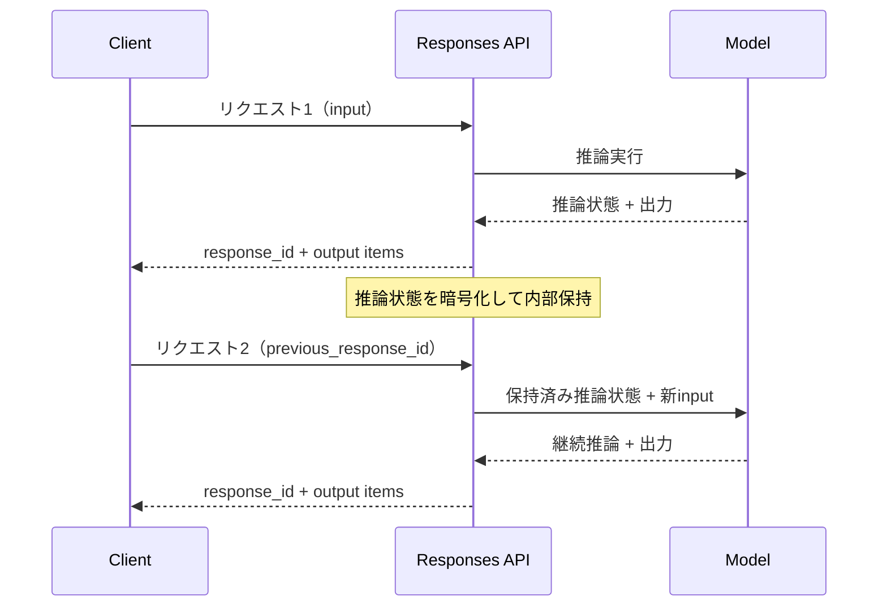

## ブログ概要（Summary）

OpenAIが公開したブログ記事「Why we built the Responses API」では、Chat Completions APIの設計上の制約を克服するためにResponses APIを構築した背景と技術的設計思想が述べられている。推論状態のターン間保持（Reasoning State Preservation）、多態的な出力アイテム（Polymorphic Output Items）、サーバーサイドツール実行（Hosted Tools）など、エージェントアプリケーション構築を意識した複数の設計判断が解説されている。

この記事は [Zenn記事: OpenAI Assistants APIのThread管理とResponses API移行実践ガイド](https://zenn.dev/0h_n0/articles/80554aca49f2ed) の深掘りです。

## 情報源

- **種別**: 企業テックブログ
- **URL**: [https://developers.openai.com/blog/responses-api/](https://developers.openai.com/blog/responses-api/)
- **組織**: OpenAI
- **発表日**: 2025年3月（GPT-5発表と同時期）

## 技術的背景（Technical Background）

### Chat Completions APIの設計上の制約

Chat Completions APIは2023年のリリース以降、LLMアプリケーション構築の標準インタフェースとして広く採用されてきた。しかし、ブログによると、エージェント型アプリケーションの台頭に伴い以下の制約が顕在化した。

**推論状態の破棄**: Chat Completions APIはステートレスな設計であり、各リクエストが独立している。推論モデル（o1、o3等）を使用する場合、ターン間で内部の推論状態（chain-of-thought）が破棄される。ブログでは「探偵のノートブックを毎回閉じてしまう」という比喩で説明されている。

**単一メッセージ出力**: レスポンスの`choices[0].message.content`という構造は、テキスト応答のみを前提とした設計である。推論サマリー、関数呼び出し、テキスト応答が混在するエージェント的なユースケースでは、この構造が制約となる。

**ツール統合の複雑さ**: ファイル検索やコード実行などのツールを利用するには、開発者側でツール実行ループを実装する必要があった。Assistants APIはこの課題に取り組んだが、Threads/Runs/Stepsという複雑な抽象化を導入する結果となった。

Assistants APIはThreads/Messages/Runsという概念を導入したが、過度な抽象化が開発者体験を損なった面がある。Responses APIはChat Completionsのシンプルさを維持しながらエージェント機能を統合する設計を目指したと考えられる。

## 実装アーキテクチャ（Architecture）

### 推論状態保持（Reasoning State Preservation）

推論モデルの内部状態をターン間で保持する仕組みが中核的な設計判断である。



`previous_response_id`パラメータにより、クライアントは前回のレスポンスIDを指定するだけで推論の継続が可能になる。chain-of-thoughtは内部で暗号化されており、クライアントには公開されない。これは安全性の観点から意図的な設計判断であるとブログは述べている。

### Polymorphic Output Items（多態的出力）

Chat Completions APIが`choices[0].message`という単一構造を返すのに対し、Responses APIは型付きアイテムのリストとして出力を返す。

```json
{
  "output": [
    {"type": "reasoning", "summary": [{"type": "summary_text", "text": "..."}]},
    {"type": "message", "content": [{"type": "output_text", "text": "..."}]},
    {"type": "function_call", "name": "get_weather", "arguments": "{...}"}
  ]
}
```

推論サマリー、テキスト応答、関数呼び出しを型安全かつ順序付きで返却できる。ブログではこれを「internally-tagged polymorphism」と表現している。

### previous_response_idとConversations APIの関係

ブログおよびOpenAIのドキュメントによると、マルチターン会話の実現方法は2つある。

1. **previous_response_id**: 直前のレスポンスIDを指定してチェーンする方式。クライアント側のコードがシンプルになる
2. **Conversations API**: サーバーサイドで会話状態を永続化する方式。長期的な会話管理に適する

これらは排他的な関係にあり、同一リクエストで両方を指定することはできない。また、`store: false`を設定するとレスポンスがサーバーに保存されないため、`previous_response_id`による継続も不可能になる点に注意が必要である。

### Hosted Tools（サーバーサイドツール実行）

Responses APIはサーバーサイドでツールを実行する機能を組み込んでいる。ブログによると、以下のツールが利用可能である。

| ツール | 機能 | 特徴 |
|--------|------|------|
| File Search | RAG（検索拡張生成） | アップロードファイルからのベクトル検索 |
| Code Interpreter | コード実行 | サンドボックス環境でのPython実行 |
| Web Search | Web検索 | リアルタイム情報取得 |
| Image Generation | 画像生成 | DALL-E統合 |
| MCP | 外部ツール連携 | Model Context Protocol準拠サーバーとの接続 |

Chat Completions APIでは関数呼び出し結果をクライアント側で処理して再送する必要があったが、Hosted Toolsではサーバーサイドで完結する。

## Production Deployment Guide

Responses APIを用いたエージェントアプリケーションをAWS上でプロダクション運用する場合の実装パターンを示す。

### AWS実装パターン（コスト最適化重視）

**トラフィック量別の推奨構成**:

| 構成 | トラフィック | AWSサービス | 月額コスト概算 |
|------|-------------|-------------|---------------|
| Small | ~100 req/日 | Lambda + DynamoDB + Secrets Manager | $50-150 |
| Medium | ~1,000 req/日 | ECS Fargate + ElastiCache + ALB | $300-800 |
| Large | 10,000+ req/日 | EKS + Karpenter + Spot Instances | $2,000-5,000 |

**注意**: コスト試算は2026年3月時点のAWS東京リージョン料金に基づく概算値。実際のコストはトラフィックパターンやOpenAI API利用量により変動する。

**Small構成の内訳**: Lambda $5 + DynamoDB $10 + Secrets Manager $1 + OpenAI API $30-130。**Large構成の内訳**: EKS $72 + EC2 Spot $300-800 + ElastiCache $200 + ALB $50 + OpenAI API $1,500-4,000。

**コスト削減テクニック**: Spot Instancesで最大90%削減、Reserved Instances（1年）で最大72%削減、`previous_response_id`でキャッシュヒット率40-80%向上（ブログの記載による）、Prompt Cachingで入力トークンコスト30-90%削減。

### Terraformインフラコード

**Small構成（Serverless）** -- 主要リソースの抜粋:

```hcl
# Responses API Agent - Small構成 (Lambda + DynamoDB + Secrets Manager)
terraform {
  required_version = ">= 1.9"
  required_providers {
    aws = { source = "hashicorp/aws", version = "~> 5.80" }
  }
}

provider "aws" { region = "ap-northeast-1" }

# DynamoDB: previous_response_id管理
resource "aws_dynamodb_table" "conversation_state" {
  name         = "responses-api-conversations"
  billing_mode = "PAY_PER_REQUEST"
  hash_key     = "conversation_id"
  range_key    = "response_id"

  attribute { name = "conversation_id"; type = "S" }
  attribute { name = "response_id";     type = "S" }

  ttl { attribute_name = "expires_at"; enabled = true }
  server_side_encryption { enabled = true }
}

# IAMロール: 最小権限（DynamoDB, Secrets Manager, CloudWatch Logsのみ）
resource "aws_iam_role" "lambda_role" {
  name = "responses-api-lambda-role"
  assume_role_policy = jsonencode({
    Version = "2012-10-17"
    Statement = [{ Action = "sts:AssumeRole", Effect = "Allow",
                    Principal = { Service = "lambda.amazonaws.com" } }]
  })
}

# Lambda関数
resource "aws_lambda_function" "handler" {
  function_name = "responses-api-handler"
  runtime       = "python3.12"
  handler       = "handler.lambda_handler"
  role          = aws_iam_role.lambda_role.arn
  timeout       = 30
  memory_size   = 256
  filename      = "lambda_package.zip"
  tracing_config { mode = "Active" }  # X-Ray有効化
}
```

**Large構成（Container）** -- 主要リソースの抜粋:

```hcl
# EKS + Karpenter + Spot Instances
module "eks" {
  source  = "terraform-aws-modules/eks/aws"
  version = "~> 20.31"
  cluster_name    = "responses-api-cluster"
  cluster_version = "1.31"
  vpc_id     = module.vpc.vpc_id
  subnet_ids = module.vpc.private_subnets
  cluster_endpoint_public_access = false
}

# Karpenter: Spot優先の自動スケーリング
resource "kubectl_manifest" "karpenter_nodepool" {
  yaml_body = yamlencode({
    apiVersion = "karpenter.sh/v1"
    kind       = "NodePool"
    metadata   = { name = "responses-api-pool" }
    spec = {
      template = { spec = { requirements = [
        { key = "karpenter.sh/capacity-type", operator = "In",
          values = ["spot", "on-demand"] },
        { key = "node.kubernetes.io/instance-type", operator = "In",
          values = ["m6i.large", "m6i.xlarge", "m7i.large", "m7i.xlarge"] }
      ] } }
      limits     = { cpu = "100", memory = "400Gi" }
      disruption = { consolidationPolicy = "WhenEmptyOrUnderutilized",
                     consolidateAfter = "30s" }
    }
  })
}

# AWS Budgets: 月額$5,000超過で80%アラート
resource "aws_budgets_budget" "monthly" {
  name         = "responses-api-monthly"
  budget_type  = "COST"
  limit_amount = "5000"
  limit_unit   = "USD"
  time_unit    = "MONTHLY"
  notification {
    comparison_operator        = "GREATER_THAN"
    threshold                  = 80
    threshold_type             = "PERCENTAGE"
    notification_type          = "ACTUAL"
    subscriber_email_addresses = ["ops@example.com"]
  }
}
```

### 運用・監視設定

**CloudWatch Logs Insights クエリ**:

```
# OpenAI API呼び出しのレイテンシ分析
fields @timestamp, @message
| filter @message like /responses_api_call/
| stats avg(duration_ms) as avg_latency,
        pct(duration_ms, 95) as p95_latency,
        pct(duration_ms, 99) as p99_latency,
        count(*) as total_calls
  by bin(1h)
| sort @timestamp desc

# キャッシュヒット率の監視
fields @timestamp, @message
| filter @message like /cache_hit/
| stats sum(case when cache_hit = 1 then 1 else 0 end) / count(*) * 100
        as cache_hit_rate
  by bin(1h)
```

**CloudWatch アラーム設定（Python）**:

```python
import boto3

cloudwatch = boto3.client("cloudwatch", region_name="ap-northeast-1")

def create_latency_alarm(function_name: str) -> dict:
    """OpenAI API呼び出しのレイテンシ異常検知アラームを作成する"""
    return cloudwatch.put_metric_alarm(
        AlarmName=f"{function_name}-high-latency",
        MetricName="Duration", Namespace="AWS/Lambda",
        Statistic="Average", Period=300, EvaluationPeriods=3,
        Threshold=10000,  # 10秒
        ComparisonOperator="GreaterThanThreshold",
        Dimensions=[{"Name": "FunctionName", "Value": function_name}],
        AlarmActions=["arn:aws:sns:ap-northeast-1:ACCOUNT:ops-alerts"],
    )
```

**X-Ray トレーシング設定（Python）**:

```python
from aws_xray_sdk.core import xray_recorder, patch_all
patch_all()  # boto3, requests等を自動計装

def trace_responses_api_call(previous_response_id: str | None, model: str):
    """Responses API呼び出しをX-Rayでトレースする"""
    subsegment = xray_recorder.begin_subsegment("openai_responses_api")
    subsegment.put_annotation("model", model)
    subsegment.put_annotation("has_previous", previous_response_id is not None)
    return subsegment
```

**Cost Explorer自動レポート（Python）**:

```python
import boto3, json
from datetime import datetime, timedelta

ce = boto3.client("ce", region_name="us-east-1")
sns = boto3.client("sns", region_name="ap-northeast-1")

def get_daily_cost_report() -> dict:
    """日次コストレポートを取得し$100/日超過でSNS通知する"""
    end = datetime.utcnow().strftime("%Y-%m-%d")
    start = (datetime.utcnow() - timedelta(days=1)).strftime("%Y-%m-%d")
    response = ce.get_cost_and_usage(
        TimePeriod={"Start": start, "End": end}, Granularity="DAILY",
        Metrics=["UnblendedCost"],
        Filter={"Tags": {"Key": "Project", "Values": ["responses-api-agent"]}},
        GroupBy=[{"Type": "DIMENSION", "Key": "SERVICE"}],
    )
    total = sum(float(g["Metrics"]["UnblendedCost"]["Amount"])
                for r in response["ResultsByTime"] for g in r["Groups"])
    if total > 100:
        sns.publish(TopicArn="arn:aws:sns:ap-northeast-1:ACCOUNT:cost-alerts",
                    Subject=f"Cost Alert: ${total:.2f}/day",
                    Message=json.dumps({"date": start, "total_usd": total}))
    return {"date": start, "total_usd": round(total, 2)}
```

### コスト最適化チェックリスト

| カテゴリ | チェック項目 |
|----------|-------------|
| アーキテクチャ | トラフィック量で構成選択（Serverless/Hybrid/Container） |
| アーキテクチャ | 同期/非同期パターンの選択 |
| リソース最適化 | EC2/EKS: Spot Instances優先（最大90%削減） |
| リソース最適化 | Reserved Instances 1年コミット（最大72%削減） |
| リソース最適化 | Savings Plans検討 |
| リソース最適化 | Lambda メモリ256-512MB最適化 |
| リソース最適化 | Karpenterでアイドル時スケールダウン |
| リソース最適化 | ElastiCache TTL適正設定 |
| LLMコスト | `previous_response_id`でキャッシュヒット率向上 |
| LLMコスト | Prompt Caching有効化（30-90%削減） |
| LLMコスト | モデル選択ロジック（gpt-4o-mini/o3使い分け） |
| LLMコスト | `max_output_tokens`でトークン制限 |
| LLMコスト | 不要なHosted Tools無効化 |
| 監視 | AWS Budgets（80%/100%閾値） |
| 監視 | CloudWatch アラーム設定 |
| 監視 | Cost Anomaly Detection有効化 |
| 監視 | 日次Cost Explorerレポート |
| リソース管理 | 未使用リソース削除 |
| リソース管理 | `Project`/`Env`タグ戦略 |
| リソース管理 | DynamoDB TTLで自動削除 |
| リソース管理 | CloudWatch Logs保持期間30日 |
| リソース管理 | 開発環境の夜間停止 |

## パフォーマンス最適化（Performance）

### TAUBenchでの性能改善

ブログによると、GPT-5をResponses API経由で統合した場合、Chat Completions APIと比較してTAUBenchで5%のスコア改善が確認されたとのことである。TAUBenchはツール利用能力を評価するベンチマークであり、この改善は推論状態保持の効果によるものとブログは説明している。

### キャッシュ利用率の向上

ブログの記載では、Chat Completions APIと比較して40-80%のキャッシュ利用率向上が内部テストで確認されたとされている。このメカニズムは以下のように理解できる。

Chat Completions APIではマルチターン会話で毎回全履歴を送信するため、メッセージ差分がキャッシュプレフィックスの不一致を引き起こす。Responses APIでは`previous_response_id`でサーバーサイドにコンテキストを保持し、入力トークンのプレフィックスが安定するためKVキャッシュヒット率が向上する。

$$
\text{Cost Reduction} \approx \text{Cache Hit Rate} \times \text{Input Token Cost}
$$

ここで、Cache Hit Rateが40-80%改善することで、マルチターン会話における入力トークンコストが大幅に削減される。

## 運用での学び（Production Lessons）

### API移行時の注意点

Responses APIへの移行を行う場合、以下の点に注意が必要である。

**conversationとprevious_response_idの排他性**: Conversations APIによるサーバーサイド会話管理と、`previous_response_id`による手動チェーンは排他的に動作する。同一リクエストで両方を指定するとエラーとなるため、アプリケーション設計時にどちらの方式を採用するかを事前に決定する必要がある。

**store: falseの副作用**: `store: false`を設定するとレスポンスがOpenAIのサーバーに保存されなくなる。これはプライバシー要件では有用だが、`previous_response_id`による継続が不可能になるため、推論状態保持の恩恵を受けられなくなる。キャッシュ利用率の向上も失われる点をトレードオフとして認識すべきである。

**レスポンス構造の変更**: `choices[0].message.content`依存のコードは`output`アイテムリスト構造に書き換えが必要。SDKの`response.output_text`ヘルパーで簡易取得も可能だが、関数呼び出しや推論サマリーを扱う場合は型分岐処理が求められる。

```python
from openai import OpenAI
from openai.types.responses import ResponseOutputMessage, ResponseFunctionToolCall

client = OpenAI()

def process_response(response) -> None:
    """Responses APIのポリモーフィック出力を処理する

    Args:
        response: OpenAI Responses APIのレスポンスオブジェクト
    """
    for item in response.output:
        if isinstance(item, ResponseOutputMessage):
            print(f"Message: {item.content[0].text}")
        elif isinstance(item, ResponseFunctionToolCall):
            print(f"Function call: {item.name}({item.arguments})")
```

### ストリーミングイベントの設計

ブログによると、Responses APIはセマンティックなストリーミングイベントを採用している。Chat Completions APIが`delta`としてトークンを逐次送信するのに対し、`response.output_item.added`や`response.content_part.delta`など意味的に明確なイベントが送信され、ストリーム処理が単純化される。

## 学術研究との関連（Academic Connection）

### KVキャッシュ管理の研究

Responses APIの推論状態保持は、LLM推論におけるKVキャッシュ管理研究と関連している。サーベイ論文（arXiv:2412.19442）ではKVキャッシュ最適化をトークン・モデル・システムレベルに分類しており、`previous_response_id`による状態保持はシステムレベルの最適化に該当する。SnapKVやMorphKVといった選択的KVキャッシュ保持手法と設計思想を共有し、重要なキー・バリューペアの保持でメモリ効率と推論品質を両立する。

vLLMのPagedAttentionなどのOSS推論エンジンでも同様の課題が研究されており、Responses APIはこれらの知見をマネージドサービスとして提供している。

## まとめと実践への示唆

OpenAIのブログ「Why we built the Responses API」は、Chat Completions APIからResponses APIへの設計進化の技術的根拠を示している。推論状態保持によるTAUBench 5%改善やキャッシュ利用率40-80%向上（いずれもブログの記載による数値）は、エージェント型アプリケーションにおけるAPI設計の重要性を示唆している。

マルチターン推論では`previous_response_id`の活用がコスト・性能両面で有利である。一方、`store: false`とのトレードオフや設計上の制約を理解した上での採用判断が求められる。Chat Completions APIは引き続きサポートされるため、即時移行は必須ではないとブログは述べている。

## 参考文献

- **Blog URL**: [Why we built the Responses API - OpenAI Developers](https://developers.openai.com/blog/responses-api/)
- **Migration Guide**: [Migrate to the Responses API - OpenAI](https://developers.openai.com/api/docs/guides/migrate-to-responses/)
- **API Comparison**: [Responses vs Chat Completions - OpenAI](https://platform.openai.com/docs/guides/responses-vs-chat-completions)
- **KV Cache Survey**: [A Survey on Large Language Model Acceleration based on KV Cache Management (arXiv:2412.19442)](https://arxiv.org/abs/2412.19442)
- **Related Zenn article**: [OpenAI Assistants APIのThread管理とResponses API移行実践ガイド](https://zenn.dev/0h_n0/articles/80554aca49f2ed)
