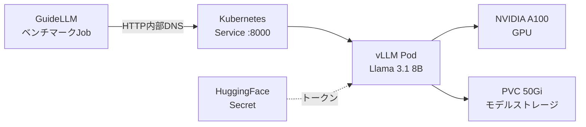

本記事は [How to deploy and benchmark vLLM with GuideLLM on Kubernetes](https://developers.redhat.com/articles/2025/12/24/how-deploy-and-benchmark-vllm-guidellm-kubernetes)（Red Hat Developer、2025年12月24日公開）の解説記事です。

## ブログ概要（Summary）

Red Hat DeveloperのHarshith Umesh氏が公開したこの技術ブログは、LLM推論エンジンvLLMをKubernetes（OpenShift）上にデプロイし、GuideLLMというベンチマークツールを使って本番環境での推論性能を定量的に評価する手順を解説している。vLLMのPagedAttentionによるメモリ効率化、GPUリソースの宣言的割り当て、PersistentVolumeClaimによるモデル永続化、そしてGuideLLMの同時実行ベンチマークによるTTFT（Time to First Token）やITL（Inter-Token Latency）の計測方法が網羅されている。

この記事は [Zenn記事: Ollama本番運用ガイド：Kubernetes・認証・監視で構築するオンプレLLM基盤](https://zenn.dev/0h_n0/articles/3a91fb8a02cdc4) の深掘りです。Zenn記事ではOllamaをKubernetesにデプロイする構成を解説しているが、本記事ではその比較対象であるvLLMのKubernetesデプロイ手法と性能計測手法を詳しく取り上げる。

## 情報源

- **種別**: 企業テックブログ（Red Hat Developer）
- **URL**: [https://developers.redhat.com/articles/2025/12/24/how-deploy-and-benchmark-vllm-guidellm-kubernetes](https://developers.redhat.com/articles/2025/12/24/how-deploy-and-benchmark-vllm-guidellm-kubernetes)
- **組織**: Red Hat
- **著者**: Harshith Umesh
- **発表日**: 2025年12月24日（最終更新: 2026年1月6日）

## 技術的背景（Technical Background）

Zenn記事で解説したOllamaは、シンプルなセットアップと開発者フレンドリーなAPIが特徴だが、[Red Hatのベンチマーク](https://developers.redhat.com/articles/2025/08/08/ollama-vs-vllm-deep-dive-performance-benchmarking)によると同時リクエスト数が増加するとスループットが頭打ちになる傾向がある。一方、vLLMはPagedAttentionによるKVキャッシュのページング管理を採用し、高い同時実行性能を実現している。

しかし、vLLMを本番環境で運用するには、Kubernetes上での適切なデプロイ構成とGPUリソース管理が不可欠である。さらに、「本番環境で実際にどの程度の性能が出るのか」を定量的に計測する手法も必要になる。このブログはその両方をカバーしている点で、Ollamaの本番運用を検討するエンジニアにとって重要な比較材料となる。

## 実装アーキテクチャ（Architecture）

### システム構成

ブログで解説されているデプロイアーキテクチャは以下の3コンポーネントで構成される。



| コンポーネント | 役割 | 設定詳細 |
|-------------|------|---------|
| vLLM Pod | LLM推論サーバー | `vllm/vllm-openai:v0.11.2`、ポート8000 |
| PVC | モデルウェイト永続化 | 50Gi、RWO（単一レプリカ）またはRWX（複数レプリカ） |
| GuideLLM Job | ベンチマーク実行 | `ghcr.io/vllm-project/guidellm:v0.5.0` |
| GPU Operator | GPUドライバ管理 | NVIDIA GPU Operator |

### vLLMデプロイメントの主要設定

ブログでは、以下のKubernetesマニフェストでvLLMをデプロイしている。

```yaml
apiVersion: apps/v1
kind: Deployment
metadata:
  name: vllm-llama-8b
  namespace: vllm-inference
spec:
  replicas: 1
  template:
    spec:
      serviceAccountName: vllm-sa
      containers:
        - name: vllm
          image: vllm/vllm-openai:v0.11.2
          args:
            - "--model"
            - "meta-llama/Llama-3.1-8B-Instruct"
            - "--max-model-len"
            - "2048"
            - "--tensor-parallel-size"
            - "1"
          env:
            - name: HUGGING_FACE_HUB_TOKEN
              valueFrom:
                secretKeyRef:
                  name: huggingface-secret
                  key: hf_token
          resources:
            limits:
              nvidia.com/gpu: 1
          volumeMounts:
            - name: model-cache
              mountPath: /root/.cache/huggingface
            - name: dshm
              mountPath: /dev/shm
      volumes:
        - name: model-cache
          persistentVolumeClaim:
            claimName: vllm-model-pvc
        - name: dshm
          emptyDir:
            medium: Memory
```

**注目すべき設計判断**:

1. **`/dev/shm`のemptyDir**: vLLMはPyTorchのマルチプロセス共有メモリを使用するため、`/dev/shm`をメモリバックドのemptyDirとしてマウントしている。これを省略するとGPU間通信でエラーが発生する。

2. **`--max-model-len 2048`**: コンテキスト長をモデルの最大値（Llama 3.1は128K対応）より短く制限することで、KVキャッシュのメモリ使用量を抑制している。本番環境では用途に応じて調整が必要。

3. **PVCのStorageClass選択**: 単一レプリカなら`ReadWriteOnce`（RWO）で十分だが、複数レプリカでモデルキャッシュを共有する場合は`ReadWriteMany`（RWX）対応のNFSやCephFSが必要になる。Zenn記事のOllama構成でも同様の判断が必要になる。

### ストレージ戦略の比較

ブログで紹介されているストレージ選択は、Zenn記事のOllama PersistentVolume設計と直接比較できる。

| 項目 | vLLM（本ブログ） | Ollama（Zenn記事） |
|------|-----------------|-------------------|
| ストレージサイズ | 50Gi（8Bモデル） | 200Gi（70Bモデル） |
| アクセスモード | RWO/RWX選択可 | ReadWriteOnce |
| StorageClass | lvms-vg1, nfs-client等 | local-ssd |
| モデル取得方法 | HuggingFace Hub API | InitContainer pull |

## パフォーマンス最適化（Performance）

### GuideLLMによるベンチマーク手法

ブログの中核は、GuideLLMを使った本番環境での性能計測手法である。GuideLLMはvLLMプロジェクトが提供するベンチマークツールで、同時実行レベルを段階的に変化させながら推論性能を計測する。

```yaml
apiVersion: batch/v1
kind: Job
metadata:
  name: guidellm-benchmark-job
  namespace: vllm-inference
spec:
  template:
    spec:
      containers:
        - name: guidellm
          image: ghcr.io/vllm-project/guidellm:v0.5.0
          args:
            - "benchmark"
            - "run"
            - "--target"
            - "http://vllm-service.vllm-inference.svc.cluster.local:8000"
            - "--model"
            - "meta-llama/Llama-3.1-8B-Instruct"
            - "--rate-type"
            - "concurrent"
            - "--rate"
            - "1,2,4"
            - "--max-seconds"
            - "300"
            - "--data"
            - "prompt_tokens=1000,output_tokens=1000"
```

**ベンチマークパラメータの意味**:

- `--rate-type concurrent`: 同時リクエスト数制御モード（本番トラフィックをシミュレート）
- `--rate 1,2,4`: 同時1、2、4ユーザーの3段階で計測
- `--max-seconds 300`: 各段階で300秒（5分）のウォームアップ＋計測
- `--data prompt_tokens=1000,output_tokens=1000`: 合成データで入力1000トークン、出力1000トークンを生成

### 計測される性能指標

GuideLLMは5種類の分析テーブルを生成する。

| 指標カテゴリ | 主要メトリクス | Ollamaとの比較観点 |
|------------|-------------|------------------|
| リクエストレイテンシ | E2Eレイテンシ（中央値、P95） | Ollamaの`ollama_request_duration_seconds`に相当 |
| TTFT | 最初のトークンまでの時間 | Ollamaでは計測困難（ollama-metricsでは未提供） |
| ITL | トークン間レイテンシ | ストリーミング応答の品質指標 |
| TPOT | トークンあたりの生成時間 | Ollamaの`ollama_time_per_token_seconds`に相当 |
| スループット | tokens/second（入力・出力・合計） | Ollamaの`ollama_generated_tokens_total`のrate |

**ブログで強調されている重要な注意点**: ベンチマークはKubernetes内部DNSを使用し、外部ルート（Ingress経由）ではなくクラスタ内サービスに直接接続すべきとされている。これにより「外部ネットワークレイテンシやIngress処理のオーバーヘッドが計測結果を歪めることを防ぐ」ためである。

$$
\text{E2E Latency} = T_{\text{network}} + T_{\text{queue}} + T_{\text{prefill}} + T_{\text{decode}} \times N_{\text{tokens}}
$$

ここで、$T_{\text{network}}$はネットワーク転送時間、$T_{\text{queue}}$はキュー待ち時間、$T_{\text{prefill}}$はプリフィル処理時間、$T_{\text{decode}}$は1トークンあたりのデコード時間、$N_{\text{tokens}}$は出力トークン数である。内部DNS経由での計測では$T_{\text{network}}$を最小化できる。

### TTFTとITLの実用的意義

TTFT（Time to First Token）とITL（Inter-Token Latency）は、ユーザー体験に直結する指標である。

$$
\text{TTFT} = T_{\text{queue}} + T_{\text{prefill}}
$$

$$
\text{ITL} = \frac{1}{N_{\text{output}} - 1} \sum_{i=2}^{N_{\text{output}}} (t_i - t_{i-1})
$$

TTFTが大きいと、ユーザーは「応答が始まるまで待たされる」と感じる。ITLが不安定だと、ストリーミング表示がカクつく。Ollamaのollama-metricsではこれらの指標が提供されていないため、vLLM+GuideLLMの組み合わせは本番環境での性能評価において優位性がある。

## 運用での学び（Production Lessons）

### Ollamaとの実践的な比較

本ブログの構成は、Zenn記事のOllamaデプロイ構成と以下の点で異なる。

| 観点 | vLLM（本ブログ） | Ollama（Zenn記事） |
|------|-----------------|-------------------|
| モデル取得 | HuggingFace Hub APIで自動ダウンロード | InitContainerでpull |
| GPU指定 | `nvidia.com/gpu: 1`のみ | `nvidia.com/gpu: 1` + nodeSelector |
| ヘルスチェック | デフォルトポート8000 | httpGet `/` on 11434 |
| 認証 | なし（別途Ingress設定） | Nginx Bearer Token |
| 監視 | Prometheusメトリクス内蔵 | ollama-metrics Exporter必要 |
| ベンチマーク | GuideLLM統合 | ツールなし（手動ab等） |

### ベンチマーク結果の取得方法

ブログでは、ベンチマーク結果をPVCに保存し、ヘルパーPodを使って取り出す方法が紹介されている。

```bash
# ヘルパーPodでPVCをマウントし、結果ファイルをコピー
oc run helper --image=busybox --restart=Never \
  --overrides='{"spec":{"containers":[{"name":"helper","image":"busybox","command":["sleep","3600"],"volumeMounts":[{"name":"results","mountPath":"/results"}]}],"volumes":[{"name":"results","persistentVolumeClaim":{"claimName":"guidellm-results-pvc"}}]}}'

oc cp helper:/results/benchmark-results.json ./benchmark-results.json
oc cp helper:/results/benchmark-results.html ./benchmark-results.html
```

この手法は、Kubernetes上でのベンチマーク結果収集の一般的なパターンであり、Ollamaの性能検証にも応用できる。

### エンタープライズ向けの選択肢

ブログの末尾では、エンタープライズ本番環境向けにRed Hat AI Inference Server（vLLMのサポート付きバリアント）とRed Hat OpenShift AI（フルMLOpsプラットフォーム）が推奨されている。これはOllamaにはないエンタープライズサポートの選択肢であり、SLAが求められる環境では検討に値する。

## 学術研究との関連（Academic Connection）

本ブログの技術基盤であるvLLMは、Kwon et al.の論文 "[Efficient Memory Management for Large Language Model Serving with PagedAttention](https://arxiv.org/abs/2309.06180)"（SOSP 2023）に基づいている。この論文ではOSの仮想メモリページングに着想を得たPagedAttentionが提案され、KVキャッシュのメモリフラグメンテーションを解消することで、FasterTransformerやOrcaと比較して2〜4倍のスループット向上が報告されている。

GuideLLMが計測するTTFTやITLといった指標は、LLMサービングの研究において標準的な評価基準となっている。特にMLPerf Inference 5.1（2025年9月）では、vLLMがLlama 3.1 8Bのリファレンス実装として採用されており、業界標準ベンチマークとしての地位を確立している。

## まとめと実践への示唆

Red Hatのこのブログは、vLLMのKubernetesデプロイとGuideLLMによるベンチマーク手法を体系的にまとめた実践的なガイドである。Zenn記事でOllamaの本番運用を検討するエンジニアにとって、以下の3つの示唆がある。

1. **vLLMのKubernetesデプロイはOllamaと類似の構成**で実現でき、GPUリソース宣言やPVC設計のパターンはそのまま応用可能
2. **GuideLLMのようなベンチマークツール**を使うことで、TTFT・ITL・同時実行性能を定量的に評価でき、OllamaとvLLMの選定判断に客観的データを提供できる
3. **Kubernetes内部DNSでの計測**が重要であり、Ingress経由のベンチマークは本番性能を正確に反映しない

Ollamaの本番運用設計においても、同様のベンチマーク手法を適用し、自組織のワークロードでの実測値に基づいた意思決定を行うことが推奨される。

## 参考文献

- **Blog URL**: [https://developers.redhat.com/articles/2025/12/24/how-deploy-and-benchmark-vllm-guidellm-kubernetes](https://developers.redhat.com/articles/2025/12/24/how-deploy-and-benchmark-vllm-guidellm-kubernetes)
- **Related Papers**: [Efficient Memory Management for LLM Serving with PagedAttention (arXiv:2309.06180)](https://arxiv.org/abs/2309.06180)
- **GuideLLM Repository**: [https://github.com/vllm-project/guidellm](https://github.com/vllm-project/guidellm)
- **Related Zenn article**: [https://zenn.dev/0h_n0/articles/3a91fb8a02cdc4](https://zenn.dev/0h_n0/articles/3a91fb8a02cdc4)
