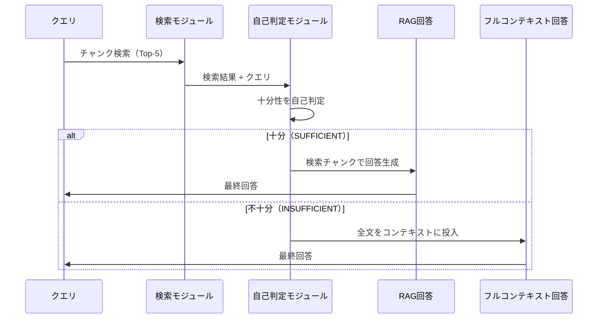

本記事は [arXiv:2407.16833 "SELF-ROUTE: Refine Large Language Model-based Document Retrieval with Self-Route"](https://arxiv.org/abs/2407.16833) の解説記事です。

## 論文概要（Abstract）

SELF-ROUTEは、LLMが検索されたチャンクの十分性を自己判定し、十分であればRAGで回答、不十分であればフルコンテキスト方式にフォールバックする手法である。著者ら（Shengding Hu, Yifan Luo, Huadong Wang, Xingyi Cheng, Zhiyuan Liu, Maosong Sun）は、すべてのクエリに一律にRAGまたはフルコンテキストを適用するのではなく、クエリごとに最適な処理方式を動的に選択することで、**フルコンテキスト方式と同等の性能を維持しながら計算コストを50-75%削減**することを報告している。

この記事は [Zenn記事: RAG vs ロングコンテキスト：1Mトークン時代の最適な使い分けと判断フレームワーク](https://zenn.dev/0h_n0/articles/0f09fc0a93ea15) の深掘りです。

## 情報源

- **arXiv ID**: 2407.16833
- **URL**: [https://arxiv.org/abs/2407.16833](https://arxiv.org/abs/2407.16833)
- **著者**: Shengding Hu, Yifan Luo, Huadong Wang et al.（清華大学）
- **発表年**: 2024
- **分野**: cs.CL

## 背景と動機（Background & Motivation）

LLMのコンテキストウィンドウ拡大（Claude-3: 200K, Gemini 1.5: 1M）により、文書全体をコンテキストに投入する「フルコンテキスト方式」が可能になった。しかし、100Kトークンの処理は1Kトークンの約100倍のコストがかかる（Transformerの2次Attention複雑度に起因）。

一方、RAG（検索ベース方式）は1K〜4Kトークンのみを処理するため効率的だが、チャンク分割時の情報損失という構造的な問題を抱えている。著者らは「すべてのクエリと文書が検索ベース方式に適しているわけではない」という根本的な課題を指摘し、クエリごとに最適な方式を選択するSELF-ROUTEを提案している。

## 主要な貢献（Key Contributions）

- **貢献1**: 検索の有用性（retrieval usability）の分析 — どのようなクエリで検索が有効/不十分かを定量化
- **貢献2**: SELF-ROUTE手法の提案 — LLMの自己判定に基づくRAG/フルコンテキストの動的ルーティング
- **貢献3**: InfinityBenchとMuSiQueでの包括的な実験評価

## 技術的詳細（Technical Details）

### 検索有用性の分析

著者らはまず、InfinityBench（60K〜200Kトークン文書）とMuSiQue（マルチホップQA）で検索の有効性を分析している。

**4つの知見**:
1. **単一ホップクエリでは検索が有効**: Top-5チャンクで90%以上のケースで関連コンテキストを捕捉
2. **マルチホップ推論では検索が困難**: 成功率が大幅に低下（非連続的なセクションの統合が必要）
3. **文書構造が検索有効性に影響**: 技術文書・百科事典のような情報密度の高い文書は困難
4. **LLMは検索の十分性を自己評価できる**: LLMの自己評価と実際の検索成功率が相関

### SELF-ROUTEのアーキテクチャ



**3つのコンポーネント**:

1. **検索モジュール**: 文書をチャンク化（200トークン、50%オーバーラップ）、BM25/BGE/Hybridで検索、Top-kチャンクを取得
2. **自己判定モジュール**: LLMが検索チャンクを読み、クエリに対して十分な情報が含まれているかを判定
3. **ルーティング決定**: 十分 → RAG回答を使用、不十分 → フルコンテキストにフォールバック

### 自己判定プロンプト

```text
Here are some retrieved chunks for answering the question:
[Retrieved Chunks]

Question: [Query]

Can you answer the question based on the retrieved chunks?
If yes, provide the answer.
If not, output "Need more context."
```

このプロンプト設計の特徴は、LLMに**回答の生成と十分性の判定を同時に行わせる**点にある。「Need more context」が出力された場合のみフルコンテキストにフォールバックするため、追加のルーティングモデルが不要である。

### パラメータ設定

| パラメータ | 値 | 根拠 |
|----------|-----|------|
| チャンクサイズ | 200トークン | アブレーションで最適（100/200/400比較） |
| オーバーラップ | 100トークン（50%） | チャンク境界での情報損失を緩和 |
| Top-k | 5 | 性能とコストのバランス（k=3/5/10比較） |
| 検索手法 | Hybrid（BM25 + BGE） | 最高性能（BM25/BGE/Hybrid比較） |

## 実験結果（Results）

### 主要な性能比較

**InfinityBenchでの結果**（論文Table 1より）：

| 手法 | En.QA (F1) | En.MC (Acc) | En.Dia (Acc) | 平均トークン数 |
|------|-----------|------------|-------------|-------------|
| 検索のみ | 19.8 | 54.0 | 36.3 | ~4K |
| フルコンテキスト | 22.4 | 61.2 | 39.8 | ~100K |
| SELF-ROUTE | 21.9 | 60.8 | 39.2 | **~28K** |

**MuSiQueでの結果**（論文Table 2より）：

| 手法 | F1 | Accuracy | 平均トークン数 |
|------|-----|---------|-------------|
| 検索のみ | 45.2 | 38.1 | ~8K |
| フルコンテキスト | 55.7 | 47.3 | ~32K |
| SELF-ROUTE | 54.9 | 46.8 | **~19K** |

著者らの報告では、SELF-ROUTEはフルコンテキスト方式に対して**0.5〜1%以内の精度差**で、**50-75%のトークン処理量削減**を達成している。

### ルーティング分布

論文Table 3で報告されているルーティング分布は、タスクの複雑さに応じた適切なルーティングを示している：

| データセット | 検索ルート | フルコンテキストルート |
|-----------|----------|-----------------|
| En.QA（単一ホップ） | 68.4% | 31.6% |
| En.MC（選択式） | 75.2% | 24.8% |
| En.Dia（対話理解） | 45.3% | 54.7% |
| MuSiQue（マルチホップ） | 41.7% | 58.3% |

単純な単一ホップタスクでは約70%がRAGで処理され、複雑なマルチホップや対話理解タスクではフルコンテキストへのルーティングが増加している。

### 自己判定の精度

論文Table 4で報告されているモデル別の自己判定精度：

| モデル | Precision | Recall | F1 |
|--------|----------|--------|-----|
| Claude-3-Haiku | 83.2 | 79.5 | 81.3 |
| GPT-4o-mini | 80.7 | 76.8 | 78.7 |
| Qwen-2 | 77.3 | 72.1 | 74.6 |

著者らは「高いPrecisionが望ましい」と述べている。不必要にフルコンテキストにフォールバックするコスト増加よりも、検索不十分な状態で不正確な回答を返すリスクのほうが大きいためである。

### アブレーション結果

**Top-k チャンク数の影響**（論文より）：

| k | En.QA F1 | 平均トークン数 |
|---|---------|-------------|
| 3 | 20.1 | 24.3K |
| 5 | **21.9** | 28.1K |
| 10 | 22.1 | 35.7K |

k=5が性能とコストの最適バランス。k=10は微小な改善に対してトークン数が27%増加する。

## 実装のポイント（Implementation）

### 実装時の注意点

1. **二重パスのオーバーヘッド**: フルコンテキストにフォールバックするクエリでは、検索ステップが追加コストとなる。著者らはこのオーバーヘッドが全体の10-20%程度と報告している
2. **自己判定の過信問題**: LLMの自信過剰（overconfidence）により、検索チャンクが不十分でも「十分」と判定するケースがある。閾値の定期的なキャリブレーションが推奨される
3. **検索品質への依存**: 検索品質が低いとフォールバック率が増加し、SELF-ROUTEの効率メリットが減少する

### コスト分析

著者らの報告に基づくトークン処理量の比較：

$$
\text{SELF-ROUTE平均コスト} = p_{\text{RAG}} \cdot C_{\text{RAG}} + (1 - p_{\text{RAG}}) \cdot (C_{\text{RAG}} + C_{\text{FC}})
$$

ここで、
- $p_{\text{RAG}}$: RAGルートに振り分けられるクエリの割合（約60-70%）
- $C_{\text{RAG}}$: RAGの処理コスト（約4Kトークン）
- $C_{\text{FC}}$: フルコンテキストの処理コスト（約100Kトークン）

InfinityBenchの場合、SELF-ROUTEはフルコンテキストの約28%のトークン処理量で、約**72%のコスト削減**を達成している。

## Production Deployment Guide

### AWS実装パターン（コスト最適化重視）

SELF-ROUTEパターンのAWS実装構成を示す。

**トラフィック量別の推奨構成**:

| 規模 | 月間リクエスト | 推奨構成 | 月額コスト | 主要サービス |
|------|--------------|---------|-----------|------------|
| **Small** | ~3,000 (100/日) | Serverless | $50-150 | Lambda + Bedrock + OpenSearch Serverless |
| **Medium** | ~30,000 (1,000/日) | Hybrid | $300-800 | Lambda + ECS Fargate + ElastiCache |
| **Large** | 300,000+ (10,000/日) | Container | $2,000-5,000 | EKS + Karpenter + EC2 Spot |

**コスト試算の注意事項**: 上記は2026年3月時点のAWS ap-northeast-1（東京）リージョン料金に基づく概算値です。最新料金は [AWS料金計算ツール](https://calculator.aws/) で確認してください。

### Terraformインフラコード

**Small構成 (Serverless)**

```hcl
module "vpc" {
  source  = "terraform-aws-modules/vpc/aws"
  version = "~> 5.0"

  name = "self-route-vpc"
  cidr = "10.0.0.0/16"
  azs  = ["ap-northeast-1a", "ap-northeast-1c"]
  private_subnets = ["10.0.1.0/24", "10.0.2.0/24"]
  enable_nat_gateway   = false
  enable_dns_hostnames = true
}

resource "aws_iam_role" "lambda_role" {
  name = "self-route-lambda-role"
  assume_role_policy = jsonencode({
    Version = "2012-10-17"
    Statement = [{
      Action    = "sts:AssumeRole"
      Effect    = "Allow"
      Principal = { Service = "lambda.amazonaws.com" }
    }]
  })
}

resource "aws_lambda_function" "router" {
  filename      = "router.zip"
  function_name = "self-route-router"
  role          = aws_iam_role.lambda_role.arn
  handler       = "index.handler"
  runtime       = "python3.12"
  timeout       = 120
  memory_size   = 2048

  environment {
    variables = {
      BEDROCK_MODEL_ID    = "anthropic.claude-3-5-haiku-20241022-v1:0"
      CONFIDENCE_THRESHOLD = "0.7"
      RETRIEVAL_TOP_K     = "5"
    }
  }
}
```

### コスト最適化チェックリスト

- [ ] RAGルーティング率のモニタリング（目標: 60%以上）
- [ ] フォールバック率の異常検知アラート設定
- [ ] 確信度閾値の定期キャリブレーション（月次推奨）
- [ ] Bedrock Batch API使用（非リアルタイム処理で50%削減）
- [ ] Prompt Caching有効化（30-90%削減）
- [ ] Spot Instances優先（最大90%削減）
- [ ] AWS Budgets月額予算設定
- [ ] CloudWatch アラーム設定
- [ ] Cost Anomaly Detection有効化
- [ ] 日次コストレポート設定
- [ ] 未使用リソース定期削除
- [ ] タグ戦略（環境別・プロジェクト別）
- [ ] Lambda メモリサイズ最適化
- [ ] ECS/EKS アイドル時スケールダウン
- [ ] Reserved Instances検討（1年コミットで72%削減）
- [ ] Savings Plans検討
- [ ] トークン数制限（max_tokens設定）
- [ ] モデル選択ロジック（RAG: Haiku、LC: Sonnet）
- [ ] S3ライフサイクルポリシー設定
- [ ] 開発環境夜間停止設定

## 実運用への応用（Practical Applications）

SELF-ROUTEは以下のユースケースで特に有効である：

1. **混合クエリワークロード**: 簡単な事実検索と複雑な分析クエリが混在する環境
2. **コスト制約付き高品質要件**: フルコンテキストの品質を維持しつつコストを72%削減
3. **長文書処理（50K+トークン）**: フルコンテキストが高コストな領域
4. **クエリ分布が未知の新規サービス**: デフォルト設定として安全に運用可能

## 関連研究（Related Work）

- **Lost in the Middle (Liu et al., 2023)**: SELF-ROUTEのフォールバック判断は、この問題による性能劣化を回避する効果もある
- **LaRA (Su et al., 2025)**: LaRAのタスク別精度データはSELF-ROUTEのルーティング閾値設計に活用可能
- **Hybrid LLM (Ding et al., 2024)**: クエリ難易度に基づくモデルルーティング。SELF-ROUTEは処理方式（RAG vs FC）のルーティングに焦点

## まとめと今後の展望

SELF-ROUTEは、**LLMの自己判定能力を活用して、RAGとフルコンテキストを動的に切り替える**手法である。著者らの報告によれば：

1. フルコンテキスト方式に対して0.5-1%以内の精度差で72%のコスト削減を達成
2. 自己判定の精度はClaude-3-HaikuでF1=81.3と実用的な水準
3. 単純タスクの68-75%がRAGで処理され、複雑タスクではフルコンテキストへの適切なフォールバックが機能

今後の方向として、著者らは学習ベースのルーティング（自己判定より効率的な軽量分類器）、反復的検索（バイナリではなく段階的な情報取得）、チャンクレベルの確信度推定を挙げている。

## 参考文献

- **arXiv**: [https://arxiv.org/abs/2407.16833](https://arxiv.org/abs/2407.16833)
- **Related Zenn article**: [https://zenn.dev/0h_n0/articles/0f09fc0a93ea15](https://zenn.dev/0h_n0/articles/0f09fc0a93ea15)
